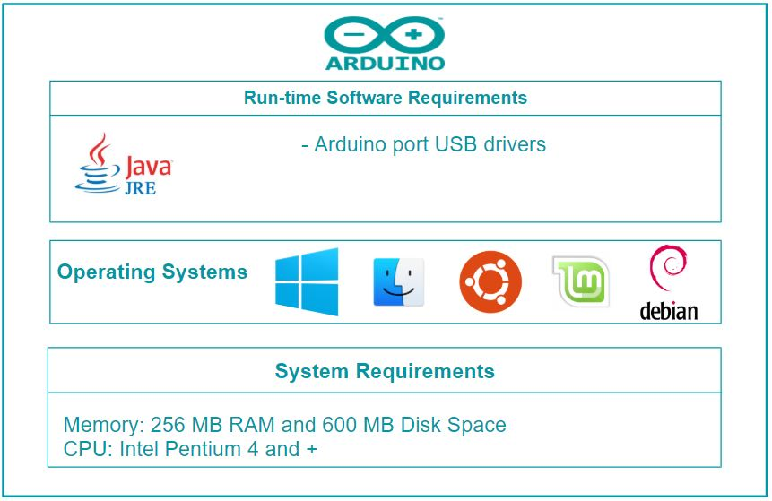

# The Arduino IDE

Authors: [Pieter Kools](https://github.com/Pieter12345), [Ivo Wilms](https://github.com/iwilms), [Diwakar Babu](https://github.com/DBabu), [Arkajit Bhattacharya](https://github.com/arkajitb)

### Table of Contents
1. [Introduction](#intro)
2. [Stakeholder Analysis](#sview)
3. [Context View](#cview)
4. [Development View](#dev)
5. [Deployment View](#dep)
6. [Technical Debt](#tec)
7. [Conclusion](#con)
8. [References](#ref)
9. [Appendix](#app)

### Introduction
Arduino is an open source electronics platform which uses simple I/O boards and a development environment to interact with the board.
Arduino boards are capable of performing multiple functionalities based on the set of instructions sent to the microcontroller.
The open-source Arduino software (Arduino IDE) is used to write code (C and C++) and upload it to the board.
This is an analysis of the Arduino IDE architecture performed by exploring the full [project on GitHub](https://github.com/arduino/Arduino).
We have aimed at providing insight into the system from different viewpoints.
These viewpoints are defined and explained by Rozanski and Woods in their book _Software Systems Architecture, Working with Stakeholders using Viewpoints and Perspectives_[[5]](#r5).
First, a context view along with stakeholder analysis is performed, followed by development view, deployment view and finally technical debt.

### Stakeholder Analysis
In this section, we identify the stakeholders involved in Arduino. The following table identifies the eleven types of stakeholders as explained by Rozanski and Woods[[5.1]](#r5_1).

|Type|Stakeholder|Small Description|
|----|---|--------|
|Acquirers|BCMI & Arduino AG Company|Massimo Banzi, CEO of the company BCMI (which acquired 100% of the Arduino AG that owns all of the Arduino trademarks), decides the future of the Arduino code[[6]](#r6) (of course with his board members' approvals).|
|Assessors|Core Developers|The Arduino company handles the legal regulations of any project that involves Arduino or using the name "Arduino" [[14]](#r14).|
|Communicators|Arduino, community|The Arduino has its own education portal (maintained by the Arduino organization) [[7]](#r7) providing kits (via the Arduino website) with the software (free to download from Github) and tips and knowledge on building and creating projects. People discuss Arduino projects and related code on [Forums](https://forum.arduino.cc/) and [StackExchange](https://arduino.stackexchange.com/). [YouTube](https://www.youtube.com/results?search_query=arduino) is found to be a medium frequently used by many users to discuss and teach Arduino to beginners.|
|Developers|Core developers, integrators, community|The core developers of the Arduino software are [Massimo Banzi](https://github.com/mbanzi) along with [Tom Igoe](https://github.com/tigoe). The frequent and active contributors and Arduino users also play an important role in developing the Arduino code, but they do not have the permission to directly push or merge their code.|
|System Administrators|Community, Arduino users|Users play the role of system administrator.|
|Suppliers|Arduino, Github|The software packages can be directly downloaded from the official website and also from [Github](https://github.com/arduino/Arduino)|
|Maintainers|Core Developers, active contributors|The Arduino IDE keeps evolving and it is maintained by the developers and contributors by creating bug fix tasks/issues and creating/handling pull requests.|
|Production Engineers|Core developers|The developers of Arduino handle the production releases and run tests on new builds.|
|Support staff|Developers, community, Arduino organization Support team|The Arduino company has a team of support staff and communicators provide support for Arduino-based applications on various forums (for example Arduino Forums) and StackExchange.|
|Testers|Core Developers and community|Developers and contributors are responsible for running JUnit tests to test the code before a PR is made, merged and officially released.|
|Users|Hobbyists, organizations, Arduino research community groups|152 user groups with each group consisting of more than 100 members are recorded throughout the globe [[8]](#r8). The applications vary from IOT to wireless applications to Robotics.|

#### Beyond the classification of stakeholders by Rozanski and Woods:
The following stakeholders identified are additional stakeholders who do not match the groups in Rozanski and Woods.

- Apart from the Arduino website, local Arduino authorized *hardware suppliers* to supply the Arduino hardware.

- *End-Users* are users who use this software to work with the hardware (creating Arduino projects) which indirectly influences the Arduino's development.

- Another stakeholder that can be considered is the *people* who work at [Arduino](https://www.arduino.cc/) company and maintain the website which provides a space where users can share their project, based on which new features are built and added.

- [Arduino blog *writers*](https://blog.arduino.cc/) is a space where unambiguous and reliable sources of information from users who use and help new developers to use Arduino can be found. Therefore, we can consider the bloggers as an indirect stakeholder.

- *Translators* contribute to translations for Arduino's documentation for the software on their [website](https://www.arduino.cc/en/main/documentation), who are active contributors for Arduino software.
#### Analyzing the stakeholder's involvement: Power vs Interest Grid
Mendelow's power-interest grid [[13]](#r13) is used to classify the groups of stakeholders that should be managed closely. Figure [1](#fig1) shows that the core developers, active contributors on Github and Arduino community are stakeholders who have both high interest and power. These are the people that actively contribute to and maintain the project and need to be managed closely. Users like teachers, bloggers that use Arduino software without many active contributions show high interest, but have very low power and must be informed well. The [dependencies](https://github.com/arduino/Arduino/blob/master/build/build.xml) have high interest and minimum power. The reason being, users usually buy Arduino shields which comes with libraries and the user can easily use them without much effort. Other users like TU Delft and GSMA show very high interest in the Arduino development, but provide fewer contributions and therefore are not categorized as active contributors.

 \
*Figure 1: Power Interest Grid of the Arduino IDE where the interest of the stakeholder is shown on the horizontal axis and the power of the stakeholder is shown on the vertical axis.*

### Context View 
The context view describes the scope and responsibilities of Arduino, i.e. its boundaries in terms of what it does or does not do. To be more precise, it defines the relationships, dependencies and interactions between the Arduino IDE and other external/internal systems, organizations, and people across these boundaries.

#### Scopes and Responsibilities
The Arduino IDE has a well-defined scope for their system. During the design process, core developers discuss what should be part of the scope for the new version. Some of the scopes for the Arduino's current versions are:

* Provide apps for MacOS, Windows and Linux.
* Arduino IDE 1.5 library format is used in tandem with its original Library Manager.
* The board manager of the Arduino IDE can be used to automatically install support for 3rd party hardware.
* New improvements are released periodically.
* Easy installation of customized libraries and command line tools.
* Sacrifice elegance of implementation over ease-of-use.
* Emphasize real use case over theoretical possibilities.
* Recognize that documentation is just as important as the code. Documentation here means the Javadocs, comments on the code that explains the particular snippets of codes.

#### Context Diagram and the External entities and Interfaces

 \
*Figure 2: Context View of the Arduino IDE describing the relationships with its environment*

A short explanation of some of the components in the context view model is as follows:

-**Developers**: [Massimo Banzi](https://github.com/mbanzi) is the main developer and co-founder of Arduino along with [Tom Igoe](https://github.com/tigoe). Additionally, active Github users/developers (for example [Christian Maglie](https://github.com/cmaglie), [Martino Facchin](https://github.com/facchinm), [David A. Mellis](https://github.com/damellis), etc.) have been a part in developing new features and maintaining the code.

-**Build Requirements**: Java Development Kit 8, Apache Ant, avr-gcc, avr-g++, git, unzip and OS-specific software such as Cygwin for Windows, Homebrew for MacOS and make and OpenJFX for Linux.[[2]](#r2).

-**Testing Framework**: The Arduino IDE makes use of JUnit4 to perform unit- and system tests. These tests can be executed from an IDE or by executing `ant test`.

-**Target Platforms**: The Arduino IDE was built to develop programs/apps for Arduino microprocessors on Windows, MacOS and Linux platforms.

-**Communicators**: Arduino users (teachers, bloggers and developers) communicate mostly on the dedicated [Arduino forums](https://forum.arduino.cc/) and on [Stack Exchange](https://arduino.stackexchange.com/).

-**Dependencies**: The Arduino IDE has a lot of dependencies as seen [here](https://github.com/arduino/Arduino/tree/master/arduino-core/lib) and [here](https://github.com/arduino/Arduino/tree/master/app/lib)  (.jar files).

-**Language**: The Arduino IDE is written in Java and is designed for C/C++ development for Arduino microprocessors.

### Development View

 \
*Figure 3: High-level architecture of the Arduino IDE.*

Figure [3](#fig3) shows the high-level architecture of the Arduino IDE, consisting of main modules `arduino-core`, `app` and `build`. The functionality of these modules will be explained in the [Module organization](#modules) section, followed by a look into the [Common Design Model](#cdmodel). The [Codeline model](#codeline) then takes a deeper look into the project structure and last, the [Stakeholders concerned with Development View](#sholder) are identified.

#### Module Organization

 \
*Figure 4: Module Organization of the Arduino IDE.*

Figure [4](#fig4) shows the various modules of the Arduino IDE and how they relate to each other.

**Modules**
- *arduino-core (Java)*  
This module contains the code required for the core IDE features. It does not contain a GUI and can be executed from the command line. The most important features are providing a serial connection to a through USB connected Arduino microprocessor, merging C code sketches with used libraries, combining compiled sketches with the right bootloader for the used Arduino microprocessor type and providing a translation framework for any feedback shown to the end user.

- *app (Java)*  
This module is built on top of the `arduino-core` module and provides the GUI that we know as the Arduino IDE. The most important components of this GUI are the code editor, the serial monitor, the serial plotter and the library manager.

- *build (binaries/images/text)*  
This module contains the additional non-Java files that are used in combination with `arduino-core` and `app` to build the distributable zip of the Arduino IDE as it can be downloaded by end users. The most important files are:
   - *The Apache Ant build file*: This file contains the build configuration of the entire project.
   - *Example sketch references*: This is a list of example sketch repositories for programming Arduino microprocessors and `sha` hashes to validate that these automatically cloned repositories indeed contain the expected content (version).
   - *OS-specific drivers*: The OS-specific drivers that allow connecting to Arduino microprocessors through USB.
   - *Native libraries*: Libraries that are required by either `arduino-core` or `app`, such as the GCC C compiler and `.dll` files on Windows for getting certain default directories.
   - *Art*: Images used by `app`.

**Dependencies**  
The project is written in Java and has the following build dependencies:
- *Apache Ant:*
Used for building the project.
- *Java Development Kit (JDK):*
Used for compiling Java sources.
- *Arduino C libraries:*
These are libraries that can be used by end users to write code for Arduino microprocessors. These are: Ethernet, GMN, Stepper, TFT, WiFi, arduino, Bridge, Robot_Control, Robot_Motor, RobotIRremote, SpacebrewYun, Temboo, Esplora, Mouse, Keyboard, SD, Servo, LiquidCrystal and Adafruit_CircuitPlayground. In essence, all libraries except the `arduino` library can be omitted. The `arduino` library contains functions that allow the user to access Arduino microcontroller functionality without having to perform direct register manipulation.
- *GCC compiler:*
Users program Arduino microcontrollers in C. The GCC compiler is used to compile that C code to machine code that runs on different Arduino microprocessor architectures.
- *launch4j:*
Used to wrap the Java project into a Windows executable.
- *Open source Java libraries:*
Several more generic open source Java libraries are used. The jars with their licenses can be viewed in the repository at `app/lib` and `arduino-core/lib`.

**External dependencies**  
The `arduino-core` and `app` modules both contain a `processing.app` package containing partially modified classes from the [Processing Development Environment (PDE)](https://github.com/processing/processing). Every now and then when the PDE project updates, those updates are also manually merged into the copied classes. In an attempt to keep this merging process as simple as possible, Arduino IDE developers attempt to keep the signature of these classes as similar to the original as possible. Modifications to these classes are made to fulfill the need of Arduino IDE specific features.

#### Common Design Model
Every version of Arduino is found to be similar due to the commonality factor, which is provided by the constraints of the development of the Arduino IDE. The main reason for this is to reduce risk and duplication of effort, in combination with increasing the system's overall coherence.

**Common Processing**  
The modules `arduino-core` and `app` consist of unique packages, including adapted packages from the [Processing Development Environment (PDE)](https://github.com/processing/processing), which were modified to fit the Arduino IDE's needs. No processes are shared.

**Internationalization**  
The Arduino community has members from different parts of the world. The [i18n](https://github.com/arduino/Arduino/tree/master/arduino-core/src/cc/arduino/i18n) translator is used to make the Arduino software more accessible to people who speak different languages.

**Standardization of design**  
The Development policy [[15]](#r15) is well documented in each area of open-source project development such as issue creation, making pull requests and code optimization. This helps developers and contributors to maintain the design standards throughout the projects life. Some design standards of Arduino are as follows:

- *Issues:* Issues are used for reporting bugs and proposing/discussing new features. The [issue tracker](https://github.com/arduino/Arduino/issues) is used to keep track of these bugs/features and allow everyone to view the discussion and code progress. When the issues are relatively easy, it normally takes 3 - 5 days to be resolved by developers. However, many issues stay open for a very long time. [Issue 134](https://github.com/arduino/Arduino/issues/134) is the oldest open issue. It has been open 6.5 years. Any bugs found in the [forums](https://forum.arduino.cc/) are also found by the developers and contributors and added to issue tracker and linked to the respective forum page.

- *Submitting Patches:* Optimizations and bug fixes are maintained separately (sometimes they are considered a low priority). Since fixing some bugs can break the flow and functionality, Arduino expects the changes to be tested on processors/boards before adding to the code. In the Arduino, issues related to code optimization are found to be resolved sooner than the bug report issues.

*Customisation of libraries:* Certain important libraries are maintained by the developers' team since they are an essential part of the code. These libraries are contributed by the community and can be seen in the [list](http://playground.arduino.cc/Main/LibraryList). Any customized libraries can be sent to [the Arduino developer forum](https://groups.google.com/a/arduino.cc/forum/#!forum/developers) for any suggestions or possible inclusion as a new entry.

- *Pull requests:* Pull requests facilitate the contribution of additional features, modification of existing features and fixing of bugs in the Arduino IDE. The points that influence the pull request decision-making process in the Arduino IDE are as follows:
1. *Desirability* - When added features would not seem to improve the Arduino software, questions about this were asked and the PR authors (and other people) were given the opportunity to explain why the PR is an improvement for the Arduino software. Even though some features in the analyzed PRs were questioned, none of these PRs were rejected for this reason.
2. *Code quality* - Developers often discussed the implementation of features. This was often about design choices such as: add or do not add an abstraction layer, where to add new API functionality, implement differently to provide more useful errors to end users and add some feature/bugfix in the targeted module or rather fix it in a dependency of that module.
3. *Test Results* - The PR authors nearly always update their PRs or supply additional information when a failed user/build test is reported. Though not directly discussed, it is likely that PRs with known errors are less likely to be merged. Exceptions to this hypothesis were OS/setup-specific errors that were not severe for the end user (minor graphical bugs, the installer not generating a desktop shortcut on Linux, etc).

#### Codeline model
The codeline models in terms of the source code structure, release process, configuration management, build and testing processes are discussed below.

 \
*Figure 5: Source code structure of the app and arduino-core module source directories.*

 \
*Figure 6: Source code structure of the app module test source directory.*

The source code structure in figures [5](#fig5) and [6](#fig6) show the main packages and top-level classes used to build and test the Arduino IDE.

**Building and Testing**  
The Arduino IDE is built using Apache Ant in combination with a Java Development Kit (JDK) and OS-specific tools for generating the executable. Building happens through executing `ant dist` (build and generate distribution zip), `ant run` (build and start) or `ant build` (build only) from the command line in the `build` directory. This effectively executes the Apache Ant build task as defined in `build/build.xml`. This build task also takes care of dependency management tasks such as downloading dependencies, unpacking dependencies, cloning git repositories and checking SHA hashes of downloaded dependencies (the .sha files are supplied in the repository). The Jenkins Continuous Integration is used to generate hourly builds and beta builds.

The `arduino-core` module does not contain any tests and the `app` module contains JUnit4 tests. The `ant test` command runs these tests. The tests are not very robust: while we tested it the results ranged from 4 to 17 test failures depending on the operating system and whether were spaces in the path. Oddly enough, these tests are not automatically executed when building locally or through the Jenkins CI.

**Release Process**  
Production engineers are majorly responsible for monitoring the releases and also control them on Github. The software release process is not much different from any other projects on Github. 
1. Changes are made on separate branches in a fork of the repository.
2. Merge request is created by a contributor and eventually checked by the production engineers.
3. Version number is used to keep track of releases.
4. Draft release is created with release notes.
5. Rebase the branch onto master and merge the pull request. When the pull request needs rebasing and the developer who performs the merge does not have write access to the pull request, it is closed and then rebased onto master on another branch and merged from there.

After these steps, the production engineer ensures that the release notes are updated properly. The release takes place after a set of pull requests has been merged.

The Arduino IDE is managed by a small set of developers and contributed to by a larger group of users and developers. Version control is used to document additional features and non-backward compatible changes. Pull requests for such changes are postponed until all changes combined are worth a version bump. Since pull requests are always built and often user-tested before merging to the master branch, the technical integrity of the master branch is maintained (it is nearly always stable). While developers do often discuss features, they less often discuss how they should be implemented. This could be because contributors are doing a good job, but it could also mean that developers mainly care about the final result. The Arduino IDE project does not have any static analysis tools and does not come with a code style template. While most of the code is consistent, there are still quite some inconsistencies (mostly whitespace usage) and the documentation (Javadoc) is poor.

### Deployment View

This section summarizes the system requirements and dependencies to successfully run the Arduino IDE.
Figure [7](#fig7) illustrates the deployment view of the Arduino IDE.

 \
*Figure 7: Deployment View of the Arduino IDE*

- *Run-time Software Requirements:* Java run-time environment is an important requirement for the installation and run-time of the Arduino IDE. 
  The Arduino IDE uses `avr-gcc` to compile the sketches written in the IDE. 
  The Arduino IDE also requires the USB drivers to be installed to connect with the Arduino board for uploading the code from the sketch.
  All of these dependencies are included within the official download on the [Arduino website](http://arduino.cc) and when building the system, which means that users don't have to install anything other than the Arduino IDE.
- *Operating System:* the Arduino IDE is built on Processing modules and Java, both of which are cross-platform.
  There are no official sources about the minimum version requirements for the Arduino IDE.
  A lower bound can be derived however by looking at the minimum system requirements for Java 8.0, the main dependency for the Arduino IDE.
  The following information is based on the minimum requirements for Java 8.0, which can be found on the Java website [[16]](#ref16).
  Java is supported on Windows Vista SP2 and above. 
  For Windows 10, Java version 8u51 is required to run.
  For Macs, it requires OS X version 10.8.3 or above.
  The [Arduino website](http://arduino.cc) states that any Linux flavor should work and that only the architecture (Intel 32 bit, Intel 64 bit, ARM) matters [[17]](#ref17).
  This is correct for recent installations of Linux, but not all older versions can run the IDE.
  The following list is a list of officially supported Linux distributions that are officialy supported by Java:
  + Oracle Linux 5.5+
  + Oracle Linux 6.x (32-bit), 6.x (64-bit)
  + Oracle Linux 7.x (64-bit) (8u20 and above)
  + Red Hat Enterprise Linux 5.5+, 6.x (32-bit), 6.x (64-bit)
  + Red Hat Enterprise Linux 7.x (64-bit) (8u20 and above)
  + Suse Linux Enterprise Server 10 SP2+, 11.x
  + Suse Linux Enterprise Server 12.x (64-bit) (8u31 and above)
  + Ubuntu Linux 12.04 LTS, 13.x
  + Ubuntu Linux 14.x (8u25 and above)
  + Ubuntu Linux 15.04 (8u45 and above)
  + Ubuntu Linux 15.10 (8u65 and above)
- *Hardware Requirements:* For the Arduino IDE to install and run, the system is required to have 256 MB RAM on top of the requirements for the operating system, CPU with Pentium 4 or above.
- *Network Requirements:* the Arduino IDE requires a network connection to check and download updates for both the IDE and libraries.
  The updates are downloaded from the Arduino website, specifically [http://www.arduino.cc/latest.txt](http://www.arduino.cc/latest.txt).
  The IDE adds parameters to the URL with specifics about the OS when getting the latest version number.
  The libraries specify their own URL for where to check for updates.

### Technical Debt
Technical debt is a concept that represents the difference between the actual solution and the ideal solution. 
Choosing an easy, non-ideal solution that is often faster to implement can seem like a good solution, but it can mean that even more work has to be done in the future when working with this non-ideal solution. 
In computer science, this includes things such as not writing proper documentation, leaving unused or outdated files/code in the project, not creating proper abstraction layers for components that are subject to change and not writing automated tests for new code. There are several forms of technical debt, some of which are discussed below.

#### Design Debt
Design debt is created by developers making poor design choices for the system.
To analyze a part of the design debt, we have used the static analysis tool [PMD](https://pmd.github.io/latest/pmd_rules_java_performance.html) to identify code smells.

##### Code Analysis
PMD helps in identifying five types of code violations : Blocker, Critical, Urgent and Warning violations.
As per PMD, there are more than 3500 violations, which made it impossible to analyse all of them.
Thus, we reduced the scope to Blocker and Crititical violations, which reduced the number of violations to approximately 200.

###### Blocker and Critical Issues
We have observed the below mentioned blocker violations : 

* Formal Parameter Naming Convention: The parameter names provided do not follow the naming convention provided by [Java Code Style guidelines](#r20).
* Avoid throwing raw exception type: Runtime exception is used rather than using Exception subclasses (e.g. ArithmeticException and ArrayTypeException).
* Variable naming convention: The variable names provided do not follow the naming convention provided by [Java Code Style guidelines](#r20).
* Avoid file stream: FileInputStream has been instantiated which can lead to long garbage collection pauses.
* Constructor calls overridable method: Calling overridable methods during construction might result in invoking methods on an incompletely constructed object, which can make the debugging process difficult. 

Most of the blocker issues were related to parameter and function naming conventions.
In addition to the above mentioned issues, we found many critical violations like reassigning values to incoming parameters.
That said, it has to be mentioned that PMD inspects and compares the code with some often used [Java Code style guidelines](#r20).
A tool such as PMD cannot truly determine how bad code is, it is instead used to ensure that code (and later edits to it) follows certain rules consistently, leading to a consistent code base over time.
Another issue which is observed a lot in Arduino code is the lack of documentation and inconsistent code style which makes it difficult to understand all the functionalities.
To summarize the above mentioned observations, it can be concluded that the code smell is quite high for the Arduino IDE project.

##### Issue Analysis
There are multiple issues related to the Arduino IDE.
For instance, [#6951](https://github.com/arduino/Arduino/issues/6951) proposed that 'Ctrl+F' in mac opens the find and replace window and it takes roughly half a second for the cursur to move to the new window.
This issue was raised because of a couple of commits([0d50f0b](https://github.com/arduino/Arduino/commit/0d50f0bb6c6baf8bf750cd268451418c8cd81e21) and [65103aa](https://github.com/arduino/Arduino/commit/0d50f0bb6c6baf8bf750cd268451418c8cd81e21)) related to another issue[#6603](https://github.com/arduino/Arduino/pull/6603).
The issue mentioned was reported as a bug and it is difficult to implement the change in Java.
This shows lack of end-to-end testing to find the impact of a change in other functionalities of the IDE which doesn't really reduce the count of issues as it might lead to another issue.
In total, there are 110 open issues related to the Arduino IDE  which still needs to be taken care of.

##### Historical Analysis
We have compared the code for the previous releases of the Arduino IDE(ide-1.0.x and ide-1.5.0.x) using PMD to understand the evolution of the design debt over time.
It has been observed that a lot of files were removed and added during the process.
As per PMD, the number of violations increased with the newer version (1.5.x).
Although this comparison do not mean that there will be more problems in future assuming that both the versions didn't take code practices in account, it is important for any open source project to follow a coding style which leads to a consistent code base. 
A static analysis tool could have had an impact on this project as the code quality would have stayed roughly the same which is important for a project like the Arduino IDE with more than 100 contributors.

#### Documentation Debt
Documentation is of great importance in any project for both developers and users. It is very important for a project like the Arduino IDE since it allows developers to more easily find the code they want to edit and understand how the current code works.
With proper documentation, one would have to read less code to understand what's happening. Proper documentation also makes it easier to compare what some method/function does with what it should do.
It is equally important for users as well to understand the installation procedure and navigation of the software which can be made easy only by proper documentation.
We have checked issues related to documentation raised in the past and we have observed that the type of issues, i.e. typos and inconsistency in documentation, still remains the same.
This follows from our analysis of the issues. Some examples are mentioned below.

##### Issue Analysis
This section looks into issues related to the documentation about Arduino IDE.
There are 105 open issues related to documentation.Thus, the documentation debt seems to be really high.
For instance, [issue 1055](https://github.com/arduino/Arduino/issues/1055) is about the improper documentation of *pins_arduino.h*, which is important to meet the needs of custom-designed boards.
Another issue in Arduino documentation is the inconsistency of data.
There were issues raised regarding the inconsistency in data in the website and the documentation.
For example, in Issue [#8086](https://github.com/arduino/Arduino/issues/8086), the FPGA chip number was wrongly mentioned in the documentation.

#### Test Debt
The Arduino IDE consists of two projects: 'app' and 'arduino-core'. The 'app' project contains JUnit tests and the 'arduino-core' project contains no tests at all. However, since the 'arduino-core' project is used by the 'app' project, it is indirectly tested. 
In total, there are 65 tests and some of them may fail based on the Operating system(macOS,Linux or Windows) and its version.
The results of running a test with instruction coverage are shown below:

 \
*Figure 8: Test Coverage*

From the above table, it can be observed that the test coverage for arduino-core is only 15.1% and for app it is only 5.9%.
From the observations above, we can conclude that the testing debt for Arduino is very high.

#### Project Debt
The project debt is quite high for the Arduino IDE as there are 920 open issues and 160 pull requests still to be taken care of. 
Since the core developers are responsible for testing the pull requests, it becomes nearly impossible to keep track of all the pull requests on time and perform a thorough check before merging them.

### Suggestions
To avoid documentation debt, we suggest the contributors to properly document their changes in relevant places.
Moreover, core developers should refuse to merge the code if proper documentation is not present.
In addition to the above mentioned points, there should not be any inconsistencies in different documents regarding a common topic.
The backlog of issues can be a symptom of technical debt which should be considered.
Similar to 'CONTRIBUTING.md' file which serves as a checklist before contributing to the repository, a file should be added to the repository regarding the code style guidelines which have to be followed for any contribution. 

### Conclusion
In this chapter the architecture of the Arduino IDE was analyzed using the viewpoints described by Rozanski and Woods in their book _Software Systems Architecture, Working with Stakeholders using Viewpoints and Perspectives_[[5]](#r5).
The _stakeholder view_ identified the stakeholders involved in the project.
The stakeholders were analysed using a Power vs Interest grid which led to the conclusion that stakeholders with highest interest and power include the core developers, active contributors on Github and the Arduino community.
In the _context view_ we identified the scope and responsibilities of the Arduino IDE and visualized it in a context diagram which shows the relationships, dependencies and interactions between the Arduino IDE and other external/internal systems, organizations, and people across these boundaries.
The _context view_ showed that Arduino has a well-defined scope for their system.
The _development view_ discussed the module organisation, common design model and codeline model in detail.
The _deployment view_ summarized the system requirements and dependencies to successfully run the Arduino IDE.
Finally, the analysis performed in _technical debt_ helped us to understand that there are lots of possible improvements to the project when it comes to code smells, documentation and test coverage.

In conclusion, Arduino is a very interesting project maintained by highly skilled engineers, but it would benefit from more active efforts to reduce the technical debt.

### References 
 1. https://en.wikipedia.org/wiki/Arduino_IDE

 2. https://github.com/arduino/Arduino/wiki/Building-Arduino

 3. [Comparing prototype platforms](https://www.electronicproducts.com/Board_Level_Products/Single_Board_Computer/Comparing_prototype_platforms_Arduino_Raspberry_Pi_BeagleBone_and_LaunchPad.aspx)

 4. [Arduino Documentation](https://www.arduino.cc/en/main/documentation)

 5. [Software Systems Architecture, Working with Stakeholders using Viewpoints and Perspectives by Nick Rozanski and Eoin Woods](https://www.viewpoints-and-perspectives.info/)

 5.1. [Stakeholders](https://www.viewpoints-and-perspectives.info/home/stakeholders/)

 6. [A new era for Arduino begins today](https://blog.arduino.cc/2017/07/28/a-new-era-for-arduino-begins-today/)

 7. [Teaching, Inspiring and Empowering!](https://www.arduino.cc/en/Main/Education)

 8. [Arduino user groups](https://www.arduino.cc/en/aug/)

 9. [Story and History of Development of Arduino](http://www.circuitstoday.com/story-and-history-of-development-of-arduino)

 10. [Arduino authorized distributors](https://store.arduino.cc/distributors)

 11. [Development Policy](https://github.com/arduino/Arduino/wiki/Development-Policy)

 12. [AUniter and Jenkins](https://github.com/bxparks/AUniter)

 13. Olander, S., & Landin, A. (2005). Evaluation of stakeholder influence in the implementation of construction projects. International journal of project management, 23(4), 321-328.

 14. [Arduino Policy](https://www.arduino.cc/en/main/policy)

 15. [Development Policy](https://github.com/arduino/Arduino/wiki/Development-Policy)

 16. [The minimum system requirements for Java 8.0](https://www.java.com/en/download/help/sysreq.xml)

 17. [Guide for installating the Arduino IDE on Linux](https://www.arduino.cc/en/guide/linux)

 18. https://github.com/arduino/Arduino

 19. [Understanding Technical Debt](http://www.michaelportwood.com/Quick-Tips/Understanding-Technical-Debt.htm)

 20. [Java Code style guidelines](http://www.cs.cornell.edu/courses/JavaAndDS/JavaStyle.html#CamelCase)

## Appendix

To identify the decision-making process for which PRs get merged and which PRs get accepted, we analyzed some PRs.
This appendix describes the key points for that analysis.
First a description of what happens for most PRs is given.
After that, we will take a closer look at the kind of tradeoffs that need to be decided.
We will finish with the reasons a PR can be rejected.

PRs can be divided into two categories: a _bugfix_ fixes a bug, while a _feature PR_ adds a new feature or changes an existing feature.
Bugfix PRs are basically always considered, as a bugfix is never undesired.
For the feature PRs, the core developers first consider whether they want the feature.
They do this by weighing the usefulness of the feature versus how much more the feature would complicate the IDE for new users.
There are few PRs that get rejected because of this tradeoff.
This is presumably because contributors make an issue (or read existing issues) where they will be told that the feature is not desired before they implement the feature and make a PR for it.
Nevertheless, an example of a PR that was rejected because it introduced an unwanted feature is [PR #2073](https://github.com/arduino/Arduino/pull/2073).

If the PR isn't rejected outright, it is iterated upon until the PR is either accepted or rejected.
During that iteration, the code is reviewed and tested by the community and the core developers.
Based on those reviews and tests, the following steps all happen simultaneously:
- If bugs are reported, they will often be resolved by the original author.
- Code quality issues (e.g. duplicate code) will also be reported and fixed.
- Finally, tradeoffs will be discussed with the core developers and the community.
If the PR hasn't been rejected before this point, it will be merged.

Most of these tradeoffs happen on some level for all PRs, but the choice is so clear that it doesn't really count as a tradeoff.
But once every so often, there is a genuine tradeoff and the core developers need to provide guidance to the community in which way they want the project to go.
The tradeoffs that we found in our analysis are:
- _Amount, severity and likelihood of being fixed of known bugs vs desirability and urgency of the PR_ \
  Sometimes, a known bug in a PR can't easily be fixed, or the PR has a certain urgency to it.
  In cases like these, the core developers must decide whether to accept these known bugs in order to merge now or to defer merging until the bug is fixed. \
  In most cases, there is no urgent need for the PR to be merged, and the developers will just defer merging until all known issues are fixed, for example in [PR #4519](https://github.com/arduino/Arduino/pull/4519).
  However, sometimes it will take too long for the PR to be fixed.
  If the PR is desirable enough, the core developers may choose to merge the PR with the bug still unsolved.
  While this may seem unwise, improving software is inherently an iterative process.
  Waiting for each PR to be perfect would ensure that PRs never actually get merged.
  So, imperfect PRs get merged with the assumption that if the problems are bad enough, they will get fixed in a later PR, and if they don't get fixed then they apparently weren't that important. \
  An example of a PR getting merged with existing bugs was [PR #4515](https://github.com/arduino/Arduino/pull/4515).
  It works around some suboptimal design, but it introduced a new bug on a specific board.
  In this case, the core developers decided that the new bug was specific enough that only a few users would be affected by it (the original author couldn't reproduce the bug), while fix in the PR affected significantly more users.
  For this reason, they merged the PR with the new bug still unfixed.
- _Overhead vs functionality_ \
  On the Arduino itself, resources are limited.
  This means that adding new functionality can add significant overhead.
  For example, [PR #1803](https://github.com/arduino/Arduino/pull/1803) proposed to add a functionality related to USB descriptors.
  But the implementation would add a constant overhead of over 800 bytes, more than 20% of the flash memory that was used without the PR.
  This overhead existed even when the code would not be used.
  Such high overhead was unacceptable to the core developers, so they required the overhead to be reduced before merging.
- _Proper code design that requires a refactor vs a workaround that works now_ \
  While in theory it is better to not incur design debt by allowing badly designed code, there is always a tradeoff between the cost of doing a refactor to make something work and the cost of doing it quickly now but a possibility for higher cost in the future.
  An example of a decision on such a tradeoff can be found in [PR #2681](https://github.com/arduino/Arduino/pull/2681) and [PR #1803](https://github.com/arduino/Arduino/pull/1803).
  In #2681, the core developers chose to accept technical debt and merge code that added another rule to an already complicated set of rules instead of solving it properly.
  In #1803, there was a simple and powerful solution that exposed internals of the IDE.
  While the community was in favor of it, the core developers were against it as that would mean people would start depending on those internals, which would make it almost impossible to change them.
  For this reason, the PR did not get merged and eventually became outdated.
- _Ease of implementation vs usability_ \
  In general, making something easier for the user requires more effort on the part of the programmer and increases the complexity of the code.
  Deciding here requires a good understanding of what can be expected of the user.
  Because the Arduino IDE is supposed to be simple to use for inexperienced users, the core developers will almost always take the option that is simpler for the user, even if it adds complexity and development time.
  Examples of this can be seen in [PR #1803](https://github.com/arduino/Arduino/pull/1803) and PRs [#3549](https://github.com/arduino/Arduino/pull/3549) and [#4457](https://github.com/arduino/Arduino/pull/).

Finally, we will look at some of the reasons why a PR can get rejected.
- If the original author stops responding, the PR has a high chance of being rejected.
  If the code is good, someone else can copy it to their own fork and open a new PR, as was the case for [PR #3549](https://github.com/arduino/Arduino/pull/3549), which was continued in [PR #4457](https://github.com/arduino/Arduino/pull/4457).
- A PR may also be rejected if the code got merged some other way, like the previous point where someone else opened a new PR, or like [PR #7029](https://github.com/arduino/Arduino/pull/7029), where the code had already been merged in a rebase at some point.
- A PR is rejected when a it becomes outdated, i.e. the underlying code has been changed so much that it isn't worth the effort of making the PR up-to-date again.
  Alternatively, it may even not be possible in the way it was originally implemented, and implementing the feature is better done from scratch.
  An example of this are [PR #3549](https://github.com/arduino/Arduino/pull/3549) and [PR #4457](https://github.com/arduino/Arduino/pull/4457), which were superseded by [PR #4517](https://github.com/arduino/Arduino/pull/4517).
  The latter made a better approach available and therefor made #3549 and #4457 outdated.
  Another example is [PR #1250](https://github.com/arduino/Arduino/pull/1250), which was closed because it was outdated. @cmaglie opened a new one: [PR #1726](https://github.com/arduino/Arduino/pull/1726).
- PRs are rejected when a better approach becomes / is available and has been implemented.
  Approaches are seldomly clearly better.
  Instead, there will be tradeoffs: one approach is better in one area, the other approach is better in another area.
  Which of the two is "better" is determined by discussing the tradeoffs, often in both PRs.
  Then, one of the core developers decides which PR to take.
  An example is [PR #3549](https://github.com/arduino/Arduino/pull/3549) and [PR #4457](https://github.com/arduino/Arduino/pull/4457) mentioned above, which were superseded by [PR #4517](https://github.com/arduino/Arduino/pull/4517), which made a better approach available and therefor made #3549 and #4457 outdated.
