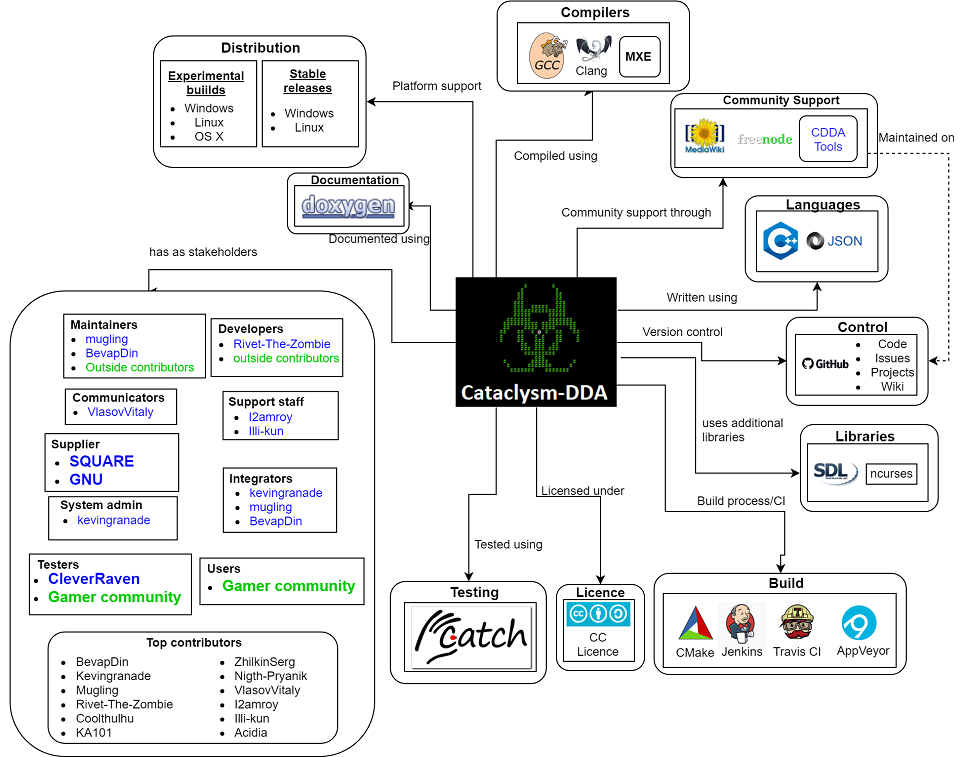
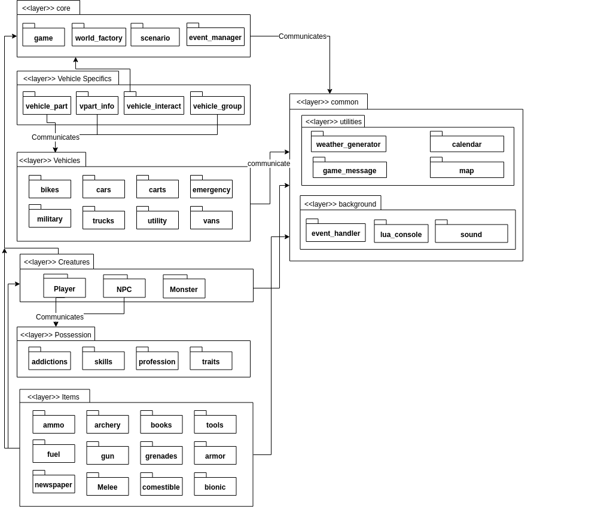
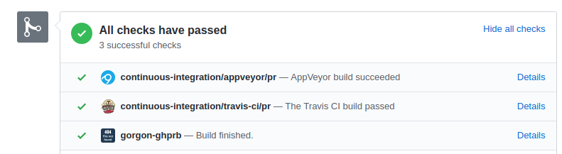
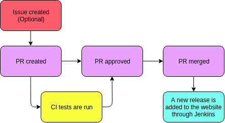
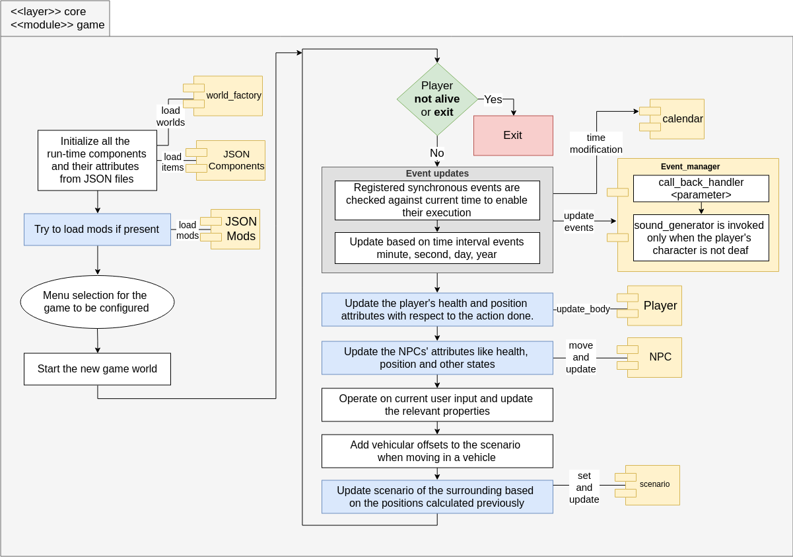
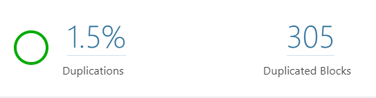
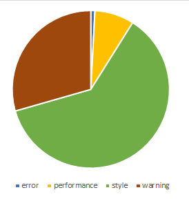
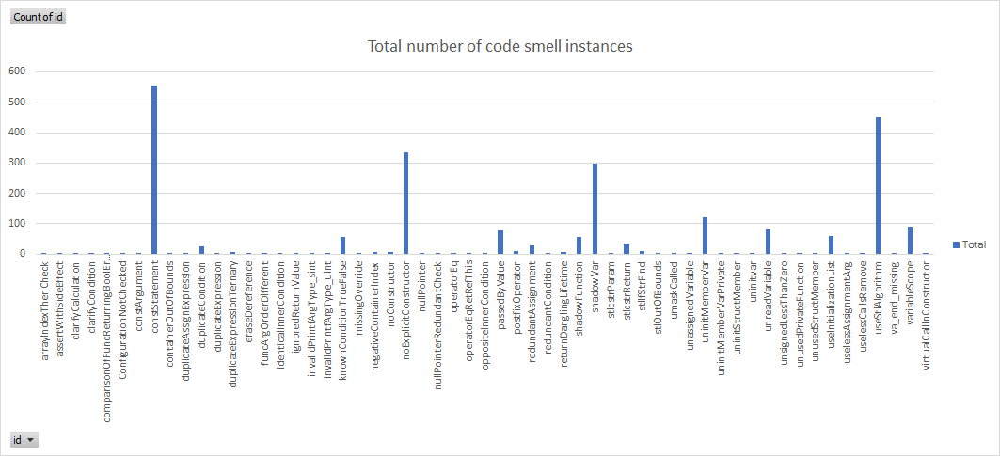
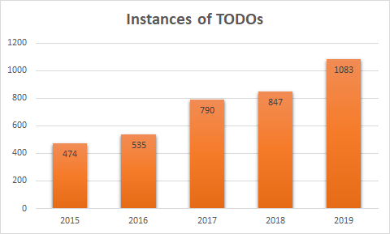

<!--- 
Welcome to the markdown file for Cataclysm Dark Days Ahead

- Please use the `images` folder to store all the images related to this
  document.
- The link references should go at the end of the document.
- To create a comment use the HTML comment syntax, it is also preferred to use 
  3 dashes instead of 2
- Enjoy
-->

# Cataclysm: Dark Days Ahead _(CDDA)_

[Aniket Samant](https://github.com/asamant), [Gerardo Moyers](https://github.com/gerardomoyers), [Joan Marce Igual](https://github.com/jmigual), [Naveen Chakravarthy](https://github.com/naveenspace7)

## Table of contents

- [Introduction](#introduction)
- [Stakeholders](#stakeholders)
- [Context Viewpoint](#context-viewpoint)
- [Development Viewpoint](#development-viewpoint)
- [Functional Viewpoint](#functional-viewpoint)
- [Technical Debt](#technical-debt)
- [Conclusion](#conclusion)
- [References](#references)
- [Annex A - PR Analysis](#annex-a---pr-analysis)

## Introduction

Cataclysm: Dark Days Ahead is a turn-based survival horror game that takes place in an post-apocalyptic world, in which there is no specific goal, and the basic aim is to survive as long as you can. The game was originally developed by Whales as open-source game under the name Cataclysm. In the days which followed, Whales brought its development to an end. The gaming community later forked the game and renamed it to Cataclysm: Dark Days Ahead (CDDA). The game is available in two graphical versions: text and graphical tile based.

It is now the property of an organization called [CleverRaven](https://github.com/CleverRaven). Most of the information of C:DDA can be obtained from two important sources:
- The [project][cataclysmURL] page
- The [GitHub][cataclysmGithub] page which includes:
    - Issues
    - Project evolution during time

## Stakeholders

<!-- github link:[Cataclysm: Dark Days Ahead](https://github.com/CleverRaven/Cataclysm-DDA/graphs/contributors) -->

By looking at the [github contributions](https://github.com/CleverRaven/Cataclysm-DDA/graphs/contributors) the most active stakeholders in CDDA project are [_BevapDin_](https://github.com/BevapDin), [_Kevingranade_](https://github.com/Kevingranade), [_Mugling_](https://github.com/Mugling), [_Rivet-The-Zombie_](https://github.com/Rivet-The-Zombie), [_Coolthulhu_](https://github.com/Coolthulhu) and [_KA101_](https://github.com/KA101). Using the definitions of Rozanski and Woods, the _stakeholders_ can be classified into:

**Acquirers**: _Oversee the procurement of the system or product_

The members of CleverRaven have the rights of the game. They are responsible for the budget of the project and the systems acquisitions.

**Assessors**: _Oversee the system's conformance to standards and legal regulations_

Creative Commons Attribution-ShareAlike is in charge of the regulations and licensing of C:DDA.

**Communicators**:  _Explains the system to other stakeholders via its documentation and training materials_

[_VlasovVitaly_](https://github.com/VlasovVitaly) is in charge of uploading the different languages, and most of his contributions are based on this topic.

**Developers**: _Construct and deploy the system from specifications (or lead the teams that do this)_

[_Rivet-The-Zombie_](https://github.com/Rivet-The-Zombie) and outside contributors are the project's developers.

**Maintainers**: _Manage the evolution of the system once it is operational_

Most of the outside contributors make small changes to the code to maintain it. [_Mugling_](https://github.com/Mugling) and [_BevapDin_](https://github.com/BevapDin) make changes to the code to keep the game operational in the best way possible. 

**Suppliers**: _Build and/or supply the hardware, software or infrastructure on which the system will run_

C:DDA runs with different fonts like [SQUARE](http://strlen.com/square/) and [GNU unifont](http://unifoundry.com/unifont/index.html), [Catch](https://github.com/catchorg/Catch2) being the suppliers.

**Support staff**: _Provide support to users for the product or system when it is running_

[_I2amroy_](https://github.com/I2amroy) and [_Illi-kun_](https://github.com/Illi-kun) support the game together with outside contributors.

**System administrators**: _Run the system once it has been deployed_

[_Kevingranade_](https://github.com/Kevingranade) is the most active system administrator. He analyzes the changes to be approved or rejected, and is considered the most important stakeholder of the project.

**Testers**: _Test the system to ensure that it is suitable for use_

These are the gamers and CleverRaven members. They detect bugs in the game.

**Users**: _Define the system's functionality and ultimately make use of it_

System administrators are the users since they run the game.

The definitions given by Rozanski are really accurate, and there are also other types of stakeholders such as **_customers_** who treat the software as a product that passes through their systems. In this case they would be the gamers that identify a bug in the game and inform about it in GitHub. Other possible stakeholders are the **_competitors__** - C:DDA is a game where new worlds can be created like in [Minecraft](https://minecraft.uptodown.com/windows); however there is a huge quality gap between them, probably due to the latter being much more popular. Nevertheless, there are more type of stakeholders which are not contained in this project. For instance, C:DDA doesn't have any **_sponsors_**. 

Stakeholders are an important part of any architecture - when a change needs to be made, a stakeholder analysis helps address that change to the people that can actually help. This analysis saves a lot of time in the future when an update is needed.

### Integrators

Three stakeholders manage the changes made in the project. These are [_BevapDin_](https://github.com/BevapDin), [_Kevingranade_](https://github.com/Kevingranade) and [_Mugling_](https://github.com/Mugling). They are supposed to maintain the coding style. Also, making really small changes is not accepted but fixing spelling mistakes is. Bug fixes are extensively verified before they are accepted.

Solving an issue is not a trivial task. Even thought the issue is solved in terms of programming, there are some factors that have to be taken into account like the writing style and not adding more bugs instead.  

### Relevant people to contact

After analyzing the project's stakeholders, four contributors have been found to have the biggest understanding of the project code and its goal. These are:

1. [Kevingranade](https://github.com/kevingranade)
2. [Rivet-The-Zombie](https://github.com/Rivet-the-Zombie)
3. [BevapDin](https://github.com/BevapDin)
4. [Mugling](https://github.com/mugling)

## Context Viewpoint

<!--- Context view from Chapter 16 of the book -->

Apart from the stakeholders described in the previous section, the project relies heavily on some external entities as well for successful development and release, and those are dealt with in the subsections that follow.

### System Scope and Responsibilities

C:DDA is a video game designed to run on a laptop or a desktop computer. C:DDA gives the users an uncompromising survival scenario, and it also helps gamers in developing problem-solving abilities. This game only has the responsibility of entertainment for users, with the highest quality achievable. 

### Distributions

The game is available in the form of:
- *Stable Releases* (Windows and Linux platforms)
- *Experimental Builds* (Windows, Linux, and OSX platforms)

Moreover, the Experimental has two different types:
- *Console* (referred as Terminal): the game is run like a console application, with graphics being represented using ASCII characters, and
- *Graphical* (referred as Tiles): the game is run with additional graphical elements.

Android builds are also available, and are available on the game's [Releases](https://cataclysmdda.org/releases/) page.

### Development and Contributions

#### Development

The game is mainly written in C++, and most of the data (mods, items, NPCs, etc.) is present in the form of [JSON files](https://github.com/CleverRaven/Cataclysm-DDA/blob/master/doc/JSON_INFO.md). Additional scripts (lua, Python) are also used in the build process. i18n support is also added to support multiple languages.
[SDL](https://www.libsdl.org/) and [ncurses](https://www.gnu.org/software/ncurses/ncurses.html) are also used.

#### Compilers

The game can be compiled using the following:
- GCC
- Clang
- MXE

#### Version Control

The project is hosted on GitHub and the *Code, Issues, Wiki, and Projects* pages are used for their respective purposes. Any new contribution has to raise an issue or post a pull request.

#### Build Processes

[CMake](https://cmake.org/) is used for development purposes although it can build the project unofficially. For official builds, the [Makefile](https://github.com/CleverRaven/Cataclysm-DDA/blob/master/Makefile) in the project's root directory is used.

The project uses [Jenkins CI](https://jenkins.io/) for its daily builds, and also uses [AppVeyor](https://www.appveyor.com/) and [Travis CI](https://travis-ci.org/) for continuous integration of pushed code.

### Testing

The [Catch unit test framework](https://github.com/catchorg/Catch2), based on Boost libraries, is used for performing unit tests on the code.

### Community Support

The project has a [dedicated website][cataclysmURL], a [dedicated discussion forum](https://discourse.cataclysmdda.org/), a series of [web tools](http://tools.cataclysmdda.com/) hosted through another [GitHub project](https://github.com/drbig/cddatools), and is also supported through an [IRC channel](https://webchat.freenode.net/?channels=#CataclysmDDA). There is also a [wiki page](http://cddawiki.chezzo.com/cdda_wiki/index.php?title=Main_Page) for all the game related information.

### Documentation

[Doxygen](http://dev.narc.ro/cataclysm/doxygen/index.html) is used to document the entire codebase, in addition to having documentation files in the GitHub repository for contribution guidelines, compiling, etc.

### Licensing

The project is licensed under the [Creative Commons Attribution-ShareAlike 3.0 Unported License](https://creativecommons.org/licenses/by-sa/3.0/).

## Development Viewpoint

### Introduction

CDDA is a vast project with approximately 251k lines of code (as reported by SonarQube). The structure of the files is not considered to be the best given the way everything is structured (more depth analysis done in the later sections). All the source files are contained at a single level making the code management very difficult. To get a clear understanding for the development view, efforts were put to segregate the monolithic module into components to enable clear visualization of the underlying functionality.

### Module Organization

Most of the information is taken from the documentation [^6]. Each component defined in the following diagram is presented in the code in the form of classes. These components are categorized into layers with respect to their functionality and level of operation.

*core*: This layer is mainly responsible for setting up the environment of the game, initializing all the components that are required, and orchestrating the complete game. Every single layer given in this diagram either directly or indirectly communicates with the core layer. The core layer also in turn communicates with another layer called common layer which is mainly responsible for other supplementary functionalities.

*common*: Contains all the modules that are going to be processed by all other modules present in other different layers. All components in this layer are modified as part of their feedback to an action that took place as part of interaction in the game.

*Vehicle Specifics*: This layer contains the components that support vehicle functionalities and interface to the modules present in the core level.

*vehicles*: This layer contains the components whose instance are created from JSON files to make the maintenance easy. Each of these components is mainly responsible for ease of mobility of the player.

*creatures*: Each of the components under this layer is the living being that is either harmful or harmless. NPCs (Non-Playable Characters) could include doctor, pets, etc., while monsters include zombies, vampires, etc.

*possession*: Contains all the components that are modeled as behavioral attributes for the player and the NPCs. This layer contains all the components that consist of various kinds of attributes the player possesses which are represented in the form of classes to allow flexibility in interactions.

*item*: This layer contains all the components that are instantiated dynamically during gameplay. Each of the components defined in this layer is supplied in the form of JSON files to enable maintainability.

### Common design models

As a way of reusing code, Cataclysm-DDA uses a library in order to render the game's graphics, and the library is chosen at compilation time:
- **ncurses** if the game has to be rendered in a terminal
- **SDL** if the game is directly rendered in its own window with sprites

#### Standardized design

Cataclysm-DDA accepts all types of contributors. However, they have to respect some rules when contributing in order to be accepted.

There is a [`CONTRIBUTING.md`](https://github.com/CleverRaven/Cataclysm-DDA/blob/master/.github/CONTRIBUTING.md) file  [^2] that states the rules that have to be followed. When contributing there is a commit template that is specified in the [`.gitmessage`](https://github.com/CleverRaven/Cataclysm-DDA/blob/master/.gitmessage) file [^3] and that all the developers must follow. Moreover, when creating a pull request the first line of the description needs to be a summary line with a specific format that will be later used to create the release changelog.

Also, to ensure that all the code has the same style there are some styling rules for C++ defined in the [`CODE_STYLE.md`](https://github.com/CleverRaven/Cataclysm-DDA/blob/master/doc/CODE_STYLE.md) document [^4].

In the [`JSON_INFO.md`](https://github.com/CleverRaven/Cataclysm-DDA/blob/master/doc/JSON_INFO.md) document [^5] the contents for all the JSON files are described and the syntax that should be used in the files, there's a total of 96 JSON files specified. The files are classified into general files describing some game messages and basic items, item files adding objects to the game, requirement files that set the required items for crafting some objects and vehicle files that describe different types of vehicles and how they are used.

### Codeline Organization
In this section it is explained how the code is managed, tested and built.

The [source code](https://github.com/CleverRaven/Cataclysm-DDA/tree/master/src) is structured in a "flat" form, in that there are no subdirectories within the source directory, and it is difficult to understand purely by looking at the code structure (file names) what the various responsibilities of the files are (for instance, `fungal_effects.cpp` or `melee.cpp` provide no idea what the meaning could be).

#### Testing

The testing system is mostly automated. Even thought testing is an important part of software Cataclysm only covers almost one third of the code with tests.

##### Testing framework

The project uses [Catch](https://github.com/catchorg/Catch2) as the testing framework. All the tests are located in the [`tests/`](https://github.com/CleverRaven/Cataclysm-DDA/tree/master/tests) directory and every test file tests a different file from [`src/`](https://github.com/CleverRaven/Cataclysm-DDA/tree/master/src). Not all the code is covered by the tests since the total coverage is around 29%, this measurement is done through [Coveralls](https://coveralls.io/github/CleverRaven/Cataclysm-DDA?branch=master).

##### Continuous integration

Continuos integration is a development technique used when many developers work together changing parts of the code. It is usually used every time that there's a pull request or a release in order to check the new changes and look for errors as soon as possible. C:DDA uses [Travis CI](https://travis-ci.org/CleverRaven/Cataclysm-DDA) to check Linux and MacOS builds and [AppVeyor](https://ci.appveyor.com/project/kevingranade/cataclysm-dda) to check Windows builds.

Through the CI, they make sure that the code compiles properly and then they execute the tests to check that the new changes do not break any existing code. There's also an additional test that builds the code and deploys a new build if it is merged, it also checks for a properly formed pull request message. They use [Jenkins](https://ci.narc.ro/) in this last check.

#### Building

Cataclysm has major versions (`0.C` and `0.D`) but the release daily builds. This means that every day when a pull request is accepted this is uploaded into the [releases page](http://dev.narc.ro/cataclysm/jenkins-latest/Linux_x64/Tiles/). 

The building process is done through GNU make. The makefile defined has different options to create a _release_ or a _debug_ build that can be defined when calling make. The makefile also supports different platforms so from one platform it can be build for other ones. In general from Linux it can be compiled to Windows, Mac OS or Android as a cross-compilation option.

#### Release

The releases of the game are automatically created and uploaded into the release website [^7] every time that a pull request is merged by using a Jenkins script.

#### Instrumentation

Another way that the developers use to know how the game is behaving is through instrumentation. This is done through debug builds that print messages to the console that later can be used to understand how the code was behaving when an error ocurred. This is the default build method of Cataclysm-DDA and to disable it the flag `RELEASE=1` has to be added when calling `make`.

## Functional Viewpoint

As part of a new perspective, we chose to add this viewpoint as it is more relevant in terms of the game structure. The game is [turn-based](https://en.wikipedia.org/wiki/Turn-based_strategy) in which the player makes a move (turn), the NPCs subsequently make their own moves, and then the control is returned to the player ad infinitum. This sequence goes on till the user decides to quit the game (or is killed). 

Based on this idea, the game is run in the form of a single `while` loop which calls several functions related to each character's turn and their interactions related to other components. From a high-level perspective, the functioning of the game can be represented graphically as seen below

<!-- Is "modules" the right title? -->
### Modules 

Since the game is supported on multiple platforms (Android, Windows, OSX, and Linux) with multiple builds (Tiles and Curses), some of the platform-specific functional elements are compiled accordingly (using `#ifdef`). Moreover, there are [mods](http://cddawiki.chezzo.com/cdda_wiki/index.php?title=Mod_manager) available which are loaded at run-time depending on installations.

### Game Elements and Interactions

This section is based on manual code inspection to understand what the various elements do and how components interact.

#### Main flow 

- A `game` instance is instantiated during the start of the game with a *unique_pointer*, to make sure there can only be one instance of the game running.
- As stated previously, the game runs in the form of a `while` loop whose exit is handled if the player quits the game.
<!-- - Each iteration has a "turn" value based on which either an NPC's or the player's action is performed -->
- The class `game` consists of all functions required to run the game and display the UI.

Below are some important modules that are crucial during the run of the game.

#### game

The `game` module's `do_turn()` function is called in every `while` loop iteration in the main program. This function internally performs a lot of actions in the form of calling functions defined in the game class itself. A high-level summary of what goes on in the loop is as follows (and also the associated interactions, if any):
- Checking if the game is over
- Checking if the NPCs have changed their states
- Event-based updates (like weather changes, healing process, etc.)
- Auto-saving the game
- Adding new NPCs randomly
- Interaction with the `user` object to process user's input actions and other miscellaneous activities (dealing with sleep, healing injuries, etc.)
- Handle `vehicle` actions if applicable
- (Re-) drawing the visible map
- Processing sounds

#### player and NPC

The player of the game is modelled as a `user` object with which interactions occur. Player actions are accumulated in a data structure and then the `game` objects processes the actions one at a time. The user can quit the game at any point, or can be killed - each of which causes the game loop to be broken and the game to end. The game polls for player's input in the `while` loop under the function `do_turn()`.

The NPCs are modelled similar to the user object and their interactions are with the `game` object. Sounds and actions are processed in every `do_turn()` iteration.

#### Event_manager

Each components during the their initialization, register their events that should occur periodically. Few such events could be changing the daylight in the game every thirty minutes, healing wounds of the character (player or NPC) by a certain amount every one hour, changing the season in the game every three months. During every iteration of `do_turn()`, the registered events are checks for triggering them individually to change their state and later update their effect on other components.

### Summary of functional viewpoint

Since this is a single-threaded game in which everything (game actions, sounds, graphics) gets processed in one loop, the interactions between the various elements are simple and can be understood by going through the code step by step (there's no scope for race conditions). The inter-element interactions are mainly the ones between the character objects and the main game object instance, and the rest of the interactions are miscellaneous functions related to game startup, load/save, etc.

## Technical Debt

### Introduction

This section deals with the technical debt seen in the project. Generally speaking from a high-level perspective, since this is an open-source *game* project with no major consequences of bad code quality on the end users (the gaming community), it is clearly seen that the code is not maintained up to a good standard. It could well serve as an example of how a software project could end up in a mess if not maintained from the very beginning, as will be detailed in the forthcoming subsections.

### Metrics

The game is written mostly using C++ 11 with JSON files for data fetching, and hence a starting point for analysis is to calculate code metrics particular to C++. Two main approaches were followed to evaluate the technical debt of the project:
- Static code analysis tools (Sonar-cxx plugin for [SonarQube](https://www.sonarqube.org/), [CppDepend](https://www.cppdepend.com/), and [CppCheck](http://cppcheck.sourceforge.net/)) for code metrics
- Manual inspection of the code to get an understanding of the development style and patterns

Though the project's repository provides a direct Visual Studio solution consisting of all the source code, its analysis using VS proves to be cumbersome. The [Visual Studio 2019 blog](https://devblogs.microsoft.com/cppblog/in-editor-code-analysis-in-visual-studio-2019-preview-2/) provides an insight into what can be expected from VS 2019, and more specifically a good C++ code metrics analysis experience. VS 2017 does not provide intuitive tools for it, and hence wasn't be used for analyzing the source code.

SonarQube was attempted to be used to analyze the project for metrics, but using the standard SonarScanner installation (through SonarCloud) for C++ failed to work, and hence an open source SonarQube plugin, [Sonar-cxx](https://github.com/SonarOpenCommunity/sonar-cxx) was used instead. The following analysis is provided:

CppCheck provides more insights about the code, as seen below.

<!--- TODO: Move this part to the introduction/acknowledgements section later
(Special thanks to [Matthias Endler](https://matthias-endler.de/awesome-static-analysis/) for providing a comprehensive list of tools available for code analysis of C/C++ source code.)
-->

We see that there are very few *errors* in the code, and most of the reported [problems](http://cppcheck.net/manual.html#idm100) pertain to styling issues and warnings (which must not be overlooked, ideally). 

In order to understand the issues related to code smells, performing an in-depth analysis yields the following data:

A pattern is observed in the 251k lines of code calculated using the tools - some code smells stand out more than others, and the following set of code smells shows up prominently:
- A lot of lines of code start with a string constant - error prone in terms of assigning string values while writing code
- Not using the `explicit` keyword in constructors with a single parameter
- Shadowing of outer variables by inner variables in many cases
- Lack of use of the C++ STL which would otherwise be more efficient than raw loops
- There is a duplication of nearly 1.5 % in the source code - it translates to a lot of duplicated lines in absolute numbers and could be error-prone

### Code debt

As previously stated, the [source code](https://github.com/CleverRaven/Cataclysm-DDA/tree/master/src) is structured in a "flat" form, in that there are no subdirectories within the source directory, and it is difficult to understand purely by looking at the code structure what the various responsibilities of the files are. If the code had been structured in a logical directory format, it would have been much easier to understand and maintain. Moreover, the cyclomatic complexity of several functions and methods is very high given the number of `switch case` and `else if` blocks present. These are very clear signs to show that the code is very difficult to maintain.

The bus factor of this project is very high (most of the code is gated by Kevin Granade) and hence there is no guarantee of it being stable in the long run, unless the core development team is distributed across more developers. This is the most worrisome factor for the project, and definitely needs to be handled to allow the project to continue being developed from a long-term perspective.

In terms of *SOLID* violations, the following can be said:
- **SRP** is the most repeatedly violated principle in this project and it can be spotted easily. There exist several classes that have multiple responsibilities, and they could easily have been split into smaller ones.
- The rest of the principles can be commented on from a high level (for instance, the LSP is most likely not violated since the class structure is flat, similar to the directory structure; the ISP is expected to be violated given the number of `virtual` keywords present in classes; the DIP is probably not applicable given there aren't interdependent *modules* loaded by the code) but their violations don't stand out in comparison to the SRP's.

### Testing debt

Any commit made to the source directory is through Travis CI and AppVeyor, and hence unit tests are performed on the changed code before being allowed to be merged into the master branch. However, the test coverage for the project is quite poor, at 29%, and hence there isn't a good guarantee that the tests written would prevent issues from arising during runtime, even if the code compiles successfully and passes all ASAT tests.

The testing debt can be reduced by writing new unit tests and ensuring that any new commit that is made has associated unit tests with it. However, it puts the burden of ensuring test cases to be written on the contributing developer and does not seem to be good practice. An overhaul of tests is much needed for the project. Moreover, the presence of "mega-classes" (for instance, the file [*game.cpp*](https://github.com/CleverRaven/Cataclysm-DDA/blob/master/src/game.cpp)) in the source code makes writing good tests virtually impossible.

### Documentation debt

Doxygen is used to document the [source code](http://dev.narc.ro/cataclysm/doxygen/index.html) so as to help new developers come up to speed with regards to understanding the responsibilities of the various classes and methods. However, on going through the codebase, it can be seen that there is quite a lot of code that is not covered in the documentation, and moreover there is a lot of inconsistency in terms of style and volume of documenting (some code snippets are under-documented and some have unnecessary documentation). Though it is a good practice to follow a standard style of documentation and the developers of C:DDA have even [provided guidelines for it](https://github.com/CleverRaven/Cataclysm-DDA/blob/master/.github/CONTRIBUTING.md#guidelines-for-adding-documentation) it is clearly seen that good documentation practices aren't enforced in the project. In fact, they also recommend that new developers may require to document the internals of implementations since "many classes in Cataclysm are intertwined." This shows that they are aware of the technical debt present in the project already.

Such documentation debt is only expected to grow over time unless code reviewers enforce good documentation practices by rejecting pull requests for poorly documented code.

### Defect debt

There exist lots of code snippets wherein comments pertaining to "TODO:"s and "hacks" are present, so we can clearly see that defect debts are quite common in this project. Implementing the corresponding code in the form of marking issues and through new contributions would reduce the defect debt greatly.

### Evolution of technical debt

On going through the commit history of the source code, it can be seen that right from the very beginning the files have been organized in a flat structure, and hence the technical debt in this regard has simply grown over time - it seems unlikely that the structure would change, and a good understanding of the codebase would only be with the original developers.

Defect debt has also risen over the years, as can be seen below. These numbers are from commits made at some points in the years mentioned.

Given that the game runs on ideas for new features like weapons, food, abilities, etc. (for instance, see [PR #29366](https://github.com/CleverRaven/Cataclysm-DDA/pull/29366)), defect debt is expected to increase with the increasing popularity of the game.

Based on the current trend of not enforcing the writing of covering code tests, testing debt is likely to grow in size unless testing rules are enforced for all future commits.

Documentation follows a similar trend as testing, as quite a few discussions take place in the form of comments between contributors on GitHub, but a follow-up of documentation in the code not enforced.

### Managing technical debt

Though the project suffers from a lot of issues related to technical debt, it can certainly be managed. The following points can be taken into consideration:
- *Adding more developers to the core team*: As of now, only a handful of core developers know the game's core functionality properly. The core team will *have* to be expanded to keep the project active in the long run
- *Adding missing documentation*: The current code is not documented adequately. Enforcing good documentation practices should be a must for all future submissions and the reviewers need to be strict about it. The developer team is aware of this issue, as is seen in the form of a dedicated [GitHub project](https://github.com/CleverRaven/Cataclysm-DDA/projects/22).
- *Refactoring major parts of the code*: Ambitious as it may sound, most of the code can be refactored by forking into a dedicated project and having a set of developers working to split the existing mega-classes into smaller chunks, and creating a logical directory structure (the existing files can be moved to subdirectories like *game*, *item*, *player*, *NPCs*, *map*, etc.)

A project like Cataclysm:DDA runs on ideas provided by developers and non-developers alike for new features (weapons, food, etc.), and it is only expected that a good volume of defect debt will persist. Those features may require a lot of rework to be backward compatible, and adding them with the "TODO"s would probably be the fastest way to roll them out. This is a structural issue that cannot really have a solution in a project of such a dynamic nature, and it can only be managed, not eliminated.

## Conclusion

This chapter was a result of analysis of the project Cataclysm:DDA. The game could be appreciated for its complexiety, which is obvious based on the fact that it doesn't use any external game engines. The game is fully written in C++11. Unlike other open source projects where sometimes there are big companies supporting them, as this game is mainly for entertainment, the stakeholders are mostly players that play the game and also take multiple roles at developing it.

To understand the vast architecture, UML diagrams of the whole class structure and their interactions were analyzed. One major downside of the project was that it has no proper documentation of the architecture and functionality. There were a lot of efforts put to manually analyze the code through instrumentation and debug builds. On the technology front, the project has been using tools (like CI and testing) to make the development process smoother and maintainability easier. 

Analyzing the project's PRs showed the denial of new features by the  maintainer. However, any kind of anomoly in the functionality is taken care by a few lead contributors. This, being a modular game, opens up space for other gamers to add MODS they wish, leaving the core of the game untouched.

With roughly 200 components in a flat structure in the game, it is onerous for one to understand the architecture and fix issues. To exacerbate the code organization, a few of the classes are humongous in length. In short, the project violates many SOLID design principles.

Upon analyzing, we suggest that it is high time that the architecture be split into modules before the maintainability goes off hand.

## References

[^1]: Nick Rozanski and Eoin Woods. Software Systems Architecture: Working with Stakeholders using Viewpoints and Perspectives. Addison-Wesley, 2012.
[^2]: Cataclysm-DDA rules for contributors, https://github.com/CleverRaven/Cataclysm-DDA/blob/master/.github/CONTRIBUTING.md
[^3]: Cataclysm-DDA git commit message template, https://github.com/CleverRaven/Cataclysm-DDA/blob/master/.gitmessage
[^4]: Cataclysm-DDA code style rules, https://github.com/CleverRaven/Cataclysm-DDA/blob/master/doc/CODE_STYLE.md
[^5]: Cataclysm-DDA JSON file contents, https://github.com/CleverRaven/Cataclysm-DDA/blob/master/doc/JSON_INFO.md
[^6]: Module documentation, http://dev.narc.ro/cataclysm/doxygen/pages.html
[^7]: Cataclysm-DDA Linux Tiles releases, http://dev.narc.ro/cataclysm/jenkins-latest/Linux_x64/Tiles/

[cataclysmGithub]: https://github.com/CleverRaven/Cataclysm-DDA
[cataclysmURL]: https://cataclysmdda.org/
[cataclysmOriginalGithub]: https://github.com/Whales/Cataclysm

***
## Annex A - PR Analysis

### Merged pull requests
#### 1. [Vehicle propulsion overhaul - #19275](https://github.com/CleverRaven/Cataclysm-DDA/pull/19275) - (November 2016)

This pull request changed the propulsion component and added engine gears. Previously the users were creating too powerful vehicles that went at non-realistic speeds. Some contributors did not like it since some countries usually drive automatic cars and that would confuse players. Finally, after some bug fixing, the pull request was merged. However, the changes were reverted by the owner because it broke other components.

#### 2. [Better handling of item templates - #19583](https://github.com/CleverRaven/Cataclysm-DDA/pull/19583) - (December 2016)

Related to bug [#19566](https://github.com/CleverRaven/Cataclysm-DDA/issues/19566) introduced in PR [#19058](https://github.com/CleverRaven/Cataclysm-DDA/pull/19058) and was created one month after introducing the bug. This PR fixed a pointer issue introduced in the previous one and also improved performance. Most of the discussion went around whether to use or not the `assert` macro in release builds. Finally it was decided not to use the macro and the PR was merged.

#### 3. [[READY] Light attenuation based system for FoV and dynamic lighting - #12290](https://github.com/CleverRaven/Cataclysm-DDA/pull/12290) - (May 2015)

Addressed many issues related in how the light and the vision worked in the game which were part of the legacy code. The discussion first was about what should the player see during the night and then it continued with bug fixing and finally it was merged.

#### 4. [More Survival Tools Series 6 - #12405](https://github.com/CleverRaven/Cataclysm-DDA/pull/12405) - (May 2015)

Added more objects to the game and balanced some already existing ones in order to make the game more realistic. The discussion was focused in small bug fixes, changes that may nerf too much the game balance and how some developers play it differently.

#### 5. [Rebalance aiming and skill training - #18020](https://github.com/CleverRaven/Cataclysm-DDA/pull/18020) - (September 2016)

Balanced how the aiming and shooting skill training worked. It was mainly focused in changing the amount of dispersion that a bullet could have. Some developers found the new shooting range to be too short. After agreeing on a new range and some bug fixing it was merged.

#### 6. [[DONE] [CR] Field dressing corpses aka Butchery overhaul - #24480](https://github.com/CleverRaven/Cataclysm-DDA/pull/24480) - (August 2018)

Changed the mechanics for butchering a prey, it was related to the discussed issue [#24145](https://github.com/CleverRaven/Cataclysm-DDA/issues/24145) that asked for development in food preserving methods. Some developers did not like the new idea but others argued that it made the game more realistic. After reviewing the code it was merged.

#### 7. [Skill training overhaul - #11695](https://github.com/CleverRaven/Cataclysm-DDA/pull/11695) - (March 2015)

It redesigned how the skill leveling worked from linear to exponential and removed a level cap. Everyone seem to agree with it but some developers wanted a level cap back as this topic had been previously discussed. After adding the level cap again and some bug fixing it was accepted.

#### 8. [[CR] CMake: update rules; add Linux install targets; add support for dev-builds - #11970](https://github.com/CleverRaven/Cataclysm-DDA/pull/11970) - (May 2015)

Updated the cmake build rules which had not been updated because cmake was not the official build system. The PR author did not have a windows machine so most of the discussion was with other contributors that could test the configuration on Windows. After making sure that it worked in every platform it was merged.

#### 9. [Zombie burner - #23729](https://github.com/CleverRaven/Cataclysm-DDA/pull/23729) - (June 2018)

Introduced a new zombie creature with a flame thrower. Some developers liked the idea while others thought that fire was to difficult to handle for the player and thus this creature was overpowered. After removing some of the zombie's abilities the PR was merged.

#### 10. [Use %zu for printf-style formatting of size_t values. - #19339](https://github.com/CleverRaven/Cataclysm-DDA/pull/19339) - (November 2016)

Updated a `printf` flag to the C++11 style. Some bugs were fixed and it was merged. However, they later found out that some compilers were not properly supporting the new flag and the changes were reverted while they were updating the compilers. Finally it was re-introduced again in [#19488](https://github.com/CleverRaven/Cataclysm-DDA/pull/19488).

### Rejected Pull Requests
#### 1. [Sidebar info3 - #27809](https://github.com/CleverRaven/Cataclysm-DDA/pull/27809) - (January 2019)
Suggested reordering and alignment of the sidebar element which included many changes to the C++ source code that dealt with the sidebar. Contributors raised concerns that aesthetics should be given least preference. While the author argued the changes might help beginners, contributors pointed out that it could be more obvious to anyone as time progressed. This PR was superseded by another PR  created around the same time leading to closure.

#### 2. [Sidebar to panels - #27439](https://github.com/CleverRaven/Cataclysm-DDA/pull/27439) - (January 2019)
Proposed a UI overhaul, in which the sidebar would be fragmented and involved modifying many JSON files and other source files concerned with the sidebar. Contributors raised their concern of having different text field widths for various languages. Others pointed to the unused space in the sidebar region with this PR. This PR was closed as a result of dissatisfaction among the community and the owner.

#### 3. [Reduced HP regen to 70% current value - #25628](https://github.com/CleverRaven/Cataclysm-DDA/pull/25628) - (September 2018)
Dealt with the regeneration of health calling the current too high. Proposal was to be reduce it to 70%. [Issue](https://github.com/CleverRaven/Cataclysm-DDA/issues/25547) related. Involved changes to the JSON files that handled the regeneration rate. The author wanted injuries to be more punishing than simply being healed quickly. The author asked for more suggestions and corrections to his comments. The author failed to give a convincing justification and resulted in closure of the PR.

#### 4. [Foundation for implementing medieval mod shields - #14711](https://github.com/CleverRaven/Cataclysm-DDA/pull/14711) - (January 2016)
Proposed to use off-the-hand shield which consisted of various modification to both source and JSON files. The discussion dealt with core C++ code with which the author was not confident enough. After investigating, it was realized there needs a lot of work to be done. Hence, the author split the PR into multiple PRs and closed the existing PR unmerged to favor more focused development on others.

#### 5. [Enable frostbite, remove cold damage - #18401](https://github.com/CleverRaven/Cataclysm-DDA/pull/18401) - (September 2016)
Proposed ways to bring frostbite into the game and changes included only JSON files relevant to armour component. Contributors brought some challenging use-cases to the author and suggested making the frostbite a gradient level. By the end of the discussion, contributors suggested that doing this would re-enable the dead-code. Hence, to merge, the dead-code was needed to be analyzed. To which the author felt he was not competent and led the author to close the PR himself.

#### 6. [Mining Mod - #18459](https://github.com/CleverRaven/Cataclysm-DDA/pull/18459) - (September 2016)
Author proposed to make the occurrences of metal ores more frequent and contained changes to a few JSON files. A contributor gave suggestions and offered some help in rewriting parts implementation he suggested. The owner suggested a backwards sketching and due to the lack of this, the PR got closed. This was addressed two years later by another contributor.

#### 7. [Improbable weapons mod - #18332](https://github.com/CleverRaven/Cataclysm-DDA/pull/18332) - (September 2016)
Proposed to eliminate some improbable weapons and had changes to only JSON files related to weapons modules. Contributors pointed that the fun in the game was usage of improbable weapons and bringing them down would only bring dissatisfaction among the players. For the amount of changes needed, after realizing the efforts were not worth and might break something else more functional, leading the author himself to close.

#### 8. [Reload using magazines - #14949](https://github.com/CleverRaven/Cataclysm-DDA/pull/14949) - (January 2016)
Focused on bringing more tools to the rifle magazines. This PR seemed to be very important at the very first sight and also more obvious and contained significant changes across JSON files and source files that dealt with ammo. Owner suggested that this be added as a mod first. While initially merged there were a few functional flaws with the display of ammo and lead to reversion.

#### 9. [Use SDL_gpu library for faster SDL rendering - #19412](https://github.com/CleverRaven/Cataclysm-DDA/pull/19412) - (November 2016)
Was meant for fixing an [issue](https://github.com/CleverRaven/Cataclysm-DDA/issues/19071) where the game was slow. It proposed on using GPU. and involved changes to the build system and source files relevant to the graphics. The author pointed a caveat to his implementation. In the midst of the discussion, the owner commented that it could be a deal-breaker. The owner affirmed that unless this change got tested on a software-rendered build, this PR would be left unmerged.

#### 10. [Increases blocking ability of smaller shields - #21503](https://github.com/CleverRaven/Cataclysm-DDA/pull/21503) - (July 2017)
Wanted to increase the blocking capability of smaller shields and included changes to JSON files related to the shield component. The author found the idea of increasing blocking ability for smaller shields not right in its essence. As the owner was ignoring the changes the author himself closed the PR.
