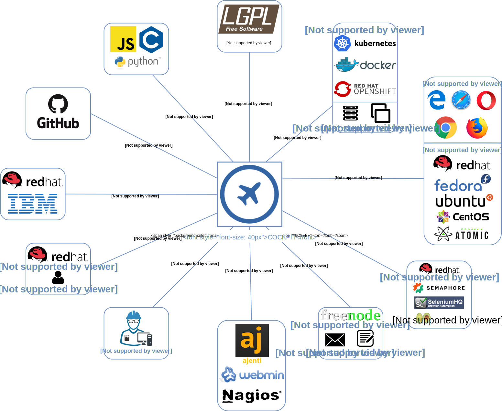
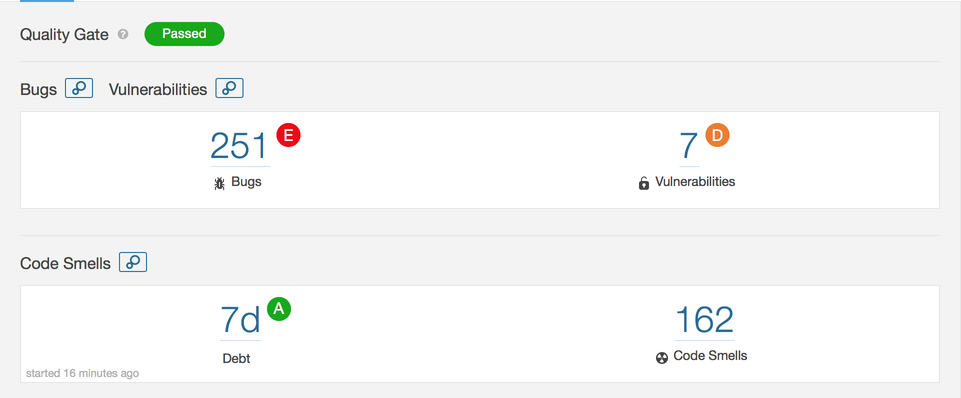
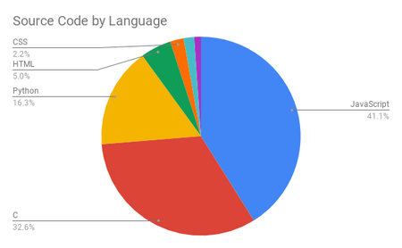

# Cockpit

## Table of Contents

- [Introduction](#introduction)
- [Stakeholders](#stakeholders)
- [Context View](#context-view)
- [Development view](#development-view)
- [Deployment View](#deployment-view)
- [Technical Debt](#technical-debt)
- [Conclusion](#conclusion)

<a id="introduction"></a>

## Introduction

The [Cockpit-project](https://cockpit-project.org/) is an open-source project owned by Red Hat, that provides an easy-to-use, integrated, glanceable, and open web-based interface for interacting with the underlying servers. More specifically, it allows users to monitor their system and adjust server configuration on GNU/Linux-based server operating systems such as RHEL, Debian, Fedora and many others. Apart from monitoring and interacting with a local server, Cockpit can also be used to access multiple remote servers/clusters and interact with them from the same user interface. 

Although Cockpit is an open-source project, it consists of a small community of active contributors, mainly Red Hat employees. The primary reason for this is the complexity of the project and due to the fact that the core team is not that open to external contributors. 

The following sections include an in-depth analysis of Cockpit's architecture. More specifically, we first analyze the stakeholders and the merging pipeline based on existing pull requests. After that, we examine Cockpit's architecture from three different perspectives, namely the Context View, the Deployment View and the Development View. In the sections that follow, we attempt to analyze the project's Technical and Testing debt and try to identify the evolution of the project throughout its release-history. Lastly, we summarize our findings and present our conclusions regarding the project's architecture. 

<a id="stakeholders"></a>

## Stakeholders

### Acquirers

[Red Hat](https://www.redhat.com/en) (which was recently acquired by [IBM](https://www.ibm.com/nl-nl/?ar=1)) is undoubtedly behind the funding of the Cockpit-project. They employ the core team which is responsible for the evolution of the project and oversee the progress of the project’s development.

### Assessors

There is no clear identification of assessors that specifically focus on the system's conformance. It is most likely that the core team ensures the conformance to the standards and legal regulations. The Cockpit-project uses the LGPL v2.1+<a href='#ref1'>[1]</a> license which means that everyone is allowed to copy, distribute and modify the project as long as the modifications are described and licensed for free under LGPL. However, although not mentioned directly, there must be some form of legal counselling for cases where violations are observed.

### Communicators

In the Cockpit-project this category consists of the core team itself.

Other types of stakeholders can learn more about the project via the team's irc channel, [mailing list](https://lists.fedorahosted.org/admin/lists/cockpit-devel.lists.fedorahosted.org/), or via the project's [blog](https://cockpit-project.org/blog/). The authors of the blog and their published posts are listed [here](https://cockpit-project.org/blog/authors#mvo). It should be noted though, that different members have different roles as communicators. For instance, Stef Walter([@stefwalter](https://github.com/stefwalter)) has presented the project in conferences such as the [Devconf](https://devconf.info/), whereas others are responsible for updating the blog with new releases or creating usage and contribution manuals for the system.

### Developers

The developers of the project are practically every individual willing to spend time and effort in understanding the project's architecture and standards. This category includes anyone that actively participates in the discussions and contributes to the project's progress. The top 3 contributors were found to be Stef Walter ([@stefwalter](https://github.com/stefwalter)), Marius Vollmer ([@mvollmer](https://github.com/mvollmer)) and Martin Pitt ([@martinpitt](https://github.com/martinpitt)) with 4.164, 1.769 and 1.435 commits respectively.

### Maintainers

The project is maintained by the community, adhering to a set of guidelines. These can either be found in the [project's website](https://github.com/cockpit-project/cockpit-project.github.io/tree/master/external/wiki) ([code style](https://cockpit-project.org/external/wiki/Cockpit-Coding-Guidelines), [commit workflow](https://cockpit-project.org/external/wiki/Workflow), and [interface design](https://github.com/cockpit-project/cockpit/wiki/Design)) or in the [github repository](https://github.com/cockpit-project/cockpit-project.github.io/tree/master/external/wiki). In general, changes can be proposed by pull requests.

The [documentation](https://cockpit-project.org/guide/latest/) is also hosted on the Cockpit website.

On the Cockpit wiki the [maintenance](https://github.com/cockpit-project/cockpit/wiki/Maintenance) is listed explicitly. Both Stef and Martin are named as responsible.

### Suppliers

The end users are responsible for setting up the hardware and infrastructure of their running system and as a result can be considered as suppliers. Moreover, the system is designed to work on a variety of different browsers (e.g. Chrome, Mozilla) and Linux distributions (e.g. RHEL, Fedora, Ubuntu) each of them requiring different versions. The exact specifics can be found at the [installation guide](https://cockpit-project.org/running.html). Since these dependencies impose limitations they can definitely be categorized as suppliers.

### Support Staff

The core Red Hat team along with the contributors that have sufficient knowledge of the system are the ones who are able to support the users of the system. This can either be done via the irc channel of the project or by joining the mailing list. Although there is no contact page, there is documentation on both the [project's](https://cockpit-project.org/guide/latest/) and [Red Hat's](https://access.redhat.com/documentation/en-us/red_hat_enterprise_linux/7/html-single/getting_started_with_cockpit/index) website.

### System Administrators

Every end-user of the project is responsible for handling the system's administration from their end.

### Testers

There is not a particular individual or team (e.g. QA testers), that mainly takes on the task of conducting tests. Every contributor is responsible for writing tests about the part that was implemented and when a pull request is issued, experienced core team members review and test the implemented functionality. However, testing is just another task for them while reviewing and by no means they can be called pure testers. Finally, a side project ([Cockpituous](https://github.com/cockpit-project/cockpituous)) is also utilized for the CI/CD pipeline of the main project. This is how the automated unit and integration tests are being run. 

### Users

The Cockpit-project is useful for every developer that is interested in monitoring the underlying web server(s) of their system via a web interface. However, the project is mostly suitable for system administrators (devops) as it offers an easy way to monitor and interact with the servers without purely relying on a command line interface for the related operations.

### Other stakeholders

Although there are not many other stakeholders that can be found on the GitHub page and official website, we can still identify a few:

#### Integrated platforms

Cockpit is integrated in the repositories of a few Linux distributions by default. These distributions are:
* Fedora
* RedHat Enterprise Linux
* Project Atomic
* CentOS
* Debian
* Ubuntu
* Clear Linux

These distributions can also be considered stakeholders, since they benefit from Cockpit being available to their users via their default repositories, making installation on their platforms easy.

#### Competitors

Cockpit has three main competitors: [Ajenti](http://ajenti.org/), [Webmin](http://www.webmin.com/) and [Nagios](https://www.nagios.org/), which are all competing server management software packages. All of these competitors are also open source projects, with Nagios having both a free, open source Core version as well as a closed source paid variant.

### Pull request analysis

The selection of the pull requests for our analysis was done by directly using GitHub's interface. More specifically, we selected the 10 most discussed accepted pull requests. Apart from the number of comments, we also considered selecting pull requests that were submitted by contributors that are not Red Hat employees in order to get a better overall view of the integration procedure.

A more detailed analysis can be found in the Appendix A.

#### Integrators 

By analyzing<a href='#ref2'>[2]</a> the most discussed pull requests we were able to identify the integrators of the Cockpit-project. These are mainly:

- Martin Pitt ([@martinpitt](https://github.com/martinpitt))
- Stef Walter ([@stefwalter](https://github.com/stefwalter))
- Dominik Perpeet ([@dperpeet](https://github.com/dperpeet))

#### Most discussed accepted pull requests 

Every pull request undergoes a reviewing phase in which a lot of back and forth communication between the assignee and the reviewers regularly occurs. Particularly, there are different reviewers for pull requests affecting the functionality and different for those that update the interface of the system. To our understanding, the reviewers focus mainly on the style and quality of the code and examine whether or not it corresponds to the desired functionality. However, due to the CI pipeline, the implementation is automatically tested in different stages. Furthermore, it goes without saying that every pull request should comply to the project's design principles.

It also interesting to note that in contrast to a typical pull request, where the assignee usually provides the entire implementation, in Cockpit there are parts of the desired functionality that are decided on the fly during the discussion that takes place between the participants.

Another thing that we observed is that it might take a long time until a pull request is merged.  Most often, the reasons behind this are either because of dependencies to other issues/pull requests or because of the recurring reviews and fixes between the participants.

#### Most discussed rejected pull requests

Unfortunately, we were not able to identify any rejected pull requests in the project's repository. We suspect, that the reason behind this is mainly because the majority of the contributors are all Red Hat employees. That means that the issues to be resolved are usually pre-discussed among the members of the team, thus always leading to a partial or complete merge of the pull request's implementation. This sounds reasonable since in comparison with more generic-nature projects, the highly specialized context of this project is not attracting many external developers.

### Power-interest diagram


As project acquirers, RedHat, and therefore IBM have the power to be of great influence if they want to, but this will most likely not happen as they have relatively little interest in this project, since Cockpit is only a small, optional component of RHEL.

The core RedHat team is highly involved in development and they also make decisions on which direction the project goes. As their team leader, Stef Walter stands slightly above them in both power and interest. The contributors that do not belong to the RedHat team still have the possibility to influence the project by making pull requests, but the decision on whether or not to accept those PRs is ultimately that of the core team.

Linux distribution developers may have a slight interest in the project, since many distributions ship Cockpit in their default repositories. This also gives them a small bit of power, since they could threaten with removal from the default repositories if they really don't like a certain change. Browser developers generally do not use Cockpit or care about it, but browser compatibility is important for Cockpit's UI, so they should still be monitored.

Users hold quite a bit of interest, since they are the ones who actually rely on Cockpit on a daily basis. They also have a bit of influence since they can request features, and if enough users request a feature, the developers will tend to listen to that. Competitors are also interested in Cockpit since they have to compete with it. They generally don't have any influence, except maybe when they add a feature that is so important that the Cockpit team will be highly motivated to add that feature as well to keep up with them.

<a id="context-view"></a>

## Context View

### System scope and responsibilities

Cockpit is defined on their [website](https://cockpit-project.org/) as:

> The easy-to-use, integrated, glanceable, and open web-based interface for your servers

It is a clickable interface for a variety of Linux distributions. Administration tasks that normally would have to be executed via the command line are now presented as a html page readable by your web browser. The [GitHub repository](https://github.com/cockpit-project/cockpit) of Cockpit gives a more detailed explanation:

> Cockpit is an interactive server admin interface. It is easy to use and very lightweight. Cockpit interacts directly with the operating system from a real Linux session in a browser.

**System responsibilities**:

* Enables managing of multiple servers in one Cockpit session
* Offers a web-based shell in a terminal window
* Supports efficient management of system user accounts
* Containers can be manged via Docker 
* Provides a system overview for the health of the servers
* Diagnoses network issues
* Spot and react to misbehaving virtual machines
* Users can inspect SELinux logs and fix common violations in a click
* Supports Kubernetes or OpenShift v3 clusters
* Allows modification of networks settings
* Possible monitoring via the phone's browser

### Diagram

The diagram below shows the context in which the Cockpit project exists.



### External entities

From the diagram, we can observe a few external entities:

* Cockpit is mainly coded in JavaScript and C, with Python mainly being used for testing and automation scripts.
* Cockpit is published under the LGPL v2.1 license.
* Cockpit can be used to manage server hardware and VMs, but also supports Kubernetes, Docker and OpenShift containerized instances.
* The Cockpit UI is rendered inside browsers, with Chrome, FireFox, Edge, Safari and Opera being officially supported.
* The Cockpit backend can run on a multitude of OSes, with RHEL, Fedora, Ubuntu, CentOS, Project Atomic and Debian being listed as fully supported.
* The Cockpit test suite relies on Semaphore for CI, as well as Selenium and Avocado for integration tests.
* The code of the Cockpit project is hosted on GitHub, which is also used for version control and issue tracking.
* Freenode is used for communication via IRC
* Cockpit's main competitors are Ajenti, Webmin and Nagios.

<a id="development-view"></a>

## Development view

The architecture that is specific to the development process is described in this section.

### Module Organization

The main components described by the manual pages on the Cockpit website are:

    cockpit.conf — Cockpit configuration file
    cockpit-ws — Cockpit web service
    cockpit-desktop — Cockpit Desktop integration
    remotectl — Remote Access Configuration
    cockpit-bridge — Cockpit Host Bridge

These components don't naturally map to the source code in the GitHub repository, because they are targeted towards users, not developers. A total of 12 directories are listed on the GitHub repository. The source code is written in two main languages: `C` and `javascript`. These two languages respond to the directories `src` and `pkg`, respectively. The 'Contribute' page explains:

> Most of Cockpit is written in JavaScript. Almost all of this code is found in the packages in the pkg/ subdirectory of the Cockpit git checkout.

There is also a directory for tests called `test` and a directory for bot functionality called `bots`.


As can be seen in the picture above, retrieved from the Cockpit docs<a href='#ref3'>[3]</a>, the user interacts via the Cockpit websocket. The websocket is coupled with the API via the Cockpit bridge. The API is what is interesting for a developer and provides most of the functionality of the application. A summary of the API follows, mostly deduced from the Cockpit docs.

- **systemd** provides configuration and monitoring capabilities with the system (OS)
- **NetworkManager** provides interaction with the systems network configuration
- **Journal** provides indexed log data
- **Docker** provides Docker container management functionality
- **OStree**  provides versioning updates of Linux-based operating systems.
- **storaged** provides disk storage and mounting and other such functionalities

### Common Design Model

Cockpit consists of packages that contain components which are HTML documents. The Cockpit documentation is quite extensive on the subject of packages and URLs. Packages are standardized to integrate easily into the already existing code base. Special URLs are used to refer to internal components.

#### Design Standards

For software projects with different contributors, it is necessary to establish some design standards that all developers must adhere to, in order to keep the code clean and comprehensible for all developers. To achieve this, the Cockpit core team has established the *Cockpit Coding Guidelines*, which can be found on the [GitHub wiki](https://github.com/cockpit-project/cockpit/wiki/Cockpit-Coding-Guidelines). In these guidelines, standards are listed for general coding style, such as spacing and indentation, with language-specific guidelines for C, JavaScript, CSS/HTML and Python.

Furthermore, there is also a section on design guidelines for the GUI style based on PatternFly, which can be found on the [PatternFly website](https://www.patternfly.org/pattern-library/). These standards are used to ensure the GUI style is consistent across the entire program, and also saves developers the hassle of worrying about GUI-related design.

#### Common Processing

Throughout the codebase, data is usually transported from one location to the other using the `DBus` interface, which is implemented in JavaScript. `DBus` is, as the name suggests, a software bus to allow for inter-process communication. It was developed by RedHat, which explains its presence in the RedHat-dominated code of Cockpit. The Cockpit developers mostly use it to make the Cockpit web app GUI communicate with the backend. It can be used by calling the `cockpit.dbus()` function. Developers can specify which `DBus` service they wish to connect to via the function argument, and the function returns a service variable. This service can be interacted with using its `.proxy()` function, which can be used to send or receive data.

#### Package Layout

A package must consist of one or more files and include a `manifest.json` which provides metadata and has a number of required fields. The name of the package is equivalent to the name of the directory it is located in. Naming conventions are employed for all files. Referring to other packages (linking) is done relatively. The `cockpit-bridge` is used to interact with the front-end of the application.

#### URL Specification

URL addresses are always relative, even if they are used to refer to resource in other packages. All URLs are in the `/cockpit` namespace and thus start with this prefix. Following the namespace identifier is either a host or checksum, actually telling where to find the package. Next is the package name, the component name and a hash, which allows to navigate within a single component. The URLs are not visible to the end user by default. URLs are wrapped to provide bookmarking capabilities and other standard browser features. If the path of a URL does not exist, users are redirected to the default page or dashboard.

### Codeline Models

The root directory of the Cockpit project contains 12 directories. The most important directories will be discussed here. The release process, and continuous integration are also analyzed.

#### Resource Structure

The packages that are the main part of Cockpit can be found in the `pkg` directory. The `src` contains mostly inward facing functionality, which needs to be fast and is therefore written in `C`. The `bots` directory is related to automated testing and consists of OS images, virtual machines, overrides, and tasks. Tests are located in the directory `test` and make use of the resources in th `bots` directory. Before running the integration tests, the `image-prepare` script in the bots directory needs to be executed. Documentation such as markdown, images and xml is located in the `doc` directory.  The `po` directory contains translations for multiple languages in `.po` format. 

#### Release Process

Cockpit has had 189 releases since its creation. The major releases are sequential, but sometimes patches for previous releases are submitted. For every major release, a blog post is made on the Cockpit website discussing the newly added features. The posts are often illustrated with pictures to make improvements more tangible.

Almost every two weeks a new release is made. Releasing within short intervals reduces the amount of introduced changes. Moreover, it shrinks the management overhead and support duration. The short release cycle maps to the AGILE SCRUM process, clearly indicating milestones of the project. Contributors can see their code being used in production quite fast. The quick feedback of bugs or other faults helps to keep the code base healthy.

#### Continuous Integration

Integration testing is done via a few scripts residing in the `test` and `bots` directories. 

The first step is to verify that the build is in the expected location and built correctly. This can be done using the `./bots/image-prepare` Bash script.
After that, the automated test suite can be activated using the `./test/verify/run-tests` Bash script.

These tests are used to check integration of the core program with multiple OSes. The test settings can be changed using environment variables.
* `TEST_OS` sets the operating system(s) to be tested, with multiple architectures of CentOS, Debian, Fedora, RHEL and Ubuntu being currently available.
* `TEST_DATA` is used to set the OS VM image storage location
* `TEST_JOBS` is an integer setting to change the amount of tests to be ran concurrently.
* `TEST_CDP_PORT` can be used to automatically attach to a browser that supports the Chrome Debug Protocol. This setting sets the port used for CDP.

The UI integration is tested using Avocado (`./test/avocado/run-tests`) and Selenium (`/test/avocado/selenium-base.py`). Selenium supports Chrome, Firefox and Edge browsers. The testing browser is selected by setting the `BROWSER` environment variable.

The aforementioned test scripts are written in Python3, and requires both `selenium` and `avocado-framework` packages to be installed.

The `README.MD` of the repository shows the [Semaphore build status](https://semaphoreci.com/cockpit-project/cockpit). When clicked, it redirects to a page where the project's  build status can be monitored in real-time.

#### Folder structure


<a id="deployment-view"></a>

## Deployment View

The Deployment view describes the view of the system after it is built and tested and is ready to be deployed to production. In this section, we examine some particular aspects of the Deployment view in Cockpit.

Cockpit is implemented for **standalone usage**, meaning that it does not follow a client-server architecture. On the contary, cockpit is deployed on top of the particular operating system that the user is currently using and runs directly in the client's browser. Furthermore, each action at the interface is translated to a linux command, hence there is no need for a database since no intermediate information is stored. On the other hand, even as a standalone application cockpit can connect and interact with remote nodes/containers or even with entire **OpenShift** and **Kubernetes** clusters. This is done the same way as with an SSH session, and the users can troubleshoot, configure and interact with the remote system using the web UI of cockpit deployed on their local machine. For that to happen, each of the remote Linux instances needs to have Cockpit installed. The following image shows an overview of this procedure:


As can be seen in the image above taken from the project's documentation, Cockpit connects to the various system APIs using the **cockpit-bridge** module. This bridge allows the sending of messages and commands from the Web front-end to the server. The **cockpit-ws** (Websocket) program enables the communication between the web browser and various APIs and components such as cockpit-bridge. In this diagram, through cockpit-ws, a connection is established over SSH with two remote server instances.


**Web Browsers**: Cockpit can be accessed by most popular web browsers. The minimum required versions are the following:  

 - Mozilla Firefox 52 
 - Microsoft EDGE 16
 - Google Chrome 57
 - Apple Safari 10.3
 - Opera 44
 
**Operating systems**: Cockpit is included in the major Linux distributions. In detail, cockpit supports the following operating systems:

 - **Fedora** : Cockpit is installed on the Fedora server. No version limitations are specified.
 - **Red Hat Enterprise Linux**: Red Hat Linux Extras Repositories (versions 7.1+) include Cockpit.
 - **Project Atomic**: Cockpit can connect to to an Atomic host via the user interface. No version limitations are specified.
 - **CentOS**: Cockpit is supported in CentOS 7.X.
 - **Debian**: Cockpit is included in Debian unstable and in Debian 8, 9 backports 
 - **Ubuntu**: Cockpit is supported in Ubuntu 17.04 and later. It is also available as an official backport for 16.04 LTS and later.
 - **Clear Linux** : Cockpit is included in Clear Linux. No version limitations are specified.
 - **Arch Linux**: Cockpit can be found as a package in the Arch Linux repository. No version limitations are specified.
 
**Hardware Requirements:** No hardware minimum requirements are specified to deploy Cockpit. This is quite unexpected since from our experience Cockpit was quite slow when we deployed it on our local VMs. On the other hand, Cockpit claims to be **zero footprint** meaning that when the system is not used, no resources are being allocated. 

Nevertheless, even if the exact requirements are not mentioned, we can make an estimation of the required resources by looking at the specifications of the VM that the team uses to run the integration tests. Our investigation showed that this is a *x86_64* system with *4 cores* and *2GB* of memory. To that end we can assume that any system with similar or better hardware components will be capable of running cockpit. We also tested it on a system with 2 cores, it showed no slow down and performed similarly.

<a id="technical-debt"></a>

## Technical Debt

In this section we describe our findings in regards to Technical debt. Specifically, we attempted to identify Technical debt both manually and through the use of static analysis tools. 

### Static Analysis

To perform static analysis on Cockpit, we used [SonarQube](https://www.sonarqube.org/) with support from [FlawFinder](https://dwheeler.com/flawfinder/) and [CPPCheck](http://cppcheck.sourceforge.net) for a more in-depth analysis of Cockpit's central source code.

**SonarQube**: SonarQube analyzed a total of 187.000 lines of code, most of which were composed of JavaScript (87.000) and C (75.000). Of the 251 bugs detected, almost all were generated by deprecated HTML elements and improper tag usage. All exceptions to this rule were attributed to JavaScript testing files.  



Vulnerabilities in Cockpit mainly originate in the `pkg/shell` and `pkg/kubernetes`. The majority of them have to do with JavaScript code not checking that a sent message is successfully received. Analysis of code smells revealed that most came from core source files in `src/bridge` (2d, 4h). Test files were the largest offender, and were mostly generated because of useless assignments.

According to SonarQube, the estimated time required to address the technical debt from code smells is 6d 4h. The maintainability figure below visualizes the impact by file:  


Finally, SonarQube assigns Cockpit a cyclomatic complexity score of 16.916. 
Notable offenders from the `src` directory were `base1/cockpit.js`, with a score of 1222, which is close to half of the entire score of src (2623). The worse though came from the `pkg` directory, with a score of 14.249. 

**FlawFinder**: The FlawFinder tool searches for security vulnerabilities (e.g buffer overflow risks, race conditions etc.) and produces a report with all findings categorized by risk level.

We deployed FlawFinder on the `src` directory of Cockpit, with the produced results summarized as follows:

| Vulnerability Category | Count |
|------------------------|:-----:|
| Race                   |   9   |
| Buffer                 |  287  |
| Shell                  |  18   |
| Format                 |   4   |
| Crypto                 |   2   |
| Random                 |   6   |
| Integer                |   2   |
| Access                 |   2   |
| Misc                   |  57   |

Of the 102.755 lines analyzed, there were five vulnerabilities with level 5 (the maximum level). When examining the details of the report concerning the maximum level vulnerabilities, we found that 4/5 are from test files and are related to race conditions.

**CPPCheck**: CPPCheck is a tool which primarily searches for bugs and dangerous coding constructs in C/C++ code. Like with FlawFinder, we deployed it on the `src` directory of the Cockpit project and collected the following statistics: 

| Category                 | Count |
|--------------------------|:-----:|
| Unused Function          | 309   |
| Variable Scope           | 268   |
| Redundant Assignment     | 138   |
| Invalid Scanf            | 1     |
| Variadic Function NULL UB| 85    |
| Null Ptr Redundant Check | 12    |
| Literal Char Ptr Compare | 38    |

Some of the less obvious bad practices would be passing `NULL` as the last argument to a variadic function in C, and using `sscanf` without field width limits. Others are more or less harmless, such as a variable having a larger scope than it needs. It is important to mention that a decent portion of the flaws detected by both CPPCheck and FlawFinder originate in the test files that litter the source code directories. This means that some of the vulnerabilities mentioned by FlawFinder would not be a threat in production.

### Bus Factor

The main contributions to the Cockpit project come from a small party of 3-4 individuals. In fact, GitHub's metrics indicate that the leading contributor ([@stefwalter](https://github.com/stefwalter)) is the largest contributor by a wide margin. Although we were expecting that most contributions would be concentrated in a smaller subset of developers, the fact that Cockpit deploys a substantial amount of sophisticated low-level infrastructural code suggests that the bus factor for the project may not be entirely insignificant. Even being open source and well commented, the use of intricate channeling infrastructure provides a high barrier to entry, requiring a developer to have an in-depth understanding of not only Cockpit's plumbing, but the operating system functions it works with. 


### Design Debt

The infrastructure driving Cockpit is primarily written in C. This is presumably done because of the language's excellent interoperability with Linux and its familiarity to the core developers. The project also makes use of an abundance of specialized low level infrastructure. JSON parsers, websockets, authentication, pipes, and daemons hooked to `systemd` are all written from the ground up for use specifically with Cockpit. This infrastructure allows different components of Cockpit to communicate efficiently and helps abstract the details of passing information around from the rest of the code. Although it provides the developers with a high level of control, it also imposes a considerable design debt in terms of maintenance. Extending the source now requires intimate knowledge of its plumbing. This burden now becomes the responsibility of the developers. 



### Testing procedure and observations

Cockpit uses [Semaphore](https://semaphoreci.com/cockpit-project/cockpit) as their CI platform, accompanied by automatic testing frameworks/tools such as [Avocado](https://avocado-framework.github.io/) and [Selenium](https://www.seleniumhq.org/). These along with the [cockpituous](https://github.com/cockpit-project/cockpituous) module which is described as "A fleet of robots that run the test suites for each pull request" provide a quite thorough testing procedure. It is worth to note that this procedure includes the building of **26** distinct VM images on which the tests are being run.

In order to identify the code coverage of the existing tests we tried executing the tests manually and looking at their Semaphore CI [page](https://semaphoreci.com/cockpit-project/cockpit). Unfortunately, although the former outputs the number of tests that are being run, neither showed an exact percentage of the code covered. Albeit the team probably has some internal tools that show this metric, we consider this to be extremely inconvenient for new contributors.  

There are 2 types of tests in Cockpit: **unit tests** and **integrations tests**. 

The first category consists of 2914 tests that focus on testing the functionality of the code. Furthermore, since Cockpit is a project that relies on Linux OSes and supports a big variety of browsers, it is important to guarantee that code updates do not break the existing functionality. That said, integrations tests are essential for this project since they ensure cross-browser compatibility and that new additions are platform independent.

#### Improvements

We propose two major additions that we believe would contribute to the project's stable future and encourage more developers to contribute. Firstly, we observed that Cockpit is quite [slow](https://github.com/cockpit-project/cockpit/wiki/Performance). To that end, we propose the addition of **performance tests** which would help identify the bottlenecks of the project and prevent future additions that would further decrease the performance. Moreover, the percentage of code coverage should be available to the entire community and not just the core RedHat team. Finally, it's quite hard for a new contributor to understand their testing procedure at a glance. That is because the instructions cannot be found in a single concrete document but are separated in different files/web-pages.

### Technical debt evolution & awareness

On top of the aforementioned analysis, technical debt awareness of the developers is examined in this section. 

We did this by looking into the following two aspects:

- The discussion between the developers for particular issues
- Specific codetags (TODOs, FIXMEs, HACKs, XXXs) which are generally used as reminders of parts of code that need closer inspection or review.

Regarding the first aspect, we observed that for complex issues, the involved developers discuss how the implementation should be so that it will affect the maintainability of the project. Moreover when it comes to code reviews, the reviewers tend to suggest changes that will optimize the code, regardless if it already works. In regards to the second analysis, our codetags lookup on the latest release (189), showed some interesting insights. In particular, multiple codetags were found as shown in the table below. A more detailed analysis can be found in the Appendix B.  

| Codetags | Count | Files |
|----------|:-----:|:-----:|
| TODO     |  100  |   66  |
| FIXME    |   11  |   10  |
| HACK     |  198  |  112  |
| XXX      |   10  |   5   |

These results indicate that the developers are aware of the technical debt in their project since they annotate their code with tags that imply the need for further investigation. Moreover, in order to identify whether the developers address the issues described by the tags or they just ignore them, we compared the latest release with 2-year old past ones. 


As can be seen, there is a undoubtedly a increase in the number of codetags that need to be addressed. This leads us to the conclusion that although the team seems to be aware of the technical debt of their project, minor efforts are being done in order to decrease it.

<a id="conclusion"></a>

## Conclusion

Throughout these sections we examined various aspects of Cockpit's architecture. In particular, we made an extensive stakeholder analysis in order to identify the main stakeholders of the project, we examined various viewpoints of the system and analyzed its evolution and technical/testing debt. Our analysis lead to some interesting insights in regards to the underlying architecture of Cockpit and open-source projects in general.

Early on during our stakeholders analysis we identified that the majority of the stakeholders are Red Hat employees. This was quite surprising considering the size of the project but was later justified by observing that there is only a small number of active contributors. Furthermore, by analyzing the different viewpoints we learnt how Cockpit is deployed and developed and what are its dependencies. The results of that analysis indicate that Cockpit's codebase and testing procedures are quite complex and that partially explains the reasons behind the small number of non-RedHat contributors. Lastly, our technical and testing debt analysis showed that although minor, there is technical and testing debt in the project. Judging by the significant number of code tags that were found in the source code, we argue that the developers-team seems to be aware of that. However, by comparing the latest release with previous ones we were able to find that not much effort is spent on addressing these issues. 

In summary, our findings allow us to argue that Cockpit is a promising and undoubtedly useful for Linux system administrators. However, we believe that 
there is still room for improvement in order for the project to evolve at a faster pace.

## References

<span id="ref1">[1]</span> https://www.gnu.org/licenses/old-licenses/lgpl-2.1.html

<span id="ref2">[2]</span> Gousios, G., Zaidman, A., Storey, M. A., & Van Deursen, A. (2015, May). Work practices and challenges in pull-based development: the integrator's perspective. In _Proceedings of the 37th International Conference on Software Engineering-Volume 1_ (pp. 358-368). IEEE Press.

<span id="ref2">[3]</span> https://github.com/cockpit-project/cockpit/tree/master/doc

## Appendix A

### Most discussed accepted pull requests

 Name | Context | Merged by | Issued,Merged | Key points |
|--|--|--|--|--|
[machines: Add create vm dialog #7820](https://github.com/cockpit-project/cockpit/pull/7820) | Refers to the creation of virtual machines through the interface | Martin Pitt | **Issued:** 05/10/2017<br>**Merged:** 02/02/2018 | - Was reviewed by many individuals including designers and senior developers <br><br> - Request for fixes: Back and forth communication between the assignee and the reviewers <br><br> - Merge delayed due to multiple rounds of reviews and fixes<br><br> - 4 months passed until the final merge
[ test: Stop reloading sshd when Debian networking changes #6158 ](https://github.com/cockpit-project/cockpit/pull/6158)| Disable broken behaviour caused by sshd reload | Martin Pitt | **Issued:** 20/03/2017<br>**Merged:** 22/03/2017 | - The pull request was prioritized since it was blocking other components <br><br> - Due to the prioritization, only 2 days were needed for it to be merged |
[ cockpit:machines: Display VM graphics console #5932 ](https://github.com/cockpit-project/cockpit/pull/5932) | Graphics console retrieval for a VM | Martin Pitt | **Issued:** 23/02/2017 <br>**Merged:** 08/06/2017 | - Discussion about whether to use VNC or SPICE to address the issue <br><br> - Consulted individuals that have used SPICE in their own projects <br><br> - Merge was delayed due to the discussion regarding the available choices and due to the extra implementation that was needed
[ vms: VM management - initial commit #4434 ](https://github.com/cockpit-project/cockpit/pull/4434) | VM management and monitoring | Dominik Perpeet |  **Issued:** 18/05/2016 <br>**Merged:** 29/09/2016 | - Was blocked/delayed due to dependencies to other issues <br><br> - Many rounds of reviews and fixes<br><br> - Many rebases on top of the existing implementation |
[ Navigation updates (CSS for desktop and the start of mobile) #7482 ](https://github.com/cockpit-project/cockpit/pull/7482)| Visual navigation updates for the desktop and mobile interfaces | Martin Pitt | **Issued:** 10/08/2017 <br>**Merged:** 13/11/2017 | - Included an extensive design related discussion <br><br> - Required multiple tests to ensure consistency among the different browsers <br><br> - Again submitted partial implementation and added more after discussions |
[Adjust RHEL 7 images for the 7.5 release #8984](https://github.com/cockpit-project/cockpit/pull/8984) | Prepared tests for the new RHEL release | Marius Vollmer | **Issued** 12/04/2018 <br> **Merged** 13/04/2018 | - The contributor of this PR was team member of the project <br><br> - An adjustment in the RHEL 7 images was needed to support the new release <br><br> - Two different commits were referenced as guidelines and after it passed the tests it got merged in the master |
[docker: implement new design #4952](https://github.com/cockpit-project/cockpit/pull/4952) | New design for docker page | Lars Karlitski | **Issued** 01/09/2016 <br> **Merged** 19/10/2016 | - An implementation for a new design of docker was needed <br><br> - The PR had some unrelated test failures in different modules, including `rhel failure` and `testRestart` in fedora 25 <br><br> - In the end some fixes where required and the implementation was force pushed to another branch |
[Add CentOS CI image store #9321](https://github.com/cockpit-project/cockpit/pull/9321) | Update CentOS image store pertaining to ubuntu and REHL | Martin Pitt | **Issued** 06/06/2018 <br> **Merged** 11/06/2018 | - The initial update failed the tests so the contributor had to fix bugs that were causing the failures <br><br> - The PR finally merged, even though they were some unrelated test failures <br><br> - The Cockpituous bot is employed to automatically update the images |
[ systemd create timer option #4645 ](https://github.com/cockpit-project/cockpit/pull/4645) | Functionality to execute shell commands at a specified time | Harish Anand | **Issued** 28/06/2016 <br> **Merged** 14/08/2016 | - A PR made by a CS graduate - The PR is reviewed by a member of the core team for code style and design <br><br> - The changes are accepted and it is stated that it will be part of Cockpit 0.118.
[ cockpit:machines: Display VM graphics console #5932 ](https://github.com/cockpit-project/cockpit/pull/5932) | Desktop-like server interaction within browser iframe | Marek Libra | **Issued** 23/02/2017 <br> **Merged** 08/06/2017 | - Cockpit already supports non-graphics console <br><br> - The original post of the PR explains the new feature and the number of different implementations possible. It also shows a [video](https://youtu.be/_zVi44KQ8KU) of the new feature <br><br> - Developers of the graphics consoles join the discussion <br><br> - Multiple implementations are required, both in-browser and not in-browser to best suit the needs of all users


## Appendix B

A detailed analysis regarding the codetags per package can be seen below. Note that trivial packages such as /examples and /doc have not been included. 

|             | TODO | FIXME | HACK | XXX |
|-------------|:----:|:-----:|:----:|:---:|
| /bots       |   0  |   1   |  37  |  0  |
| /containers |   1  |   0   |   7  |  0  |
| /pkg        |  75  |   2   |  50  |  6  |
| /src        |  15  |   0   |  34  |  0  |
| /tools      |   1  |   1   |   1  |  0  |
| /test       |   8  |   5   |  67  |  4  |

As can be seen in the table, a significant number of the codetags can be found in the /pkg and /src packages. This, is reasonable considering that these 2 packages contain the interface and core logic respectively. What is worrying though is that there is a big number of HACK tags in the /test package which indicates that some tests are not complete. On the other hand, each of these tags corresponds to an existing issue which is tracked in Redhat's bugzilla issue tracker. An example of such an issue is the following: 

```python
# On Atomic no locales other than en_US are supported on the host itself
# HACK: https://bugzilla.redhat.com/show_bug.cgi?id=1186757
```
