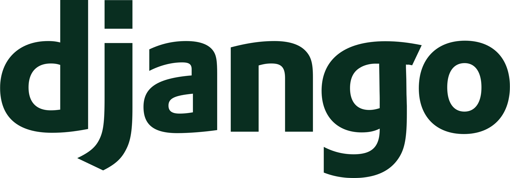
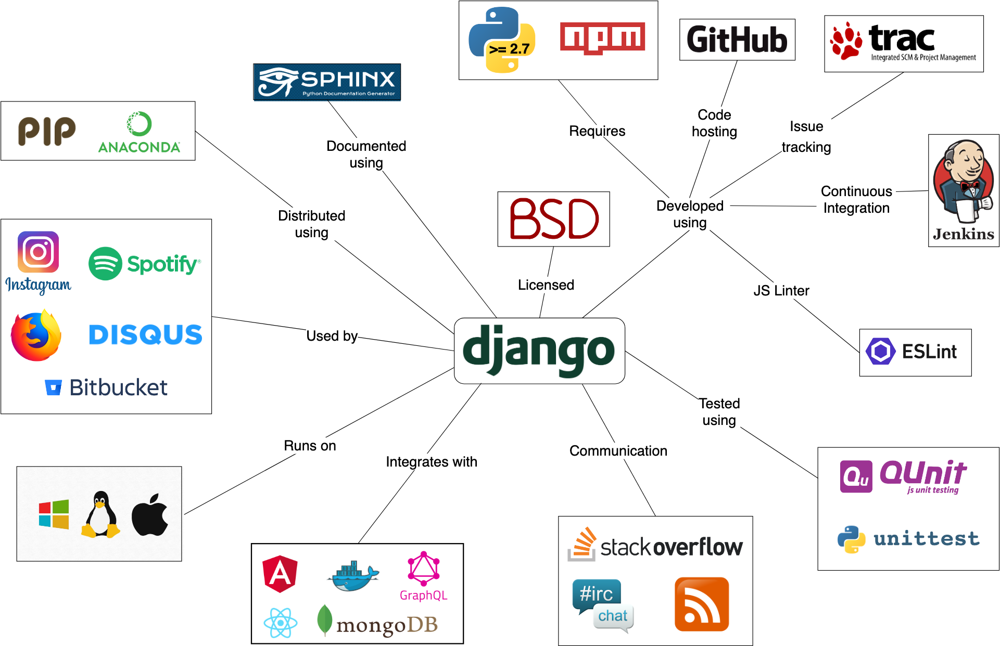
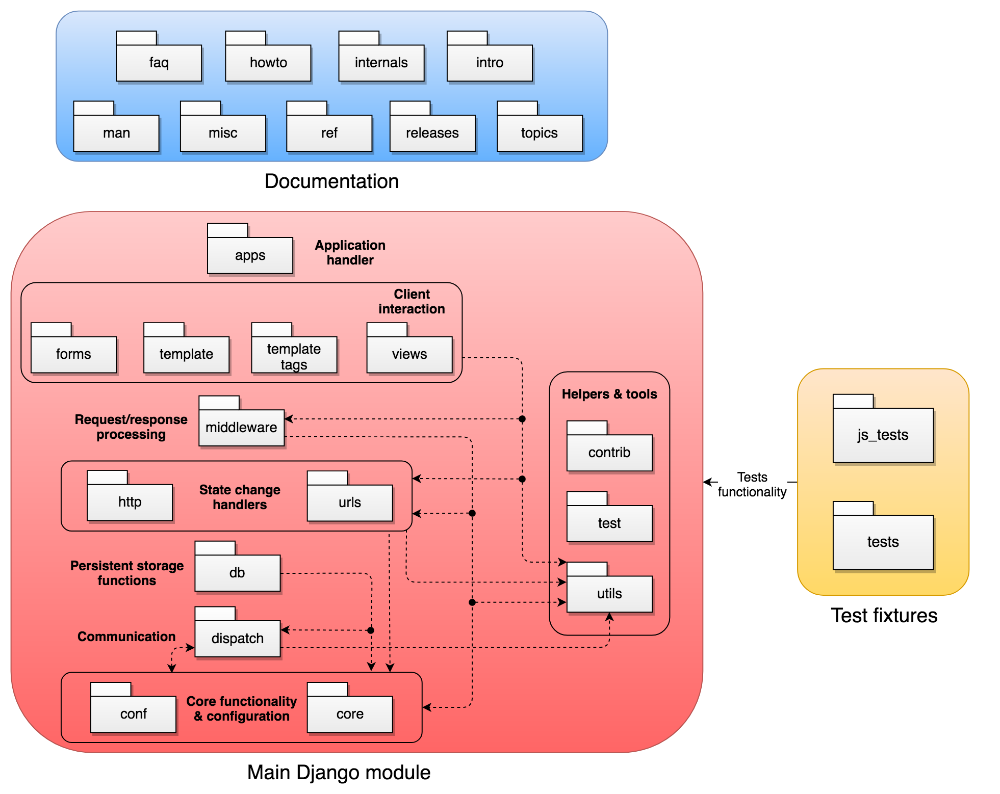
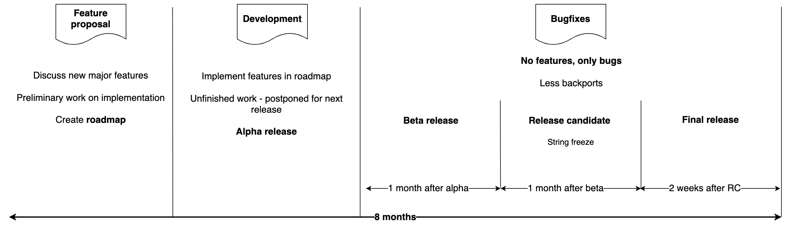
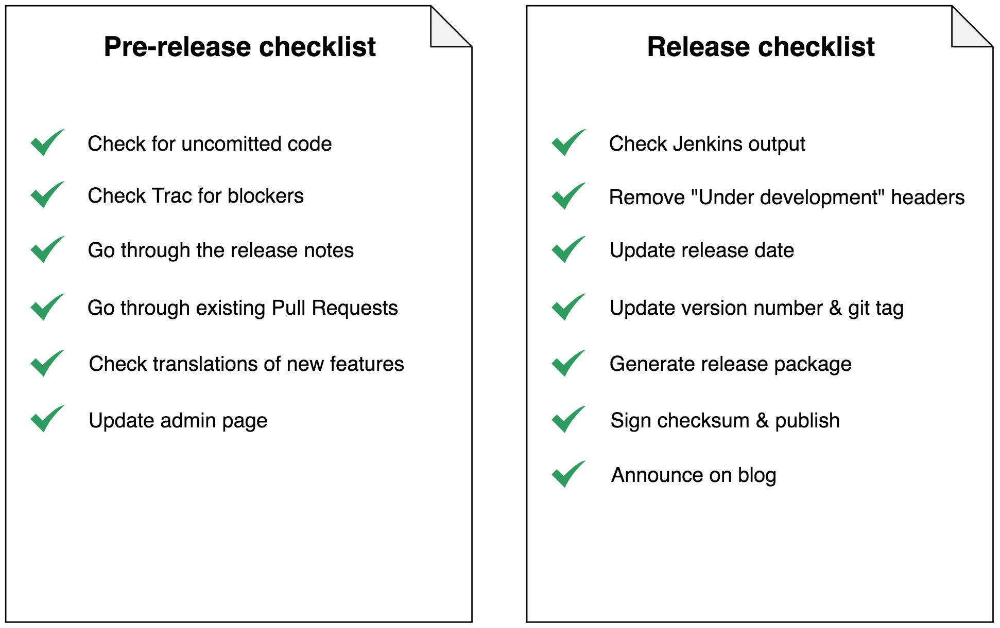
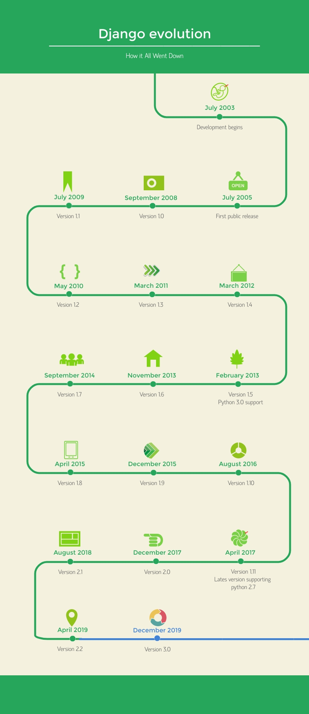

# Django

By [Alexandru Balan](https://github.com/alexanderblnf), [Andra Ionescu](https://github.com/AndraIonescu), [Phil Misteli](https://github.com/pmisteliac), [David Vojtek](https://github.com/sejd0n)

## Table of Contents
-   [Introduction](#introduction)
-   [Stakeholders](#stakeholders)
    -   [Django Software Foundation](#django-software-foundation)
    -   [Core Members](#core-members)
    -   [Technical Board](#technical-board)
    -   [Other stakeholders](#other-stakeholders)
    -   [Power-interest Grid](#power-interest-grid)
-   [Decision-making process of pull requests](#decision-making-process-of-pull-requests)
-   [Context view](#context-view)
    -   [System Scope and Responsibilities](#system-scope-and-responsibilities)
    -   [Context view diagram](#context-view-diagram)
    -   [Conclusion](#conclusion)
-   [Development view](#development-view)
    -   [Module structure](#module-structure)
    -   [Common patterns](#common-patterns)
    -   [Common processing](#common-processing)
    -   [Standard design](#standard-design)
    -   [Standard software components](#standard-software-components)
    -   [Build approach](#build-approach)
    -   [Release process](#release-process)
-   [Technical debt](#technical-debt)
    -   [Code quality tool analysis](#code-quality-tool-analysis)
    -   [Testing Debt](#testing-debt)
    -   [Conclusion](#conclusion-1)
-   [Evolution Perspective](#evolution-perspective)
    -   [History](#history)
    -   [Aspects of evolution](#aspects-of-evolution)
    -   [Evolution conclusion](#evolution-conclusion)
-   [Conclusion](#conclusion-2)

## Introduction

According to the description on Django's [website](https://www.djangoproject.com/):

> Django is a high-level Python Web framework that encourages rapid development and clean, pragmatic design.

In other words, Django is an open source web framework that enables the user to write complete applications from scratch by offering support for building a back-end infrastructure, as well as creating the front-end interfaces and interactions through its templating engine. Its support for various databases and the ease of integrating it with various front-end frameworks make it extremely versatile for various use cases, such as content management systems, computing platforms or social networks.

This chapter aims to describe the high-level architecture starting with an analysis of the stakeholders, followed by the context and development view, technical debt and finally, the evolution of the project.

## Stakeholders

According to Rozanski and Woods \[1\], a stakehold is a person, a group or an entity that has interest and concerns about the realization of the architecture. According to their classification based on the roles and concerns, 10 types of stakeholders are identified: acquirers, assessors, communicators, developers, maintainers, suppliers, support staff, system administrators, testers and users. In Django, the non-profit organization **Django Software Foundation** (DSF), the **Core Members** and the **Technical Board** have a major impact in the administration of the project. Thus, special attention is required in order to fully understand their responsibilities and how they integrate with the RW categorization.

##### Django Software Foundation

Based on the Django [organization](https://docs.djangoproject.com/en/2.1/internals/organization/), the Django Software Foundation handles the financial and legal aspects of the project. The goal of the [foundation](https://www.djangoproject.com/foundation/) is to promote, support and advance the project. Therefore, they support the development by organising meetups and community events, by promoting the use of Django in the online development community, protecting the intellectual property and advancing the state of the art in Web development. The foundation is composed of **corporate members**, **individual members** and the **board of directors**.

The [corporate members](https://www.djangoproject.com/foundation/corporate-members/) offer the financial support in the form of one year subscription based packages. The packages are formed based on the number of people from the organization and the payment amount, ranging from organizations with up to 10 people and a dues of 2000$ (Bronze package) to organizations with more than 500 people and dues of 100,000$ (Platinum package).

The [individual members](https://www.djangoproject.com/foundation/individual-members/) are people appointed by DSF that deserve the recognition for their services in the community.

The board of directors is formed of Frank Wiles - President, [Anna Makarudze](http://blog.djangogirls.org/post/146535801439/your-django-story-meet-anna-makarudze) - Vice President, James Bennett - Secretary, [Jessica Deaton](https://www.linkedin.com/in/jessica-deaton/) - Treasurer, [Katie McLaughlin](https://www.linkedin.com/in/glasnt/) and Ola Tarkowska. Most of the members of the board of directors are public speakers, who help with Django events and conferences organization or are very experienced developers.

##### Core Members

The [core team members](https://docs.djangoproject.com/en/2.1/internals/organization/#core-team) are a group of volunteers that have shown dedication over time and became trustworthy to manage the Django Project. Some of the attributions of the core members are:

-   triaging tickets;
-   writing, reviewing and merging patches;
-   managing the continuous integration infrastructure and the servers;
-   participating in design decisions;
-   handling the security issues;
-   packing the release.

They also have authority over the Django Project infrastructure, the webite, the Github repository, bug tracker, mailing list and IRC channel. Based on the area of expertise, the core members are [divided](https://www.djangoproject.com/foundation/teams) as follows:

-   Ops Team - who maintains the infrastructure
-   Releasers - who manages and handles the releases
-   Security team - who is specialised in security matters and handles all the security issues reported
-   Technical advisory team - veterans who are less involved in the day to day matters
-   Technical board
-   Technical team - Veterans contributors who are active in the day to day development

##### Technical Board

The Technical Board is a special category of core members. Their role is to steer the technical choices and to mantain the quality and stabilty of Django. The members are chosen on every release and the current board of the 2.2 release is: Adam Johnson, Andrew Godwin, Aymeric Augustin, Carl Meyer, James Bennett. The main attributes of the technical board is to grant or remove commit access and make decisions when no consensus is found.

Based on the three major categories idetified and their roles in the organization, the RW stakeholder categorization of Django is as follows:

| Type & Description | Stakeholder | Observations |
| :--- | :---------: | :---------: |
| Aquirers _Oversee the procurement of the system or product_ | Django Software Foundation | The DSF oversees the whole financial and legal aspects, but the funding, in particular, comes from the Corporate Members: Platinum (JetBrains, Instagram), Silver (Sentry, Cadre, Education Ecosystem and more), Bronze (Boomerang, Divio, Django Stars, TeamUp and many more)|
| Assessors _Oversee the system’s conformance to standards and legal regulation_ | Technical Board  /  Django Software Foundation| Technical Board maintains the quality and stability, while the DSF handles the legal regulations|
| Communicators _Explain the system to other stakeholders via its documentation and training materials_ | Django Software Foundation / Core Team | DSF represents the communicators through the board of directors who are involved in organising conferences and events, while the core team helps explaining the system from a technical point of view|
| Developers _Construct and deploy the system from specifications (or lead the teams that do this)_ | [Django People](https://people.djangoproject.com/) / Core Team | Since one of the responsibilities of the core team is to develop, review and merge patches, they also represent the developers among the rest of the community|
| Maintainers _Manage the evolution of the system once it is operational_ | Technical Board / Ops Team | The technical board goal is to maintain the project, while the Ops Team maintains the infrastructure |
| Suppliers _Build and/or supply the hardware, software, or infrastructure on which the system will run_ | Operating Systems / Python / Javascript | Django runs on MacOS, Linux and Windows. Besides a host, Django also needs Python and Javascript to run, giving the fact that is a Python web framework. |
| Support Staff _Provide support to users for the product or system when it is running_ | Core Members / Django People | The Core Members have the authority over the [IRC channel](irc://irc.freenode.net/django), [Issue tracker](https://code.djangoproject.com/query), mailing list, where other community members may contribute too. Moreover, all the people that are engaged into conversations on [StackOverflow](https://stackoverflow.com/questions/tagged/django) are part of the support staff|
| System administrators _Run the system once it has been deployed_ | Ops Team / Releasers | The releasers are concerned with releasing the project to the public, while the ops team maintains the servers |
| Testers _Test the system to ensure that it is suitable for use_ | Developers | Django follows the Test Driven Development methodology, therefore the developers are also responsible for writing test cases and running the tests |
| Users _Define the system’s functionality and ultimately make use of it_ | Community Members / End Users / Content Creators| The members of the community are part of the users, because they use Django and also create Trac issues to help improve the project or create new functionality. The end users represent the developers from companies such as Instagram, Spotify, Mozilla FireFox, Bitbucket and Disqus, who are using Django to develop their products. The content creators are the people who are using Django to help other users by publishing blog posts, tutorials and videos. |  

### Other stakeholders

Besides the clasification introduced by Rozanski and Woods, we have identified other types of stakeholders that influence the development of the project from other perspectives.

##### Competitors

The competitors are one of the stakeholders that influence the project from a different point of view: competition. Based on what other frameworks can or can not do, the project might adjust its own capabilities. Therefore, the main competitors identified are either other major Python web frameworks, such as [Flask](http://flask.pocoo.org/) or [Pyramid](https://trypyramid.com/), which are more lightweight but lack some functionalities, or fully-fledged web frameworks, such as PHP's [CodeIgniter](https://codeigniter.com/).

##### Translators

Translators are the people who help with the project internationalization. The framework has a very well defined methodology to help translators, described in developement view [chapter](#development-view).

##### Founders

The Django founders are [Adrian Holovaty](http://www.holovaty.com/) (web-developer, journalist and antreprenor) and [Simon Willison](https://simonwillison.net/) (programmmer, director of architecture Eventbrite).

##### Donators

Django accepts donations that are used to support, promote and advance the framework. The donors might be individual persons or companies, who can be found at the end of the fundraising [page](https://www.djangoproject.com/fundraising/). Their help further support programs such as [Django Girls](https://www.djangoproject.com/fundraising/#django-girls), the [fellowship program](https://www.djangoproject.com/fundraising/#fellowship-program) or events and conferences in general. The donators can contribute using one of the several methods for donations such as: + Django's own donation [page](https://www.djangoproject.com/fundraising/) where one can choose the type of donation (monthly, quarterly, yearly or one-time) + mailing checks to the foundation address + payroll deduction via Benevity Workplace Giving Program + through [Amazon Smile](https://smile.amazon.com/about).

### Power-interest Grid

Django has a very interesting stakeholder structure, the majority of functions being occupied by the people belonging to the Django Software Foundation together with the Core Members and Technical Board. Therefore, the trio has the highest interest and the highest power. Secondly in terms of power are the Corporate members, which have a lower interest than the previous, but high enough, because they care about the future of the project. Next in power are the suppliers, which have no interest, but the project has a high dependency on them and each change in the suppliers affects imediately the project. The donators have the same power, because they care enough to donate for the project, having the power to support many aspects such as conferences, events and programs.

Furthermore, there are the entities who do not have a high power, but have a high interest in the project. These are the users, the active developers and the founders who still care about the project, but are not as involved anymore. Next, with a very high interest are the competitors, which have a limited influence over the project.

Finally the less active community and the Stackoverflow community have little power in the project development, but their impact is very high for developers and users that struggle with the framework and seek guidance.

## Decision-making process of pull requests

After careful analysis of 20 pull request, 10 accepted and 10 rejected ones, we were able to gain a thorough insight into decision-making process in the Django project organization.

All pull requests must relate to a ticket, which describes a bug or a new feature, from the change management tool Trac which is publicly accessible on the Django project website. The ticket has to be assigned to the the author of the pull request on GitHub. This process does not apply to security bugs which are handled by members of the Django project team themselves.

After a pull request is submitted, it is usually first discussed amongst and tested by other contributors. The author usually makes some changes based upon that feedback and if he thinks the quality of the pull request is sufficient, he tags a team member of the Django project team to review it.

The integrators from core Django team are very strict about software quality and all pull request are carefully analyzed. Apart from pure functionality, this also includes aspects like code formatting & style, proper documentation and test coverage. Regression tests are run against each pull request which even include performance tests. They often demand changes and make suggestions on how to implement them. From that point on the team member stays actively involved by repeatedly assessing the patch until either all the quality standards are met and the patch is merged or the author fails to meet the demands of the integrator and the patch is rejected.

All integrators seem to work independently and can alone decide if a pull request should be merged or rejected. More complex or controversial changes are sometimes discussed by multiple members of the integration team or over the users email-list.

In conclusion, Django has very well established and regulated decision process that is strictly followed and is designed to keep the quality of the project on its high level.

## Context view

In order to truly understand the architecture behind Django, one needs to first understand the context surrounding the project, its scope, responsibilities and dependencies.

#### System Scope and Responsibilities

Since Django is a web framework, the scope of the project is restricted to building web applications only and since it is a full stack framework, it is suitable for various use cases, such as social networks, internet banking applications etc. Therefore, we have divided the main responsibility of allowing the building of a web application in multiple sub-responsibilities:

-   Allow users to render data on the screen or fetch data (for example, through inputs).
-   Allow users to create re-usable page templates.
-   Allow users to build a server infrastructure that can receive requests and return appropriate responses.
-   Allow users to build encapsulated modules that can function separately from others, communicate and maintain their own state.
-   Provide means and specialized components to connect and read/write from/to persistent storage.
-   Provide pre-defined modules and functionality that solve common Web-development problems.
-   Provide specialized modules that ensure the security of the web application.
-   Provide the flexibility of interfacing to other libraries of frameworks.

#### Context view diagram

The figure above shows a context model implementation for the Django project. By analyzing it, we were able to uncover several relevant findings:

-   Django **runs on** all major desktop-grade operating systems (Windows, MacOS, Linux, Unix)
-   Django is **used by** important players in the tech industry, such as Instagram, Spotify or Bitbucket.
-   The team uses a variety of **development tools** inside the project: GitHub for hosting and collaborating on the code, [Trac](https://code.djangoproject.com/query) for issue tracking and [Jenkins](https://djangoci.com/) for continuous integration. Moreover, in order to fully run the entire project, both Python (&gt;= 2.7) and [npm](https://www.npmjs.com/) are **required**. New functionalities are **documented** in .txt files and generated using [Sphinx](http://www.sphinx-doc.org/en/master/)
-   The project is **tested** using Python's built-in [unittest](https://docs.python.org/2/library/unittest.html) framework and [QUnit](https://qunitjs.com/) for Javascript code. Other testing frameworks can be used, as Django provides an [API and tools](https://docs.djangoproject.com/en/2.1/topics/testing/advanced/#other-testing-frameworks) for this type of integration.
-   Django can be **integrated with** various other frameworks:
    -   Front-end web frameworks, such as [Angular](https://angular.io/) or [ReactJS](https://reactjs.org/)
    -   Various types of databases, such as [GraphQL](https://graphql.org/) or [MongoDB](https://www.mongodb.com/)
    -   Virtualization solutions, such as [Docker](https://www.docker.com/)
-   You can discover extensive **discussions** about the framework on StackOverflow and you can stay updated regarding the latest developments either through the IRC Channel or the RSS feed. More details about getting in contact with the Django community can be found [here](https://www.djangoproject.com/community/)

#### Conclusion

To sum up, by modelling the context view, we have discovered that Django has various responsibilities when it comes to functionality. Moreover, we have found there are many dependencies surrounding the projects.

## Development view

### Module structure

Django is organized in multiple modules that encapsulate different functionalities of the project and serve different purposes. We have identified 3 high-level modules, which are then organized into multiple packages. An interesting remark here is that we have noticed a similar structure in [DESOSA 2016](https://pure.tudelft.nl/portal/files/8039977/desosa2016.pdf) for Ruby on Rails (although less complex and with less modules). When investigating the [release page of Ruby on Rails](https://weblog.rubyonrails.org/releases/), we have discovered many references to Django, which shows that the architecture of the 2 is very similar.

#### Main Django module

The main Django module, which is encapsulated in the `/django` folder, contains the actual functionality of the project. It is composed by various packages, that contain mostly Python scripts, but also Javascript, CSS and HTML. However, in order to better understand how various functionalities are grouped inside this module, we have also evaluated the grouping of the sub-modules. We have identified 8 groupings that reflect different functionalities that the project offers.

###### Core functionality & configuration

This grouping handles the application configuration and low-level functionality and contains 2 packages:

-   The `conf` [package](https://docs.djangoproject.com/en/2.1/topics/settings/) contains the default global configuration settings of the application, such as environment variables, locale formats etc.
-   The `core` package, contains the core low-level functionalities that the application needs, such as caching, exceptions, serializers, file operations.

The functionality in these packages is used in various places in the application, especially in the lower levels.

###### Communication

Django has a built in [signal dispatcher](https://docs.djangoproject.com/en/2.1/topics/signals/), which helps allow decoupled applications to receive notifications when a specific action occurs. The `dispatch` package contains the implementation of this functionality, which is used by various other levels for event signaling.

###### Persistent storage functions

As most application nowadays require some form of persistent storage, Django incorporates a `db` package, which acts as an ORM for a variety of databases.

###### State change handlers

As Django is a web framework, it uses HTTP [request and response](https://docs.djangoproject.com/en/2.1/ref/request-response/) objects to pass state through the system. There are 2 packages that encapsulate this functionality:

-   The `http` package implements the Response and Request objects and all the needed functionality (encoding, scheming, headers, cookie parsers etc.).
-   The `url` package handles parsing and processing of URLs in order to do matching with various components, such as a view.

###### Request / Response processing

The `middleware` [package](https://docs.djangoproject.com/en/2.1/topics/http/middleware/) is the intermediary between the front-end architecture and the server. It handles tasks such as communicating with the cache, processing requests and responses, enforcing security policies etc. This package is mostly used by the client interaction packages.

###### Client interaction

This grouping encapsulates the whole front-end architecture and can be described by 4 packages:

-   The `views` package contains the implementation of the most important component of Django's frontend architecture: a view. Every Python function that receives a web request and returns a response (e.g. web page, document, JSON etc.) is considered a view.
-   The `forms` package contains various functions that help implement and operate forms (render forms, fetch inputs etc.).
-   The `template` package contains the implementation of Django's template system, which enables the developer to re-use various web page components or custom elements. The tags and filters that are used by the template system are defined in the `templatetags` package.

###### Helpers & Tools

The framework has 3 packages that encapsulate various helper functions and utilities that can be used throughout the different levels of the architecture:

-   The `contrib` [package](https://docs.djangoproject.com/en/2.1/ref/contrib/) contains various optional tools that solve common Web development problems, such as a search functionality with query autocompletes, an admin page, sitemaps etc.
-   The `test` package contains utilities for building tests quicker and easier
-   The `utils` package contains various helpers for aiding development in different parts of the application. It is one of the most used packages throughout the rest of the framework.

#### Test fixtures

The Django team uses *test-driven development* as a programming paradigm. This means every new functionality or bug fix needs a corresponding set of tests. The tests cand be found in 2 packages, depending on the programming language the tests are made for. Therefore, the Python tests are stored in the `/tests` folder, while the Javascripts tests are stored in `/js_tests`.

#### Documentation module

Since Django is a full stack framework, that means the documentation can also be stored in the project and served on the main project website. The documentation module, which can be found in the `/docs` folder of the framework, contains the whole documentation, written in .txt files. It contains pages such as basic tutorials (`intro`), the API Reference (`ref`), in-depth how-to guides (`howto`) or releases (`releases`).

### Common patterns

In Django, there are multiple patterns used, each being applied to a certain piece such as the models that follow the "Active record" design pattern or the templates that are designed to follow the principle of "template inheritance", therefore avoiding duplicate code. Moreover, Django is object oriented and the development follows the test-driven development process.

##### Django design philosophies

As the official [documentation](https://docs.djangoproject.com/en/2.1/misc/design-philosophies/) of Django explains, they have included several principles or patterns during the project's life. Overall, they aim for: \* loose coupling and tight cohesion, where the layers of the project should not depend one on another unless is necessary; \* less code - which aims for using as much as possible the Pyhton's capabilities, such as introspection. The downside is the high dependency of Django on Python, which requires careful maintanance in order to comply with Python's changes. \* quick development - which is the most wanted feature of a framework from the user's point of view. \* adhering to the ["Don't Repeat Yourself" Principle](http://wiki.c2.com/?DontRepeatYourself) - therefore, each component of the application should be in one and single place, which increases the normalization and reduces the redundancy. \* consistency - by leveraging Python \* explicit behaviour - which means that the code should not assume certain aspects, such as properties or data types of the models.

### Common processing

##### Message logging

In Django, message logging is being done using Python's built in [logging](https://docs.python.org/3/library/logging.html#module-logging) module.

The message is forwarded from the logger to the *handler*, which decides the destination of a message. *Filters* can be configured to have additional control over which records are passed from the logger to the handler.

##### Testing

The testing process can be observed in the figure below and is split by programming language and level of detail.

##### Documentation

Documentation has an important role in the project and the members aim to improve it whenever is necessary. The documentation uses [Sphinx](http://www.sphinx-doc.org/en/master/) system which is based on [docutils](http://docutils.sourceforge.net/), which transforms plain text into pdf or other prefered output format. The language is [reStructuredText](http://www.sphinx-doc.org/en/master/usage/restructuredtext/index.html#rst-index), which is a plain markdown language used in both Docutils and Sphinx. Besides the Sphinx markup, Django introduced an additional set of tags such as: *setting, templatetag, templatefilter, fieldlookup, django\_admin, django\_admin\_option and ticket*. To compress documentation images, the project uses [OptiPNG](http://optipng.sourceforge.net/) and [AdvanceCOMP](https://github.com/amadvance/advancecomp). Moreover, the spell check is done using additional tools such as [pyenchant](https://pypi.org/project/pyenchant/) and [sphinxcontrib-spelling](https://pypi.org/project/sphinxcontrib-spelling/).

### Standard design

##### Coding style

Django Project contains besides the Python code, Javascript code to develop the front-end modules *admin* and *gis*. Therefore, the project follows two different coding style conventions for each programming language.

The Python style follows the [PEP-8](https://www.python.org/dev/peps/pep-0008/) Python style guide. Moreover, Django sets additional rules such as: the line length, identation, alignment, usage of single or double quotes. They also standardised the variable name notations and imports style, which uses [isort](https://github.com/timothycrosley/isort) library to sort the imports according to predefined rules. Another helper used in the project is [flake8](https://pypi.org/project/flake8/), a style checker that identifies mistakes.

The Javascript style follows the general Javascript conventions. The main difference between the two programming languages is the naming notation which is **camelCase** in Javascript and **underscore\_case** in Python. The project uses [JSHint](https://jshint.com/) code linter to analyse the code for mistake in style and other bugs. Moreover, to compress the Javascript code, the project uses [closure compiler](https://developers.google.com/closure/compiler/) developed by Google.

To ensure the developers use the same identation style, the project contains the *.editorconfig* file for both Python and Javascript.

##### Internationalization and localization

Django supports internationalization and localization for text translation, time zones and formatting dates, times and numbers.

To perform translation, Django uses "translation strings" which represents strings that need translation. Then, the language dependent corresponding string is transformed using GNU gettext toolset, which retrieves the text from *.po* files. Moreover, Django supports plural words, by extending *gettext*. The Javascript translation raised a few challenges, because it could not access *gettext* by default. Therefore, Django made its own implementation to address translation in Javascript, called *JavaScriptCatalog view*.

Moreover, to monitor the translation activity, Django uses [Transifex](https://www.transifex.com/django/django-docs/) for both the code and documentation.

### Standard software components

##### Javascript libraries

The additional libraries for Javascript used are related to code inspection and project building, which are all included in the [package.json](https://github.com/django/django/blob/master/package.json) file.

##### Python modules

Django uses additional Python modules only for running the test suite. The external modules installation represents a requirement for test running, which can be found in the [requirements](https://github.com/django/django/tree/master/tests/requirements) folder under tests.

### Build approach

Every developer is requested to submit a pull request (PR) which is reviewed by core developers. For each PR, 19 checkes are performed using [Jenkins](https://djangoci.com/). These checkes perform several builds using different environments to properly test the framework. The builds test the documentation for spelling mistakes, the code style, the imports, runs the Javascript tests, runs the project on Windows, on Ubuntu, on Selenium, on Oracle and use different databases to check the compatibility.

### Release process

The Django team schedules a major feature release every 8 months. Throughout the period, 3 major phases can be identified: feature proposal, development and bugfixes. The timeline, along with the characteristics of each phase, can be observed in the figure below. The final steps of the lengthy process are detailed in the pre-release and release checklists in the figures below. The pre-release process starts approximately one week before the actual release.

 *The release timeline*

## Technical debt

Technical debt represents the costs of choosing a "quick and ugly" solution now, instead of using a proper approach that is harder and slower. We present the results of our code and test analysis in this section to assess Django's debt.

### Code quality tool analysis

We used [SonarQube](https://www.sonarqube.org/) to gather various code metrics in order to find technical debt in Django. This tool provides information about application health, code quality, bugs and many more. We chose this tool, because it analyzes code written in python, JavaScript and HTML, which are all used in Django. We analyzed the current version, as well as 2 previous versions, to see how the technical debt changes over time.

##### Scan results

| Version | Bugs | Vulnerabilities | Code smells | Duplicity | Lines of Code |
|---------|------|-----------------|-------------|-----------|---------------|
| 2.2     | 73   | 189             | 1193        | 1 %       | 263 393       |
| 2.1     | 73   | 185             | 1165        | 1 %       | 255 251       |
| 2.0     | 66   | 185             | 1152        | 1 %       | 251 107       |

##### Bugs

The current version has 73 bugs. Considering Django's 263 000 LOC, 1 bug per 3600 LOC does not represent a major issue.

Taking a closer look at the bugs, we observed that most of them are several years old. Therefore, it is unlikely that nobody noticed them for such long time, if they can be easily detected with automatic tool. It is more likely that these bugs are not important enough to fix them or they do not want to edit components that have been closed for several years, for minor bugs that are not causing any significant problems.

Bugs are mainly consisting of wrong or missing HTML tags in the documentation section, potentially undefined variables and too many relational operators in if statement. They are also present in the older versions.

##### Vulnerabilities

SonarQube reports 173 vulnerabilities. They are composed almost entirely of statically set IP addresses in the test suite, which does not represent a major problem because all the tests are for the internal use of Django. These vulnerabilities are present in all tested versions.

##### Code Smell

Code smell refers to any symptom in the source code that may indicate a deeper problem, although they are not technically incorrect and do not currently prevent the program from functioning. They indicate weaknesses in design that may slow down development or increase the risk of bugs in the future.

In Django there are less than 1200 code smells. When we compare different version of Django, the number of code smells stays practically the same. That is an indication of improvement of quality control in the last years, because most of the issues are the same across the versions. A closer analysis of code smells can be seen in the table below. SonarQube estimates that solving all the code smells will require approximately 528 hours of work.

| Code smell type                           | Occurences |
|-------------------------------------------|:----------:|
| Incorrect name of variables               |     553    |
| Functions with high cyclomatic complexity |     380    |
| Non-standard format of comments           |     135    |
| Code leftovers for legacy support         |     119    |
| Potential if merges                       |     59     |

##### Duplicity

Duplicity of code in Django is about 1%, but 87% of duplicated lines are in tests, which is understandable. Moreover, the number of duplicities is decreasing with newer versions.

##### Ticket System

Django project uses the Trac ticket system for bugs and optimizations, of which there are currently 872 open tickets. The Django team should consider to open tickets to get rid of the technical debt presented here, since this needs to be handled proactively.

### Testing Debt

Testing is an important tool to asses and control the quality of a piece of software. Therefore a weak test suite or low test code coverage are part of a systems technical debt. Especially for a complex project like Django, which offers a significant amount of functionality and has a big user base, maintaining an extensive test suite is of paramount importance.

##### Testing practices

The test suite contains both testcases for the Python and the Javascript code. They are implemented using the [unittest](https://docs.python.org/3/library/unittest.html#module-unittest) python module and [QUnit](https://qunitjs.com/) respectively. The central piece to executing the tests is the *runtests.py* script. This is usually run through the [tox](https://tox.readthedocs.io/en/latest/) build tool. The tool can be executed using different python versions, which assures backwards capability of the test suite. This prevents technical debt since it decouples the runtime from the tests themselves.

Since Django is a full stack web framework, the execution of the test suites depends on the database management system that is used in the stack. Django supports Oracle, PostgreSQL, MySQL and SQLite by default. Upon invoking tox, a setting file can be passed as an argument, that specifies which DBMS to use and how it should be set up. The test suite comes with a setting file for SQLite as the default system, since it is usually part of the Python installation. This also prevents technical debt since it makes the data layer of the stack completely interchangeable.

##### Test coverage

The Django development team has done an admirable job and the test suite reaches a 79% line coverage and an 77% branch coverage when run with the standard settings. This is achieved mainly through the strict guidelines, that all pull request have to adhere to which enforce the extension or adaption of the test suite, for any change that is made to the code.

When looking at the roughly 20% of the code that is not covered by the tests, they can quickly be identified as modules that work with another database management system, for example PostgreSQL. If the test suite is run using the PostgreSQL settings, it reaches 81 % line coverage and 79% branch coverage. Again the uncovered modules are the ones depending on a different DBMS.

When calculating the test coverage over all possible database backends, the test suite reaches a 97% line coverage and a 95 % branch coverage.

A detailed inspection shows that the few lines and branches that are not covered by the tests fall into three categories: throw exception statements, default return value statements (such as empty string) and error log statements. What these all have in common is that they do not test the happy path of program execution. Extending the testing guidelines to enforce the coverage of error branches in the program execution would help to get rid of the little technical test debt the project still has.

### Conclusion

Based on our analysis we can state that Django has very little technical debt. Given the size and complexity of the framework, this is very impressive. If the code quality standards keep being enforced so rigorously, the development of Django should not run into any future problems because of technical debt.

## Evolution Perspective

This section analyses the evolution and history of Django. The evolution perspective focuses on how the software evolved throughout the years and how it dealt with changes and problems. According to Rozanski and Woods, a software system should be flexible enough to deal with all possible types of changes, that it faces during its lifetime. We identify and discuss major changes to the Django project over the years and analyze their causes and consequences.

### History

The Django project was started in the autumn of 2003 by Adrian Holovaty and Simon Willis. They both worked for the Lawrence Journal-World newspaper and initially tried to build a content management system in Python to publish news articles. They discovered how easy and fast it was to create web applications with python and therefore expanded their vision for the project to build a full stack web framework. They worked on it in private for 2 full years and as there is now public record of that time, it is impossible to discuss the evolution of the project in that stage.

They released the first public version of Django (0.9) on 16 November 2005 under the BSD license. Even though the developers clearly stated that it was still a work in progress and discouraged its use in commercial systems, the project already had an astounding level of technical maturity. It had a test suite with moderate coverage, comprehensive documentation including tutorials and multiple communication channels for the community to follow and contribute to the project. Furthermore it came with its own lightweight webserver and supported multiple popular database management systems. That Django never had to go through a major rewrite throughout its live time can be partially attributed to the fact that its evolution started from a very solid base.

The project quickly attracted a lot of interest from web developers who were tired of the complex and heavy weight LAMP stack that was prevalent at the time and a very active community started to grow around the project. This community has been one of the driving forces behind the evolution of Django and helped to improve and expand the framework with every release.

### Aspects of evolution

#### Release cycle

At the start of the project, releases were not planned based on regular time frames. While they did communicate release dates to the community, these were often postponed and they followed more of a "it's done when it's done" philosophy. They also had a bus factor of 1 at this point, as only one core member was responsible for publishing the releases. As the team gathered experience over the years, the delays became fewer although the time between major releases was usually between 6 and 12 months. In 2015 they conducted a survey amongst contributors and release a roadmap based upon its results, where they vowed to release a major version every 8 months and a long-term support version every 2 years. Their minor releases however do not follow any policy or roadmap. Minor releases have always been rolled out when needed, usually to fix a number of serious enough bugs or to patch security vulnerabilities. This has been an important tool to deal with sudden changes through the evolution of Django.

#### Security issues

Since projects built with Django usually get exposed on the internet, security issues have been the most serious threats to Django's evolution. The way of patching these vulnerabilities is strictly handled internally, even though Django leans heavily on its open source community for normal bugfixes. Security has always been treated as a first-class feature by the Django team and they reliably fix any issue in a short amount of time and roll out a minor release as fast as possible. Thanks to this policy, Django never had to deal with a major security scandal in its evolution.

#### Refactoring

The database API of the initial release (0.9) was criticized by the community for begin hard to understand and containing to much 'magic' code. This prompted the first refactoring of a module in Django's evolution. Having an easy to understand codebase has been part of Django's design philosophy from the start and throughout its lifetime various modules have been subject to refactoring as part of major releases.

#### Deprecation management

Backwards-compatibility is of major concern to the Django developers and their policy since the first stable release 1.0 has been to avoid introducing any changes that would make a migration of project to a newer Django version difficult. A notable exception to this are changes needed to patch security vulnerabilities. However as the project evolved and matured, the need for certain features and mechanics to change and modernize arose. The developers therefore came up with a two phase deprecation process: features can become deprecated in a major release and will be removed in the following major release. Minor releases do not have any impact on this process. This gives the community enough time to change parts of their project that uses deprecated features and assures that the Django code base doesn't get cluttered with functionality nobody uses anymore.

#### Dependencies

The Django team is very aware of changes in its ecosystem and tries to keep up with them by incorporating updates in their major releases. A showcase for this is its strongest dependency on Python, the programming language it is implemented in. In the release 1.2, they updated the required Python version for the first time from 2.3 to 2.4. They have kept up with Python's development, as well as other dependencies such as the various database management system Django supports, throughout the framework's evolution, as the current 2.2 release requires at least python 3.5.

### Evolution conclusion

To summarize, the evolution of Django has been a well-managed process, guided by smart decision of the core developer team and supported by its active community.

## Conclusion

Django is a highly maintained project, with a big community that helps the project growing by suggesting possible features, reporting bugs and also contributing to the code. Thus, the repository has daily commits, code reviews and merged pull requests.

Since the project started in 2003, we have found the architecture to be very mature. Given the size of the codebase, we have found very few bugs and code smells, showing that the code maintenance is performed thoroughly. Moreover, we have found that the high quality of the code is a consequence of an established set of code reviewing guidelines, which is always respected by the core developers.
