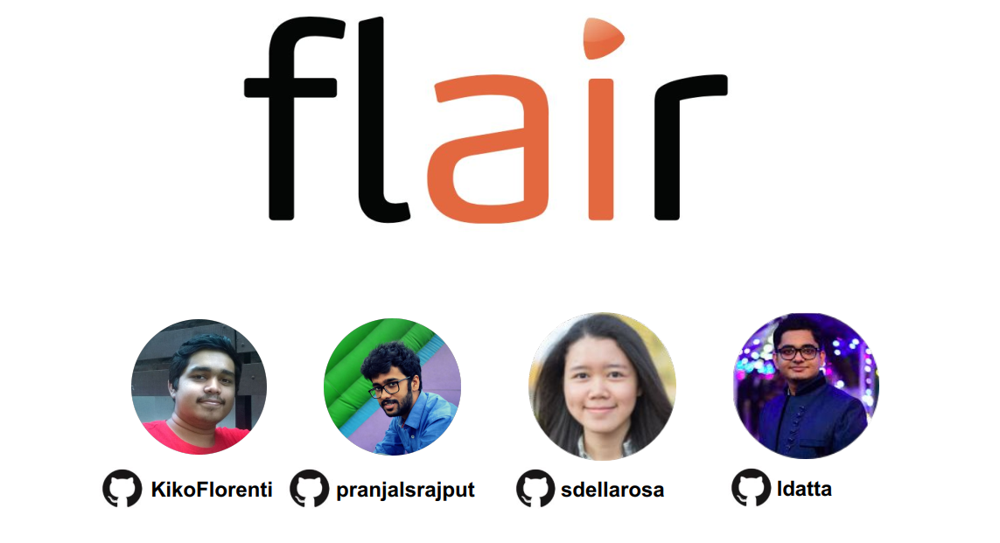

## Table of contents
* [1 Introduction](https://gitlab.ewi.tudelft.nl/in4315/2018-2019/TI3125TU-swa-12-flair/swa-12-flair/blob/master/report.md#1-introduction)
* [2 Stakeholders](https://gitlab.ewi.tudelft.nl/in4315/2018-2019/TI3125TU-swa-12-flair/swa-12-flair/blob/master/report.md#2-stakeholders)
    * [2.1 Main stakeholders](https://gitlab.ewi.tudelft.nl/in4315/2018-2019/TI3125TU-swa-12-flair/swa-12-flair/blob/master/report.md#21-main-stakeholders)
    * [2.2 Other stakeholders](https://gitlab.ewi.tudelft.nl/in4315/2018-2019/TI3125TU-swa-12-flair/swa-12-flair/blob/master/report.md#22-other-stakeholders)
    * [2.3 Stakeholder analysis: Power vs Interest Grid](https://gitlab.ewi.tudelft.nl/in4315/2018-2019/TI3125TU-swa-12-flair/swa-12-flair/blob/master/report.md#23-stakeholder-analysis-power-vs-interest-grid)
    * [2.4 Relevant people to contact](https://gitlab.ewi.tudelft.nl/in4315/2018-2019/TI3125TU-swa-12-flair/swa-12-flair/blob/master/report.md#24-relevant-people-to-contact)
* [3 Context view](https://gitlab.ewi.tudelft.nl/in4315/2018-2019/TI3125TU-swa-12-flair/swa-12-flair/blob/master/report.md#3-context-view)
    * [3.1 System scope](https://gitlab.ewi.tudelft.nl/in4315/2018-2019/TI3125TU-swa-12-flair/swa-12-flair/edit/master/report.md#31-system-scope)
    * [3.2 External entities and interfaces](https://gitlab.ewi.tudelft.nl/in4315/2018-2019/TI3125TU-swa-12-flair/swa-12-flair/edit/master/report.md#32-external-entities-and-interfaces)
* [4 Development view](https://gitlab.ewi.tudelft.nl/in4315/2018-2019/TI3125TU-swa-12-flair/swa-12-flair/blob/master/report.md#4-development-view)
    * [4.1 Module structure and organization](https://gitlab.ewi.tudelft.nl/in4315/2018-2019/TI3125TU-swa-12-flair/swa-12-flair/blob/master/report.md#41-module-structure-and-organization)
    * [4.2 Common Design Model](https://gitlab.ewi.tudelft.nl/in4315/2018-2019/TI3125TU-swa-12-flair/swa-12-flair/blob/master/report.md#42-common-design-model)
        * [4.2.1 Common Processing](https://gitlab.ewi.tudelft.nl/in4315/2018-2019/TI3125TU-swa-12-flair/swa-12-flair/blob/master/report.md#421-common-processing)
        * [4.2.2 Standardization of Design](https://gitlab.ewi.tudelft.nl/in4315/2018-2019/TI3125TU-swa-12-flair/swa-12-flair/blob/master/report.md#422-standardization-of-design)
        * [4.2.3 Standardization of Testing](https://gitlab.ewi.tudelft.nl/in4315/2018-2019/TI3125TU-swa-12-flair/swa-12-flair/blob/master/report.md#423-standardization-of-testing)
        * [4.2.4 Standard Software Components](https://gitlab.ewi.tudelft.nl/in4315/2018-2019/TI3125TU-swa-12-flair/swa-12-flair/blob/master/report.md#424-standard-software-components)
    * [4.3 Codeline models](https://gitlab.ewi.tudelft.nl/in4315/2018-2019/TI3125TU-swa-12-flair/swa-12-flair/blob/master/report.md#45-codeline-model)
* [5 Technical debt](https://gitlab.ewi.tudelft.nl/in4315/2018-2019/TI3125TU-swa-12-flair/swa-12-flair/blob/master/report.md#5-technical-debt)
    * [5.1 Pylint](https://gitlab.ewi.tudelft.nl/in4315/2018-2019/TI3125TU-swa-12-flair/swa-12-flair/blob/master/report.md#51-pylint)
    * [5.2 SonarQube](https://gitlab.ewi.tudelft.nl/in4315/2018-2019/TI3125TU-swa-12-flair/swa-12-flair/blob/master/report.md#52-sonarqube)
    * [5.3 Dependencies on developers](https://gitlab.ewi.tudelft.nl/in4315/2018-2019/TI3125TU-swa-12-flair/swa-12-flair/blob/master/report.md#53-dependencies-on-developers)
    * [5.4 TODO and FIXME comments](https://gitlab.ewi.tudelft.nl/in4315/2018-2019/TI3125TU-swa-12-flair/swa-12-flair/blob/master/report.md#54-todo-and-fixme-comments)
    * [5.5 Testing debt](https://gitlab.ewi.tudelft.nl/in4315/2018-2019/TI3125TU-swa-12-flair/swa-12-flair/blob/master/report.md#55-testing-debt)
    * [5.6 Discussions about technical debt](https://gitlab.ewi.tudelft.nl/in4315/2018-2019/TI3125TU-swa-12-flair/swa-12-flair/blob/master/report.md#56-discussions-about-technical-debt)
    * [5.7 Payment of technical debt](https://gitlab.ewi.tudelft.nl/in4315/2018-2019/TI3125TU-swa-12-flair/swa-12-flair/blob/master/report.md#57-payment-of-technical-debt)
    * [5.8 Evolution perspective](https://gitlab.ewi.tudelft.nl/in4315/2018-2019/TI3125TU-swa-12-flair/swa-12-flair/blob/master/report.md#58-evolution-perspective)
* [6 Functional View](https://gitlab.ewi.tudelft.nl/in4315/2018-2019/TI3125TU-swa-12-flair/swa-12-flair/blob/master/report.md#6-functional-view)
    * [6.1 Functional capabilities](https://gitlab.ewi.tudelft.nl/in4315/2018-2019/TI3125TU-swa-12-flair/swa-12-flair/blob/master/report.md#61-functional-capabilities)
    * [6.2 Functional structure model](https://gitlab.ewi.tudelft.nl/in4315/2018-2019/TI3125TU-swa-12-flair/swa-12-flair/blob/master/report.md#61-functional-structure-model)
* [7 Performance and scalability perspective](https://gitlab.ewi.tudelft.nl/in4315/2018-2019/TI3125TU-swa-12-flair/swa-12-flair/blob/master/report.md#7-performance-and-scalability-perspective)
    * [7.1 Performance](https://gitlab.ewi.tudelft.nl/in4315/2018-2019/TI3125TU-swa-12-flair/swa-12-flair/blob/master/report.md#71-performance)
    * [7.2 Scalability](https://gitlab.ewi.tudelft.nl/in4315/2018-2019/TI3125TU-swa-12-flair/swa-12-flair/blob/master/report.md#72-scalability)
* [8 Conclusion](https://gitlab.ewi.tudelft.nl/in4315/2018-2019/TI3125TU-swa-12-flair/swa-12-flair/blob/master/report.md#8-conclusion)
* [Appendix](https://gitlab.ewi.tudelft.nl/in4315/2018-2019/TI3125TU-swa-12-flair/swa-12-flair/blob/master/report.md#appendix)
    * [A. Pull requests](https://gitlab.ewi.tudelft.nl/in4315/2018-2019/TI3125TU-swa-12-flair/swa-12-flair/blob/master/report.md#a-pull-requests-analysis)
    * [B. Contact persons](https://gitlab.ewi.tudelft.nl/in4315/2018-2019/TI3125TU-swa-12-flair/swa-12-flair/blob/master/report.md#b-contact-persons)
* [References](https://gitlab.ewi.tudelft.nl/in4315/2018-2019/TI3125TU-swa-12-flair/swa-12-flair/blob/master/report.md#references)

## 1 Introduction

[Flair](https://github.com/zalandoresearch/flair/) is a state-of-the-art open source natural language processing framework 
developed by [Zalando Research](https://research.zalando.com/). Zalando Research is part of the fashion platform
[Zalando](https://zalando.com) that aims to scale technology in fashion with the power of 
experimentation in theory and in practice. Flair released in July 2018 and is a novel approach where 
natural language modeling is leveraged to learn powerful, contextualized 
representations of human language from large corpora. Such representations 
possess a multitude of semantic and syntactic information that
can be used to directly improve downstream NLP tasks. 

The standout features of this powerful NLP library lies in the usage of Named
Entity Recognition (NER), part-of-speech (PoS) tagging classification and sense
disambiguation. It boasts support for a variety of languages and continues to
grow with the help of many contributors. It  consists of taggers that 
are 'one model, many languages', that is, a single model can predict the PoS or
NER tags for given input text in various languages. Flair also provides a 
text embedding library with simple interfaces that allow for usage and 
combination of different word and document embeddings including the proposed 
Flair embeddings, BERT and ELMo  embeddings. It is built directly on PyTorch
which allows for ease of use in training and experimenting with models.


## 2  Stakeholders

Stakeholders in a software system refers to the individual, team or organisation that have interest in said system being realized. Each of these stakeholders have their vested
interests and needs from the system. A myriad of stakeholders are involved in activites such as 
building, testing, debugging, etc. It is imperative to identify individuals or groups that are 
likely to affect or be affected by a proposed action and sorting them according to their interactions. 
Stakeholder analysis is done so as to identify and prioritize the role of the stakeholders. 

We use the description of stakeholders obtained from Rozanski and Woods [[1]](#ref1) to classify stakeholders.
These stakeholders will be mentioned as **Main Stakeholders**. Stakeholders not part of the Rozanski and Woods classification, are described as
**Other Stakeholders**.


### 2.1  Main stakeholders


| Type                    | Description  |
| ----------------------- | ------------|
| **Acquirers**               | In Flair, control is orchestrated by Zalando which works on several real world problems. The researchers work on problems with the academic community, synergising with company objectives. Achievements of Flair will allow Zalando to properly utilize their resources. |
| **Assessors**               | The conformance of Flair to research standards is regulated by Zalando. The quality assurance is divided within contributors at the GitHub repository. [Alan Akbik](https://github.com/alankabik), who wrote [Contextal String Embeddings for Sequence Labeling](http://alanakbik.github.io/papers/coling2018.pdf) with Duncan Blythe and Roland Vollgraf, mainly oversees the commits along with [Dr. Kashif Rasul](kashif) and [Tanja Bergmann](https://github.com/tabergma). |
| **Communicators**           | Communicators act as conveyers of system specifications. To follow updates of Flair, watching the repository on GitHub is one way, followed by updates on their website. Akbik, Bergmann and Rasul are the communicators, which allows them to understand insights provided by other contributors. |
| **Developers**              | Initial attribution goes to the research team for their work on the paper. The other contributions come from developers and researchers. This allows the original developers to gauge the performance of the framework and identify areas of potential growth. Akbik has the most commits with 445, followed by Bergmann with 276, and Rasul with 31. GitHub users such as [Stefan Schweter](https://github.com/stefan-it) are active during development. There are 36 contributors.|
| **Maintainers**             | Bug fixes and maintenance are handled by both the developers and GitHub contributors. The maintainers are Akbik and Bergmann. They maintain the development of the library and check for functionality and version control. |
| **Production Engineers**    | Potential Production Engineers, would want to manage releases and run tests on builds. At the moment, the task is relegated to staff developers. The focus should also be on ensuring that the library performs efficiently. The deployment of Flair is the responsibility of users.|
| **Suppliers**               | The infrastructure used is that from the user's side and therefore the users in a way are also suppliers of hardware in addition to Zalando. GitHub is also a supplier as it provides a common platform for contributors to develop. Google Colab provides alternatives for hardware constraints. |
| **Support Staff**           | The Zalando Research team acts as support staff. [Per Ploug](https://github.com/perploug) acts as an intermediary between the external contributors and Flair developers. This also includes [Henning Jacobs](https://github.com/hjacobs), the Head of Developer Productivity at Zalando SE. Her team uses various tools to measure productivity of the developers. |
| **System Administrators**   | Since the library is used by users, they become system administrators themselves. This is also overseen by the Zalando team. System administrators are given the role of identifying issues with data associated with labeling and embeddings, performance problems and deviations from the desired non-functional performance requirements. |
| **Testers**                 | Testers in Flair are the core developers and other members of the research team. This includes Akbik, Rasul, Bergmann, [Nikolay Jetchev](https://github.com/nikjetchev) and external testers include GitHub users such as Schweter, [David Batista](https://github.com/davidsbatista), and [Nilabhra  Chowdhury](https://github.com/Nilabhra). |
| **Users**                   | The functionality of the system is used by students, researchers and companies. The scope of the project is understood mainly by people already well versed in NLP. Flair is already part of several in-production systems at Zalando, as machine learning has become a natural part of their engineering toolbox. |

*Table 2.1: Main stakeholders of Flair*

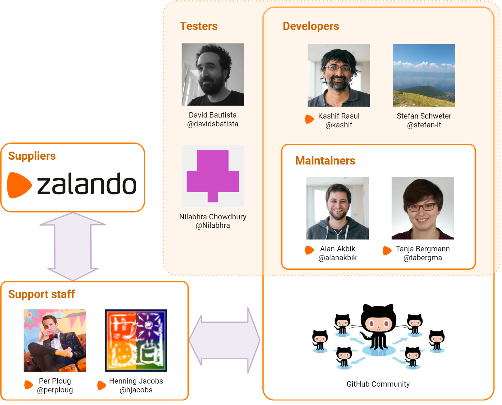

*Figure 2.1: Flair's stakeholders*


### 2.2 Other stakeholders


**Researchers and Scientists**:
They use the system to research and present 
findings. The use of embeddings and labelling in tagging are 
of vital interest.

**Competitors**:
The most widely known library is 
[NLTK](https://www.nltk.org/) which supports tasks like classification, 
tokenization, stemming and semantic reasoning. It is difficult to use and considerably slow. [Gensim](https://github.com/RaRe-Technologies/gensim) 
is a Python library that specializes in identifying semantic similarities between 
two documents through vector space modeling.

**Translators**:
At the moment, the NLP tasks can be performed on languages such as English, 
Dutch, Spanish, German, Polish and a few others. Other languages are not 
supported yet and Flair invites developers to contribute to the corpora and the 
embeddings list in order to support more languages

**Enthusiasts**:
There are several students and developers who are interested in 
performing NLP tasks and would therefore find contributing to Flair an exciting way to 
broaden their horizons. 

**Bloggers/Social Media**:
They are unambigous and provide reliable sources of information for new developers to start contributing. They also 
help bring the project into limelight. 
This [article](https://jaxenter.com/zalando-flair-nlp-154250.html) is an example 
of a website providing a tutorial and this [article](https://www.i-programmer.info/news/105-artificial-intelligence/12441-zalando-flair-nlp-library-updated.html) 
is an example of a blogger sharing their insights.

**Sponsors**:
Even though the library is an open source, it originated from the Research Team at 
Zalando. Setting up of architecture and funding for research is 
provided by Zalando. The results of the research are 
essential for Zalando to further its business operations.

**Integrators**:
Integrators are the architects and core developers of Flair 
who are responsible for maintaining code standard and consistency of 
Flair. Developers like Akbik and Bergmann 
are the main integrators here. To keep the framework stable, they merge Pull Requests (PR) 
which they successfully align with their versions of sources and languages. 
When a new module is added, they check if the change is needed and 
also verify documentation changes. This procedure helps maintain the quality of the framework, keeping it 
open source as well. To discuss the challenges of the integrators, 
one important aspect noticed is that sometimes, a major part of the PR works
on test set whereas a small part does not give expected test result. In these 
cases, the PR is not directly closed. It is kept as open, the integrators comment on the errors they face, and suggest what changes 
can be created to overcome that. Sometimes, the same contributor makes the 
required changes or other contributors have a chance to solve the 
issue as well. After reviewing the code and 
checking for errors, the PR that meet their requirements are merged. 


### 2.3 Stakeholder analysis: Power vs Interest Grid

Based on Mendelow's Power vs Interest Grid [[2]](#ref2), the groups of stakeholders necessary to be managed closely 
are classified.  


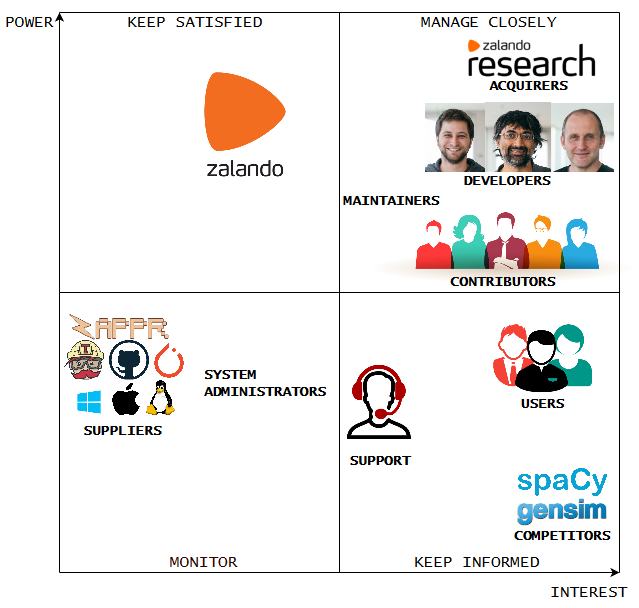

*Figure 2.2: Power-Interest grid*

The Power Interest Grid for Flair is used to classify the groups of stakeholders necessary
to be managed. Most of the stakeholders mentioned earlier are included in the Grid. While users have a high interest in Flair, 
suppliers do not. Suppliers have more power and should they decide to stop supplying, then Zalando
will have to adapt their products accordingly. The contributors, maintainers and developers need to be managed closely because of their inherent interest in the product
and the power they hold in influencing design and development. 

### 2.4 Relevant people to contact

By analyzing the online community around Flair we found that the following people 
are the most involved in the project. The relevant people and persons of interests 
were identified and can be found in [Appendix B](https://gitlab.ewi.tudelft.nl/in4315/2018-2019/TI3125TU-swa-12-flair/swa-12-flair/blob/master/report.md#b-contact-persons).


## 3 Context View

Context view describes a software's dependencies, integrations, scope, 
responsibilities and interface with external entities. In Flair's context, 
we will show a context view diagram, discuss the system scope and analyze the interfaces with all its external entities.

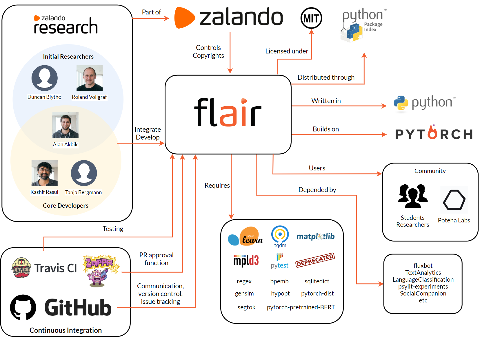

*Figure 3.1: Context view diagram*


### 3.1 System scope

Flair is a research project of Zalando Research, in the area of NLP. Flair is a 
cutting edge NLP framework, advancing over all the other existing methodologies. 
The scope of Flair is well defined and its current version includes the following 
capabilities [[3]](#ref3).
  
* Built upon Pytorch 0.4+ which is compatible on all operating systems: Windows, MacOS and other Unix-based OSs, and that helps in training your own models.
* Can be easily installed using a [pip command](https://github.com/zalandoresearch/flair#requirements-and-installation).
* It is used to read, understand and learn the contextualized representation of the human language.
* It helps in understanding and classifying the email responses, website comments or customer responses.
* Flair can be trained to recognize fashion concepts such as season, brand, and color.
* Supports state-of-the-art Natural Language Processing models such as name entity recognition (NER), part-of-speech tagging (PoS), sense of disambiguation and classification.
* Supports 36 word embeddings for 31 different languages, character embeddings, Byte Pair embeddings (275 languages supported) and stacked embeddings.
* There were 7 different releases till now and the current version is `Version 0.4.1`.

### 3.2 External entities and interfaces

*  Flair is licensed under the following MIT License (MIT) Copyright 2018 [Zalando SE](https://tech.zalando.com).
*  It is written in Python 3.6, which provides the framework and programming language.
*  It is developed by core committers, developers, community contributors and product managers.
*  Users are developers and the organizations that use Flair. Flair is used by [Poteha Labs](https://potehalabs.com/en/) in their research work, by student researchers, and at several in production systems at Zalando.
*  Communication channel is used for communciation between developers and users. Flair uses GitHub mainly as its communication channel for interaction with the team. It's also being used for version control. Github is also used for logging issues in the system and for keeping track of them.
*  Flair uses Travis CI as a build tool for building its code and  thereafter integrating the build. It also uses Travis CI as a testing platform.
*  It has interfaces that allows to combine different word and document embeddings, including BERT embeddings, Flair embeddings and ELMo embeddings.
*  Flair [hosts](https://github.com/zalandoresearch/flair/blob/master/SECURITY.md) their bug bounty program privately on [HackerOne](https://www.hackerone.com/).


## 4 Development View

Through the theory of development view, we address several aspects of the system development process. Due to the associated 
complexity of the framework being built, the expertise of the core developers 
and technologies used are discussed. In the following sections Module Organization, 
Common Design models and Codeline models are discussed.


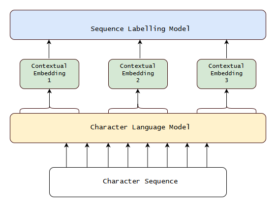

*Figure 4.1: Architecture of language model esed in Flair*

The diagram describes a general language model used by Flair. 
The structure varies based on the kind of embeddings.
We start from the bottom, where a sentence is put in
as a character sequence into a pre-trained bidirectional Character Language Model 
(CLM). From this CLM, they retrieve for each word a contextual embedding by 
extracting the first and last character cell states. 
This word embedding is then passed into a sequence labeler, such as a vanilla BiLSTM-CRF, 
achieving robust state-of-the-art results on downstream tasks.


### 4.1 Module structure and organization

 
In this section, we detail Flair's module organization, as well as important 
dependencies between modules, in order to obtain a good understanding of 
Flair's code structure, based on [[1]](#ref1). The inter dependency of the modules are shown in *Figure 4.2*.


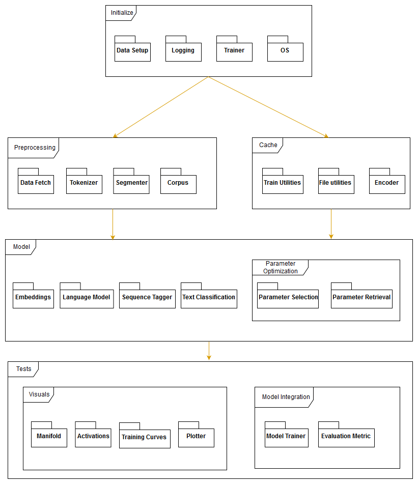

*Figure 4.2: Module Organization of Flair*

The projects is run directly on a single repository. It is seen that there is high cohesion and 
low coupling. The high cohesion stems from the `model` and `test` module and the 
low coupling can be seen from the division of several modules for only certain 
associated functionalities. 

* The `Initialize` package is used to check for compatibility 
and versions of OS, Pytorch, Cuda and others. The 
`Data Setup` package is used to setup up data fetchers, model initializers and 
logging tools.
* The `Preprocessing` module handles text, word and document embeddings-based preprocessing , including tagging, and labeling.
* The `Cache` module deals with utility history for 
training purposes. It helps encode embeddings into available embeddings list.
* These embeddings can be selected along with the associated `Language Model`
in order to determine the classification algorithm.
* `Parameter Optimization` helps select parameters such as 
document length, batch size, or weights. The results are tested by 
visualizing plots and training curves.


### 4.2 Common design model

This section covers Flair's **Common Design Model**. Commonality 
across different versions of Flair is done by defining a set of strict design
constraints.

#### 4.2.1 Common processing

In Flair there is common processing among different elements 
in order to simplify the integration of code units and scripts. We discuss the
common processing elements here.


* **Initialization** of Flair follows the usage of a particular task such as 
embedding. Here, NER task is shown. 
Every embeddings, labeling and language model task has predefined 
ways of initialization and implementation as given in the 
[tutorials](https://github.com/zalandoresearch/flair/tree/master/resources/docs).

 
     ```python
    from flair.data import Sentence
    from flair.models import SequenceTagger
    
    # make a sentence
    sentence = Sentence('I love Berlin .')
    # load the NER tagger
    tagger = SequenceTagger.load('ner')
    # run NER over sentence
    tagger.predict(sentence)
     ```
   
  
* **Use of third party libraries** exists in the framework of Flair. 
Flair makes use of third party libraries whenever possible, which we consider 
to be a standard design approach. We see that in the embeddings, pytorch-pretrained BERT 
embeddings are used, and certain modules from scikit-learn, gensim and NLTK are also
included.

* Through **Instrumentation**, we can measure the performance of a particular 
metric. The console log and statistics are sent to the 
developer when tests are run on the integration build using Travis CI. 

* Owing to the large processing load that Flair tasks can put the user system in, it is also recommended
for the contributors to make use of [Google Colab](https://colab.research.google.com/notebooks/welcome.ipynb).


* Flair has a clear standardized design methodology and testing procedure when
it comes to [contributions](https://github.com/zalandoresearch/flair/blob/master/CONTRIBUTING.md) and changes. 


* **Security** issues are acknowledged by Zalando and they try to be
responsible by patching quickly. They host a bug bounty 
program on [HackerOne](https://hackerone.com/zalando_be). Vulnerabilities are also posted
using this [form](https://corporate.zalando.com/en/services-and-contact#security-form).

* **Database Interaction** is streamlined by ensuring that newly added corpus 
are first tested. Once they pass the tests, the datasets are added to the available corpora 
and the resultant embeddings trained are added. 


#### 4.2.2 Standardization of design

The Flair repository has the 
[Contributor Covenant Code of Conduct and Contribution](https://www.contributor-covenant.org/) guidelines.
There is provision of tutorials that provides guidelines for setting 
up the [libraries](https://github.com/zalandoresearch/flair/blob/master/resources/docs/TUTORIAL_1_BASICS.md)
and [embeddings](https://github.com/zalandoresearch/flair/blob/master/resources/docs/TUTORIAL_3_WORD_EMBEDDING.md),
[using pre-trained models](https://github.com/zalandoresearch/flair/blob/master/resources/docs/TUTORIAL_2_TAGGING.md),
adding your own [corpus](https://github.com/zalandoresearch/flair/blob/master/resources/docs/TUTORIAL_6_CORPUS.md)
to train your own [models](https://github.com/zalandoresearch/flair/blob/master/resources/docs/TUTORIAL_7_TRAINING_A_MODEL.md) 
and to train [embeddings](https://github.com/zalandoresearch/flair/blob/master/resources/docs/TUTORIAL_9_TRAINING_LM_EMBEDDINGS.md).

* The tutorials provide details on using 
libraries and embeddings while creating new embeddings and models. Any steps taken towards issue creation, contributing to issues, 
making use of pull requests and merging them must be done in concordance with the 
[Code of Conduct](https://github.com/zalandoresearch/flair/blob/master/CODE_OF_CONDUCT.md)
and these contributions should fulfill the
[Contribution and Commit Guidelines](https://github.com/zalandoresearch/flair/blob/master/CONTRIBUTING.md).


* Having a global reach allows developers to train and test the language models on 
different languages other than those already supported by Flair. To maintain a supportive, active community the 
[conduct of conduct](https://github.com/zalandoresearch/flair/blob/master/CODE_OF_CONDUCT.md) states:
    >  In the interest of fostering an open and welcoming environment, we as contributors and maintainers pledge to making participation in our project and our community a harassment-free experience for everyone, regardless of age, body size, disability, ethnicity, gender identity and expression, level of experience, nationality, personal appearance, race, religion, or sexual identity and orientation.

*  The coding style employed in Flair requires the developers 
to follow the [Style Guide for Python](https://www.python.org/dev/peps/pep-0008/) to maintain conformity. 
Since the library is still under development, it is necessary to request the developers 
to set or ask developers to employ any other aspects of coding styles they want to. 

* Flair is built using Python 3.6+ as per the 
[requirements](https://github.com/zalandoresearch/flair/blob/master/requirements.txt). It is mentioned that 
the expectation from developers is to follow the standards of coding style as defined for 
each module and library used. The [regex](https://www.rexegg.com/regex-style.html) guide give tips on regular expressions. 
The [Gensim](https://radimrehurek.com/gensim/apiref.html) guide provides tips for using Gensim.

* **Logging** is essential for developers during development
to ensure that the system worked as intended and can be understood by another
developer. 

* **Design Patterns** is used sparingly. The aim of Flair is to focus on performance. As a result, 
Flair avoids design patterns which in turn acts as an obstacle towards the readability of the code. Different pieces of 
code working on the same or similar task can look different and would mainly require explanations or comments from the 
contributors rather than what is mandated by the developers. It makes it more difficult for someone to contribute 
to the project because the developers might want to see particular code patterns, but these patterns are not communicated 
to contributors.

#### 4.2.3 Standardization of Testing
The standards of testing in Flair are mainly dependent upon integration checks and verification of pull requests that developers make. In this section, the tools used for testing purposes are discussed.

 
* There are [tests](https://github.com/zalandoresearch/flair/tree/master/tests) 
specified for a variety of NLP tasks that need to be accounted for. The design pattern
followed for testing involves individual task based tests and then integration and build tests. The task based test
specifications detail the tests that the partiuclar tasks must pass. Furthermore,
the integration to complete the pull requests are tested with Travis CI and Zappr.
* For autoamted testing, Flair uses Travis CI (continuous integration) and it is ran on all pull requests and all 
commits to a branch to verify that it builds and it passes testing. Regardless of which type of CI run for testing, 
all CI jobs must pass before the pull request is merged by Flair maintainers. 
* The process starts at the *.travis.yml* file in the root of Flair repository. It specifies all the steps for building a test environment. 
The build lifecycle is made up of two steps, one is install which installs any dependencies required and the other one 
is script which runs the actual tests. In script, multiple script commands are specified. If one of the build commands 
returns a non-zero exit code, the Travis CI build runs the subsequent commands as well, and accumulates the build result.
* Using Zappr developers check for patterns in pull requests. At least two approvals from other people including collaborators are 
necessary conditions. The *.zappr.yaml* file contains other details on how to determine which pull requests are valid based on conditions set.


#### 4.2.4 Standard software components

* The dependencies on which Flair depends are standard components required for 
the funcitoning of the Flair Model. This can be seen in the 
[requirements](https://github.com/zalandoresearch/flair/blob/master/requirements.txt) page. 
These include gensim, pytorch and other dependent software. All developers aiming
to contribute must have these rquired base and dependency software installed in 
compatible environments. 
* [Zappr](https://github.com/zalando/zappr) is a GitHub integration built to 
enhance your project workflow. Built by open-source enthusiasts, it's aimed 
at helping developers to increase productivity and improve open-source project
quality. It does this primarily by removing bottlenecks around pull request 
approval and helping project owners to halt "rogue" pull requests before 
they're merged into the master branch. 


### 4.3 Codeline models


* **Source code structure**: The complete directory organization of Flair can be seen in *Figure 4.4*.
* **Build approach:**
Flair uses [*Pull Request Workflow*](https://gist.github.com/Chaser324/ce0505fbed06b947d962 ). The straightforward approach makes it
easily understandable for contributors and provide them with naming
conventions, files etc. Following a *Pull Request Workflow* helps the developers
make contributions via GitHub and allows other contributors
to read code changes and make remarks when there are errors or issues in the
requested PR. Some PRs have discussion threads, giving more
insights about how testing is done and what parameters are checked before a
successful merge. The merge is complete only after a final check is carried
out in Zappr. 
* **Release process:** The release process does not contain any fixed timing,
unlike a weekly or monthly release. As of now, no such fixed release process has been
mandated by the core developers. However, the last few versions have been released
once a month. In fact, Flair now has had a total of 7 [releases]( https://libraries.io/pypi/flair).
The developers are working towards a stable release and therefore are working on 
the master branch. Bug fixes made and potential speed improvements achieved are highlighted. 
 
* **Configuration management:** Flair is managed directly on GitHub and new
versions on Flair are released through GitHub releases. The reliability on
GitHub is due to its provision of a competent version control system to maintain
the source code. This supports repetition via commits and branches.
The configuration structures used are repositories, branches, tags, commits,
pull requests, issue trackers and milestones.  
* **Contact with the developers**: The initial point of contact starts from 
[Issues](https://github.com/zalandoresearch/flair/issues). The developer or contributor can discuss and deal with build-specific issues like bugs, 
errors, crashes and compilation errors. Most of the [issues](https://github.com/zalandoresearch/flair/issues) 
are closed within a week but there are certain issues that take more time. 
* **Pull requests**: [Pull Requests](https://github.com/zalandoresearch/flair/pulls), 
allow for contribution and addition of new features, fixes and bug corrections, and optimization of 
current features. First time contributors are 
encouraged to look into issues already posted by others in need of [help](https://github.com/zalandoresearch/flair/labels/help%20wanted). 
The official [guidelines](https://github.com/zalandoresearch/flair/blob/master/CONTRIBUTING.md) mention details for 
contributing with pull requests, checking for issues and explain the Git Commit process. Every pull request is reviewed by 
[Akbik](https://github.com/alanakbik), [Schweter](https://github.com/stefan-it) and [Bergmann](https://github.com/tabergma). 
* **Travis CI** : Flair uses Travis CI to manage continuous integrations to build and test Flair on the fly. 
When new commits are pushed to the repository, 
the specifications and commands in the [`.travis.yml`](https://github.com/zalandoresearch/flair/blob/master/.travis.yml) 
file will be run and then project is built. The results of the tests are sent to the developers and maintainers 
including job logs for specified pull request. 
* **Zappr**: Flair makes use of [Zappr](https://github.com/zalando/zappr) , a GitHub integraiton developed by Zalando. Zappr makes it easier to manage project workfows. 
Flair makes use of Zappr to restore and improve code review. Using Zappr, the developers are able to enable/disable pull 
request approval checks per repository, with the simple flip of a toggle,  configure what counts an approval and what 
doesn't and can provide a configurations file that overrides Github's default settings and endows users with PR approval 
authorization.

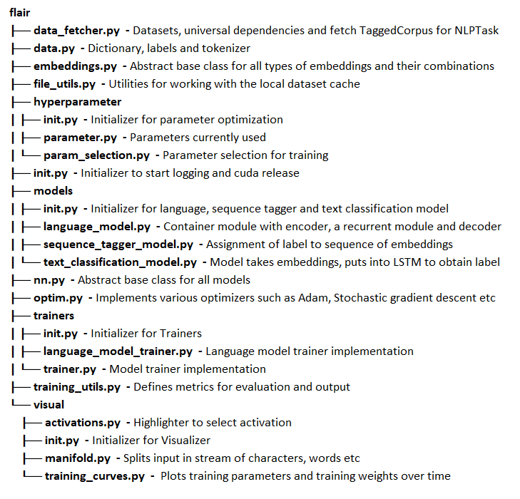 

*Figure 4.4: Directory organization of Flair and simplified version of the directory strcuture with added explanation*


## 5 Technical Debt
Technical debt is a metaphor that describes the immature artifact in the process of software 
development, that causes an additional rework because of choosing an easy solution over a better approach that would
take a longer time to implement. Main reasons for technical debt are leaving the tasks undone, copying and
pasting a piece of code, negligence to lessen the code complexity, incomplete unit testing, and lack of proper documentation.
In this section, we will discuss the technical debt and its handling by the community.
For this purpose, we used two tools, Pylint and SonarQube to analyze the code quality of Flair.
 

### 5.1 Pylint
[Pylint](https://www.pylint.org/) is a bug and quality checker for Python which follows the style
recommended by Python style guide PEP 8.
Pylint gave the package an overall rating of 7.08 and detected 1168 violations.
Although, we note that some of the violations are not major. For example,
418 violations due to lines that are too long, i.e. they have more than 100
characters and 124 violations are caused by
invalid variable or argument names that do not conform to the recommended
naming style.

As shown in *Figure 5.1*, we see the second most common violation is
missing docstrings. It is necessary to put docstrings on functions,
methods, modules, and classes in order to preserve maintainability of the
software, as docstrings would allow other contributors to better understand
what the specific part of the code does.

Pylint also found one important violation, in that the module `embeddings.py`
contain 1939 lines, which is almost double the recommended 1000 lines. This also
affects maintainability of the code as a very big module is harder to maintain
and might end up causing unnecessary dependencies when extended.

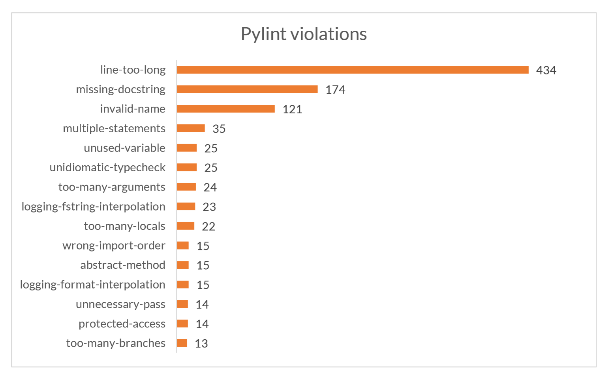

*Figure 5.1: Top 15 violations detected by pylint*


### 5.2 SonarQube
[SonarQube](https://www.sonarqube.org/) is a framework that detect bugs, code smells, duplicate code,
and security vulnerabilities of a program in many languages, including
Python.

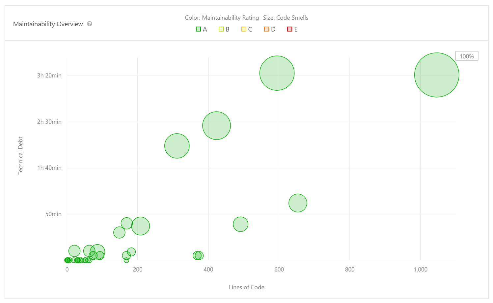

*Figure 5.2: Technical debt of each module*


#### 5.2.1 Bugs 

SonarQube detected 18 bugs in Flair codebase. All the 18 bugs are major issues,
and hence the code quality has been graded as C. All the bugs are related to the
useless assignment to variables. They have no such impact on program functioning but useless variables consume the CPU memory which reduces the performance while training heavy data in Flair.
These can be fixed by either removing the redundant variable or by assigning it some different value that was intended for the assignment instead.

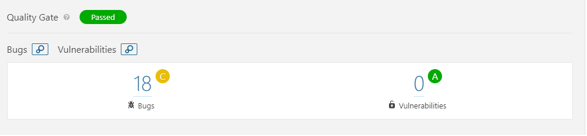

*Figure 5.3: Detected bugs*


#### 5.2.2 Vulnerabilities

Vulnerability detected by SonarQube is 0%, that means code quality is very good 
from security point of view. The code quality has been graded as A.

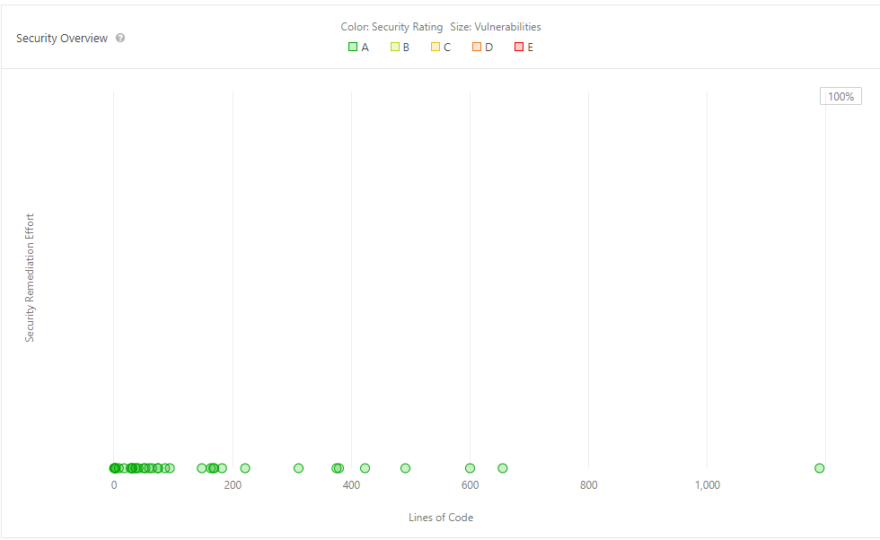

*Figure 5.4: Code quality*
 
 
#### 5.2.3 Code smells

Code smells are one of the major contributors to technical debts, and indicates 
the weakness of the code, and may cause the increased risk of failures or bugs. 
They are not actually bugs and do not cause any hindrance in program functioning. 
Total 61 Code Smells detected by SonarQube, most of them are related to Cognitive 
complexity, that asks for changing the logic of the program because of inclusion 
of nested loops or conditional statements. As Flair is an NLP library and needs to train large amount of data. So it takes a lot of time to train.
These code smells therefore makes the program slower as well as increases the chance of failure or bugs in future. So, fixing these will bolster the performance of Flair.

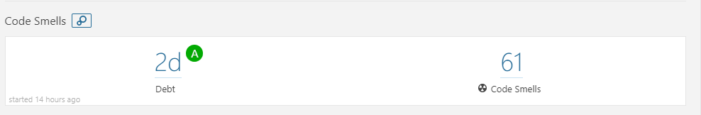

*Figure 5.5: Code smells*


#### 5.2.4 Duplications

One of the worst coding practices is duplication. Duplicating a block of code not 
only replicates the potential issues but also breaches the coding standards. 
SonarQube has detected 668 duplicated lines in 5 duplicated files. 
An overall of 7.2% duplication is detected in Flair codebase. The duplications
are due to similar functions performed for counting the embedding length of different
embedding classes. This could be removed by implementing a base function
in the abstract base class that could be used by the different child classes.

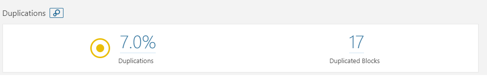

*Figure 5.6: Line duplications*

### 5.3 Dependencies on developers

It is noticeable that the product development is highly dependent on two of the 
core developers, Akbik and Bergmann. A huge difference between the 
contributions of these two and the other developers of the product can be seen 
in the graph below. This has created a high risk of project collapse in case one 
or both core developers leave the team. Ideally, there must not be too much 
dependency on a single developer, instead majority of the developer community 
must be equally contributing.

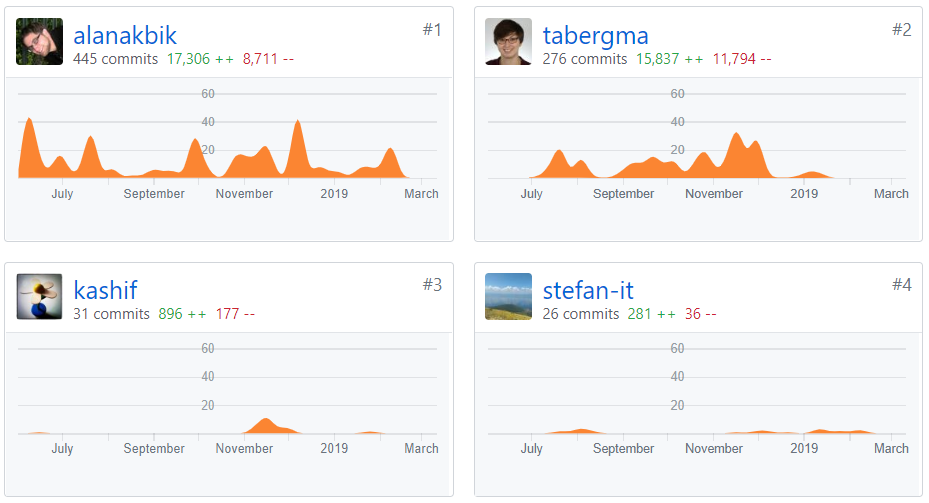

*Figure 5.7: Main developers*


### 5.4 TODO and FIXME comments

TODO or FIXME are 
the special type of comments that can be added inside the line or block comments
for any future references of possible changes, areas of improvements, and optimizations. 
It is a good indication of technical debt.

We found 2 TODO comments in 2 files in Flair's codebase. 
This is a very low number for TODO comments. This can be seen in 
different ways. Firslty, they might be fixing TODO tasks on time and not piling 
them up in code, which actually is an ideal coding practice. Secondly, they 
might have removed the comments and have logged an issue instead in GitHub, 
which actually is a better practice rather than keeping it inside code and 
creating techincal debt. 

The small number of TODO comments is actually an indication of good coding practice, but 
still these remaining ones needs to be fixed.


### 5.5 Testing debt

A part of technical debt is to measure how thoroughly the software is tested. 
This is also called the **testing debt** of the system. 
Even though a program may be tested regularly after a change is made in the code, 
it is important that all modules of the program are covered by the tests. 
In other words, we need to ensure that the **code coverage** is high.

#### 5.5.1 Testing procedure

Flair uses [Travis CI](https://travis-ci.org/zalandoresearch/flair) to test 
their product. Each commit to the git repository 
will trigger a build on Travis CI where a virtual environment on Travis CI’s 
server will be set up. All the required packages will then be installed in this 
virtual environment, then the test modules under the `tests/` directory will be 
run in this virtual environment. The code must pass all the tests. 
There are 12 tests in total.


#### 5.5.2 Code coverage

[Pytest](http://pytest.org) is a framework that can be used to both test and 
report the code coverage of a Python program. We used this tool to find Flair’s 
code coverage, then we sent the results to [coveralls](http://coveralls.io) 
where the well-tested and less-tested modules are shown in detail.

The result tells us that only 1912 of 4295 relevant lines (44.52%)
have been hit at least once by one of the test cases. In *Figure 5.8*, we see
that `visual` is the most well-tested module while `trainers` is the least
well-tested one.

Although the code coverage seems rather low in most of the files and modules, 
a closer look into the lines missed revealed that many of them are contained 
within an `if` block. This means that the `if` conditions are not satisfied 
during the tests. Considering that Flair is a language processing framework 
that needs to have different processes for different languages and the fact 
that the tests only use resources in English, it makes total sense that the 
code coverage would be rather low.

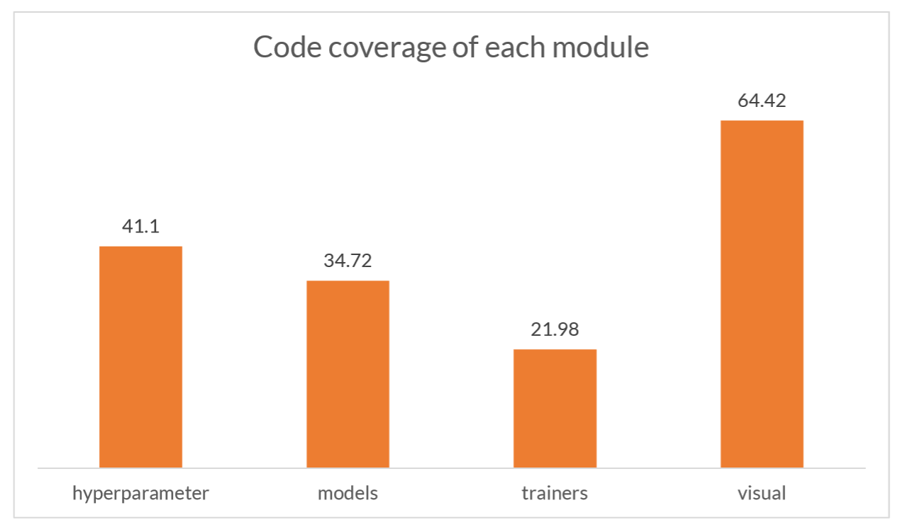

*Figure 5.8: Code coverage of each module*


#### 5.5.2 Actions to improve testing

As discussed earlier that many conditions are not hit due to the separated
conditions for each language, the testing could then be improved by 
augmenting the test resources. Although, we also note that this could
drastically improve the testing time.


### 5.6 Discussions about technical debt

There are no discussions about the technical debt between the developers, which 
is quite shocking. It seems like they are not using any code quality tools. 
Regardless, the code quality is of the highest level, which actually is a 
good thing. However, its highly recommended to use one so as to avoid having any 
future technical debts.


### 5.7 Payment of technical debt

We tried to pay the technical debt by improving the code quality from Grade C to 
Grade A. This is done by fixing all the 18 major bugs that are detected in
SonarQube, to now have 0 bugs in the system. Same source code style is used 
as in project and its ensured that no new bugs are introduced because of this 
fix. A pull request ([#616](https://github.com/zalandoresearch/flair/pull/616)) 
has been created in the master branch of the project 
Flair, which is still pending and needs to be approved by the owner and then 
merged. Also, the code build was verified and passed in Travis CI.

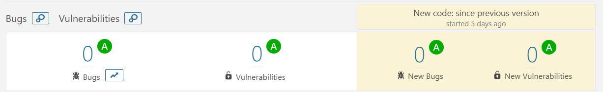

*Figure 5.9: Detected bugs after change*

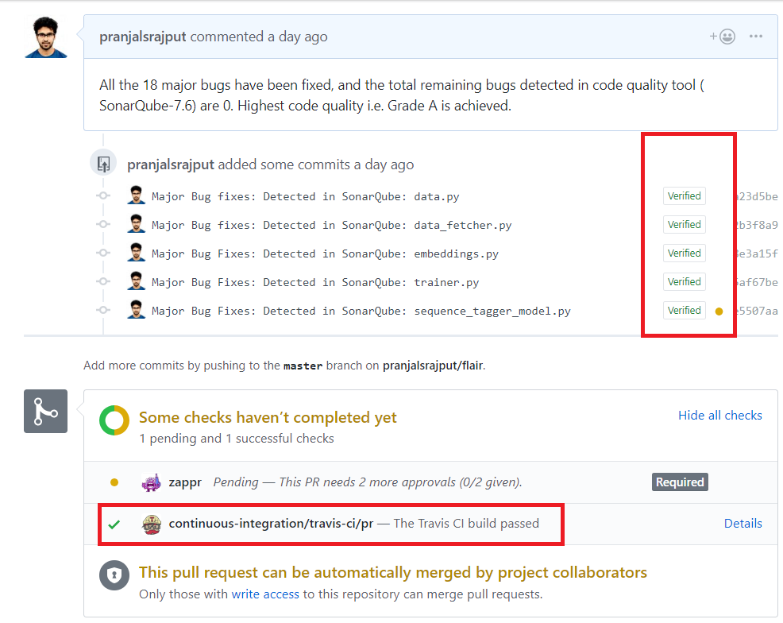

*Figure 5.10: Pull request*

### 5.8 Evolution perspective


Development of Flair was started in the summers of 2018 by Zalando Research and is licensed under MIT [[3]](#ref3). It was made an open source Python project by Zalando SE in June, 2018 [[3]](#ref3).
Its based on the research done by Akbik et al. Akbik is the main developer since the start of the project and still is the head developer.

The first draft of the project `Version 0.1.0` was released on Jul 13, 2018 [[3]](#ref3). Since then, 998 commits have been done to the master and 7 different versions have been released, 
with `Version 0.4.1` being the latest [[3]](#ref3). Technical debt is paid in every release by timely fixing bugs. Also, code is being reorganized if needed, which helps in reducing 
technical debt like duplications. Documentation is done for every new feature add or for any updation. Different new features were added and improvements were done over the period 
of time in different releases. Some of the key features of different releases are shown in *Figure 5.12*.

There are 93 issues still open, and 294 are closed [[3]](#ref3). Most of the open issues are of `question` label, but the bug count must be kept zero. Also, there are 6 pending pull requests, 
which must also be taken into consideration.

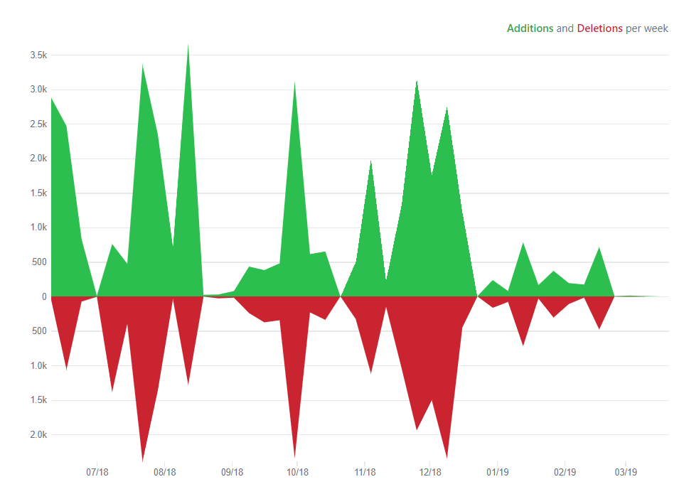

*Figure 5.11: Code frequency*

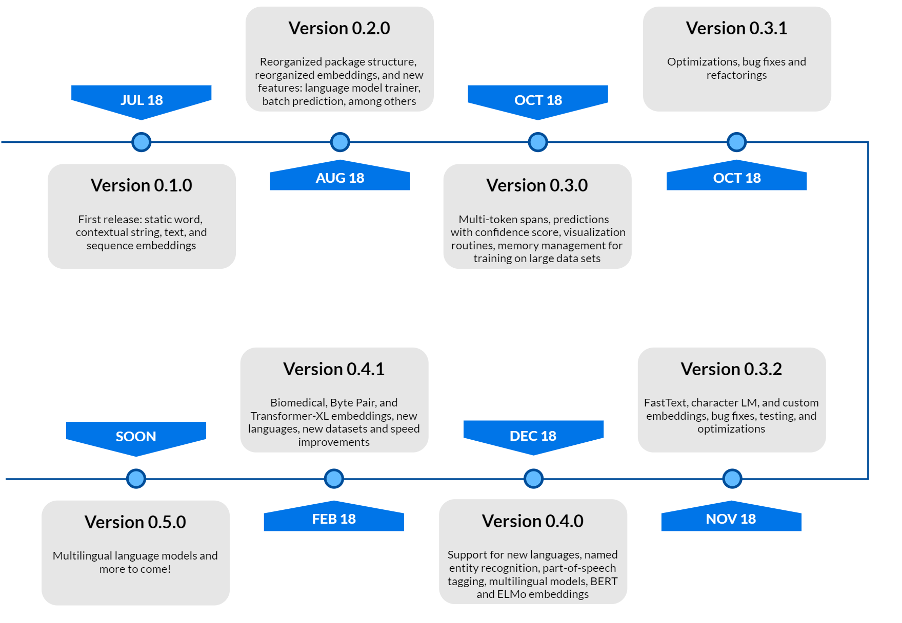

*Figure 5.12: Flair's releases*


## 6 Functional View

Functional view mainly describes systems architectural elements. It explains about primary interactions between the functional elements, their exposed interfaces and their responsibilities [1].

### 6.1 Functional capabilities 

Functional capabilities define what the system is required to do and what it is not required to do [1]. 
Flair has many capabilities and some of the most vital ones are listed in the table
below.

| Modules                    | Description  |
|----------------------------|--------------|
| **embeddings.BytePairEmbeddings**| Supports 275 languages. Very useful for training small models. This can also be used in sequence tagging.|
| **embeddings.TransformerXLEmbeddings**| As proposed by Dai et al. [?], this embeddings address the limitation of fixed-length contexts, as a notion of recurrence is introduced by reusing the representations from the history. |
| **embeddings.ELMoTransformerEmbeddings**|  Uses a bidirectional recurrent neural network to predict the next word in a text.  |
| **embeddings.DocumentRNNEmbeddings**| This class allows to choose which type of RNN to use.|
| **embeddings.FlairEmbeddings**| Trained without any explicit notion of words and model words as sequences of characters. Same word will have different embeddings depending on its contextual use.|
| **embeddings.WordEmbeddings**|  Supports pre-trained FastText Embeddings for 30 languages: English, German, Dutch, Italian, French, Spanish, Swedish, Danish, Norwegian, Czech, Polish, Finnish, Bulgarian, Portuguese, Slovenian, Slovakian, Romanian, Serbian, Croatian, Catalan, Russian, Hindi, Arabic, Chinese, Japanese, Korean, Hebrew, Turkish, Persian, Indonesian. |
| **data_fetcher.NLPTaskDataFetcher**| This can be used to load different datasets using the `load_corpus()` function. |
| **trainers.ModelTrainer**| This is used to train a user's own language model embeddings. It supports multi-dataset training using a `MultiCorpus` object.  |
| **models.LanguageModel** | Container module that has an encoder, a recurrent module, and a decoder. |
| **models.TextClassifier** | The module takes word embeddings, puts them into an RNN to obtain a text representation, and puts the text representation in the end into a linear layer to get the actual class label. |
| **models.SequenceTagger** | Contains several pre-trained English and Multilingual models, which include Named Entity Recognition (NER) and Part-of-Speech Tagging (POS). The function `load()` can be called with the appropriate string to load a model. |

*Table 6.1: Some of Flair's most vital modules*


### 6.1 Functional structure model

Flair has three major functional elements: embeddings, model trainer, and
train and file utitilies. Flair uses its train and file utilities to read
corpus objects with which a model can be trained. There are several
different embedding classes that Flair provides, but all of these embeddings
can be classified into three types: BERT, ELMo, and Flair embedding classes.
The user can choose to perform a named entity recognition, part-of-speech
tagging, and sequence tagging using one of these embeddings.


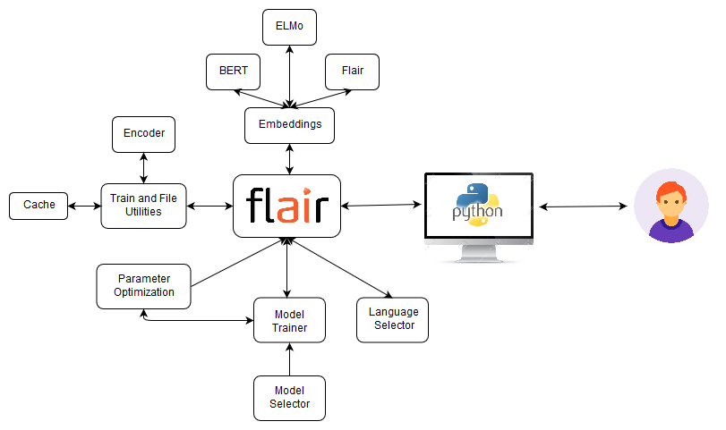

*Figure 6.1: Flair's functional structure model diagram*


## 7 Performance and scalability perspective

### 7.1 Performance

| Task | Language | Dataset | Flair | Previous best |
| -------------------------------  | ---  | ----------- | ---------------- | ------------- |
| Named Entity Recognition |English | Conll-03    |  **93.18**  | *92.22 [(Peters et al., 2018)](https://arxiv.org/pdf/1802.05365.pdf)* |
| Named Entity Recognition |English | Ontonotes   |  **89.3**  | *86.28 [(Chiu et al., 2016)](https://arxiv.org/pdf/1511.08308.pdf)* |
| Emerging Entity Detection | English | WNUT-17      |  **49.49**  | *45.55 [(Aguilar et al., 2018)](http://aclweb.org/anthology/N18-1127.pdf)* |
| Part-of-Speech tagging |English| WSJ  | **97.85**  | *97.64 [(Choi, 2016)](https://www.aclweb.org/anthology/N16-1031)*|
| Chunking |English| Conll-2000  |  **96.72** | *96.36 [(Peters et al., 2017)](https://arxiv.org/pdf/1705.00108.pdf)*
| Named Entity Recognition | German  | Conll-03    |  **88.27**  | *78.76 [(Lample et al., 2016)](https://arxiv.org/abs/1603.01360)* |
| Named Entity Recognition |German  | Germeval    |  **84.65**  | *79.08 [(Hänig et al, 2014)](http://asv.informatik.uni-leipzig.de/publication/file/300/GermEval2014_ExB.pdf)*|
| Named Entity Recognition | Dutch  | Conll-03    |  **90.44**   | *81.74 [(Lample et al., 2016)](https://arxiv.org/abs/1603.01360)* |
| Named Entity Recognition |Polish  | PolEval-2018    |  **86.6** <br> [(Borchmann et al., 2018)](https://github.com/applicaai/poleval-2018) | *85.1 [(PolDeepNer)](https://github.com/CLARIN-PL/PolDeepNer/)*|

*Table 7.1: Comparison with state-of-the art*

As shown in *Table 7.1*, Flair outperforms the previous best in 
different range of NLP tasks like Chunking, Named Entity Recognition, Part-of-Speech 
tagging. It supports best embedding configurations for each task. The performance 
is measured over evaluation datasets, and the F1 score for each dataset is 
calculated by averaging over five runs 
[[3]](https://gitlab.ewi.tudelft.nl/in4315/2018-2019/TI3125TU-swa-12-flair/swa-12-flair/blob/master/report.md#ref3). In the latest release `Version 0.4.1`, there is a huge 
improvement in the training speed compared to the previous versions of Flair (2x training speed for language models)[[3]](https://gitlab.ewi.tudelft.nl/in4315/2018-2019/TI3125TU-swa-12-flair/swa-12-flair/blob/master/report.md#ref3).

Flair achieved optimal results in text classification outperforming `Facebook's FastText` in accuracy & `Google’s AutoML Natural Language` in training speed on `Kaggle’s SMS Spam Detection Dataset` [[6]](#ref6).
 Flair model achieved an f1-score of 0.973 after 10 epochs while `FastText` achieved f1-score of 0.883 [[6]](#ref6). It beats `AutoML` in terms of training speed and achieved slightly better accuracy than it [[5]](#ref5).

### 7.2 Scalability

Scalabiity with regards to Flair involves handling larger corpus of text in a quick manner with appropriately scaled usage of hardware.
It is difficult to gauge the growth of Flair considering the increase in data set size. Although, until now it has been able to handle
vast sizes of corpora. The model has had many scalability improvements over throughout its releases.


| Scalability Issue | Details |
| ------ | ------ |
| Language model optimizations | Lowers default dropout rate and only send mini-batches to GPU for better GPU memory usage.   |
| Data loading | Implemented Pytorch capability to load in parallel Dataset and DataLoader classes which cuts training time in half. | 
| Hardware requirements | Usage of a centralizeed hardware resource is proposed similar to Google Colab. |
| Implementation changes | Faster inferencing by presorting sequences and embeddings are cleared after processing each batch, thereby saving a lot of RAM. |
| Optimizations | Changes made to the hyper parameters and other memory tweaks.  |
| External dependencies | Since the framework depends on CUDA for training, changes made to their implementation must be reflected in Flair. This included memory and parameter tweaks. |

*Table 7.2: Scalability changes*

From a technical standpoint, the data must no longer be loaded in big batches onto RAM directly, 
instead, it must be asynchronously loaded to the disk.
Other tasks such as regression must also be supported by the framework and 
addition of such features is made easy. Multiple-tasks learning can be included 
along with multi-GPU support with the changes to the new CUDA semantics. 
These features while make scaling of Flair easier. 


## 8 Conclusion
Flair provides an innovative framework for natural language processing. Within a short period of time, 
Flair has grown fast and challenges existing NLP frameworks. This growth has been 
possible through their specific code of conduct for code writing and analysis, constant 
code quality, and well structured documentation. We have analyzed Flair through
various perspectives and viewpoints to have an insight on its internal workings. 
Its well-built architecture, integration between different 
modules though maintained common processing, standardization of design and 
testing has helped Flair to provide a good performance.


## Appendix

### A. Pull requests analysis
The pull requests made through github are analysed using standard code of conduct. The code of conduct includes naming conventions, way of codes, standard of code and versions of sources used. This strict follow up of the conduct makes the original code and merged codes quite readable and easily understandable also. Whenever new modules are added, emphasis is given in order to update the documentation as well. As mentioned earlier, integrators check for code standard and versions of PR before the merge. On the other hand, the opened issues that are solved by other contributors in separate PR are closed. This does lead to less confusion about PRs. The closed PRs are sometimes those who are considered to be not at all matching their base mark and also totally unstructured. Also, naming conventions sometimes become a major reason for closed PRs.


| ID   | Pull Request | Status | Details |
| ---- | ------------ | ------ |-------- |
| [#399](https://github.com/zalandoresearch/flair/pull/399) | Add new ELMoTransformerEmbeddings class | merged | In this pull request, the contributor adds new class named ‘ELMoTransformerEmbeddings’ for Parts of speech tagging. In NLP, PoS tagging is an important step towards processing. The new class gets embeddings from a transformer-based ELMo model from another contributor [@brendan-ai2](https://github.com/brendan-ai2) which one uses for training. The allennlp library is used for PoS tagging. Though the version of allennlp used was not yet updated in the flair main system, so testing was separately done and this successful testing outside the main system with latest version of allennlp suggested a good merge. So, it is merged but as experimental.|
| [#523](https://github.com/zalandoresearch/flair/pull/523) | GH-522: Transformer-XL embeddings | merged | This PR adds a new embedding class for _Transformer-XL_ model. Initially the tokens from a sentence were returned with tokens tag only bur this also included enumerated token tags. Also, the F-score of the tests increases a lot with the new embedding and the PR was accepted. |
| [#473](https://github.com/zalandoresearch/flair/pull/473) | GH-438: added byte pair embeddings | merged | It embeds BPEmb library for for sequential tagging. It adds the _BPEmbSerializable_ (BPEmb) class which embeds sequential tagging using torch library in tensors. It was accepted because the sequential tagging can also be deserialized when required like updating the cache_dir variable. The changes are merged after the development of the software and launch. |
| [#164](https://github.com/zalandoresearch/flair/pull/164) | Added class-based metrics | merged | This basically improves the metric class through updating the `TextClassifierTrainer` function and removing `calculate_class_metrics` and the `calculate_micro_avg_metric`. The changes are merged after the development of the software and launch.  |
| [#538](https://github.com/zalandoresearch/flair/pull/538) | Adds Attentional BiLSTM in the Text Classification architecture | merged | Flair used standard BiLSTM model for text classification whereas this PR introduces Attentional BiLSTM model for this. The basic introduction faces error especially for training. So, the new PR generated with code updates were accepted with Attentional BiLSTM model. The PR was merged after launch of initial version. |
| [#557](https://github.com/zalandoresearch/flair/pull/557) | Fix permission error in Windows | merged | This fixes issue [#548](https://github.com/zalandoresearch/flair/pull/548). It was unable to delete the file which was previously opened (thus, marked locked). More precisely, `mkstemp()` opens the file, which then creates a lock on the file, therefore prohibiting Windows from deleting it.The updated function mktemp() does not do this. SInce it does not create the lock, files can be deleted when necessary. |
| [#551](https://github.com/zalandoresearch/flair/pull/551) | GH-550: Fix bert model check | merged | This PR fixes an #550  which occurred due to a code fix mistake from the [#523](https://github.com/zalandoresearch/flair/pull/523). The issue raised becaused the code did not include bert_model in BERT_PRETRAINED_MODEL_ARCHIVE_MAP.keys(). The inclusion of the model was tested successfully and merged. |
| [#555](https://github.com/zalandoresearch/flair/pull/555) | Remove BERT_PRETRAINED_MODEL_ARCHIVE_MAP check to support Custom models | merged | This issue was due to version change of pytorch-pretrained-bert. This issue was also raised at [#554](https://github.com/zalandoresearch/flair/pull/554). the BERT_PRETRAINED_MODEL_ARCHIVE_MAP was removed from the model as solution. |
| [#71](https://github.com/zalandoresearch/flair/pull/71) | GH-38: Add label class for sentences to hold label name and confidence value | merged | It introduces a new class `lebel` which creates new label for the sentence. Each label has name and confidence value (between 0 and 1). It is used to predict return label/tag plus confidence value. It was merged after the development and launch of the system.|
| [#519](https://github.com/zalandoresearch/flair/pull/519) | Added PubMed embeddings computed by @jessepeng | merged | A character LM over PubMed abstracts was calculated by [@jessepeng](https://github.com/jessepeng). This PR embeds the `PubMed` to the system with `FlairEmbeddings` model. Additionally, it needed a few details like batch size, layers, hidden size, train size etc for the documentation which was added by this PR. It was merged after the development and launch of the system.|
| [#88](https://github.com/zalandoresearch/flair/pull/88) | embeddings.py 213 214 a warning | closed | GitHub user [@wuwingzhou828](https:/github.com/wuwingzhou828) proposed a change to certain lines of code in the section where the standard static word embeddings are defined including GloVe or FastText. It pertained to an if statement, where in case a certain precomputed word embedding already existed that particular embedding is fetched using the `token.test` parameter. Initially the change is accepted by Alan Akbik but merging is held on until all test were completed.  However, the user made some errors in the correction as well and therefore the request was closed by Tanja Bergmann.|
| [#490](https://github.com/zalandoresearch/flair/pull/490) | GH-68 Bert update | closed | Pull request was made to clear issue [#68](https://github.com/zalandoresearch/flair/pull/68) regarding the implementation of a pipeline by a transformer based model implemented by OpenAI. The issues pertaining to addition of transformer models are discussed. They added Bert embeddings to the library. As a result the pull request refers to changes in the files setup.py and pytorch, thereby updating the BERT version. However, a newer version updated by user stefan-it was released with the updates made in Flair version 0.6.1. |
| [#22](https://github.com/zalandoresearch/flair/pull/22) | GH-226: add safeguard for non-tokenized input | closed | User [@jfilter](https://github.com/jfliter) opened a request to address the issue of a `ValueError` if the input is not whitespace tokenized and no tokenizer is used and therefore causes an infinite loop. However, the issue was already fixed in GH-232: multi dataset training [#236](https://github.com/zalandoresearch/flair/pull/236)  |
| [#494](https://github.com/zalandoresearch/flair/pull/494) | calculate macro-f-score as average of class f scores | closed | There was probably an error in calculation of macro F1. Flair is taking average of class precisions and recalls and then calculates F1. As far as is known, it should be F1 calculated over classes and then averaged. This issue is fixed in [#521](https://github.com/zalandoresearch/flair/pull/521). Hence the pull request is closed by Alan Akbik. This pertains to the initial fix not working in updated version which was then fixed in a later pull request. Therefore this pull request is deprecated by the fixes made in the newer pull request. |
| [#246](https://github.com/zalandoresearch/flair/pull/246) | GH-243: dataset downloader | closed | This refers to the dataset downloader and updates made to the dependencies and corpora. The DataFetcher would now download corpora by checking its availability. However, the updated library did not pass one of two tests to check for validity and the request was closed. |
| [#13](https://github.com/zalandoresearch/flair/pull/13) | GH-12: naming conventions | closed | Request made by Alan Akbik to update the naming conventions associated with module imports, training classes and embedding classes. Changes were deprecated with new pull request that was merged - GH-12 naming conventions [#14](https://github.com/zalandoresearch/flair/pull/14). This allowed for better class and file matchings and easier imports of embeddings. |
| [#455](https://github.com/zalandoresearch/flair/pull/455) | master | closed | Pull request to make several commits made in personal branch to the Flair master branch. It was a mistake on the part of the user gccome and requests were made to the maintainers to delete the particular PR. Good example of the role of maintainers and support staff. |
| [#443](https://github.com/zalandoresearch/flair/pull/443) | GH-387: long text embeddings | closed | References to an issue reported by several users that when training on GPU with very long sequence of words, there is an out-of-memory error. This is due to the batch being padded with the length of the longest sequence which is then put into the LSTM. Solved this by breaking the long string in chunks that are fed sequentially into the Language Model. This therefore results in the removal of the long text embeddings branch due to deprecation and failure to comply with tests. |
| [#131](https://github.com/zalandoresearch/flair/pull/131) | GH-61: Visualizations | closed | Initially opened to address visualization requests such as visualization of weight traces during training and states in character LM. Pull request deprecated by changes made in GH-61: Visualizations [#132](https://github.com/zalandoresearch/flair/pull/132). Being able to visualize the training patterns allows the users to better understand the process of training the embeddings. |
| [#21](https://github.com/zalandoresearch/flair/pull/21) | GH-19: simplify sequence tagger | closed | Initially made to add learning rate scheduler to SequenceTaggerTrainer for easing the use of Sequence Tagging. Also provided auto-spawn into GPU for the models removing the move-to-GPU commands that would otherwise be required that are quite cumbersome and redundant. |

*Table A.1: 10 merged and 10 closed pull requests in Flair*

### B. Contact persons

| Name | GitHub | Role | Twitter |
| ---- | ------ | ---- | ------- | 
| Alan Akbik |  [@alanakbik](https://github.com/alanakbik)| Zalando, Developer and Maintainer | [@alan_akbik](https://twitter.com/alan_akbik) |
| Duncan Blythe | [@blythed](https://github.com/blythed) | Zalando, Developer |    - |
| Henning Jacobs | [@hjacobs](https://github.com/hjacobs) | Zalando, Head of Developer Productivity  | [@try_except_](https://twitter.com/try_except_) |
| Tanja Bergmann | [@tabergma](https://github.com/tabergma)  | Zalando, Developer and Maintainer |    - |
| Per Ploug | [@perploug](https://github.com/perploug)  | Zalando, Open Source Manager | [@pploug](https://twitter.com/pploug) |
| Kashiv Rasul | [@kashif](https://github.com/kashif)  | Zalando, Developer | [@krasul](https://twitter.com/krasul) |
| Stefan Schweter | [@stefan-it](https://github.com/stefan-it) | Munich Digitization Centre at the Bavarian State Library, Developer|    - |

*Table B.1: People most involved in Flair's development*


## References
* <a name="ref1">[1]</a> Rozanski, N. & Woods, E. (2011). Software Systems Architecture: Working with Stakeholders Using Viewpoints and Perspectives. Addison-Wesley.
* <a name="ref2">[2]</a> Mendelow, A. L. (1981, December). Environmental Scanning-The Impact of the Stakeholder Concept. In ICIS (p. 20).
* <a name="ref3">[3]</a> Flair. (2019, February). [zalandoresearch/flair: A very simple framework for state-of-the-art Natural Language Processing (NLP)](https://github.com/zalandoresearch/flair).
* <a name="ref3">[4]</a> Akbik, A., Blythe, D., & Vollgraf, R. (2018). [Contextual string embeddings for sequence labeling](https://aclanthology.coli.uni-saarland.de/papers/C18-1139/c18-1139). In Proceedings of the 27th International Conference on Computational Linguistics (pp. 1638-1649).
* <a name="ref4">[5]</a> Magajna, T. (2019). [How to Beat Google’s AutoML - Hyperparameter Optimisation with Flair](https://towardsdatascience.com/how-to-beat-automl-hyperparameter-optimisation-with-flair-3b2f5092d9f5).
* <a name="ref4">[6]</a> Magajna, T. (2018). [Text Classification with State of the Art NLP Library — Flair](https://towardsdatascience.com/text-classification-with-state-of-the-art-nlp-library-flair-b541d7add21f).