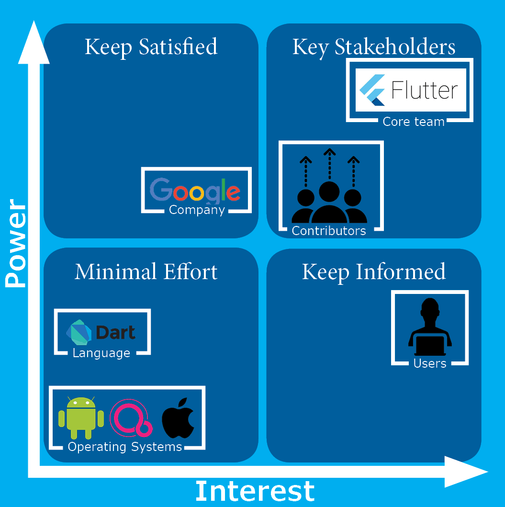
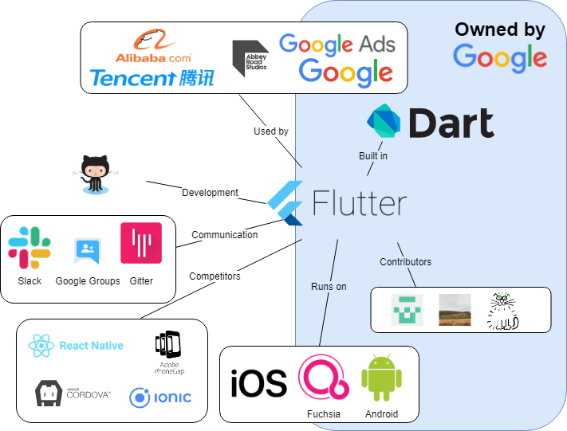
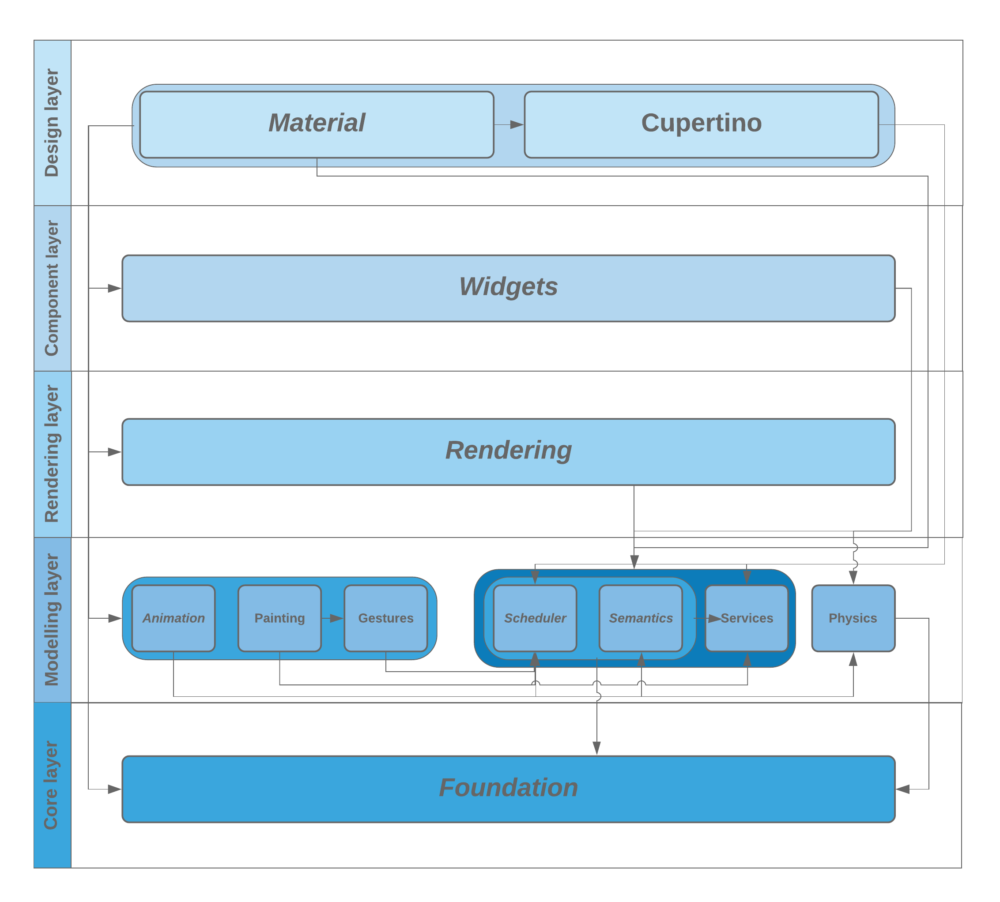

# Flutter

_Yanni Chiodi, Mathieu Post, Emiel Rietdijk, and Eva Verboom_

## Table of contents

1. [Introduction](#introduction)
1. [Stakeholders](#stakeholders)
1. [Power versus Interest](#power-versus-interest)
1. [Context View](#context-view)
1. [Development View](#development-view)
1. [Technical Debt](#technical-debt)
1. [Operational View](#operational-view)
1. [Conclusion](#conclusion)

## Introduction

Flutter is a Google initiative to help developers build native apps on iOS and Android from a single codebase fast and simple. Recently they also released Fuchsia and added it as a compatible operating system. While the project initially set out to develop a UI framework, they switched to constructing an application SDK as users desired a complete implementation. The SDK contains mainly widgets that can be used to build the application UI. A widget is a rigid description of the user interface. All graphics including animations, shapes and text are created with the use of widgets and more complex ones can be created by combining simpler widgets.

The basis of the open source community that is working on Flutter consists of a team of engineers working for Google, though there are some non-Google contributors that also have added a fair share of codelines to the project. Flutter is a very active and fast growing project, maintained and guided by the core team. In December 2018, the first stable version of Flutter, v1.0, was officially released. Afterwards, the team grew tremendously and they keep growing to be able to maintain and update the toolkit.

This chapter aims to describe the architecture of Flutter based on different views, characterize the stakeholders and provide details of the evolution Flutter went through. In doing so, this chapter will not only cover the technical aspects of the architecture, but also provide a broader view of the project. Then we have a section on technical debt, which shows where improvement is still required and discusses how this is handled by the developers of Flutter. The final section will discuss the aspects of Flutter regarding operations and implementation. Apart from doing research based on the GitHub repository [[4]](#references), Flutter documentation [[2]](#references), the wiki [[12]](#references) and other online sources, we also contacted the Tech Lead of Flutter, Ian Hickson (@hixie on GitHub), to answer some of our questions.

We have also [contributed](https://github.com/flutter/flutter/pull/30503) to the project by fixing an open issue. At the time of writing this is not yet merged or closed.

## Stakeholders

The stakeholders of a project can be defined as the people, organizations, groups and/or companies that have interest in the realization of the project. Stakeholders can affect (or be affected by) the actions, objectives and policies concerning the project.

### Rozanski and Woods classification

Rozanski and Woods describe eleven stakeholder classes in their book "Software Systems Architecture: Working With Stakeholders Using Viewpoints and Perspectives" [[1]](#references). In this section the types of stakeholders that apply to Flutter are discussed.

#### Acquirers

The acquirer of Flutter is **Google Inc.** They employ the core team working on Flutter which built the base of the framework and maintains it.

#### Assessors

There are no obvious assessors of this project. Flutter is only licensed under the BSD License [[5]](#references). Therefore, Flutter can be changed and shared among others as long as the contributors are given appropriate credit and all changes are indicated properly. Though Flutter works with a lot of software components that have their own licenses [[6]](#references). As every pull request is checked by at least two members of the core team, they are also responsible for checking the conformance of the code to standards and legal regulation. 

#### Communicators

The system is explained to stakeholders through the corresponding website [[7]](#references) by members of the core team. On the website you can find [videos](https://flutter.io/docs/resources/videos), showcases, tutorials and basic documentation explaining the development and the possibilities of contributing to the application. Furthermore, contributors and committers are communicators by default, as documentation and justification is a requirement for every contribution. Contributors communicate with each other over numerous channels, like [Gitter](https://gitter.im/flutter/contributors), [Slack](https://flutterstudygroup.slack.com/) or [Google Groups](https://groups.google.com/forum/#!forum/flutter-dev)). Google also organizes [events](https://www.meetup.com/find/?allMeetups=false&keywords=flutter&radius=Infinity) where developers working on the Flutter project can meet. 

#### Developers/Maintainers

There are a total of 34 contributors to the Flutter project, which are listed in the [AUTHORS](https://github.com/flutter/flutter/blob/master/AUTHORS) file on GitHub. Here Google Inc. is listed as one of the contributors. This is the core team that is working for Google and is involved in the Flutter project. They also do the maintenance, together with the other trusted contributors. Some of the most frequent contributors are non-Google engineers.

#### Suppliers

Flutter is written in Dart [[3]](#references) for iOS, Android and Fuchsia operating systems and can be used by anyone to build their own mobile applications for free. GitHub hosts the repository containing the code of the project.

#### Support Staff

Most support is handled by Google itself, though contributors also help each other out. Apart from the clear examples, documentation and tutorials on the website, Google also encourages people to join the discussion on one of their communication channels and everyone is free to ask questions on [Stack Overflow](https://stackoverflow.com/tags/flutter) or send them an email at flutter-dev@googlegroups.com if there are any additional question. 

#### Testers

Flutter uses both native Dart tests and special Flutter tests which are updated with every bug fix and run on every commit. Afterwards, a test coverage report of the project is created and can be reviewed at [coveralls](https://coveralls.io/github/flutter/flutter?branch=master). These tests are mostly written together with new or changed code by the developer that is contributing the change.

#### Users

The users of Flutter are the commercial and private developers that use the system to create their own mobile applications. They are also invited to contribute to the project in order to realize their needs within the project.

### Other Stakeholders

Besides the classes of stakeholders defined by Rozanski and Woods, there are four other classes that can be identified within the Flutter project.

#### Media

There are several websites that posted about the Flutter project like One More Thing [[8]](#references), The Verge [[9]](#references) and Maxdoro [[10]](#references). The website It's All Widgets [[11]](#references) even allows developers to submit their Flutter build applications to showcase them to others as examples and inspiration. 

#### Competitors

Currently there are many different systems that can be used to develop mobile application, such as [Apache Cordova](https://cordova.apache.org/), [Adobe PhoneGap](https://phonegap.com/), [Iconic](https://ionicframework.com/) and Facebook's [React Native](https://facebook.github.io/react-native/).

#### End Users

The end users of Flutter are the customers that will eventually download and use the apps of the companies that use Flutter to build their own mobile applications.

#### Partners

Some of the companies that are using Flutter, reach out to the core team for a partnership. For example when they believe that they need additional features and they are willing to invest in that, they can build that together with the core team and other members of the community. When there is a close relation between Flutter and the customer, they try to give a higher priority to issues related to such a partnership.

## Power versus Interest

A graphical representation of the involvement of all stakeholders is shown in the figure below. The core team has the most power and interest in Flutter. Though, according to Ian (Tech Lead) the other contributors are as much a part of Flutter, thus they are close to each other in the grid. Google does have a lot of power, but as Flutter is not one of their main products, their interest is lower and they are not directly one of the key stakeholder. Furthermore, there are some developers that use Flutter for application development, but do not contribute. They have high interest and should be kept informed. Their power lies in giving feedback on usability and proposing new features. Lastly, Dart and the operating systems the SDK is built for are minimal effort stakeholders.

### Integrators

The integrators are responsible for project quality and longevity. They communicate requirements to contributors, perform code reviews, lead discussions for new features and trade-offs and solicit new contributors. Ultimately, it is the integrator's role to decide whether contributions are accepted or rejected.

The integrators for the Flutter project are the core team members, mostly developers that work at Google. Their decision to merge is based primarily on the quality of the code, but they also tend to focus on whether the contributor follows the Flutter style. A very common challenge for them is that the quality of the contributor's code/style/documentation is not up to par with the Flutter standards. As a consequence, the integrators have to spend a lot of effort reviewing and giving feedback. Even 'trivial' things like spelling mistakes in documentation have to be corrected.

### Decision Making

To gain more insight on the way decisions are made within Flutter, the most discussed merge requests of the project were analyzed. When handling new contributions to the platform, there are a few key things that are discussed before accepting/rejecting issues:

- The conformation of the code and documentation formatting with the [Style guide](https://github.com/flutter/flutter/wiki/Style-guide-for-Flutter-repo)
- Questions raised by the developer of the issue and by reviewers on the implementation
- Trade-offs and/or compromises about how to implement the fix
- Readability and as few code and as few dependencies as possible are recurring issues in discussions.

## Context View

This section describes the context view of the Flutter project. The context view includes the relationships, dependencies and interactions of Flutter with the environment.

### System Scope

The description of Flutter on their repository on GitHub is as follows: *"Flutter is Google’s mobile app SDK for crafting high-quality native interfaces on iOS and Android in record time. Flutter works with existing code, is used by developers and organizations around the world, and is free and open source."*

Flutters main objective is to help other developers to build high quality mobile applications easily, using their widget based SDK. The SDK, which is written in Dart, can be used to build applications that run on iOS, Android and Fuchsia. The core team is responsible for maintenance and quality control of the source code and support for the developers that work with Flutter.

### Context Model

The figure shows a simple block-box context model implementation of the Flutter project. Here all stakeholders in the right half of the figure are part of Google Inc. Here we can see that Flutter is developed on GitHub, built in Dart and runs on three different operating systems. The three contributors that are listed are part of the core team employed by Google and have the most contributions, though there are many other contributors. All of these developers communicate via Gitter, Slack and Google Groups. The upper box shows some of the companies that use Flutter to build their own applications. Of course, there are many others working with Flutter and this set of stakeholders is just an example. Finally, in the bottom left corner the main competitors of the application are shown.

### External Entities

Flutter is an SDK and is therefore dependent on other entities and services. These entities and services are described in the following list:

- Flutter is written in Dart.
- GitHub is used as the version control system and issue tracker.
- Flutter runs on iOS, Fuchsia and Android.
- Flutter depends on and is developed for application developers.
- Applications written in Flutter depend on the project itself.
- The developers communicate through different channels.

## Development View

### Module Structure Organization

In large code bases it is very important to organize source code well, to make maintenance and testing easier as well as making the architecture comprehensible for all developers working on the project. Flutter has a layered module structure, where every layer only builds on the layers underneath and on modules in its own layer. A graphical model of the module structure is depicted below. All source code of the Flutter project is divided over thirteen modules, which belong in one of the following five layers:

- The core layer, which consists of the `foundation` module, which is the base of the Flutter framework.
- The modeling layer, containing all modules that are responsible for movement and painting of elements within an application.
- The `rendering` module holds the rendering layer, which is an abstraction of the modeling layer and keeps track of which widgets belong where on the screen.
- The component layer consists of the `widgets` module, widgets are ready-to-use UI components that developers can use when building their own application.
- The design layer contains pre-defined widgets implementing the Material Design and the iOS style for the `material` and `cupertino` modules respectively.

In the graph all dependencies between the modules are drawn. The dependencies are drawn in such a way that it is easy to see which layer depends on which other layers. All the layers only depend on layers underneath (i.e., they build on each other).

### Common Design Models

Common design models are needed to reduce duplicate effort and to increase technical coherence. In this section Flutter's standardization approaches are discussed.

#### Common Processing

- **Widgets**: Flutter's slogan is: "Everything is a widget". The UI is built using widgets, composed of even smaller widgets, which in turn are built using even more basic widgets. A widget can be a structural element (e.g. menu), as well as a stylistic element (e.g. padding). Widgets form a hierarchy (widget tree data structure), which is based on composition. The root node is the application itself and the leaves are the smallest widget components.

- **Rendering**: the widget building recursion tree bottoms out in `RenderObjectWidgets`, which are widgets that create nodes in the underlying render tree. The render tree is a data structure that stores the geometry of the user interface, which is computed during layout.

- **State Management**: Flutter is declarative. This means that Flutter builds its user interface to reflect the current state of your app. When the state of your app changes (e.g., a button is clicked), then the UI rebuilds from scratch.
  

- **Debugging**: Flutter provides the `flutter analyze` tool for static analysis. Furthermore, they provide a versatile [debugger](https://flutter.dev/docs/testing/debugging) to print logs, which can be used for debugging the various application layers (widgets, rendering, scheduling, etc.).

- **Plugins**: developers can use external [Dart plugins](https://pub.dartlang.org/) such that they do not have to build everything from scratch. The developer simply has to add the dependency to the `pubspec.yaml` file, run `flutter packages get` and finally add a corresponding import statement in their Dart code.

- **Internationalization**: if an app is deployed to users who speak another language, values like text and layouts need to be 'localized'. This can be done using the [flutter_localizations](https://flutter.dev/docs/development/accessibility-and-localization/internationalization) package.

#### Standardization of Design

The Flutter developers try to adhere to the Flutter style of coding. Some of the most important design patterns and [programming paradigms](https://flutter.dev/docs/resources/faq#what-programming-paradigm-does-flutters-framework-use) are:

- **Composition**: the most important design pattern is composition, the use of small objects (see *Widgets* in the previous section) with simple functionality to compose larger complex objects.
- **Declarative programming**: the developer specifies *What* should happen (and not *How* it should happen). For example: with HTML you use `` to tell a browser to display an image and not how to load the image file or how to render the pixels.
- **Functional programming**: a prime example  of functional programming is the [`StatelessWidget `](https://api.flutter.dev/flutter/widgets/StatelessWidget-class.html). These widgets do not require state and are basically just functions that map arguments to layout elements. (e.g., the `Icon` widget maps `color`, `icon`, and `size` to UI elements).
- **Generic programming**: generic typing can help developers to know how certain classes and interfaces should be implemented. Therefore, errors can be spotted early on.

#### Standardization of Testing

Contributors are urged to write tests accompanying their newly implemented feature. If no tests are provided by the original developer, the feature will likely regress. If they want their code to remain in the codebase, then they should include tests according to the [Tests Guide](https://github.com/flutter/flutter/wiki/Running-and-writing-tests). Additionally, Flutter uses Continuous Integration tools [Cirrus](https://cirrus-ci.com/github/flutter/flutter/master) and [Chromium](https://ci.chromium.org/p/flutter/) to automatically build and test changes submitted through pull requests.

Dart tests are written using the `flutter_test` package's API and should be included in the `test` subdirectory of the package under test. Different types of tests are supported:

- **Unit tests**: can be run using `flutter test`.
- **Golden file tests**: comparing pixels with a provided image, a so called 'golden file'.
- **System tests**: using the [flutter_driver](https://master-docs-flutter-io.firebaseapp.com/flutter/flutter_driver/flutter_driver-library.html) library and [devicelab](https://github.com/flutter/flutter/blob/master/dev/devicelab/README.md) for testing on real Android and iOS devices.

### Codeline models

Before contributing to Flutter, developers are invited to start by reading the general [Contributing Guidelines](https://github.com/flutter/flutter/blob/master/CONTRIBUTING.md). The [Tree Hygiene](https://github.com/flutter/flutter/blob/master/CONTRIBUTING.md) document explains how to land PR's and how to request/perform code reviews. The [Issue Hygiene](https://github.com/flutter/flutter/wiki/Issue-hygiene) covers how issue tracking with GitHub is done: it explains the issue labels, how prioritization/issue voting is done and how issues are assigned. Next, the very extensive [Style Guide](https://github.com/flutter/flutter/wiki/Style-guide-for-Flutter-repo) describes the guidelines concerning the actual code writing: patterns, documentation, variable naming, formatting and packages are discussed here. When making a pull requests automated build checks and test checks by Cirrus CI and the Flutter Build Bot are performed to make sure everything still works correctly.

### Codeline organization

The structure of the system's source code is divided in multiple parts:

- `bin`
  The bin contains the internal engine of Flutter.
- `dev`
  This directory contains tools and resources that the Flutter team uses during development of the framework.
- `examples`
  This directory contains several examples of using Flutter.
- `packages`

  This directory contains most of the core functionality of Flutter, which is divided in `flutter`, `drivers`, `tests`, `tools`, `localization`, `goldens` and `goldens client`.

Within the `flutter` package all main functionalities are located and categorized by the following categories: `animation`, `cupertino`, `foundation`, `gestures`, `material`, `painting`, `physics`, `rendering`, `scheduler`, `semantics`, `services`, and `widgets`. The build process of Flutter is all automated through Codemagic. Codemagic verifies all builds made and creates different workflows for different application configurations for development, testing and releases. As mentioned in Standardization of Testing, Flutter uses multiple tools for continuous integration.

### Instrumentation

Instrumentation refers to the ability to monitor or measure the level of a product's performance, to diagnose errors and to write trace information.

Flutter has several tools to help developers. One of them is the [Flutter Inspector](https://flutter.github.io/devtools/inspector). This tool makes it easy to inspect the widget trees of an application and can be used to visualize the layout structure and diagnose layout issues. Widgets can be clicked in a running app on a device and then in the inspector, the clicked widget is selected and its field values and nearby widgets can be inspected. Also, debug paint can be added to the running application to visualize the layout constrains of all widgets.

The SDK also has the ability to test widgets. Tests can be written using a `WidgetTester`, which creates a test environment where it can build and interact with widgets and can verify that they show the correct information.

To diagnose errors, third-party crash reporting solutions can be used (e.g., Sentry or Crashlytics). These solutions provide error tracking for released apps. Since normally it is hard to track bugs that happen in apps on the devices of users, these solutions report these errors with a stack trace in a convenient dashboard where developers can see what went wrong and which devices are affected. In addition, Flutter uses the standard log system of dart by extending it into several different log components, which can all be turned on and off when needed.

## Technical debt

### Identification

Since Flutter is written in the Dart programming language we can use tools written for Dart to analyze the Flutter framework. There is a static analysis tool for code style, comments and tests embedded in the Dart SDK: the [Dart Analyzer](https://pub.dartlang.org/packages/analyzer). The Flutter analyzer tool from the Flutter SDK embeds all this functionality from the Dart SDK and users of the tool should use `flutter analyze` rather than the Dart analyzer tool for their projects using Flutter. We have put focus mainly on the `flutter` package, since that is the package that will be used by other applications using Flutter.

The core team has an attitude of not working around problems but actually go and fix them. In general technical debt should always be fixed before merging new code. There are some exceptions when some (temporary) technical debt is acquired, e.g., because of a problem with an upstream dependency, disproportionate effort or because someone is already working on the solution. Technical debt in Flutter is expressed in US dollars, which is based on an average software engineer salary and the expected time it will take to solve these issues. According to Ian Hickson, at the time of writing, the 'framework has $933,000 of debt today, which isn't actually all that bad in the great scheme of things, but definitely isn't great'.

### Code Style and Structure

As mentioned before, to check a project against errors and warnings that are specified in the [Dart Language Specification](https://www.dartlang.org/docs/spec/) `flutter analyze` can be run. For running it on the whole Flutter project, the flag `--flutter-repo` has to be added to test all the packages in the repository. This did not return any errors or warnings. This is no surprise, since one of the requirements for landing a pull request is that the analyzer does not return any errors or warnings.

By quick inspection of the `flutter` package it seems that the code is structured well and that the [SOLID principles](https://blog.jetbrains.com/upsource/2015/08/31/what-to-look-for-in-a-code-review-solid-principles-2/) are followed consistently. Although in a lot of widgets the `performLayout` or the `build` method are quite long (sometimes more than hundred lines). This is in some cases probably a violation of the Single Responsibility Principle. The `performLayout` method could be split into new functions which describe their single purpose.

We already mentioned that one of the primary programming paradigms used heavily in Flutter is composition. Most widgets are built this way, they are built using small objects with a small responsibility. Using them together results in more complicated widgets, e.g., the `FlatButton` widget creates a `RawMaterialButton` which consists of the given child in a `Center` in a `Container` in an `IconTheme` in a `Material` in a `ConstrainedBox` in an `_InputPadding` in a `Semantics`. All these widgets have a narrow scope of behavior, which favors the Single Responsibility Principle for these single classes. But, because of this, the indentation-based complexity becomes pretty high in some cases, especially in the sometimes very long `performLayout` and `build` methods in some widgets.

### Testing Debt

To run all the tests and get the coverage information in a package `flutter test --coverage` can be used. Running this on the Flutter repository returns `All tests passed!` as expected. The coverage is more interesting to look at. The total line coverage of the `flutter` package is 84% at the time of writing. The core of Flutter is well-tested, subpackages like `animations`, `gestures` and `physics` have a high coverage. One problem with the current tests is that the 'golden image' tests only work on Linux. So, when someone working on the Flutter SDK runs the tests on macOS or Windows, these tests are skipped. This is also the cause of the majority of the acquired technical debt.

If we look at which lines do not have coverage, most of them are assertions in constructors, which are only executed in debug mode and thus have no influence on the final product. Also, the `material` and `cupertino` subpackages have some icon definitions which are not tested, but it would not make sense to test these since that would practically be the same as testing image files or other binary files. After inspecting some less tested Dart files, it seems that almost everything is actually pretty well tested. Most of the untested lines are some `case`s in `switch` statements and `if` or `else` branches. For improving the test coverage on these sections, more edge cases should be considered when writing tests. The edge case that seems to be untested most of the time is a device in landscape mode or if a dark theme is used instead of a light theme. Unfortunately, there are no tools for Flutter to get branch coverage.

Next to untested lines, whole functions that are untested seem to mostly be `toString`, `hashCode` and `copyWith` functions in `Widget`s and `Theme`s. These should not be functions that may break someones code. `toString` functions rely on string interpolation (e.g., `'Hi $name'`), which is a built-in functionality of Dart, so it can be argued that these functions are so trivial that these don't need tests. This argument can also be applied to `hashCode` and `copyWith`. `hashCode` uses the `hashValues` function from an external package called `sky_engine` which is part of the Flutter engine. So, assuming that the `sky_engine` package is tested well, the `hashCode` function does not need tests. `copyWith` accepts the same parameters as the constructor of the class it belongs to, and then calls the constructor with these parameters, which default to the values of the current instance of the class `copyWith` is called on.

Overall, it seems that the `flutter` package is tested pretty well. The test coverage is high on most classes, and where it is not that high, it is in most cases because of trivial functions. The project could improve a bit on test coverage by creating tests for edge cases and some locally untested functions. Mostly the technical debt can be decreased by fixing the golden tests for macOS and Windows.

### Evolution

To see how the Flutter project has evolved over time in terms of technical debt, we will look at previous versions of Flutter. At the time of writing the latest version of Flutter on Github is v1.4.1. Since the Flutter project is relatively young, with a first release on Github not even two years ago, we have investigated and compared the current state of technical debt with the moment of Flutters first stable release (v1.0.0, Nov 2018) and the first beta release (v0.1.0, Feb 2018).

In terms of architecture, nothing much has changed since the first beta. The codebase has grown almost by 50% in terms of codelines since the first beta, but all this added code did not result in design or architectural changes. The total testing coverage has decreased a bit over time. The coverage went from 86.8% to 84.9% to 83.9% for v0.1.0, v1.0.0 and v1.4.1 respectively. However, this seems to be mostly because of added icon and constant definitions and not because of relatively less tested code.

## Operational View

This section will describe how the system will be operated, administered and supported while it is running in its production environment. Flutter had been operational for about a year at the time of writing.

### Support

Flutters support model is fully based on its open source community. This is only possible because their end users are developers and therefore also often contributors to the project. Developers are able to support each other through the different communication channels Flutter offers, giving advice to each other and having discussions on possible improvements or new features they are working on. The members of the Flutter core team participate within the community in the same way. If the platform fails completely or a severe issue occurs, the core team can be notified by creating an issue on GitHub and a high priority will be assigned to it. All members of the community are allowed to work on all issues, though the core team is responsible for the operational status of the project. As Flutter is an SDK, there is no hardware that needs any support. Therefore, only online communication suffices for customer support.

### Operational Monitoring and Control

Operational monitoring and control is for Flutter something not to worry about, since Flutter is an SDK and there is no such thing as system down time and therefore there is no instrumentation to be found for this part. Flutter is reliable on the uptime of some third parties such as GitHub and Pub Dart, where the codebase and the Dart packages are stored respectively. However, every developer that is using Flutter can keep track of the performance of their own application with the Flutter performance profiling functionality. Within this profiling four different parts of the application, so called 'threads', can be monitored: Platform, UI, GPU and I/O. Furthermore, for monitoring any downtime the logs can be used, which have been explained in the Instrumentation section.

### Other Aspects of Operation

Due to the Open Source character of the Flutter project, it is fully developed on GitHub from the start. Changing from the development-only phase to the operation and development state therefore has no implications on the way Flutter is being maintained and no data transfer is needed to other environments. Everything remains fully accessible for both the developers as for the users of the SDK and nothing has to change in the way contributors develop and maintain the source code.

Another property of the Flutter project is that it is only software that is used to build other applications and it is therefore not directly coupled to any hardware installation. As a consequence, there is no need for physical installation or upgrades, configuration management (other than within the software components) or functional migration. This eases the operational phase and causes the development phase and operational phase to be highly similar.

## Conclusion

This chapter analyzed Flutter, a cross platform mobile app SDK. The first section shed light on the stakeholders involved in the project. The most important ones are: the acquirer (Google), the developers (Google engineers and other members of the open source community) and the users (e.g., companies like Alibaba and other app developers). Next, from the context model, it can be seen that the most important dependencies are Dart, Fuchsia, iOS, and Android. Furthermore, some important competitors were found: React Native, Ionic, and Apache Cordova.

The next section showed an overview of the code module structure and the dependencies between these modules. The modules are structured neatly according to their respective functionalities. Next, the common design models were analyzed. It was found that there is common processing for rendering, debugging, plugins and internationalization. Furthermore, the Flutter team uses several design patterns across the code like composition by the extensive use of widgets.
Flutter has an estimated technical debt of 933K USD, as indicated in an interview by [Ian Hickson](https://github.com/Hixie), one of the core team members. This was calculated by multiplying an engineer's salary with the estimated work hours left. The bulk of the debt comes from the fact that the golden file tests only run on Linux. Nonetheless, it can be concluded that the testing coverage is quite high (85% line coverage) and that the architecture and code structure are clear and strong.

In conclusion: the Flutter team, although the project is young, has very mature workflows. The code quality is impeccable, in part due to strictly enforced coding guidelines and because of the dedication of experienced engineers. Flutter is on top of its game, has clear vision and goals and will keep on competing with industry giants like Facebook's React Native.

## References

1. Rozanski, N., & Woods, E. (2012). Software Systems Architecture (2nd ed.). Pearson Education.
2. Flutter documentation - [https://flutter.dev/docs](https://flutter.dev/docs)
3. Dart programming language - [https://www.dartlang.org/](https://www.dartlang.org/)
4. Flutter repository - [https://github.com/flutter/flutter/](https://github.com/flutter/flutter/)
5. BSD. The 3-Clause BSD License - [https://opensource.org/licenses/BSD-3-Clause](https://opensource.org/licenses/BSD-3-Clause) 
6. Flutter "Other Licenses" - [https://raw.githubusercontent.com/flutter/engine/master/sky/packages/sky_engine/LICENSE](https://raw.githubusercontent.com/flutter/engine/master/sky/packages/sky_engine/LICENSE)
7. Flutter website - [https://flutter.io/](https://flutter.io/)
8. One More Thing (2018-12-08). Google Flutter maakt app ontwikkeling eenvoudiger - [https://www.onemorething.nl/2018/12/google-flutter-maakt-app-ontwikkeling-eenvoudiger/](https://www.onemorething.nl/2018/12/google-flutter-maakt-app-ontwikkeling-eenvoudiger/)
9. Dieter Bohn (2019-12-04). Can Google make cross-platform mobile app development suck less? - [https://www.theverge.com/2018/12/4/18125053/google-flutter-1-0-skia-mobile-app-cross-platform-developers](https://www.theverge.com/2018/12/4/18125053/google-flutter-1-0-skia-mobile-app-cross-platform-developers)
10. Maxdoro - [https://www.maxdoro.nl/flutter/](https://www.maxdoro.nl/flutter/)
11. It's all Widgets! - [https://itsallwidgets.com/](https://itsallwidgets.com/)
12. Flutter Wiki - [https://github.com/flutter/flutter/wiki](https://github.com/flutter/flutter/wiki)
