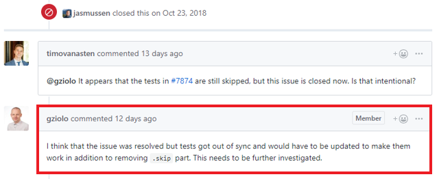
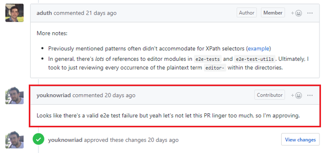

# Gutenberg

By [Timo van Asten](https://github.com/timovanasten/), [Sven van Hal](https://github.com/svenvanhal/), [Niek van der Laan](https://github.com/niekvanderlaan) en [Daphne van Tetering](https://github.com/dvantetering).

## Table of Contents

-   [Introduction](#introduction)
-   [Stakeholders](#stakeholders)
-   [Context View](#context-view)
-   [Development View](#development-view)
-   [Technical Debt](#technical-debt)
-   [Accessibility Perspective](#accessibility-perspective)
-   [Conclusion](#conclusion)

## Introduction

WordPress is a Content Management System that services approximately one third of the web \[1\]. Mid 2016, the decision was made to start developing a new page editor experience: Gutenberg. The then-used editor – a single rich-text field – had not been updated in a decade and WordPress’ competitors were rapidly catching up. Gutenberg is a visual page builder instead: all content elements are blocks and these can be arranged in any desired order. Gutenberg is shipped with WordPress since December 2018.

In this chapter, we review multiple aspects of the software architecture of Gutenberg. We first look at the bigger picture by analyzing their stakeholders and project context. Then, we dive into the inner code structure and look at the module structure, common software design, testing methods and how the codeline is organized. We continue to analyze and critique the technical and testing debt of the project, and conclude with an analysis of the often-overlooked accessibility implications of the new editor.

This chapter is part of the Delft Students on Software Architecture Book 2019.

## Stakeholders

### Identifying stakeholders

We identified stakeholders according to the Rozanski & Woods \[2\] classification, as well as additional types of stakeholders that followed from our research.

#### Acquirers

Gutenberg is part of WordPress, which was originally founded by Matt Mullenweg. He later transferred its intellectual property to the WordPress Foundation. Mullenweg also founded Automattic, a company whose goal is to commercialize WordPress by providing a blogging platform and building custom extensions for WordPress. Mullenweg is still ultimately responsible for new WordPress releases, as well as the allocation of funds from the WordPress Foundation.

#### Developers and Maintainers

Since Gutenberg is an open source project, everyone is encouraged to participate in its development. At the time of writing, Gutenberg has nearly 400 contributors to the master branch. Interestingly the top seven contributors are all affiliated with Automattic.

The Gutenberg project has multiple code owners. Each of them has responsibility over certain types of files in the project, as indicated in the `CODEOWNERS` file. Three developers stand out by being code owner of (almost) the whole project:

-   **@youknowriad** (Riad Benguella) is an employee of Automattic and works on WordPress. As of this writing he also is the top contributor of the project.

-   **@aduth** (Andrew Duthie) is code owner of the whole project with exception of the documentation, Blocks and Widgets. He is the second largest contributor and works as JavaScript Engineer at Automattic.

-   The last major code owner is **@gziolo** (Grzegorz Ziółkowski). Similar to the previous code owners he is an employee of Automattic and a major contributor to the project.

There are 13 other code owners that are responsible for parts of the project (e.g. only the documentation). These are **@chrisvanpatten**, **@nerrad**, **@Soean**, **@noisysocks**, **@talldan**, **@coderkevin**, **@jaymanpandya**, **@notnownikki**, **@nosolosw**, **@mkaz**, **@jorgefilipecosta**, **@ajitbohra** and **@mmtr**. We will elaborate on the role of some of them in other sections.

#### Assessors

Everyone working on the Gutenberg project is able to review pull requests on Github, which in essence makes everyone who does so an assessor. To ensure a consistency in code quality and style, several tools are in place of which some will be discussed in the Development View and Technical Debt sections.

The code owners have a special role as assessors, since they make the final decision to merge a PR or not.

#### Communicators

The developers of Gutenberg hold weekly meetings on the *\#core-editor* Slack channel. These meetings are chaired by **@youknowriad** and are accessible to everyone.

The [Gutenberg Handbook](https://wordpress.org/gutenberg/handbook/) is the main documentation for other stakeholders in this project. It is open for everyone to contribute to via Github. The quality of this documentation is assured by **@youknowriad**, **@gziolo** **@chrisvanpatten**, **@nosolosw**, **@notnownikki** and **@mkaz**, making them the key communicators of Gutenberg.

Other major contributors to the documentation are **@aduth**, **@dd32**, **@wpscholar**, **@adamsilverstein** and **@johnwatkins0**.

#### Production engineers

The Gutenberg project contains tools like package managers, linters and tools for testing which need to be configured. **@youknowriad, @gziolo, @aduth, @ntwb, @nerrad, @ajitbohra, @nosolosw** and **@mkaz** are responsible for this part of the project.

#### Suppliers

The following parties are suppliers for the Gutenberg project:

-   Git facilitates version control.
-   GitHub hosts the project and facilitates communication between the developers.
-   Facebook supplies the main framework on which Gutenberg is built: React.
-   Travis facilitates continuous integration.
-   WordPress supplies the software on which Gutenberg runs.

#### Support staff

The best place to get help as a user is via the WordPress.org support forums\[3\], or via the Slack *\#help* channel.

#### Testers

Testing your code is part of the PR checklist. In every PR, developers have to explain how their code was tested, which can then be verified by the other developers. Travis is used to run all tests in the project, all tests have to pass before a PR can be merged. Top contributors to the testing folder of the project include **@gziolo**, **@ellatrix**, **@youknowriad**, **@aduth** and **@dmsnell**.

To help the developers with testing, the Gutenberg Handbook has a special section on testing, which is updated once new testing procedures are in place.

#### Users

Anyone who uses WordPress is a potential user of Gutenberg. These users vary from individuals to some of the world’s largest companies, listed [here](https://wordpress.com/notable-users/). Users may individually choose to use an alternative editor, like the classical editor, instead.

#### Other stakeholders

#### Competitors

Before the rise of Gutenberg, other page-builders were built to replace the old editor. Some of these page-builders, such as [Elementor](https://nl.wordpress.org/plugins/elementor/), [Beaver Builder](https://nl.wordpress.org/plugins/beaver-builder-lite-version/) and the [Page Builder](https://nl.wordpress.org/plugins/siteorigin-panels/) by Site Origin, have more than a million downloads, making them competitors of Gutenberg. Another competitor of Gutenberg is the old editor, since users can still decide to opt-out of Gutenberg and use it instead.

#### Power vs. interest grid

Using Mendelow’s power vs. interest grid, stakeholders can be divided into four categories. These categories are: satisfy, key stakeholders, minimal effort and inform and are shown in the figure below.

### Integrators

According to the [blog post by Georgios Gousios](http://www.gousios.gr/blog/How-do-project-owners-use-pull-requests-on-Github.html), integrators are responsible for ‘enforcing an online discussion etiquette and for ensuring the project’s longevity by on-boarding new contributors’. Within Gutenberg, most of the code owners also function as an integrator. Examples of this are @nosolosw and @youknowriad: when we posted a message in the *\#core-editor* Slack channel about contributing, they replied with useful documents, like the Gutenberg Handbook. Other examples are @jasmussen and @karmatosed who are responsible for starting discussions about design and @afercia who mostly opens discussions on accessibility.

### PR analysis

To get a clear view of the decision making strategy, we analyzed the 10 most discussed accepted and rejected PRs. From this it becomes clear that most decisions are made by having a thorough discussion on advantages and disadvantages of a certain approach. The final decision is made taking into account the scope of the pull request and the long term vision of Gutenberg. This decision is often made by one of the integrators responsible for the area that the pull request focuses on.

Within the rejected pull requests, the most occurring reason for rejection was due to the length of the discussion, during which the project itself was already developed further causing the functionality to be redundant or outdated, which required a new PR for the same functionality using a different implementation. Some pull requests were rejected because of a change in vision.

Besides analyzing PRs, we asked about the decision making process in the *\#core-editor* Slack channel. @youknowriad responded that Gutenberg follows the WordPress decision making process, which is discussed in this [WordPress blog](https://wordpress.org/about/philosophy/). Decisions at WordPress are made keeping the end-users in mind, who are mostly non-technically minded. WordPress states that it is the developer’s duty to make smart design decisions and to avoid placing the responsibility of technical choices on end users. For example, from a developer perspective, more options on how to configure your system would always be better, because this allows for a tailored user experience. From an end-user perspective, more options result in more decisions to make on topics that most end users don’t care about.

## Context View

This section describes the context of the `WordPress/Gutenberg` project. A context view “describes the relationships, dependencies, and interactions between the system and its environment.” \[2\]

The scope of Gutenberg is limited to the page editing experience within WordPress, enabling users to create complex posts and pages. Gutenberg is responsible for the interactive editing screen, converting content blocks to a suitable HTML representation and for communicating with WordPress to store posts and pages.

### Context model

WordPress is used by a wide variety of users and so is, by extension, Gutenberg.

Gutenberg is written in JavaScript and built with the React framework. Additional development tooling runs on NodeJS. A small part of the codebase, the interface with WordPress, is written in PHP.

Gutenberg is developed on GitHub, where a small group of people is responsible for most of the contributions to the project. Fourteen people are *code owner*, of which three people (@youknowriad, @aduth and @gziolo) have final decision power about all parts of the project. Bug reports are collected at GitHub, and lingering bug reports at the WordPress issue tracker are moved to GitHub. Security issues can be reported via the WordPress HackerOne channel.

Gutenberg comprises multiple independent packages for different parts of the editor, which are managed through Lerna and published to the npm repository. A number of other development dependencies are also retrieved using npm.

The quality of the project is constantly monitored and a substantial part of the codebase is covered with tests. JavaScript tests are run with Jest and PHP tests with PHPUnit. The code coverage level is watched at GitHub using Codecov. Furthermore, all code is linted with either ESLint (JavaScript) or PHP\_CodeSniffer (PHP) to enforce and/or fix a consistent coding style and license incompatibilities. This process is entirely automated with Travis CI.

The Gutenberg community can be divided into users and developers. Developers use Slack as their primary communication channel or ask questions at StackExchange, while users are encouraged to ask for support at the WordPress support forum. Documentation is available at a dedicated Gutenberg docs website.

Gutenberg features a faster release cycle than WordPress. Intermediate versions are published to the WordPress plug-in repository, and the most suited version is selected for a WordPress (CMS) release.

Gutenberg is licensed, as is WordPress, under the GPLv2+ license. All contributions by users also have to be under this license.

## Development View

The development viewpoint is used to describe the architecture that supports the process of software development. In this section, we look at Gutenberg’s architecture using the definition from Rozanski & Woods \[2\].

### Module Organization

The Gutenberg repository consists mainly of packages developed for the Gutenberg editor, and uses Lerna to manage these Gutenberg modules and publish them as packages to npm.

Although the packages folder has a flat structure, we identified the responsibility of each package with respect to the logic flow of the editor. The image below, found on the Gutenberg repository, illustrates this flow.

The editor has several responsibilities: parsing, visual representation, editing and serialization. Other packages are responsible for tooling, utilities, data management, the user interface and retrieving reusable blocks. We briefly highlight most important packages and their contributions.

#### Editor

The `blocks` module is responsible for converting blocks between JavaScript data objects and HTML, and is supported by the `block-serialization-spec-parser` and the `Block-serialization-default-parser` modules. The `block-editor` module is mainly responsible for the editing logic, whereas `editor` is responsible for editing non-block posts. This separation of concerns is newly introduced in [Phase 2](https://make.wordpress.org/core/2018/12/08/gutenberg-phase-2/), as described in [\#14122](https://github.com/WordPress/gutenberg/pull/14112).

#### User Interface

All blocks must be registered before they can be used in the editor. The `element` module is used to describe the structure of a block’s markup. Each block can be edited by calling their edit function defined in `blocks`.

#### Utils & Tooling

Most packages serve as utility for the implementation of blocks, to support the editor,or simply provide reusable functionalities that can be used by developers when creating new blocks. Several tooling packages concern several responsibilities including config, plugins and testing.

The figure below displays the relations between these packages.

### Codeline Model

The *codeline model* describes the organization of the system’s source code: how is the code controlled, maintained and which (automated) tools are used in the build and release process, and what folder structure is used.

#### Code Management

Gutenberg uses the Feature Branch Workflow \[4\]. Contributors need to fork the project, make changes on a separate branch and create a pull request to the upstream master branch. Code owners of the project review the code, optionally request changes and merge the branch when the work is satisfactory \[5\].

#### Source Code Structure

The directory structure of Gutenberg is shown in the table below Every directory has a single responsibility and different types of source code based are grouped based on their purpose. The project consists of multiple modules (in the `packages` folder), which also take up the majority of the project size.

Tests are present at multiple different locations in the source code: PHP tests in the `phpunit` folder, integration tests in the `test` directory and for each package separately (optionally) a number of unit tests, as well as end-to-end tests in the `packages/e2e-test` folder.

#### Release Process

A new build of Gutenberg is released every two weeks, after having matured as a release candidate first \[6\]. Continuous integration is in place to automatically test and lint any code that is to be merged into the master branch and by extension a release.

Gutenberg lives primarily in the [WordPress plug-in repository](https://nl.wordpress.org/plugins/gutenberg/), but is also bundled with WordPress. The most suitable Gutenberg release is cherry-picked for each WordPress release by the WordPress maintainers.

### Common Processing

The Gutenberg project contains many packages that handle common processing for the project. These can be divided in a few different categories:

-   **Configuration:** These packages include configurations that are common throughout the project *(@wordpress/browserslist-config)* or provide a default configuration *(@wordpress/babel-preset-default)*.
-   **DOM, HTML and browser related processing:** Packages for manipulating or retrieving information about HTML, the DOM and the browser *(@wordpress/element, @wordpress/html-entities)*.
-   **Other small common processing:** Packages for small tasks like parsing date strings *(@wordpress/date)*, manipulating URLs and working with keycodes.
-   **Other major common processing:** This includes tasks like making API-requests *(@wordpress/api-fetch)*, internationalization *(@wordpress/wp-i18n)* and accessibility *(@wordpress/a11y)*.

#### Instrumentation

For logging information about the system the native JavaScript methods `console.log`, `console.error` and `console.warn` are used. To prevent temporary log statements making it into production code there is an ESLint rule in place that does not allow these log statements, except if they are explicitly allowed by disabling this rule.

### Standardization of Design

Within Gutenberg, all content has the same internal structure called a `block`. Blocks are hierarchical units, meaning that each block can be a parent or child to another block. Within Gutenberg, it is possible to create custom blocks. To ensure the compatibility of these blocks with the parser and serializer, each block needs to have the same software design. Below, we briefly discuss the most important parts of this design, a complete overview of the internal block structure is shown in the figure below.

1.  `plugin.php`: this file contains the plugin information needed to retrieve a block and list it as an available plugin in the plugin library of Gutenberg.
2.  `init.php` this file is use to enqueue all JavaScript and CSS files. To achieve this, Gutenberg has two hooks: `enqueue_block_assets` on the frontend and `enqueue_block_editor_assets` on the backend.
3.  `src/blocks.js` contains the JavaScript defining the behavior and functionality of the newly created block.

The new block is connected with Gutenberg using the `registerBlockType`-function from the [Block API](https://wordpress.org/gutenberg/handbook/designers-developers/developers/block-api/), which is called in `src/block.js`. This function takes two arguments: the block name, which has to be unique and is used to identify a block, and a block configuration object. The block configuration object contains properties such as a display title and category, these properties have to be defined to allow registration of a block.

To aid developers, several tutorials and guidelines exist, which can be found in the Gutenberg handbook. Gutenberg documents its [block API](https://wordpress.org/gutenberg/handbook/designers-developers/developers/block-api/) and a list of [block grammar](https://github.com/WordPress/gutenberg/blob/master/docs/grammar.md) containing code snippets for creating blocks. [Coding guidelines](https://github.com/WordPress/gutenberg/blob/master/docs/contributors/coding-guidelines.md) are also provided to inform each developer about coding guidelines specific to Gutenberg.

### Standardization of Testing

Tests for each package are included in the `/src/test`-folder of each package and also in [`/test/`](https://github.com/WordPress/gutenberg/tree/master/test)-folder in the Gutenberg project. End-to-end tests are included separately in `e2e-tests` and `e2e-test-utils` folders. To ensure code is tested sufficiently and that building succeeds, a [testing overview](https://github.com/WordPress/gutenberg/blob/master/docs/contributors/testing-overview.md) is included in the Gutenberg repository. When testing, Gutenberg asks to take the following into account:

-   The behavior(s) being tested
-   The errors that will probably occur when running the new piece of code
-   The correctness of the test and the risk of false positives/negatives
-   The readability of the test

The following frameworks are used:

-   [Jest](https://phpunit.de/) for JavaScript testing and [ESLint](https://eslint.org/) to enforce JavaScript code style. Using `npm test` will execute the unit tests and code linting.
-   [Enzyme](https://github.com/airbnb/enzyme) for React testing, included when running `npm test`
-   [Snapshot](https://jestjs.io/docs/en/snapshot-testing.html) to test UI behavior, also included in `npm test`
-   [Google Puppeteer](https://developers.google.com/web/tools/puppeteer/) for end-to-end testing, run using `npm run test-e2e`
-   [PHPUnit](https://phpunit.de) for PHP testing, run using `npm run test-php`

## Technical Debt

Technical debt is a metaphor that reflects overdue or additional programming work caused by choosing an easy, short-term solution instead of a better solution that would take more time. This section analyzes the technical debt of Gutenberg.

### Presence of Technical Debt

We used [SonarQube](https://www.sonarqube.org/) to detect code smells and potential bugs. Only the `lib/` and `packages/` directories have been considered, to prevent analyzing test code and tooling.

When using SonarQube’s default quality profile, a technical debt of 10 *man-days* (80 hours) is reported, representing only 5% of the total project size. Manual inspection of the detected code smells reveals that the most frequently violated rules are violated because of common practice and design choices and do not present actual technical debt. An example of this is shown in the figure below.

Since the default quality profile is very strict and it penalizes very common practices, we decided to exclude the rules in the figure from the profile. This result in a technical debt of only **7** *man-days*.

Other clear examples of technical debt are empty `if`-statements (accompanied by a TODO-statement), functioning as a scaffold to be filled in later, dead code after a wrong refactoring or duplicate CSS rules. Efforts have been made to reduce the latter in [\#14520](https://github.com/WordPress/gutenberg/pull/14520) and [\#14546](https://github.com/WordPress/gutenberg/pull/14546).

#### Copy-paste code

While writing this document, the Gutenberg team transitioned to [Phase 2](https://make.wordpress.org/core/2018/12/08/gutenberg-phase-2/), which is centered around expanding Gutenberg from the editor the Customizer, the part of WordPress that allows users to create their own content. Resulting from this is a large refactor, moving components from the `editor` package to a package called `block-editor`, an example of this is seen in PR [\#14420](https://github.com/WordPress/gutenberg/pull/14420). A lot of duplicate code results from this, increasing the risk for the [Shotgun Surgery](https://refactoring.guru/smells/shotgun-surgery) code smell. Running JSInspect yields the following result: `21 matches found across 874 files`, mostly related to the earlier mentioned refactor. These problems will likely be resolved in the near future.

#### Comment inspection

One indicator of technical debt are TODO comments. At the time of writing, the Gutenberg project has a total of 47 TODOs in the code base. These TODOs can be categorized in the following categories:

<table><colgroup><col style="width: 23%" /><col style="width: 11%" /><col style="width: 64%" /></colgroup><thead><tr class="header"><th>Type</th><th>Occurrences</th><th>Example from the code base</th></tr></thead><tbody><tr class="odd"><td>Needed improvements</td><td>21</td><td>// TODO: Search input should be focused immediately. It shouldn’t be necessary to have ‘waitForFunction’.</td></tr><tr class="even"><td>Suggested improvements</td><td>8</td><td>// TODO: Future enhancement to add an upload indicator.</td></tr><tr class="odd"><td>Removal reminders</td><td>6</td><td>// TODO: The following is for back-compat with WP 4.9, not needed in WP 5.0. Remove it after the release.</td></tr><tr class="even"><td>Research reminders</td><td>5</td><td>// TODO: Figure out a way to generate docs for dynamic actions/selectors.</td></tr><tr class="odd"><td>Thoughts and questions</td><td>4</td><td>// TODO: Should we differentiate BACKSPACE and DELETE?</td></tr><tr class="even"><td>Refactor reminders</td><td>3</td><td>// TODO: Refactor click detection to use blur to stop propagation.</td></tr></tbody></table>

Many of these TODOs also give some indication on why the TODO was introduced, some of which are not valid anymore. An example of this is shown in the figure below.

When looking at this issue, we see that the issue itself was closed in October 2018, but the TODO is still present in the code base, which indicates that these TODOs can linger for quite a while. This is shown in the figure below.

### Testing debt

To identify testing debt, issues labeled [Needs Tests](https://github.com/WordPress/gutenberg/labels/Needs%20Tests) were reviewed. Even though this label is only used on 4/1630 open issues, they have been open for quite a while. The `--coverage` option in Jest was used to generate a coverage report for each folder, file and line. This shows that the code coverage of Gutenberg is about 50%. A snapshot of this webpage is shown in the figure below.

Issue [\#13812](https://github.com/WordPress/gutenberg/issues/13812) shows that the developers are aware of the need for tests. Since this issue was opened recently, it also shows that the developers are trying to improve coverage. However, PR [\#14420](https://github.com/WordPress/gutenberg/pull/14420) shows one of the reasons why the test coverage of Gutenberg is fairly low: two code owners, @aduth and @youknowriad decide to merge a PR with failing end-to-end test. This is visible in the figure below.

### Technical debt mitigation

To mitigate technical debt, Gutenberg employs a consistent workflow starting from the creation of an issue of GitHub. When this issue is picked by a developer he or she is guided by the extensive contributing guide including documentation on testing, workflow and package management \[5\].

During development, technical debt is kept at a minimum by running several linters before allowing a developer to commit. Examples of these linters are JavaScript, JSON and PHP linters.

After resolving an issue or when in need of help, a pull request (PR) is opened. Each PR has to include the checklist shown below:

-   ☒ My code is tested.
-   ☒ My code follows the [WordPress code style](https://github.com/WordPress/gutenberg/blob/master/docs/contributors/coding-guidelines.md).
-   ☒ My code follows the [accessibility standards](https://github.com/WordPress/gutenberg/blob/master/docs/designers-developers/developers/accessibility.md).
-   ☒ My code has proper [inline documentation](https://github.com/WordPress/gutenberg/blob/master/docs/contributors/document.md).
-   ☒ I’ve included developer documentation if appropriate.

In addition to automated tests, each pull request is reviewed manually by at least one of the code owners. Additionally, PRs can only be merged with approval of at least one code owner.

Finally, PRs can only be merged with approval of at least one code owner. A code owner always checks whether these requirements are met before merging the PR.

### Impact and evolution of Technical Debt

In general, the impact of the technical debt of Gutenberg is very limited, which is remarkable for a project that grows and evolves so quickly. When using SonarQube to analyze the five previous releases, it becomes clear that with newer releases the amount of technical debt only increase slightly, even though the project grows significantly. It is also visible that the number of code smells and the number of bugs that are introduced with every release is relatively minimal.

However, the rather large testing debt of Gutenberg is one of their major issues, which reduces maintainability and can cause undetected broken functionality with each code change. Furthermore, the various TODO comments in the code and empty if statements make for a dirty code base, possibly discouraging contributors to provide clean code themselves. Additionally, the large amount of duplicate code resulting from the `editor` refactor and the duplicate CSS rules hinder the maintainability of the project, as required changes are cascaded to many parts of the system. The amount of todo’s and abandoned tests as a result of rushed pull requests are ramping up, putting Gutenberg at risk of this debt getting out of control.

## Accessibility Perspective

Software accessibility refers to the ability of users – regardless of any disability or impairment – to (fully) use the software. In order to create and maintain a WordPress website, people suffering from disabilities – ranging from e.g. motor impairments to (color) blindness – are dependent on an accessible editor. Because they may be unable to operate certain hardware like a mouse or use assistive technologies like screen readers, software has to adapt to this.

Although accessibility is required by just a small percentage of users, the impact of inaccessibity is significant. Shipping an inaccessible editor might cost someone’s job, if that job depends on using WordPress with Gutenberg. Accessibility is also a legal requirement when software receives government funding \[7\].

The Web Content Accessibility Guidelines (WCAG) is the most important collection of (web) accessibility standards. WCAG has a number of levels, of which “Level AA”, and is commonly enforced by governments \[8\]. WordPress has also committed to using WCAG Level 2.0, stating that:

> All new or updated code released in WordPress must conform with the WCAG 2.0 guidelines at level AA. \[10\]

In the remainder of this chapter, we show that these guidelines are violated by Gutenberg regardless. We discuss why this happened, how this could have been prevented and what can be done in order to improve software accessibility.

### Interview with Rian Rietveld

Rian Rietveld is the former WordPress Accessibility team lead. She resigned due to codebase and political issues with Gutenberg. We contacted her for an interview to understand how this happened.

She cited three main issues that caused Gutenberg’s poor accessability:

-   The accessibility team had communication issues due to a **knowledge gap**. On the one hand you had the developers who did not know enough about accessibility to make the software accessible, and on the other hand the accessiblity team were not knowledgable enough in React to implement improvements themselves. Rian thinks this problem is partially caused by universities not putting enough focus on accessibiliy in their education programs.
-   **Accessiblity was an afterthought** in the project:

    > “We were kept at a distance by the developers until a big part of the project was already done. What was then presented turned out to have big accessibility issues. Making a project like this fully accessable in a late stage of development is almost undoable”

-   **The leadership of WordPress did not care enough about accessiblity**, causing Automattic developers to leave accessibilty issues to be fixed by volunteers, who cannot keep up with the pace of paid developers. Furthermore, Matt Mullenweg unexpectedly set a hard deadline for Gutenberg to be shipped as the main editor, while the software was not nearly accessible enough at that point.

According to Rian the new Gutenberg editor is a big step back compared to the old classic editor:
> “If you replace Gutenberg with the old editor, WordPress is the most accessable CMS right now.”

As one of the biggest issues she mentioned the fact that the sidebar, containing all options of the editor, is completely unusable using just a keyboard, because blocks are deselected when navigating to the sidebar. By conducting the [Gutenberg acccessibility test](https://make.wordpress.org/accessibility/gutenberg-testing/) ourselves, we verified that this issue is still not resolved months after her resignation. This test also revealed two other accessibility issues which we reported on GitHub: [\#14753](https://github.com/WordPress/gutenberg/issues/14753) and [\#14754](https://github.com/WordPress/gutenberg/issues/14754).

### Current Situation

#### Workflow

Since the Gutenberg development team is rather small, the core-WordPress accessibility team is responsible for accessibility testing and reviewing for Gutenberg. To ask the WordPress-core team for a review or advice, the Gutenberg repository contains labels `Needs Accessibility Feedback` and `Accessibility` used for issues and pull-requests. The core-team discusses these issues and PRs during their weekly bug-scrub and/or team meeting on Slack, where they have their own \#accessibility-channel. The discussions are often led by @afercia, who is committed to keep WordPress accessible and often reviews the Gutenberg PRs and issues. For each milestone, the team conducts a [ticket triage](https://docs.google.com/spreadsheets/d/1c7Xbb71waSl6AuzSZDDUmHR9EzinzuNShutviomxCA8/edit#gid=1818038617) to keep track of important issues.

#### Testing

Currently, the WordPress accessibility team is working on automated tests in the [wp-theme-auditor repository](https://github.com/wpaccessibility/wp-theme-auditor), which contains the Deque Labs’ [axe](https://www.deque.com/axe/) accessibility testing framework. They also have opened a [call for testing](https://make.wordpress.org/accessibility/2019/03/26/call-for-testing-wp-theme-auditor/), asking the WordPress community for feedback to make the tool as useful as possible.

To gather user test data specifically to Gutenberg, the accessibility team has created a step-by-step [testing plan](https://make.wordpress.org/accessibility/gutenberg-testing/), in which they ask users to perform a number of tasks and report their findings.

#### Support

To support developers and users, the core Accessibility team has its own [webpage](https://make.wordpress.org/accessibility/) containing information, where all resources regarding accessibility can be found, examples of this are the [Accessibility Coding Standards](https://make.wordpress.org/core/handbook/best-practices/coding-standards/accessibility-coding-standards/), [Accessibility Handbook](https://make.wordpress.org/accessibility/handbook/) and the [Accessibility Forum](https://wordpress.org/support/forum/accessibility/) can be found.

#### Assistive Technologies

A lot of work is being put into improving Gutenberg’s accessibility \[11\]. Currently, the following assistive technologies are present:

1.  Keyboard navigation: Gutenberg includes mechanisms for navigating through the editor, traversing blocks and other important actions while only using the keyboard.
2.  Screen navigation: Gutenberg includes several drop down menus which enable the user to navigate through blocks without using the keyboard.
3.  Audible messages: the WordPress accessibility package contains a speak function which announces edits for users with visual impairments. To improve the readability of the Gutenberg code by a screen reader, ARIA landmarks are used. These and other used landmarks can be found [here](https://make.wordpress.org/accessibility/handbook/markup/).
4.  High-contrast mode: the high-contrast modes helps users with vision issues by only using high-contrast colors and a black background.
5.  User accessible content: an essential part of the Gutenberg editor is the ability for users to create their own content. To ensure the accessibility of the content, the guidelines from the handbook are included in the editor, whenever a user (unintentionally) violates these rules a warning is shown to alert the user.

To ensure a consistency in these technologies throughout the whole WordPress platform, each JavaScript component with built-in accessibility mechanisms is published in NPM to encourage and allow the reuse of these components. Besides this, WordPress also released a [plugin](https://make.wordpress.org/accessibility/handbook/markup/) to help with the most common accessibility issues.

### Pressing Issues

Two topics are repeatedly addressed during accessibility meetings: 1) updating the User Handbook and 2) automated accessibility testing. There had passed weeks without any update on the user handbook regarding documentation on accessibility for developers working on the Gutenberg Project. However, in a recent meeting, it was announced a draft would be submitted within a week (https://make.wordpress.org/accessibility/2019/03/29/accessibility-team-meeting-notes-for-3-29-2019/). Automated accessibility testing is currently being addressed with regards to WordPress themes \[12\], but is still not addressed for Gutenberg specifically.

All issues regarding accessibility are categorized by priority in the [ticket triage](https://docs.google.com/spreadsheets/d/1c7Xbb71waSl6AuzSZDDUmHR9EzinzuNShutviomxCA8/edit#gid=1818038617), ranging from ‘normal’ to ‘high’ to ‘omgbbq’. From this, we can see that keyboard navigation related issues are currently prioritized. As also stated in the accessibility meeting on 15 March, the issue [\#13663](https://github.com/WordPress/gutenberg/issues/13663) related to improving keyboard navigation between the block inspector and the block content, is one of the keystone items they want addressed \[13\]. Prioritization around focus management specifically regards focus management around the block toolbar ([\#6165](https://github.com/WordPress/gutenberg/issues/6165), [\#6336](https://github.com/WordPress/gutenberg/issues/6336), [\#11774](https://github.com/WordPress/gutenberg/issues/11774)).

Conclusively, they are anticipating that the WP Campus accessibility audit of Gutenberg will be delivered soon, and may contain important information for them to absorb \[14\].

## Conclusion

Over the course of this chapter, we analyzed various aspects of WordPress’ core editor Gutenberg. Having been rapidly developed and shipped to power over one third of the web only last December, Gutenberg has already established itself as a solid page building platform.

The most important stakeholders are the WordPress Foundation and Automattic. Matt Mullenweg, the founder of WordPress, is a key figure behind these organizations. The project exists in a rich ecosystem of open source tooling and devoted contributors.

Gutenberg consists of many different, independent packages which have distinct responsibilities. This reduces code duplication and promotes re-use of existing packages, but managing these packages can be challenging.

Taking into consideration the rapid development of the project, Gutenberg has a relatively low amount of technical debt. However, some debt is significant or has been lingering for a long time, which needs more focus from the core team.

Lastly, the accessibility of Gutenberg was analyzed. We interviewed Rian Rietveld, former WordPress Accessibility Team lead, and found that accessibility was often overlooked during development and only fixed as an afterthought. Because accessibility is essential to so many of us, we feel that not only Gutenberg has to focus more strongly on this, but software developers in general.

# References

\[1\] Usage statistics and market share of wordpress for websites, (2019). <https://w3techs.com/technologies/details/cm-wordpress/all/all>.

\[2\] N. Rozanski, E. Woods, Software systems architecture: Working with stakeholders using viewpoints and perspectives, Addison-Wesley, 2011.

\[3\] WordPress.org, WordPress.org. (n.d.). <https://wordpress.org/support/plugin/gutenberg/>.

\[4\] Atlassian, Git feature branch workflow | atlassian git tutorial, Git Feature Branch Workflow. (n.d.). <https://nl.atlassian.com/git/tutorials/comparing-workflows/feature-branch-workflow>.

\[5\] Gutenberg contributor handbook, (2019). <https://wordpress.org/gutenberg/handbook/contributors/>.

\[6\] Gutenberg release process, (2019). <https://wordpress.org/gutenberg/handbook/contributors/develop/release/>.

\[7\] Designing software that is accessible to individuals with disabilities, (2019). <https://www.washington.edu/doit/designing-software-accessible-individuals-disabilities>.

\[8\] Making your service accessible: An introduction, GOV.UK. (n.d.). <https://www.gov.uk/service-manual/helping-people-to-use-your-service/making-your-service-accessible-an-introduction>.

\[9\] Wat is verplicht? – alle overheidsinstanties moeten toegankelijk zijn., Beleid in Nederland | Digitoegankelijk.nl. (2019). <https://www.digitoegankelijk.nl/beleid/wat-is-verplicht>.

\[10\] WordPress coding standards, (2019). <https://make.wordpress.org/core/handbook/best-practices/coding-standards/accessibility-coding-standards/>.

\[11\] Regarding accessibility in gutenberg, (2018). <https://make.wordpress.org/core/2018/10/18/regarding-accessibility-in-gutenberg/>.

\[12\] Call for testing: Wp-theme-auditor, (2019). <https://make.wordpress.org/accessibility/2019/03/26/call-for-testing-wp-theme-auditor/>.

\[13\] Accessibility team meeting notes: 3/15/2019, (2019). <https://make.wordpress.org/accessibility/2019/03/21/accessibility-team-meeting-notes-3-15-2019/>.

\[14\] Accessibility team meeting notes: 3/15/2019, (2019). <https://make.wordpress.org/accessibility/2019/03/26/accessibility-team-meeting-notes-3-22-2019/>.
