# Home Assistant

By [**Obinna Agba**](https://github.com/teliov), [**Gijs Reichert**](https://github.com/GGeezes), [**Mark Schrauwen**](https://github.com/yoflippo), [**Zhiyue Zhang**]()

## Table of Contents

1. [Introduction](#introduction)
1. [Stakeholders](#stakeholders)
1. [Context View](#context-view)
1. [Technical Debt](#technical-debt)
1. [Development View](#development-view)
1. [Functional View](#functional-view)
1. [Conclusion](#conclusion)

## Introduction

More and more devices are being created with internet—aware capabilities. These devices, collectively called Internet of Things (IoT), allow for remote monitoring and control.
However, there is currently no agreed upon standard for connecting these devices and controlling them from a unified interface.
This is the problem that Home Assistant (**HA**) seeks to solve. HA aims to be a controller hub where users can monitor and control all the IoT devices in their houses. It also allows for integration of external data services to augment the capabilities of the connected devices and improve the overall user experience.
What began as a simple script by founder Paulus Schoutsen to control a few smart devices in his house has over the last five years grown into one of the most popular IoT hub solutions today and continues to grow.
The rich open source community involved in this project and the pervasive nature of IoT devices make HA an interesting choice for this analysis.

## Stakeholders

*An in depth analysis of the stakeholders (including Pull Requests) can be found [in the appendix](#appendix)*.

This section provides an overview of the various stakeholders that are involved with the HA project. The roles, power and interest of different stakeholders have been analyzed and summarized in the section below.

> A stakeholder in the architecture of a system is an individual, team, organization, or classes thereof, having an interest in the realization of the system.  <a href='#ref1'>[1]</a>

### Rozanski and Woods classification

Using the book "Software Systems Architecture" of Rozanski and Woods <a href='#ref1'>[1]</a> the HA project was analyzed to determine the stakeholders that apply to this project.

*Table 1: stakeholder overview*

| Stakeholders  | Description |
|---------------|-------------|
| Acquirers     | Acquirers are stakeholders that oversee the procurement of the system. The company [Nabu Casa](https://www.nabucasa.com/) provides project funding. Also, [Ubiquiti Networks](https://www.ui.com/) has hired Paulus Schoutsen to reach the HA goals.|
| Assessors     |  Although there is no clear assessor role for one person or team, there is a clear structure to ensure conformance to standards, legal regulations and the [**privacy policy**](https://www.home-assistant.io/privacy/). Every contributor has to sign the [**Contributor License Agreement**](https://github.com/home-assistant/home-assistant/blob/dev/CLA.md) (CLA) which is based on the Apache 2.0 license. <a href='#ref2'>[2]</a> A github bot makes sure that the tag *cla-signed* or *cla-not-signed* is attached to each pull request to ensure the CLA is always signed before it can be merged. Every pull request is then checked by relevant code owners and/or important core contributors/maintainers. |
| Communicators | The most important communicators are the [**core team members**](https://github.com/orgs/home-assistant/people), Discord moderators and the [**documentation**](https://www.home-assistant.io/docs/). Of the core team members, founder Paulus Schouten [@balloob](https://github.com/balloob)) is an important communicator who spoke at a [**state of the union meetup**](https://www.home-assistant.io/blog/2018/11/16/state-of-the-union/) for HA which was hosted by ING in Amsterdam. |
| Users         | The users of HA are mostly people with technical and/or programming background with an interest in automating their homes.  |
| Testers       | Testing is done using unit and integration tests which are triggered to run in multiple different configurations on the Continuous Integration platform Travis CI. After each run of tests, the tool Coveralls is called to check the code coverage. The unit and integration tests are written by various developers contributing to HA. |
| Developers    | The developers of HA are all the people contributing to the repositories. There is a core team of developers and a large group of users that contribute code. |
| Support staff | The support staff consists of the Github community and the Discord Server where you can ask questions and receive support from the community. |
| Suppliers     | Some of the most important suppliers are Github, Python, Docker and Travis. These suppliers make sure the project can be developed, maintained, tested and used. There are more suppliers that enable HA to function. |
| Maintainers   | Most components and platforms in the HA project have an associated [**codeowner**](https://github.com/home-assistant/home-assistant/blob/master/CODEOWNERS). Whenever a piece of code is touched that someone "owns", they will be called to review the pull request. This way the person with the most experience with that piece of code will always be called as a reviewer. These code owners together with other core developers such as founder [@balloob](https://github.com/balloob) can be regarded as the maintainers of HA. |

*Table 2: extra stakeholders*

| Stakeholders | Description |
|--------------|-------------|
| Associated Projects | Different GitHub projects are associated with HA. [Home-assistant.io](https://github.com/home-assistant/home-assistant.io) which builds the documentation for the HA project and [home-assitant-polymer](https://github.com/home-assistant/home-assistant-polymer) which builds the fronted for HA. Another project, [hassio](https://github.com/home-assistant/hassio), builds the first private cloud supervisor for home automation. |
| End-users | Users of HA with only an interest in using the HA (not developing). |
| Translators | This project is translated in at least 49 languages with many translators supporting the project and translating new strings and components. |

### Power versus Interest graph (PI Graph)

The Power/Interest (PI) graph in Figure [1](#pi-graph) is used to visualize the PI relationship for the **stakeholders** as well as other entities of the context model. It was introduced by Gardner et al. <a href='#ref3'>[2]</a> to visualize the relative importance of stakeholders.

##### Developers

HA is highly influenced by the core developers. They are largely responsible for which new features are added. Also, some members of the core team earn income (see [Context View](#context-view)) from their work on the project, hence the high interest and power.

##### Components

HA primarily aims to be a control hub for IoT devices. As a result, its efficacy is largely dependent on the number of devices and services which it can integrate. The protocols exposed by these devices hence have a large influence on the architecture of HA. However, manufactures of these devices/service do not consider the effects of their design and implementation choices on HA's architecture/design.

##### Competitors

Competitors of HA would typically have a relative low interest in HA. Also, and especially because of HA's non-commercial nature — activities of its competitors do not affect the direction of the project as a whole.

##### Funding

Funders have a high interest in the project hence their decision to fund but they have limited influence on the project's direction. This low influence is due to the decision of the funders to allow the core developers maintain autonomy on the project. Although the amount of influence funders have is debatable, the true open-source nature of the project will most probably mean the project will suffer from funding being cut at first but will eventually find a way to continue.

##### Other PI Groups

The sponsors can be considered to be in between quadrants. Although the platforms provided by the sponsors are important, they do not have that much power. Whenever they decide to quit or influence the project the developers can decide to move to another platform. Of course, switching is most of the time undesirable as it is time-consuming and requires changes. However, when a sponsor would leave or demand changes there will most likely always be an alternative.

## Contact persons

The HA project is maintained by a group of core developers from which the following are potential contact persons:

1. Paulus Schoutsen ([@balloob](https://github.com/balloob)) creator and core developer and contact person for this project.
2. Fabian Affolter ([@fabaff](https://github.com/fabaff)) core developer.

Based on <a href='#ref4'>[4]</a> and <a href='#ref5'>[5]</a>.

[pi-graph]: images/pi-graph/IN4315PowerInterest.png

<a id="pi-graph"></a>

![The Power-Interest Graph][pi-graph]

*Figure 1: The Power-Interest Graph*

## Context View

Rozanki and Woods in their book *Software Systems Architecture* define the context view as follows:
> The Context View of a system defines the relationships, dependencies and the interactions between the system and its environment i.e the people, systems and external entities with which it interacts.

This analysis adheres closely to the definition put forward by Rozanki and Woods. The following sections give a detailed view of the various components which comprise the context view.

### System Scope and Responsibilities

At the core of HA are the IoT devices. In recent years, the number of IoT devices has increased but there has not been any formal standard for the interconnection of these devices or some central control system for all devices. HA seeks to solve this by providing the following:

* A central hub which displays device state in real time
* Options to control connected devices.
* Allow the definition of event based triggers for devices.
* Allow for automated home control while providing a manual override option.
* Running locally instead of the cloud.
* Blend in with existing IoT control workflows as opposed to replacing them.

This scope definition provides a guideline for the development of HA.

### External Entities

HA being a control hub means requires that it interacts with many external platforms/systems. These external systems are classified in three high-level categories:

1. Development Systems
2. Deployment Systems
3. Integration Systems

#### Development Systems

These refer to the systems with which HA is built.

##### Programming Language(s)

HA as a whole is made up of two parts:
* HA Backend
* HA Frontend

The backend is developed using [*Python*](https://www.python.org/) (version `3.5` and above). The frontend is developed using Javascript, CSS and HTML. More specifically, the frontend uses [*Polymer*](https://www.polymer-project.org/) a reusable web components library.

##### Testing
HA uses [*Tox*](https://tox.readthedocs.io/en/latest/) for automating and running unit tests in the backend. The frontend utilizes [*Mocha*](https://mochajs.org/) which is a Javascript testing framework. [Standardization of Testing](#standardization-of-testing) provides a more detailed description regarding testing.

##### Source Control and Issue Management

HA uses [*Github*](https://github.com/home-assistant) for source control management. It makes extensive use of Github's issue tracking system for managing issues in the project and Github's pull request feature with which issue fixes and development of new features are managed.

##### Continuous Integration
HA has a detailed continuous integration pipeline for automating the build and testing process.
For the backend, this pipeline involves the following:

* [Hound](https://houndci.com/) which is used to check for violations against the project's style guidelines.
* [Travis CI](https://travis-ci.org/) which is used to run the projects test.
* [Coveralls](https://coveralls.io/) which is used to track the test coverage of the project

For the frontend, the continuous integration pipeline involves the following:

* [Travis CI](https://travis-ci.org/) which is used to run the projects test.
* [Netlify](https://www.netlify.com/) which is used to generate a running preview of the front end

#### Deployment Systems

This refers to the platform(s) where HA software can run on.
HA can run on most linux distributions but the authors of the project recommend deploying on a Raspberry PI.
In addition, they provide [Hass.io](https://www.home-assistant.io/hassio) which is a system based on a custom operating system [HassOs](https://github.com/home-assistant/hassos). Hass.io provides an easy to use solution for setting up and managing HA on a Raspberry Pi.

#### Integration Systems

These refer to all the devices, systems, interfaces which HA aims to control or track. These entities are a major part of HA as the project's value is dependent on the quality and quantity of the integrations it provides.
At the time of writing, there are 1310 of such entities.
These entities (or components in HA lingo) are subdivided into the following categories:

* Air Quality
* Alarm Control Panel
* Binary Sensor
* Climate
* Cover
* Fan
* Light
* Lock
* Media Player
* Remote
* Sensor
* Switch
* Vacuum
* Water Heater
* Weather

While the above classification relies on functionality as a distinctive characteristic, it is also possible to classify these integrations based on the interface to HA.
Examples of grouping based on interface would be: connection via local wireless network (e.g remote door bell), control via the cloud (e.g Amazon Echo), communication protocols (e.g MQTT, ZWave etc).

### Funding and Sponsors

For many open source projects funding is often a pain point.
There are currently two prominent sources of funding for the HA project:

1. Ubiquiti Networks

Ubiquiti Networks hired HA founder Paulus Schoutsen to work on HA. This allowed him to work full-time on the project.

2. HA Cloud (Nabu Casa Inc)

Paulus Schoutsen together with Pascal Vizeli and Ben Bangert, also key contributors, started Nabu Casa Inc to provide a subscription based cloud extension of HA.
The team of Nabu Casa still contribute directly to HA and the revenue from the subscription service helps fund their work on HA as well.

### Sponsors
HA receives sponsorship mainly in the form of free subscriptions to services from the following platforms:

1. Github
2. TravisCI
3. CloudFlare
4. Discourse

### Competitors

HA is not the only player in the IoT market which aims to be a central control hub for all devices. There are two kinds of competitors with HA: Direct and Indirect competitors

#### Direct Competitors

These competitors perform a similar function and can be exact HA replacements. Examples of these include:

* [Wink Hub](https://www.wink.com/)
* [IoBroker](http://www.iobroker.net/)
* [Senic](https://www.senic.com/en/)

#### Indirect Competitors

These competitors can be used instead of HA but are not exact replacements.
Also, the HA team provides integrations to these *Indirect* competitors which means that they can coexisit with HA. Examples of these include:

* Amazon Echo
* [Apple Homekit](https://www.apple.com/shop/accessories/all-accessories/homekit)
* Google Home

### Community

HA has a vibrant community both of developers and users.
The following platforms are used by the HA Team/Community.

* [Github](http://github.com/home-assistant/)
This is used to manage the code for the various components of HA
* [Discord](https://discord.gg/KJ5d6CV)
This provides a more informal and supportive platform where users can get help with problems with running HA
* [Discourse](https://community.home-assistant.io/)
This is a forum for have discussion around HA including its development and usage.
* [Blog](https://www.home-assistant.io/blog)
This is mainly used as an announcement forum for updates to HA and notable events. Also, tutorials on specific HA use cases are sometimes shared.
* [Hass Podcast](https://hasspodcast.io)
The HA team also runs a podcast where HA related topics are discussed.

### Context Model

The context view describes the scope, responsibilities, relationships, dependencies and interactions around a project. A visual depiction of these different components of the context view is given in Figure [2](#context-model) below.

[context-model]: images/contextmodel/context-model.png

![The Context Model][context-model]

*Figure 2: Context Model*

## Technical Debt

Technical Debt (**TD**) can be defined as the extra time needed to implement a change when code parts are not optimally implemented.
If a project suffers from, it is more expensive to maintain.

#### Truck Factor

The truck factor is defined as the minimum number of project members who need to leave for it to become inactive.
To determine this, first, consistent contributors (> 20 commits per year) since the project's inception were counted.
The results of this analysis is shown below:

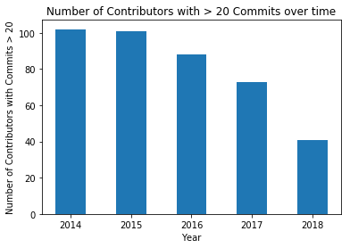

*Figure 3: Number of contributors with more than 20 commits*

A better indicator of the truck factor would be how many developers have consistently contributed
more than 20 times over the entire project's duration. This is shown in the figure below:

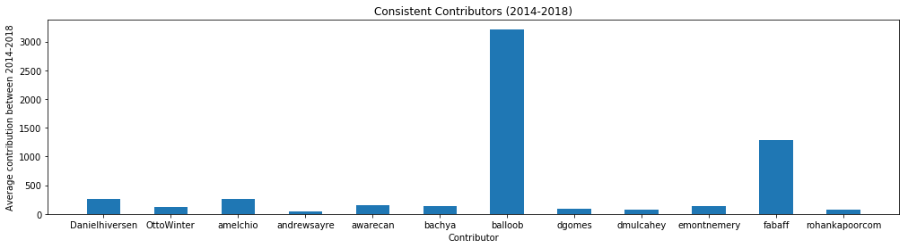

*Figure 4: Consistent contributors over time*

It can be seen that only 12 contributors meet these criteria. This could be taken as the truck factor.

#### Documentation Debt

HA has a [short release cycle](https://www.home-assistant.io/blog/2018/03/24/new-release-schedule/) with a major release every two weeks.
Maintaining an up to date documentation in such cases can be a challenge.
Observing the status of the documentation can give an indication of TD levels.
The HA's documentation is maintained in a separate [repository](https://github.com/home-assistant/home-assistant.io).
To ensure up to date documentation, new features and fixes are not merged without a supporting documentation update. This results in a non-existent documentation debt.

#### Issue Resolution and Pile Up

The speed with which issues are handled (Issue Resolution) and the number of issues which have persisted over releases (Issue Pile Up) are good TD indicators.
To analyse these indicators, the following were used:

* How fast are issues closed
* What are the oldest issues still open and why have they not been closed.

##### Issue Resolution

The last 2000 closed issues were analyzed and grouped according to the time between when they were opened and closed. A histogram was created from this data and is shown below:

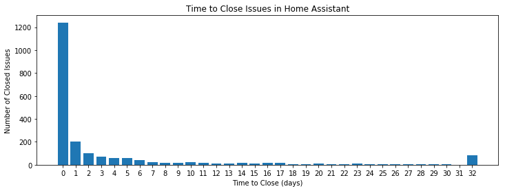

*Figure 5: Issue resolution speed*

The first 32 (0-31) bins indicate the number of days to close an issue while the 32nd bin indicates issues closed after more than 31 days.

More than 50% of all issues were closed within a day. This indicates timely issue resolution and a low level of TD.

##### Issue Pile Up
An issue was counted as having piled up it has been open for more than two years. The table below gives an overview of open issues older than two years and also includes the number of closed issues for reference:

| Year | Issues Open | Issues Closed |
| ---- | ----------: | ------------: |
| 2014 |           0 |             8 |
| 2015 |           0 |           282 |
| 2016 |           3 |          1428 |
| 2017 |          33 |          2462 |

*Table 3: Open/Closed issues per year*

From the table above, it is seen that the number of open issues are less than 10% of the total number of issues per year.
This generally indicates a low level of TD.
However, the analysis for 2018 and 2019 (so far) shows that there is an increase in the number of issues left open as seen below:

| Year | Issues Open | Issues Closed |
| ---- | ----------: | ------------: |
| 2018 |         440 |          3160 |
| 2019 |         486 |           665 |

*Table 4: Open/Closed issues most recent years*

An overview of these issues shows that many of them relate to external integrations and not the HA core. They do not adversely affect the running of the system as a whole.

### Testing debt

Observing how much of a projects code is covered by existing tests and what kind of testing methods is a good measure of TD.

#### Testing practices

Testing in HA is done using [`tox`](https://tox.readthedocs.io/en/latest/).
As part of the requirements for new features and fixes, all existing tests must pass. Also, see [Standardization of Testing](#standardization-of-testing).

#### Test duration

The test suite is also run for different versions of Python. As a result, a full test suite run takes more than an hour.
The development guidelines however advise that tests can be run for a single Python version to reduce the running time.
This is acceptable because the continuous integration pipeline runs the full test suite before a pull request is reviewed.

#### Code Coverage

Code coverage is a measure that indicates what percentage of the code base is covered by tests.
The code coverage for the main (HA) project has a [94% coverage](https://coveralls.io/github/home-assistant/home-assistant) for over 1000 files as can be seen below:

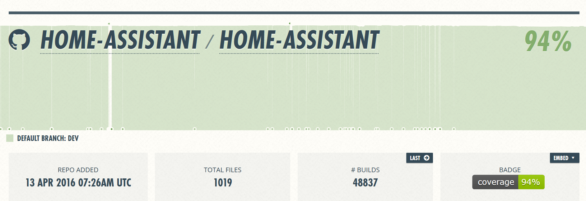

*Figure 6: A screenshot from the Coveralls.io HA page*

To put this in perspective the highest rated Python code coverage project on coveralls.io is [99%](https://coveralls.io/github/getsentry/sentry).
However, this project only consist of 8 files.
The next best project shows a coverage of [94%](https://coveralls.io/github/jakubroztocil/httpie) but this project consist of only 47 files.

### Home Assistant TD in Metrics

In addition to evaluating HA on the above mentioned factors, the repository was also analyzed using some TD tools.
This section presents the results from these tools.

#### Sonarqube

The HA project was analyzed using [Sonarqube](https://www.sonarqube.org/) and the results are shown below:

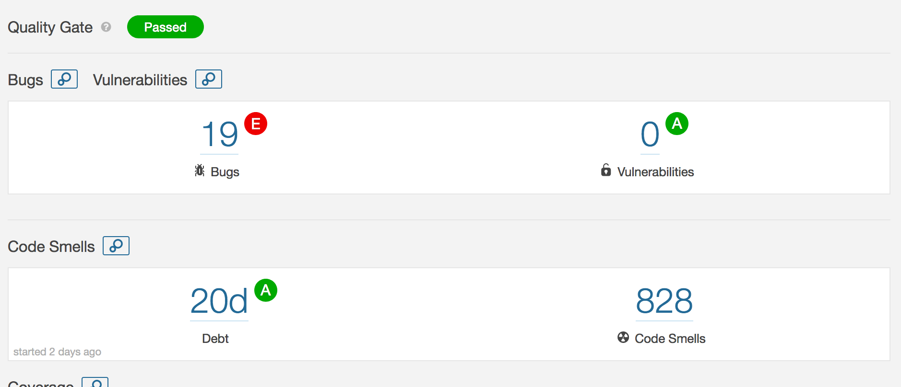

*Figure 7: A screenshot from the Sonarqube HA page.*

In summary, HA received a passing score for bugs, vulnerabilities and code smells.

#### Codebeat
HA was also analyzed using [Codebeat](https://codebeat.co/) which is an automated code review application. After the analysis, HA was assigned a 3.63 GPA (on a 4.0 scale). In terms of code complexity, only 2% of the files were deemed as *complex*. A summary of the analysis is shown in the image below:

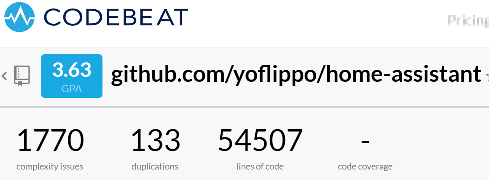

*Figure 8: A screenshot from the Codebeat HA page. This is based on a fork of the HA project.*

### Mitigating TD

The core developers of HA have taken measures to ensure that TD is kept at a minimum. Some of these measures are stated here:

#### Code Style

The developer's documentation contains a [section](https://developers.home-assistant.io/docs/en/development_guidelines.html) that states which style guidelines are to be adhered to.
Also, as part of the code review process, [Hound](https://houndci.com/#how-it-works), an automated code review application, is used to check style violations.

#### Code Reviews

Every new feature or fix, in addition to conforming to the [development checklist](https://developers.home-assistant.io/docs/en/development_checklist.html) and passing all tests, is also reviewed extensively by contributors to the project. Merging happens only after approval has been given.

#### Code Owners

For a large project like HA it is difficult for a single person to have an in depth view of the internals of every component.
This introduces difficulty with code reviews, i.e. who is the best reviewer for a feature/fix.
To solve this problem, HA uses the [Code Owners](https://github.blog/2017-07-06-introducing-code-owners/) concept which indicates contributors responsible for each part of the project.
Code owners are automatically notified when changes are proposed to their parts.
This ensures that the contributor with the best knowledge reviews a feature and reduces the possibility of introducing further debt.

#### TD Awareness and Accepting Feedback

Despite the checks in place, core team members also realize that the landscape of possible TD sources increases with HA's growth.
There is also a general readiness to accept and propose constructive feedback on the "right" way to implement a feature to avoid debt introduction.

#### Evolution of TD

To properly evaluate the evolution of TD, an empirical analysis was performed.
8 past major releases were analyzed using Sonarqube. The results are presented in figure 10.

These analyzed versions span from 2016 to 2019.
From the data it can be seen that while the overall TD, as measured by Sonarqube in days, has increased steadily this increase has been very low. Also, the number of identified bugs in the current version is lower than that of the earliest analyzed version.
It is logical that the debt associated with the project would grow as the project grows in size but from the foregoing analysis it can be concluded that the development practices employed in the project have kept this debt growth to a bare minimum.

#### Historical Analysis of TD and Corresponding Impact
To obtain a historical analysis of the TD, an empirical study was performed.
8 past major releases spanning from 2016 to 2019 were analyzed using Sonarqube. The results are shown in figure 9 below:

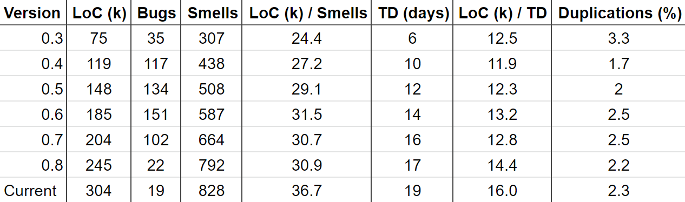

*Figure 9: A table with SonarQube metrics (and derivations) with regard to different project versions.*

### TD Conclusion
From the data it can be seen that the overall TD has been relatively low has been improving.
Considering the size of the project and the number of developers this is exemplary.

## Development view

This view of the HA project describes how the software is composed from a development perspective. A condensed overview is given of the most important models, procedures and standards that enable and support the development of HA in an efficient and structured manner.

### Module Organization
The HA source code is organized in to several modules that encapsulate specific functionality. Below, we present HA's module organization diagram with their dependencies.

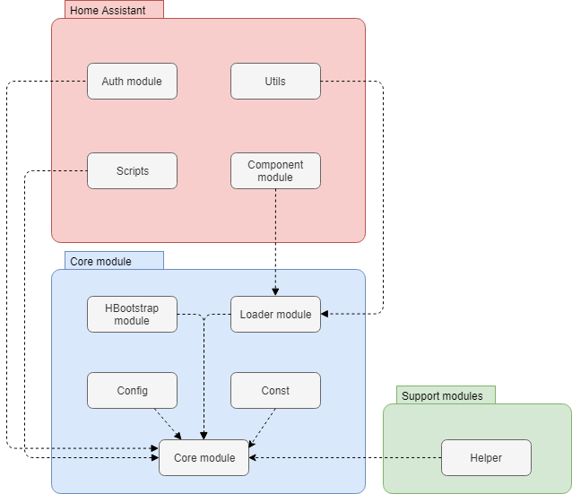

*Figure 10: Module organization.*

#### Home Assistant modules

| Module        | Description |
|---------------|-------------|
|Util module    |This module contains common utility functions that can be used by other platforms and components throughout HA. These include: finding the current location, calculating the distance, getting the temperature and more. |
|Helper module  |The helper module is a collection of unrelated methods and is always instantiated as a singleton. In this HA project, the helper module  contains functionality for validation, discovery and other helper functions for various components. |
|Bootstrap module|The bootstrap module has the following functionalities: Set up the logging, try to configure HA from a configuration dictionary stored on disk and start all components. The setup dynamically loads required components and its dependencies. It also tries to start all enabled components that are found in the configuration.|
|Config module|The config module checks if the HA configuration file is valid and parses the configuration if it is. This configuration contains all the information of which components and settings are enabled in HA. When there is no configuration file found a default configuration will be used.|
|Const module|The const module is using to constants used by HA components.|
|Core module|The core module is the main module of the HA system, which uses synchronous and asynchronous methods to deal with all inputs and outputs.|
|Exceptions module|The exception module contains all custom Exceptions that are used throughout HA.|
|Loader module|The loader module is using for loading HA components. A quote from the developers:Components can be accessed via `hass.components.switch` from your code. If you want to retrieve a platform that is part of a component, you should call get_component (hass, `switch.your_platform`). In both cases the config directory is checked to see if it contains a user provided version. If not available it will check the built-in components and platforms.|

*Table 5: Home Assistant modules*

### Common Processing

Common processing approaches address aspects of the architecture of HA that require a standard approach across the whole system. This is a key task as it contributes to the overall technical coherence of the system and clarifies how and where processing is done.

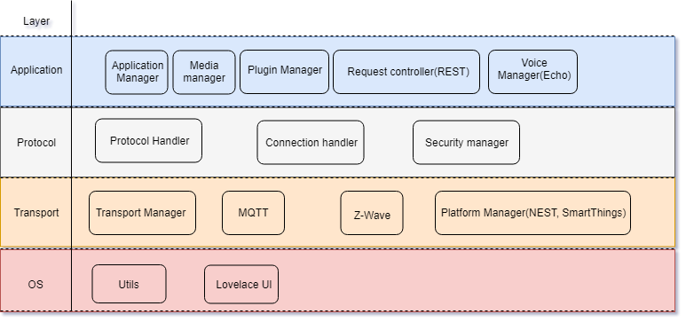

*Figure 11: Home Assistant layers overview.*

#### Modularity

The HA project contains multiple directories like home-assistant.io, docs for documentation, tests for the homeKit accessory-information service tests, Github for the PR template, scripts for project scripts, and virtualization for environment setting.

#### Application layer

The application layer of HA is used to separate the web layer from the application layer (also known as the platform layer). This allows you to scale and configure both layers independently.

#### DB layer

The database layer in HA allows you to write and read data between other layers and database.
The default database used by HA is SQLite, and the database file is stored in your configuration directory the DB layer (SQLite) is the common processing for the HA server.

### Standardization of Design

#### Internationalization

The HA internationalization project includes preparing platforms and the frontend for localization, as well as the actual translation of localized strings.
Platform translation strings are stored as JSON in the home-assistant repository. Custom components cannot take advantage of [Lokalise](https://lokalise.co/) for user submitted translations.

#### Maintainability

The documentation of HA are very important to record each product demand and issues.
To standardize the software design, the documentation aspect should be considered, in HA,
the language, word formatting, text style also should be objective and not gender favoring, polarizing, race related or religion inconsiderate.

#### Renaming Pages

Renaming is also standardized. It can happen that a component or platform is renamed, in this case the documentation needs to be updated as well.
If you rename a page, add redirect_from: to the file header and let it point to the old location/name of the page.

#### Template

The HA project makes the template for formatting documentation. All examples containing Jinja2 templates should be wrapped outside of the code markdown, and some static file are not allowed be used in template, such as ```states.switch.source.state```.

#### Technical cohesion of the system

HA uses Python as development language, and implements commonly used middleware, external API's (REST API, WebSocket API, Server-sent event) for extension.

### Standardization of Testing

The HA project uses [**tox**](https://tox.readthedocs.io/en/latest/) to standardize and automate their tests. This wrapper sets up the virtual environment and runs all tests, including validation of code style and documentation style. The tests are written using the Python unittest module.

The project uses [**Travis CI**](https://travis-ci.org/home-assistant/home-assistant) as continuous integration tool. This is set up to run on every pull request and tests against different versions of Python 3 to ensure that the release will be stable across different versions. When the test suite has completed all tests, the code coverage is checked by [**Coveralls**](https://coveralls.io/github/home-assistant/home-assistant).

Also, the [guidelines](https://developers.home-assistant.io/docs/en/development_guidelines.html) and [testing specifications](https://developers.home-assistant.io/docs/en/development_testing.html) stipulate that new features must include tests and where not possible (as in the case of features depending on external devices) should be explicitly excluded from being tested.

### Instrumentation

The most important monitoring tools available are the logging system and the server-sent events stream. For the logging HA makes use of the very popular Python module [**logging**](https://docs.python.org/3/library/logging.html). To tune the verbosity of logging you can change the log-level, because most of the time verbose logs are unnecessary.

The [**server-sent events stream**](https://developers.home-assistant.io/docs/en/external_api_server_sent_events.html) is available to subscribe to as a client. This provides a way to receive messages without Python logging to monitor HA.

### Codeline organization

The codebase of the HA can be found on the Github platform and is fully opensource. To develop features, fix issues or contribute code you will have to set up a [**development environment**](https://developers.home-assistant.io/docs/en/development_environment.html). In this development environment one should use a fork of the upstream **dev** branch as base. By creating a Pull Request to the home-assistant dev branch on github Travis CI is triggered the pull request to run the all the tests in the suite. Next to this, automated code review tool HoundCI is triggered by a pull request as well to check for code-style violations.

The HA project makes a new release every 14 days on average. These releases include the latest bug-fixes, features and components that have been included and approved by founder @balloob. Before anything can be included in a release it has to pass all tests in the test suite and pass the tests of pydocstyle, pylint and flake8. These tools are used to comply with the PEP8 standard and keep the code and docstyle compliant with the PEP8 and PEP257 standards. The releases are built using custom tools which provides the different options to install HA. The most important builds are: HassOS Docker Hypervisor, HassIO the private cloud supervisor and the HA program itself. HassOS and HassIO are not required to run the HA program but make it easier for user to install and deploy HA and add-ons. HA is not built as it is a Python program.

| Subject | Description |
|---------|-------------|
| Source File Organization | Divided into platforms, components and a core. Components and platforms can be enabled to run using the configuration. |
| Module groups | Every component is organized to be a Python module which can be imported. |
| Directory structure | The top-level directory consists of *docs, homeassistant, tests, script* and *virtualization*. The homeassistant directory contains the core and the directories for the platforms/components. |
| Building the source | The homeassistant program itself is not built, as this is a Python program there are no binaries that are built and released. Instead, the code is released and run using a Python 3 interpreter. |
| Scope, type & running of tests | Almost every part of HA is unit tested. Next to the unit testing the code and documentation is validated using tools which are configured to all run using *tox*. |
| Source release | The HA program is released on github and continuously tested using Travis CI. Other parts of the HA project such as HassOS are built and then published on the website. |
| Source control | Source control is done using Github. The HA project is organized into multiple repositories, each with a different purpose, such as for example the backend or the website. Development is done by creating pull requests against the upstream *dev\* from your own forked repository. |

*Table 6: Codeline Model Overview*

## Functional View

This section describes the functionalities, capabilities, interfaces and interactions of the HA project.

### Functional Capabilities

From a high-level overview one could say that HA has three important capabilities, these are:

1. Receive and process events, which includes messages from sensors connected to HA.
2. Control devices and send events to other devices such as notifications or status updates.
3. Provide a centralized interface and an overview of everything connected to HA with a web-accessible user interface.

We can see how these functionalities of HA interact in figure 12 below.
The Home Control part of the architecture is the core of the architecture.
The user can interact with the Home Control using one of the interfaces provided by The HA project, more on this can be found below in the [interfaces](#interfaces) section.

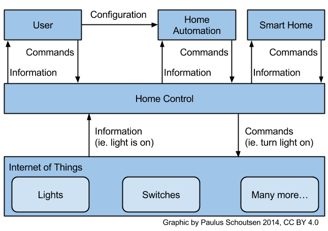

*Figure 12: Home Assistant high-level functionalities.*

#### Core Functional Components

As seen in the figure above, Home Control is central to HAs functionality and is referred to as the **core** of HA.
This core functionality is split into four major functional categories:

* Event Bus
* State Machine
* Service Registry
* Timer

**Event Bus**
HA relies heavily on an event based architecture. The core part of HA provides an event bus which facilitates communication between components, the core and other external entities.
Events are triggered i.e placed on the bus by connected devices/services for instance when some action is taken by the device. Similarly, other connected devices can listen in on the bus for events from interesting devices and take action based on such events.

**State Machine**
Central to HA being able to control connected devices and provide an overview of the state of the connected devices is its ability to manage the device state.
The State Machine provides a store for the state of each connected device. When a device state is changed, it triggers an update of the state machine. The state machine updates its internal store and fires an event on the bus with the updated state.

**Service Registry**
Connected devices might offer services. As an example, a connected media player would offer a play/pause/stop service for media files. The service registry allows such devices to register the services that they offer as well has handlers for such services.
Users of the system or other connected devices can also request for registered services using the interface provided by the Service Registry.

**Timer**
The Timer serves a function analogous to a clock in a synchronous processor. It fires a `time_changed` event every second. Connected devices can listen for this event and use it to schedule state polling or other recurring actions.

### Design Philosophy

According to the [**vision**](https://www.home-assistant.io/blog/2016/01/19/perfect-home-automation/) of founder Paulus Schouten (@balloob) HA should run at home and everything you automate should work flawlessly. Therefore, the design of HA is as modular as possible, allowing to keep the installation as small as necessary while keeping the system maintainable and extendable. The architecture and technologies used in HA follow this vision, which results in HA scoring high on design qualities such as separation of concerns, cohesion and coupling.

### Home Assistant Extensions

While the Home Control part of the HA interface is responsible for controlling/managing connected devices the HA Extensions provide the interfaces with which devices can be controlled and managed. These extensions are called **Components** in the HA ecosystem.
There are two broad categories of components:

* IoT Domain Components
* Task Domain Components

**IoT Domain Components**
These components interact with connected devices. They update device state in the state machine and expose services offered by the devices via the service registry.

**Task Domain Components**
These components are more automation centric. They typically listen for events and state updates from IoT domain components and based on pre-defined logic perform some action.
An example might be a `play_wakeup_music` component which triggers the play service of a connected media player on sunrise.

### Interfaces

HA provides a number of external interfaces for interaction with the system.

#### Lovelace

[Lovelace](https://www.home-assistant.io/lovelace/) is a web based graphical user interface with which users can manage connected devices. It allows the user to add new devices, request for registered services, monitor device state, etc.

#### Hass<span></span>.io Command Line Interface

HA can be setup on any operating system but
[Hass.io](https://www.home-assistant.io/hassio/), which was designed with embedded devices like the Raspberry PI in mind, simplifies the setup process.
It provides a [command line](https://www.home-assistant.io/hassio/commandline/) interface which allows the user to start or stop HA, view generated logs or query the state of connected hardware.

#### IOS Companion App
HA supports integration with a companion [IOS application](https://www.home-assistant.io/docs/ecosystem/ios/). This interface exposes information about connected devices and allows the user to manage devices and update configuration entries.

### The bigger picture

When combined, the capabilities, core components, extensions and interfaces together give an overview of capabilities and functionality the HA system as a whole. This can be seen in the image below.

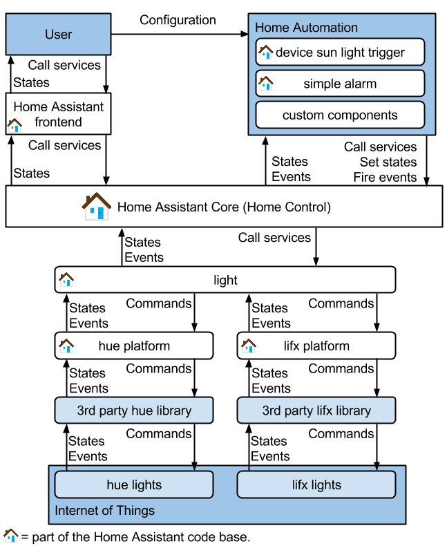

*Figure 13: Home Assistant full architecture schematic.*

The core is made accessible by the interface options while the separation of the core and components make it easier to extend the core functionality. Next to this, a user can configure the system to trigger on events that are sent over the event bus and display information in the frontend of HA.

## Conclusion

This chapter analyzed a number of aspects of the Home Assistant project. It can be concluded that the architecture is well-designed and HA is growing in popularity and number of active and contributing users.

The different stakeholders in the Home Assistant project were extracted and presented. Next, the Context View revealed the interactions of the project with different entities. The TD, Development View and Functional view then shed light on how the system is developed, maintained, tested and used.

In Conclusion, despite the rapid growth in terms of size and number of components the system remains clearly structured and is well maintained. Next to this, the guidelines, documentation and active community make it easy to contribute to the project which in turn supports the project's growth.

## References

* <span id="ref1">[1]</span> Rozanski, N., & Woods, E. (2012). Software systems architecture: working with stakeholders using viewpoints and perspectives. Addison-Wesley.

* <span id="ref2">[2]</span> Apache License, Version 2.0, January 2004. http://www.apache.org/licenses/LICENSE-2.0.txt

* <span id="ref3">[3]</span> Gardner, J. R., Rachlin, R., & Sweeny, A. (1986). Handbook of strategic planning. John Wiley & Sons.

* <span id="ref4">[4]</span> https://codescene.io/projects/4449/jobs/12494/results/social/authors

* <span id="ref5">[5]</span> https://www.linkedin.com/in/schoutsen


## Appendix

We analyzed 10 Pull Requests (PR) to identify stakeholders and decision-making process. The PRs were selected by looking at the most commented closed PRs on github and selecting 5 rejected and 5 merged ones. The PRs that were used in this analysis are listed below.

***Approved PRs***

| Pull Request  | Description |
|---------------|-------------|
|[**Rflink gateway addition**](https://github.com/home-assistant/home-assistant/pull/4547)| PR was opened by @aequitas with the code still in a rough state as WIP. A bot automatically assigns reviewers, one of which was @balloob (Founder of Home-assistant). Code owners are marked in the a separate file and when working on components of a code owner he/she will automatically be triggered to review the PR. @balloob provided extensive reviews and requested some changes. All of these changes were addressed over the course of two months. The size of the pull request resulted in some inefficiency because comments were missed and addressed late because of it. Comments reveal that there is too much documentation that contributors do not read or are unaware of, because patterns are introduced that they do not want (They do not want communication over event bus) |
|[**Added new climate component from Daikin**](https://github.com/home-assistant/home-assistant/pull/10983) | Interesting dynamic in this pull request. This time @tinloaf provided an extensive review and requested changes, next to that there were quite some lint errors. It turned out the user was new to Python and Home Assistant and got a little impatient. For instance, the device that was added appeared to have multiple interfaces. And the person who opened the PR (@rofranz) had opened another PR. The community however, told @rofranz to first finish the current PR. Because of the size of the commits @tinloaf wanted someone else to do a review as well. Which resulted in a whole lot more suggestions and requested changes. These were all addressed by the user and the PR got merged. So quite a successful review structure and collaboration as well as a good experience for the user in the end. |
|[**Improve InfluxDB**](https://github.com/home-assistant/home-assistant/pull/5238)| Pull Request reverting and fixing issues. Interesting discussion on data types and improvements for the DB. Migration script ended up in a breaking change which in turn got fixed. |
|[**Add deCONZ component**](https://github.com/home-assistant/home-assistant/pull/10321) | deCONZ is software that communicates with Raspbee and Zigbee gateways and exposes the connected devices. The user @Kane610 opened this PR to add functionality for the HA. Some discussion between @balloob, @Kane610 and @tinloaf took place about naming conventions and on how I/O should be addressed (never inside the events loop). Later a big discussion was started about implementing it 'entities' or 'events'. E.g. should a button be an entity or should it be implemented in an event (the latter was chosen). Finally @MartinHjelmare merged the commit. |
|[**Xiaomi vacuum as platform of new `vacuum` component derived from ToggleEntity, and services**](https://github.com/home-assistant/home-assistant/pull/8623) | In this PR a vacuum component is added. The discussion mainly revolves around the way a component has to be implemented. During development of the PR @MartinHjelmare had some real critical pointer to the creator of the PR @azogue. At the end, several members of the community applauded the work of @azogue. Finally @pvizeli merged this PR but the result was a flaky test as spotted by @balloob.|

<!-- |[**Update to DoorBirdPy v2 (again)**](https://github.com/home-assistant/home-assistant/pull/14933) | The Doorbirdy is a smart doorbell/intercom. This PR is an update of the DoorBird LAN API.   |
|[**xxx**](xxx) | xxx   |
|[**xxx**](xxx) | xxx   |
|[**xxx**](xxx) | xxx   |
|[**xxx**](xxx) | xxx   |
|[**xxx**](xxx) | xxx   |
|[**xxx**](xxx) | xxx   | -->

***Not-Approved PRs***
<!-- is:pr is:closed is:unmerged sort:comments-desc  -->

| PR  | Description |
|---------------|-------------|
| [**Add new platform AndroidTV/Android**](https://github.com/home-assistant/home-assistant/pull/16975) | This pull request attracted some attention because a number of people wanted the feature. It looked promising and almost ready to merge, but then got stuck on python-adb dependencies. Home Assistant founder @balloob requested changes to fix the dependencies and create a new PyPi package and closed the pull request. He suggests opening a new PR once the package has been fixed meaning this PR is closed and not merged. |
|[**Add Component for PlayStation 4 consoles as integration/config flow**](https://github.com/home-assistant/home-assistant/pull/20007) | New component for the Home Assistant. Reviews resulted in a lot of requested changes which all got addressed. At first the code was written to support multiple PS4 devices. However, this resulted in a few issues and to get the component to be included this code was omitted as they decided that not many people have multiple PS4 devices. So they omitted that code and merged the working code for one device, leaving the multiple device implementation open for now. Most important review work was done by @MartinHjelmare, one the active collaborators for Home Assistant. |
|[**Improve Philips Hue color conversion**](https://github.com/home-assistant/home-assistant/pull/19123) | The original problem description is not clear. In a discussion between @starkillerOG and @amelchio the problem is clarified as that the PR tries to fix is the limited amount of colors that can be chosen from within the HA. Finally the PR was closed as the solution was publish in another project (aiohue library).   |
|[**Cover component for RFlink**](https://github.com/home-assistant/home-assistant/pull/8875) | This PR was an attempt to create a new HA component for the Somfy RTS more specifically the RFlink. The PR was started by @passie which has not opened a PR in the past. Some problems are encountered with the signing of the CLA. Then the PR is dominated by @houndcli-bot (a bot) which reports a lot of unused statements in the code of @passie. Some version of the code is tested by @olskar which is reported to work. The PR closes with another bot statement reporting that a commit was placed via a non-linked github account. Finally, @passie closes the PR. |
|[**Add support for some Tuya devices.**](https://github.com/home-assistant/home-assistant/pull/11000) | The Tuya is an IoT *platform* to wirelessly connect home devices. The person who opened the PR (@sean6541) want to design a *component* for the HA. Actually, some further research shows that the Tuya is implemented in the [HA](https://www.home-assistant.io/components/tuya/), contrary to the final state of this PR. The houndci-bot initially had a lot of remarks. After some discussion and new commits @sean6541 is showing up less frequently and is not seen anymore. @pvizeli closed the PR for reopening when all open comments are addressed. |
[**Rfxtrx binary sensors**](https://github.com/home-assistant/home-assistant/pull/4218) | This PR is an attempt to add a [Rfxtrx](http://www.rfxcom.com/epages/78165469.sf/nl_NL/?ObjectPath=/Shops/78165469/Categories/Transceivers) sensor ass a component to HA. This is a transceiver for different devices in the area of domotics. The PR started with a lot of linting comments from @balloobbot. Some discussion about the implementation and testing happened. Then @balloob closed this PR because it had gone stale by @ypollart. A few months later @ypollart reopend another PR to add this sensor. |

<!-- |[**xxx**](xxx) | xxx   |
|[**xxx**](xxx) | xxx   |
|[**xxx**](xxx) | xxx   |
|[**xxx**](xxx) | xxx   | -->

