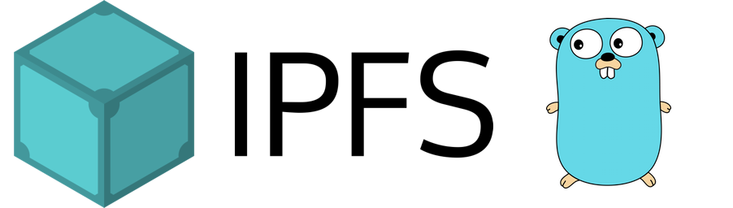
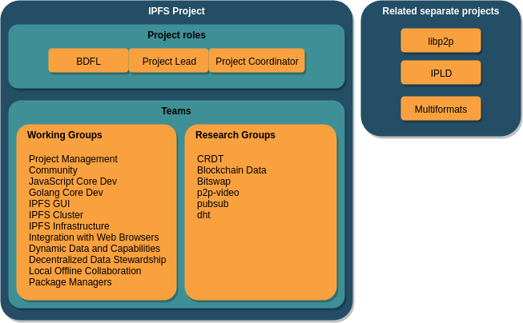
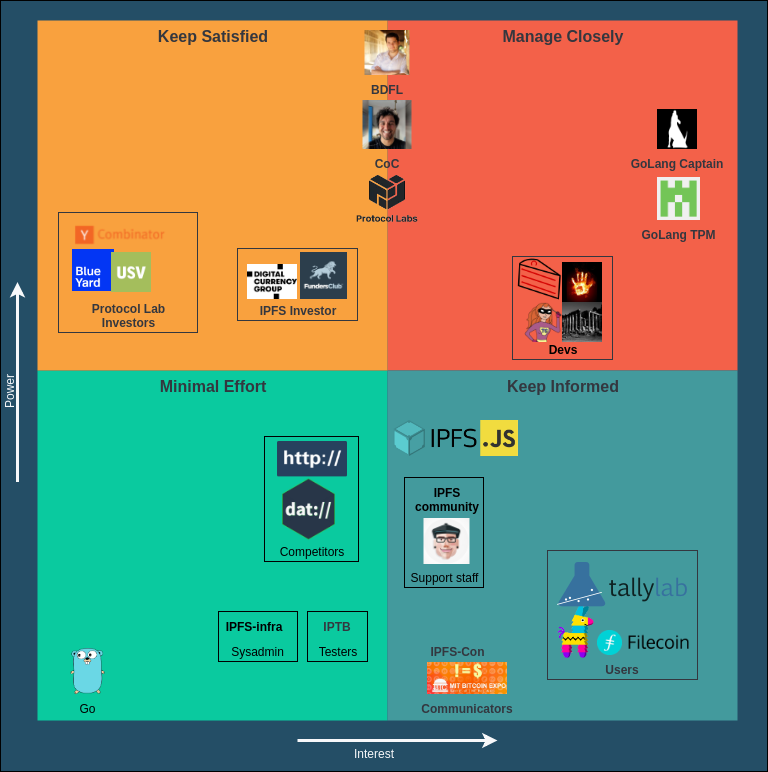
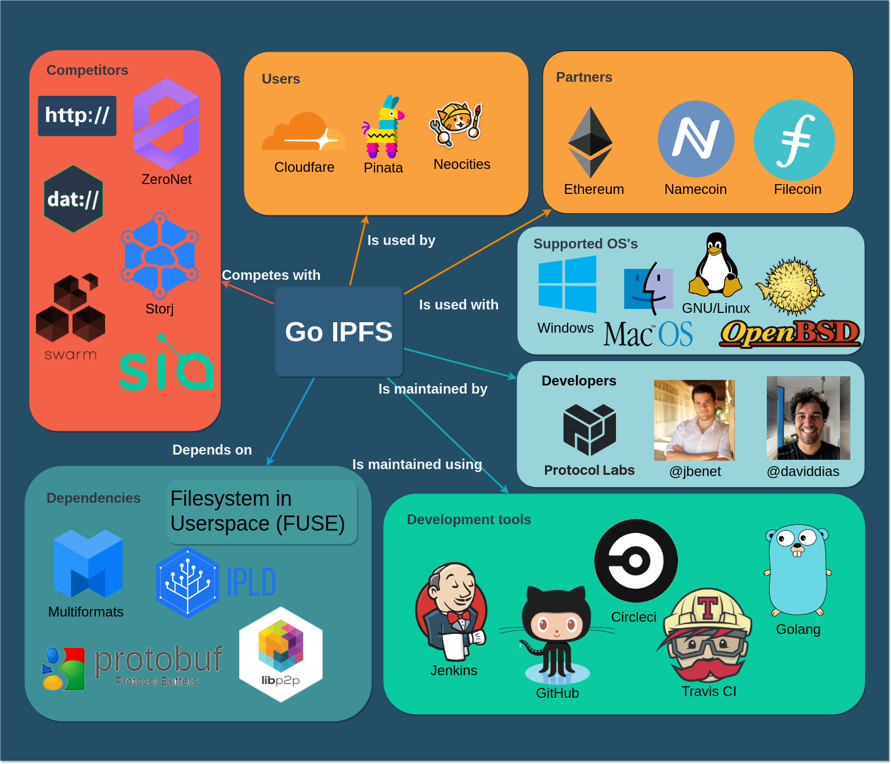
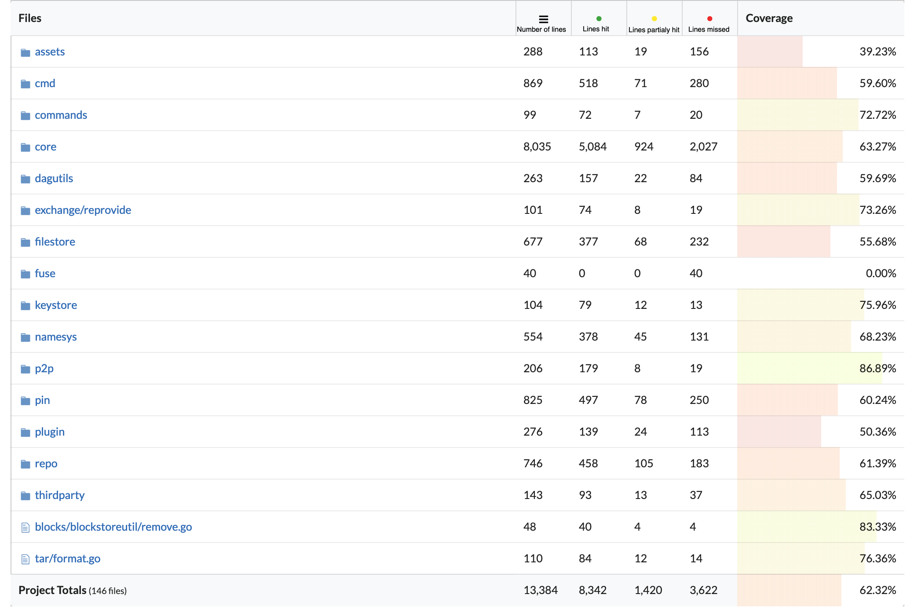
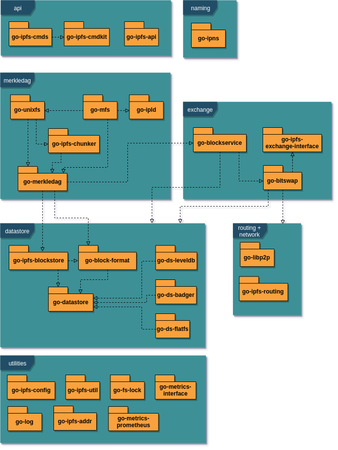
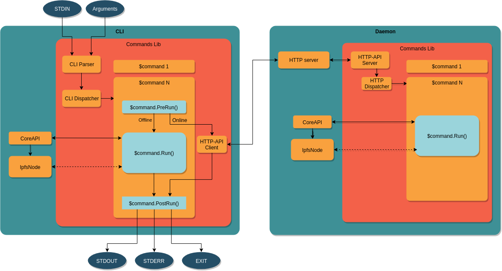

# IPFS

## Contents

1. [Introduction](#introduction)
2. [Stakeholders](#stakeholders)
4. [Context View](#context-view)
5. [Technical Debt](#technical-debt)
6. [Development View](#development-view)
7. [Conclusion](#conclusion)

## Introduction

The Internet and The World Wide Web are considered to be some of the greatest
inventions of the 20th century. However, while the Internet is built on the
principles of decentralization from the ground up, we cannot say so about the
Web itself. The majority of the websites is operated by a few hosting companies
and most of the static content is served by a few *Content Delivery Networks
(CDNs)*. For example, Cloudflare[^cloudflare] currently powers 10% of all
internet requests. Since there is a central point of failure, if a provider
experiences outage, a large part of the internet goes down. Another issue with
the current infrastructure is a *crisis of erased history*. One cannot expect
that a web address visited today will still work in several years from now or
that the content will stay the same. In fact, the average lifespan of a webpage
is only 75 days[^avg-lifespan]. Last but not least, the current web is not
censorship-resistant, and some governments already intentionally restrict their
citizens from having access to information[^uncensorable].

These were probably the main motivations why **Protocol Labs** was founded in
May 2014 with the mission to improve Internet technology. They started as a
YCombinator company and released an initial version of the **InterPlanetary File
System** (IPFS) in January 2015. IPFS combines the best ideas of Git, BitTorrent
and Kademlia to provide a truly decentralized, peer-to-peer hypermedia protocol.
In 2016, several modules evolved into separate projects, namely **libp2p**,
**IPLD**, and **Multiformats**, all of which constitute the building blocks of
IPFS.

The *InterPlanetary* part of the name pays a homage to Licklider's Intergalactic
Computer Network[^interplanetary], a computer network concept which inspired the
development of today's Internet. In theory, IPFS could one day be actually used
on an interplanetary scale, thanks to its peer-to-peer architecture and ability
to work in disconnected networks.

[^cloudflare]: <https://www.cloudflare.com/learning/what-is-cloudflare/>

[^avg-lifespan]: <http://clgiles.ist.psu.edu/papers/Computer-2001-web-references.pdf#page=5>

[^uncensorable]: <https://blog.ipfs.io/24-uncensorable-wikipedia/>

[^interplanetary]: <https://discuss.ipfs.io/t/why-the-name-ipfs/307>

## Structure of IPFS Project

The IPFS project is well structured into teams to separate responsibilities.
There are three project roles that are responsible for the long term vision and
coordination of teams – Benevolent Dictator for Life (BDFL), IPFS Project Lead,
and IFPS Project Coordinator. These roles are further explained in the stakeholders
section. The teams of the project are split into two types: working groups (WG) and
research groups. The working groups are developing and deploying software, while the
research groups are exploring new areas. Some former working groups (libp2p,
IPLD, and Multiformats) have grown to become their own fully separated projects.

The whole IPFS project consists of [more than 200
repositories](https://github.com/ipfs), but in our architectural description we
focus on [go-ipfs](https://github.com/ipfs/go-ipfs), which serves as a reference
implementation of the IPFS protocol. Go-ipfs being a working group of the IPFS project has multiple relations with groups and project roles that are not part of the go-ipfs working group. This
is further explained in the power grid.

## Stakeholders

In this chapter, we will identify stakeholders involved in the go-ipfs project
using the categories according to Rozanski & Woods [^book], specify managing
roles in the overall IPFS project and its relation to the go-ipfs project.

[^book]: Nick Rozanski and Eoin Woods. Software Systems Architecture: Working
with Stakeholders Using Viewpoints and Perspectives, 2nd Edition. 2011.

### Roles

To properly define roles, we inspected the Protocol Labs profile on
[Crunchbase](https://www.crunchbase.com/organization/protocol-labs#section-funding-rounds) and
various IPFS repositories on GitHub including
[ipfs-mgmt](https://github.com/ipfs/team-mgmt), where we learned how the IPFS
community operates and how it is structured. To identify people most involved
in the process of creating code in the go-ipfs project, we analyzed 20 recent
(created after 1 September 2018) merged and unmerged Pull Requests with the
highest number of comments.

Pull Requests we used can be observed in the following table:

|Type  | List of Pull Requests |
|----------------|-----|
|Merged               |   [#5526](https://github.com/ipfs/go-ipfs/pull/5526), [#5611](https://github.com/ipfs/go-ipfs/pull/5611), [#5789](https://github.com/ipfs/go-ipfs/pull/5789), [#5472](https://github.com/ipfs/go-ipfs/pull/5472), [#5785](https://github.com/ipfs/go-ipfs/pull/5785), [#5455](https://github.com/ipfs/go-ipfs/pull/5455), [#5864](https://github.com/ipfs/go-ipfs/pull/5864), [#5659](https://github.com/ipfs/go-ipfs/pull/5659), [#5501](https://github.com/ipfs/go-ipfs/pull/5501), [#5649](https://github.com/ipfs/go-ipfs/pull/5649)  |
|Unmerged                | [#5474](https://github.com/ipfs/go-ipfs/pull/5474), [#5583](https://github.com/ipfs/go-ipfs/pull/5583), [#5435](https://github.com/ipfs/go-ipfs/pull/5435), [#5840](https://github.com/ipfs/go-ipfs/pull/5840), [#5464](https://github.com/ipfs/go-ipfs/pull/5464), [#5744](https://github.com/ipfs/go-ipfs/pull/5744), [#5479](https://github.com/ipfs/go-ipfs/pull/5479),[#5570](https://github.com/ipfs/go-ipfs/pull/5570), [#5514](https://github.com/ipfs/go-ipfs/pull/5514), [#5849](https://github.com/ipfs/go-ipfs/pull/5849)   |

The analysis of these Pull Requests provided us with knowledge which developers are
actively taking part in the process of code review and also that almost all Pull
Request have to be finally accepted and merged by the Captain of go-ipfs
([@Stebalien](https://github.com/Stebalien)).

It was also helpful to explore issues used for team discussion like
[a reflection issue](https://github.com/ipfs/go-ipfs/issues/5781) or
[logs](https://github.com/ipfs/team-mgmt/issues/674) from weekly meetings
between members. From this, we noticed that the project is developed using Agile
approach. The team uses quarterly
[Objectives and Key Results](https://github.com/ipfs/team-mgmt/tree/master/OKR)
(OKR), which helps them to communicate goals and achievements on a quarterly
basis. Developers work asynchronously and remotely, however, each week there is
a weekly call to discuss project related issues, such as the current state of
their work and plans for the future.

As contact people, it would be the most helpful to contact developers which
participate most actively in Pull Requests and also contribute a lot, as they
would possibly have the most significant knowledge about the system structure
and various issues they often have to overcome. We would choose
[@Stebalien](https://github.com/Stebalien),
[@Kubuxu](https://github.com/Kubuxu), and
[@magik6k](https://github.com/magik6k).

Results obtained from these various sources can be found below.

| Type                  | Stakeholders                                                                                                          |
|-----------------------|-----------------------------------------------------------------------------------------------------------------------|
| Acquirers             | Acquirers are sponsors and distributors of the product. The acquirer of this project is Protocol Labs. |
| Assessors             | These stakeholders are responsible for overseeing conformance to standards and legal regulations. Assessors in the go-ipfs project is Protocol Labs legal department.                                                                                                      |
| Communicators         | The interest of this stakeholder is to explain the usage of the system via documentation and training. There are two recent and popular conferences: IPFS Conf 2019, MIT Bitcoin Expo 2018.                                                                                                              |
| Competitors           | [ZeroNet](https://zeronet.io/), [Storj](https://storj.io/), [Burst](https://www.burst-coin.org), [Genaro](https://genaro.network/), [MaidStafe](https://maidsafe.net/), [Dat](https://datproject.org/)                                                                                                        |
| Developers            | Most of the people involved in work on IPFS are employed by Protocol Labs. People responsible for developing new functionalities and maintaining the project are currently: [@Stebalien](https://github.com/Stebalien), [@magik6k](https://github.com/magik6k), [@Kubuxu](https://github.com/Kubuxu), [@hsanjuan](https://github.com/hsanjuan), [@kevina](https://github.com/kevina), [@hannahhoward](https://github.com/hannahhoward), [@eingenito](https://github.com/eingenito).                                 |                                                                                                                   |
| Investors             | Investors are the stakeholders providing resources to make it possible to continue the development of the system. The main investor of the project is Protocol Labs (mostly sponsored by [Union Square Ventures](http://www.usv.com/blog/protocol-labs), [BlueYard](https://medium.com/@BlueYard/protocol-labs-35ceff61b031) and [YCombinator](https://www.crunchbase.com/organization/protocol-labs#section-recent-news-activity)), other investors of the IPFS project are FundersClub, Digital Currency Group.                                                                                                                 |
| Maintainers           |These stakeholders are responsible for the evolution of the project. The software is in alpha version, however, people trying to maintain the long-distance vision are [@daviddias](https://github.com/daviddias), [@Stebalien](https://github.com/Stebalien).                                                                                                              |
| Suppliers             | Build or supply hardware and software on which system is working. In this project software used is mostly written in Go and Bash.                                                                                                                   |
| Support staff         | IPFS has a designated [community project](https://github.com/ipfs/community) for educating about how the IPFS and its tools work and can be exploited. The Captain of the community project is [@mikeal](https://github.com/mikeal).                                                                                                                |
| System administrators | System administrators are people running the software once it has been deployed, and as an idea of IPFS is to be a P2P network, users are the most obvious stakeholders of this type. On the other hand, IPFS project has a designated team of engineers ([infra-team](https://github.com/protocol/infra-team)) in charge of deploying and maintaining core system infrastructure.                                                                                                                   |
| Testers               | These stakeholders test if the system is working and ready to be deployed. These are developers and users using a designated [TestBed](https://github.com/ipfs/iptb).                                                                                                                     |
| Users                 | This group of stakeholders uses the product and has concerns about its functionality. Representants of this group include: web developers who want to host static files, dapp developers, users who want to access data stored on IPFS, pinning services ([Eternum](https://www.eternum.io/), [Pinata](https://www.pinata.cloud/)), gateway providers ([Cloudflare](https://www.cloudflare.com/)), and hosting providers ([Neocities](https://neocities.org)).                                                                                                                     |

### IPFS Roles

IPFS has some designated managing roles which are explained briefly in the table
below. In the scope of this chapter we mainly focus on the Go implementation,
however, to properly understand how the management processes works in the
go-ipfs project it crucial to observe everything in the bigger picture, namely
the whole IPFS project and all of its subprojects. It is interesting to see how
these projects collaborate with each other to produce the final product.

| Type | Stakeholder | Description |
|------|-------------|-------------|
| IPFS BDFL   | [@jbenet](https://github.com/jbenet)  (the original creator of the IPFS Project)      | **Benevolent Dictator for Life**:    Lead the IPFS Project at a long term scale.  Represent the IPFS project to a multitude of communities. Take responsibility for setting the direction of the project. Set the key priorities for the project. |
| IPFS Project Lead   | [@daviddias](https://github.com/daviddias)     | **Captain of the Captains**. Align teams to build solutions for technical challenges. The lead director of the implementation of the protocol.  |
| IPFS Project Coordinator | [@momack2](https://github.com/momack2) |  Ensure that teams rely on a uniform structure with respective customizations as needed. Create and maintain the platform for resource allocation across teams and projects. Ensure that there is a steady communication flow between teams and individual contributors. |
| Golang IPFS Captain | [@Stebalien](https://github.com/Stebalien) | The Captain takes the lead on writing or guiding the conversation specs, documentation, and other artifacts to support the team. The Captain is also the gatekeeper of the Working Group Roadmap and accumulator of the Working Group Knowledge, guiding the group to make good decisions. |
| Golang IPFS  Technical Project Manager (TPM) | [@eingenito](https://github.com/eingenito) | The Technical Project Manager (sometimes referenced as Project Manager, Program Manager, and cat herder) is a team enabler. TPMs own the Quarterly Planning process including OKRs and Retrospectives. They ensure that the coordination strategy the WG selected is well executed. |

From the table above we can observe that important decisions related to IPFS are
supervised by the **Benevolent Dictator for Life**, the IPFS Project Lead and
all Captains of all projects. The Project Captain and Technical Project Manager
are enforcing and supervising the implementation of new features or changes in
their project. Developers of go-ipfs propose changes using Pull Requests, but
each of them has to be accepted by one of the project supervisors
([@Stebalien](https://github.com/Stebalien) - Captain or
[@eingenito](https://github.com/eingenito) - TPM). Or when changes are more
significant, higher instances are involved
([@daviddias](https://github.com/daviddias) - captain of captains or
even [@jbenet](https://github.com/jbenet) - BDFL).

### Power-Interest Grid

To visualize the power and interest of stakeholders, we created a power-interest
grid. Stakeholders with the most power and interest are located in the top-right
quadrant.
The Golang IPFS Captain and TPM are in charge of the direct course of the
project. The developers are also located in this quadrant, but have less power.

In the top-left quadrant, the investors can be found. The BDFL and the Captain
of Captains are somewhere in between the top left and right quadrants.
They are in charge of the overall vision and progress of the general IPFS
project. As they make top-level decisions, they have a lot of operational power,
but are less involved in the specific implementation of the go-ipfs project.

The users and projects that depend on the go-ipfs project are in the bottom
right quadrant. They need to be up to date with the project, so that any major
change won't affect them.

In the bottom left quadrant, we have suppliers. The Go language has some
influence on the project. If Go changes, the project will be affected.

## Context View

The context view describes relationships, dependencies, and behaviors between
IPFS and external entities.

### System Scope

IPFS is a protocol for a distributed file system whose goal is to make content
delivery truly decentralized. Go-ipfs serves as its original and reference
implementation.

It consists of a daemon and a command line interface (CLI). The daemon contains
an HTTP server through which the CLI and other apps can communicate. It is also
possible to
[mount IPFS to /ipfs](https://github.com/ipfs/go-ipfs/blob/master/docs/fuse.md)
on the local filesystem, which allows arbitrary apps to access the content
stored on IPFS without communicating with the IPFS node directly.

The Go implementation is used by end users and service providers. Web apps
usually use its [JavaScript implementation](https://github.com/ipfs/js-ipfs) as
it is possible to run it in a web browser without any software installed on a
client.

### Context Model

To visualize relationships with external entities, a context model diagram has
been designed.

IPFS is developed by [Protocol Labs](https://protocol.ai/), a research and
development company. Its development team is globally distributed, just like the
Internet itself. The main contributors and decision makers of the go-ipfs
project have been analyzed in the previous section.

The development including most of the decision making happens on GitHub. There
are several CI tools used for running tests and code analysis, including
Jenkins, CircleCI and Travis.

IPFS depends on other projects developed by Protocol Labs, especially
[libp2p](https://libp2p.io/) (a network stack for peer-to-peer applications),
[IPLD](https://ipld.io/) (Interplanetary Linked Data), and
[Multiformats](https://multiformats.io/).

For the content to be available, it has to be present at least on a single node
in the network. As end-user nodes go offline frequently, there is still a need
for servers to store a copy of data if there is a requirement for permanent
availability guarantee. Seeing this as a business opportunity, several *pinning
services* (e.g. [Pinata](https://www.pinata.cloud/)) started to provide pinning
of IPFS objects for a monthly fee. Another alternative would be to provide an
incentive for users to store data of other users and keep the network
decentralized. [Filecoin](https://filecoin.io/), another project of Protocol
Labs, is expected to introduce that incentive in the future.

Besides regular users, there are several parties who are interacting with IPFS.
The project is interesting for website creator tools like
[Neocities](https://neocities.org/distributed-web), which are starting to use it
to host static content.
[Cloudflare](https://blog.cloudflare.com/distributed-web-gateway/), one of the
largest CDN providers, is running their own IPFS gateway and allows developers
to connect an existing domain using DNS to a directory stored on IPFS. Other
tools that are compatible with IPFS and aim to replace the centralized DNS are
[Namecoin](https://namecoin.org/) and [Ethereum Name
Service](https://ens.domains/).

The ultimate goal of IPFS is to replace HTTP for serving static content and make
The Internet truly decentralized. For that reason, we can see the HTTP
protocol as a competitor.
[Freenet](https://freenetproject.org/author/freenet-project-inc.html) and
[ZeroNet](https://zeronet.io), which have similar goals, are direct competitors.
Finally, any public distributed file system could be seen as an indirect
competitor.

The application is multiplatform and can be run on Windows, Linux, and macOS.

## Technical Debt

During our research, we found that the developers are constantly paying
attention to code quality and try to maintain the quality of the software in
various ways, but especially by detailed code reviews and discussions.

We analyzed the technical debt of go-ipfs in several ways. Firstly we used
SonarQube, then we analyzed code manually and in the end, we decided to check if
developers discuss technical debt in Pull Requests or in issues.

### SonarQube Analysis

We use SonarQube [^sonarqube] to analyze repository with regard to
vulnerabilities, code smells and possible
bugs.

[^sonarqube]: https://www.sonarqube.org/

| Metric | Bugs | Vulnerabilities | Debt  | Duplications | Duplication Blocks | Coverage |
|--------|------|-----------------|-------|--------------|--------------------|----------|
| Value  | 0    | 0               | 4d 3h | 1.1%         | 18                 | 0.0%     |

As can be seen, no bugs or vulnerabilities have been discovered in the code.
Also, technical debt is on a low level as having on 4 days 3 hours. Duplications
are also on the low level (1.1%).  Further analysis shows that the 324 code
smells consist of:

- 69 TODO comments
- 12 not following the naming convention
- 47 defining a constant instead of duplicating literal
- 50 refactor function to reduce Cognitive Complexity
- 124 remove unused parameters

### SOLID Violations

Generally it is not so easy to find violations of SOLID rules, however,
 function `getOrHeadHandler` in the file
`go-ipfs/core/corehttp/gateway_handler.go` (226 lines) is great example of
violation of Single Responsibility Principle. Many parts of this large function
could be extracted to separate functions to improve readability and testability.

In general case, as we noticed from analysis of Pull Requests and manual
analysis of the code, developers try to follow SOLID rules and most of the
function are well-written.

### Documentation Debt

The project has two types of documentation: the folder `/docs` is used to
explain how to use the product, while the comments in the code are used to
explain the implementation and can be used to generate documentation using
[godoc](https://godoc.org/github.com/ipfs/go-ipfs). The code itself has very
sparse documentation and some files do not have any
documentation at all.  After analyzing the questions on the
[discuss.ipfs.io](discuss.ipfs.io) website, a lot of questions concerning
incomplete/missing documentation have been found. There is no visible requirement for
creating documentation in the contribution guide. The
project has some substantial documentation debt that can lead to a decrease in
development speed and especially make onboarding of new contributors slower.

### Testing Debt

To manage testing of such a complex repository, developers have some tools to
perform that:

- unit tests stored in files with suffix `_test.go`
- ipfs-tb repository (IPFS own testbed)
- test module of the go-ipfs repository (this module contains online and offline
   tests of project functionality)

As ipfs-tb appears to be another repository which actually performs its task as
testbed quite well, we decided to focus on the analysis of test module and unit
tests. Detailed description of test module is done in development view.

By manual analysis of code we noticed two important things:

- many tests are not executed correctly (they should compare values instead of
  just logging)
- there is a small number of unit tests

Test module of the project and ipfs-tb repository are good examples of
integration tests and environment for manual testing.

As SonarQube is not adding both unit tests and shareness tests in its calculation,
we decided to investigate further using other tools.
While investigating the CI tool [codecov](https://codecov.io/gh/ipfs/go-ipfs)
used by the go-ipfs team, we observed that code coverage is on the level of
62.32%.

Some modules are tested more in depth, however, the most important module of the
project, core, has only 63% of code coverage (codecov is calculating ratio
between lines hit and all lines).  It also is the largest module of the project,
however, by more detailed analysis of this module we observed that overall most
classes have code coverage in the range of 60-70%. We think that this number
could be improved to decrease the technical debt of the project.

### Developer Discussions

To investigate if developers discuss a lot about the possible technical debt we
decided to look for a few keywords ("technical debt", "refactor") in Pull Requests and
issues.

In terms of discussion in issues, there are quite a few issues trying to
discuss more specialized problems. As an example, we can present
[the issue #4843](https://github.com/ipfs/go-ipfs/issues/4843) which discusses a
technical debt in the CLI. Another example could be [the issue #5723](https://github.com/ipfs/go-ipfs/issues/5723)
focusing on testing and refactoring of the block exchange protocol.

In terms of discussions in the code, we observed 78 TODO and 9 FIXME comments in
the source code.

### Technical Debt Evolution

To observe technical debt evolution, we decided to run SonarQube on the latest
release version and a few older versions from the past three years.

| version | technical debt | issues | TODOs | Duplications    | LOC |
|---------|----------------|--------|-------|-----------------|-----|
| 0.4.19 (02.2019)  | 4d 3h          | 325    | 97    | 1.1%, 18 blocks | 27k |
| 0.4.17 (08.2018) | 3d 7h          | 356    | 93    | 1.6%, 54 blocks | 36k |
| 0.4.14 (03.2018) | 4d 2h          | 353    | 186   | 1.7%, 59 blocks | 36k |
| 0.4.10  (07.2017)| 4d         | 374    | 152   | 1.3%, 61 blocks | 37k |
| 0.4.2  (05.2016)| 8d          | 541    | 184   | 1.3%, 73 blocks | 58k |

By analyzing the basic values we can see that the technical debt is fluctuating
around 4 days. It is also clear that in the last year architects
decided to extract some modules outside of the project as we could observe a
significant loss in LOC between 0.4.17 and 0.4.19 versions.
The number of TODOs, issues and duplications reduced throughout the versions,
which indicates that the system is slowly getting more mature.

### Conclusions to Technical Debt

From our research of technical debt we noticed that developers are trying their
best to improve quality of the code, they discuss a lot on almost every GitHub
issue before implementing the change, but also aim to increase code readability
and understanding. In general, technical debt in terms of code quality is not
remarkable, however, documentation debt is significant.
We observed that there is still quite a lot of functions
to be covered by the tests. As our remedies for the code we would consider:

- improve documentation and add the requirement to contribution guide to enforce
 documenting the code
- reduce Cognitive Complexity in longest functions as one can get lost while
 trying to understand or correct the code
- cover more blocks with tests
- improve tests implementation (e.g. real comparison, not only checking if it
 throws the exception)
- adding more constants instead of duplicating the same parameter in various
 places
- revisit duplicated blocks
- remove unused parameters where it is possible to improve code readability

## Development View

In this section we explore the architecture of go-ipfs from the development
viewpoint. We discuss mainly the package structure organization,
responsibilities of different modules, dependency management, and testing
approach.

### Package Hierarchy

The whole project is separated into many reusable components. The following
diagram gives an overview of the main
packages, shows dependencies between them, and groups packages by layers of the
IPFS stack. The go-ipfs repository then serves as the main package which wires
all components together, allows to run an IPFS node daemon, and implements the CLI.

### Network

The network layer handles point-to-point communication between nodes in the
network and is based on *NAT traversal* techniques like *hole punching*, *port
mapping*, and *relay*. It supports multiple transports as TCP, UDP, or
WebSockets. The network layer is implemented in the
[libp2p](https://github.com/libp2p/go-libp2p) library.

### Routing

The routing layer server two purposes. First, it provides **peer routing** to
help find other nodes in the network. An initial peer discovery is performed by
connecting to a configurable bootstrap list of reliable nodes, which are in turn
used to discover other peers.

Secondly, it provides **content routing** to find data published on IPFS. The
current implementation is based on a *Distributed Hash Table (DHT)* protocol
**Kademlia**, which is also used for example in BitTorrent.

### Block Exchange

Data exchange in the IPFS protocol happens by exchanging data blocks using a
BitTorrent-inspired protocol [BitSwap](https://github.com/ipfs/go-bitswap),
which incentivizes block storage and exchange. Each node has a list of blocks it
maintains and a list of blocks it wants to acquire. Furthermore, each pair of
nodes has a ledger maintaining number of bytes uploaded and downloaded. As the
ratio of downloaded to uploaded bytes for a node increases, it is likely that
other node will refuse to serve blocks until the debt ratio improves.

### Merkledag

The **Merkledag** is the main data structure for representing files in IPFS. It
is a *directed acyclic graph (DAG)* whose edges are hashes and nodes represent data
corresponding to those hashes. IPFS is content-addressable, which means that
each file can be accessed by knowing its hash. This allows for content
deduplication, as multiple files with the same content are physically only
stored once thanks to the fact they have the same hash. Git takes advantage of
the same principles for efficient file versioning.

Files are addressed by [multihashes](https://multiformats.io/multihash/), a
self-describing hash format. A multihash is composed of a hash algorithm name,
the length of the hash and the hash itself. This allows to easily upgrade to a
new hashing algorithm in future while maintaining backwards compatibility.

IPFS currently allows blocks up to 1 MiB.
This means files larger than this have to be split by a
[chunker](https://github.com/ipfs/go-ipfs-chunker) into small chunks. Those
chunks are used to build a DAG.

In order to add the functionalities expected from a fully-fledged filesystem,
another layer of abstraction is added with
[UnixFS](https://docs.ipfs.io/guides/concepts/unixfs/), which specifies certain
meta
data to add features such as symlinks and directories.

While immutability is inherent in the file structure of IPFS, it is not always
wanted. For mutability, another abstraction layer, [Mutable File System
(MFS)](https://github.com/ipfs/go-mfs), is added. In UnixFS, files and
directories are
addressed by the hash of the data contained within the files. In MFS, this is
abstracted away behind human readable names.

### Data Store

The persistant block storage is provided by datastores. Besides the default
[flatfs](https://github.com/ipfs/go-ds-flatfs) implementation which uses sharded
directories and flat files, there are also experimental datastores using
[BadgerDB](https://github.com/ipfs/go-ds-badger) and
[LevelDB](https://github.com/ipfs/go-ds-leveldb) key-value databases with better
performance.

### Naming

The content-addressable data are by their nature immutable. Whenever the content
is changed, its hash and thus the address also changes. To allow modifying
shared data without need to distribute the new address each time the content is
changed, there is a naming layer called **InterPlanetary Name System (IPNS)**.
Every node has a public-private key pair, and names in IPNS are simply hashes of
public keys. A node can assign an IPFS hash to its IPNS address and distribute
the record using the IPFS routing system. The idea is based on the
*Self-certifying File System (SFS)* [^sfs].

[^architecture]: https://github.com/ipfs/specs/tree/master/architecture

[^sfs]: https://en.wikipedia.org/wiki/Self-certifying_File_System

## CLI Architecture

There are several interfaces that can be used to communicate with an IPFS node.
First, the user can communicate with the IPFS daemon via an HTTP API. Secondly,
the user can use the CLI, which is able to perform some commands locally, but
for online commands it requires a daemon with which it communicates over the HTTP
API. Finally, application developers can include the go-ipfs package as a
dependency and use its Core API.

The architecture of the CLI is shown in the following diagram. First, *CLI
Parser* parses the command and its arguments and forwards it to the *CLI
Dispatcher*. Each command is defined in a separate `Command` struct implementing
a `Run` function which makes required calls either via Core API to the IPFS node
directly, or via the HTTP API to the IPFS daemon in case the daemon is running. The
command can also implement a `PreRun` hook to preprocess the user input and
`PostRun` to format the output.

The structure of the daemon is quite similar, apart from the input handling, to
the structure of the CLI. The HTTP-API server accept incoming calls, which are
dispatched and called against the IPFS node.

## Dependency Management

As opposed to a monorepo [^monorepo] strategy adopted by many companies, IPFS
tries to maintain modular architecture by developing each larger package in a
separate Git repository. While this promotes reusability and enforces strict
separation of concerns, it comes with more difficult development and dependency
management if multiple components need to be changed at the same time.

Until recently, Go tool did not allow to depend on specific versions of external
packages. Therefore, IPFS team came up with their own package management tool
[gx](https://github.com/whyrusleeping/gx), which allows to publish versioned
packages on IPFS and in turn depend on the specific version of a package by
specifying its hash in `package.json`.

Since introduction of Go 1.11 in August 2018, there is an official support for
versioned modules. [^gomodules] As it was not sustainable to maintain both
systems, IPFS is now in the process of switching over to go modules and dropping
gx support. [^dropgx]

[^monorepo]: Monorepo is a development strategy where the whole codebase is
  stored in a single monolithic repository

[^gomodules]: https://github.com/golang/go/wiki/Modules

[^dropgx]: https://github.com/ipfs/go-ipfs/issues/5850

## Testing

There are two types of tests in the project. Firstly, traditional go unit tests
are stored in files with `_test.go` suffix just next to the source code files in
their respective packages.

Integration tests located in the `/test` directory are bash scripts written with
help of [Sharness](https://github.com/chriscool/sharness), a shell library for
testing Unix programs. It is inspired by the test suite of the Git project, and
it is developed by an IPFS developer [@chriscool](https://github.com/chriscool).

All tests are run automatically by CircleCI for every Pull Request.

## Deployment View

In this section we explore IPFS from the deployment perspective, specify
supported platforms, hardware requirements and runtime dependencies.

<!--

-->

At the base of any IPFS deployment will be the IPFS daemon. The IPFS daemon is
the base node that communicates with other nodes using p2p protocols in order to
participate in the global IPFS network. The daemon may add, aquire, and serve
content for the network, or for the clients that are dependent on it.

### Installation

Release versions of go-ipfs come in prebuilt packages for all supported
platforms and can be downloaded from the [distributions
page](https://ipfs.io/ipns/dist.ipfs.io/#go-ipfs), which is hosted on IPFS
itself. It can also be installed using package managers specific for target
platforms. Another way is to install using the
[ipfs-update](https://github.com/ipfs/ipfs-update) tool, which also provides a
convenient way to update the software and revert to the previous version in case
the newly installed version has any issues.

### System Requirements

IPFS can run on macOS, FreeBSD, Linux and Windows. There are prebuilt packages
for i386 and amd64 CPU architectures for all systems. On Linux, arm and arm64
architecture is supported as well. The program requires at least 1 MB RAM for
stable runtime, though 2 MB RAM is recommended. [^requirements]

[^requirements]: https://github.com/ipfs/ipfs-update

### Network Requirements

The daemon uses port `4001` to communicate with other peers in the network. The
gateway which is used to access the IPFS content is running on port `8080` by
default. Therefore, the firewall should be properly configured so that those
ports are open for the TCP protocol.

There is also a REST API running on the port `5001`. However, that one should
not be made accessible from the public network. This would be considered a
vulnerability as anyone would be able to change the node configuration remotely.

### FUSE

For daemon to be able to mount to `/ipfs` or `/ipns` namespaces, FUSE
(Filesystem in Userspace) needs to be installed. FUSE support varies across
different operating systems. The installation on Linux is straightforward, as
`fuse` should be available in most package managers. On macOS, it is required to
use `osxfuse >= 2.7.0`, as it has been discovered that previous versions cause a
kernel panic. For that reason, the IPFS daemon checks the osxfuse version and
prevents mounting on older versions. Mounting is currently not supported on
Windows. [^winfuse]

[^winfuse]: https://github.com/ipfs/go-ipfs/issues/5003

### IPFS Cluster

For large-scale IPFS deployments,
[IPFS cluster](https://github.com/ipfs/ipfs-cluster), a pinset orchestration
tool, can be utilized. It consists of a cluster service that should be run on
the server along with go-ipfs, and a client CLI application which helps to
manage pins across a large cluster of IPFS daemons.

## Conclusion

This chapter gives an overview of the IPFS project and particularly the architecture of its
Go implementation. Firstly, we identified different stakeholders interested in the project.
To better understand the structure, relationships, and dependencies, we created
the Context and Development View. We also examined the technical debt of the project
in terms of code quality and testing perspective. Finally, we analyzed the requirements for deployment environment in the Deployment View.

We noticed that the project is very modularized to make it
reusable and easy to change, however, in the beginning, this makes it a bit difficult
to understand how all pieces fit together.

The team is putting great efforts to maintain a good quality of the
code. There is also a great number of discussions about possible improvements in
terms of the current state of the project and team operation. Nonetheless, we
found that the lack of code documentation and low unit test coverage make it difficult
to understand the inner workings of the code for new contributors. This oversight is
probably caused by the fact that the project is still in an alpha version and evolves quickly.

Overall, we are very optimistic with the direction of the project and hope it will help to
shape the future where the Web is decentralized again, as it was supposed to be from the beginning.
