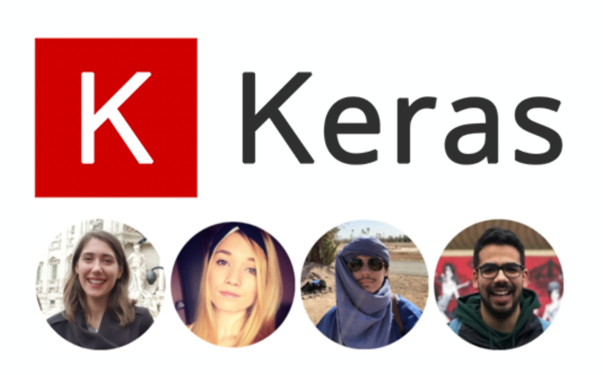

# Keras: Fast Neural Network Experimentation

## Contents

[1. Introduction](#introduction)

[2. Stakeholders](#stakeholders)

[3. Context view](#context-view)

[4. Development View](#development-view)

[5. Technical Debt](#technical-debt)

[5. Deployment View](#deployment-view)

## Introduction

Keras is an open-source library which has the aim to enable fast neural networks experimentation [9]. Among the implementations that Keras provides, there can be mentioned neural networks layers, activation functions and optimizers. 

Initially developed as part of the research effort of project ONEIROS (Open-ended Neuro-Electronic Intelligent Robot Operating System), its initial release took place on 27th of March 2015. Starting from 2017, Keras was acquired by Google’s TensorFlow team. The latest version (2.2.4) of Keras has been available since 3 October 2018 [10].

## Stakeholders

In order to determine the stakeholders of the system, we have analyzed 20 of the most commented pull requests from the Keras GitHub page [11], both merged and unmerged. This helped us identify key roles in the decision making process, as well as the main factors when it comes to reaching a decision. We will further discuss the different types of stakeholders identified in this process, categorized based on the description provided by Rozanski and Woods [1]. Moreover, we identified and presented additional stakeholders categories, relevant for Keras. 

### Acquirers

They have the responsibility of representing the commercial interests of the product or system and oversee its development [1]. Keras had its initial release on 27 March 2015 by Francois Chollet, a Google engineer. In 2017 Keras received permanent support from Google’s TensorFlow team, which made Google one of the most important acquirers. Apart from Google, the other acquire is Francois Chollet, the founder of Keras [5].

### Assessors

They have the responsibility to ensure that the system respects the standards and legal regulations [1].
Keras operates under the MIT license [12]. The copyrights of the contributions made by each entity stay theirs. No clear stakeholder with the role of assessor was identified.

### Communicators

They have the responsibility to provide a useful description of the system for the other stakeholders [1].
Any contributors who added a new feature are communicators, since they have to demonstrate its functionality and document it.
The main communicator for Keras is Francois Chollet [5], the one who gives the public the latest informations about its development. 

### Developers

They are responsible for the construction of the system [1]. For Keras, the developers are the contributors from GitHub represented by the Keras Team (Francois Chollet (@fchollet the founder of Keras), Fariz Rahman (@farizrahman4u), Taehoon Lee (@taehoonlee), Gabriel de Marmiesse (@gabrieldemarmiesse)) and the Open Source Community.

### Maintainers

Their role is to manage the evolution of the system after it has been deployed and is being operated [1]. Depending on the timeline (since acquired by Google), Keras had different teams contributing to its maintenance. The owner, Francois Chollet [5], has always been part of the maintenance cycle, but Open Source contributors and the Keras Team organization always support the cycle by making reviews of the pull requests.

### Production engineers

Their role is to provide a test environment for the newly added functionalities [1]. Furthermore, they need to manage the infrastructure of the software and the future release versions of it. Since the latter was already tackled in our identification of the system administrators stakeholders, we only focused on the first specified role. We identify Francois Chollet [5] as the production engineer, as he is in charge of defining the testing environment. 

### Suppliers

They provide the resources for the system to operate (hardware, software or infrastructure) [1]. In the case of Keras, the suppliers are represented by:

- Google [13]: Backs the development
- Microsoft [14]: Maintains CNTK backend
- Amazon AWS [15]: Maintains Keras fork with MXNet support
- Apple [16]: Provides CoreML 
- TravisCI [17]: Testing and Continuous Integration
- MkDocs [18]: Documentation generation
- GitHub [19]: Hosting 

### Support Staff

Once the system is running, the support staff have the role of offering support to the users of the system [1]. In this case, this task is done by the Open Source Community and the Keras-team through different channels (for example Google forum, GitHub, Stackoverflow, etc.).

### System administrators

Their role is to keep running the system after the deployment has been done [1]. Since Keras is an open source library, the users are the system administrators.

### Testers

The role of the testers is to assess whether the quality of the system meets the requirements for deployment and usage [1]. The tests of the system are performed by the Keras-Team, as well as by the Open Source Community. Every pull request needs tests packed with the code, according to the contribution regulations [3]. 

### Users

Their role is to assess whether the quality of the system meets the requirements for deployment and usage [1]. Since Keras is part of the Open Source software, any person interested in working on a deep learning project can use it. Additionally, users can be both industries and the research community. Some companies using Keras are, for example, Netflix, Uber or startups [2]. Keras is also used among the research community and research organizations, such as CERN and NASA [2].

### Additional Stakeholders

#### Competitors

Their aim is to provide similar systems on the market. The main competitor for Keras is Gluon from Amazon [20], which is also a deep learning interface that supports Apache MXNet and Microsoft Cognitive Toolkit. Other alternatives include Deeplearning4j, Floyd, Mocha or Apache Spark. However, Keras is leading when it comes to the number of users.

#### Enthusiasts

People who help other users and have knowledge about the product. They introduce or help others to use the product and they can be identified on Q&A websites. 

#### Media

The media is represented by articles on websites about Keras. Some examples that include Keras are "Deep learning in KNIME analytics platform" posted on [IT Portal](https://www.itproportal.com ) or "What will be the Growth of Deep Learning Software Market?" posted on [Digital Journal](http://www.digitaljournal.com). 

#### Facilitators

The facilitators aim to teach users how to use Keras in different applications. They offer courses or tutorials and benefit from the existance of Keras, thus the evolution of the library directly influences them as they need to keep their materials up to date. On [Udemy](https://www.udemy.com) there are several courses about Keras, the highest ranked ones being offered by Lazy Programmer Inc., Jose Portilla and Francesco Mosconi.

### Integrators

Integrators are persons responsible for checking the pull requests and ensuring a proper evolution of the software through the added functionalities.

In order to identify the integrators for Keras, we checked the commits to the master branch [11]. We have identified four main integrators responsible for committing the different functionalities authored by the open source community:

- Francois Chollet: @fchollet
- Fariz Rahman: @farizrahman4u
- Taehoon Lee: @taehoonlee
- Gabriel de Marmiesse: @gabrieldemarmiesse

Although they are all responsible with testing the functionalities proposed in the pull requests and making sure the code base is clean and the coding style is respected, Francois Chollet is the one always performing the final merge.

### Contacted Persons

Before starting to develop the architecture analysis of Keras, we have contacted Francois Chollet [5], the project owner, via email. We asked whether he could provide any documentation regarding the development, design and architecture processes of Keras. We contacted him based on the details we found on his GitHub account [5]. Unfortunately, we did not receive any reply from him.

When further researching the Keras documentation [6] we have identified possible means for asking questions, where the Keras team and the open source community can answer, namely the Keras Google group [7] and the Keras Slack channel [8].

### Pull Requests Theory

In the general sense, the decision regarding a pull request starts with the evaluation of the proposed functionality or improvement in the context of the product. If this evaluation does not pass, the developers simply reach the decision of not moving ahead. In case the proposed functionality makes sense, the main factors that influence the incorporation are the compliance to the defined Contributing Guidelines specified in the Keras documentation and passing the reviewing process. On the other hand, the development team decides to not merge the pull request if there is an overlap with already existing functionality or the code is not of high quality. Additionally, there are cases when the authors do not finish the change proposed in the pull request.

For the exact list of the analyzed pull requests, refer to the Appendix.

### Power-Interest grid

The power-interest grid is a graphical representation used for classifying the stakeholders [21]. The four categories presented are:

**Keep Informed** corresponds to stakeholders that are very interested in the evolution of the project. These people do not have much power on the product, but they are directly affected by its development. An example of these types of stakeholders is represented by competitors. Gluon, Amazon's library for deep learning, needs to be informed by the functionalities of Keras because it should provide the same (or better) quality of their system.

**Keep Satisfied** corresponds to stakeholders with a high amount of power on a project. These people are usually interested in the progress of the project. In our case, as we mentioned that Microsoft and Nvidia are supporting Keras, they are concerned of the success of the product. However, they do not need to be informed about all the updates that are made on Keras.

**Monitor** corresponds to stakeholders that are not very interested in the evolution of Keras and do not have power on the product. From these stakeholders, we can mention the media.

**Manage Closely** corresponds to the most important category of stakeholders. Their poor management could easily result in the failure of the product. Acquirers, Google and Francois Chollet, are the most representative stakeholders from this category due to their strong direct impact on the project.

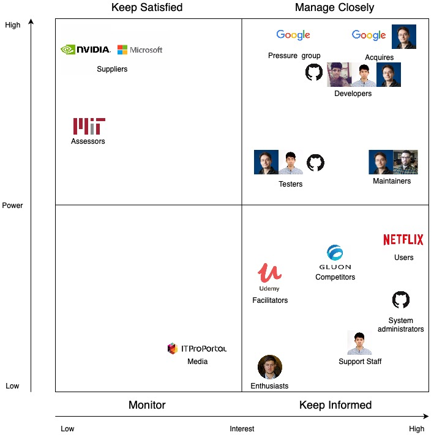

## Context View

The main purpose of the context view is to determine the connections between Keras and external entities [1]. Thus it could also be possible to identify any threats or vulnerabilities of the system from components that it is linked to.

#### System scope and responsibilities

Keras is defined as a high-level neural network API, written in Python and capable of running on top of TensorFlow, Theano and CNTK [6]. Their focus is to allow fast experimentation. 

The system allows:

1. Easy and fast prototyping
2. Running models on CPU and GPU devices
3. Support of convolutional and recurrent neural networks 
4. A way to define complex models if necessary with the **Keras Functional API** 
5. Flexilibilty between banckends to be used 

The system does not allow:

1. Provide an end to end functionality, it is an interface
2. Provide advanced and specific operations dependent on the back end to be used 

 

### Diagram

In the figure below, the context diagram is shown, capturing the relationship between the system and its environment.  We have identified ten external entities, each having different  connections with the system.

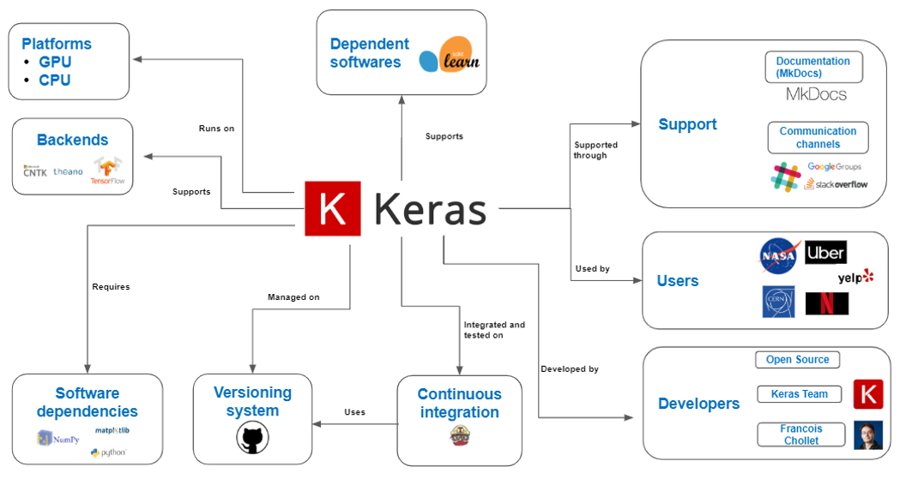

Keras is written in Python, originally by Francois Chollet. Currently, it is being developed by various entities, mainly the Keras Team organization from GitHub and the Open Source Community. It can run both on CPU and GPU and it supports Microsoft’s CNTK, Tensorflow and Theano. It is managed on GitHub and when it comes to integration and testing, Travis CI is used.

The users cover a wide range, from research organizations to industries. The support is provided mainly through the documentation, that is generated using MKDocs, or through several communication channels, namely Slack, Google Groups or StackOverflow. Concerning dependencies, we have identified both dependent software, supported by Keras (Scikit-learn),  as well as software dependencies that Keras requires (Python, NumPy, matplotlib). 

## Development View

The development view of a system describes the architecture that supports the development process [1]. In this section we will describe the various aspects composing the overall process.

### Module Structure

The Module Structure for Keras is visualized in the figure below. 

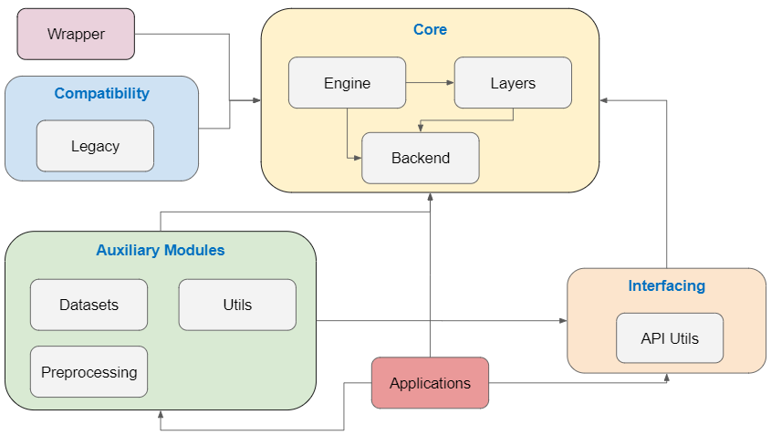

The modules visualized in the figure above have the following functionalities:

- **Core**: Includes the main components that implement the essential functionalities for defining Deep Learning model architectures. These include the definition of different types of layers, the definition of the topology of the networks and the possible backends for executing the generated models.

- **Auxiliary Modules**: Provide additional functionalities to complement the implementation of the Deep Learning models. These include preprocessing components for both the data (such as image rotations or shifts) and the models created through the Core module (such as normalizing, counting the number of parameters or printing the summary of the architecture). Moreover, several datasets are provided (for example, CIFAR-10 or MNIST).

- **Wrapper**: Provides a wrapper for scikit-learn [22].

- **Compatibility**: Provides support for previous versions of Keras.

- **Applications**: Provide implementations of well-known architectures of pretrained models, such as VGG16 or Inception_v3. 

- **Interfacing**: Provides an API to the Core functionalities.

  

### Codeline Organization

#### Source Code Structure

The structure of the source code for Keras is summarized in the figure below.

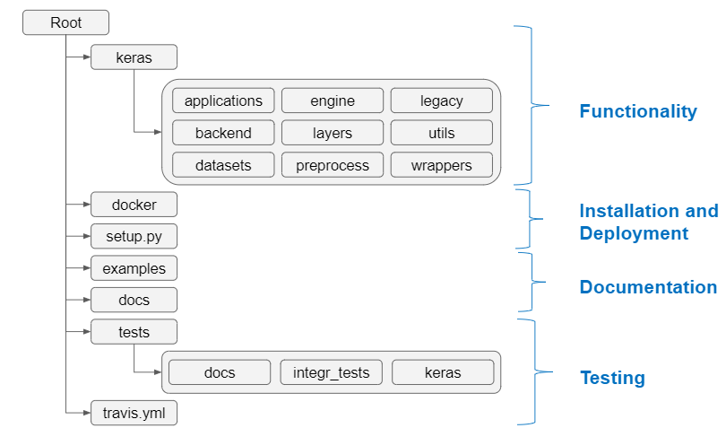

We have identified a logical structure of the Keras code in four different components: 

- Functionality 
- Installation and deployment
- Documentation
- Testing

The **Functionality** component contains the code that provides the core functionality for the product. It focuses on implementing the architectural components of a Deep Learning model, it provides wrappers for other platforms and ensures the integration with several backends.

The **Installation and Deployment** component contains the necessary scripts and configurations to perform releases and installations. 

The **Documenation** component contains the files necessary for generating the documentation of Keras. It is based on two directories, namely `docs` and `examples`. `Docs` contains the code for generating the documentation visible on the Keras website, whereas `examples` includes examples of using Keras.

The **Testing** component includes scripts that are responsible for testing the functionality of each individual component in the Keras directory and the configuration of the continuous integration platform for performing the autonomous tests through TravisCI.

#### Build, Integration, and Test Approach

The approach Keras uses for integrating new functionalities into the product is described in the contribution policies on their GitHub repository [11]. Any person interested in creating a pull request should write a design document for motivating the proposed functionality. After the functionality is approved, the code can be written and accompanied by proper docstrings. Moreover, the tests have to be defined and run locally on all the supported backends before finalizing the pull request.

After the pull request is made, the automated tests are run in the continuous integration platform, TravisCI [17], and checked by a person that Francois Chollet [5], the project owner, assigns. If everything runs correctly, then the PR is merged by Team Keras and tests are run again through the continuous integration platform.

It is important to mention that the configuration for the automated tests run through TravisCI is included in the GitHub repository of Keras [11], more specifically in the `travis.yml` file.

This process can be visualized in the figure below, for the Pull Request #12500 (“Revise ‘logsumexp’ in np backend and reduce those redundant tests”).

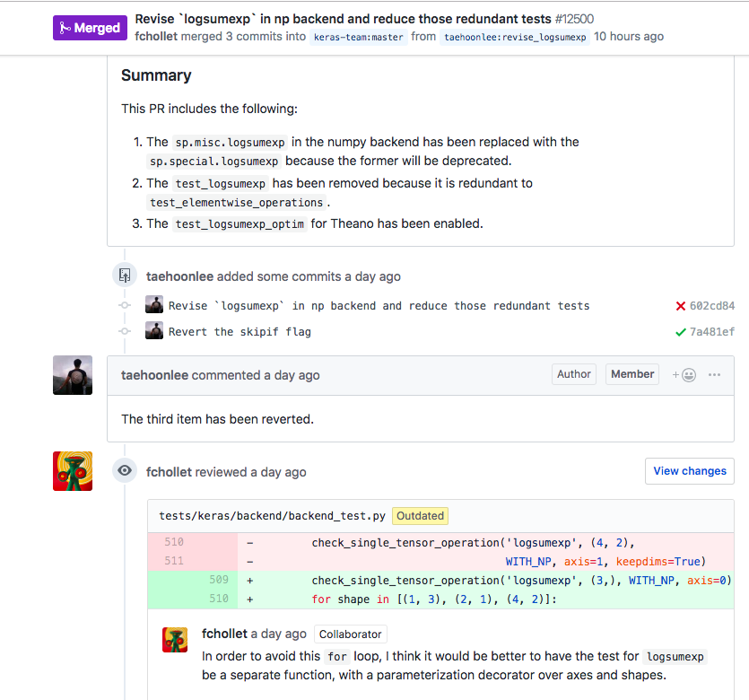

#### Release Process

Through our analysis, we identified that a first step in the release process is preparing the release, as the procedure is not automated. The preparation includes changing the Keras version and the download URL for accessing the latest available version.

Moreover, we identified two types of releases, depending on the size of the changes they make:

- Periodic releases: they happen approximately every month and they focus on issues such as bug fixes, API changes, performance or documentation improvements.
- Major releases: they happen when significant, long time changes are made, that affect the overall functionality and structure of the projects. These include, for example, adding completely new functionalities, major changes to existing functionalities or version changes.

The releases are performed and documented [23] by the owner of the project, Francois Chollet [5].

### Common Processing Elements

- __Initialization__: each package of Keras contains an `__init__. py` file in which there are imported all the packages needed by that specific module.  This is done in order to avoid importing the same package in multiple files [3].
- __Logging__: the logging is done inside the Utils module by using `print_function` from `__future__` module. It makes use of the print function to display messages on the console [3].
- __Internationalization__: this element is not that obvious in Keras. All user and administrator visible strings are hard-coded in the source code. Moreover, they provide translated documentation in three major Asian languages: Japanese, Chinese and Korean [3].
- __Third party libraries__: Keras relies mostly on its own libraries. However, they also use some core libraries, such as *numpy* and they defined a wrapper for *Scikit-Learn* [3]. 
- __Configuration parameters__: at startup, the configuration is done locally by assigning values for some global variables. E.g. `_FLOATX = 'float32'`, which specifies the type of float to use throughout the session. Furthermore, Keras uses the file `savings.py` for saving and loading the configuration of the models [3].

### Instrumentation Analysis

Instrumentation is the act of inserting code for logging information about the current state of the system and the usage of resources [1]. It is used to monitor while debugging.

Keras does not have clear instrumentation. They make use of the `print_function` and `warning` module in order to display messages via the console. A powerful tool for including instrumentation is __Lantz__ [24], a toolkit for automation and instrumentation in Python.

### Standardization of Design

Keras provides for potential contributors a set of guidelines to follow [1]. These guidelines are specified in `CONTRIBUTING.md`. Moreover, they provide templates for standardized writing of issues and pull requests in `PULL_REQUEST_TEMPLATE.md` and `ISSUE_TEMPLATE.md`. 

### Code Conventions

There are two subcategories of PRs: improvements & bug-fixes and adding experimental features. The former category goes to the Keras __core__ master branch, while the later goes to __keras-contrib__, unless the feature was requested [3].

In order to submit the changed code, the developer must fork the repository and make the changes on a feature branch.

Guidelines:

- Respect the Google docstring style and there should be sections for _Arguments_, _Returns_ and _Raises_;
- Provide unit tests;
- Run the test suite of Keras;
- Respect PEP8 (add link) syntax conventions;
- Update the documentation if adding new functionality.

### Standardization of Testing

Keras team developed a set of tests for all the files inside the modules. All the testing files reside inside the tests directory and have the following name conventions: either `test_filename.py` or `filename_test.py`.

Apart from the regular test set, Keras also provides an integration test set, which verifies how well different modules interact with each other.

The command `py.test tests/` is used to run the test suite locally and `py.test --pep8 -m pep8` is used for checking the syntax conventions [3].

Some of the PEP8 errors can be __automatically__ fixed by running `autopep8 -i --select <errors> <FILENAME>`.

## Technical Debt

### Identifying Technical Debt

We chose to analyze the `engine` module due to its increased complexity and given that all the major functionalities of Keras are relying on it.

We used SonarQube [25] in order to determine the quality of the code on the Keras repository. The results can be visualized in the image below.

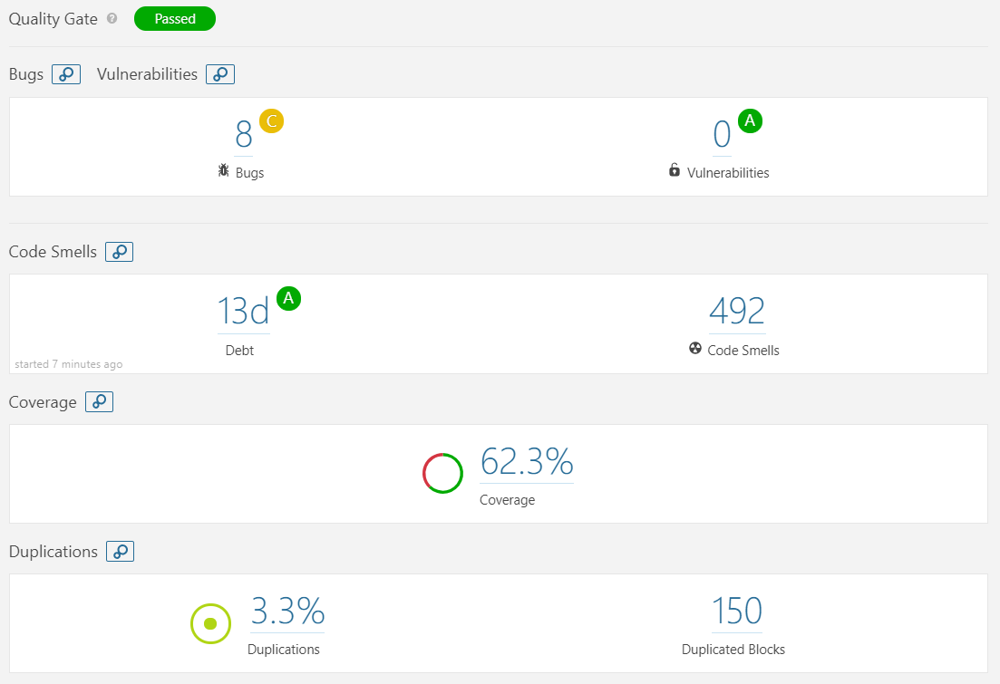

- **Bugs** analysis:

This issue refers to programming errors that can lead to business disruption [26]. From SonarQube we can observe that Keras has 8 bugs. On closer analysis of the code, 2 bugs are not influencing the quality of the code. They have been reported as unnecessary operations. The other 6 bugs are focused on the documentation.

- **Vulnerability** analysis:

This issue refers to flaws in the programs that can lead to the usage of the application in a different way that it has been designed for [26]. No vulnerability was detected in the Keras code.

- **Code smells** analysis: 

This analysis focuses on the maintainability issues, which is directly correlated to the ability, the cost and the time to make changes over time in the code base [26]. 

We can observe that the debt is 13 days. Considering the complexity and size of the Keras project, we consider this to be a good result. This is also observed from the `A` maintainability rating associated to it, which means that the technical debt ratio is less than 5%.

When it comes to the code smells, 492 are identified. These are grouped in three severity levels: critical (22.15%), major (47.15%) and minor (30.7%). Regarding the critical code smells, all of them propose refactoring certain functionalities for reducing the cognitive complexity. These refer to modules that are not directly involved in the core functionality of Keras, such as `docs`, `legacy` and `examples`, as well as more central modules, namely `backend`, `engine` , `layers`  and `utils`. Concerning the major code smells, they mostly refer to merging `if` statements with the enclosing ones, removing code that is commented out, pointing out functions with too many parameters or renaming functions. They refer to all the module in the Keras repository. Finally, the minor code smells are present in most of the modules as well and they are concerned with renaming classes or parameters or removing unused variables.

- **Duplication** analysis:

The overall percentage of duplication of Keras is 3.3%. However, most of the duplications can be found in the tests and examples modules. On closer analysis of the example modules, most of the duplicated lines are preprocessing techniques or parameters initializations, which are required operations. When it comes to the `test` module, most of the duplicated lines have the purpose of building a neural network, which is a necessary operation. 

#### SOLID Violations

##### The Single Responsibility Principle (SRP): 

We believe that this principle is mostly violated in `keras/keras/engine/network.py` by the class `Network`. This class models a neural network as a directed acyclic graph of layers for which the following functionalities were identified [27]:

- Retrieval the updates and the losses of the model; 
- Calling the model on new inputs;
- Computing output tensors for new inputs;
- Saving layers/weights to files;
- Deserializing layers/weights from files.

The class consists of 1100 lines, 33 methods and many of them have a cognitive complexity above 30. Its extended functionality has the consequence of higher coupling.
Decoupling such a large class may be a solution, but, given the complexity of neural networks architecture, this may lead to dependency issues.

##### The Open-Closed Principle (OCP):

A clear example of a violation for this principle is in `keras/keras/engine/saving.py`. The file reunites all the utilities for saving a model and is not even organized as a class. Hence, for the scenario of adding a feature for saving on a new file format, the developer must modify the source code, while not having a possibility of extending it.
As a solution, we considered refactoring the file as an interface. In this way, adding a new file format for saving would only imply creating a new child class. Thus, classes like `Network`, which uses saving functionalities, remain closed for modification and the interface stays open for extension [27].
Our **proposed improvement** is shown in the image below.

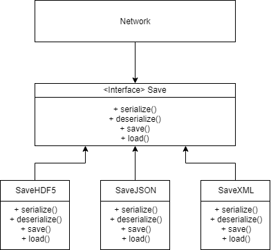

##### Liskov Substitution Principle (LSP):

Since the engine module of Keras is composed of a few classes, there are not many chances of violation for LSP. The inheritance tree is:

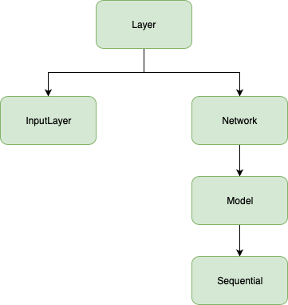

Each child class comes as an addition to the parent class and they mostly override methods for showing the configuration of the system. There were no casts found in the code, hence we believe that LSP is not violated.

##### The Interface Segregation Principle (ISP):

Keras uses a legacy interface which contains converters for Keras 1 support in Keras 2. The interface is composed of 15 functions and expands on over 600 lines of code. This interface is used almost in every class from engine module, hence a change in it would require changes in the other classes. We believe that this violates ISP.

##### The Dependency Inversion Principle (DIP):

As can be observed from the inheritance tree, DIP is violated because the inheritance is done directly from the parent class and not through an interface for that respective class.

#### Discussions about Technical Debt

The developers of Keras communicate not only through git issues, but also through code comments (i.e. TODO). In order to better observe all these comments we used the command `git grep 'TODO' -- '*.py'` [28]. There are 21 TODOs. Some contain the developer assigned to solve them or the issue that they are addressing. Some examples include:

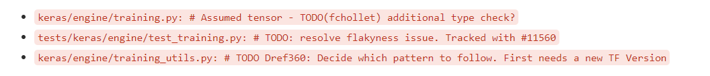

Most of them either are about removing certain pieces of code or pointing to issues.

### Identifying Testing Debt

#### Discussion of code coverage

The overall coverage of the `keras` module in the repository is 56%. The coverage per component is visualized in the figure below.

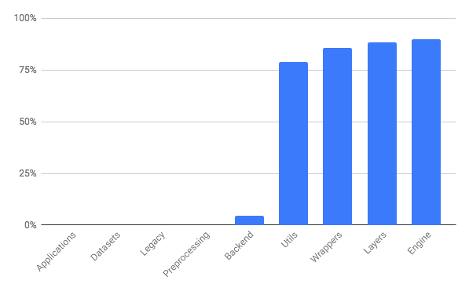

As we can observe, there is no coverage for: `applications`, `datasets`, `legacy` and `preprocessing`. Given the focus of Keras, we consider it reasonable that the `applications`, `preprocessing` and `datasets` modules do not have test coverage, as the first two reside in a different repository and the latter only facilitates access to data. However, when it comes to `legacy` we think that tests should be performed, since it ensures backwards compatibility.

Additionally, we observe very little test coverage when it comes to the `backend` component, which is a sensible decision since each backend is provided by third party entities, responsible of testing their functionalities.

Regarding the remaining components, the test coverage is higher, more specifically above 79%.

Overall, in our opinion the project is well-covered when it comes to testing, except for `legacy` , which we think should be tested.

#### Discussion of testing procedure

Through additional analysis we have observed that Keras is tested using two procedures:

- Unit tests
- Integration tests

The coverage regarding the unit tests was already presented above. Concerning integration tests, these cover some of the modules omitted during the unit testing, more specifically `applications`, `datasets` and `preprocessing`. These are not included in the coverage analysis, since these modules are part of external projects and libraries.

Additionally, we have a remark. We have identified that each functionality of Keras depends on the backends. This fact results in partial testing, as, depending on the backend, some of the tests are skipped. This might affect the maintainability of the testing procedure.  A code snippet with such an example can be seen below.

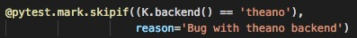

## Deployment view

The main goal of this view is to define the physical environment in which the system is intended to run [1]. The case of Keras brings a broad set of possibilities because it is a front-end that facilitates the construction of Deep Learning models. Thus, we will look at two standard deployment architectures. 

### Dependencies

In order to install the latest version of Keras the following requirements need to be satisfied [6]:

- Python version should be 2.7-3.6
- Numpy Python library (>=1.9.1)
- Scipy Python library (>=0.14)
- Six Python library (>=1.9.0)
- Pyyaml
- H5py
- keras_application (==1.0.4)
- keras_preprocessing (1.0.2)

Keras installation can be realized by using the package installer available in Python (pip). The command for installing Keras is:
`pip install Keras`
This command automatically installs the required packages listed above. 

### Technology Compatibility

Before installing Keras, one of the three supported backends needs to be installed: Tensorflow, Theano, CNTK. However, team Keras recommends installing Tensorflow [6].

Depending on the application that needs to be developed, there are some additional optional requirements:

- cuDNN - this is recommended if the applications require running Keras on GPU
- HDF5 - this is recommended if the application requires running Keras models to disk
- graphviz and pydot - this is recommended for visualization purposes 

Additionally, each of the backends has its own technical functional requirements [12], [13], [14], which we will summarize in the table below:

<table>
    <tbody>
        <tr>
            <th>Resource</th>
            <th>TensorFlow</th>
            <th>Theano</th>
            <th>CNTK</th>
        </tr>
        <tr>
            <th>Operating Systems</th>
            <td>
                <ul>
                    <li>Ubuntu 16.04 or later</li>
                    <li>Windows 7 or latermacOS 10.12.6 (Sierra) or later</li>
                    <li>Raspbian 9.0 or later</li>
                </ul>
            </td>
            <td>
                <ul>
                    <li>Linux (e.g. Ubuntu, CentOS6)</li>
                    <li>Windows</li>
                    <li>macOS</li>
                </ul>
            </td>
            <td>
                <ul>
                    <li>Windows (8.1 Pro, 10, Server2012 R2 Standard and later)</li>
                    <li>Linux (Ubuntu 16.04 LTS)</li>
                </ul>
            </td>
        </tr>
        <tr>
            <th>Compilers</th>
            <td>GCC 4.8</td>
            <td>g++ >=4.2</td>
            <td>Visual Studio Enterprise 2017</td>
        </tr>
    </tbody>
</table>

### Hardware Requirements

Any Keras deployment relies on the following requirements of hardware:

<table>
  <tbody>
    <tr>
      <th>Resource</th>
      <th>Specification</th>
    </tr>
    <tr>
      <th>Processing</th>
      <td>As part of the configurations needed, there can be the following types of processing:
        <ul>
          <li>CPU
            <ul>
                <li>4th, 5th, 6th, 7th, and 8th generation Intel(R) Core(TM) processor</li>
                <li>Intel Xeon processor E5 v4 and v3 family</li>
                <li>Intel Xeon Phi processor x205 product family (formerly Knights Mill)</li>
                <li>Intel Atom(R) processor with Intel SSE4.1 support</li>
            </ul>
          </li>
          <li>GPU:
            <ul>
                <li>NVIDIA (CUDA or cuDNN)</li>
                <li>OpenCL-enabled GPUs</li>
            </ul>
          </li>
          <li>Google TPUs: This applies only for the TensorFlow backend</li>
        </ul>
      </td>
    </tr>
    <tr>
      <th>Memory and disk</th>
      <td>Depends entirely on the Neural Network to be trained</td>
    </tr>
    <tr>
      <th>Optional</th>
      <td>Apache Spark clusters and Apache MLLib in the case that distributed training is necessary</td>
    </tr>
  </tbody>
</table>

#### Frontend platform models

##### Multi-GPU supported by TensorFlow backend:

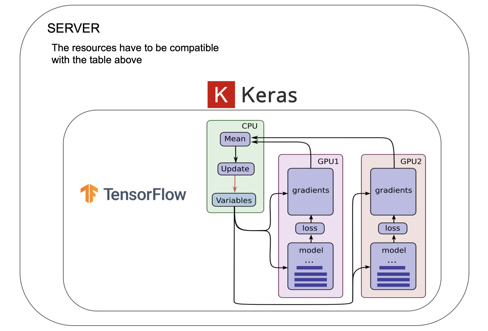

In this case, Keras replicates a model and is executed on a dedicated GPU. The concatenation of the results is done on CPU into one big batch, returning a model fully trained at the end.

##### Distributed:

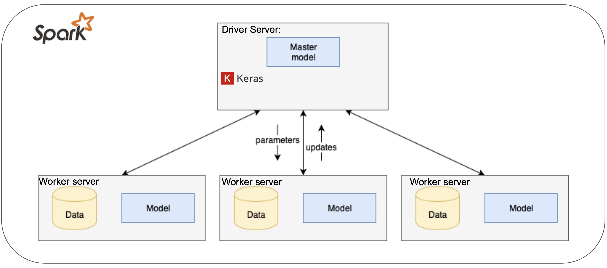

Elephas implements a class of data-parallel algorithms on top of Keras, using Spark’s RDDs and data frames. Keras Models are initialized on the driver, then serialized and shipped to workers (this is because Apache Spark is built on Scala), alongside with data and broadcasted model parameters. Spark workers deserialize the model, train their piece of data and send their gradients back to the driver.

### Historical Analysis

We created a summary of the historical evolution of Keras, presented in the table below, by analyzing the release notes for each new version release on the GitHub page [23]. We did not include each single version release, but we aggregated them in larger version releases (i.e. we aggregated versions 2.2.0, 2.2.1, 2.2.2, 2.2.3, 2.2.4 in version 2.2).

<table>
    <tbody>
        <tr>
            <th>Keras Version</th>
            <th>Changes</th>
            <th>Release period</th>
        </tr>
        <tr>
            <td>0.1</td>
            <td>Preparations for Pypi release and Pypi release</td>
            <td>June 2015 - August 2015</td>
        </tr>
        <tr>
            <td>0.2</td>
            <td>New Pypi release</td>
            <td>October 2015</td>
        </tr>
        <tr>
            <td>0.3</td>
            <td>
                <ul>
                    <li>Modular Backends Introduction</li>
                    <li>New Pypi release</li>
                </ul>
            </td>
            <td>December 2015 - March 2016</td>
        </tr>
        <tr>
            <td>1.0</td>
            <td>
                <ul>
                    <li>Bug fixes and improvements on functionalities</li>
                    <li>New Pypi release</li>
                </ul>
            </td>
            <td>April 2016 - August 2016</td>
        </tr>
        <tr>
            <td>1.1</td>
            <td>New Pypi release</td>
            <td>October 2016 - November 2016</td>
        </tr>
        <tr>
            <td>1.2</td>
            <td>New Pypi release</td>
            <td>December 2016 - February 2017</td>
        </tr>
        <tr>
            <td>2.0</td>
            <td>
                <ul>
                    <li>API changes</li>
                    <li>Deprecated layers removal (both convolutional layers and recurrent layers)</li>
                    <li>New layers compatibilities</li>
                    <li>Variable name changes</li>
                    <li>Bug fixes and functionality improvements</li>
                    <li>Documentation improvements</li>
                    <li>CNTK backend addition</li>
                    <li>TensorBoard improvements</li>
                    <li>Coding style improvement</li>
                    <li>New features addition</li>
                    <li>Test coverage improvements</li>
                    <li>Incompatibilities solutions</li>
                    <li>Performances improvements</li>
                    <li>New Pypi release</li>
                </ul>
            </td>
            <td>May 2017- November 2017</td>
        </tr>
        <tr>
            <td>2.1</td>
            <td>
                <ul>
                    <li>New APIs</li>
                    <li>Improvements to unit tests/CI.API</li>
                    <li>Performance and usability improvements</li>
                    <li>New models added in the ‘applications’ module</li>
                    <li>Improvements to example scripts</li>
                    <li>Documentation improvements</li>
                    <li>Bug fixes</li>
                </ul>
            </td>
            <td>November 2017 - April 2018</td>
        </tr>
        <tr>
            <td>2.2</td>
            <td>
                <ul>
                    <li>Large refactors improving code structure and test time</li>
                    <li>Improvements to the documentation</li>
                    <li>API changes and improvements regarding usability</li>
                    <li>Performance improvements</li>
                    <li>Bug fixes</li>
                </ul>
            </td>
            <td>June 2018 - October 2018</td>
        </tr>
    </tbody>
</table>

## Conclusions

 In conclusion, Keras is very well structured and maintained software. We identified the most important stakeholder, Francois Chollet, which is in charge of establishing a clear plan of the project’s development. Each pull request is closely analysed and tested in order to ensure good functionality. Furthermore, considering the modular nature of Keras, an extension can be easily performed.

In addition, from a code organization point of view, Keras’ architecture is composed of various modules, each of them performing a different functionality. All of them are centred over a core module, the engine module, which is practically controlling the workflow. We consider that the fact that the modules’ task does not overlap gives us an insight into the high performance of the software.

However, from the technical debt analysis, we observed that Keras also has some SOLID validation. As observed, these do not affect the project’s functionality, but they might affect further expansion. Furthermore, we also believe that the legacy module should be provided with test coverage as it contains the main deep learning components.

## References

1. Rozanski, N., & Woods, E. (2012). Software systems architecture: working with stakeholders using viewpoints and perspectives. Addison-Wesley.
2. Why use Keras: https://keras.io/why-use-keras/
3. Contribution guidelines of Keras:  https://keras.io/contributing/
4. Robert C. Martin (2008). Clean Code.
5. Francois Chollet GitHub Profile: https://github.com/fchollet]
6. Keras Documentation: http://keras.io
7. Keras Google Group: https://groups.google.com/forum/#!forum/keras-users
8. Keras Slack Channel: https://kerasteam.slack.com/
9. Keras Website: <https://keras.io/>
10. Keras Wikipedia: <https://en.wikipedia.org/wiki/Keras>
11. Keras Github page: <https://github.com/keras-team/keras>
12. MIT License Keras: <https://github.com/keras-team/keras/blob/master/LICENSE>
13. Google Tensorflow: https://www.tensorflow.org/  
14. Microsoft CNTK: https://docs.microsoft.com/en-us/cognitive-toolkit/
15. MXNet Support Amazon: https://aws.amazon.com/mxnet/ 
16. Apple CoreML: https://developer.apple.com/documentation/coreml
17. TravisCI: https://travis-ci.org/
18. MkDocs: https://www.mkdocs.org/
19. Github: https://github.com/
20. Amazon Gluon: <https://aws.amazon.com/blogs/aws/introducing-gluon-a-new-library-for-machine-learning-from-aws-and-microsoft/>
21. Power Interest grid: <https://www.mindtools.com/pages/article/newPPM_07.htm>
22. Scikit-learn: https://scikit-learn.org/stable/
23. Keras Releases: https://github.com/keras-team/keras/releases
24. Lantz:<https://github.com/LabPy/lantz> 
25. SonarQube: https://www.sonarqube.org/
26. SonarSource:  https://www.sonarsource.com/why-us/code-quality/
27. Robert C. Martin (2008). Clean Code.
28. Linux Command: https://www.cyberciti.biz/faq/howto-use-grep-command-in-linux-unix/

## Appendix

The pull requests that we analyzed are the following:

| Pull Request Number | Pull Request Title                                           | Status   |
| ------------------- | ------------------------------------------------------------ | -------- |
| #244                | Introduce time-masking to recurrent layers                   | Merged   |
| #1623               | Convolutional layers for 3D                                  | Merged   |
| #10047              | MobileNetV2 keras implementation for imagenet weights for Tensorflow backend | Merged   |
| #2152               | Keras 1.0 preview                                            | Merged   |
| #9253               | Add support for stateful metrics.                            | Merged   |
| #6891               | Fix the ordering bugs when using pickle_safe=True            | Merged   |
| #2523               | Faster LSTM                                                  | Merged   |
| #893                | Lambda Layer                                                 | Merged   |
| #2413               | Support for masking in merged layers                         | Merged   |
| #7980               | Recurrent Attention API: Support constants in RNN            | Merged   |
| #6928               | Input Tensors: High Performance Large Datasets via TFRecords | Unmerged |
| #9965               | Change BN layer to use moving mean/var if frozen             | Unmerged |
| #928                | Siamese layer                                                | Unmerged |
| #442                | Caffe models support                                         | Unmerged |
| #4621               | Linear Chain CRF layer and a text chunking example           | Unmerged |
| #3170               | Potential New Feature: Hierarchical Softmax                  | Unmerged |
| #2183               | LSTM with Batch Normalization                                | Unmerged |
| #1282               | Bidirectional RNN                                            | Unmerged |
| #368                | Caffe support by pranv                                       | Unmerged |
| #718                | 3D CNN layers with an example                                | Unmerged |