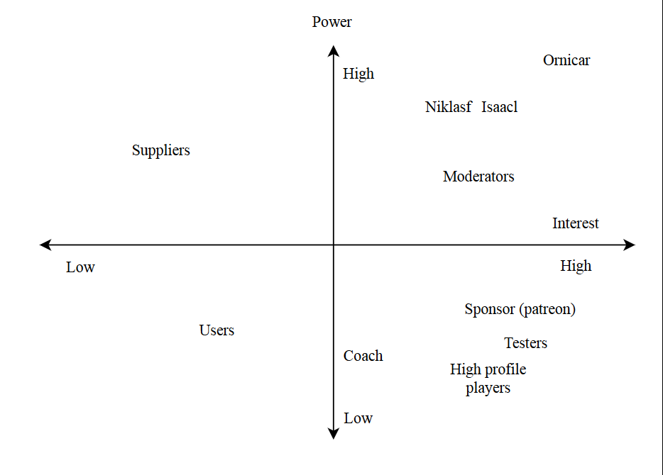
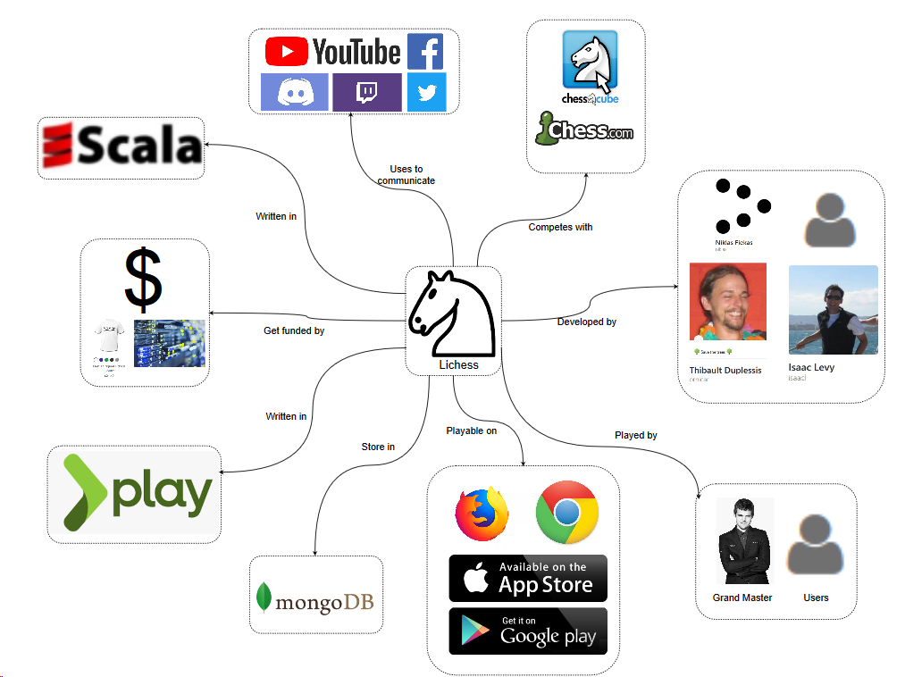
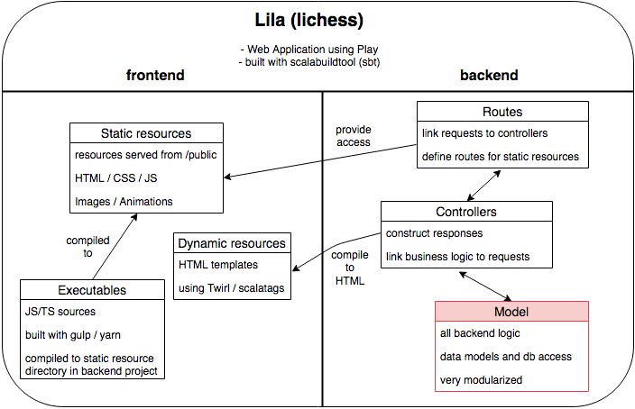
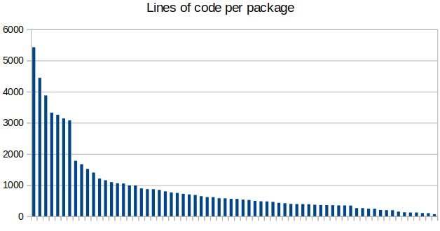
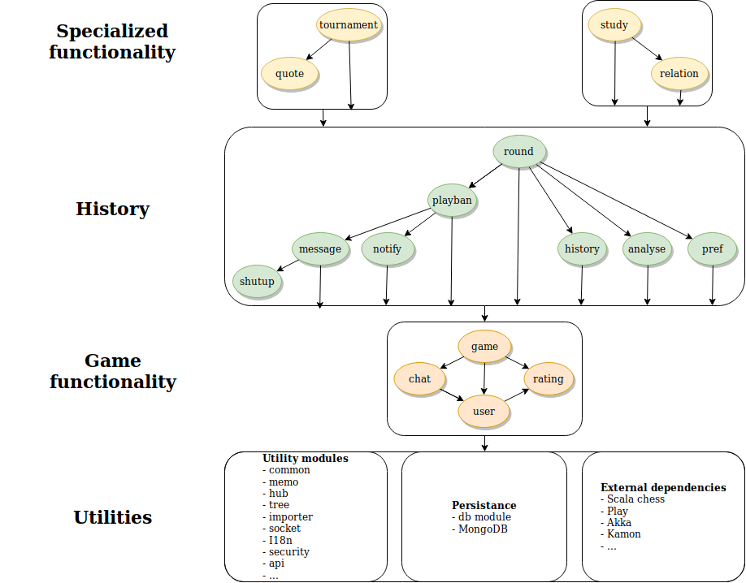
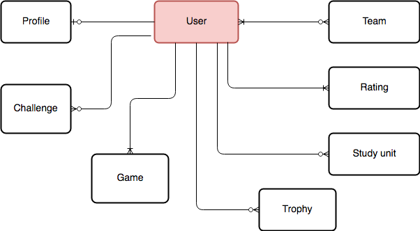
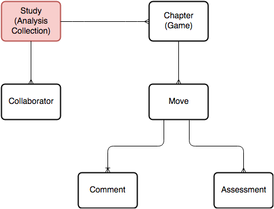
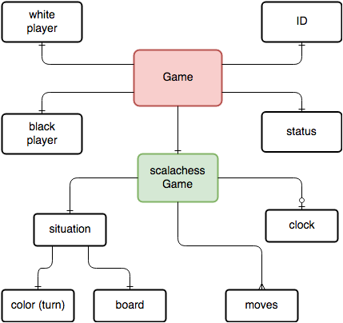
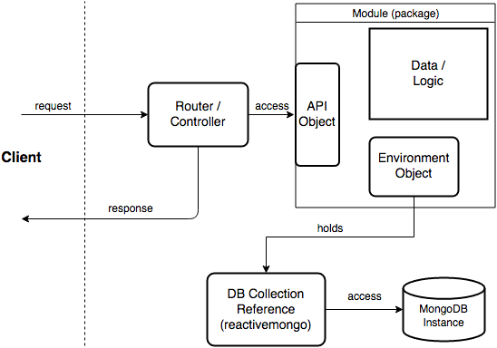

# Lila (lichess.org)

## Introduction

Lila is the open-source code behind the libre, no-ad chess website lichess.org. The name is a playful combination of Li(chess in Sca)la, given the backend code is written in Scala. The philosophy of the project is nicely summed up in the project's maintainer's github profile description: "Benevolent dictator of lichess.org, a hippie communist chess server for drug fueled atheists." [^ornicar]. The site is a major player in the online chess world with more than one million games played every day [^lichess-about].

## Stakeholder Analysis

As the lichess project is open-source with a rather small group of core contributors some of the stakeholder types identified by Rozanski and Woods are not fully applicable [^rozanski]. Specifically we don't have aquirers since lichess is open and free. We identified some new roles not covered in the book and changed some roles slightly (see the stakeholder subsection).  

### Github activity

Our stakeholder and decision making analysis is based to a great extent on the github project. Specifically we selected the most discussed pull requests, 10 that were rejected, 10 that were merged (a list can be found in the appendix). We also looked at contributions in general over the lifetime of the project.

### Stakeholders

There are three main **developers**, of which the number of commits are shown above. Ornicar is by far the most active [^ornicar]. He has started Lichess and remains the main developer. Over time, several other developers have helped him. Originally, Clarkerubber and Unihedro were his main cocontributers, but since 2015 the only other constantly active developers were Niklasf and Isaacl [^niklasf],[^isaacl].

| Developer | Commits total | Commits 2018 |
|-----------|---------------|--------------|
| Ornicar   | 25922         | 2146         |
| Niklasf   | 935           | 309          |
| Isaacl    | 478           | 71           |

There is a group of **moderators** including more than twenty users on the website who help moderate the forum and enforce rules. 
They perform various moderating tasks such as forum management and the banning of cheating or misbehaving players. There are only 9 people who open issues and while forum names and github names don't always correspond, it seems that the moderators are also the ones posting issues on github, which means they are also **testers** of the system. As the forum is the main communication channel moderators are all **communicators** and as it is the place for users to ask questions, they also fulfill the **support** role.

Ornicar seems to be the person responsible for deployment and adminstration of the servers, thus serving as **production engineer** and **system administrator**. He is also the main **integrator** and his roles as production engineer and system administrator shine through in this role, as he often comments on performance when merging pull requests and even rejects pull requests if the performance is lacking [^pr-rejected-perf]. The other integrator is Niklasf. Most often both comment on a pull request before it is merged. While Isaacl regularly contributes to the discussion, he has to ask Ornicar or Niklasf to merge.

Lichess has a yearly running cost of $102,792.3, which is entirely covered by donations from **sponsors**. This money mostly comes from monthly donations from Patreon supporters and from a webshop. The Patreon supporters do not have any special status within Lichess, but Lichess is very much dependent on them. The only commercial parties that Lichess seems to have relations to are the various servers where Lichess is hosted, making them the only **suppliers**. The way the hosts are talked about in the "thank you" section on the website seems to imply that Ornicar is on good terms with the hosts and possibly enjoys significant discounts. This means they might be a combination of sponsor and supplier.

Most of the **users** are from Germany, Canada, USA, Russia and the UK [^alexa]. These users don’t have to pay or even watch ads to play on the website as it is completely free. What Lichess do get from their users are donations and developers [^lichess-patreon], which it heavily depends upon. Secondly, next to the casual gamers you have people who like to improve their skills using Lichess. These people can get their games analysed and can even get a coach via Lichess. 
Thus, the website is used by all sorts of users of different skill levels. The users of all different levels are therefore crucial for the existence of Lichess. Almost all other stakeholders are also part of this large, diverse group. For example, the **sponsors** are all users, the **moderators** are recruited amongst the users, experienced users **support** each other through the forum and they also function as **communicators**.

We estimate the different degrees of power and interests different stakeholders have in the following diagram.

### Decision making process of merging pull requests

The Lila project does not have written guidelines for merging pull requests.
Most declined
pull requests (that is, a pull request that did not get merged),were lacking in
quality, completeness or generally not needed (e.g [^rejected1],[^rejected2]).

Interviewing some active developers (revoof and Toadofsky) on Lila's discord channel
gives us some insight in what developers and mainteners look for:

- "Ultimately it's up to the maintainers to merge Pull Requests."
- "The things I look for during reviewing or merging are: coding style, things 
it could potentially break and verify that it doesn't break these things and 
as far as features are concerned I ask myself the question if the feature is
worth the complexity and cost of maintenance down the line."

When asked if the project could benefit from having a set of guidelines and a
process that is well documented. The developers react rather lukewarm:

- "Probably not, to be honest. That sounds very rigid. I feel it's more important
to review code and give feedback in a timely manner". 
- "Lichess is probably not the best project for developers who are just starting
out"

## Context View

### Responsibilities

Lichess primarily offers a platform for people to play online chess. It has extensive matchmaking and ranking of players, as well as offering many different play modes (including learning games). This website is not only for everyday users, also Carl Magnussen amongst other grand masters use lichess to play chess online [^magnus].

Lichess has mobile apps (iOS, Android) and a web version.
The browsers that are supported are the desktop versions of Mozilla Firefox and Google Chrome. On Opera, Safari and Internet Explorer or Edge you are able to play as well, however these are unsupported and can therefore have performance issues. 

### External Entities

In order to communicate with their users and provide content Lichess uses different platforms. They use Twitter, Facebook, Twitch, Discord, Youtube and they even have a forum on their own website. As mentioned in the stakeholder view, Lichess gets donations and sells merchandise to keep the website running.
When the users want to report bugs are feature request, they can do this in the forum or directly on Github. 
Lichess competes with other platforms such as chess.com or chess cube, which differ slighly through more paid content.

## Development View

Due to space constraints for the following analysis of the development view and technical debt we focus on the backend code of the project, which is written in Scala 2.11.

### Dependencies

The [Play Framework 2.4](https://www.playframework.com/documentation/2.4.x/Home) is used to provide the typical web application backend infrastructure and [MongoDB](https://www.mongodb.com/) is used for persistance.
Other major dependencies are:

- [scalachess](https://github.com/ornicar/scalachess) (game logic, also developed by ornicar)
- [akka actors](https://akka.io/) (concurrent message passing)
- [kamon](https://kamon.io/) (monitoring)

### General architecture

The backend logic is structured in 69 modules, totalling around 59k lines of code. 
Server-side rendering is used to serve the web pages to the users, the Play framework has its own templating engine twirl for this purpose. 
The frontend executables are developed in a separate subproject, which are copied to the appropriate resource folders in the build process. A mix of typescript and javascript is used without a big frontend framework. An overview of this very high-level architecture is depicted in the following figure.

The Play framework provides the infrastructure for routing and handling of HTTP requests including error responses in a typical MVC (Model-View-Controller) project layout. Lila follows the standard structure, defining all routes in a route configuration file, controllers to handle requests and the business logic in many separate modules. Views are server-side rendered by the use of twirl templates. Overall it seems like the project is not tied to the Play framework alot, but the heavy use of twirl templates would make a switch hard. A plan to migrate to another more lightweight template libary [scalatags](http://www.lihaoyi.com/scalatags/) is planned, but only very few parts have been migrated.

In the following we focus just on the Model which is the heart of any project, here all the business logic specific to Lila resides.

### Modularization

With 69 modules the logic is very modularized and separated roughly according to functionality. There are 59 000 lines of code in total, distributed amongst packages as seen in the following figure:

The first six modules break the curve with significantly more lines of code than the others. These bigger and presumably more important modules are listed below:

- tournament (47 files, 5.4k loc)
- study (38 files, 4.4k loc)
- game (45 files, 3.9k loc)
- common (52 files, 3.3k loc)
- security (36 files, 3.3k loc)
- user (31 files, 3.1k loc)

Mostly these correspond to the major features offered by lichess, with the common and security module offering more general services.
In the module dependency figure below we can see how there are quite a few general purpose modules that are depended on throughout the project's codebase.
Our diagram depicts the general direction of dependencies from the general purpose modules within lila at the top to the external dependencies and utility modules at the bottom. The modules that have arrows going to the bottom of their block depend on modules in the block directly below it or further down.

At the core of the codebase is the game module which is depended on by much of the codebase. 
It offers the logic needed for the playing of a chess game, the major functionality of the lichess website (for this it heavily depends on the scalachess library). 
All troughout the codebase the utility modules such as common, security and api are used.
A critical component is found in the db module which centralizes database access functionality using the [reactive mongo](http://reactivemongo.org/) library.

Higher-level functionality such as messaging, notifications and analysis per chess game are organized around the round module. This layer facilitates working with mutliple games of chess. It includes history and analysis modules, as well as playban, which checks whether a player is allowed to play the next round. This could still be considered part of the core as it provides all the functionality needed that revolves around the playing of a single chess game.
On top of that, there are the study and tournament layers. Both depend heavily on the layers beneath them and the ability to play, record and analyse multiple games.
Overall the project is modularized along its core features and makes for quite a natural splitting in components. This makes development easier as functionality is directly linked to the internal codebase structure.

### Common Patterns and Utilities

The project makes use of a few special versions of common data structures such as futures, sequences, primitives and trees which are defined in amongst others the common module, the tree module and the coordinate module. These are essentially wrapper classes or slightly tweaked versions of the types found in the Scala standard library. Furthermore to facilitate concurrent messaging the akka library is used for its event bus offering interfaces to subscribe to events and for its actor-based message passing. There are also some lila modules that handle concurrency, such as socket, hub and memo. The i18n module offers internationalization utilities for translating UI elements to the client's language. In addition, security is handled in a separate module.

### Development and Releases

The lila project has a wiki page on how to setup a development environment and a small contribution guide. 
They mostly help with having the project running locally and include tips on what kind of feature requests are welcomed. 
However there is not much information on how and where to contribute to lila.
The project uses [scalariform](https://github.com/sbt/sbt-scalariform) to enforce a certain code style, but not many rules are used.
Mostly rules from the general [Scala Style Guide](https://docs.scala-lang.org/style/index.html) are inherited.
Furthermore a few conventions, termed "Lilaisms", are defined. These include some helper functions and wrappers around common functional programming structures such as options and futures, which are heavily used throughout the codebase.

In general the contribution process starts with either an issue reported on github or a feature request that is discussed in the lila forum and then posted as an issue. Some tagging of issues helps categorize issues into feature requests and bugs. Ui issues are also tagged separately as "no scala" issues.

It is unclear what is the exact process of releasing new versions and deploying to production in the lila project. 
It is not documented and asking ornicar whether there is a continous integration pipeline he replied: "there's no such thing, I deploy from local machine".
We previously also assumed that no continious integration analysis is done due to the lack of tests and no mention of this anywhere.

## Technical Debt

In order to gain insight into the technical debt the project has accumulated
over time we use [SonarQube](https://www.sonarqube.org/) and [Codacy](https://www.codacy.org).
For SonarQube we use both the default sonar plugin and the [sonar-scala](https://github.com/mwz/sonar-scala)
plugin. The multi-module configuration required us to make a separate script to generate
a sonar configuration, as it would be quite tedious
to configure all 67 modules. The separate modules are relatively small, making
the codebase score very high on maintainability. Though, the technical debt of
the individual modules differ significantly. In total, 287 code smells are found
based on the sonar rules and 2287 issues are found based on the codacy rules.

### Issues

Based on our sonar analysis we observe a total technical debt of 6 days based on issues alone, with most issues belonging to the code smell category. 
Inspecting the technical debt we find that the codebase is littered with commented out code, unreachable code, code duplication and unused code. 
Specifically the duplicate use of string literals makes the code less maintainable and violates the DRY princicple. 

We observe that some sources are very difficult to read as they have a very high cognitive load, with the WMMatching.scala file in the commons module scoring a [Cognitive Complexity](https://www.sonarsource.com/docs/CognitiveComplexity.pdf) of 265. 
Another issue potentially decreasing maintainability are very large objects containing more than 30 methods (we found 31 such objects and classes). Complexity is also an issue with the amount of method parameters which exceed 8 for a total of around 20 methods. Readability is further decreased by heavy use of unnamed tuples in subexpressions (110 such usages were detected).

Furthermore, we notice that the project contains quite a few warnings regarding security. 
Notably that no input sanitizing takes place and the usage of in-secure cookies. 
Most importantly, the RegExes being used to verify URLs make an easy target for DDoS attacks (due to the usage of wildcard characters).

We also notice that some modules make poor use of Scala's functionalities, relying on mutable fields or solving problems in a procedural manner as opposed to a functional approach. 
This is not necessarily technical debt, but it is non-idiomatic use of the language which decreases cohesion of the project as a whole. 
Some modules have significantly more technical debt than other modules, something that could have been prevented if the Lila repository made use of CI tools such as sonar.
Below a table can be seen with the modules that contain most code smells: 

| Module | Count  | 
|--------|--------|
| quotes | 48     |
| db     | 40     | 
| common | 13     | 
| game   | 12     | 
| tournament | 10 |
| study  | 8      |
| insight| 7      |

It is hard to quantify the amount of technical debt within the lila project, however the big contrast in terms of code smells between the different modules shows the project is not in a very consistent state. 
A lot of work would be required to reduce these inconsistencies by refactoring and more cohesive language usage.

We assume that one of the biggest causes of the built up technical debt is due to the absence of structured code reviews, continious integration and other tools that may help with reducing issues with code. 
Therefore we also suggest that the lila team takes setting up a CI/CD pipeline into strong consideration.

It should be noted, however, that due to the fact the code is spread accross multiple modules, most code can be easily modified as the modules are not tightly coupled with one other. 
In other words: lila has a very maintainable codebase.
Which probably has helped keep the project as popular as it is today, with an ever increasing user count.

As mentioned previously the focus of our analysis is on the Scala portion of the codebase, however the project also contains a small amount of Java and JavaScript code containing a few issues as well. 
The majority of issues (>90%) stem from the Scala code though, so we can assume the majority of the technical debt is within the backend logic.

#### Diving deeper into the code smell

Upon manually inspecting all 287 code smells we decided whether a code smell is a "true" code smell or a false positive. See a table below of our results:

|   | Count  | 
|--------|--------|
| False Positives | 143     |
| True Positives     | 144     |

Surprisingly, many code smells (~ 50%) are a false positive. Examples of this are code smells such as code used for localization of the application
(translation into different languages). Though, one must argue whether storing language translations inside a scala file is a best practice as this
also flagged UTF-8 warnings as some other alphabets are also included in this file which was flagged as a code smell.

Most true positives we found are mis-use of Scala, such as using variables and procedural code use. Furthermore, we think that commented out code
does not belong in a production environment. Also, some true code duplication can be found in the project where it is clear code is copy-pasted.

Interestingly, we found code duplication across modules, which Sonar did not seem to flag as code duplication. We assume that if this would be possible for Sonar
to detect we might have found more "true" code smells in the "code duplication" category.

Overall, upon manual inspection of the issues flagged by Sonar and Codacy, we think that the project is in a healthy state given the low amount of code smells
that are actually significant to the project. As to why this is the case, without structured code reviews and automated code analysis, is probably the fact
that this project has solely been developed by one (very experienced) Scala developer since 2013, only seeing significant contributions from other users around 2016.

#### Resolution

As we would like to help Lila give insight into their project, we proposed to set-up sonar analysis for the project.
After some discussion with the maintainer of the project they were happy to have Sonar in place to help scan the project on merge requests.

However, after setting up the sonar analysis we did notice that the time required for performing the Travis build had more than doubled.
Builds that normally took 9 minutes now took over 20 minutes. Adding to this, the maintainer, ornicar, stated the following:

- "I fail to see the value."

- "https://sonarcloud.io/project/issues?id=lila&resolved=false&types=CODE_SMELL is all about functions starting with an upper case letter. These are standard in Play projects, including lila, and I don't want to change that."

- "https://sonarcloud.io/project/issues?id=lila&resolved=false&types=BUG is all about the .scala.html templates, which are in the process of being entirely replaced with .scala scalatags."

- "This PR is intrusive, mainly because it requires a new sbt plugin, and I don't see the benefits for lila."

Even though we did not manage to have sonar integrated into lila, we did try our best to help the project lila gain more insight into code quality.
Moreover, we did contribute to lila through other means, solving bugs and implementing features.

#### Historical analysis
Due to the complex structure in which the project is set up, it is difficult to perform a quantitive analysis on the history of the project as we
would have to re-generate the sonar properties files for each of the 30,000 commits. Even choosing a set of commits and manually setting up
sonar, codacy and code coverage is a complex process of changing build tools, property files and compiler errors. Because of this
we perform qualitative analysis and inspect the timeline of the project manually.

When browsing through the GitHub repository however, we do note that the project has almost solely been developed by one person and the multi-module structure has remained intact
ever since the project started. Therefore we assume that this project has slowly accumulated technical debt (especially tests).

### Testing Debt
The Testing Framework [Specs2](https://etorreborre.github.io/specs2/) is used for writing unit tests. However, overall the project's backend code is tested very little, the code has a whopping 2.68% branch coverage (the [scoverage sbt plugin](https://github.com/scoverage/sbt-scoverage) was used to obtain the coverage data). Only 16 out of 68 modules actually have unit tests. Only the following 7 modules have >5% coverage:

- lila.game
- lila.base (part of common)
- lila.importer
- lila.analyse
- lila.blog
- lila.shutup
- lila.socket

Among these only the game and base package are the most central modules to the codebase. Other big modules contributing core functionality are not tested at all.

Due to the very low amount of test coverage we estimate that the amount of time required to get to a respectable (at least 70%) test coverage is substantially large that it probably is not feasible writing tests for the remaining 50000 lines of code that have not been covered. 
Overall for the evaluation of technical debt within the lila project that lack of tests is a major issue with the potential to cause unmaintanability along the road.
Given that it is the second largest chess website currently in use, the absence of test is quite worrying.

Ornicar, the maintainer of the project, states that he does not think functional tests are of importance to lila after being asked why there are little tests.
## Information View

The lila project is by its nature as a chess application with extensive study and analysis tools an information-heavy project, that requires quite some bookkeeping. 
As mentioned before MongoDB is used as a database for persisting information. 
It is a NoSQL document-store database which saves structured information in a format similar to JSON. Advantages of this kind of storage over traditional relational databases include an easier mapping of data structures to the supported storage format and better locality when retrieving related components. It is also easier to evolve the data and its relations over time, which comes with a penalty of no guaranteed schema (unlike SQL databases).

The lila project stores its different data in various collections (a collection is the document store equivalent to a table in a relational database), such as:

- Games
- Users
- Tournaments
- Study units

In the following we will describe the most important components of lila's data model and how and when information is persisted.
Furthermore we end with a short discussion on data ownership and privacy aspects of the project.

### Static Data Model

Central to the data persisted is the user, which is associated with various components such as rankings, teams, games etc. A high-level overview of these relationships can be seen in the following diagram.

{ width=90% }

A user can have a profile (public information for others to see), can be challenged by multiple other users, took part in games, may have trophies, may have open study sessions, does have rankings for all the game modes and may be part of multiple teams. We try to depict the common situation of an active user that has played before and teams which are not empty.

A major data-intensive feature of lichess is its shared analysis capability (called Study). A user can be part of multiple collaborative studies, which are collections of annotated (partial) games, used to analyze and learn specific games, openings and moves. These studies are saved in lichess database and they can be private (only visible to collaborators) or public.

{ width=80% }

The data structure for a single game is quite big with many members. All core chess related data is defined in the Game class inside the scalachess library. The Game class in the game module wraps this core data with administrative information such as the player IDs and a game ID, as well as time related metadata. A very compact data model omitting all smaller details can be seen in the following.

{ width=80% }

Notably the moves are stored in the popular PGN (portable game notation) format, which is used by many chess analytics programs. 

### Information Flow

The general information flow in lila is dictated by its nature as a web application. Information is generated, processed and persisted as a result of requests by the client (user). 

{ width=80% }

Lila is organized into modules, seperated by responsibilties in terms of logic and data. The diagram shows the usual architecture for the non-utility modules (e.g game, tournament). A singleton object exposing an API defines operations that are performed by the respective controllers. General configuration and specifically references to the collections of data required within the module are collected in a singleton environment object. The datastructures corresponding to these collections are defined including conversion logic to BSON (the format used by MongoDb). Database access is only performed through the collection references and their API, which are defined by the reactivemongo library.

### Ownership, Lifecycle and Privacy

Data ownership concerns the conceptual and physical distribution and authority on information. In the case of lila the authoritative data source is the central database which resides on servers operated by the project maintainer. Backups are made monthly and partly openly published.

Information lifecycle concerns the period of time data is stored until it is deleted (if not stored permanently). In the case of lila data storage is pretty much permanent, accounts can not be deleted, but only closed. This is due to the fact that accounts are associated with the games that the user played. These games are also permanently stored, so it does not make sense to allow account deletion if the information is to be kept in a consistent state [^privacy].

As mentioned above all games played on lichess are published to the public. The games are [published](https://database.lichess.org/) as monthly collections in the PGN (portable game notation) format, which is a widely used format for chess games.

## Conclusion

Lila is an impressive project in its scope and structure given that it has only one (main) maintainer. The most important stakeholders involved are the users and developers who also fulfill most of the other typical roles identified by Rozanski et al. The development process is very informal without extensive contribution guidelines. This is both a benefit and disadvantage, the project could attract more contributors with a clearer contribution guide, but with the current situation contributions are still made quite easily given the ususual fast and direct responses by the maintainer.

The project is structured very methodically according to features, but makes very little use of unit testing and other static analysis tools. This may speed up development at the cost of quality assurance. Technical debt is accumulating within the project, mainly in the form of code duplication or overly complex methods. At the moment no large impact on functionality and stability can be detected. 

Lila is a data-intensive project processing massive amounts of chess games, tournaments and study sessions by more than a million users. It seems that currently there are no problems with the data persistence approach using a central document-store database. However given the growth of the website, there may be scalability issues in the future.

## Appendix

List of merged pull requests for stakeholder analysis:

1. https://github.com/ornicar/lila/pull/1206
2. https://github.com/ornicar/lila/pull/892
3. https://github.com/ornicar/lila/pull/1900
4. https://github.com/ornicar/lila/pull/3981
5. https://github.com/ornicar/lila/pull/2701
6. https://github.com/ornicar/lila/pull/2229
7. https://github.com/ornicar/lila/pull/2169
8. https://github.com/ornicar/lila/pull/3046
9. https://github.com/ornicar/lila/pull/2742
10. https://github.com/ornicar/lila/pull/909

List of rejected pull requests:

1. https://github.com/ornicar/lila/pull/4591
2. https://github.com/ornicar/lila/pull/2115
3. https://github.com/ornicar/lila/pull/788
4. https://github.com/ornicar/lila/pull/1510
5. https://github.com/ornicar/lila/pull/1511
6. https://github.com/ornicar/lila/pull/1338
7. https://github.com/ornicar/lila/pull/879
8. https://github.com/ornicar/lila/pull/1472
9. https://github.com/ornicar/lila/pull/2338
10. https://github.com/ornicar/lila/pull/3268

## References / Footnotes

[^ornicar]: “Ornicar github.” [Online]. Available: https://github.com/ornicar. [Accessed: 18-Mar-2019].
[^lichess-about]: “About lichess.” [Online]. Available: https://lichess.org/about. [Accessed: 01-Apr-2019].
[^rozanski]: N. Rozanski and E. Woods, Software systems architecture: Working with stakeholders using viewpoints and perspectives. Addison-Wesley, 2011.
[^niklasf]: “Niklasf github.” [Online]. Available: https://github.com/niklasf. [Accessed: 18-Mar-2019].
[^isaacl]: “Isaacl github.” [Online]. Available: https://github.com/isaacl. [Accessed: 18-Mar-2019].
[^pr-rejected-perf]: “Upgrade to reactivemongo 0.12.” [Online]. Available: https://github.com/ ornicar/lila/pull/2115. [Accessed: 18-Mar-2019].
[^alexa]: “Alexa site info lichess.” [Online]. Available: https://www.alexa.com/siteinfo/ lichess.org. [Accessed: 18-Mar-2019].
[^lichess-patreon]: “Lichess donations.” [Online]. Available: lichess.org/patreon. [Accessed: 18-Mar-2019].
[^rejected1]: “Fix for #4538.” [Online]. Available: https://github.com/ornicar/lila/pull/ 4591. [Accessed: 18-Mar-2019].
[^rejected2]: “Add 100 quotes (3).” [Online]. Available: https://github.com/ornicar/lila/ pull/1472. [Accessed: 18-Mar-2019].
[^magnus]: “Magnus carlsen wins the first lichess titled arena.” [Online]. Avail- able: https://lichess.org/blog/WjRTPScAAJXo7r5s/magnus-carlsen-wins-the- first-lichess-titled-arena. [Accessed: 18-Mar-2019].
[^privacy]: “Lichess privacy policy.” [Online]. Available: https://lichess.org/privacy. [Accessed: 11-Apr-2019].
