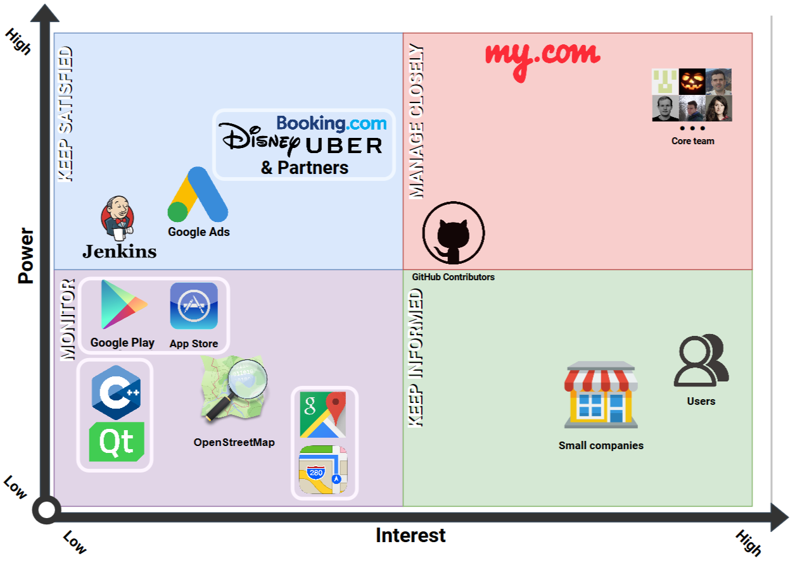
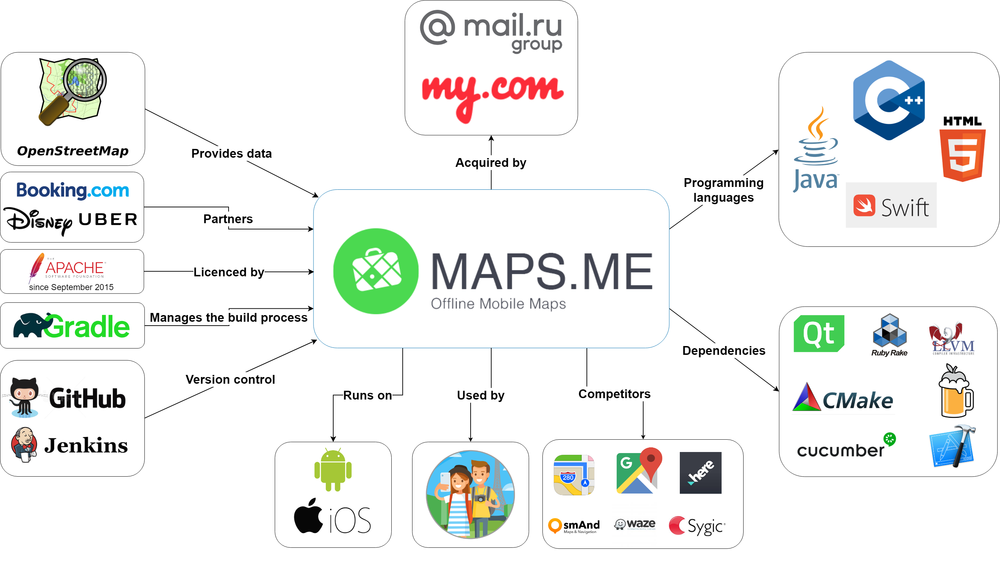
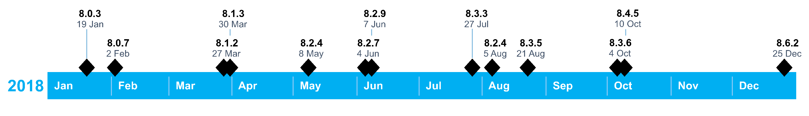
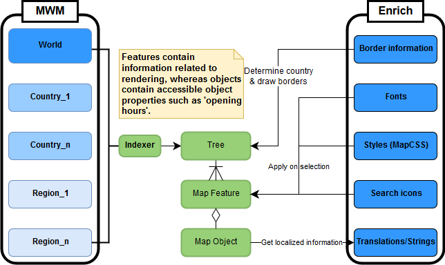
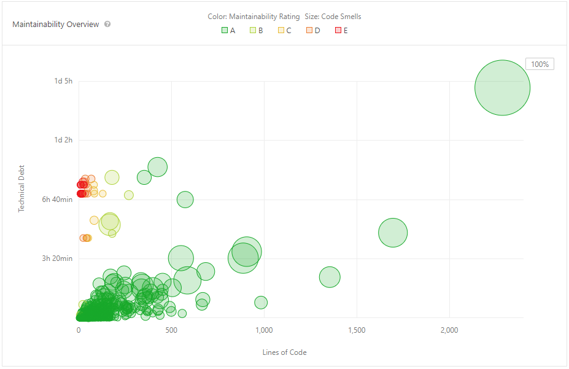
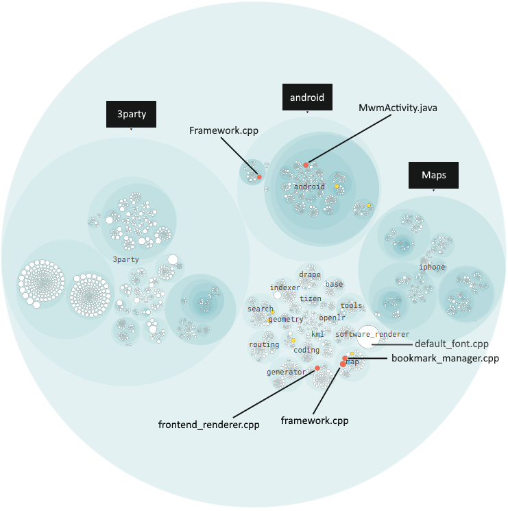

# MAPS.ME
**By [Henk Grent](https://github.com/HenkGrent),
[Mark Haakman](https://github.com/markhaakman),
[Frenk van Mil](https://github.com/demasterr),
[Casper Schröder](https://github.com/CasperSchroder).**

___
## Table of Contents

<!-- TOC depthFrom:2 depthTo:3 withLinks:1 updateOnSave:0 orderedList:0 -->

- [Introduction](#introduction)
- [Stakeholders](#stakeholders)
	- [Other stakeholders](#other-stakeholders)
	- [Power interest grid](#power-interest-grid)
- [Pull Request Analysis](#pull-request-analysis)
- [Integrators](#integrators)
- [Context View](#context-view)
	- [Scope and Responsibilities](#scope-and-responsibilities)
- [Development view](#development-view)
	- [Module structure](#module-structure)
	- [Common design](#common-design)
	- [Codeline model](#codeline-model)
- [Information View](#information-view)
	- [Information storage](#information-storage)
	- [Information structure](#information-structure)
	- [Information quality](#information-quality)
- [Technical Debt](#technical-debt)
	- [Maintainability](#maintainability)
	- [Testing debt](#testing-debt)
	- [Self-admitted technical debt](#self-admitted-technical-debt)
	- [Evolution of technical debt](#evolution-of-technical-debt)
	- [Impact](#impact)
- [Conclusions](#conclusions)
- [References](#references)
- [Appendices](#appendices)
	- [Appendix 1: Full Analysis of Pull Requests](#appendix-1-full-analysis-of-pull-requests)
	- [Appendix 2: Possible architecture improvements](#appendix-2-possible-architecture-improvements)

<!-- /TOC -->

___

## Introduction
[MAPS.ME](https://github.com/mapsme/omim) is an offline map navigation app developed for
Android and iOS devices, built on top
of crowd-sourced OpenStreetMap data.
In November 2014 the app was acquired by the Mail.Ru group as part of the My.com
brand. The application was originally closed source but opened to the public as
of September 2015.

The purpose of this chapter is to assess the quality of MAPS.ME as an open
source project on the basis of a software architecture standpoint, by analyzing
several aspects such as the integration process, context, structure,
and technical debt.

This chapter provides an overview of the MAPS.ME project. First, the chapter
identifies the stakeholders involved. Next, the chapter describes
the pull request procedure of the project and the integrators involved in this
process. Furthermore, a context view, development view, and information view
describe the architecture and design. The last part contains an
analysis of the technical debt identified.

___

## Stakeholders
By identifying the stakeholders related to MAPS.ME it is easier
to choose priorities and identify potential constraints.
Functioning mainly as a mobile app, MAPS.ME relies strongly on the size of their
user base and the companies this userbase attracts.
Descriptions of stakeholders are inspired by Rozanski and Woods [25].

#### Users
MAPS.ME's main feature of interest for end-users is its offline functionality.
MAPS.ME provides high-quality, crowd-sourced maps for free.
According to the MAPS.ME partners page [17], their audience consists out of
people between the ages of 18 - 35, who are recreational
travelers or business travelers.

#### Support staff
Support to other stakeholders is offered by means of e-mail contact and an
online FAQ and knowledge base [18]. The support staff is assumed to
be employed by MAPS.ME.

#### Suppliers
Supplier stakeholders build and/or supply the hardware, software, or
infrastructure on which the system runs.
There are a large number of external software dependencies. Two major stakeholders
are Qt and C++. These dependencies are further identified in the context view.
The app is deployed on both iOS and Android. As a result, they are dependent
on Android and iOS. The terms and conditions of these stores [7; 2]
can strongly influence the design choices MAPS.ME can make.
Although the server focusses on offline navigation, it still
requires OpenStreetMap to update the maps every once in a while.

#### Developers
The original MAPS.ME design and implementation were done by four people [13].
None of these developers appear to be contributing much, if any, code at
this point [6].
Currently, there is a core team working for My.com
(the owner company), situated in their office in Moscow, Russia.

After 2015, people we identified as most important developers are
[bykoianko](https://github.com/bykoianko),
[maksimandrianov](https://github.com/maksimandrianov),
[mpimenov](https://github.com/mpimenov),
 and [rokuz](https://github.com/rokuz).
These developers seem
to have more power than most other developers and will be further elaborated
upon in the Integrators section.

#### Testers
Timofey Danshin has been doing tests and automation for the Mail.Ru Group since
Dec 2015. However, he does not appear to be focused on MAPS.ME.
Earlier in the project, there was no dedicated tester.
Every contributor/maintainer is expected to provide test code for
added features, according to the documentation. However, this requirement is
rarely carried out in practice.

#### Missing roles
The other roles described in Rozanski and Woods [25], namely system administrators, acquirers,
assessors, communicators, maintainers, production engineers and could not be
identified. It is likely that these roles are either
filled by someone from the Mail.ru group or are ignored completely. Another
possibility is that integrators fill these roles, however, this is not clear from
their GitHub activity.

### Other stakeholders
Other stakeholders include stakeholders that were not mentioned
by Rozanski and Woods [25], but which are still important entities that can influence
MAPS.ME's position.

#### Competitors
Competitors include software products produced by other companies or developers
which offer similar functionality.
Software products freely providing access to world maps are common.
Notable are Google Maps and Apple Maps.
Both of these competitors offer limited offline access to maps
on mobile devices.

#### GitHub contributors
GitHub contributors add to the project by creating issues,
pull request, and reviewing pull requests.
These contributors can fulfill a similar role as the developers.
However, they are less informed as they cannot easily integrate with
the core development team. They are also less powerful, as they need
explicit approval from developers in the MAPS.ME core team.

#### Funders
Funders include any party that provides conditional or unconditional revenue
to one or more contributors of MAPS.ME.
There are a number of sources of income. The mobile application displays
Google Ads [8]. For some fee, end-users can pay to hide advertisements,
smaller companies can promote their company, and bigger companies can
engage in partnerships [17].
[Booking.com](https://www.booking.com), for example,
is a major partner of MAPS.ME.

### Power interest grid
The power and interest of the significant stakeholder within the MAPS.ME
context is visualized in _Figure 1_.
They have been mapped from
the viewpoint of the stakeholders themselves.

Overall Google's position does not allow it to assume a position that
can be strongly detrimental to MAPS.ME. Google Ads does have power by means of
providing ad revenue, however MAPS.ME has other sources of income as well.
The app stores have the power to lower the search ranking of MAPS.ME, however,
they currently do not appear to lower MAPS.ME in the search ranking as it
even considered to be an 'Editor's Pick'. Finally, there is no connection between
Google Maps and MAPS.ME, which results in it having low power.

All in all, MAPS.ME has established a relatively independent position in
its market, in which their most significant concerns revolve around
keeping their sources that generate revenue satisfied and maintaining their
user base.

___

## Pull Request Analysis
We analyzed 20 pull requests in order to gain insight into the decision-making
process of the integrators involved in the project. We picked the 10 merged
and rejected (closed) pull requests with the most comments, as these enabled
us to give insight into the communication and workflow of the project. The
entire analysis can be found in [Appendix 1](#appendix-1-full-analysis-of-pull-requests),
but this section will provide
the conclusions that were made after looking at these pull requests.

The 20 pull requests were all very similar in terms of communication.
Lots of decisions are made in some other way than using GitHub communication. These
pull requests are either merged or rejected without any clarification, or with
a message, for example "discussed on Gitlab". Most of the discussion being done on the pull
requests revolve around code quality on file level.
It is rare to see anything else,
and when it happens it is often optimization proposals.

The code quality is looked after very well, with one pull request having 800
comments discussing not much else. The proposed changes include fixing or improving
code conventions, grammar, and redundancy in the code. Strangely, this does not include
documentation of the code or corresponding comments. This gives the
impression that the contributors care lots about code quality, but not documentation. Additionally,
they rarely seem to question the choice of implementation. This might imply that
decisions concerning implementation are made using other platforms of communication.
On top of the disregard for documentation, there also seems to be a disregard for
testing. Testing is often ignored in pull requests, or postponed initially and
ignored afterward.

Bykoianko is the most active in pull requests, as such he appears to be the
project leader. However, the Linkedin accounts of the
MAPS.ME team reveal that Rokuz has the role of project leader and
Bykoianko the role of senior developer.

A significant group of other contributors write their reviews in Russian.
In contrast, all commit messages,
comments, and language used in the code are English.

___

## Integrators
Based on the analysis of pull requests, the main integrators of the project,
and their decision-making strategies are described below. This analysis
is key for understanding the interaction of people and developers within the project.

**Roman Kuznetsov (Rokuz)**  
[Rokuz](https://github.com/rokuz) interacts in an almost
product owner way. He reviews more than
he contributes. When he opens a pull request, it is often without description and
quickly merged after not more than one approval. If he approves a pull request,
no other approvals are needed. His approvals are often given without
any visible feedback on the contribution.  
Contact: N/A

**Vladimir Byko-Ianko (Bykoianko)**  
[Bykoianko](https://github.com/bykoianko) seems to be one of the most important
people on the project. He either
implements a feature or reviews it in depth. Important decisions on performance
and how features get implemented are made by him.
He is also one of the biggest contributors at the moment.
 
Contact: N/A

**Maxim Pimenov (Mpimenov)**  
[Mpimenov](https://github.com/mpimenov) seems to be
fulfilling the quality control role in
the project. He comments on pull requests with mostly proposed style changes,
or hard to miss bugs, which almost always get immediately fixed by the
proposer of the change.  
Contact: N/A

**Maksim Andrianov (Maksimandrianov)**  
[Maksimandrianov](https://github.com/maksimandrianov) is a relatively new
integrator of the project, however, is allowed to merge.
He often partakes in the review process of features made by others.
 
Contact: Maksimandrianov1@gmail.com

**Tatiana Yan (Tatiana-yan), Vlad Mihaylenko (Vmihaylenko), and Gmoryes**  
[Tatiana-yan](https://github.com/tatiana-yan) and
[Vmihaylenko](https://github.com/vmihaylenko),
seem to fulfill the quality control role next to their developer role.
[Gmoryes](https://github.com/gmoryes) is one of the new contributors to the
project, having started on it half a year ago. The review process of his pull
requests tend to be longer than others because more faults are present in his code.
 
Contact: N/A, vxmihaylenko@gmail.com, and N/A.

___

## Context View
The context view describes the relationships, dependencies, and interactions
between the system and the environment [25]. The context view of MAPS.ME can be found
in _Figure 2_.
The elements in the context view are extracted based on stakeholders,
build dependencies, development dependencies, and observing the project
repository on GitHub.

MAPS.ME works differently than most popular navigation applications. Instead of
using an internet connection to retrieve and show maps in real time, the application is
fully offline. This appeals to a different user group. These users are often travelers
or citizens that live in an area with a bad internet connection. This gives the
application a valid competitive position compared to other map services, most
importantly Google Maps and Apple Maps. This position is important because the
app is used on Android and iOS, which are owned by Google and Apple respectively.

To properly build apps for these platforms, Java, Swift, and some third-party applications
are used. HTML5 is used for the website and C++ for feature- and main development.
The Android module is built with Gradle, the project uses GitHub
for version control, and Jenkins as continuous integration service.

An important external entity is OpenStreetMap. OpenStreetMap is
an external system to the project which provides the project with crucial map data.
Map data of OpenStreetMap is crowdsourced from scratch and changes to maps can
be made from within the MAPS.ME apps when an OpenStreetMap account is linked.
Besides the points of interest provided by OpenStreetMap, Booking.com adds hotels
to the maps, with functionality to directly book a room through the MAPS.ME app.

MAPS.ME is owned by My.com, which is part of the Mail.ru group. Maps.me used to
be closed source and a paid service until it got bought by Mail.ru, after which
it went open source. It now uses the Apache software license for open source
projects.

### Scope and Responsibilities
MAPS.ME is an offline navigation app. Its main responsibilities are showing map
data properly without an internet connection, providing routing functionality for
its users, and showing information on local shops, traffic, transport, and
tourist information. Users can also use their GPS to see their location on the maps
whilst being offline. The app covers the entire world, as it uses OpenStreetMap data.
To prevent the app from taking an immense amount of storage on the device by
storing the map files for the world, the separate map files for areas
should be handpicked and downloaded by the user beforehand.

The app has some integration with parties such as Booking.com, to add functionality
for users and create a revenue stream for my.com. The advertising
focuses on travelers mostly and the app lets
businesses advertise themselves inside it.
The app is free to use, but if the users want an ad-free experience they can pay
a subscription fee. It is only available for smartphones, so other more "classic"
navigation devices and computers/laptops are outside of the scope.

___
## Development view
The purpose of the development view is to provide insight into
the code structure, dependencies and code standards [25].
This helps software engineers work with the system
efficiently and in a way that does not violate technical integrity constraints.
As of 2nd of March 2018, the repository contains about 46000 files and 5000 directories,
totaling 7 GB. This is large enough to make orientation non-trivial.

### Module structure
The 5000 directories of MAPS.ME can be structured in modules.
The function of these modules and important dependencies between them
are shown in the _Figure 3_. The module structure reveals how important
components of MAPS.ME's architecture work together.
No official module structure has been documented in the MAPS.ME repository.

The code is separated in different frames
based on their functionality. The Maps frame includes the functionality related
to creating and loading the map files (.mwm files) used by MAPS.ME. The Dependencies
frame contains a broad generalization, as the so-called "3party" module contains
30 different third-party dependencies. Qt is shown separately, as it has its own
folder in the main folder. All the dependencies and map files are used by code
in the "Core" frame.

The End-user functionality provides functions like routing, searching for streets and
businesses, and live traffic information. Business logic contains (among others)
ads, code to process business partners, and a benchmark tool. The GUI contains
everything needed to render and display the graphics of the app.

The core is compiled using Cmake. This creates resources from the separate functionalities
in the core frame, which are used by the
Android and iPhone projects. These projects create the final product in the form of apps.
Some improvements can be made to this structure and data flow, which are discussed in
[Appendix 2](#appendix-2-possible-architecture-improvements).

### Common design
Ideally, anyone who contributes to a software system contributes
in a way that is consistent with the existing code base. This includes aspects
such as a common coding style, standardizing test requirements, and the use of
design patterns to improve cohesion. Unfortunately, the project's idea of a
common design appears to be limited.

#### Common processing
The generator module is a map building tool used from a lot of
other modules. According to the README file [14]
"For development, use MAPS.ME Designer app along with its generator tool:
these allow for quick rebuilding of style and symbols (...)".
Furthermore, no explicit design patterns or contracts that should be adhered to
are mentioned in the repository.
Most of the functionality that is
processed in a uniform manner appears to be incidental or as a result of the
system's implicit constraints.

#### Common language
Formally the MAPS.ME repository uses English for its documentation and code,
whereas discussions on GitHub are often held in Russian [19].
The latter makes it hard for non-Russian speakers to participate.

#### Coding style
The coding style [15] has been extensively documented
in the MAPS.ME docs.
For C++ Google's coding standard [9] is used, with a number of exceptions.
For the coding style, ClangFormat [4] is used with a specified
configure file. On top of this, a piece of example code has been added.

For map files, MAPS.ME uses an adapted version of MapCSS [22].
A description of this format is not specified. However, a MAPS.ME specific
designer app has been built which allows anyone to quickly build maps
in a standardized way.

#### Standardization of testing
Documentation on the standardization of testing is very limited.
Within the coding style document, it is mentioned that code should
be covered with unit tests.
It is also mentioned that third-party libraries should be avoided
if they are not fully tested on the MAPS.ME platform.
In practice, the amount of testing done is limited and not standardized.

### Codeline model
The codeline model describes the source code structure, release process,
configuration management, and build and testing approaches [25].

#### Source Code Structure
There are 49 folders in the root directory of the MAPS.ME project [29].
An overview with descriptions of the source code structure of MAPS.me is given in _Figure 4_.
The descriptions are extended descriptions from
[CONTRIBUTIONS.md](https://github.com/mapsme/omim/blob/master/docs/CONTRIBUTING.md).
One contribution to MAPS.ME by us was the addition of missing folder descriptions.
As this repository consists of hardly any documentation and comments,
it is hard to find out the purpose of each directory in the root folder. Therefore,
not every change was accepted in our pull request
[#10513](https://github.com/mapsme/omim/pull/10513).
Each white description in the figure was already present in the MAPS.ME documentation.
The other colored descriptions were (trying to be) added in the pull request.
Descriptions indicated in red were not accepted by
Mpimenov [21], an author of the project. An
elaboration on what information was missing was not given.
Descriptions indicated in yellow were partially wrong, green descriptions are
accepted and can now be found in the MAPS.ME documentation. Note that the "Core"
described in this figure is different from the "Core" described in the Module structure.
The Core in this figure was taken from the MAPS.ME documentation while the "Core"
in the Module Structure was specified by us as it contains the core functionality.

####  Build Approach
MAPS.ME has various build procedures. CMake is used as C++ compiler
tool to create releases for Android and iOS.
The build automation system Gradle is used for the Android version and the iOS
version can be built within XCode.
The project is developed on MacOS, so building on
Linux based systems like Ubuntu will also easily work. However, building on
Windows is not supported by the project.

####  Release Process
The source code is released on GitHub by merging open pull requests directly to the
master branch. Since the real release of builds happens in the Google Play Store
and Apple's App Store, failing builds on the master branch are not as critical
as is the case for some other projects.
MAPS.ME only had thirteen releases in 2018 [1].
This is a slow deployment cycle
compared to other actively developed apps. This could be justified by the fact
that resources, such as maps and interesting points on the maps are updated
independently of the app. Map updates, with new routes and locations, can be
downloaded from within the app. A timeline of the app releases in 2018 can be
found in _Figure 5_. The year 2018 is chosen to give an overview of an entire year of
releases.
It is noticeable on the timeline that some releases are followed quickly by another
release. That could suggest that they did ship some bugged releases, which
needed to be patched quickly. The update notes on the Google Play Store do not
show that these releases contain bug fixes.

####  Code management
MAPS.ME uses a Pull-based Software Development Model [10].
Contributors other than the authors have to fork
the repository and create pull requests to merge their contributions into
the project. Before someone can contribute to the project, a [Contributor License
Agreement](https://maps.me/cla/) has to be signed [16].
The authors themselves create pull requests but do not provide a
description most of the time. If a description is provided, it is often in Russian.
Jira is used as issue and bug tracking system but this tool is not available
to the public. On some pull requests, the Continuous Integration system Jenkins
is used. Jenkins has to be started manually by commenting on a pull request with
"JTALL" (Jenkins Test All). In that case, Jenkins tries to build the project for
Mac, Android, Linux, and iOS. The details of Jenkins build info cannot be
viewed, as these are stored on a private website.

___
## Information View
In this view, we will consider the information- storage, structure and quality.
One of MAPS.ME's main functions is to make map data insightful for end-users.
Therefore, we consider the maps and map enrichment data.
The map data is used to generate the polygons
and so-called 'features' which are present on the maps.
The map enrichment contains files like translations, style sheets and country
metadata.

### Information storage
For maps, data is retrieved from OpenStreetMap database
[23] using some download utility files
in the storage module - as depicted in the module structure.
This downloaded data is processed into map files ('.mwm')
via the 'generate_mwm.sh' script, which are stored as flat files on the MAPS.ME server.

The map enrichment files are all included on GitHub and shipped with the app.
They are stored in the corresponding formats.
For key-values stores '.txt' and '.json' files are used.

### Information structure
The information structure we will elaborate on revolves around map data,
which uses 'map enrichment' files.
The statistics are not related to the map and enrichment data.

_Figure 6_ shows how static map- and enrichment files are used in creating
the tree of map features that are used by MAPS.ME's core code.
These trees are generated from .mwm files whose granularity depends on the
location and level of zoom. If someone zooms in on a specific country,
the .mwm file related to that country will be used.
Only the '.mwm' file for the world view is included on GitHub and
the mobile application by default.
Specific map files can then be downloaded from within the app.
This can be done by country or specific regions within this country.

The tree contains objects called map features. Each map feature consists of a
specific type. There are numerous
[types](https://github.com/mapsme/omim/blob/master/data/types.txt), such as
schools, industrial land, and pubs. These types contain geometry information,
such as polygons, which is used to render them on the map.
Some of these types may include a
[map object](https://github.com/mapsme/omim/blob/master/indexer/map_object.cpp),
which (generally) function as objects the user can interact with by means of
the end-user functionality, as depicted in the module structure.

The features and objects in the tree use the enrichment data
in different ways. The border information is used
in many ways, most notably to determine the country features
belong to and to draw borders.
The fonts, style sheets, and search icons are applied to map
features on a selection basis, similar to how CSS works.
Finally, map objects use translation dictionaries to make strings
location-specific.

### Information quality
Information quality is warranted by using OpenStreetMap and having the
project be accessible for contributions on GitHub.
The map data used from OpenStreetMap is crowdsourced and open to adjustments.
The data can always be updated to correspond with the real world, as
OpenStreetMap updates its files every minute. This prevents
users from getting annoyed by outdated data.
This undermines the quality of the information slightly. However, if need be,
this can be mitigated by releasing more often.

___
## Technical Debt
Technical debt is the term introduced to indicate to nontechnical stakeholders
the need for 'refactoring' [11]. From the original description, technical
debt is described as "not quite right code which we postpone making it right"[5].
In this section, analysis tools are used to
identify such technical debt. All analyses ran on the most recent version of the
`master` branch at the time of writing this section (commit
[1931f0f](https://github.com/mapsme/omim/commit/1931f0f66d0312fa8c7379c7008c644dd039875d)).

### Maintainability
First, this section focusses on the maintainability of the project.
Low maintainability could lead to
surprises in cost and time when change is required [3]. One way to
help identify maintainability of code is by the use of
[SonarQube](https://www.sonarqube.org/). SonarQube is a static analysis tool
capable of analyzing projects for bad practices, code smells, and more. Thanks
to its extensiveness, it enables thorough analyses. As the MAPS.ME project is
fairly big, the maintainability analysis will be narrowed down to the Android
module.

#### SonarQube dashboard
From the [SonarQube analysis](https://sonarcloud.io/dashboard?id=demasterr_omim)
dashboard 230 suspected bugs and 63 vulnerabilities can be found.
Furthermore, in _Figure 7_ can be seen that the number of code smells
is excessive (1.6k). Upon manual inspection, the bugs, vulnerabilities, and
code smells are in many cases significant.
Although there are indications that code smells do not always directly affect
maintainability [26, 28], they are good indications of bad
practices.

_Figure 8_ shows the maintainability scores found by SonarQube.
The majority of classes fall within 500 lines of code
per class and a technical debt below 3.5 hours. The red cluster around seven
hours of technical debt mostly contains Activity classes. Most red classes are
caused by having far more parent classes than authorized
(e.g. 12 parents where 5 is allowed).

The biggest outlier, with a technical debt of 1d 4h, is `MwmActivity.java`.
By inspecting the class it becomes clear that this is the main
activity of the application with many functionalities cramped into it and most
of its code being abandoned code.
This emphasizes the need for refactoring this file.

#### Bad practices
If we look at the complexity of methods in the whole project, some functions
undoubtedly are refactoring candidates. For example,
`normalize_unicode::NormalizeInPlace` has an NLOC (# lines of code) of 4571 and a Cyclomatic Complexity of 4234.
This was only one of the most extreme cases, beyond doubt there are many more
functions with a complexity even above a hundred. Most of these files are
also identified (see _Figure 9_) by CodeScene, a static analysis tool capable of
identifying refactoring candidates.

The technical debt on these files can become
a concern if the code is not commented. If we look at the
Android `/src` module, we see a comment/NLOC-ratio of 3.5% (measured with
  [cloc](https://github.com/AlDanial/cloc)).
Compared to the average ratio found by Pascarella and Bacchelli[24], 40%, this
is far lower than most prominent Java repositories. For C++ files, the comment
ratio is 11.7%. Such low comment ratios make it harder to understand the code.
Open source projects without adequate documentation are inherently at a
disadvantage [12].
However, the core team does not seem to give a high priority to commenting or
documentation. Contribution to the documentation was also partly rejected and
the core team would rather postpone updating the documentation
(see [#10513](https://github.com/mapsme/omim/pull/10513)). The obvious solution
to the technical debt in maintainability is to add documentation to the code and
reduce the Cyclomatic Complexity in the identified refactoring candidates.

### Testing debt
MAPS.ME does not use a standard testing framework. There are
unit tests, but these can only be executed by their own test execution code
[20]. This has some major disadvantages, which will be
elaborated upon in this subsection.

Tests do not have IDE support,
so executing tests can only be done from a terminal and results can only be
viewed in a log file. This becomes a problem when a test fails, as it takes effort
to find the cause. The script which executes tests, executes the test binaries
separately, so there is no conclusive result of all tests.
Failing tests are hidden between different modules in the generated log file.

The authors did not implement a way to measure code coverage into their testing module,
so there is no easy way to tell which parts of the code are tested and which
are not. This makes it very hard for us to discuss well- and less tested modules.
When asking for more clarification on measuring code coverage in an
issue [#10555](https://github.com/mapsme/omim/issues/10555), we did not get any
response as of writing this section.

To observe current testing behavior, we analyzed the last fifty pull requests to
the project, which is a little more than a week of contributions. Of the fifty
pull requests, only 12% changed test files. This indicates a significant testing debt.

Several actions should be taken to decrease further testing debt. As all main
authors are developing in Xcode, the testing framework
[XCTest](https://developer.apple.com/documentation/xctest) could be used to
create and run unit tests, performance tests, and UI tests. This enables
developers to debug tests, see code performance, measure code coverage, and
automate testing.

### Self-admitted technical debt
Technical debt is often introduced knowingly
by developers, often indicated with "TODO"s, "FIXME"s or "BUG"s in the code.
To find how many of these markers are present in the project, we used
[todo-show](https://atom.io/packages/todo-show) for Atom. This package allows
to count and filter for the indications. The code contains
a total of 2384 TODOs, 552 FIXMEs, and 19 BUGs.

A considerable part of the project is the code for the Android app. When building
the Android app, the C++ compiler shows (600+) unhandled warnings.
These warnings indicate potential issues.
Either these warnings should be suppressed, or the code should be adjusted accordingly.

The total amount of markers in the code and the number of compile warnings
give the impression that the code contains a hefty
amount of self-admitted technical debt. As Storey et al. [27] have shown, developers
believe that TODOs and other similar markers have a significant negative effect
on the maintainability of the project. To avoid this technical debt, the
developers should solve the warnings and identify the most important indicators.

### Evolution of technical debt
To measure the evolution of technical debt, we analyzed the interactions of the
integrators. The way they handle situations concerning technical debt can be an
interesting benchmark. Often new features get merged without the mention of tests
or even the added TODOs in the code.
Occasionally, the integrators add tests for the most important functionality.
In discussions around only a few pull requests, tests and comments
are emphasized.

The last time a TODO was actually implemented was almost
[three years ago](https://github.com/mapsme/omim/commit/e2c28dbc22eceb786fb21ec3300c8e47509a683f).
The way of communication and implementation imply that the integrators ignore
the technical debt of the project. They often add code containing technical debt
and rarely discuss it. This causes the technical debt to keep growing and go unchecked.

### Impact
With high Cyclomatic Complexity and the marginal documentation in the code,
contributing to the project gets increasingly hard.
The original author may be gone and, therefore, knowledge about functionality
may be lost. Mistakes
are more likely to be made, as confusion is dragged through the project. As the
project has hardly any tests and the framework used for testing is incomplete,
it is likely that many defects remain unnoticed. The defects and missing
components that are noticed, e.g. with a TODO, are mostly ignored. After years
of ignoring the indicators, the absence of their implementation can possibly
cause extensibility problems or defects.

## Conclusions
The conclusions reflect on the purpose of this chapter, which was to
assess the quality of MAPS.ME with respect to the different software
architecture viewpoints.

With respect to the context view and the stakeholders, MAPS.ME is a project
which has a strong market position as an app. The emphasis on offline
navigation allows it to separate itself from its competitors and its target
audience is big enough to attract funders. Furthermore, MAPS.ME is not
dependent on stakeholders which might have the intent to inhibit the project.

For the development view, MAPS.ME has a lot of room for improvement.
The concerns of modules within the module structure are not always clearly
separated. It is not easy to figure out the responsibility of modules, because
the codeline structure is highly fragmented and there is little documentation.
MAPS.ME could improve this aspect by including documentation about
the data flow and the module structure. Also, better grouping
the directories according to their functionality would improve MAPS.ME.

For the information view, MAPS.ME's dependence on OpenStreetMap allows it
to keep its map data up-to-date.
The information and related modules are well-structured.
All in all, this makes MAPS.ME's approach
for handling map data solid, yet relatively simple.

According to manual and automated analysis, we identified a significant
technical debt. SonarQube revealed a high technical debt and low maintainability.
A lot of this technical debt is self-admitted and has been shown to not reduce
over time. The testing debt was not easy to measure. Having a uniform testing
framework could help MAPS.ME control their tests better.
In order to improve this aspect, the core team should become aware of the
consequences of high technical debt and how to deal with it.
Static analysis tools could help with gaining such insight.

One particular theme among the different subsections of this chapter is the communication
between the core team and the GitHub community. The project does not contain sufficient
documentation to understand the code.
The core team also does not respond hospitably when asked questions.
Furthermore, the vast majority of the contributions are done by the core team without
any reviews from external developers.
As a result, it is hard to consider MAPS.ME a truly open source project.

___

## References

[1] APKPure. 2019. MAPS.ME update version history for android - apk download. Retrieved March 22, 2019 from [https://apkpure.com/maps-me-%E2%80%93-offline-map-and-travel-navigation/com.mapswithme.maps.pro/versions]()

[2] Apple. 2018. Apple media services terms and conditions. Retrieved March 22, 2019 from [https://www.apple.com/legal/internet-services/itunes/us/terms.html]()

[3] T. Bakota, P. Hegedűs, G. Ladányi, P. Körtvélyesi, R. Ferenc, and T. Gyimóthy. 2012. A cost model based on software maintainability. In 2012 28th ieee international conference on software maintenance (icsm), 316–325. DOI:[https://doi.org/10.1109/ICSM.2012.6405288]()

[4] Clang. Clang 9 documentation. Clang C Language Family Frontend for LLVM. Retrieved March 22, 2019 from [https://clang.llvm.org/docs/ClangFormat.html]()

[5] Ward Cunningham. 1992. The wycash portfolio management system. SIGPLAN OOPS Mess. 4, 2 (December 1992), 29–30. DOI:[https://doi.org/10.1145/157710.157715]()

[6] GitHub. Contributors to mapsme/omim. Retrieved March 22, 2019 from  
[https://github.com/mapsme/omim/graphs/contributors]()

[7] Google. 2018. Google play terms of service. Retrieved March 22, 2019 from  
[https://play.google.com/about/play-terms/index.html]()

[8] Google. MAPS.ME – offline map and travel navigation - apps on google play. Retrieved March 22, 2019 from [https://play.google.com/store/apps/details?id=com.mapswithme.maps.pro]()

[9] Google. Google c style guide. Retrieved March 22, 2019 from [https://google.github.io/styleguide/cppguide.html]()

[10] Georgios Gousios, Martin Pinzger, and Arie van Deursen. 2014. An exploratory study of the pull-based software development model. In Proceedings of the 36th international conference on software engineering, 345–355.

[11] P. Kruchten, R. L. Nord, and I. Ozkaya. 2012. Technical debt: From metaphor to theory and practice. IEEE Software 29, 6 (November 2012), 18–21. DOI:[https://doi.org/10.1109/MS.2012.167]()

[12] Michelle Levesque. 2004. Fundamental issues with open source software development. First Monday 9, 4 (2004). DOI:[https://doi.org/10.5210/fm.v9i4.1137]()

[13] MAPS.ME. 2015. Mapsme/omim contributors. Retrieved March 22, 2019 from  
[https://github.com/mapsme/omim/blob/master/CONTRIBUTORS]()

[14] MAPS.ME. 2018. Mapsme/omim readme. GitHub mapsme/omim. Retrieved March 22, 2019 from  
[https://github.com/mapsme/omim/blob/master/README.md]()

[15] MAPS.ME. 2018. Mapsme/omim coding style. Retrieved March 22, 2019 from  
[https://github.com/mapsme/omim/blob/master/docs/CPP_STYLE.md]()

[16] MAPS.ME. 2019. Mapsme/omim contributing.md. Retrieved March 22, 2019 from  
[https://github.com/mapsme/omim/blob/master/docs/CONTRIBUTING.md]()

[17] MAPS.ME. Partners. Partners. Retrieved March 22, 2019 from [https://maps.me/partners/]()

[18] MAPS.ME. MAPS.ME – support. Retrieved March 22, 2019 from [https://support.maps.me/hc/en-us]()

[19] MAPS.ME. Pull requests mapsme/omim. Retrieved March 22, 2019 from  
[https://github.com/mapsme/omim/pulls]()

[20] MAPS.ME. Mapsme/omim testing tree github. Retrieved March 22, 2019 from  
[https://github.com/mapsme/omim/tree/master/testing]()

[21] mpimenov. mapsme/omim Pull request \#10513. 2019. Retrieved March 22, 2019 from [https://github.com/mapsme/omim/pull/10513#pullrequestreview-213079484]()

[22] OpenStreetMap. MapCSS. About OpenStreetMap - OpenStreetMap Wiki. Retrieved March 22, 2019 from [https://wiki.openstreetmap.org/wiki/MapCSS]()

[23] OpenStreetMaps. API. API - OpenStreetMap Wiki. Retrieved from [https://wiki.openstreetmap.org/wiki/API]()

[24] L. Pascarella and A. Bacchelli. 2017. Classifying code comments in java open-source software systems. In 2017 ieee/acm 14th international conference on mining software repositories (msr), 227–237. DOI:[https://doi.org/10.1109/MSR.2017.63]()

[25] Nick Rozanski and Eoin Woods. 2012. Software systems architecture: Working with stakeholders using viewpoints and perspectives. Addison-Wesley.

[26] D. I. K. Sjøberg, A. Yamashita, B. C. D. Anda, A. Mockus, and T. Dybå. 2013. Quantifying the effect of code smells on maintenance effort. IEEE Transactions on Software Engineering 39, 8 (August 2013), 1144–1156. DOI:[https://doi.org/10.1109/TSE.2012.89]()

[27] Margaret-Anne Storey, Jody Ryall, R. Ian Bull, Del Myers, and Janice Singer. 2008. TODO or to bug: Exploring how task annotations play a role in the work practices of software developers. In Proceedings of the 30th international conference on software engineering (ICSE ’08), 251–260. DOI:[https://doi.org/10.1145/1368088.1368123]()

[28] Min Zhang, Tracy Hall, and Nathan Baddoo. 2011. Code bad smells: A review of current knowledge. Journal of Software Maintenance and Evolution: research and practice 23, 3 (2011), 179–202.

[29] MAPS.ME tree github. Retrieved March 22, 2019 from [https://github.com/mapsme/omim/tree/master/]()

___

## Appendices

___

### Appendix 1: Full Analysis of Pull Requests

**Pull request**  

Title + ID: [generator] Added wikipedia descriptions generation.
[#9811](https://github.com/mapsme/omim/pull/9811)  
Lifetime: Nov 9, 2018 - Dec 3, 2018  
Components: generator/generator_tool, indexer  
Created by: Maksimandrianov  
Accepted/Rejected: Accepted  
Merged by: Mpimenov  
Addresses: Feature  
Issues: N/A  
Deprecates pull-request: N/A  

This pull request adds a feature which allows the generation of descriptions for
map elements on the basis of the Wikipedia API. Tests were included in this pull request.
This is a feature which users of the system would want and the code was deemed
to be of sufficient quality.
A number of different people suggested minor changes to which Maksimandrianov
responded with "++".
There were also comments regarding more structural concerns, these were also
responded to and addressed by Maksimandrianov.

**Pull request**  
Title + ID: [routing] Add speed cameras to routing + tests
[#9405](https://github.com/mapsme/omim/pull/9405)  
Lifetime: Sep 5, 2018 - Sep 17, 2018  
Components: routing: speed_camera, map  
Created by: Gmoryes  
Accepted/Rejected: Accepted  
Merged by: Bykoianko  
Addresses: Feature  
Issues: N/A  
Deprecates pull-request: N/A  

This feature adds a component displaying a UI icon and voice warning if a user
approaches a speed camera. Tests were included in this pull request.
This is a feature which users of the system would want and the code was deemed
to be of sufficient quality.
Bykoianko and Mpimenov gave the most feedback to which Gmoryes responded with 'done' or
replied with a longer response which resulted in some discussion. The feedback
consisted of a mix of structural feedback and some minor changes.

**Pull request**  
Title + ID: [routing] Fix crash because of transit id
[#10181](https://github.com/mapsme/omim/pull/10181)  
Lifetime: Jan 9, 2019 - Jan 10, 2019  
Components: routing:corss_mwm_index_graph.hpp (Single file)  
Created by: Gmoryes  
Accepted/Rejected: Rejected  
Closed by: Gmoryes  
Addresses: Bugfix  
Issues: N/A  
Deprecates pull-request: N/A  

This PR attempts to fix one equality assignment related to segment geometry.
Closed because the integration tests fail and a fix was released in another version.
Gmoryes and Bykoianko discussed the proposed fix in detail. In this discussion
Bykoianko mentioned an alternative way to fix the issue, which involved using
different methods touching different parts of the program. Bykoianko also explained
why this might be beneficial.

**Pull request**  
Title + ID: Persian translation
[#9558](https://github.com/mapsme/omim/pull/9558)  
Lifetime: Sep 29, 2018 - Oct 8, 2018  
Components: iphone/Maps/LocalizedStrings, data/strings  
Created by: Mnameghi  
Accepted/Rejected: Rejected  
Closed by: Mpimenov  
Addresses: Translation  
Issues: N/A  
Deprecated by pull-request: #9360  

This PR adds Persian translations to MAPS.ME.
Closed because there were some minor issues which were addressed in a different
PR (#9630). This different PR, made by Tatiana-yan, was merged.
A number of people said it looked good and thanked Mnameghi.
Mpimenov gave a lot of feedback in terms of some characters or quotes which
should be removed.

**Pull request**  
Title + ID: [generator] Region kv iso3166-1
[#9349](https://github.com/mapsme/omim/pull/9349)  
Lifetime: Aug 23, 2018 - Sep 4, 2018  
Components: generator: region files  
Created by: Maksimandrianov  
Accepted/Rejected: Closed  
Closed by: Maksimandrianov  
Addresses: Feature  
Issues: N/A  
Deprecated by pull-request: #9393  

Adds regions to the generator. After not a lot of substantial suggestions,
Tatiana-yan suggested a rebase after which Maksimandrianov closed it
without further explanation. A pull request addressing the same issue was opened
on 4 September 2018. This pull request was merged, however no mention to
\#9393 was ever given.

**Pull request**  
Title + ID: [generator] Region kv
[#9340](https://github.com/mapsme/omim/pull/9340)  
Lifetime: Aug 21, 2018 - Sep 3, 2018  
Components: Generator/regions  
Created by: Maksimandrianov  
Accepted/Rejected: Accepted  
Merged by: Mpimenov  
Addresses: Feature  
Issues: N/A  
Deprecates pull-request: #9349  

This pull request adds regions to the generator such as city, town, village,
suburb, and neighborhood.
The three reviewers of this pull request are Mpimenov, Tatiana-yan, and Syershov.
There is a discussion going on if a certain third party application should be
included in the codebase or not. There are also some grammatical and format
errors addressed. Furthermore, code efficiency is improved after reviewing. Also,
tests are added after the pressure of the reviewers.
The pull request is accepted after a lot of conversation (377 comments in total),
where code quality is vastly improved and bugs are solved together.

**Pull request**  
Title + ID: [routing] SpeedCameras Core and ios interface
[#9888](https://github.com/mapsme/omim/pull/9888)  
Lifetime: Nov 22, 2018 - Nov 30, 2018  
Components: Implementation and interface of speed cameras on iOS 
Created by: Gmoryes  
Accepted/Rejected: Accepted  
Merged by: Bykoianko  
Addresses: Feature  
Issues: N/A  
Deprecates pull-request: N/A  

This pull request has no description. It adds speed cameras to the interface of
iOS and also adds the implementation of speed cameras.
The reviewers Vmihaylenko and Bykoianko are addressing format and style improvements.
It is finally approved after a conversation of 202 comments. Many
inconsistencies, style issues, and small refactors are addressed.

**Pull request**  
Title + ID: [DNM][traffic] Switching off temp blocking traffic jam for Russia.
[#10060](https://github.com/mapsme/omim/pull/10060)  
Lifetime: Dec 13, 2018 - Dec 14, 2018  
Components: traffic  
Created by: Bykoianko  
Accepted/Rejected: Rejected  
Rejected by: Bykoianko  
Addresses: Bugfix  
Issues: N/A  
Deprecates pull-request: N/A  
Deprecated by pull-request: #10078  

This pull request is closed quickly because Burivuh wants that the code is
added to master directly. The new pull request #10078 is discussed later on.

**Pull request**  
Title + ID: [DNM] http thread refactoring
[#10043](https://github.com/mapsme/omim/pull/10043)  
Lifetime: Dec 11, 2018 - Dec 12, 2018  
Components: http_thread  
Created by: Beloal  
Accepted/Rejected: Rejected  
Closed by: Beloal  
Addresses: Refactoring  
Issues: N/A  
Deprecates pull-request: N/A  

This pull request is a refactoring of HTTP thread classes. The refactoring is
said to be bad by Maksimandrianov, Mpimenov, and Rokuz, as the refactoring introduces
a lot of typecasting. The author of the pull request does not agree with this
and closes the pull request as he thinks there is no further reason to discuss
this matter. A similar solution intended by this refactor is implemented in pull
request #10047 and self-merged by Beloal, this time with changes accepted by
Rokuz and Vmihaylenko.

**Pull request**  
Title + ID: Remove duplicates from strings.xml
[#9789](https://github.com/mapsme/omim/pull/9789)  
Lifetime: Nov 4, 2018 - Nov 6, 2018  
Components: strings  
Created by: Dimqua  
Accepted/Rejected: Rejected  
Rejected by: Rokuz  
Addresses: Translation  
Issues: N/A  
Deprecates pull-request: N/A  
Deprecated by pull-request: #9768  

This is a small pull request which removes a duplicate string from the
translations for the Android app. The
pull request is closed by Rokuz because this particular string is already
removed in an earlier pull request #9768.

**Pull request**  
Title + ID: Maxspeed section.
[#9697](https://github.com/mapsme/omim/pull/9697)  
Lifetime: Oct 18, 2018 - Nov 23, 2018 
Components: generator maxspeed, routing  
Created by: Bykoianko  
Accepted/Rejected: Accepted  
Merged by: Mpimenov  
Addresses: Feature  
Issues: #9697  
Deprecates pull-request: N/A  

The pull request adds a section to the application which holds information on
speed limits of roads, saved with a "maxspeed" tag. The purpose seems to be the
addition of a major feature. This pull request is the first pull request
containing code related to this feature.

The process starts with the initiator (Bykoianko) asking for reviews of three
other contributors: Vmihaylenko, Mpimenov, and Maksimandrianov. A different
contributor joins in and discusses the implementation of a very specific method
in the code, resulting in the initiator changing the code as proposed.
All of the invited contributors propose several optimization changes, which are
quickly accepted and implemented by the initiator. Mpimenov seems to adhere to a
form of commenting which is as follows: s/x/y/, where the s/.../ implies x should
be changed to y. Tens of bugs seem to be fixed by other contributors proposing
changes. After many bugfixes, the reviewers approve the pull request one by one
with no further clarification except for "LGTM" (looks good to me).

Noteworthy is that the initiator seems to use triggers for automated checks of
the code. One of such triggers is "JTA", of which the purpose is unclear.

**Pull request**  
Title + ID: New IndexGraphStarterJoints, JointSegment, jumps between segments.
[#9857](https://github.com/mapsme/omim/pull/9857)  
Lifetime: Nov 16, 2018 - Jan 23, 2019  
Components: routing  
Created by: Gmoryes  
Accepted/Rejected: Accepted  
Merged by: Bykoianko  
Addresses: Feature  
Issues: #9857  
Deprecates pull-request: N/A  

The pull request adds a part of a new feature, namely routing based on joints in
an effort to improve routing.

The review process starts off with a "JTA" comment by Bykoianko, who joins the review
process. He follows by pointing out several flaws in the implementation, and why it is
not what he expected when proposing the feature. Some optimization changes are
denied by Gmoryes, the initiator of the project because the time saved is not
worth the amount of work. Both Bykoianko and Vmihaylenko post various strict comments
on the language of the code comments, which need to be switched from Russian to
English. After all these changes, and after running integration tests, Bykoianko decides
it is good enough and merges the commit.

**Pull request**  
Title + ID: Added geo objects translator.
[#9592](https://github.com/mapsme/omim/pull/9592)  
Lifetime: on Oct 3, 2018 - Oct 5, 2018  
Components: generator  
Created by: Maksimandrianov  
Accepted/Rejected: Accepted  
Merged by: Mpimenov  
Addresses: feature  
Issues: #9592  
Deprecates pull-request: N/A  

The pull request is part 1 of 2 and contains a translator that collects houses
and points of interest (poi) and a collector that collects houses and poi without an
address. This effort is made to increase the number of addresses and poi the app
can handle, thus increasing its functionality.

Maksimandrianov starts off by requesting a review from Tatiana-yan, Mpimenov and
Syershov. Tatiana-yan immediately asks for tests of the functionality, which seem
to go ignored. Mpimenov follows up by suggesting many bugfixes and style corrections.
The other contributors follow with similar suggestions. Tatiana-yan asks some
more in-depth questions, which are either followed by a revision of the code, or
further clarification. She seems to be the main reviewer for this pull request.
Short description of interaction/discussion between users. Syershov seems to
approve the pull request earlier than any other reviewers, with no apparent reason.
After some small changes and a few bugfixes, the other reviewers also approve the
pull request.

**Pull request**  
Title + ID: Add speed camera (ROUTING)
[#9331](https://github.com/mapsme/omim/pull/9331)  
Lifetime: Aug 17, 2018 - Sep 5, 2018  
Components: routing  
Created by: Gmoryes  
Accepted/Rejected: Rejected  
Closed by: Gmoryes  
Addresses: Feature  
Issues: N/A  
Deprecated by pull-request: #9330  

The pull request is made without any description, however, the title implies it
adds a new feature, namely speed cameras. Bykoianko, Vmihaylenko, and Tatiana-yan
propose several style changes and bugfixes. Bykoianko notes that there is something
wrong with the way GitHub shows the changes. Some more discussion is done on aspects
of the new feature, e.g. the notification to the user when a speed camera is close.
The pull request is then closed, because as Gmoryes states: "GitHub does not
correctly show the changes that already exist in master". It seems the code in
this pull request is still accepted and merged in another pull request, namely #9330.

**Pull request**  
Title + ID: CityBoundariesChecker
[#9346](https://github.com/mapsme/omim/pull/9346)  
Lifetime: Aug 23, 2018 - Aug 27, 2018  
Components: routing  
Created by: Bykoianko  
Accepted/Rejected: Rejected  
Closed by: Bykoianko  
Addresses: Feature  
Issues: N/A  
Deprecated by pull-request: #9361  

Bykoianko opens the pull request with a new feature which checks the boundaries
of cities. He asks Rokuz, Mpimenov, and Tatiana-yan to review it. Some discussion
on the functionality is done, mostly by Bykoianko and Tatiana-yan. Mpimenov
proposes several bugfixes and style changes. Rokuz approves the changes without
any interaction. Eventually, Bykoianko decides the approach of the implementation
is not satisfactory, due to performance reasons. The benchmark shows the load
times on android increase by 13 seconds due to this feature. Bykoianko closes
the pull requests and redirects the feedback to pull request # 9361, which
implements a similar feature in a different way.

**Pull request**  
Title + ID:
[routing] Add speed camera section (GENERATOR)
[#9330](https://github.com/mapsme/omim/pull/9330)  
Lifetime: Aug 17, 2018 - Sep 5, 2018  
Components: routing, routing/speed_camera, generator, translator  
Created by: Gmoryes  
Accepted/Rejected: Accepted  
Merged by: Bykoianko  
Addresses: Feature  
Issues: N/A  
Deprecates pull-request: N/A  

The pull requests add the option to have speed camera indications in the routing
of the MAPS.ME client. The pull request is a big pull request as it affects 49
different files with around 2000 touched lines. The majority of these affected
files were either in the routing package or in the generator package.

Interestingly, the author did not feel the need to explain this feature in his
pull request. Moreover, his single commit affecting around 2000 lines also did
not have any explanations for his changes. Of all of his changes, a vast majority
was added without any comments. Still, the new feature
was merged to the master without any complaints about the commenting or committing
behavior. Therefore, it seems with this pull requests that none of the reviewers
feel the need for any comments for future developers.

Almost all the changes that were requested were mostly concerning the coding style.
For example, the order of imports. The type of remarks was similar for all three
reviewers (i.e. `Tatiana-yan`, `Bykoianko`, and `Mpimenov`).
None of the reviewers mentioned the size of the pull request or the number of files
and components that were touched by it.

The need for the pull request becomes clear when
one analyzes some of the competitors (like Google Maps and TomTom), who
provide a similar feature for speed cameras. Therefore, the feature becomes clear
in the context of a navigation system, where a driver would like to know where
speed cameras are. However, the acceptance of the pull request leaves some doubt
to the overall code quality of the project, as a clear lack of documentation
leaves doubt to the design decisions made.

**Pull request**  
Title + ID: Indexed AStar routing
[#4672](https://github.com/mapsme/omim/pull/4672)  
Lifetime: Nov 7, 2016 - Nov 26, 2016  
Components: routing, routing/geometry  
Created by: Dobriy-eeh  
Accepted/Rejected: Accepted  
Merged by: Bykoianko  
Addresses: Feature  
Issues: N/A  
Deprecates pull-request: N/A  

In this pull request, the famous A* algorithm for routing is implemented with the
support of indexing to improve the performance of the algorithm. To do so, most
of the routing files were affected. In the pull request around 2000 lines were
changed of which a significant portion for the addition of new tests.

From all of the 729 comments in the full discussion of the pull request, only
three discussions (with a total of 13 comments) were questions (and answers)
covering the actual working of the implementation of the algorithm itself. All
other comments concerned the code quality, code conventions, missing comments,
or missing tests.

**Pull request**  
Title + ID: [routing] Applying restrictions on index graph
[#4817](https://github.com/mapsme/omim/pull/4817)  
Lifetime: Nov 26, 2016 - Mar 6, 2017  
Components: routing  
Created by: Bykoianko  
Accepted/Rejected: Rejected  
Rejected by: Bykoianko  
Addresses: Feature  
Issues: N/A  
Deprecates pull-request: #4998  

In this pull request, Bykoianko implements the imposition of restriction on the
index graph. This is used to improve the algorithm for route generation. In the
pull request, Bykoianko ensures that the reviewers understand his changes by giving examples.

Interestingly, none of the reviewers question the choices in the implementations
or the working of the algorithm. Although the implementation is an advanced implementation,
the only remarks that are made have to do with the code quality. This raises the
question if the implementation is discussed outside the pull request or that no
reviewer takes the time to question the algorithm.

In the end, the pull request is suddenly closed with a message that a dynamic restriction
was implemented instead. This suggests that there was a discussion going on about
the best algorithm to implement but this discussion is nowhere to be found. The
alternative pull request (i.e. #4998), that was accepted, also does not contain a discussion
nor does it contain a single review. Therefore, the review process is must have
been done somewhere else. This could be an external application or in person
in Moscow, where the MAPS.ME office is located.

**Pull request**  
Title + ID: [descriptions] Description section serializer and deserializer added.
[#9783](https://github.com/mapsme/omim/pull/9783)  
Lifetime: Nov 2, 2018 - Nov 23, 2018  
Components: descriptions  
Created by: Darina  
Accepted/Rejected: Accepted  
Merged by: Mpimenov  
Addresses: Feature  
Issues: N/A  
Deprecates pull-request: N/A  

The descriptions that can be added to elements in the MAPS.ME app can, with this
new feature, be serialized and deserialized. This feature is used for the language
system that is built into the application to support
multiple languages.

As most pull requests, the vast majority of the comments are about the code
quality. Interestingly, Darina does not accept all comments right-away. The
pull requests contain discussions where Darina does not accept the review that
was given and requires the reviewer to further explain his or her requests.

Also, this pull requests shows some evidence of discussions outside GitHub.
Darina mentions that she discussed some of the implementation choices with Mpimenov,
while there are no indications of discussion on GitHub of the subject.

Bykoianko discovered that the implementation lacked tests, so he asked Darina to
add some. She, however, asked to postpone it for a new pull request which was
accepted. Multiple reviewers agreed with this decision, which is arguably a bad
decision. The chance that the tests will never be added is increased with the
decision. Eventually, the pull request is merged with a request for a few changes
in a future, undecided, pull request.

**Pull request**  
Title + ID: [DNM][traffic] Switching off temp blocking traffic jam for Russia.
[#10078](https://github.com/mapsme/omim/pull/10078)  
Lifetime: Dec 14, 2018 - Jan 18, 2018  
Components: traffic  
Created by: Bykoianko  
Accepted/Rejected: Rejected  
Rejected by: Bykoianko  
Addresses: Feature  
Issues: N/A  
Deprecates pull-request: #10060  
Deprecated by pull-request: #10210  

According to Bykoianko, a temporary switch-off is required to not show temporary
traffic blocking due to traffic jams. The feature only supports traffic jams in Russia.

The discussion for the pull request is short and abruptly stopped with the
announcement that the pull request will be closed for an alternative. The decision
was made to shift the implementation, which was client-side, to a server-side
implementation. Three weeks later the alternative was merged. Again, evidence was
shown that the developers discuss their concerns outside the pull request on GitHub.
Bykoianko posted an
URL to a Gitlab, which we could not access. The Gitlab is hosted by a Mail.ru server,
which is the owning company of the project. It could, therefore, mean that the Gitlab
is a private platform for discussions within the company.

___
### Appendix 2: Possible architecture improvements
When looking at the top level (highly abstract) architecture, some aspects can
be improved. For example, the module "3party" contains lots of third party
dependencies. These could be implemented in a more structured way by creating third party
handler classes (or interfaces) for each type of third party dependency. There could
be one for GUI dependencies, one for map data dependencies, etc.

The other parts
that are open for improvement are the part we call "Business logic" and the
coding module. The "Business logic" part contains a module called "map". This "map"
contains code for all sorts of functionalities, like booking information, gps tracking
, cloud storage, user markers, etc. All this code seems to be dumped in this folder
with no coherent structure whatsoever. This module could be split up for the
different functionalities, and a neat tree like structure could be made for them.

The overall data flow of the project is unclear, as all resources are compiled
by cmake, after which they are used by the subprojects for differing platforms.
This could be changed, or documentation could be improved to make this clear for
new developers.
