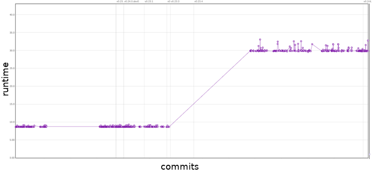

# pandas | Python Data Analysis Library

| [Shaad Alaka](https://github.com/Archer6621) | [Max Lopes Cunha](https://github.com/GreybeardCG) | [Max van Deursen](http://github.com/maxvandeursen) | [Jop Vermeer](https://github.com/jopenmolles) |
|-|-|-|-|

## Table of Contents
1. [Introduction](#introduction)
2. [Stakeholders](#stakeholders)
3. [Context View](#context-view)
4. [Development View](#development-view)
5. [Performance Perspective](#performance-perspective)
6. [Technical Debt](#technical-debt)
7. [Conclusion](#conclusion)

* [Appendix A: Core Team](#appendix-a-core-team)
* [Appendix B: Suppliers](#appendix-b-suppliers)
* [Appendix C: Pull request analysis](#appendix-c-decision-making-analysis)
* [Appendix D: Code Coverage](#appendix-d-code-coverage)

## Introduction
Pandas is an open source data analysis toolkit for Python which has enabled millions of users to perform complex data analysis in a relatively simple way. According to its creator, Wes McKinney, the package is meant to accelerate the data analysis workflow and reduce the need for people to deal with technical issues. It is currently used all over the world, with 5-10 million users worldwide. This chapter contains a collection of views and perspectives on pandas' architecture. 

The development of pandas was started by Wes McKinney around 2008, who at the time was employed at AQR Capital Management. Wes sought to create a toolkit that could provide an intuitive and highly performant way to manipulate data in commonly used formats. Predating pandas, data analysis required custom libraries to merge and combine different data formats [^podcast-reback]. 

Filling this niche helped pandas jump-start the adoption of Python in the data science and data analysis communities. Since 2012, the popularity of Python and pandas has been increasing rapidly, in part thanks to the pandas project [^quartz-pandas]. As seen in Figure 1, the amount of contributions spiked around this time as well, attracting a few loyal contributors over the years.

*Figure 1: An overview of the history of pandas and its main contributors.*

## Stakeholders
To provide insight into the stakeholders of pandas, we adapt the categories defined by Rozanski and Woods [^rozanski-woods-2012] in a way we believe is suitable for pandas. Afterwards, we provide a power-interest grid to visualize the relative importance and interest of different stakeholders in the project.

### Acquirers
Rozanski and Woods describe the acquirers of a product as stakeholders which oversee the procurement of the system [^rozanski-woods-2012]. Although pandas is now open source, it started as an in-house application at [AQR Capital Management](https://www.aqr.com/) in 2008 [^pandas-history]. Since 2015, [NumFOCUS](https://numfocus.org/) serves as the only fiscal sponsor of pandas [^pandas-governance].

### Assessors
Assessors oversee conformance of the project to standards and legal regulations [^rozanski-woods-2012]. Pandas complies to the BSD license [^pandas-package-overview]. The legal conformance of the library itself is overseen by the pandas core development team.

### Contributors
Since pandas is an open source software project, it is developed and maintained by contributors from all over the world. We observed two categories: community and enterprise contributors. Enterprise contributors distinguish themselves by explicit affiliation with a company, often tied with financial compensation.

Every contributor should comply to the contribution guide set by pandas [^pandas-contributing], which mentions that contributors should provide tests and documentation when implementing new features. Contributors are free to work on fixing relevant issues or new features.

The pandas governance also defines core team members; a group of contributors who contributed considerably to pandas and together ensure the long-time well-being of the project [^pandas-governance]. Wes McKinney fulfills the role of chair and Benevolent Dictator for Life, giving him authority to make final decisions about pandas. The complete team is listed in [Appendix A](#appendix-a-core-team). From the core team, we identified people which are active on recent issues and are therefore suitable to contact:
- Jeff Reback
- Joris van den Bossche
- Mark Garcia
- Tom Augspurger
- William Ayd
  
We contacted Joris van den Bossche about the pandas development team, leading to the following [PR](https://github.com/pandas-dev/pandas-governance/pull/9). Jeff Reback and Wes McKinney were already extensively interviewed [^podcast-reback] [^podcast-wes], answering all our questions, which made contacting them unnecessary.

Jeff Reback, Tom Augspurger and William Ayd can also be regarded as integrators as they are the ones labelling most issues and reviewing/merging PRs. 

Contributors can be categorized as either developer or maintainer, depending on whether they worked on features or bug-fixes [^rozanski-woods-2012]. Moreover, since contributions to pandas include documentation and tests as well, each contributor is a communicator and tester as well.

### Suppliers
Rozanski and Woods state that suppliers provide the software on which the product will run, or provide specialized staff for development or operation [^rozanski-woods-2012]. We distinguish between Software and Development suppliers:

- *Software Suppliers*: These suppliers provide software which is used when running pandas.
- *Development Suppliers*: These suppliers provide a service which is used in the development of pandas.

A full list of suppliers can be found in [Appendix B](#appendix-b-suppliers).

### Support Staff
Pandas does not have staff dedicated to support users with issues. However, they can receive help from the community in the following ways:
- Post a question on [StackOverflow](https://stackoverflow.com), where other users can answer the question.
- Consult the [pandas documentation](https://pandas.pydata.org/pandas-docs/stable/). Pandas provides users with an extensive documentation, in which all functionalities of pandas are described.
- Ask the developers on [Gitter](https://gitter.im/pydata/pandas). While primarily for development questions, the developers are happy to help users with other problems.

### System Administrators
According to Rozanski and Woods, system administrators operate systems after deployment. We deem this category irrelevant to pandas, since it is a data analysis library. Hence, no stakeholders fall into this category.

### Users
There are between five to ten million users of pandas world-wide [^marc-presentation], including major companies such as [Uber](https://www.uber.com/), [AQR](https://www.aqr.com/), [AppNexus](https://www.appnexus.com/) and [Datadog](https://www.datadoghq.com/) [^uber] [^pandas], as well as many research institutes and data analysts.

Apart from this, there are numerous libraries that integrate pandas functionality into their API. Examples of these libraries are: [Google Cloud BigQuery](https://cloud.google.com/bigquery/) [^bigquery], [Apache Arrow](https://arrow.apache.org/) [^apache-arrow], and [matplotlib](https://matplotlib.org/) [^pandas-matplotlib].

We distinguish two groups of users: the ordinary and the dependent users. The ordinary users are the majority: these users only install pandas and use it to analyze their data. On the other hand, the dependent users do not only install pandas, but also rely on pandas for their own projects, income or business value. An example of a dependent user is [Dask](https://dask.org/), which internally uses pandas [^dask].

### Competitors
There are several other tools available for data analysis with a similar feature set. These can be regarded as competitors of pandas. These competitors of pandas include [^excel] [^pandas-comparison] [^matlab]:  
- [MatLab](https://www.mathworks.com/products/matlab.html) 
- [Microsoft Excel](https://products.office.com/en/excel)
- [R](https://www.r-project.org/)
- [SAS](https://www.sas.com/en_us/home.html)
- [Stata](https://www.stata.com/) 
- SQL

### Ecosystem
Around pandas exists a whole ecosystem of tools to store, analyze, or visualize data. These tools work together or complement each other. Sometimes they also depend or build upon each other. This ecosystem helps pandas to remain focused on its functionality [^pandas-ecosystem]. Tools that fall into this ecosystem include [^bigquery] [^apache-arrow] [^pandas-matplotlib] [^pandas-ecosystem] [^apache-spark]:
- [Apache Arrow](https://arrow.apache.org/) 
- [Apache Spark](https://spark.apache.org/)
- [Dask](http://docs.dask.org/en/latest/)
- [Google BigQuery](https://cloud.google.com/bigquery/)
- [matplotlib](https://matplotlib.org/)
- [Ray](https://ray.readthedocs.io/en/latest/)
- [seaborn](https://seaborn.pydata.org/)
- [statmodels](https://www.statsmodels.org/stable/index.html)
- [Vaex](https://vaex.io/)

### Power-Interest Grid

To gain insight in the influence of stakeholders surrounding the pandas projects, one can look at the power-interest diagram seen in Figure 2. Although core members hold the most power, due to their experience and role of integrator, the pandas team is very open to suggestions from the community as well. We expect enterprise users to have more interest than individual users, with equal power. However, companies can project more power by hiring enterprise contributors. The project's direction is also influenced by competing tools, because pandas strives to stay relevant. Similarly, the ecosystem surrounding pandas steers the responsibilities and focus of pandas' development. 

*Figure 2: A power-interest grid according to our view of pandas.*

### Decision Making Analysis Results
We performed an extensive analysis of various information sources regarding the decision making process of the stakeholders, based on our pull request (PR) analysis in [Appendix C](#appendix-c-decision-making-analysis).

The core team is the most prominent group of stakeholders in the PRs. Most discussion is about adding or revising tests (e.g. in PR 12, 14, 16, 19, 20), even for non-existent or not fully implemented features. There are also comments on API-breaking changes, which are often deferred to new issues (e.g. in PR 13, 15, 16). Moreover, sometimes there is discussion on functionality that diverges from standards and/or scientific conventions (e.g. in PR 13, 16). Rebasing can also trigger discussions, since sometimes tests break unexpectedly after a rebase. Finally, performance is also taken into consideration (see [Performance Perspective](#performance-perspective)).

Ordinarily, a PR gets merged if it complies with the contribution guide's requirements: whether the appropriate tests were written, old tests pass, documentation is provided and common standards are followed. Most of the time, the person that guards these aspects is core team member Jeff Reback, who seems to be omnipresent among the pull requests.

For the rejected PRs, it is often the case that the PR is abandoned, because either the PR is superseded by another one (e.g. in PR 1, 2, 7) or because the original author no longer works on it (e.g. in PR 8, 9). Furthermore, PRs can be rejected if they break backwards compatibility; changes to core packages are typically not tolerated.

## Context View
To visualize the stakeholders, dependencies and competitors of pandas, we created the context view (see Figure 3). It describes the relationships between pandas and its environment. 

*Figure 3: Context view of pandas.*

Pandas is an open source project developed on [GitHub](https://github.com/pandas-dev/pandas) written in [Python](https://www.python.org/), with some parts using C extensions to increase performance for certain operations [^pandas-contributing], for which [Cython](https://cython.org/) is used. Pandas is tested via [pytest](https://docs.pytest.org/en/latest/#) and [Hypothesis](https://hypothesis.works/), with [Travis CI](https://travis-ci.org/) and [Azure Pipelines](https://azure.microsoft.com/en-us/services/devops/pipelines/) for continuous integration. Communication between the developers is done via [Gitter](https://gitter.im/pydata/pandas). Finally, pandas is released on [Anaconda Cloud](https://anaconda.org/) and [PyPI](https://pypi.org/).

Pandas is a data analysis tool that has several competitors with similar feature sets: [R](https://www.r-project.org/), [MatLab](https://www.mathworks.com/products/matlab.html), [Microsoft Excel](https://products.office.com/en/excel), [SAS](https://www.sas.com/en_us/home.html), [Stata](https://www.stata.com/) and SQL [^excel] [^pandas-comparison] [^matlab]. There are also other data analysis frameworks and tools that support or depend on pandas, some examples being: [Apache Arrow](https://arrow.apache.org/), [Apache Spark](https://spark.apache.org/), [seaborn](https://seaborn.pydata.org/), [Vaex](https://vaex.io/), [Dask](http://docs.dask.org/en/latest/), [statmodels](https://www.statsmodels.org/stable/index.html), [Google BigQuery](https://cloud.google.com/bigquery/), [Ray](https://ray.readthedocs.io/en/latest/) and [matplotlib](https://matplotlib.org/) [^bigquery] [^apache-arrow] [^pandas-matplotlib] [^pandas-ecosystem] [^apache-spark]. Pandas itself has 45 dependencies [^pandas-dependency-graph], some noteworthy dependencies are: [NumPy](http://www.numpy.org/), [Cython](https://cython.org/), [Matplotlib](https://matplotlib.org/), [python-dateutil](https://dateutil.readthedocs.io/en/stable/), [pytz](http://pytz.sourceforge.net/) and [Setuptools](https://setuptools.readthedocs.io/en/latest/) [^pandas-contributing] [^pandas-dependency].

Pandas is sponsored by [NumFOCUS](https://numfocus.org/) and is part of the [PyData](https://pydata.org/) program [^pydata-downloads], which is an educational program organized by NumFOCUS [^pydata-mission]. In Figure 4, we visualized the projects in the PyData program to show related data analysis tools.

*Figure 4: Data analytic tools in the PyData program.*

Because pandas is rapidly growing in terms of popularity, its scope and responsibilities are under discussion. Originally pandas used NumPy at its core, however due to pandas' rapid growth, NumPy's pace of change was not fast enough anymore. The deciding factor was adding support for categorical data; this was not possible using NumPy without an excessive amount of effort. There was a discussion whether pandas should take over NumPy's role or whether they should directly work on NumPy themselves. In the end, pandas chose to implement the missing features and data types themselves. This means that pandas' scope is changing from purely an data analytics frameworks to the standard for data objects in the Python community.

## Development View
To obtain insight into the architecture of the pandas repository, we focused on the Development Viewpoint described by Rozanski and Woods [^rozanski-woods-2012]. In this section, we describe the module organization, common processing, the standardization of both design and testing, and lastly the codeline organization. Notice that we do not cover the instrumentation concerns described by Rozanski and Woods, because pandas does not perform logging of runtime information, mainly due to pandas being a library instead of an application.

### Module Organization
Within the pandas project, a distinction is made between the core modules and the rest of the project. The rest of the modules are either utilities for specific domains (IO, error messages, patterns, etc.), tests, compatibility features for older Python versions, or extensions of pandas (plotting, time series, etc.). These make up the outskirts of the pandas codebase. An overview of the codebase can be viewed in Figure 5. Evident is that the `io` and `core` packages contain the largest amount of code, and that the `io` and `_libs` packages consist mostly of C code. Notable is the relative size of the `io` package compared to the core package, indicating that pandas is quite invested in IO operations. Lastly, the `_libs` package consists of entirely C and Cython code. This package contains highly optimized code, used in other parts of the library.

In the `core` package, functionality is split up and grouped in subpackages. In Figure 5, this is evident from the subpackages in each package, with the `groupby` package as an example to split the grouping functionality from the rest of `core`. However, the splitting of modules is not universally enforced, evident from, for example, the DataFrame module `frame.py`, which contains a lot of different functionality. Members of the core development team have expressed an interest in trying to refactor some of these large modules, but have also mentioned that they do not know how to split them up properly due to all of the coupling between the features within them [^reorganize-megamodules].

*Figure 5: Overview of the file organization. The color indicates the file type, while the area of the rectangles represents the size of a source file.*

Figure 6 shows a subset of the modules (those that are greater than 65Kb in size) along with the dependencies between these modules. Due to the sheer amount of dependencies and modules, not all dependencies could be visualized in readable manner. We focused on the relations in the `core` package. Even with this reduced visualization, it shows that there is a lot of tight coupling among pandas' modules, including quite a few circular dependencies (e.g. between `frame` and `series`).

*Figure 6: Dependency graph of pandas' largest `core` modules. The larger a module, the darker its color is. Only files which are greater than 65Kb in size are included to improve readability.*

### Common Processing
There are three areas in which common functionality is defined. First, there are the `common.py` modules present in some packages, for example in `core`. These modules include functions which are used throughout the code and which have generic applications, such as flattening data structures. Moreover, there is the `util` package, which provides functionality which enhances the developers' efficiency, such as decorators. Lastly, there is the `io` package, which is used to import and export from various data formats, like `csv` and `excel` files.

### Standardization of Design
Pandas describes an extensive way of creating a consistent code base in its contribution guide [^pandas-contributing]. This guide describes standards for its Python and C code, as well as for its documentation. Continuous Integration is used to enforce these standards.

Pandas does not explicitly document any design choices on a system basis. However, we did identify a recurring pattern in the code. There are multiple packages, which provide functionality to the main datatypes of pandas: Series and DataFrame. This means that the functionality of both these datatypes is abstracted to another package. An example of this can be found in the `groupby` package, which provides grouping functionality for data in DataFrames.

### Standardization of Testing
The testing framework used in pandas is [pytest](http://docs.pytest.org/en/latest/). The contribution guide encourages the use of Test Driven Development, showing that pandas takes testing seriously. Although the guide does state that the test modules should be placed inside of the testing subdirectory of the package under testing (e.g. the tests for `core/frame.py` should be under `tests/core/`), there are no other explicitly stated styling standards enforced on the tests; the guide encourages to look at other tests for inspiration. However, there is a specific testing page on the wiki [^pandas-testing], which describes the methodology to accomplish certain testing objectives, such as testing methods using files, or network connection.

Similarly to the coding standards, the tests are ran by CI as well for each contribution, failing the build whenever a test fails. Moreover, pandas utilizes [Codecov](https://codecov.io/) to view the difference in line coverage between the contribution and the master branch. This statistic is used as well to determine whether more tests have to be added to the contribution.

### Codeline Organization

*Figure 7: Directory structure of the pandas repository. The dotted lines indicate one or more subdirectories or files being ommitted from the image.*

The pandas project includes more than just the source modules described in the [module organization](#module-organization) section. Figure 7 shows an overview of the complete project, which include the following directories:
- The `doc` directory contains all assets for building the documentation. In this directory, many `reStructuredText` files are present, which are used for building the documentation using [Sphinx](http://www.sphinx-doc.org/en/master/).
- The `asv_bench` directory provides configuration for the benchmarking software [Airspeed Velocity](https://asv.readthedocs.io/en/stable/) (asv). 
- The `ci` folder includes all configuration for both [Azure Pipelines](https://azure.microsoft.com/en-us/services/devops/pipelines/) and [Travis CI](https://travis-ci.org/), to perform static analysis on the code for pull requests.
- The `conda.recipe` directory contains build scripts for [Anaconda](https://anaconda.com). 
- `LICENSES` contains all licenses of third party software used in the development of pandas. 
- The `scripts` directory includes scripts which are used to simplify processes that are specific to contributors, such as testing or static analysis.

There are also some miscellaneous files in the root directory of the pandas project, including files related to [Git](https://git-scm.com/) and [GitHub](https://github.com).

## Performance Perspective
For a library that deals with very large data sets on a regular basis, performance is a crucial aspect. For pandas, delivering good performance is therefore one of the key goals, allowing data analysts to effectively analyze very large data sets. Most of pandas is written in Python, but certain operations are sped up using C (mostly using Cython) [^pandas-contributing], which allows for performance improvements that decrease the execution time up to 200 times [^pandas-performance]. Some other parts use [Numba](https://numba.pydata.org/), which is a just-in-time compiler that translates Python and [NumPy](https://www.numpy.org/) code to native machine instructions, leading to C-like performance [^pandas-performance] [^numba]. Numba is best applied to methods that apply numerical functions to NumPy arrays. Furthermore, for very large data sets, pandas has an `eval()` expression evaluation method, which in certain scenarios can give an ~2 times performance increase, since it provides out-of-core computation and can be run in parallel [^pandas-contributing].

The main performance concern of pandas is how long certain operations take, to create acceptable performance levels for large data sets. Pandas uses the [Airspeed Velocity](https://asv.readthedocs.io/en/stable/) (asv) benchmark to compare the performance of their codebase with previous versions. This benchmark contains a plot for each method showing how the speed evolved over each iteration of pandas. The asv benchmark is ran continuously (can be found [here](http://pandas.pydata.org/speed/pandas/)) and is used to determine, in a systematic way, whether the performance of pandas did not regress and if it did, it shows what functions are affected. 

The performance requirement of pandas is not well defined, but it should perform similar to other data analysis tools and frameworks, enabling data scientists to work with large data sets. Therefore, the performance of pandas is often compared to those similar tools and frameworks by third parties (for example [Fast-Pandas](https://github.com/mm-mansour/Fast-Pandas) and [db-benchmark](https://h2oai.github.io/db-benchmark/)). On the pandas GitHub repository, users can submit their performance issues, which will then be labelled with the `Performance` label (As of 11 March 2019, 5.5% of all of pandas' issues are labelled with the `Performance` label). The core development team actively takes part in discussing these issues, asking the developers, that are working on the issue, to run the asv benchmark locally and post the results in the PR [^pandas-issue-post-asv]. If the methods in question are not yet included in the asv benchmark, they will also ask the developers to update the benchmark to be able to automatically measure the performance/regression of the methods in the future [^pandas-issue-update-asv].

### Analysis of Airspeed Velocity Benchmark

In the asv benchmark we can see that sudden extreme changes in runtime are often fixed swiftly, resulting in peaks in the plots. One example of this can be seen in Figure 8 of the `add-overflow-scalar` function under the `binary_ops` section. We also noticed that regression in future versions was minimal if an effort was made to speed up a method. However, the methods that went without a speed up, often have one large performance decrease, after which their performance remains constant. One example of this can be seen in Figure 9, which shows the benchmark of the `add_overflow_arr_mask_nan` function under the `binary_ops` section. Most of the time, the performance remains constant. If however, a performance change occurs, it is rarely gradual, instead the performance will often jump drastically from one version to the next.

*Figure 8: Benchmark of `add-overflow-scalar` under the `binary_ops` section. The x-axis are commits in chronological order, the y-axis is the runtime of the function. The up to date benchmark can be found [here]().*

*Figure 9: Benchmark of `add_overflow_arr_mask_nan` under the `binary_ops` section. The x-axis are commits in chronological order, the y-axis is the runtime of the function. The up to date benchmark can be found [here](http://pandas.pydata.org/speed/pandas/#binary_ops.AddOverflowArray.time_add_overflow_arr_mask_nan).*

An example of how the asv benchmark is used can be seen in issue [#18532](https://github.com/pandas-dev/pandas/issues/18532#issuecomment-385190350). The core development team noticed a regression in the `Series` constructor. In a [follow-up PR](https://github.com/pandas-dev/pandas/pull/20865) this was fixed and that performance has been maintained since then. This increase in performance can be observed in Figure 10, where we see a sharp drop in runtime from 369ms to 155µs.

*Figure 10: Benchmark of the `Series` constructor method. The x-axis are commits in chronological order, the y-axis is the runtime of the function. The up to date benchmark can be found [here](http://pandas.pydata.org/speed/pandas/#series_methods.SeriesConstructor.time_constructor?p-data=None).*

## Technical Debt

In this section, we analyze the technical debt of the pandas project. First we analyze the code and testing debt of pandas. Lastly, we investigate how the developers discuss the technical debt.

### Automatic Analysis

[SonarQube](https://www.sonarqube.org/) was used to assess the technical debt in pandas. SonarQube is able to determine the amount of bugs, vulnerabilities, technical debt, code smells and the amount of duplication. Unfortunately SonarQube was not able to automatically provide the code coverage, but for this, other tools were used (see the [Testing Debt](#testing-debt) section). As can be seen in Figure 11, pandas has 70 days worth of technical debt, but still gets an A rating. Projects will receive an A rating when the technical debt is less than 5% of the total code base. Since pandas itself is 256k lines of code (according to SonarQube), this seems reasonable.

*Figure 11: SonarQube's dashboard for the pandas project.*

SonarQube found 4.6k code smells, of which 2.4k are about deprecated HTML attributes estimated to be 25 days of effort. Upon further inspection, these HTML attribute smells are all located in the test directory, verifying whether pandas can read from these HTML pages. This means that these are false positives.

The other most found code smells are (in decreasing order of occurrences): high cyclomatic complexity (even as high as 97), unconventional parameter and function names (often one letter names), commented-out code (often part of reminders of bugs or TODO's) and functions with too many parameters. The functions that have too many parameters are mostly in the user-facing API methods (e.g. `to_csv`). Most of the parameters are initialized with a default value, but can be configured by the user to fit his/her purpose more. Thus we find these to be false positives as well.

Of the 654 bugs found by SonarQube, 499 are deprecated HTML elements and tags, in the same classes as before in the code smells. Most of the remaining bugs are that of identical sub-expressions on both sides of (in)equality operators (134 occurrences). These are all found in the test methods, to test the overrides of the equality methods. Thus at least 633 of the found bugs are false positives.

### Manual Analysis

To further quantify the state of technical debt in pandas, we analyzed to what degree pandas adheres to the SOLID principles.

#### Single Responsibility Principle (SRP)

We consider responsibilities on a module basis in addition to just classes. In many modules, multiple class definitions were found. Table 1 shows the largest 10 modules in terms of method definitions. The largest module appears to be `pytables.py`, with 272 definitions among 33 classes that are abstractions of different types of tables and utility objects. In this case, each table type does have a clear responsibility, but the module does not. For example, `generic.py` contains 220 function definitions stemming from a single class, clearly carrying many responsibilities.

*Table 1:  10 largest modules of pandas in terms of function definitions.*
| Module name      | Number of function definitions     |
| :------------- | :----------: |
|  `pytables.py` | 272  |
| `generic.py`   | 232 |
|  `base.py` | 216  |
| `blocks.py`   | 185 |
|  `frame.py` | 151  |
| `_core_.py`   | 144 |
|  `offsets.py` | 139  |
| `series.py`   | 131 |
|  `window.py` | 125  |
| `managers.py`   | 125 |

#### Open-Closed Principle (OCP)

For the OCP we look at how extendible the code is. In general, extending in pandas is made easier by allowing users to decorate existing packages without sub-classing them [^pandas-extensions]. This can be convenient, but can break the open-closed principle. Pandas has several occurrences of OCP violations, for example private variables that are not exposed for extension (e.g. `core/computation/ops.py`). Lastly, most of the optimized Cython code is difficult to cleanly extend.

#### Liskov Substitution Principle (LSP)

In terms of LSP, it is hard to find potential violations in pandas, since it rarely occurs that subclasses in inheritance relations override existing 
behavior. Especially since many super-classes in pandas only have one child. Python is also not statically typed, hence looking for type casting is not a useful heuristic.

We observed one instance were behavior overriding did occur: the [`pandas.io.sql`](https://github.com/pandas-dev/pandas/blob/79205ea8a6aac4c82a1572276ede7510f5a38e8e/pandas/io/sql.py) module. For each of the overridden methods in `SQLiteTable`the pre-conditions were equal and the post-conditions were at least as strong than its super-class. This means that pandas seems to comply to the LSP for this instance.

#### Interface Segregation Principle (ISP)
For the interface-segregation principle we checked the amount and relevance of functions provided when importing a package. In Python, ISP can be tricky, as it does not cleanly allow interfacing of code, so implementations are used directly.

A violation can be found by importing pandas: `import pandas as pd`. Over 50 functions, fields and casses are returned when inspecting `pd`. One would expect the `pd` object to contain purely user-side code, but there are various functions that do not directly relate to each other and are often irrelevant to the user.

#### Dependency Inversion Principle (DIP)
Lastly, from the developer's view we consider core code depending on non-core code to be a DIP violation. From the user-side, it is a violation whenever a user can reach core code. A quick inspection using `import pandas as pd` reveals that core modules are abstracted away neatly; they cannot be reached. However, we see multiple occurrences of core modules importing and tightly coupling with non-core modules (e.g. `pytables.py` importing `io` modules).

### Testing Debt
As mentioned in the [standardization of testing](#standardization-of-testing) section, pandas takes testing seriously. Codecov is used to analyze the current line coverage of Python code within the repository. The C code is not taken into consideration for the analysis since it is generated through Cython. In [Appendix D](#appendix-d-code-coverage), the coverage for the master branch is presented, showing that 91.2% of the 52.977 lines are covered. Some visualizations from Codecov are displayed in Figure 12 below.

*Figure 12: Two code coverages perspectives generated by Codecov. The left picture is a grid overview, with rectangles being files. On the right, a view is given in the form of sub-directory layers. The size of a rectangle represents the size of the file and the color represents the number of tested lines.*

Using both [Appendix D](#appendix-d-code-coverage) and Figure 12, we identify three packages and modules of interest: the `core/panel.py` module, as well as the `compat` and `plotting` packages.

The pandas team is currently in the process of completely removing `core/panel.py`, which has been deprecated since pandas version 0.20 [^pandas-panel]. Hence, no further maintenance is being performed on the module, explaining the low coverage.

Two other packages that are not well tested are `compat` (for NumPy compatibility) and `plotting` (for matplotlib support), with 63.32% and 72.72% line coverage respectively. The main part of uncovered code in the `compat` package is that of initialization with Python 2.7. Since pandas is dropping support for Python 2.7 in 2020 and all new feature releases will be in Python 3 only [^pandas-2.7-drop], this code is soon to be deprecated and removed. In the `plotting` package however, code in `_converter.py` is largely untested. This likely stems from dealing with the `matplotlib` integration, which complicates the process.

Overall, we can say that pandas tests their Python code quite well, with the main low-coverage offenders being deprecated code.

### Historical Analysis
We analyzed the technical debt using SonarQube for all main releases of pandas and created the plots seen in Figure 13. In these plots, we ignored the technical debt introduced by the HTML files, as they are false positives and correspond to more than half of the total amount of technical debt (as discussed in [Automatic Analysis](#automatic-analysis)). We can see that the amount of code, technical debt and code smells increases linearly over the different releases. We can also see that the newest main release (v0.24.0) brings a decrease in the technical debt and code smells, while still introducing more lines of code. 

*Figure 13: History of technical debt of the pandas project, excluding the HTML files.*

### Technical Debt Discussions
Technical debt is an important subject for discussion in the pandas team. A lot of insights in how technical debt is discussed can be gained from the pandas mailing list and from the way the developers use constructs such as FIXMEs and TODOs.

At the end of 2015, pandas' fast growth was a key reason for the core team to start discussing major refactorings via their mailing list. Wes McKinney was pushing for large internal refactorings to expose less of the core to the end-users [^ml-2016-January]. It was mentioned that some features, required a large amount of effort due to the architectural issues with pandas and its over-reliance on NumPy's `ndarray` data format, which did not properly support the new needs of pandas (e.g. categorical data). Later on, there was discussion about releasing pandas 1.0, so that the focus could shift to bug-fixing. The idea was to start a new pandas 2.0 development branch for the major refactorings [^ml-2016-July]. However, Joris van den Bossche indicated that this may hinder contributors, since new feature PRs would then not be welcome on either branches. Pandas 2.0 is still actively discussed and pandas' creator Wes McKinney has shifted his attention to Apache Arrow, which is intended to be at the core of pandas 2.0 [^pandas-20] [^wes-blog-pandas-20] [^podcast-wes]. The mailing list also contains lots of discussions about smaller technical debt issues, an example being a violation of the DRY principle, where both Series and DataFrame had a subclass for sparse data [^ml-2018-November]. 

The pandas developers also make use of FIXMEs and TODOs to discuss about technical debt. We analyzed the FIXME and TODOs at the repository's state from [commit 79205ea](https://github.com/pandas-dev/pandas/tree/79205ea8a6aac4c82a1572276ede7510f5a38e8e/pandas/tests/io). It became apparent that FIXMEs and TODOs are rarely linked to GitHub issues, making it hard to determine whether they were already taken care of. Most of the FIXME comments are in test modules, which seems to indicate that the test modules are suffering from technical debt. TODOs are more present in non-test modules. [`ops.py`](https://github.com/pandas-dev/pandas/blob/79205ea8a6aac4c82a1572276ede7510f5a38e8e/pandas/core/ops.py) was one of the non-test modules that had GitHub issues and PRs associated with its FIXMEs ([5284](https://github.com/pandas-dev/pandas/issues/5284), [5035](https://github.com/pandas-dev/pandas/issues/5035), [19448](https://github.com/pandas-dev/pandas/pull/19448)). Noteworthy is that the linked PR is not really related to the described issue, but rather where it came up in.

### Before-After Analysis Of Technical Debt Issue
We decided to contribute to pandas by solving an SRP violation that we identified [^issue-test-split]. Before our refactor, there was a single test module for all the sparse series tests. This clearly violated the SRP principle, since it took responsibility over all the features of sparse series.

The refactor involved categorizing the individual tests of the original module, so that they could be moved to smaller and more specific modules. These are then responsible for testing specific types of functionality, much like how the regular series tests are split up into constructor, api, missing, indexing, and other types of tests.

After the refactor, this module was split up into smaller modules, hence eliminating the SRP violation, since all of the smaller modules now have a single responsibility.

## Conclusion
Pandas is an ever growing library for data analysis and is becoming the new standard in the Python community. We have analyzed pandas from different perspectives and viewpoints and found that pandas is awaiting large refactorings. Although pandas does not have a large amount of technical debt, its rapid growth is becoming a problem as its dependencies can not keep up with the growth. Due to this, the responsibilities of pandas are increasing, requiring a philosophical and architectural shift, that will ultimately benefit the usability of the stack. Pandas' creator Wes Mckinney has shifted his attention to Apache Arrow, which should unify the management of in-memory data representations across different toolkits and languages, which pandas 2.0 will also rely on. All in all, pandas is here to stay and is only becoming larger.

## Appendix A: Core Team

*Table 2: The complete core team as documented by the pandas governance repository [^pandas-people].*

| Full Name | GitHub Handle |
|-----------|---------------|
| Andy Hayden | [@hayd](https://github.com/hayd) |
| Brock Mendel | [@jbrockmendel](https://github.com/jbrockmendel) |
| Chang She | [@changhiskhan](https://github.com/changhiskhan) |
| Chris Bartak | [ @chris-b1](https://github.com/chris-b1) |
| G. Young | [@gfyoung](https://github.com/gfyoung) |
| Jeff Reback | [@jreback](https://github.com/jreback) |
| Jeremy Schendel | [@jschendel](https://github.com/jschendel) |
|Joris van den Bossche | [@jorisvandenbossche](https://github.com/jorisvandenbossche) |
| Marc Garcia | [@datapythonista](https://github.com/datapythonista) |
| Masaaki Horikoshi | [@sinhrks](https://github.com/sinhrks) |
| Matthew Roeschke | [@mroeschke](https://github.com/mroeschke) |
| Phillip Cloud | [@cpcloud](https://github.com/cpcloud) |
| Pietro Battiston | [@toobaz](https://github.com/toobaz) |
| Stephan Hoyer | [@shoyer](https://github.com/shoyer) |
| Tom Augspurger | [@tomaugspurger](https://github.com/tomaugspurger) |
| Wes McKinney | [@wesm](https://github.com/wesm) |
| William Ayd | [@willayd](https://github.com/willayd) |

## Appendix B: Suppliers

*Table 3: Suppliers of the pandas library*

|Supplier | Type | Role |
|--|--|--|
|Python|Software|Language in which pandas is written|
|C/Cython|Software|Language in which pandas is written, and a program to bundle this with the Python code|
|PyPI|Software|Package manager used to retrieve dependencies|
|Dependencies|Software|Libraries from which functionality is used by pandas|
|GitHub|Development|Hosts the repository where pandas is developed|
|Gitter|Development|Communication platform of pandas developers|
|Azure Pipelines|Development|Continuous Integration used to analyze the code statically|
|TravisCI|Development|Continuous Integration used to analyze the code statically.|

## Appendix C: Decision making analysis

In order to analyze the decision making process, we analyzed 10 rejected and 10 accepted pull requests, along with consulting other sources such as mailing lists, conference slides, the contribution guide, gitter, and other miscellaneous sources.

### Pull Request Analysis Methodology 
To analyze the pull-requests, we combined the recommended way of doing it with some automation. We went into the pull request and collected the following contextual information: author, timespan, what the PR touches, reason for closing (if applicable), preceding issues, reviewers and finally, interesting notes. This mirrors what was suggested for collecting contextual information.

Then, instead of tagging the PRs manually, we automated the process using pandas itself together with Matplotlib. To tag the data, we first looked through some PRs manually to determine good tags to categorize the comments with. From this, we found trends that kept re-occuring and were easy to identify: git-related discussion, naming conventions, testing, and documentation. Anything that would not fit these categories, would be considered as feature-specific or other discussion.

Then we found some words that were frequently mentioned in one form or another for each of these categories, e.g. for the git tag we used the following list of regex patterns:

`"git" : [r"squash(ed)?",r"rebas(e)?", r"\bgit\b", "push", r"merge( conflict)?", r"pull( request)?", "commit"]`

Similar lists exist for the other categories. Upon review, the categorization yielded good results, with relatively few false positives. To better follow conversations, we added another tweak: if the algorithm could not find a new specific tag, it would use the tag of the previous comment instead of labelling it as feature/other. This yielded much better results than before, with a slight increase in false positives. Another addition that improved results was always re-checking the tag when entering a review comment chain. Most of this could be done because of temporal dependency between comments: related comments often are grouped together closely in time [^gaumont-2016]. The system could be improved even further if it would consider users being tagged in replies (for replies to comments that are far apart from the original in terms of time).

Overall, the tagging yields a swarm plot, which visualizes the density of activity at various time periods for each of the tags, a pie chart that shows the distribution of tags among the comments, and a sequence plot that visualizes the ordering of comment tags in time more clearly. Aside from that, an additional pie chart of the user activity is also made, where any user with less than 2% of the comments is grouped under the category "other".

### Most Discussed Rejected Pull Requests

#### 1. [ENH: Google BigQuery IO Module #4140](https://github.com/pandas-dev/pandas/pull/4140)

##### Context

- Author: sean-schaefer
- Timespan: 2013-07 : 2013-10
- Touches: Integration of the pandas.io.gbq module for integration with Google's BigQuery
- Reason closed: Superseded by other pull request: [#5179](https://github.com/pandas-dev/pandas/pull/5179).
- Preceding issues: N/A
- Reviewers: cpcloud (main), jreback (comments), jratner
- Notes:
    - This PR required some communication between Google's backend team and the pandas contributors.
    - There was a significant discussion after closing the PR about a continuation.
    - This PR required some communication between Google's backend team and the pandas contributors because they found a bug in Google BigQuery.

##### Summarizing Visualizations

Most of the activity on this PR seemed to be happen two days after its creation, with quite a bit of discussion on testing and other non-feature related subjects.

<!--
> Concerned integration of the pandas.io.gbq module for Google's BigQuery. This PR required some communication between Google's backend team and the Pandas Contributors. The issue was closed because the fixes were merged through a triplet of other commits. -->

#### 2. [ENH: Adding origin parameter in pd.to_datetime #11470 ](https://github.com/pandas-dev/pandas/pull/11470)
##### Context
- Author: sumitbinnani
- Timespan: 2015-10 : 2017-03
- Touches: to_datetime method. Concerned adding a parameter to the pandas datetime module that allowed the user to set a time-origin
- Reason closed: Superseeded by other pull request: [#15828](https://github.com/pandas-dev/pandas/pull/15828)
- Preceding issues: [#11276](https://github.com/pandas-dev/pandas/issues/11276), [#11745](https://github.com/pandas-dev/pandas/issues/11745)
- Reviewers: jreback (main), shoyer, jorisvandenbossche.
- Notes:
    - An important request for this feature was adding the origin of the date-time as a parameter.
    - `jreback` spent quite some time guiding `sumitbinnani` in polishing his work.

##### Summarizing Visualizations

The main discussion here was clearly between `jreback` and `sumitbinnani`. This PR was also open for quite a long time (nearly 1.5 years) with some bursts of discussions here and there.

<!--
>Concerned adding a parameter to the pandas datetime module that allowed the user to set a time-origin, e.g. epoch, the Julian calendar, etc. After a rebase/update, this PR was closed and superseeded by issue #15828. 
>-->

#### 3. [ENH/REF: More options for interpolation and fillna #4915](https://github.com/pandas-dev/pandas/pull/4915) 
##### Context
- Author: tomaugspurger
- Timespan: 2013-09 : 2013-10
- Touches: interpolation and fillna, adding more options.
- Reason closed: Pull request had to be squashed and a new pull request was made for this addition. Only a link to the [merge commit](https://github.com/pandas-dev/pandas/commit/aff7346f3be41d1b190f311f862653b6088e2ad7) was found.
- Preceding issues: [#1892](https://github.com/pandas-dev/pandas/issues/1892), [#4434](https://github.com/pandas-dev/pandas/issues/4434)
- Reviewers: jreback (main), cpcloud, jratner.
- Notes: 
    - The review process shows `jreback` guiding `TomAugspurger` intensively to work out his  contribution.
    - The enhancement was appreciated, but had to be squashed and a new PR was made

##### Summarizing Visualizations

As established, the main discussion here was between `jreback` and `TomAugspurger`. Quite a bit of comments on documentation towards the end.

#### 4. [ENH: add downcast to pd.to_numeric #13425](https://github.com/pandas-dev/pandas/pull/13425)
##### Context
- Author: gfyoung
- Timespan: 2016-06 : 2016-07
- Touches: to_numeric method. Concerned a change to the API for reading CSV's. Two functions had to be moved outside of the parser.
- Reason closed: Contribution was included in another pull request.
- Preceding issues: [#13352](https://github.com/pandas-dev/pandas/issues/13352)
- Reviewers: jreback (main), jorisvandenbossche
- Notes:
    - The API changes generated quite some discussion.

##### Summarizing Visualizations

The main discussion here is between `gfyoung` and `jreback`. There was quite a bit of discussion about git and CI at the beginning of the PR, which happened to be because of failing Travis builds.

#### 5. [ENH: ignoring comment lines and empty lines in CSV files #7470](https://github.com/pandas-dev/pandas/pull/7470)
##### Context
- Author: mdmueller
- Timespan: 2014-06 : 2014-09
- Touches: CSV reader. Concerned an enhancement to the CSV reader to ignore empty lines.
- Reason closed: Pull request was squashed into one commit and merged through [that commit](https://github.com/pandas-dev/pandas/commit/31c2558b33d727d6bd2fcb21f97e49d5a016513f) instead of the pull request.
- Preceding issues: [#4466](https://github.com/pandas-dev/pandas/issues/4466)
- Reviewer: jreback (main), jorisvandenbossche.
- Notes:
    - A large chunk of discussion between `jreback` and `mdmueller` was about debugging a failing Travis build. 
    - The conversation was closed after discussing some documentation.

##### Summarizing Visualizations

A confirmation of the main discussion between `jreback` and `mdmueller`. The PR seems to be dotted with remarks on git related matters, which may be related to debugging the failing Travis build.

#### 6. [ENH: Cleanup backend for Offsets and Period #5148](https://github.com/pandas-dev/pandas/pull/5148)
##### Context
- Author: cancan101
- Timespan: 2013-10 : 2014-06
- Touches: Offsets and Period backend. Concerned a cleanup enhancement of the backend. 
- Reason closed: Pull request fixed to many issues at once, requiring major rebase.
- Preceding issues: [#5306](https://github.com/pandas-dev/pandas/issues/5306), [#5082](https://github.com/pandas-dev/pandas/issues/5082), [#5028](https://github.com/pandas-dev/pandas/issues/5028), [#4878](https://github.com/pandas-dev/pandas/issues/4878), [#5418](https://github.com/pandas-dev/pandas/issues/5418).
- Reviewers: jratner (main), jreback
- Notes:
    - The user `nehalecky` briefly commented that they hoped to see the PR merged asap and thank cancan101 for their work.
    - `jreback` (only) appeared  to close the PR, stating that a major rebase was required before acceptance and that they wanted separate PR's for each issue.
    - The main discussion was about finding a clean way to integrate the work made in cython and some refactorings to make the changes neater.

##### Summarizing Visualizations

The large amount of git discussion stands out, probably due to the major rebase that was required to merge this PR properly. Mainly `jreback`, `cancan101` and `jratner` discussing this. The PR was open for quite a bit of time, close to year, and activity seemed to happen mainly in bursts between March and May 2014, after which the PR lay dormant for quite a while longer.

#### 7. [WIP: use eval expression parsing as replacement for Term in HDFStore #4155](https://github.com/pandas-dev/pandas/pull/4155)
##### Context
- Author: jreback
- Timespan: 2013-07 : 2013-07
- Touches: HDFStore Term. Concerned a larger commit about extending the work of user cpcloud on eval expressions.
- Reason closed: Superseeded by another pull request: [#4162](https://github.com/pandas-dev/pandas/pull/4162).
- Preceding issues: [PR#4037](https://github.com/pandas-dev/pandas/pull/4037), [#3393](https://github.com/pandas-dev/pandas/issues/3393).
- Reviewers: cpcloud (main), meteore (comments)
- Notes:
    - The user `meteore` was a user of pandas interested in this change for their own use-cases, supporting the developers with additional insight and questions.

##### Summarizing Visualizations

A lot of comments on naming in this, but this is a false positive, as most of the naming-related comments were about the feature itself regarding the `name` field in one of the classes. The git discussion towards the end seemed to be about redirecting the efforts to a single PR on the subject to have everything in one place.

#### 8. [ WIP/API/ENH: IntervalIndex #8707](https://github.com/pandas-dev/pandas/pull/8707)
##### Context
- Author: shoyer
- Timespan: 2014-11 : 2017-03
- Touches: IntervalIndex for expressing intervals. Concerned an enhancement for adding support for expressing intervals.
- Reason closed: Pull request could not be finished by shoyer due to lack of time.
- Preceding issues: [#7640](https://github.com/pandas-dev/pandas/issues/7640), [#8625](https://github.com/pandas-dev/pandas/issues/8625).
- Reviewers: jreback (main), jorisvandenbossche
- Notes:
    - BDFL wesm entered the discussion, suggesting to move the code to the new indexes package.
    - Closed on Sep 10, 2016 by `jreback` because `shoyer` indicated he did not have the time to finish the tests, documentation and Cython optimizations. `jreback` expressed interest in taking it over later on and continue working on it.
    - Most discussion was about the right way to express the interval, including technical performance concerns related to materialization of the dataframes.

##### Summarizing Visualizations

Main dicussion between `shoyer` and `jreback`, quite a bit of discussion on documentation, this seemed to stem from the fact that `shoyer` forgot some doc strings for his newly added features which was pointed out during code reviews.

<!-- > Concerned an enhancement for adding support for expressing intervals. The request for the Interval class came from `jreback` (issue #8625) and a proposal was made by `shoyer` (issue #7640). Most discussion was about the right way to express the interval, including technical performance concerns related to materialization of the dataframes. The PR was not merged because `shoyer` did not have the time to work on it anymore. It was merged in a follow-up by `jreback` on April 14, 2017. -->

#### 9. [ENH/API: DataFrame.stack() support for level=None, sequentially=True/False, and NaN level values. #9023](https://github.com/pandas-dev/pandas/pull/9023)
##### Context
- Author: seth-p
- Timespan: 2014-12 : 2016-01
- Touches: stack method of DataFrame
- Reason closed: Pull request could not be finished by seth-p due to lack of time.
- Preceding issues: [#8851](https://github.com/pandas-dev/pandas/issues/8851), [#9399](https://github.com/pandas-dev/pandas/issues/9399), [#9406](https://github.com/pandas-dev/pandas/issues/9406), [#9533](https://github.com/pandas-dev/pandas/issues/9533).
- Reviewers: jreback (main), shoyer, jorisvandenbossche. 
- Notes:
    - Closed by `jreback` on Jan 20, 2016 because `seth-p` had no time to continue on it.
    - The latter half of the discussion was about setting up the virtual environent properly.
    - Most of the discussion was about the API implications. It was interesting to note that `shoyer` eventualy argued that an API change was preferred over a backwards-compatible 'hack'.

##### Summarizing Visualizations

Mainly `jreback` and `seth-p` discussing on this PR. A lot of git comments towards the end, mainly from rebase requests.

<!--
> Concerned an enhancement and API change for the stack-function in DataFrame. It was a bit unclear what the PR was about, because four separate issues were linked. [#8851](https://github.com/pandas-dev/pandas/issues/8851) was about the counterintuitive results one obtained when setting a stack level. [#9399](https://github.com/pandas-dev/pandas/issues/9399) was about inconsistent tests for MultiIndex. [#9406](https://github.com/pandas-dev/pandas/issues/9406) was about a bug where NaN values were obtained in stack and unstack. Lastly, [#9533](https://github.com/pandas-dev/pandas/issues/9533) was about adding dropna and sequentially support for DataFrame's unstack function. These fixes were all made by `seth-p`. The discussion was mostly between `seth-p` and `jreback`, with some comments / reviews from `shoyer` and `jorisvandenbossche`. Early discussion revolved around some 'unpythonic' code practice which `shoyer` and `jreback` did not like. The topic was about using sets instead of lists for determining the stack-level of a DataFrame, which `seth-p` argued would maintain backwards compatibility. Eventually, `shoyer` argues that changing the API wouldn't be likely to lead to large issues and be neater than hacking in a compatibility measure. -->

#### 10. [WIP: add top-level eval function #4037](https://github.com/pandas-dev/pandas/pull/4037)
##### Context
- Author: cpcloud
- Timespan: 2013-06 : 2013-07
- Touches: HDFStore Term
- Reason closed: Git history did not accurately depicted the history of contributions and hence another pull request was opened ([probably this one](https://github.com/pandas-dev/pandas/pull/4164)).
- Preceding issues: [#3393](https://github.com/pandas-dev/pandas/issues/3393).
- Reviewers: jreback (main), wesm(minor), dragoljub (comment), jratner (comment)
- Notes:
    - Much discussion revolved around the finer workings of parsing/interpreting the operators in the eval function.
    - Quite some discussion also revolves around the usage of git, in particular `cpcloud` and `jreback` trying to access each other's work.
    - We can observe that some functionality that was previously in the _pandas.core.expressions_ package was moved to _pandas.computation.expressions_.

##### Summarizing Visualizations

The only participants here were `cpcloud` and `jreback`.  As with PR7, the git discussion towards the end seemed to be about redirecting the efforts to a single PR on the subject to have everything in one place.

<!--
> Concerned, like #4155, the initial work on the eval function, later to be finalized by `jreback`. Most of the discussion is between `jreback` and `cpcloud`, regarding the design choices of this top-level function. In particular, much discussion revolved around the finer workings of parsing/interpreting the operators in the eval function. Quite some discussion also revolves around the usage of git, in particular `cpcloud` and `jreback` trying to access each other's work.

>  The code changes mostly affect the computation module/api, where several new scripts were added (align.py, engines.py, eval.py, expr.py) and changed. The changed code was mostly situated in the core and tests packages. We can also observe that some functionality that was previously in the _pandas.core.expressions_ package was moved to _pandas.computation.expressions_.

> - Opened by `cpcloud` on Jun 26, 2013. This PR closed issue [#3393](https://github.com/pandas-dev/pandas/issues/3393).
> - Closed by `cpcloud` on Jul 8, 2013. The PR was closed because the git-branches no longer accurately depicted the history of `jreback's` contributions. It was continued in aforementioned issue #4155 to have one neat PR.-->

### Most Discussed Merged Pull Requests

#### 11. [ENH: add expression evaluation functionality via eval #4164 ](https://github.com/pandas-dev/pandas/pull/4164)
##### Context
- Author: cpcloud
- Timespan: 2013-07 : 2013-09
- Touches: not a lot, it mostly adds new functionality. It basically allows string expressions to be parsed with a custom backend/engine to efficiently evaluate operations on dataframes. Also a lot of documentation added as well.
- Preceding issues: [#3393](https://github.com/pandas-dev/pandas/issues/3393), [#2560](https://github.com/pandas-dev/pandas/issues/2560)
- Reviewers: jreback, TomAugspurger
- Notes: 
    - It seems that this PR was more of a roadmap/checklist to getting that feature done mostly, however a bit of functionality/refactoring was added during the course of the PR which was not covered by the checkboxes (e.g. QueryEngine).

##### Summarizing Visualizations

Even though the PR was very large, the main discussion seemed to be between `cpcloud` and `jreback`, which makes sense given the previous PRs on this same feature were mostly discussed by them as well. The PR seemed to have a dead zone in the middle, with barely any activity, could be holiday-related.

<!-- > By `cpcloud` (2013-07, 2013-09). Natural syntax for queries, seems mainly like a convenience feature for users. Main discussion by core team: `cpcloud`, `jreback`, `wesm`. Also some other contributors: `jtratner`, `hayd`, `meteore`. It seems that this PR was more of a roadmap/checklist to getting that feature done mostly, it is not clear which checkboxes were still open at the beginning of the PR. A good chunk of discussion seems to be about the syntax and parsing, and not allowing fancier syntax before laying down a foundation for this feature first and make it similar to Numpy's indexing syntax, even though users tend to request nicer syntax in the PR. The main decision making process seems to be based on finishing the open checkboxes in the PR and then having all tests passing. One big challenge seems to be related to scope within the eval function, making it support local variables and dataframe columns (which may have colliding names). There are multiple code reviews through the course of the PR as well, mostly about documentation, naming and internal package locations. There's also quite a chunk of discussion scattered around the PR about git related things, e.g. rebases and squashing commits at various places.  -->

#### 12. [CLN/ENH/BLD: Remove need for 2to3 for Python 3. #4384](https://github.com/pandas-dev/pandas/pull/4384)
##### Context
- Author: jtratner
- Timespan: 2013-07, 2013-08
- Touches: nearly the entire project, since it makes the code base compatible between python 2 and 3
- Preceding issues: [#4375](https://github.com/pandas-dev/pandas/issues/4375), [#4372](https://github.com/pandas-dev/pandas/issues/4372)
- Reviewers: cpcloud, jreback
- Notes: n/a
<!-- > By `jtratner` (2013-07, 2013-08). Makes codebase compatible with Python 2 and 3 to remove dependencies for automatically doing that. Done by contributor `jtratner`. Main discussion between core team and `jtratner`, mostly about some failing tests, rebasing and some conventions. -->

##### Summarizing Visualizations

The main discussion here is between `jreback`, `cpcloud` and `jtratner`. Interestingly, most of the activity was in one month, before the holidays, and it got merged only after, hence the gap.

#### 13. [WIP: categoricals as an internal CategoricalBlock GH5313 #7217](https://github.com/pandas-dev/pandas/pull/7217)
##### Context
- Author: jreback
- Timespan: 2014-05, 2014-07
- Touches: any component in pandas that somehow manipulates or uses datatypes, such as the algorithms class, the dataframe class, etc. Also adds a new data class.
- Preceding issues: [#5313](https://github.com/pandas-dev/pandas/issues/5313), [#5314](https://github.com/pandas-dev/pandas/issues/5314), [#3943](https://github.com/pandas-dev/pandas/issues/3943)
- Reviewers: jankatins, njsmith
- Notes:
    - It seems that there is quite a bit of discussion on naming, API etc, as such core team member `jorisvandenbossche` intervenes with a proposal for creating some sort of design document for pandas to get these kind of points clear.
    - `jankatins` calls for help from the 'statistics side': `jseabold`, `josef-pkt`, `cancan101`, `kshedden`, `upandacross` and `cfarmer`, which appear to have experience with R.
    - This feature is quite desirable among the userbase because it brings in features from its competitor R.

##### Summarizing Visualizations

This PR had quite a lot of people involved, with leading discussion by `jankatins` and `jreback`. Quite a lot of discussion was devoted to things like git, testing, documentation. The comments on documentation towards the end was apparently because they were broken.

<!-- > By `jreback` (2014-05, 2014-07). Seems to be a rather big feature that adds support for categorical types, which seems like something that stems from the R language [(doc)](https://pandas.pydata.org/pandas-docs/stable/user_guide/categorical.html). PR from `jreback`. The main discussion is between `jreback` and contributor `jankatins` that reviewed the PR. It seems that there is quite a bit of discussion on naming, API etc, as such core team member `jorisvandenbossche` intervenes with a proposal for creating some sort of design document for pandas to get these kind of points clear. Then `jankatins` calls for help from the 'statistics side': `jseabold`, `josef-pkt`, `cancan101`, `kshedden`, `upandacross` and `cfarmer`, which appear to have experience with R. Core team member `shoyer` also comes in with some critical questions regarding the PR. It seems that this feature is wanted by many users. -->

#### 14. [ENH/BUG: Fix names, levels and labels handling in MultiIndex #4039](https://github.com/pandas-dev/pandas/pull/4039)
##### Context
- Author: jtratner
- Timespan: 2013-06, 2013-08
- Touches: See PR description, it has a nice summary.
- Preceeding issues: [#4202](https://github.com/pandas-dev/pandas/issues/4202), [#3714](https://github.com/pandas-dev/pandas/issues/3714), [#3742](https://github.com/pandas-dev/pandas/issues/3742)
- Reviewers: cpcloud, jreback
- Notes: n/a

##### Summarizing Visualizations

Naturally, a lot of comments on naming, as the PR is focused on this. The main discussion is between `jreback` and `jtratner`, with `cpcloud` also chiming in. The first half of the PR is very focused on naming conventions, while the second half was more about levels/labels.

<!-- > PR by `jtratner` (2013-06, 2013-08). Mainly core team discussing this fix. Mention on failing tests. -->

#### 15. [REF: DatetimeLikeArray #24024](https://github.com/pandas-dev/pandas/pull/24024)
##### Context
- Author: TomAugspurger
- Timespan: 2018-12, 2019-01
- Touches: anything related to dates, times and date/time differences.
- Preceding issues: [#4202](https://github.com/pandas-dev/pandas/issues/4202), [#3714](https://github.com/pandas-dev/pandas/issues/3714), [#3742](https://github.com/pandas-dev/pandas/issues/3742)
- Reviewers: jreback, jbockmendel
- Notes:
    - `jorisvandenbossche` comes in with an issue and a proposal to start a [new issue](https://github.com/pandas-dev/pandas/issues/24559) for discussing it, related to API-breaking changes.

##### Summarizing Visualizations

Mainly `TomAugspurger`, `jbrockmendel` and `jreback` involved here. This PR had relatively many code review comments, since this PR list is sorted by issue comments and it had 600 total comments.

<!-- > PR by `TomAugspurger` (2018-12, 2019-01). Review by core team member `jbrockmendel`. Then `jorisvandenbossche` comes in with an issue and a proposal to start a [new issue](https://github.com/pandas-dev/pandas/issues/24559) for discussing it, it seems to be related to API-breaking changes. -->

#### 16. [New Interval / IntervalIndex behavior spec #16386](https://github.com/pandas-dev/pandas/pull/16386)
##### Context
- Author: zfrenchee
- Timespan: 2017-06, 2018-01
- Touches: mainly adds a lot of tests for the new more well-defined Interval/IntervalIndex specification.
- Preceding issues: [#16316](https://github.com/pandas-dev/pandas/issues/16316)
- Reviewers: shoyer, jreback, jorisvandenbossche
- Notes:
    - There seems to be a lot of mentions of "xfails", which are tests that cannot succeed due to a bug not being fixed, or feature not being implemented.

##### Summarizing Visualizations

A mixed discussion on the PR, between `zfrenchee`, `jreback`, `shoyer` and `jorisvandenbossche`. A lot of the comments were about tests, this was because there were more tests that needed to be added, some tests were at the wrong location, or some tests were not good enough. This PR also had some dips in activity around Nov/Dec before the team got back to it.

<!-- > By `zfrenchee` (2017-06, 2018-01). Related to [this issue](https://github.com/pandas-dev/pandas/issues/16316), regarding confusing IntervalIndex behavior. A lot of discussion with + reviews from `shoyer` and `jreback`. At some point `gfyoung` and `jorisvandenbossche` also comment + review on the readyness of the PR. There seems to be a lot of mention of "xfails", which are tests that cannot succeed (due to bug not fixed, or feature not implemented). -->

#### 17. [ENH: add .iloc attribute to provide location-based indexing #2922](https://github.com/pandas-dev/pandas/pull/2922)
##### Context
- Author: jreback
- Timespan: 2013-03, 2014-07
- Touches: dataframes, series, etc that will use these new location-based indexing features. Also adds test and documentation for them.
- Preceding issues: n/a
- Reviewer: stephenwlin, nehalecky, jankatins
- Notes:
    - This feature seems to be desirable among the users, as there were quite a few comments praising it.

##### Summarizing Visualizations

Mainly `jreback` discussing this with `stephenwlin`, `jankatins` and `nehalecky`. Relatively little discussion on tests, but more than usualy on documentation. Also, most of this PR happened at the beginning, it only got merged half a year later.

<!-- > By `jreback` (2013-03, 2014-07). Main discussion is between `stephenwlin` and `jreback`, with some comments from `ghost` and `nehalecky`. Many of the contributors/users seem to like this feature a lot. User `hugadams` has some concerns which seem to be related to floating point precision. -->

####  18. [CI: Linting with azure instead of travis #22854](https://github.com/pandas-dev/pandas/pull/22854)
##### Context
- Author: datapythonista
- Timespan: 2018-10, 2018-11
- Touches: the CI setup.
- Preceding issues: [#22844](https://github.com/pandas-dev/pandas/issues/22844)
- Reviewer: TomAugspurger, vtbassmatt (CI assistance), jreback
- Notes:
    - It also has some minor changes in frame.py, panel.py, which seem not directly related, this may be an anomaly from a merge from master. Overall the git management seems inconsistent: sometimes a rebase is performed, while sometimes a merge is performed.

##### Summarizing Visualizations

Mainly discussion between `datapythonista`, `TomAugspurger` and `vtbassmatt`. The large ratio of documentation was a false positive, it came from references to the microsoft documentation for Azure. The PR had most of its activity a few months after creation.

<!-- > By `datapythonista` (2018-10, 2018-11). Basically wants to move linting related CI checks to Azure. Discussion between `datapythonista` and `TomAugspurger`, mainly about showing how the output reports would look like now. Review by `gfyoung` and comment from core member `jbrockmendel` on centralization.
 -->
#### 19. [ENH: improve performance of df.to_csv GH3054 #3059 ](https://github.com/pandas-dev/pandas/pull/3059)
##### Context
- Author: "ghost" (deleted user)
- Timespan: 2013-03, 2013-04
- Touches: the to_csv function of dataframes, massively improving its performance.
- Preceding issues: [#3054](https://github.com/pandas-dev/pandas/issues/3054)
- Reviewer: jreback
- Notes:
    - This PR is by a deleted user.
    - The main discussion was by the "ghost" and `jreback`, both (playfully) competing with each other to find neat tricks to further improve performance.

##### Summarizing Visualizations

Almost exclusively `ghost` and `jreback` discussing this. The comment towards the end was from an enthusiastic user.

<!-- > PR by `ghost` (deleted user) (2013-03, 2013-04). This seems to be an attempt at improving the performance of the csv converter, main discussion between `ghost` and `jreback` who attempt to improve the performance further. User `dragoljub` seems to be very happy with this huge performance increase. -->

#### 20. [ENH: Support for "52–53-week fiscal year" / "4–4–5 calendar" and LastWeekOfMonth DateOffset #5004](https://github.com/pandas-dev/pandas/pull/5004)
##### Context
- Author: cancan101
- Timespan: 2013-09, 2013-10
- Touches: timeseries.py and frequencies.py, adding some functionality and fixes, and also adds tests for the new functionality for irregular calendars.
- Preceding issues: [#4511](https://github.com/pandas-dev/pandas/issues/4511), [#4637](https://github.com/pandas-dev/pandas/issues/4637)
- Reviewers: jreback, cpcloud, jtratner
- Notes: n/a

##### Summarizing Visualizations

Main discussion between `cancan101`, `cpcloud`, `jratner` and `jreback`. The heavy git discussion towards the end was again because of rebase requests.

<!-- > By `cancan101` (2013-09, 2013-10). Seems to be related to irregularities regarding calendars. Main discussion between `cancan101` and `jtratner`. Code review by `cpcloud`. Some comments on errors by contributor `wuan`. Also `jreback` chiming in with some help regarding why it broke with the rebase. -->

### Visual Summary Retrospective

A global visualization might potentially reveal more interesting information.

#### Global Visual Summary

Here we can see that indeed `jreback` has the largest share of comments by far, which is confirmed by his important integrator role over the course of the project. He has commented in all of the large PRs that we have investigated. Other than that, `jratner`, `TomAugspurger` and `cpcloud` also show significant involvement in the large PRs. Furthermore, the swarm plot shows that there is a gap in activity between 2018 and 2019 when it comes down to big pull requests, while 2013, 2014 (coinciding with 0.11, 0.12 and 0.13) and end-2018 (mainly from the DateTime-like array PR, number 16) show the largest amount of activity. The sequence plot does not seem to be very useful due to the sheer amount of comments (and the discontinuity of the comment counter), but does reveal the shape of the subject distribution.

Overall, a quarter of all the comments are on git or testing, with a relatively smaller share on documentation or naming. Git usually gets mentioned because of rebase requests or because of (resulting) general issues with managing git for the particular PR. Testing is often an important subject in PRs that add new functionality, it's often either a failing test or a missing test that is being discussed.

### Other Information/Communication Sources

#### Gitter
On Gitter, some new names can be found, but also some familiar ones. The latest discussion seems to be usage related rather than dev. There was however a question before by `TrigonaMinima` about tests, which was answered by `jorisvandenbossche`. Before that `jreback` also participated in some discussion with `jorisvandenbossche`, about some change by `jorisvandenbossche` that `jreback` disagrees with. Another contributor by the name `scari` mentions an issue with timestamps.

More interestingly, upon a question about the dual travis/azure devops setup by `fuglede`, `jorisvandenbossche` answered that this was mainly `datapythonista` that made this switch to **Azure**, apparently with help from the Azure team itself. The reason was apparently that Azure was faster and provides more (parallel) builds compared to Appveyor.

#### Mailing Lists
Not too much new information here, aside from **Vaex** as a library that uses Pandas. Release posts are also often put on the mailing list, with change logs for the new version. Interestingly, Wes Mckinney is still quite active on the mailing lists post-2014, after his primary contributions. Mainly posts about re-organizing code (e.g. a way to split up mega-module such as frame.py). Later discussions are a lot about future refactorings (pandas 2.0), also initiated by Wes. There's also mention of starting a new communication platform/hub for all pydata open source projects (e.g. pandas, matplotlib, etc) via a service like Discourse, just to discuss 

#### Conference Articles/Videos/Presentations

##### [Pandas Summit 2019 (Feb 2019)](https://medium.com/dunnhumby-data-science-engineering/what-i-learned-from-the-european-pandas-summit-2019-d0cd6588f64f)
This article is a retrospective on Pandas Summit 2019 by dunnhumby. In the article it is explained that dunnhumby contributed financially to a conference where the proceeds went to **NumFocus**, which is an organization that supports Pandas. It also appears that PRs must be approved by two core team members, and that they may receive up to 10 PRs a day. Apparently there is one contributor that nobody has met in person but works a lot on Pandas.

There is also a picture of a slide from Marc Garcia (`datapythonista`) that contains three dev members that are labeled as core team members: `Joris van den Bossche`, `Pietro Batison`, `Marc Garcia`.

##### [PyData London Meetup #47 (Aug 2018)](https://www.youtube.com/watch?v=hK6o_TDXXN8)
Main finding here is that the founder Wes Mckinney seems out of touch with pandas according to Marc Garcia (`datapythonista`), because he went on to create **Apache Arrow**, which is a unified columnar processing/storage system which is supposed to remove the overhead of converting data formats between the data analysis libraries. This means that Apache Arrow can actually be used by Pandas (and Pandas already has support for it regarding data transfer). We can also find some other possible "competitors", such as the **Julia** data science language and the **Apache Spark** library. Future plans: pandas seems to want to support Python 3.7 properly, and especially focus on a lot of maintenance. In fact, they want to drop Python 2 support in 2019, together with matplotlib and other libraries that are also dropping support for it.

## Appendix D: Code Coverage

*Table 3: Code coverage reported by Codecov as of commit [707c7201a744c48c835f719421e47480beee2184](https://github.com/pandas-dev/pandas/commit/707c7201a744c48c835f719421e47480beee2184)*

| Files | Tracked Lines | Covered Lines | Missed Lines | Coverage |
|-------|---------------|---------------|--------------|----------|
| _libs	| 7 | 7 | 0 | 100.00% |
| api | 8 | 8 | 0 | 100.00% |
| compat | 649 | 411 | 238 | 63.32% |
| core | 36.189 | 33.901 | 2.288 | 93.67% |
| errors | 12 | 12 | 0 | 100% |
| io | 10.078 | 9.139 | 939 | 90.68% |
| plotting | 2.830 | 2.058 | 772 | 72.72% |
| tseries | 1.657 | 1.598 | 59 | 96.43% |
| util | 1.547 | 1.208 | 339 | 78.08% |
| **Totals (172 files)** | **52.977** | **48.342** | **4.635** | **91.2%** |

## References

[^rozanski-woods-2012]: Nick Rozanski and Eóin Woods. 2012. Software Systems Architecture: Working With Stakeholders Using Viewpoints and Perspectives. *Addison-Wesley Professional.*

[^pandas-history]: pandas. History of Development. https://pandas.pydata.org/community.html. Accessed On: 25 February 2019.

[^pandas-governance]: pandas. Main Governance Document. https://github.com/pandas-dev/pandas-governance/blob/master/governance.md. Accessed On: 25 February 2019.

[^pandas-package-overview]: pandas. Package overview. https://pandas.pydata.org/pandas-docs/stable/getting_started/overview.html. Accessed On: 28 February 2019.

[^pandas-contributing]: pandas. Contributing to pandas. https://pandas-docs.github.io/pandas-docs-travis/development/contributing.html. Accessed On: 25 February 2019.

[^pandas-people]: pandas. pandas People. https://github.com/pandas-dev/pandas-governance/blob/master/people.md. Accessed On: 25 February 2019.

[^marc-presentation]: Marc Garcia. Towards pandas 1.0. https://www.youtube.com/watch?v=kUloTjPPgzU&t=2m20s. Accessed On: 25 February 2019.

[^uber]: Nikhil Joshi and Isabel Geracioti (2017, October 31). Turbocharging Analytics at Uber with our Data Science Workbench. https://eng.uber.com/dsw/. Accessed On: 25 February 2019.

[^pandas]: pandas. Python Data Analysis Library. https://pandas.pydata.org/. Accessed On: 28 February 2019.

[^bigquery]: Google. Using BigQuery with Pandas. https://googleapis.github.io/google-cloud-python/latest/bigquery/usage/pandas.html. Accessed On: 25 February 2019.

[^apache-arrow]: Apache. Pandas Integration. https://arrow.apache.org/docs/python/pandas.html. Accessed On: 25 February 2019.

[^pandas-matplotlib]: pandas. Plotting with matplotlib. https://pandas.pydata.org/pandas-docs/version/0.13/visualization.html. Accessed On: 25 February 2019.

[^dask]: Dask. Dataframe documentation. http://docs.dask.org/en/latest/dataframe.html. Accessed On: 28 February 2019.

[^excel]: Microsoft. Excel. https://products.office.com/en/excel. Accessed On: 25 February 2019.

[^pandas-comparison]: pandas. Comparison with other tools. https://pandas.pydata.org/pandas-docs/stable/getting_started/comparison/. Accessed On: 25 February 2019.

[^matlab]: MathWorks. Data Analysis. https://www.mathworks.com/solutions/data-analysis.html. Accessed On: 25 February 2019.

[^apache-spark]: Apache. PySpark Usage Guide for Pandas with Apache Arrow. https://spark.apache.org/docs/latest/sql-pyspark-pandas-with-arrow.html. Accessed On: 25 February 2019.

[^pandas-ecosystem]: pandas. Pandas Ecosystem. https://pandas-docs.github.io/pandas-docs-travis/ecosystem.html. Accessed On: 25 February 2019.

[^pandas-dependency-graph]: GitHub. Pandas Dependency Graph. https://github.com/pandas-dev/pandas/network/dependencies. Accessed On: 25 February 2019.

[^pandas-dependency]: pandas. Pandas Dependencies. https://pandas.pydata.org/pandas-docs/stable/install.html#dependencies. Accessed On: 25 February 2019.

[^pydata-downloads]: PyData. PyData Downloads. https://pydata.org/downloads/. Accessed On: 25 February 2019. 

[^pydata-mission]: PyData. PyData Mission. https://pydata.org/mission/. Accessed On: 25 February 2019.

[^reorganize-megamodules]: Joris van den Bossche. Reorganizing the megamodules. https://mail.python.org/pipermail/pandas-dev/2016-January/000448.html. Accessed On: 3 March 2019

[^numpy-docstring]: numpy. numpy docstring guide. https://numpydoc.readthedocs.io/en/latest/format.html. Accessed On: 11 March 2019.

[^pandas-testing]: pandas. Testing. https://github.com/pandas-dev/pandas/wiki/Testing. Accessed On: 07 March 2019.

[^pandas-performance]: pandas. Enhancing Performance. https://pandas.pydata.org/pandas-docs/stable/user_guide/enhancingperf.html. Accessed On: 7 March 2019.

[^numba]: Numba. Numba. http://numba.pydata.org/. Accessed On: 7 March 2019.

[^pandas-issue-post-asv]: Adam Merberg. pandas.Series.isin() is slow on large sets due to conversion of set to list. https://github.com/pandas-dev/pandas/issues/25507. Accessed On: 11 March 2019.

[^pandas-issue-update-asv]: Ilya Silchenkov. Slowdown of str(record) of DataFrame.to_records() method. https://github.com/pandas-dev/pandas/issues/21880. Accessed On: 11 March 2019.

[^pandas-issue-post-asv]: Adam Merberg. pandas.Series.isin() is slow on large sets due to conversion of set to list. https://github.com/pandas-dev/pandas/issues/25507. Accessed On: 11 March 2019.

[^pandas-panel]: pandas. pandas.Panel. https://pandas.pydata.org/pandas-docs/version/0.23.4/generated/pandas.Panel.html. Accessed On: 18 March 2019.

[^pandas-2.7-drop]: pandas. Plan for dropping Python 2.7. https://pandas.pydata.org/pandas-docs/stable/install.html#plan-for-dropping-python-2-7. Accessed On 18 March 2019.

[^ml-2016-January]: pandas mailinglist. January 2016 entry. https://mail.python.org/pipermail/pandas-dev/2016-January/thread.html. Accessed on 18 March 2019.

[^ml-2016-July]: pandas mailinglist. July 2016 entry. https://mail.python.org/pipermail/pandas-dev/2016-July/thread.html. Accessed on 18 March 2019.

[^ml-2018-November]: pandas mailinglist. November 2018 entry. https://mail.python.org/pipermail/pandas-dev/2018-November/thread.html. Accessed on 18 March 2019.

[^pandas-extensions]: pandas. Extending Pandas. https://pandas.pydata.org/pandas-docs/stable/development/extending.html. Accessed on 21 March 2019.

[^gaumont-2016]: Noé Gaumont, Tiphaine Viard, Raphaël Fournier-S’Niehotta, Qinna Wang, and Matthieu Latapy. Analysis of the temporal and structural features of threads in a mailing-list. InComplex Networks VII 2016 (pp. 107-118). *Springer, Cham.*

[^quartz-pandas]: Dan Kopf. Meet the man behind the most important tool in data science. https://qz.com/1126615/the-story-of-the-most-important-tool-in-data-science/. Accessed on 28 March 2019.

[^podcast-reback]: Tobias Macey (Host). Pandas with Jeff Reback - Episode 98 [Audio podcast]. https://www.pythonpodcast.com/episode-98-pandas-with-jeff-reback/. Accessed on 28 March 2019.

[^issue-test-split]: Jeff Reback. TST: split out sparse tests. https://github.com/pandas-dev/pandas/issues/18969. Accessed On: 8 April 2019

[^pandas-20]: pandas Development Team. Pandas 2.0 Design Documents. https://pandas-dev.github.io/pandas2/. Accessed on 4 April 2019.

[^wes-blog-pandas-20]: Wes McKinney. Apache Arrow and the 10 Things I Hate About pandas. http://wesmckinney.com/blog/apache-arrow-pandas-internals/. Accessed on 4 April 2019.

[^podcast-wes]: Tobias Macey (Host). Wes McKinney's Career In Python For Data Analysis - Episode 203. https://www.pythonpodcast.com/wes-mckinney-python-for-data-analysis-episode-203/ Accessed on 4 April 2019.
