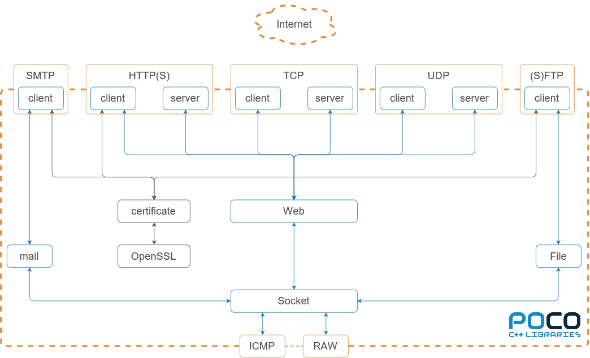
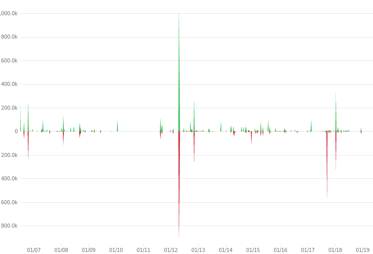

By [Damy Ha](https://github.com/4367480), [Nando Kartoredjo](https://github.com/nskartoredjo), [Teodor Nikolov](https://github.com/tinikolov), and [Xingchen  Liu](https://github.com/Xingchen94). Delft University of Technology.

# Poco

## Table of Contents

1. [Introduction](#introduction)
2. [Stakeholders Analysis](#stakeholders-analysis)
   1. [Stakeholder Classes](#stakeholder-classes)
      1. [Acquirers](#acquirers)
      2. [Assessors](#assessors)
      3. [Competitors](#competitors)
      4. [Developers](#developers)
      5. [Maintainers](#maintainers)
      6. [Testers](#testers)
      7. [Users](#users)
      8. [Sponsors](#sponsors)
      9. [Contact Persons](#contact-Persons)
      10. [Service Partners](#service-partners)
      11. [Integrators](#integrators)
   2. [Stakeholder Involvement](#stakeholder)
3. [Context View](#context-view)
   1. [System Scope](#system-scope)
   2. [Context Model](#context-model)
4. [Pull Request Analysis](#pull-request-analysis)
   1. [Accepted Requests](#accepted-requests)
   2. [Rejected Requests](#rejected-requests)
5. [Development View](#development-view)
   1. [Module Organisation](#module-organisation)
   2. [Common Design Model](#common-design-model)
      1. [Common Processing](#common-processing)
      2. [Standardisation of Design](#standardisation-of-design)
      3. [Common software](#common-software)
   3. [Codeline model](#codeline-model)
      1. [Codeline Organisation](#codeline-organisation)
      2. [Standardisation of Testing](#standardisation-of-testing)
      3. [Release Process](#release-process)
6. [Functional View](#functional-view)
   1. [Capabilities](#capabilities)
   2. [Design philosophy](#design-philosophy)
   3. [External Interfaces](#external-interfaces)
   4. [Internal Structure](#internal-structure)
   5. [Structure Model](#structure-model)
7. [Technical Debt](#technical-debt)
   1. [Identification](#identification)
   2. [Historical debt](#historical-debt)
   3. [Testing debt](#testing-debt)
   4. [Impact](#impact)
   5. [Solutions](#solutions)
8. [Conclusion](#conclusion)
9. [Appendices](#appendices)
   1. Appendix A - The Developer Stakeholders
   2. Appendix B - The Tester Stakeholders
   3. Appendix C - The Code Line Coverage
   4. Appendix D - FIXME

## Introduction

The Portable Components C++ Libraries ([POCO](https://pocoproject.org/)) project was started by [Günter Obiltschnig](https://obiltschnig.com/) in 2004. During that time C# and .Net, were very popular. As a compiled language, C++ reached its lowest point at that time. Günter Obiltschnig believed in C++, and was committed to create a high-quality, easy to use C++ library which is focused on providing networking libraries for the creation of different networking configurations. 

The first release of POCO was in 2005, and since its release, more than 180 developers have contributed to the source code of it. POCO is an open source, cross platform software project written in ANSI/ISO standard C++ and based on the [C++ Standard Library](https://pocoproject.org/slides/000-IntroAndOverview.pdf). Due to its portability, modularity, and efficiency, POCO is widely used for network-centric and portable applications development. Applications written with POCO can be easily ported to a new platform, as a result of the platform independencies of POCO. As a non-profit open source project, POCO is completely free for both the commercial and non-commercial use.

This report investigates the software architecture of POCO and contains six sections. We start with the [Stakeholder Analysis](#stakeholders-analysis), which lists the stakeholders of POCO and their respective stake. The next section is the [Context View](#context-view), which looks into the relationships, dependencies, and interactions between POCO and its environment. After the Context View, the [Pull Request Analysis](#pull-request-analysis) is presented, which summarises our findings of 20 analysed pull requests. The following section is the [Development View](#development-view), which describes the architecture that supports the software development process of POCO. The next section is the [Functional View](#functional-view), which describes the architectural elements of one of the functions provided by POCO. The last section is the [Technical Debt](#technical-debt), which discusses the concept of Technical debt and its implications on the project. A summary is provided in the [conclusion](#conclusion).

[Version 1.9.0](https://github.com/pocoproject/poco/releases/tag/poco-1.9.0-release) was used at the time this report was written.

### Stakeholders Analysis

The POCO project recognises a variety of stakeholders, each having their own share in the project. First, we would like to identify each stakeholder by its class, and second, we would like to illustrate the stakeholder involvement by making use of a *power/interest grid*.

#### Stakeholder Classes

The following classes can be identified within the POCO project.

##### Acquirers 

The acquirers are identified as the leading developers [Günter Obiltschnig](https://github.com/obiltschnig) and [Aleksandar Fabijanic](https://github.com/aleks-f). Both acquirers also act as the communicators of the project, interacting with pull requests and email traffic personally.

##### Assessors 

The POCO project has been governed by a *Technical Steering Committee* (TSC), which consists of the acquirers and a group of individuals selected by the committee which made significant and valuable contributions to the POCO project. All pull requests must be reviewed and accepted by a collaborator or a committee member. The collaborator is required to have sufficient expertise and is required to take full responsibility for the change made in the approved pull request.

##### Competitors

The POCO project is widely used, mostly because of the easy of use of networking libraries for embedded devices, service applications, desktops, and many other applications. Therefore POCO also has its competitors. For example, [ADAPTIVE Communication Environment (ACE)](http://www.dre.vanderbilt.edu/~schmidt/ACE-overview.html) provides network programming libraries used for message routing, dynamic (re)configuration of distributed services, concurrent execution and synchronization.  Another competitor is  [Boost](https://www.boost.org/) which provides portable C++ source libraries, including  libraries for networking like [Boost.Asio](https://www.boost.org/doc/libs/1_66_0/doc/html/boost_asio.html), or [Boost.Beast](https://www.boost.org/doc/libs/1_66_0/libs/beast/doc/html/index.html).

##### Developers

The developer community consists of more that 180 developers which have contributed to the POCO project. Based on the information gathered from GitHub the people with the highest contribution are described in [Appendix A](#appendices).

##### Maintainers

[Applied Informatics Software Engineering GmbH](<https://macchina.io/>), Applied Informatics for short, is the original developer and current maintainer of the POCO C++ Libraries. The acquirer Günter Obiltschnig is the founder of this company. In addition, managing the releases and maintaining the compatibility with different platforms is done by [Francis Andre](https://github.com/zosrothko).

#### Testers

The POCO project doesn't have dedicated testers, instead it relies on the community to frequently test and maintain the project. This results into overlap between testers and developers, thus both are not completely independent. The testers with the highest contribution are described in [Appendix B](#appendices).

#### Users

The POCO project is a widely popular project within the open source community. At the moment of writing, at least two million *code results* can be found on GitHub for mentioning the POCO project within an open source repository. It is also included in the [list of open source C++ libraries](https://en.cppreference.com/w/cpp/links/libs) as one of the useful libraries by cppreference.com. A [list](https://pocoproject.org/about.html#related) of commercial users is also stated by POCO themselves, which include companies like Cisco, Oracle, and Panasonic.

#### Sponsors

The POCO project relies on sponsors to pay for the upkeep of the project's website and other platforms. Alternatively, companies are welcome to fund the development of a [specific feature](https://pocoproject.org/about.html#funding). To become a sponsor, companies are required to sign an agreement with Applied Informatics. Sponsors receive acknowledgement by either a display of their logo on the POCO project website, or by a brief mention of their contribution to the project. The POCO project is at the moment of writing actively supported by Schneider Electric and Siemens, which both are also users of the POCO C++ libraries.

#### Contact Persons

The POCO project provides several forms of communication. For [purchased commercial support](https://pocoproject.org/support.html), the users are able to submit a message via the [POCO website](https://pocoproject.org/support.html) and get direct contact with the Applied Informatics support team. Sending an email to the [support team](mailto:support@appinf.com) is also an option. For non commercial support and other technical questions, POCO has a [community](https://pocoproject.org/about.html#community) scattered over multiple portals including [Stack Overflow](https://stackoverflow.com/questions/tagged/poco-libraries) and [Github](https://github.com/pocoproject/poco), from which users can receive help from the wide POCO community. The latest updates and notifications related to the project can be also found on social media. Social media accounts are updated by Günter Obiltschnig. Technical questions or bug related issues can be addressed in the GitHub repository where a member of TSC could take action.

#### Service Partners

The POCO project provides services to other companies through their C++ libraries, which are essential for the products these companies deliver. A few examples are: [HORIBA](https://www.horiba.com/en_en/) which uses POCO in automotive test systems, [Nucor Steel](https://nucor.com/) which uses POCO in beam mill automation application, and [Starticket](https://www.starticket.ch/de) which uses POCO in a ticketing and entrance control system running on an embedded Linux platform.

#### Integrators
The main responsibility of the [integrators](http://www.gousios.gr/blog/How-do-project-owners-use-pull-requests-on-Github.html) is to decide whether a commit to the project should be accepted or rejected based on the code quality, and to communicate the modifications to the source code with the contributors. The contributors of POCO must follow the Applied Informatics coding style standard and project requirements. The main integrators are Günter Obiltschnig and Aleksandar Fabijanic. Either one or both of them are involved in every pull request. Furthermore, the integrators are supported by a member of TSC. In case tests from the commited change are not passed or do not meet the requirements for [coding style](https://www.appinf.com/download/CppCodingStyleGuide.pdf), the contributors are contacted and improvements are suggested.

### Stakeholder Involvement

The figure below shows a *power/interest grid* which illustrates the the power a stakeholder has versus the interest it has in the success of the project. Each part of this grid can be divided into the following prioritisation categories:

- High power, high interest: **manage closely**: great effort should be made to satisfy requirements of the stakeholder, and a close relation should be maintained and managed.
- High power, low interest: **keep satisfied**: some effort should be made to satisfy the stakeholder. No more attention then needed is required, as they might lose even more interest.
- Low power, high interest: **keep informed**: keep the stakeholder informed as they might provide useful contribution to the project.
- Low power, low interest: **monitor** keep track of their activities but don't bother them with additional attention.

For each of the stakeholder classes, we will visualise their involvement and possible prioritisation using the following grid:


## Context View

The context view describes the relationships, dependencies and interactions between the POCO project and it's environment. The context view starts off by stating the boundaries of POCO and then present the context model.

### System scope

POCO has the following main responsibilities:

* POCO provides C++ libraries for command line/server applications, network programming, XML and JSON processing, database access and many more [features](https://pocoproject.org/about.html#features).
* POCO can be used on many platforms including desktops, embedded and cloud applications, [etc.](https://github.com/pocoproject/poco/wiki/SupportedPlatforms)
* POCO implements core features such as: classes for dynamic typing, cache framework, [etc.](https://pocoproject.org/about.html#features)
* POCO implements [additional](https://pocoproject.org/about.html#features) features including: compression, cryptography, database access, a file system, logging, multithreading, networking, processes and IPC, streams, text encoding, XML and JSON parsing.
* POCO provides unified access to [different databases](https://pocoproject.org/about.html#features) but doesn't implement the interface of the databases. Instead, it relies on [third party connectors](https://pocoproject.org/download.html#dependencies).
* POCO provides support for [network-based applications](https://pocoproject.org/about.html#features) but doesn't implement [the Transport Layer Security (TLS) and Secure Sockets Layer (SSL) protocols](https://pocoproject.org/download.html#dependencies). Instead, it relies on [OpenSSL](https://pocoproject.org/download.html).

### Context Model

The figure below shows the context model of *POCO*. 


The following entities can be found:

* **External Interfaces**: [*ODBC*](https://docs.microsoft.com/en-us/sql/odbc/reference/what-is-odbc?view=sql-server-2017), [*SQLite*](https://www.sqlite.org/index.html), and [*MySQL Client*](https://dev.mysql.com/) provide an interface to access databases. [*Redis*](https://redis.io/) can be used as a database, cache, or message broker. [*OpenSSL*](https://www.openssl.org/) is a toolkit for the [TLS](https://pocoproject.org/download.html#dependencies). Dependencies occur when specific libraries are used.
* **Users** : A system implemented by the users, or users them selves, are expected to provide and receive data and services to and from POCO.
* **Platform**: POCO covers a wide range of [platforms](https://github.com/pocoproject/poco/wiki/SupportedPlatforms). Renowned platforms are listed in the image.
* **Programming Language**: The programming language used to write code is C++. The libraries do support the processing of other languages such as JSON and HTML.

## Pull Request Analysis

This section describes the general procedure of processing merge requests.

### Accepted Requests

[Most](https://github.com/pocoproject/poco/pulls?q=is%3Apr+is%3Aopen+sort%3Acomments-desc) merge request are inspected by a (single) member of the TCP. The requestee and the TCP member discuss, [on a high level](https://github.com/pocoproject/poco/pull/1918), what the implemented feature should do and how it has been implemented. The TCP member gives a first impression of the code. Sometimes a solution has a fundamental problem, e.g. due to the proposed [structure](https://github.com/pocoproject/poco/pull/1048) of the library, or due to development in other [branches](https://github.com/pocoproject/poco/pull/2205). If they have reached consensus, the real review takes place. The TCP member and a member of the development team take a [look](https://github.com/pocoproject/poco/pull/2120) at the code and review it. Once consensus has been reached between the three parties, the code is merged.

Two events that regularly are that the TCP members almost always react on the same day and sometimes when [Travis CI](https://travis-ci.org/) or [AppVeyor](https://www.appveyor.com/) (continuous integration services) gives an error, the branches are still merged. Multiple reasons could cause a continuous integration failure like a [segmentation fault](https://github.com/pocoproject/poco/pull/2320).

### Rejected Requests

In general, there are four reasons why a request might be rejected. The first one is the rejection of [the change proposed](https://github.com/pocoproject/poco/pull/16) in the pull request. Both the requestee, and a member of the TCP will discuss the resulting impact, both negatively and positively. However, it is a member of the TCP which makes the final decision. The second one is the rejection of requests which add features to a [frozen development](https://github.com/pocoproject/poco/pull/647). Specifically, some features had been rejected due to the oncoming release of version 2.0.0 of the POCO project. The third one is the rejection of pull requests which are in such a way problematic, that the current pull request is [closed](https://github.com/pocoproject/poco/pull/2138), and later in time a [new one](https://github.com/pocoproject/poco/pull/2145) with a similar proposed change is created. The latest one is the rejection of pull requests where the change had [already been fixed](https://github.com/pocoproject/poco/pull/404) by another pull request. Commonly a discussion starts due to problems caused by the proposed change. After some discussion, a participant will point out that these problems had already been fixed in another pull request.

## Development View

This section describes the architecture that supports the software development process of POCO. It's split into three parts. First the module organisation is described. Second, the common design model which states the design constraints in order to maximise commonality is described. And finally, the codeline model which defines the organisation of the source code, the building, testing, and release process of the system is described.

### Module Organisation

The [four core libraries](https://pocoproject.org/pro/docs/00100-GuidedTour.html) of POCO are: `Foundation`, `XML`, `Util`, and `Net`. [Additional libraries](https://pocoproject.org/about.html#features) are also available. The libraries are made up of smaller packages and modules. The important libraries and the dependencies are shown below.


The following can be deducted from the libraries:

* The `Foundation` library contains the underlying platform abstraction layer and frequently used utility classes and functions. All other modules (except `CppUnit`) depend on the foundation library.
* The `CppUnit` module is a port from [JUnit](https://junit.org/junit5/), a testing framework for Java. The module allows unit testing. All modules contain tests and thus depend on this module.
* The `XML` library handles the reading, processing and writing of XML. 
* The `Util` library contains a framework to create command line/server applications. It supports command line handling and managing configuration information. 
* The `Net` Library is used to write network based applications. 
* The data libraries provide the interfaces to databases. The data libraries depend on the foundation library to provide the support of the underlaying platform.
* All other libraries implement addtional functions such as SSL support, JSON parsing and cryptography.

There are over 60 modules inside POCO. For this reason we've decided further investigate the module structure to the most important library (Foundation). The figures below shows the dependencies of the modules in the Foundation library.


A module is represented as a node and the number shows the dependencies within the foundation library. Internally the `Logging`, `Core` and `Filesystem` modules are used more frequently. The modules can't be layered, because the modules are too intertwined.


The bubble graph shows the modules outside of the foundation library that depend on this module. Externally the `Core` module is by far the most depended on.

### Common Design Model

The common design model defines the design constraints in order to maximise commonality. This section is divided into three parts namely: the common processing elements the design, the standardisation of design elements, and the common software in the system.

#### Common Processing

Common processing entails the software elements in a design that benefit from standardisation. The most important standardisation in POCO are:

* POCO expects the users to define their own logging structure. The [`Logger` class](https://pocoproject.org/docs/Poco.Logger.html) helps the user to achieve this. The `Logger` class supports [8 different types](https://pocoproject.org/docs/Poco.Message.html#15276) of priorities including: `PRIO_TRACE`, `PRIO_DEBUG` and `PRIO_INFORMATION`. A threshold value can be set such that only high level priorities are passed on. 
* The Foundation core provide most of the [functionalities](https://pocoproject.org/about.html#features) that the libraries require. Using the Foundation library keeps data structures consistent over the libraries.
* Libraries have been written to access [databases/memory structures](https://pocoproject.org/about.html#features) (e.g. MySQL/Redis/MongoDB). These libraries should be used to connect to databases.
* A networking library is used to access the functionalities of OpenSSL.
* A cyrptography library is available to provide secure network engineering.   

#### Standardisation of Design

The source code should adhere to the the [CppCodingStyle guide](https://www.appinf.com/download/CppCodingStyleGuide.pdf). The libraries should have as [few dependencies as possible](https://pocoproject.org/about.html#features) between each other with the exception that the foundation library may always be used. The foundation library provides the underlying platform abstraction layer after all.

There is no documentation that states the design patterns that are used in the POCO library, but common design patterns such as [singletons](https://github.com/pocoproject/poco/blob/develop/Foundation/include/Poco/MetaObject.h) and [factories](https://github.com/pocoproject/poco/blob/develop/Redis/include/Poco/Redis/PoolableConnectionFactory.h) have been found in the code.

#### Common software

The important libraries that contain common software in POCO are: the `foundation` library on which all other libraries are built on (e.g. message logging and instrumentation), the `Net` library which is use to create network based applications, and the `CppUnit` library which provides the framework for unit testing and the `database` libraries which provide access to databases.

### Codeline model

The codeline model defines the organisation of the source code and the protocol to build, test and release the system. It includes the codeline organisation, the test procedure of candidate releases and the build, test, and release procedure.

#### Codeline Organisation

The develop branch of the POCO library is stored according to a [structure](https://pocoproject.org/pro/docs/00200-GettingStarted.html). The branch is divided into 33 folders of which 12 folders are essential. The figure below illustrates the source code structure of POCO.


Some notable things of the file structure are:

* `build`: This folder contains three folders, `config`, `rules` and `script`. The files in this folder are used to build POCO on different platforms.
* `cmake`: Most of the files here are `.cmake` files. Besides the `cmake` file, two `cmake.in` files and one `.cpp` file are present.
* `contrib`: This folder contains a script to make the code suitable for [Doxygen](http://www.doxygen.nl/).
* `CppUnit`: This folder contains project files for various platforms to support the unit test framework.
* `doc`: This folder contains basic documentation and the tutorial of POCO.
* `Foundation`, `JSON`, `Net`, `Util`, and `XML`: These library folders contain make/build files, the header and source files for both the implementation and test suite in separate folders. Each library is also required to supply at least one example code. 

#### Standardisation of Testing

After implementation of a feature, the code must be tested by the user. The [contribution file](https://github.com/pocoproject/poco/blob/develop/CONTRIBUTING.md) states that contributors are required to write tests. The tests must pass, however the coverage of the tests is not defined. 

The contributor is then supposed to test the implementation on a major platform (Linux, Windows, and Mac). The document does not define what testing means. The POCO library contains example codes that demonstrate the library and it's function. We assume that at minimum, testing implies the successful execution of these example codes. If there's no relevant example code available, an example code [must be written](https://github.com/pocoproject/poco/pull/664).

In addition to manual testing, POCO also makes use of continuous integration services ([Travis CI](https://travis-ci.org/) and [AppVeyor](https://www.appveyor.com/)). In general all checks must be passed.

#### Release Process

The POCO project, [started by Günter Obiltschnig](https://pocoproject.org/about.html), was first released in February 2005. Aleksandar Fabijanic later joined the team as a contributor. The releases of Poco is numbered by the semantic versioning. Since its first release, more than 50 versions have been released. The timeline of the main release version is shown below.


The release process is based on the [git branching model](https://nvie.com/posts/a-successful-git-branching-model/). A feature branch is branched off from the develop branch that contains the latest changes for the next release and will be merged back into the same branch once the new features are essential. Coordination and developments between different branches is tracked by the TSC. When the develop branch is near the desired state, all the features for the upcoming release are merged into the develop branch. A new release branch named by version number is branched off. This release branch is created from said develop branch. This branch exists for a long time during which the bugs can be resolved. The release branch finally will be merged into master branch when the release branch is deemed stable.

## Functional View

This section describes the functional viewpoint. The functional view describes POCO's runtime functional elements and their responsibilities, interfaces, and primary interactions. 

POCO provides multiple functionalities. To keep the functional view coherent, we will on only focus on the networking functionality. We will discuss the capabilities of the POCO, the external interfaces, and internal structure in that order. At last, we will present the structure model combining all what we identified in one figure.

### Capabilities

Functional capabilities define what the project is required to do, and what is not required to do. 

At the lowest level, the Net library contains socket objects, supporting TCP streams, server sockets, UDP sockets, multicast sockets, Internet Control Message Protocol, and raw sockets. Based on the socket objects, POCO provides building two TCP server frameworks, one as multi-threaded servers, and one for servers based on the [Acceptor-Reactor pattern](https://pdfs.semanticscholar.org/3ae4/4bf845b97a175876c1b7bb5774967b23aba8.pdf). The multi-threaded class and its supporting framework are the foundation for POCO's HTTP server implementation.

From a client side of view, the Net library provides objects for talking to HTTP servers, sending and receiving files, sending mail messages and receiving mails. The list below summarises some of the key objects of the `Net` library, in order to provide the described functionalities.

* `POCO_Socket` provides all comparison operators
* `POCO_DatagramSocket` provides an interface to  UDP stream
* `POCO_StreamSocket` provides an interface to a TCP stream
* `POCO_ServerSocket` create a server socket, and provides an TCP socket interface
* `POCO_TCPServer` provides a multi-threaded TCP server that uses a server socket to listen for incoming connections
* `POCO_TCPServerConection` provides an abstract base class for TCP server connections
* `POCO_UDPServer`provides asynchronously polling of data which arrival is delegated
* `POCO_UDPClient` provides the functions to either send or receive UDP packets
* `POCO_HTTPServer` a sub object of `TCPServer` that provides a full-featured multi-threaded HTTP server
* `POCO_SMTPClientSession` provides a SMTP client for sending e-mail messages.

### Design philosophy

The philosophy behind the creation of POCO can be captured by a quote from the main implementer of C++, [Bjarne Stroustrup](http://www.stroustrup.com/): 

> Without a good library, most interesting tasks are hard to do in C++; but given a good library, almost any task can be made easy.

POCO is an open source, cross platform software project written in ANSI/ISO standard C++ and based on [C++ Standard Library](https://pocoproject.org/slides/000-IntroAndOverview.pdf). As a collection of C++ class libraries, POCO tries to be conceptually [similar](https://pocoproject.org/slides/000-IntroAndOverview.pdf) to the [Java Class Library](https://docs.oracle.com/javase/8/docs/api/allclasses-frame.html), the [.Net Framework](https://dotnet.microsoft.com/download/dotnet-framework/net472) or Apple’s [Cocoa](https://developer.apple.com/library/archive/documentation/MacOSX/Conceptual/OSX_Technology_Overview/CocoaApplicationLayer/CocoaApplicationLayer.html).

### External Interfaces

External interfaces are the date, event, and control flows between the function and others. POCO provides high and low level communication protocols. The purpose of the protocols is to establish a communication between the "Internet" and the internal procedures of a system. The external interfaces POCO provides can be identified as HTTP(S), SMTP, (S)FTP, TCP, and UDP. Additionally, POCO provides two more external interfaces: ICMP, and raw sockets which is named RAW.
### Internal Structure

To meet the requirement, a project can be design in a number of different ways. We will discuss the main element and their responsibilities at this section. Interfaces can be observed on a lower level by looking at the programming language, however, to not confuse with the external interfaces, we wont use this term here. Instead, those relations will be combined with the other connections between the elements. 

The internal elements in POCO could be identified as `Web`, `Mail` and `File transfer`. The `Web` support two types of connections for server and client sessions, where both can use the `HTTP(s)`,`TCP` or `UDP` protocols. The `Mail` service provides a client to communicate with mail servers using the `SMTP` protocol. The `File transfer` service provides a client using the `(s)FTP` protocol. The `Socket` element is used to establish the communication with all other sockets in order to set and get various socket options such as timeouts, buffer sizes, and reuse address flags. In case the developed application needs secure communication with the external interfaces, they could make use of `OpenSSL` in order to encrypt the channel.

### Structure Model

From what we have identified, we now can represent everything in a model, displaying the external interfaces and internal structure. There are many ways to create such a model, like by using a UML. We instead favour a box-and-lines diagram. Such a diagram doesn't require extensive knowledge of the UML notations, and doesn't restrict use to showcase information which might by hard or impossible to show in a UML.



Here all our elements, interfaces and connections can be found in one figure. Between each element, there is a connection. We used the arrows to showcase the data flow. As can be expected for all cased this goes both ways.  The interfaces are show in orange, and the layer between the internal structure and the Internet has been shown by the dotted orange boundary. Note that here the client and servers are encapsulated by the protocols we recognised as interfaces. To distinguish the security part, it has been coloured grey for both the borders of the element boxes, and the connections. 

## Technical Debt

This section discusses the technical debt found in POCO. First the technical debt is identified. This section is followed by the historical view of the project, which describes the evolution of the project and the historical debt analysis over a period of one year. Next we will analyse the testing debt by describing the code coverage. Then we move on to a description of the impact from the identified technical debt, testing debt, and the historical view analysis. Finally, possible solutions will be described to reduce the technical debt of POCO.

### Identification

To assess the technical debt of POCO we used [SonarCloud](https://sonarcloud.io/about). SonarCloud is a tool that analyses the technical debt by detecting code smells. Detected smells are displayed below as the time it will take to resolve them.


Most of the code smells in the graph require approximately one day and thirteen hours to be resolved. The majority of the files contain few to non code smells. However, some outlier files can be noticed quite easily. 

The file with the most smells turned out to be [`NamedTuple.h`](https://github.com/pocoproject/poco/blob/develop/Foundation/include/Poco/NamedTuple.h). This file implements tuples for a ranged size of 20 elements. Each size of the tuple has its own distinct, yet similar implementations. We found that 69% of the definitions are duplicates. The number of duplicated blocks is 7804 (14.1% of total blocks).

Another outlier contains a lot of code lines, while containing relatively few code smells. This file is the [`SQLite3`](https://github.com/pocoproject/poco/blob/develop/SQL/SQLite/src/sqlite3.c) source file. [After looking at the commit history](https://github.com/pocoproject/poco/commits/7726d024ab98a35267dae17defca29d29e477039/Data/SQLite/src/sqlite3.h) and the source file itself, we found out that the source code had been integrated from the [SQLite](https://www.sqlite.org/download.html) distribution. To ease the integration, this file is a concatenation of all source files.

According to SonarCloud, POCO  has a very low number of bugs and vulnerabilities. Many of the bugs are detected in JavaScript implementations.


SonarCloud will give a project a rating based on the [SQALE](http://www.sqale.org/details). With a technical debt ratio of 0.4 %, POCO has been rated with an A.

### Historical debt

Since the beginning of the project, the main functionalities of the `Net` and `SQL` modules were included with approximately 200 thousand additions. This trend remains almost the same for the earlier releases of the software until version 1.4.4 was released in July 2012. For this version major changes were made in the `Net` and `Foundation` libraries. The number of additions included in this change are more than 800 thousand, resolving a number of issues related to `IPv6` and securing sockets for data streaming. The change also added new functionalities and improvements in the `SQL` module. Moreover, a release happened in 2018 with approximately 250 thousand additions adding feature improvements for the `PosgreSQL` and `cmake` modules.

The graph below represents the evolution of the POCO project in terms of code additions and removal for the whole life cycle of the project:



Another method to analyse the historical debt is by checking the code for certain keywords which could indicate a potential failure that need to be resolved, or a part that needs to be extended. The `TODO` keyword is used to indicate that a part of the code is incomplete and needs to be extended, while the `FIXME` keyword is used to indicate that a failure is discovered and needs to be resolved.

Between 2018 and 2019, the number of those two comments for the master branch remains almost the same. The [POCO project version 1.9.0 release](https://github.com/pocoproject/poco/releases/tag/poco-1.9.0-release) contains 97 comments marked as `TODO`, and 17 marked as `FIXME`. However, almost all `FIXME` comments are located in the `testsuite` modules. Moreover, many of those comments are identified in the SQLite core file namely `sqlite3.c`. An example of a `FIXME` comment can be seen in [Appendix D](#appendices). 

As a conclusion of the historical debt, the software continues to change with requests for fixes and enhancements and takes increasingly more time for contributors which impact the [changeability](https://github.com/pocoproject/poco/issues/776) and sensibility of the project. 

### Testing debt

The POCO project uses unit testing and Continuous Integration (CI) to maintain the project. [Travic CI](https://travis-ci.org/pocoproject/poco) is used to build the project using multiple compilers, while [AppVeyor](https://ci.appveyor.com/project/obiltschnig/poco/branch/develop) is used to run the unit tests for different platforms. To maintain the code style and other practices applied in the project, POCO uses [CII Best Practices](https://www.construction-institute.org/resources/knowledgebase/best-practices) to determine if they meet the criteria.

Although the POCO project does make use of unit testing and CI, there are no guidelines considering writing tests, and thus to prevent testing debt. In many cases, CI checks are bypassed by one of the assessors, and a pull request is merged even if some CI checks [don't succeed](https://github.com/pocoproject/poco/pull/2640#partial-pull-merging).

The POCO project uses the [CppUnit](http://cppunit.sourceforge.net/doc/cvs/cppunit_cookbook.html) unit testing framework module to write down its tests. Although the POCO project uses unit testing to maintain the project, it doesn't make use of source code coverage analysis. However, by making some alterations during the compilation of the source code, the coverage information can be retrieved and the analysis can be performed. The source code coverage can be retrieved by using the [Gcov](https://gcc.gnu.org/onlinedocs/gcc/Gcov-Intro.html#Gcov-Intro) tool.

We used Gcov to perform our own code coverage analysis. In total, only 52% is covered by unit tests. At [Appendix C](#appendices), the code coverage has been stated for each module.

The modules in the POCO project aren't equally treated; some modules have higher code coverage than other modules. Whether a module is well tested is debatable, however, we consider 70-80% to be the [minimum acceptable code coverage](https://www.bullseye.com/minimum.html). Looking at the code coverage per module, only four of the POCO project modules meet this criteria: `Foundation`, `JSON`, `Util`, and `Zip`. With 39973, 10243, and 10115 lines of code respectively, the `SQLite` , `ODBC`, and `Net` modules are remarkably poorly tested with code coverage of 3.26%, 37.28%, and 3.31%. Those three modules contribute 70% to the total lines of code.

### Impact

The number of detected code smells from SonarCloud, as mentioned in the [Identification](#identification) section, don't necessarily indicate a malfunctioning build. Some code smells found by SonarCloud are related to duplicated blocks in the core libraries of POCO. The `Foundation` library has a total of 1732 duplicated blocks. Most of them are related to the [tuple header file](https://github.com/pocoproject/poco/blob/poco-1.9.1/Foundation/include/Poco/NamedTuple.h). Duplicated blocks have a negative effect on the code maintainability and [safety](https://dl.acm.org/citation.cfm?id=2915653) by allowing a possible vulnerability to continue to exist in the copied code, while the developer is not aware of the copy.

From a historical point of view, the [changes](#historical-debt) over the years have resulted in the decrease of [reliability](https://github.com/pocoproject/poco/issues/6) of the POCO project. For instance, a problem had been found five months after the release of version 1.4.4, and currently at the moment of writing, there are still open [issues](https://github.com/pocoproject/poco/issues/2285) related to this change.

Overall, POCO was becoming more and more diverse by introducing new features to the libraries. This resulted in the increase of the number of duplication blocks in the code, making it more complex to maintain. In addition, we noticed a lack of [documentation](https://github.com/pocoproject/poco/tree/develop/doc) after the release of version 1.7.8, which will impacts the project negatively for future modifications.

Whether the low code coverage is an issue depends on the effect of a failure. [Multiple formal standards](https://www.bullseye.com/minimum.html) express the required minimal acceptable code coverage as a function of the critical level. POCO only provides libraries to other developers, and thus, the critical level depends on the usage of the POCO project. POCO could however increase their code coverage to lure in developers which need their features for high critical systems.

From the identified code smells by SonarCloud, the historical debt, and the code coverage, it appears that POCO only takes minimal effort to reduce the technical debt.

### Solutions

The files with a lot of code lines are from external sources (e.g. [`prettify.js`](https://github.com/google/code-prettify) and [`sqlite3.c`](https://www.sqlite.org/amalgamation.html)). Being external files explains why the test code coverage is extremely low. Developers of POCO assume that the external code is well tested. These external files are the result of concatenating multiple source files. As newer versions are released regularly, discarding the useless code every release is not viable. With regards to technical debt, we argue not to alter the external files. Instead, the technical debt should be explicitly documented. These files could also be stored in special locations. Currently the files are mixed with other source files. These strategies will not lower the technical debt, but will prevent raising false concerns.

Considering the files that contain a lot of duplicated blocks (e.g. [`NamedTuple.h`](https://github.com/pocoproject/poco/blob/develop/Foundation/include/Poco/NamedTuple.h) and [`Tuple.h`](https://github.com/pocoproject/poco/blob/develop/Foundation/include/Poco/Tuple.h)), re-evaluation the implementation seems to be the proper way to tackle this issue. Considering each size of a tuple has its own constructor, but share the same functions. Inheritance could be the key to reduce the number of duplicated blocks. Refactoring the implementation of the tuple all together might also be a solution as the current implementation can't extend the tuple beyond 20 items without altering code.

## Conclusion

This report has described several aspects as described in [Rozanski and Woods](https://www.viewpoints-and-perspectives.info/), centered around the [POCO project](https://pocoproject.org/). The aspects of POCO were divided into six sections. The [first section](#stakeholders-analysis) described the stakeholders of POCO and their respective stake in the project. The stakeholder's interest and power were illustrated in a power/interest grid. The [second section](#context-view) described the context view. The context view investigated the relationships, dependencies and interactions between POCO and it's environment. The context view was illustrated via a context model. This chapter also stated the important requirements and boundaries of POCO. The [third section](#pull-request-analysis) described the results of a small pull request analysis. 10 accepted and 10 rejected pull requests were analysed. Communication patterns that regularly occured were discussed in this chapter. The [fourth section](#development-view) described the development view. The development view investigated the architecture that supports the development of POCO. It investigated the module structure of POCO and particullarly the dependencies of the modules in the Foundation Library. This chapter also presented a common design model which described the design constraints in order to maximise commonality and a codeline model of POCO which described the organisation of the source code and the protocol to build, test and release the system. The [fifth section](#functional-view) described the functional view. This chapter defined the architectural elements that give POCO it's functionality. Due to the large size of the library, this chapter mainly focussed on the `NET` library which is used to write network based applications. The [last section](#technical-debt) described the technical debt of POCO. Various methods have been used to determine the technical debt, the technical debt had been analysed and the methodology of technical debt supression in POCO had been investigated.


## Appendices

### Appendix A - The Developer Stakeholders
Contribution based on commit requests:

| Place | Name | Commits |
| --- | --- | --- |
| 1 | [Aleksandar Fabijanic](https://github.com/aleks-f) | 1257 |
| 2 | [Günter Obiltschnig](https://github.com/obiltschnig) | 1125 |
| 3 | [Francis Andre](https://github.com/zosrothko) | 720 |
| 4 | [Franky Braem](https://github.com/braem) | 183 |
| 5 | [Pascal Bach](https://github.com/bachp) | 58 |

Contribution based on code distribution:

| Place | Name | Insertions | Deletions |
| --- |--- | --- | --- |
| 1 | [Aleksandar Fabijanic](https://github.com/aleks-f) | 2,681,625 | 2,768,735 |
| 2 | [Günter Obiltschnig](https://github.com/obiltschnig) | 2,060,168 | 1,162,428 |
| 3 | [Francis Andre](https://github.com/zosrothko) | 62,394 | 48,386 |
| 4 | [Daniel Rosser](https://github.com/danoli3) | 34,023 | 8,001 |
| 5 | [Eran Hammer](https://github.com/hueniverse) | 26,468 | 102 |

Contribution based on pull requests:

| Place | Name | Pull Requests |
| --- | --- | --- |
| 1 | [Francis Andre](https://github.com/zosrothko) | 187 |
| 2 | [Aleksandar Fabijanic](https://github.com/aleks-f) | 32 |
| 3 | [Günter Obiltschnig](https://github.com/obiltschnig) | 15 |
| 4 | [Roger Meier](https://github.com/bufferoverflow) | 11 |
| 5 | [Daniel Rosser](https://github.com/danoli3) | 10 |

### Appendix B - The Tester Stakeholders
Contribution based on code distribution to the unit test folder:

| Place | Name | Insertions | Deletions |
| --- | --- | --- | --- |
| 1 | [Aleksandar Fabijanic](https://github.com/aleks-f) | 34832 | 19923 |
| 2 | [Günter Obiltschnig](https://github.com/obiltschnig) | 19515 | 7965 |
| 3 | [Marian Osborne](https://github.com/martin-osborne) | 2948 | 1011 |
| 4 | [Francis Andre](https://github.com/zosrothko) | 2169 | 2122 |
| 5 | [Eran Hammer](https://github.com/hueniverse) | 1034 | 0 |

### Appendix C - The Code Line Coverage
Code line coverage found by Gcov:

| Module | Lines Covered | Total Lines | Percentage |
|----|---|---|---|
| `Crypto` | 1912 | 2870 | 66.62% |
| `Encodings` | 171 | 307 | 55.70% |
| `Foundation` | 48717 | 63348 | 76.90% |
| `JSON` | 2519 | 3218 | 78.28% |
| `Net` | 335 | 10115 | 3.31% |
| `NetSSL/OpenSSL` | 171 | 3556 | 4.81% |
| `Redis` | 580 | 2141 | 27.09% |
| `MySQL` | 199 | 3261 | 6.10% |
| `ODBC` | 334 | 10243 | 3.26% |
| `PostGreSQL` | 139 | 3782 | 3.68% |
| `SQLite` | 14903 | 39973 | 37.28% |
| `SQL` | 4409 | 6608 | 66.72% |
| `Util` | 3867 | 4659 | 83.00% |
| `XML` | 6735 | 10938 | 61.57% |
| `Zip` | 1834 | 2180 | 84.13% |

### Appendix D - FIXME
An example of a `FIXME` comment.

```
  if( p ){
    pFd->nFetchOut--;
  }else{
    /* FIXME:  If Windows truly always prevents truncating or deleting a
    ** file while a mapping is held, then the following winUnmapfile() call
    ** is unnecessary can be omitted - potentially improving
    ** performance.  */
    winUnmapfile(pFd);
  }
```

As can be understand from the `FIXME` comment, the function call to `winUnmapfile` depends on a third party vendor and omitting it could increase the performance.
