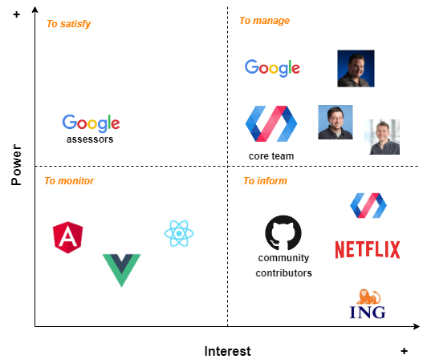
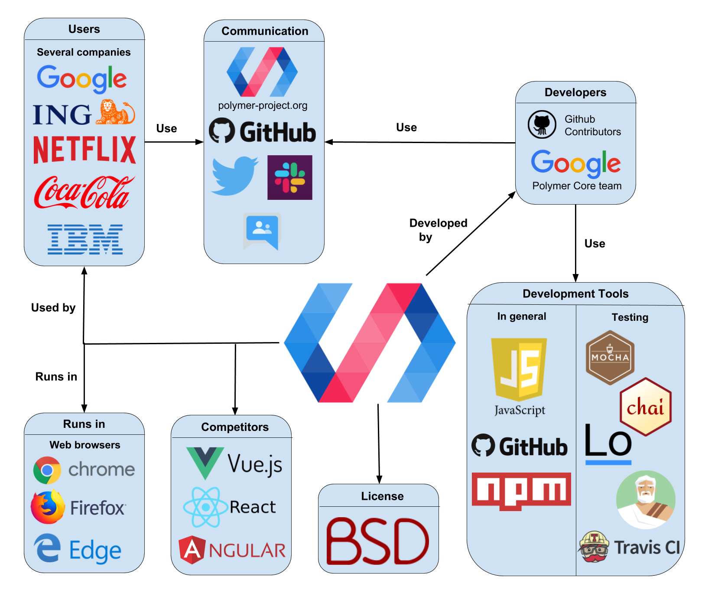
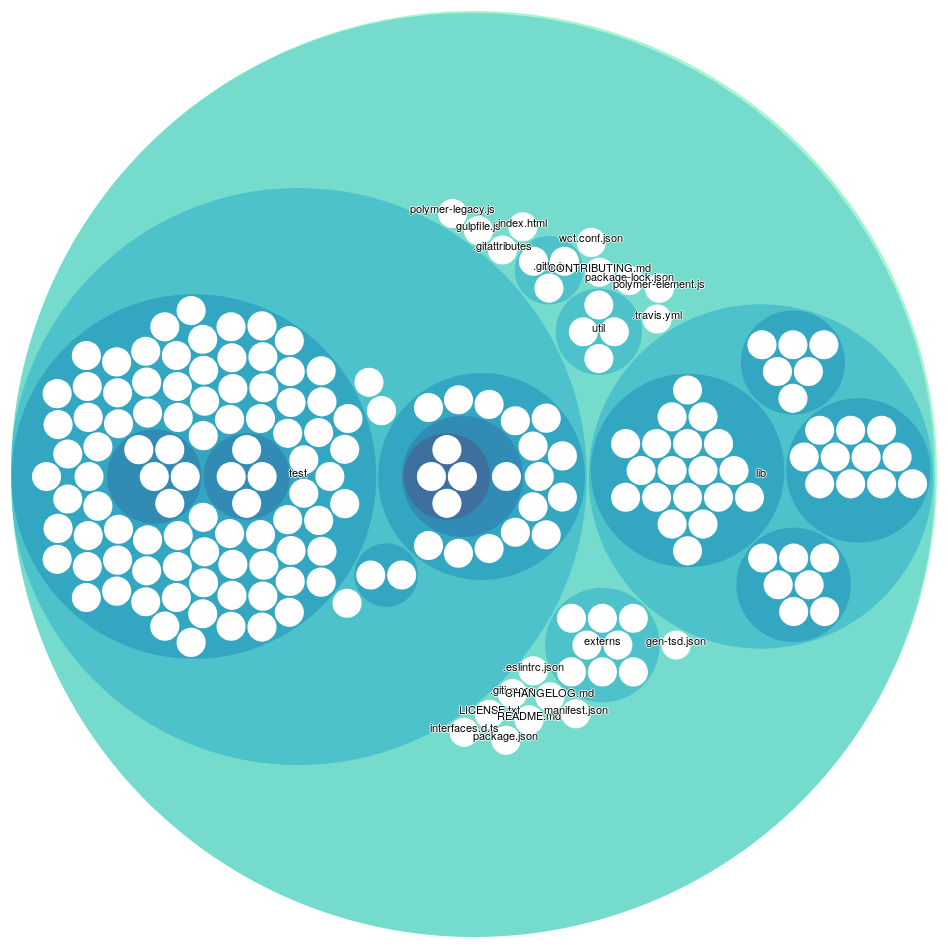
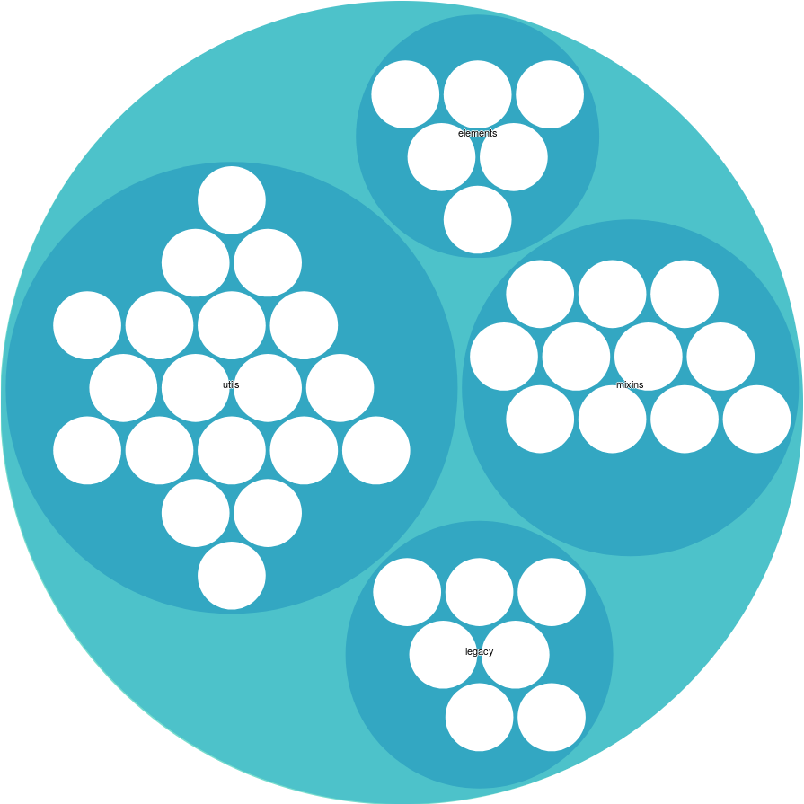
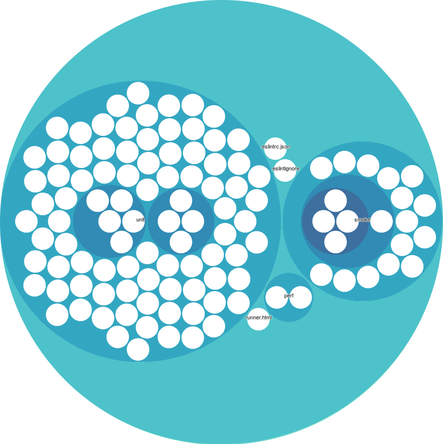
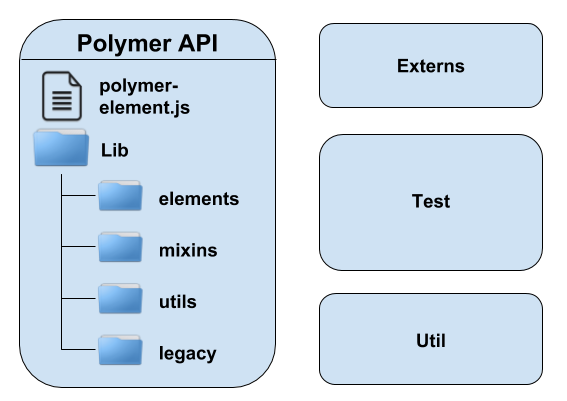
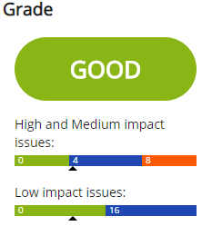
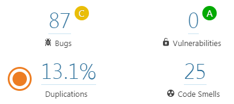
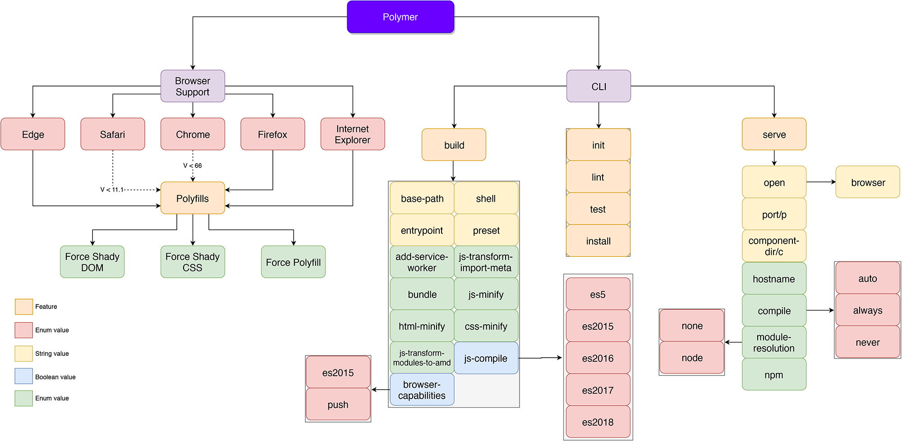

# Polymer
_Max de Krieger, David van der Leij, Sharon Grundmann, and Thomas Kolenbrander_

## Table of Contents

-   [Introduction](#introduction)
-   [Stakeholders](#stakeholders)
-   [Context View](#context-view)
-   [Development View](#development-view)
-   [Technical Debt](#technical-debt)
-   [Variability Management](#variability-management)
-   [Conclusion](#conclusion)

## Introduction

Created by Google Inc. in 2015, Polymer is an open-source JavaScript library for building web applications. Through the use of web features like web components, HTTP/2 and service workers, Polymer allows its users to build modern web applications with minimal overhead and maximal performance. In addition to this, the team is dedicated to advocating for emerging standards to improve web development.

In this chapter, we analyze the architecture of Polymer according to concepts presented by Nick Rozanski and Eoin Woods [^36]. We begin by analyzing Polymer's stakeholders. We identify major stakeholders associated with the project and their influence on decision-making processes and eventual success of Polymer.
From there, we present two architectural views introduced by Rozanksi and Woods. The context view describes relationships, dependencies, and interactions between Polymer and its environment while the development view  addresses aspects related to the system development process. Additionally, we analyze the technical debt of Polymer and discuss how variability is managed.

## Stakeholder Analysis

We present the stakeholders of the Polymer project according to the stakeholder classes defined by Rozanski and Woods [^36]. In addition, we identify other stakeholder classes that are relevant to this project.

#### Acquirer

The acquirer of Polymer is Google as they oversee the project with their team.

#### Assessors

Besides being the acquirer, Google can also be seen as the assessor of the project. Legal complications of the project are covered by a Contributor License Agreement (CLA) stating that contributors do not own any of the code they provided. Furthermore, the Polymer team also decides what standards to support, as stated in a blog post [^23].

#### Communicators

The communicators consist of both the Polymer team and the Github contributors. External communication like contact with other stakeholders and marketing is done by the Polymer team while internal communication such as code reviews and documentation is done by both the Polymer team and Github contributors.

#### Developers

Polymer is developed by the Polymer team and Github contributors from the open-source community.

#### Maintainers

All developers can be considered maintainers as well. However, the Github contributors do not have any say in the future of Polymer as decisions like releases and roadmaps are made by the Polymer team. The members of the Google Polymer team that integrate new content (merge or close pull requests) are [Steve Orvell](https://github.com/sorvell) (lead engineer, project coordinator) [^13], [Kevin Schaaf](https://github.com/kevinpschaaf) (lead engineer, project coordinator) [^14], and [Daniel Freedman](https://github.com/azakus) [^15].

#### Suppliers

As a development and communication platform, Polymer makes use of Github. For distribution, the project relies on the npm package manager [^42]. As the Polymer core team is paid and maintained by Google, Google can be seen as a supplier of the project as well.

#### Support staff

The actual staff consists of the Polymer core team and Github contributors. Communication channels between developers and users are available on Github, Twitter, Slack and Google Groups.

#### Testers

As all code committed should be tested, the developers (the Polymer team and Github contributors) are testers in the classical sense: They write tests for their code. Besides the developers, the users (mentioned below) can be seen as testers as well. They have the ability to report bugs on the Github page of Polymer.

#### Users

Polymer is used in many applications world-wide and in many of Google's products as well. This includes YouTube, Google Earth and Google Music. Besides Google, other notable users are: [Netflix](https://netflix.com/), [ING](https://www.ing.com), [Coca-Cola](https://www.coca-cola.com/), [McDonald's](https://www.mcdonalds.com/) and [IBM](https://www.ibm.com) [^22].

#### Regulatory structures

The World Wide Web Consortium (W3C) is a regulatory stakeholder of the Polymer project. As the Polymer project directly involves creating and using web components, it is necessary that the team adheres to the web development standards maintained by W3C.

#### Competitors

Another group of stakeholders are competitors. Although they are not directly involved with the project and its management, they have an interest in it and can indirectly influence the design of products and success of the project as a whole. Some competitors of the Polymer Project include [Angular](https://angular.io/) [^2], [Vue.js](https://vuejs.org/) [^40] and [React](https://reactjs.org/) [^20].

### Stakeholder influence

Using a power/interest grid, we categorize the stakeholders based on their influence and interest in Polymer as can be seen in the figure below. In the first place, Google and members of the Polymer core team have to be managed closely because they have the greatest influence on the success of the system in terms of funding and development. The next group with high power but low interest is the group of assessors at Google who ensure that
the system conforms to standards and legal regulations. Aside from these groups, it is important to keep the contributors of the system including the GitHub community and other Polymer employees and users informed. Although these groups are highly interested in Polymer, they do not have much power. Lastly, the competitors of Polymer only have to be monitored since they
have the least interest and influence on the system.



### Decision making process

Using the most commented pull requests from the Polymer project, insight might be gained regarding the decision making process of the Polymer team. Unfortunately, there is not much discussion about the impact of pull requests in the comments. Most of the comments are technical questions or clarifications. This could be due to the fact that most of the pull requests are created by Google employees, who are most likely on the same page with respect to the short and long term goals of the Polymer project.
The code is extensively reviewed by one or more Google employees and discussed with the creator of the pull request. The most prevalent reason for the rejection of a pull request is that it is not tested well enough. Further analyses of popular pull requests are presented in the appendix.

## Context View

In the context view, we consider the system as a black box while describing its main functionalities and relations with its external environment.

### Key functional requirements

In order to identify the key functional requirements we first examine the [feature overview](https://polymer-library.polymer-project.org/3.0/docs/devguide/feature-overview) [^4]. The main features of Polymer identified include:

- Custom elements that function like DOM elements
- Elements consisting of ECMAScript modules with classes
- Elements have an encapsulated DOM that is populated by Polymer
- Declarative syntax to attach listeners to elements children, with gesture support
- Data binding of properties and attributes with observers and computed properties

The underlying goal of these requirements is to "help developers unlock the web’s full potential" [^25].

### External entities

We have identified the following external entities:

- **Developers** - The Polymer library is developed by a core team at Google and contributors from the open source community on Github.
- **Users** - Polymer is used by a large number of companies including well-known companies like: Netflix, ING, Coca-Cola, McDonald's and IBM. Besides these companies Polymer is also used by its main developer, Google, and can be found in various products created by Google.
- **Runs in** - Polymer is used to create web applications and thus requires a browser to work. Thus, Polymer is dependent on the features that certain browsers support.
- **Competitors** - Competitors of Polymer include other Javascript libraries focused on web applications. At the time of writing, popular alternatives to Polymer are Vue.js, AngularJS and React.
- **Development tools** - Polymer is developed in JavaScript and is distributed through the npm package manager. Github is used to support the development of Polymer. The included testing framework runs on Node.js and includes several JavaScript frameworks. The JavaScript frameworks included in the testing environment are: [Mocha](http://mochajs.org/), [Chai](http://chaijs.com/), [Async](https://github.com/caolan/async), [Lodash](https://lodash.com/) and [Sinon](http://sinonjs.org/) [^26]. For continuous integration purposes Travis CI is used.
- **Communication** - The official communication channels for Polymer are their website, Github, Twitter, Slack and Google Groups.
- **License** - The Polymer library is available under the BSD license.

### External interfaces

Because Polymer is a development library, the external entities that use it as a development library do not request data from it but interact with it as a tool rather than a provider.
Therefore the external entities only interface with Polymer through development tools which can be summarized as follows:

- Polymer components
- Web component tester
- Polymer CLI (command line interface)

The Polymer components let developers create web components and are therefore the main interface of the project.

The web component tester is a tool that allows developers to test these components using scripts in an automated way. This tool, in turn, interfaces with the previously mentioned test frameworks. Since these frameworks are included within the testing tool, Polymer does not depend on updates of these frameworks being compatible.

Lastly, the polymer CLI allows developers to execute a myriad of project structure tasks such as running a local web server, creating a project with the correct structure and creating Polymer components from templates.

For Polymer to work properly, developers need to make Polymer interface with npm to retrieve the required packages. Next to this, the framework itself is also hosted on the npm repository.
This interaction is done via the HTTP protocol.

Although the volume of requests for this interaction is relatively small (only for package updates and setting up the project), it can pose a problem for external entities that use Polymer if the service is down for an extended amount of time. The service level of npm however seems to be near a [100%](http://ping.npmjs.com/) uptime [^41].

### Context view diagram



The context view diagram in the figure above gives an overview of the different entities involved in Polymer and their relationships. Polymer runs in different browsers, which all have the ability to support or exclude certain standards. The developers of Polymer have take into account these decisions. The development process is supported by several tools/platforms such as npm and Travis CI. Developers and users of Polymer are able to communicate with each other through several platforms including Github, Twitter and Slack.

In general, the diagram shows that Google is one of the most involved parties, as they can be found in five different groups: Users, Developers, Web browsers (Google Chrome), Communication (Google Groups) and even Competitors (Angular).

## Development view

The development view describes the architecture that supports the software development process. In the paragraphs below, the codeline model, source code structure, code modules, code dependencies and the common design model are analyzed.

### Codeline model

The codeline model is in place to guide the development process. It explains how the code is controlled, how it should be maintained and the automated tools used to deploy the software.

#### Build and Test Approach

All Polymer projects make use of [Polymer CLI](https://github.com/Polymer/tools/tree/master/packages/cli) [^27], a command-line tool for the installation, testing and building of Polymer projects and Web Components. There is no configuration required to use Polymer CLI which makes creating a Polymer project rather easy. The tests are run using the so-called [web-component-tester (WCT)](https://github.com/Polymer/tools/tree/master/packages/web-component-tester) [^26], which is a browser-based testing environment created by the Polymer team. This environment also supports [SauceLabs](https://saucelabs.com/) [^37] which allows for multi-platform cloud-based testing.

#### Release Process

Releases are done via the Github [releases](https://github.com/Polymer/polymer/releases) [^28] and [tags](https://github.com/Polymer/polymer/tags) [^29] sections. In this section, Polymer is released for both the 2.x and 3.x versions of the library. Every release lists the new features, meaningful changes and a raw list of all commits in this release. The release itself contains a tar and zip archive with the source code. To our knowledge there seems to be no documentation on what constitutes a release candidate and it seems a release is pushed when a significant amount of commits are made since the last release and the continuous integration does not raise an error.

#### Continuous integration

After every commit the continuous integration tool [TravisCI](https://travis-ci.org/) [^9] is invoked. This utility executes a [build script](https://github.com/Polymer/polymer/blob/master/.travis.yml) [^30] which performs the following tasks:

1. Specifies variables such as the Linux distribution and NodeJS version
2. Installs and builds the project and dependencies using Gulp
3. Runs the ES linter on the codebase
4. Runs all tests on both Google Chrome and Mozilla Firefox

#### Version control

As mentioned previously in this chapter, the codebase of Polymer can be found on GitHub. The project uses Git for version control. This means that the repository has to be forked by the contributors including Polymer developers before they can make changes.
Pull requests are thoroughly reviewed by the core Polymer team before they are accepted and merged or disregarded. These changes must comply to the standard design approaches.

### Source code structure

In the figure below, a hierarchical view is shown of the file structure of the polymer project. It can be seen that the project is divided into three parts namely the actual library which is contained in lib, the testing part which is contained in the test folder and the root of the project where most configuration files are located. These configuration files specify dependencies or the continuous integration files for example. What is especially interesting is the size of the testing files in comparison with the actual framework itself. We can see that this part is about two to three times the size of the actual framework. This shows that the Polymer has a comprehensive test suite high on the list of priorities.



#### Lib

As seen in the figure below the actual framework itself is divided into 4 elements. These are the elements, utils, mixins and legacy folders. The utils folder contains utility classes such as async and array operations. The mixins folder contains a couple of base mixins. A mixin is a function that takes a class and returns a subclass. The legacy folder contains files that are necessary to stay compatible with older versions of Polymer. Lastly, the elements folder contains some base elements that allow users to easily use standard patterns and not have to redefine these patterns.



#### Testing

In the figure below the testing file structure is shown. It can be seen that the majority of the tests consist of unit tests. There are a small amount of performance tests. Lastly there are some smoke tests as well which run certain functionality in browser and check if the expected result is achieved.



### Code modules and dependencies

A visualization of the source code modules can be found in the figure below. The source of the core Polymer API is transparent in the sense that every class in the project is something that contains a functionality to the Polymer users. This makes explaining the code modules straight forward, meaning that what you see in the source is what you get as a user.



Next to the main functionality the Polymer project offers, there are three additional folders with source code for different goals. The source code located in the _Externs_ module contains only variable and function declarations. This is necessary when using the project in combination with the [Google Closure Compiler](https://developers.google.com/closure/compiler) [^17]. The source code in the _Util_ folder is very minimal and meant for assisting the developers of Polymer (with tools such as a changelog-generator, etc.) and the _Test_ folder is, as expected, full of tests that ensure the quality of the Polymer project.

The features polymer offers are divided in four modules: __elements__, __mixins__, __utils__ and __legacy__. The source code contained in __elements__ could be classified as a code module that serves the purpose of providing the Polymer user with pre-defined HTML elements. All HTML elements are based on the _polymer-element.js_ file in the root of the directory, the _polymer-element.js_ is therefore a dependency. Other dependencies of this module are __mixins__ and __utils__.

__Mixins__ is a second module that provides Polymer users with classes that offer Polymer meta-programming features. Alternatively, mixins can be seen as interfaces that already have an implementation. This module depends on the __element__ and __utils__ modules.

The third module, __utils__ is, as the name suggests, a collection of functions that provide utilities needed for many web component development tasks. This module is largely independent but contains a file that imports functionality from the __elements__ module.

Lastly, the __legacy__ module provides the utilities to be compatible with older versions of Polymer. These can be used while migrating web components to a newer version of Polymer for example. This module depends on the other modules __mixins__ and __utils__.

### Common Design Model

The common design model describes the standardization approach used by developers to ensure commonality across element implementations. This includes identifying the common processing required across elements, standard design approaches and standard software components used by Polymer.
In order to construct an accurate model, we analyzed the Polymer GitHub repository and online documentation. Additionally, we consulted an open source contributor and later intern of Polymer, Tim van der Lippe ([TimvdLippe](https://github.com/TimvdLippe) on GitHub) about his experience working with the core team. His input together with our research results are presented in this section.

#### Standard design

Polymer standardizes its elements in order to make them usable and easy to maintain. In this regard, all elements must conform to the [Polymer element style guide](https://www.polymer-project.org/3.0/docs/tools/documentation) [^5] which defines how to specify properties and documentation.

- **Coding style** - The Polymer team uses the [Google JavaScript Style Guide](https://google.github.io/styleguide/jsguide.html) [^18] and [Google HTML/CSS Style Guide](https://google.github.io/styleguide/htmlcssguide.html) [^19] to structure their code. Adherence to these guidelines is mandatory and all contributions to the projects are checked for conformance. This ensures that the coding style of the project stays uniform
and developers can easily understand and maintain the project.

- **Commit style** - Unlike other Google projects, Polymer's standard guide to contributing to the project is fairly flexible. The [guide](https://github.com/Polymer/polymer/blob/master/CONTRIBUTING.md) [^31] states how bugs should be filed and pull requests can be made by the GitHub community. The team also has a template for reporting issues detected in the code.

#### Standard elements and common processing

Polymer primarily exposes one custom element to the user that is called __PolymerElement__. This element is built up from several mixins (described in the code modules section above). The pattern that can be seen in all of the source code is that functionality is built in mixin classes (or higher-order functions) and the actual exported elements are constructed using these mixin classes.

Next to __PolymerElement__, Polymer offers several other elements that the user can use such as the [ArraySelector](https://github.com/Polymer/polymer/blob/master/lib/elements/array-selector.js) element [^16]. These additional elements are extensions of __PolymerElement__ with additional functionality. An example is shown below:

```js
// The functionality is defined as a function that returns
// a class with the desired properties.
let ArraySelectorMixin = dedupingMixin(superClass => {
  ...
})

// The actual class to be exported is an instantiation of the PolymerElement
// with functionalities from the above defined functions.
let baseArraySelector = ArraySelectorMixin(PolymerElement);
class ArraySelector extends baseArraySelector {
  ...
}

export { ArraySelector }
```

Not all elements are defined in this way, for instance the element __CustomStyle__ is simply defined as a class that extends the standard HTMLElement and then calls `window.customElements.define(...)` to expose this to the user.

## Technical debt

In this section we discuss technical debt related to the Polymer project. Technical debt can be described as the gap between making a change work and making a change perfectly. We assess the technical debt by analyzing pull requests, measuring code quality and interviewing Tim van der Lippe, an ex-member of the Polymer core team.

### Discussion in pull requests

After analyzing the thirty most recent pull requests that had more than five comments, the conclusion must be drawn that there is not much discussion about technical debt in the Polymer pull requests. Only in one single case ([5451](https://github.com/Polymer/polymer/pull/5451) [^11]) was there a request to refactor a line of code to make it more reusable, which can be seen as a discussion about technical debt. One other pull request ([5347](https://github.com/Polymer/polymer/pull/5347) [^12]) was on the topic of cleaning up code after a conversion. More often (four out of thirty pull requests), a change is requested to add one or two comments to improve readability.

### Code quality

In order to evaluate the code quality of Polymer, we made use of two code evaluation tools: [DeepScan](https://deepscan.io/home/) [^10] and [SonarQube](https://www.sonarqube.org/) [^1]. Both of these tools are static code analysis tools where DeepScan is specifically designed for Javascript. The evaluation of the codebase was performed on the 6th of March 2019, so results may have changed in the mean time.

#### DeepScan

The result of running DeepScan can be seen in the figure below. According to DeepScan, the overall grade of the project was 'Good' which is the highest grade available. The tool found a total of 12 issues, 9 of which are related to code quality and marked as 'low impact'. The remaining 3 issues are related to possible errors in the code and considered 'medium impact'. The issues do not seem to have a common quality and are all rather different, so there is no pattern to be found which means that the issues are not structural and rather incidents.



#### SonarQube

SonarQube rates the code on several different aspects. The results can be found in the figure below. We evaluate four of them:

- **Reliability** - The initial reliability rating for Polymer is 'C' (on a scale from A to E) because SonarQube discovered 87 bugs of which 80 were classified as major. Upon further inspection it turned out these 80 bugs were all caused because the *`<title>`* tag is missing in the test HTML files. Because these files are just used for testing purposes, a title is not necessary and these bugs can therefore be discarded. The other 7 minor bugs are in the test HTML files as well. These bugs can be discarded in the same way, as they include missing "alt" attributes to images and some styling issues which do not matter for testing purposes. Since all bugs are not applicable to the project, we can conclude that Polymer should actually get an 'A' for reliability.
- **Security** - SonarQube was not able to find any vulnerabilities and the security is therefore graded with an 'A'.
- **Maintainability** - The maintainability is defined by the number of code smells detected. SonarQube was able to detect a total of 25 code smells. Over half of these smells are related to unused imports or variables. The other half consists of various issues. The rating for maintainability is also dependent on the size of the project, with a larger project code smells are more likely and thus to be expected. Due to the large size of the project and the small number of code smells Polymer received an 'A' rating for maintainability.
- **Duplication** - SonarQube does grade the duplication but just shows the results. In total, 13.1% of the lines was duplicated. However, all the duplications are located in the test folder which is no surprise as testing often requires repeating the same instructions with small differences. We can therefore conclude that duplication is no problem in the Polymer project.



Both DeepScan and SonarQube report very positive results for the Polymer project. It can therefore be concluded that the project does not contain a lot of technical debt and is very healthy in general.

### Evolution of technical debt

In an e-mail interview with Polymer ex-core team member Tim van der Lippe we discovered that the team suffered from technical debt due to non-finalized standards of the W3C foundations WebComponents. He mentioned however that as these standards were finalized, Polymer has eliminated this debt by adhering to these standards. In the same interview Tim mentioned that "We did do regular cleanups and published multiple versions to fix previous mistakes/usages of non-shipping standards". The evolution of technical debt was described as an organic process and by doing these cleanups the team was able to keep the amount of technical debt under control. Besides the non-finalized standards there were no major factors introducing technical debt in the project.

### Testing debt

The web-component-tester (WCT) environment does not natively support the generation of code coverage. In order to generate code coverage an external plugin is required. The [istanbul tool](https://istanbul.js.org/) [^21] has been made available for the WCT environment but is not maintained actively. Due to this we were unfortunately not able to generate test coverage reports.

The project in general does not rely on line coverage requirements but instead requires that all functionalities are tested. Unfortunately we were not able to gather the actual coverage statistics of the project. The large number of test cases show that testing is definitely taken into consideration when contributions are made. Testing is also often discussed in the pull requests which shows that testing is an integral part of the project. Because of the aforementioned reasons it would be obvious to assume that the testing debt is rather low. However, due to our lack of information we can not be sure of this. When inspecting the code manually we did manage to find some testing debt. An example of this is the "path.js" file in the utils package which has a testing class that does not cover all its functions. This shows that there is at least some form of testing debt present in Polymer.

## Variability

Polymer is a web component library and needs to be compatible with all major browsers in order to be adopted by web developers. Naturally, major browsers differ in implementation and this introduces variability in Polymer. Most variability in Polymer is not concerned with providing different features to the developer but instead, the developer should take it into account in order to deliver consistent web components to all major browsers.
Next to browser compatibility, Polymer also creates variability by introducing flags for certain commands in the Polymer command-line interface. Polymer makes use of load-time and run-time binding for its variability implementation, allowing for flexible development and reconfiguration. However, these mechanisms for load-time and run-time binding incur a memory and
performance overhead, since all variations are compiled into a single binary and consistency conditions must be checked at run-time [^3].

### Examples and implementation

Below are examples of variability in Polymer and their implementation.

#### Polyfills

Some features used by Polymer are not supported by major browsers [^6], polyfills are used to build a bridge between them. A polyfill is a term used to describe a library that checks if a browser API supports a certain functionality; if it does not, the polyfill will intercept any calls to that functionality and run its own implementation [^35].

__Implementation__

Polymer uses the polyfills from webcomponents.org [^39]. To load the polyfills to the browser, the Polymer user can load either `webcomponents-bundle.js` or `webcomponents-loader.js` from the `@webcomponents` module [^7]. The first script retrieves all polyfills and loads them to the browser, resulting in extra bytes sent over the network (even unnecessary polyfills are sent). The alternative is the latter script, which assesses what features are supported by the browsers and then only retrieves the relevant polyfills. The latter option results in possibly less bytes sent over the network but does require an extra round-trip. This variability is bound at load time when the appropriate JavaScript file is used.

#### Command-line interface

The Polymer project offers a command-line interface (CLI) that offers useful functionality to developers such as building the application [^8]. The commands `polymer build` and `polymer serve` accept flags that provide functionality. Because the `polymer build` command has fourteen possible flags, certain presets are offered that bundle common flag combinations.

__Implementation__


The Polymer team created a TypeScript interface named `Command` which all CLI commands implement. At run-time, a user can use the configuration options provided by the Polymer CLI to configure his or her project. This includes defining the root of the project, the build files, shell and fragments that could be implemented.
In a specific command such as `build`, the supported flags are described by creating an array of `ArgDescriptor`s, which also is a TypeScript interface. During the execution of the command, the flags are implemented as conditionals. An example is the `--js-minify` flag which is implemented in the `js-transform.js` file as follows [^24].

```js
  if (options.minify) {
    doBabel = true;
    // Minify last, so push first.
    presets.push(babelPresetMinify);
  }
```

### Partial feature model

In the figure below we can see a figure of the variability in Polymer. This model does not contain all the features of Polymer but rather the ones where a user (developer) can introduce variability. The figure is from the view of the developer since those are the users of Polymer. The browser choice is not explicitly given in Polymer but it does influence whether the use of polyfills, shady CSS and shady DOM can be enabled. For example: newer versions of Chrome do not require any of these features and if a user of Polymer decides to only support this browser these features are not used.



### Variability management

How variability is managed is different for users and developers of the project. Here users are defined as 'people using Polymer to create a website' and developers as 'people contributing to the Polymer project'. The following paragraphs explain how variability is managed within the Polymer project.

#### Variability management for users

When building a project with Polymer, the user has to decide on hosting features and supported browsers [^32]. The first decision is based on whether the hosting provider supports user agent detection and the ability to serve different files to different user agents. If that is the case then the user is able to deploy multiple builds and depending on the browser used, the most optimized build is served. If this is not supported by the hosting provider, the user has to generate a single build and has to decide which specific browsers to support. For an individual build Polymer supports 17 parameters [^33], allowing the user a lot of freedom in their choices. Such an amount of parameters can be overwhelming and therefore three presets are offered in addition which each provide a different, standard level of support for browsers.

#### Variability management for developers

For the support of older browsers, Polymer relies on polyfills created by the [Web Components project](https://github.com/webcomponents/webcomponentsjs) [^38]. So, developers of Polymer do not have to directly handle the support of older browsers. Since the project is heavily reliant on these polyfills, the Polymer team has also been concerned with the development and maintenance of these polyfills [^34].

Whether Polymer is fully (natively) supported or not is mostly dependant on the choice of browsers to support the Web Components API. Developers themselves have little to no influence in this decision unfortunately.

## Conclusion

In this chapter, we have analyzed Google’s Polymer project using several architectural views. We analyzed its stakeholders and identified Google as the most influential. Google plays a vital role in the development, funding and decision making of the project while also being assessors and users of Polymer. In the context view, we saw that Polymer is heavily reliant on other systems and frameworks for communication, support and testing. The project is developed in JavaScript and distributed through the npm package manager with its key functionalities made available through the Polymer CLI, Polymer elements and web components. The development view presented the design and code structure of Polymer. It was interesting to note that the testing module of Polymer is almost three times as large as the library. As expected of any Google project, the design approach adopted by Polymer is based on Google’s style guide. With regards to technical debt, our analysis shows that the project is very healthy. 
Most of the code smells detected were related to the testing module and could be seen as trivial. Just as Tim said, the project is very well tested and technical debt is handled efficiently. We also analyzed how variability is managed in Polymer given that it is a web-based project. The analysis shows that most of the variability has to do with compatibility with browsers and options made available to developers through the CLI.

Overall, analyzing Polymer was interesting. We are pleasantly surprised by the quality of code especially with regards to tests and the low technical debt maintained by the team. One area that can be improved is the documentation of the project. The documentation is somewhat lacking, making it difficult to assess how certain decisions are made by the team. 

[^1]: SonarSource S. A. Continuous inspection \| sonarqube. Retrieved March 20, 2019 from https: //www.sonarqube.org/

[^2]: Angular. Angular. Retrieved February 28, 2019 from https://angular.io/

[^3]: Sven Apel, Don Batory, Christian Kastner, and Gunter Saake. 2016. Feature-oriented software product lines. Springer.

[^4]: The Polymer Project Authors. 2018. Polymer library - polymer project. Retrieved February 28, 2019 from https://polymer-library.polymer-project.org/3.0/docs/devguide/feature-overview

[^5]: The Polymer Project Authors. Document your elements - polymer project. Retrieved March 21, 2019 from https://polymer-library.polymer-project.org/3.0/docs/tools/documentation

[^6]: The Polymer Project Authors. Browser support overview - polymer project. Retrieved April 2, 2019 from https://polymer-library.polymer-project.org/3.0/docs/browsers

[^7]: The Polymer Project Authors. Polyfills - polymer project. Retrieved April 2, 2019 from https://polymer-library.polymer-project.org/3.0/docs/polyfills

[^8]: The Polymer Project Authors. Polymer cli commands - polymer project. Retrieved April 2, 2019 from https://polymer-library.polymer-project.org/3.0/docs/tools/polymer-cli-commands

[^9]: Travis CI. Travis ci - test and deploy your code with confidence. Retrieved March 21, 2019 from https://travis-ci.org/

[^10]: deepscan.io. How to ensure javascript code quality \| deepscan. Retrieved March 20, 2019 from https://deepscan.io/home/

[^11]: GitHub. 2018. Retrieved March 20, 2019 from https://github.com/Polymer/polymer/pull/5451 

[^12]: GitHub. 2018. Retrieved March 20, 2019 from https://github.com/Polymer/polymer/pull/5347

[^13]: GitHub. Sorvell (steve orvell). Retrieved February 28, 2019 from https://github.com/sorvell

[^14]: GitHub. Kevinpschaaf (kevin schaaf). Retrieved February 28, 2019 from https://github.com/k evinpschaaf

[^15]: GitHub. Azakus (daniel freedman). Retrieved February 28, 2019 from https://github.com/aza kus

[^16]: GitHub. Polymer/array-selector.js at master polymer/polymer. Retrieved March 20, 2019 from https://github.com/Polymer/polymer/blob/master/lib/elements/array-selector.js

[^17]: Google. Closure compiler \| google developers. Retrieved March 20, 2019 from https://develope rs.google.com/closure/compiler

[^18]: Google. Google javascript style guide. Retrieved March 21, 2019 from https://google.github.io /styleguide/jsguide.html

[^19]: Google. Google html/css style guide. Retrieved March 21, 2019 from https://google.github.io /styleguide/htmlcssguide.html

[^20]: Facebook Inc. React – a javascript library for building user interfaces. Retrieved February 28, 2019 from https://reactjs.org/

[^21]: Istanbul. Istanbul, a javascript test coverage tool. Retrieved March 21, 2019 from https: //istanbul.js.org/

[^22]: Tim van der Lippe. 2018. Who’s using polymer? Retrieved February 28, 2019 from https://www.polymer-project.org/blog/2018-05-02-roadmap-update

[^23]: Gray Norton. 2018. Roadmap update, part 1: 3.0 and beyond updates on the polymer 3.0 release and what comes next. Retrieved February 28, 2019 from https://www.polymer- project.org/blog/2018-05-02-roadmap-update

[^24]: Polymer. 2018. Polymer-build/js-transform.ts at master - polymer/polymer-build - github. Retrieved April 2, 2019 from https://github.com/Polymer/polymer-build/blob/master/src/js- transf orm.ts

[^25]: Polymer. Polymer project. Retrieved April 12, 2019 from https://www.polymer-project.org/

[^26]: Polymer. Tools/packages/web-component-tester at master polymer/tools. Retrieved February 28, 2019 from https://github.com/Polymer/tools/tree/master/packages/web-component-tester

[^27]: Polymer. Tools/packages/cli at master - polymer/tools. Retrieved March 21, 2019 from https://github.com/Polymer/tools/tree/master/packages/cli

[^28]: Polymer. Releases - polymer/polymer. Retrieved March 21, 2019 from https://github.com/Pol ymer/polymer/releases

[^29]: Polymer. Tags - polymer/polymer. Retrieved March 21, 2019 from https://github.com/Polym er/polymer/tags

[^30]: Polymer. Polymer/.travis.yml at master - polymer/polymer. Retrieved March 21, 2019 from https://github.com/Polymer/polymer/blob/master/.travis.yml

[^31]: Polymer. Polymer/contributing.md at master - polymer/polymer. Retrieved March 21, 2019 from https://github.com/Polymer/polymer/blob/master/CONTRIBUTING.md

[^32]: Polymer. Build for production - polymer project. Retrieved from https://polymer-library.poly mer-project.org/3.0/docs/apps/build-for-production

[^33]: Polymer. Polymer.json specification - polymer project. Retrieved from https://polymer- library.polymer-project.org/3.0/docs/tools/polymer-json

[^34]: Polymer. Roadmap update, part 1: 3.0 and beyond - polymer project. Retrieved from https://www.polymer-project.org/blog/2018-05-02-roadmap-update

[^35]: Axel Rauschmayer. 2014. Speaking javascript - an in-depth guide for programmers. Retrieved April 2, 2019 from http://speakingjs.com/es5/ch30.html

[^36]: Nick Rozanski and Eoin Woods. 2011. Software systems architecture: Working with stakeholders using viewpoints and perspectives. Addison-Wesley.

[^37]: SauceLabs. Cross browser testing. Retrieved March 21, 2019 from https://saucelabs.com/

[^38]: webcomponents. Webcomponents/webcomponents.js: A suite of polyfills supporting the html web components specs. Retrieved from https://github.com/webcomponents/webcomponentsjs

[^39]: webcomponents.org. Webcomponents.org. Retrieved April 2, 2019 from https://www.webcom ponents.org/

[^40]: Evan You. Vue.js. Retrieved February 28, 2019 from https://vuejs.org/

[^41]: Npm http service uptime – service uptime in the past 90 days. Retrieved February 28, 2019 from http://ping.npmjs.com/

[^42]: Npm. npm. Retrieved April 14, 2019 from https://www.npmjs.com/

## Appendix A - Analyses of pull requests

The analyzed pull requests below are the most commented pull requests from the whole Polymer repository. Labeling of the comments was done using the following codes:

- __AC__ - Author (pull request creator) clarifies his actions in the pull request.
- __AT__ - Author makes a technical comment regarding his pull request.
- __AG__ - Author makes a comment regarding GitHub tasks: assigning of reviewers, asking to merge, announced a rebase against master, etc.
- __UF__ - User of the library posts a comment regarding the impact of the pull request on existing features or issues. Mostly this indicates that a user is asking whether this pull request will fix his current problem.
- __UT__ - User of the library asks a technical question about the changes made by the author.
- __GG__ - Google employee makes a comment regarding GitHub tasks.
- __GF__ - Google employee makes a comment regarding the impact of the pull request on the current state of the project.
- __GT__ - Google employee makes a technical comment.

#### Approved - [#2642](https://github.com/Polymer/polymer/pull/2642/)

_Created - 25-10-2015, merged - 04-12-2015, first included in Polymer v1.2.4_

Pull request [#2642](https://github.com/Polymer/polymer/pull/2642/) is listed as the most commented pull request of the entire project. Contributor [nazar-pc](https://github.com/nazar-pc) fixed a problem concerning incorrect CSS selector specificity. Merging this pull requests fixed at least three listed issues at the time.

The first Polymer team member to respond was [azakus](https://github.com/azakus) and stated that he would attempt to do the merge of this large pull request. Later Polymer team member [sorvell](https://github.com/sorvell) commented saying that the Polymer team was considering solving the issue before the PR was made, but stated that they were concerned about the impact on the performance and the Polymer team planned to handle custom CSS properties different in the long term. [azakus](https://github.com/azakus) reviewed the code and finally merged the pull request.

| Label | #comments |
| :---: | --------- |
|  AC   | 4         |
|  AT   | 5         |
|  AG   | 4         |
|  UF   | 4         |
|  UT   | 2         |
|  GG   | 7         |
|  GF   | 2         |
|  GT   | 0         |

#### Approved - [#5000](https://github.com/Polymer/polymer/pull/5000)

_Created - 19-12-2017, merged - 10-12-2018, first included in Polymer v2.4.0_

Polymer contributor [43081j](https://github.com/43081j) created pull request [#5000](https://github.com/Polymer/polymer/pull/5000) where he added return type annotations in function descriptions. This pull request would fix at least two issues where correct return types in function descriptions are necessary, as is the case in many scenarios where Polymer is combined with TypeScript.

The large amount of time merging took was partly due to the pull request only being mergable once pull requests of other Polymer projects got merged such as [polymer-analyzer#821](https://github.com/Polymer/polymer-analyzer/pull/821) and a Polymer tool that generates TypeScript declarations [gen-typescript-declarations#56](https://github.com/Polymer/gen-typescript-declarations/pull/56). [TimvdLippe](https://github.com/TimvdLippe) commented that this pull request would get Polymer close to having correct type annotations and continued to follow the updates. Once the pull request was mergable, [azakus](https://github.com/azakus) did so.

| Label | #comments |
| :---: | --------- |
|  AC   | 2         |
|  AT   | 7         |
|  AG   | 3         |
|  UF   | 0         |
|  UT   | 0         |
|  GG   | 6         |
|  GF   | 2         |
|  GT   | 8         |

#### Rejected - [#3954](https://github.com/Polymer/polymer/pull/3954)

_Created - 14-09-2016, closed - 16-09-2017_

Google employee and Polymer contributor [justinfagnani](https://github.com/justinfagnani) created pull request [#3954](https://github.com/Polymer/polymer/pull/3954) where he added decorators that allow users of Polymer to define elements with TypeScript classes. This pull request does not fix existing issues but rather introduces new features, scheduled to be included in Polymer v2.0.

The code was reviewed extensively and approved by Google employee [rictic](https://github.com/rictic). In March 2017, a few changes in TypeScript made a part of this pull request redundant. [justinfagnani](https://github.com/justinfagnani) stated that the decorators added in this pull request did not have to change, but his plan was to make this pull request a separate repository, as they are not required to use in Polymer v2.0 and decorators are "non-standard". In September 2017, the separate repository [polymer-decorators](https://github.com/Polymer/polymer-decorators) was introduced that includes the change from the main Polymer pull request. This pull request came from within Google and was not rejected, rather put in a separate repository for the interested users.

| Label | #comments |
| :---: | --------- |
|  AC   | 3         |
|  AT   | 0         |
|  AG   | 0         |
|  UF   | 4         |
|  UT   | 6         |
|  GG   | 1         |
|  GF   | 1         |
|  GT   | 2         |

#### Approved - [#2689](https://github.com/Polymer/polymer/pull/2689)

_Created - 05-11-2015, merged - 04-12-2015, first included in Polymer v1.2.4_

Google Employee [TimvdLippe](https://github.com/TimvdLippe) created pull request [#2689](https://github.com/Polymer/polymer/pull/2689) where he fixed the incorrect parsing of minimized CSS output. It is a small change (26 lines of code have changed across three different files).

One day after the pull request was created, contributor [nazar-pc](https://github.com/nazar-pc) made a pull request to Tim's pull request to improve the code quality slightly. After a small functional discussion between [TimvdLippe](https://github.com/TimvdLippe) and [nazar-pc](https://github.com/nazar-pc), the pull request got merged by Google employee [azakus](https://github.com/azakus).

The next day the merge of the pull request got reverted because it failed some continuous integration tests. Later a second pull request with this fix got merged ([#3241](https://github.com/Polymer/polymer/pull/3241)).

| Label | #comments |
| :---: | --------- |
|  AC   | 1         |
|  AT   | 2         |
|  AG   | 5         |
|  UF   | 1         |
|  UT   | 3         |
|  GG   | 6         |
|  GF   | 0         |
|  GT   | 1         |
