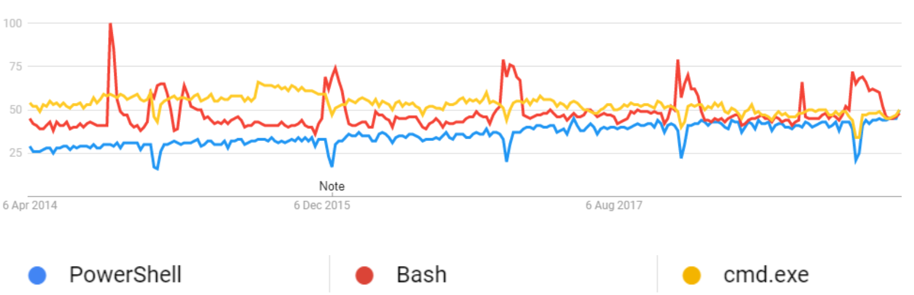
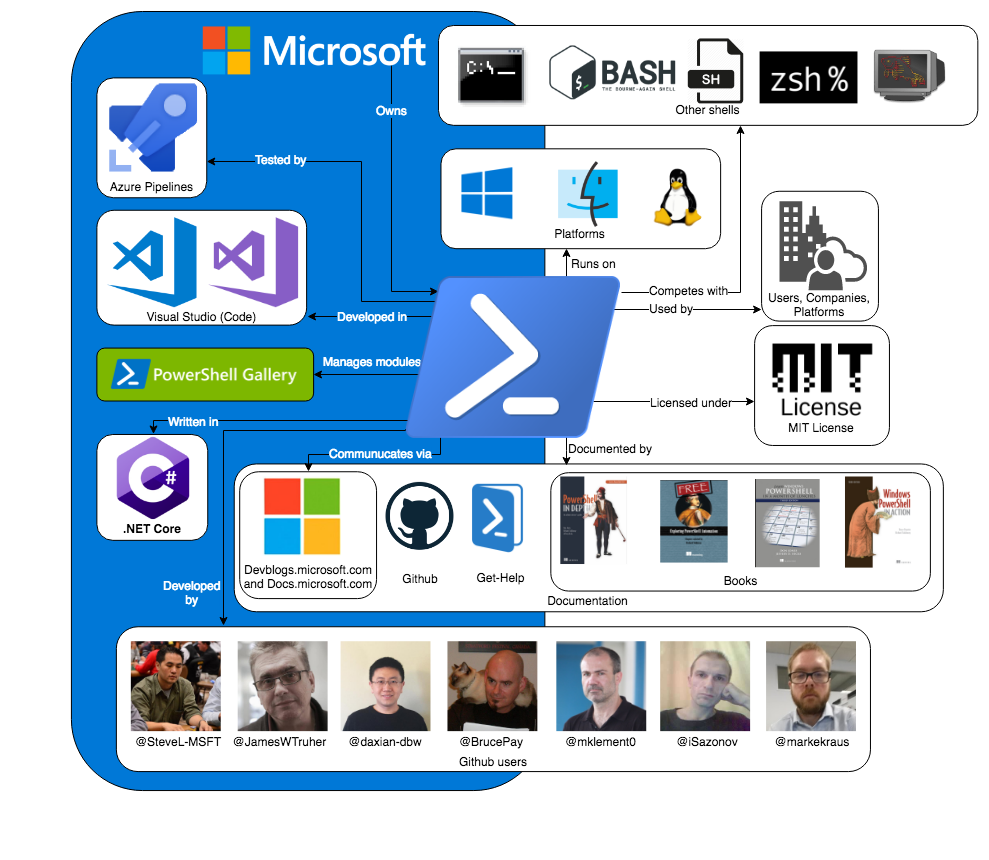

# PowerShell

By [Sytze Andringa](https://github.com/SytzeAndr), [Youri Arkesteijn](https://github.com/Exclaminator), [Bram Crielaard](https://github.com/Geweldig), and [Luka Miljak](https://github.com/LMiljak)  
_Delft University of Technology, 2019_  
  
_Official PowerShell Core logo ([on GitHub](https://github.com/PowerShell/PowerShell/blob/master/assets/powershell_128.svg))_

## Table of Contents

-   [Introduction](#introduction)
-   [Stakeholder Analysis](#stakeholder-analysis)
-   [Context View](#context-view)
-   [Development View](#development-view)
-   [Technical Debt](#technical-debt)
-   [Functional Debt](#functional-debt)
-   [Conclusion](#conclusion)
-   [References](#references)

## Introduction

This chapter aims to describe and evaluate the architecture of [PowerShell](https://github.com/PowerShell/PowerShell). To quote their own description:

> PowerShell Core is a cross-platform (Windows, Linux, and macOS) automation and configuration tool/framework that works well with your existing tools and is optimized for dealing with structured data (e.g. JSON, CSV, XML, etc.), REST APIs, and object models. It includes a command-line shell, an associated scripting language and a framework for processing cmdlets.

The framework was initially released in 2006 for Windows[^1]. A decade later, in 2016, PowerShell went open-source and became available for Linux and macOS platforms as well. It now has the benefit of an entire community contributing to the system. Figure 0.1 shows a simple overview of the history.

 **Figure 0.1** History of PowerShell[^2].

 **Figure 0.2** Google Trends of PowerShell and two of its competitors: cmd.exe and Bash.

The Google Trends figure shows that PowerShell is slightly gaining in popularity. As with any large and popular project, investigating and also evaluating its architecture is very interesting.

The first section of this chapter showcases all the related stakeholders of PowerShell. The second section contains the context view, which describes the scope of the project and also its relation to external entities. The development view can be found in the third section, which dissects the system into multiple modules, describes some common design patterns in the code and also contains a short description of the build practices. This chapter also analyzes two types of debt in PowerShell: The technical debt in section four and the functional debt in section five. The final section gives a short conclusion on the architecture as a whole.

## Stakeholder Analysis

### Stakeholder Types

Rozanski and Woods[^3] define numerous types of stakeholders. This section contains an analysis of the different types mentioned and how they apply to the PowerShell project.

#### Acquirers

The acquires of the system oversee the creation of PowerShell. This consists of both the PowerShell Committee and Microsoft at large. All changes go through the PowerShell Committee before they are included in the system.

#### Assessors

The assessors of the system make sure the product conforms to standards and legal regulation, which in the case of PowerShell is the Microsoft legal team.

#### Communicators

The communication about the system to other stakeholders is done by the PowerShell Committee and the PowerShell Maintainers. They provide information about any updates or decisions made to community as a whole. They also enforce that documentation is written when new functionality is added or undocumented behavior is found.

#### Developers

The developers of PowerShell consist of both Microsoft employees who focus on PowerShell as well as volunteers. Even though Microsoft employees make the final decision about the architecture of the system, a number of external contributors are allowed to decide when and if code should be merged. These contributors have been granted access by the committee to make these decisions.

#### Maintainers

The maintainers of the repository make sure the code evolves in a structured manner. In the case of PowerShell these maintainers consist of both the PowerShell committee (who make the final decision on whether or not design changes can occur) and the repository maintainers. The repository maintainers are (at the time of writing this report): [@daxian-dbw](https://github.com/daxian-dbw), [@TravisEz13](https://github.com/TravisEz13), [@adityapatwardhan](https://github.com/adityapatwardhan), [@iSazonov](https://github.com/iSazonov), and [@anmenaga](https://github.com/anmenaga).

#### Suppliers

PowerShells runs on different operating systems. The [Get Powershell](https://github.com/PowerShell/PowerShell#get-powershell) section in the README contains a full list of supported platforms. These platforms are considered suppliers, and because of limitations these platforms impose they should be considered as important stakeholders. Especially the Windows operating system is of interest, as PowerShell comes pre-installed on this platform.

#### Support Staff

Microsoft themselves handle the support for PowerShell. It is possible for end users to purchase a support license. Of course community support also exists by ways of [Gitter](https://gitter.im/PowerShell/PowerShell), [Slack](http://slack.poshcode.org/), [Reddit](https://www.reddit.com/r/PowerShell/), [GitHub](https://github.com/PowerShell/PowerShell/issues), or fora such as [Stack Overflow](https://stackoverflow.com/questions/tagged/powershell).

#### Testers

The testers make sure that PowerShell is fit for use. There are Microsoft employees who focus specifically on testing and continuous integration, such as [@JamesWTruher](https://github.com/JamesWTruher). Tests need to be created or adapted with every pull requests that introduces new functionality, and developers are encouraged to write their own tests. There is a rigorous testing policy for contributions to PowerShell [^4].

#### Users

There are many companies that use PowerShell in their working environment and as such they can be seen as major stakeholders. A good example is Michael Klement ([@mklement0 on GitHub](https://github.com/mklement0)), who has worked with PowerShell in a few different external professional environments[^5]. These users influence which functionality needs to be added to the language, as well as possible changes which need to be introduced. However, the PowerShell committee still has the final say over any decision made.

### Types Not Mentioned by Rozanski and Woods.

#### Dependents

Dependents are users of PowerShell who do not necessarily know they are using PowerShell. The policy upheld by the PowerShell committee is that no backwards compatibility breaking changes can be introduced. This policy exists because dependents might use PowerShell scripts which they have not written themselves, nor know how to update. As such, they will still encounter problems if breaking changes are introduced during an update to PowerShell.

#### Development Tools

Tools which target PowerShell are –among others– ISESteroids[^6], Visual Studio Code[^7], and PowerShell Studio[^8]. These systems provide tools for easy writing and editing PowerShell scripts.

#### Competitors

Competitors of PowerShell include shells such as Bash, Zsh, and Fish. They need to actively monitor each other’s evolution to see if they need to adapt their own system to stay competitive.

### Integrators For PowerShell

To decide which pull requests get merged the PowerShell project has two sets of members. Namely the PowerShell Committee and the Repository maintainers. If architectural changes are made to the system, or if new parameters are introduced to existing functions, they need to be approved by the PowerShell Committee. The committee maintains an overview of the project. They also make sure that all design changes fit the project and stay consistent with the rest of the codebase.[^9]

For all other pull requests, the maintainers can take the decision to merge. The maintainers make sure the code style is consistent and the code is of high quality. This means they have to make sure details such as variable names, design patterns, and function names are consistent when introducing new code.[^10]

When analyzing the pull requests created for PowerShell we concluded that this is not just a guideline, but is actually used in practice.

### Relevant People We Would Like To Contact

We have concluded there are three people who we believe are interesting to contact. These people are [@iSazonov](https://github.com/iSazonov), [@mklement0](https://github.com/mklement0), and [@SteveL-MSFT](https://github.com/SteveL-MSFT).

iSazonov is currently a maintainer of the PowerShell project on GitHub, however he is not an employee of Microsoft. For every pull request we have read it was difficult to find one in which he had not participated.

mklement0 is extremely active in the community and has been using PowerShell in a professional setting since 2010. Hearing from someone who has actively seen the system evolve as both a user as well as a developer would result in an interesting insight.

SteveL-MSFT is a member of the PowerShell Committee and actively participates in discussion on most pull requests. Hearing the input of one of the core team members would shine light on the decisions made when designing the PowerShell architecture.

### Pull Request Analysis

We analyzed 10 open and 10 closed pull requests. From analyzing these we conclude the following:

1.  The main focus is that pull request actually solve an issue (an issue should be referenced from a pull request).[^11]–[^23]
2.  All changes should be tested (to ensure a high coverage and minimize the amount of unexpected behavior).[^11], [^12], [^14]–[^17], [^19]–[^22],\^[4\]–[^26]
3.  There should not be backwards compatibility changes, PowerShell **must** be backwards compatible.[^21], [^22], [^26], [^27]
4.  Comments should be correct, or removed if not needed.[^15]–[^17], [^19], [^22]–[^26]
5.  Code should be consistent, the naming of parameters and default values of parameters give way to many discussions.[^15]–[^17], [^19], [^22]–[^24], [^26], [^28]
6.  If a pull request becomes too complex, it is closed and split up into multiple pull requests.[^14], [^21], [^24], [^26], [^29]
7.  Design changes and improvements can be discussed through the RFC (Request For Comments) process, which provides the community with a way to leave feedback on documents instead of written code.[^24], [^27], [^28]
8.  The PowerShell team is open to outsiders challenging their calls. Even if you have never contributed any code, if you disagree with their decisions and can explain why, they will reconsider.[^16], [^17], [^20], [^22]
9.  People who have opened the issue are contacted to see if an issue is actually resolved by a pull request, and not just believed to be solved by the author.[^19]
10. Community members are contacted by the core team for their input, not just the seniors make every decision without talking to the rest of the community.[^20]

### Power/Interest Grid

Figure 1.1 shows how the stakeholders mentioned in section 1.2 and 1.3 can be classified in terms of power and interest.

  
**Figure 1.1**. A power/interest grid of several entities that have a relation with the system.

## Context View

This section describes the Context view of the system. The view defines what PowerShell does, which is described in section 2.1 using a scope definition. Furthermore, the view also describes the relation between the system and external entities. These relations can be found in Section 2.2, where are Context diagram was used as the method of modeling these relations.

### System Scope

The scope definition of PowerShell is described as a list of **key** requirements of the systems. These requirements are as follows:

-   Provide a task automation and configuration management framework.[^30]
-   Provide availability on multiple platforms (Windows, Linux, and macOS).[^30]
-   Include a command-line shell.[^30]
-   Allow users to easily extend PowerShell with their own commands and frameworks.[^31]
-   Work with structured data (as opposed to plain text, as used by other traditional Shells).[^30]
-   Include a scripting language.[^30]
-   It should be easy to learn by users even when coming from a similar tool (like Bash).[^32]
-   Updates should be backward compatible.[^33]

### Context Diagram

The Context diagram (Figure 2.1) showcases the most important external entities of PowerShell and indicates what the relation between them and the system is.

  
**Figure 2.1**. A Context diagram for PowerShell. It consists of mostly of the stakeholders mentioned in chapter 1, but also the development language `C#`, Azure continuous integration[^34], and several other resources (books, package manager, …) for PowerShell users[^35]. PowerShell is licensed under the MIT license[^36]. All entities inside the blue area are owned by Microsoft.

## Development View

This section describes the Development Viewpoint of the system. Section 3.1 dissects PowerShell into multiple modules and shows the dependencies between them. 3.2 describes some design choices made for repeating problems. A short description of the build process is found in 3.3.

### Module Structure

This section provides an overview of the module structure of PowerShell and what the dependencies between these modules are.

 **Figure 3.1**. A Module Structure representing PowerShell.

As visible in the figure, we view each namespace within PowerShell as a separate module. It makes sense to use this C\# language construct in order to organize classes. The largest namespace is `Microsoft`, which in turn contains two namespaces `PowerShell` and `WSMan` (Web Services Management). `WSMan` provides utility for remote management for both the host as well as the client side.

The `PowerShell` namespace in turn contains several other namespaces. `ConsoleHost` provides an access point from the console to the PowerShell engine process, as referenced [here](https://PowerShell.org/2013/10/the-shell-vs-the-host/). `Eventing` allows for asynchronous events to be created and handled. The `Commands`namespace contains *most* of the built in cmdlets of PowerShell. PowerShell distinguishes three types of commands where all three are represented using namespaces. `Diagnostics` contains commands for managing data in event logs. `Management` provides commands for managing Windows settings such as `Move-Item`, `New-Service`, and `Rename-Computer`. The last command type is `Utility`, which provides commands for managing the basic features of PowerShell such as `Set-Alias`, `ConvertTo-Json` and unexpectedly `Set-Date`.

There are two more modules outside of the commands namespace, namely `Security` and `MarkdownRenderer`. `Security` provides commands that manage the basic security features in Windows, like execution policies and signatures. `MarkdownRenderer` provides commands used to transform from Markdown to PowerShell’s internal notation. [This post](https://ephos.github.io/posts/2018-8-1-PowerShell-Markdown) describes how to these features in detail.

Lastly there is `System.Management.Automation` namespace. `Automation` is the place where commands are evaluated, errors are created, and results are produced. Every other module in the system depends on this module, which clearly makes it the bottom layer of PowerShell.

There are some unexpected architectural design choices made. Notable is the placement of packages containing commands outside of the command package and the number of namespaces named `Management`. Also, the `Automation` package has very high coupling with the `Microsoft.PowerShell` namespace, but is not contained inside it. Furthermore, there is an unclear namespace for eventing.

Lastly, the folder structure of the project does not correspond one-to-one with the namespaces. Within namespaces there exist folders that contain classes that still belong to that same namespace. Unlike for instance Java, C\# permits this type of file organization. In PowerShell, folders are used to group classes so that they can be found more easily. However, these classes still solely exist to serve the namespace. Similarly to this, `.cs` files also often contain more than one class. We would argue that there are some cases where a separate namespace is preferred over just a folder, such as the engine folder inside of the `Automation` namespace, but in the end it all boils down to preferences.

This analysis of the modules within PowerShell and the dependencies between them was done using [code maps in Visual Studio Enterprise](https://docs.microsoft.com/en-us/visualstudio/modeling/map-dependencies-across-your-solutions?view=vs-2017). The actual description of each individual module was done by manually reviewing the code, as there is no larger document on the PowerShell repository mentioning the namespace overview or the folder structure.

### Common Design

This section identifies several commonalities in the code across different implementations. While PowerShell only imposes some minor design constraints in [their coding guidelines](https://github.com/PowerShell/PowerShell/blob/master/docs/dev-process/coding-guidelines.md), looking at the code one finds that there are some choices made that reflect some designs that the PowerShell developers prefer.

**Defining cmdlets**. Cmdlets in PowerShell (both internal and external) are defined by creating a class that extends the `Cmdlet` class contained within the `Automation` namespace. These classes are then processed using reflection in C\#. Commands are the only part of the code that intensively use reflection and C\# attributes (which are similar to Java annotations). [This](https://github.com/PowerShell/PowerShell/blob/master/docs/cmdlet-example/visual-studio-simple-example.md) document contains an example on how users can define their own cmdlet. Built-in PowerShell commands use the exact same pattern of defining them.

**Input validation**. The input PowerShell gets comes in the form of commands. This is why the input validation process happens in the class that defines that particular cmdlet. Developers can put constraints on arguments given to parameters by adding C\# attributes to them. For example, the `ConvertTo-Json` command takes a Depth parameter. The code snippet below shows how this parameter is defined in the `ConvertToJsonCommand` class contained in the `Commands.Utility` namespace.

Notable is the usage of the `ValidateRange(1, int.MaxValue)` attribute, which is used to validate that the given depth is at least one. In the `Automation` namespace, the `Attributes.cs` file defines many of these attributes that are commonly used for input validation. Obviously there are cases that are not that common. For these, traditional if statements are used and exceptions thrown if the input is in an incorrect format.

**Platform Dependent code**. It often arises that there needs to a different flow depending on the operating system. PowerShell chooses to use preprocessor directives to get platform-specific builds. The creates code constructs of the following form:

    #if UNIX
          ..... // UNIX specific code here
    #else
          .....

However, the code guidelines mention that runtime checks are acceptable if it greatly improves the readability without causing performance concerns in performance-sensitive code.

**Dependency Inversion**. The DI principle states that classes should depend on abstractions rather than concrete classes. PowerShell only follows this partially. From analyzing the code, it is clear that interfaces are only used if there are two or more implementations of the interface.

**Interface Extension**. Sometimes interfaces need to be extended with new behavior. An example is the `ICommandRuntime` interface in the `Automation` namespace, which defines the set of functionality that must be implemented to directly execute an instance of `Cmdlet`. Later in the development process, the need arose to add functionality to this interface to add support writing an informational record to the host or user. Rather than adding this to the interface itself, PowerShell chooses to extends the `ICommandRuntime` interface with a new interface, appropriately named `ICommandRuntime2`. Note that this mostly only applies to interfaces and not classes.

### Codeline Overview

PowerShell has build instructions for each mayor operating system[^37]. Using Azure Pipelines, they run nightly builds for each operating system[^38]. As per their [Testing Guidelines](https://github.com/PowerShell/PowerShell/blob/master/docs/testing-guidelines/testing-guidelines.md), contributors are expected to write automated tests for their code, which are actively checked in Pull Requests.

## Technical Debt

Technical debt builds when development teams decide to implement an easy solution to their problem without thinking about extendability, either because of time constraints or inexperience. These “easy” solutions can take the shape of code which can not be extended without major refactors, or entire projects which are no longer worthwhile to maintain.

### Code Quality Debt

The repository was analyzed using CodeFactor and SonarQube[^39]. The main issues found took the form of overly complex methods and style errors. Both of these hinder the extensibility and readability of the code. Ignoring auto-generated files, there are methods with a cyclomatic complexity [up to 405](https://www.codefactor.io/repository/github/powershell/powershell/issues?category=Complexity&groupId=54), and classes with a complexity [up to 1743](https://www.codefactor.io/repository/github/powershell/powershell/issues?category=Complexity&groupId=54&page=1). There also are many exceptions which are ignored without explanation, making it difficult to understand the intentional behavior.

An example of a specific file which contains multiple critical errors [can be found here](https://sonarcloud.io/project/issues?id=Geweldig_PowerShell&open=AWmGjwGfqQlSul0krTwZ&resolved=false&severities=CRITICAL&types=BUG). Among other issues it contains getters which do not return the expected value (either different fields or null), as well as setters which set unrelated fields to their name. This is bug prone and should be refactored.

During a manual analysis multiple violations of the Liskov substitution principle were found. For example, in the file [`ProviderBaseSecurity.cs`](https://github.com/PowerShell/PowerShell/blob/master/src/System.Management.Automation/namespaces/ProviderBaseSecurity.cs) on line 40 the method assumes that a subclass of Cmdlet implements the ISecurityDescriptorCmdletProvider, which violates this principle. A similar violation can be found in [`ProviderBase.cs`](https://github.com/PowerShell/PowerShell/blob/master/src/System.Management.Automation/namespaces/ProviderBase.cs) on line 262.

There is also debt which has been confirmed, such is in [`RemoteSessionCapability.cs`](https://sonarcloud.io/project/issues?fileUuids=AWmGjvRDqQlSul0krSOc&id=Geweldig_PowerShell&open=AWmGjv02qQlSul0krTIp). As old releases can not be changed, the debt addressed in this comment can not be resolved in later releases.

  
**Figure 4.1**. Hard-coded version numbers.

By analyzing the historic data provided by CodeFactor we can see the number of issues has decreased to 50% of its maximum, but is still not up to the defined standards. The initial spike in issues can be traced back to [this commit](https://github.com/PowerShell/PowerShell/commit/d67d87caf0b7e87a8fee6f03328113e332add3e9), where more rules were introduced.

  
**Figure 4.2**. Code issue history.

### Testing Debt

Because of the high complexity of the codebase it is infeasible to write exhaustive tests. For example [this file](https://www.codefactor.io/repository/github/powershell/powershell/source/master/src/System.Management.Automation/engine/Modules/ModuleCmdletBase.cs#L1452) contains a method with a complexity of 405, meaning there should be 2405 (~8x10121) test cases to test *this single method* exhaustively. Refactoring this method would improve testability and readability, as it has already been informally split by using comments.

The file [`CodeCoverageAnalysis.md`](https://github.com/PowerShell/PowerShell/blob/master/docs/testing-guidelines/CodeCoverageAnalysis.md) reports *“hot spots of missing coverage”*. It also states that *“The metrics used for selection of these hot spots were: \# missing lines and likelihood of code path usage.”*. This is risky, as bugs on infrequently used paths can lead to major issues further along in the program.

The reported line coverage is 63.2%, which is much lower than one would hope. For example, when opening [this pull request](https://github.com/PowerShell/PowerShell/pull/9091) breaking changes were almost introduced which were not covered by tests, and went unnoticed by multiple reviewers before being resolved. Interestingly, the reported coverage was not updated for over four months and has been manually updated for the release of PowerShell 6.2.0. It also does not take into account branch coverage but only looks at line coverage.

  
**Figure 4.3**. Coverage generated by Codecov.

Furthermore, when manually running the coverage tools according to the documentation provided, we arrive at a line coverage of 37.7% and a branch coverage of 29.7%. This shows a discrepancy in the tools used.

  
**Figure 4.4**. Coverage generated manually.

Historically the coverage jumps between 40% and 60%. There are single commits which make the line coverage either drop or raise 20%, which shows there are issues with the way the coverage is calculated.It is also worth nothing that [this file](https://github.com/PowerShell/PowerShell/blob/master/docs/testing-guidelines/getting-code-coverage.md) states a subset of the test suite is run for continuous integration, meaning functionality can break without being noticed by the CI.

  
**Figure 4.5**. The coverage jumping 18% between commits.

### Usage of Tools by The Community

As is best practice PowerShell makes use of automated tools which aid the developer in writing code according to the standards defined by the development team. However, the development team does not take these rules to heart and disagrees with the results. [There are pull requests](https://github.com/PowerShell/PowerShell/pull/8500) to tweak these tools and better align them with the views of the development team. Unfortunately, these pull requests are often left open for months as no decision can be reached.

As a result of the development team not agreeing with their tools there are many (easy to resolve) open issues, which are not prioritized. Furthermore, the data these tools provide might even be completely incorrect. As previously mentioned the test coverage [had not been updated for four months](https://codecov.io/gh/PowerShell/PowerShell). Because of this the metrics do not represent the state of the codebase, meaning they are untrustworthy. These tools should lead to a cleaner and better codebase, but are ignored and deemed inconvenient.

A major issue which arose because of the decision to ignore the metrics is that old code suffers from technical debt which can not be resolved. For example, hard-coded version numbers can not be resolved, as PowerShell prioritizes backwards compatibility which would be broken by resolving the issue. This means if the analysis tools continue to be ignored, the codebase will continue to get worse over time with no way to fix it. As such, the tools should be configured correctly and their results should be used as suggestions for improvements, instead of being treated as annoyances.

### Recommendations

The development team should prioritize paying their technical debt. The issues raised by CodeFactor should either be resolved, or rules should be adapted to accurately reflect the intentions of the development team. Files and methods should be split up to make the flow of code through the system easier to understand and to reduce the cyclomatic complexity. Also, the test coverage should be accurately reported, as well as more tests added, as there is uncommon intended behavior which is not covered by tests. All of these changes would result in a more newcomer friendly project, while also making it easier to spot mistakes early on in the process.

## Functional Debt

Functional debt is not a widely used term in software development. [Roman Predein](https://dzone.com/articles/functional-debt-vs-technical-debt-in-software-deve) mentioned that there are only a few references to this phenomenon and that they do not match how he sees it. We therefore conclude that, at the moment, functional debt has no “real” definition. Therefore, we explain in 5.1 what we regard as functional debt. 5.2 explains the relation between this debt and backwards compatibility. The rest of the subsections explain how it relates to PowerShell.

### Defining Functional Debt

We consider functional debt to be *the amount of mismatches between expected and actual functionality*.

By *expected functionality* we mean what functionality the user would expect. The *actual functionality* is the functionality of the system. To explain the concept, we will distinguish three types of functional debt by the way they are introduced into the system.

1.  *When the user expects to find a particular feature, but it does not exist*. This is a result of improperly documenting what the system should and should not be able to do.
2.  *When the developer and the user have different expectations of the behavior for a particular functionality.* This can be caused by the user misinterpreting the documentation due to inaccuracies or vagueness. Inappropriate naming of functions also causes this difference.
3.  *When the intended functionality of a function differs from the actual functionality*. This happens through mistakes and can be tackled by having low technical debt, as it then becomes harder for bugs to slip in.

As shown, usually functional debt can be prevented by having proper documentation and low technical debt. However, it is impossible to protect a project from every form of functional debt. A system should therefore acknowledge that functional debt can be introduced into the system, and should come up with a strategy to tackle it.

### Backwards Compatibility

Functional debt can become an even bigger issue when considering backwards compatibility. If following backwards compatibility in the most strict sense possible, it would not be possible to fix any functional debt introduced earlier from the second or third categories as discussed earlier, since that would change the functionality of some already existing feature. If being less strict, it is possible to fix functional debt by allowing some forms of breaking changes. A policy for solving technical debt can be considered an important architectural design choice for systems where backwards compatibility plays a role.

To help us draw a relation between functional debt and backwards compatibility, we introduce a term called the *backwards compatibility cost*. This cost is a measurement of the amount of damage when the contribution is accepted in the context of backwards compatibility. In general, a contribution with high functionality changes corresponds to a high backwards compatibility cost and vice-versa.

To any contribution, we can assign a backwards compatibility cost and an amount of functional debt it solves. If we neglect technical debt, and if the backwards compatibility cost is lower than the amount of functional debt it would solve, we should accept it. Else, if higher, reject.

  
**Figure 5.1**. Strong backwards compatibility commitment makes it harder to fix functional bugs

### PowerShell’s Breaking Changes Contract

PowerShell’s [breaking changes contract](https://github.com/PowerShell/PowerShell/blob/master/docs/dev-process/breaking-change-contract.md) explains how PowerShell handles backwards compatibility. We will view this contract from a functional debt perspective, which follows the rules defined earlier.

PowerShell has a serious commitment towards backwards compatibility. Any stable existing feature shipped has to be introduced in any next version of PowerShell. New features which are marked as *“in preview”* are still allowed to be modified. Breaking changes are classified into four *“buckets”*: Public Contract, Reasonable Grey Area, Unlikely Grey Area, Clearly Non-Public.

The Public Contract and Clearly Non-Public buckets follow a set of rules to decide whether it should be accepted. This can be interpreted as assigning either zero (when the breaking change is allowed) or infinity (when not allowed) backwards compatibility cost to contributions within these buckets.

For the two grey areas, the backwards compatibility cost has to be determined by judgement, and functional debt has to be weighed against the backwards compatibility cost.

As explained earlier, when dealing with backwards compatibility we should think about how to handle bugs. PowerShell allows this under some circumstances, by allowing the change of *“any existing behavior that results in an error message”*. On the other hand, *“It doesn’t matter if the existing behavior is ‘wrong’”* and *“we must be extremely sensitive to breaking existing users and scripts”*. This shows that PowerShell has thought of this, by providing some kind of upper and lower bound of when the fix is allowed.

### Example

[Pull request \#1901](https://github.com/PowerShell/PowerShell/pull/1901) is a nice example where commitment towards backwards compatibility shows how functional debt grows over time.

[@bagder](https://github.com/bagder) thinks adding `curl` and `wget` was a *“breaking change”* and should therefore be removed. If we would map [@bagder](https://github.com/bagder)’s view to ours, the expected functionality is that PowerShell should never overwrite commonly used commands. He received a lot of support from others and thus it is reasonable to think the contribution would reduce functional debt.

[@lzybkr](https://github.com/lzybkr) says that at the time of adding the alias, *“the design decision was consistent”*. At the time, [@lzybkr](https://github.com/lzybkr) had a different interpretation of expected functionality. However, he also says that it may have been misguided to add the aliases in the first place. Due to it being a breaking change, the pull request got closed. However, we think that if backwards compatibility was of less importance, the discussion would be pointed towards removing as much functional debt as possible.

This showed that commitment towards backwards compatibility can lead to functional debt, which can be very hard or impossible to fix over time. If, at the time of implementing, one would have noticed it would increase functional debt, the issue could have been provoked and resolved, since it would not have introduced breaking compatibility cost.

### Concluding Remarks

There are numerous ways to prevent functional debt being introduced. Preventing functional debt is important when considering backwards compatibility. We think PowerShell can improve on this debt by focusing on the following:

-   Have accurate documentation about the expected functionality of the system.
-   Carefully consider introducing any new feature before shipping it.
-   Provide indications how to measure backwards compatibility cost and functional debt to help in the decision making.
-   Reduce technical debt so bugs are less likely to occur.

## Conclusion

To quote the user [@mklement0](https://github.com/mklement0):

> PowerShell has the potential to become the lingua franca of the shell world.

This means that PowerShell has the potential to become the shell that is used by developers from different backgrounds. However, as the architecture shows, there is much to improve in order to achieve this potential.

PowerShell has:

-   a good governance model and integration policy. Pull requests are thoroughly examined by those responsible for merging them.
-   a module structure that could potentially use some organization. Developers might find it difficult to know where they will need to place their code at, or where to find the implementation of certain functionality.
-   simple and good working common design patterns in the code.
-   to pay more attention to technical debt. There is unmaintainable code due to high cyclomatic complexity, and therefore it also has low testability. This in turn reflects on the functional debt.
-   an understandably strict policy on backwards compatibility. However, this causes much of the functional debt in the system to be unpayable.

All things considered, PowerShell does a relatively good job on their architecture. We hope that the future shows that it is possible to overcome the challenges which are currently present in the project.

## References

[^1]: Wikipedia, “PowerShell: Versions.” \[Online\]. Available: <https://en.wikipedia.org/wiki/PowerShell#Versions>. \[Accessed: 10-Apr-2019\]

[^2]: Microsoft, “Microsoft Technet Blogs.” \[Online\]. Available: <https://blogs.technet.microsoft.com/>. \[Accessed: 10-Apr-2019\]

[^3]: N. Rozanski and E. Woods, *Software Systems Architecture: Working With Stakeholders Using Viewpoints and Perspectives*, 2nd ed. Addison-Wesley Professional, 2011.

[^4]: Microsoft, “PowerShell testing guidelines.” 2018 \[Online\]. Available: <https://github.com/PowerShell/PowerShell/blob/master/docs/testing-guidelines/testing-guidelines.md>

[^5]: M. Klement, “LinkedIn profile.” 2019 \[Online\]. Available: <https://www.linkedin.com/in/mklement0/>

[^6]: PowerTheShell, “ISESteroids.” \[Online\]. Available: <http://www.powertheshell.com/isesteroids/>. \[Accessed: 28-Mar-2019\]

[^7]: Microsoft, “Visual Studio Code.” \[Online\]. Available: <https://code.visualstudio.com/>. \[Accessed: 28-Mar-2019\]

[^8]: Sapien Technologies, Inc., “PowerShell Studio 2019.” \[Online\]. Available: <https://www.sapien.com/software/powershell_studio>. \[Accessed: 28-Mar-2019\]

[^9]: Microsoft, “PowerShell Governance.” \[Online\]. Available: <https://github.com/PowerShell/PowerShell/blob/master/docs/community/governance.md#powershell-committee>. \[Accessed: 28-Mar-2019\]

[^10]: Microsoft, “Repository Maintainers.” \[Online\]. Available: <https://github.com/PowerShell/PowerShell/blob/master/docs/maintainers/README.md>. \[Accessed: 28-Mar-2019\]

[^11]: I. Sazonov, “PowerShell pull request \#3690.” \[Online\]. Available: <https://github.com/PowerShell/PowerShell/pull/3690>. \[Accessed: 27-Mar-2019\]

[^12]: C. Bergmeister, “PowerShell pull request \#4612.” \[Online\]. Available: <https://github.com/PowerShell/PowerShell/pull/4612>. \[Accessed: 27-Mar-2019\]

[^13]: S. Vorobev, “PowerShell pull request \#4618.” \[Online\]. Available: <https://github.com/PowerShell/PowerShell/pull/4618>. \[Accessed: 27-Mar-2019\]

[^14]: M. Klement, “PowerShell pull request \#4761.” \[Online\]. Available: <https://github.com/PowerShell/PowerShell/pull/4761>. \[Accessed: 27-Mar-2019\]

[^15]: C. Bergmeister, “PowerShell pull request \#5051.” \[Online\]. Available: <https://github.com/PowerShell/PowerShell/pull/5051>. \[Accessed: 27-Mar-2019\]

[^16]: GitHub user @zhenggu, “PowerShell pull request \#5525.” \[Online\]. Available: <https://github.com/PowerShell/PowerShell/pull/5525>. \[Accessed: 27-Mar-2019\]

[^17]: A. patwardhan, “PowerShell pull request \#5760.” \[Online\]. Available: <https://github.com/PowerShell/PowerShell/pull/5760>. \[Accessed: 27-Mar-2019\]

[^18]: M. Kraus, “PowerShell pull request \#6782.” \[Online\]. Available: <https://github.com/PowerShell/PowerShell/pull/6782>. \[Accessed: 27-Mar-2019\]

[^19]: I. Sazonov, “PowerShell pull request \#7702.” \[Online\]. Available: <https://github.com/PowerShell/PowerShell/pull/7702>. \[Accessed: 27-Mar-2019\]

[^20]: P. Braathen, “PowerShell pull request \#8131.” \[Online\]. Available: <https://github.com/PowerShell/PowerShell/pull/8131>. \[Accessed: 27-Mar-2019\]

[^21]: R. Holt, “PowerShell pull request \#8142.” \[Online\]. Available: <https://github.com/PowerShell/PowerShell/pull/8142>. \[Accessed: 27-Mar-2019\]

[^22]: A. Gauthier, “PowerShell pull request \#8199.” \[Online\]. Available: <https://github.com/PowerShell/PowerShell/pull/8199>. \[Accessed: 27-Mar-2019\]

[^23]: S. Barizien, “PowerShell pull request \#8745.” \[Online\]. Available: <https://github.com/PowerShell/PowerShell/pull/8745>. \[Accessed: 27-Mar-2019\]

[^24]: R. Holt, “PowerShell pull request \#3169.” \[Online\]. Available: <https://github.com/PowerShell/PowerShell/pull/3169>. \[Accessed: 27-Mar-2019\]

[^25]: I. Sazonov, “PowerShell pull request \#6718.” \[Online\]. Available: <https://github.com/PowerShell/PowerShell/pull/6718>. \[Accessed: 27-Mar-2019\]

[^26]: J. Swallow, “PowerShell pull request \#7509.” \[Online\]. Available: <https://github.com/PowerShell/PowerShell/pull/7509>. \[Accessed: 27-Mar-2019\]

[^27]: D. Stenberg, “PowerShell pull request \#1901.” \[Online\]. Available: <https://github.com/PowerShell/PowerShell/pull/1901>. \[Accessed: 27-Mar-2019\]

[^28]: J. L. Whitlock, “PowerShell pull request \#3125.” \[Online\]. Available: <https://github.com/PowerShell/PowerShell/pull/3125>. \[Accessed: 27-Mar-2019\]

[^29]: R. Dunham, “PowerShell pull request \#8886.” \[Online\]. Available: <https://github.com/PowerShell/PowerShell/pull/8886>. \[Accessed: 27-Mar-2019\]

[^30]: Microsoft, “PowerShell README.” \[Online\]. Available: <https://github.com/PowerShell/PowerShell/blob/master/README.md#-powershell>. \[Accessed: 08-Apr-2019\]

[^31]: Microsoft, “Cmdlet Example.” \[Online\]. Available: <https://github.com/PowerShell/PowerShell/blob/master/docs/cmdlet-example/command-line-simple-example.md>. \[Accessed: 08-Apr-2019\]

[^32]: Microsoft, “Map Book for Experienced Bash users.” \[Online\]. Available: <https://github.com/PowerShell/PowerShell/tree/master/docs/learning-powershell#map-book-for-experienced-bash-users>. \[Accessed: 08-Apr-2019\]

[^33]: Microsoft, “Breaking Change Contract.” \[Online\]. Available: <https://github.com/PowerShell/PowerShell/blob/master/docs/dev-process/breaking-change-contract.md>. \[Accessed: 08-Apr-2019\]

[^34]: Microsoft, “Testing Guidelines.” \[Online\]. Available: <https://github.com/PowerShell/PowerShell/blob/master/docs/testing-guidelines/testing-guidelines.md#ci-system>. \[Accessed: 08-Apr-2019\]

[^35]: Janik von Rotz, “Awesome PowerShell.” \[Online\]. Available: <https://github.com/janikvonrotz/awesome-powershell>. \[Accessed: 08-Apr-2019\]

[^36]: Microsoft, “MIT license.” \[Online\]. Available: <https://github.com/PowerShell/PowerShell/blob/master/LICENSE.txt>. \[Accessed: 08-Apr-2019\]

[^37]: Microsoft, “Build Instructions.” \[Online\]. Available: <https://github.com/PowerShell/PowerShell#building-the-repository>. \[Accessed: 10-Apr-2019\]

[^38]: Microsoft, “Build Status.” \[Online\]. Available: <https://github.com/PowerShell/PowerShell#build-status-of-nightly-builds>. \[Accessed: 10-Apr-2019\]

[^39]: SonarQube, “PowerShell SonarQube report.” \[Online\]. Available: <https://sonarcloud.io/dashboard?id=Geweldig_PowerShell>. \[Accessed: 17-Mar-2019\]
