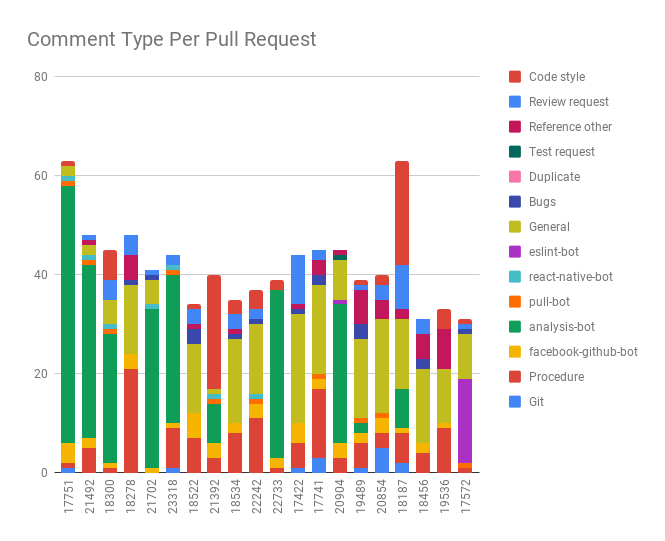

# React Native

[J.S. Abrahams](http://github.com/JSAbrahams), [G. Andreadis](https://github.com/gandreadis), [C.C. Boone](https://github.com/casperboone), [F.W. Dekker](https://github.com/FWDekker)

*Delft University of Technology*

## Table of Contents

-   [Introduction](#introduction)
-   [Stakeholders](#stakeholder-analysis)
-   [Context View](#context-view)
-   [Development View](#development-view)
-   [Pull Request Analysis](#pull-request-analysis)
-   [Technical Debt](#technical-debt)
-   [Architecture of Apps Written in React Native](#architecture-of-apps-written-in-react-native)
-   [Conclusion](#conclusion)
-   [Appendices](#appendices)

## Introduction

With the mobile form factor becoming increasingly common for consumer applications, the quality, and coherence of user experience are more important than ever. No longer are users satisfied with services wrapping a web application in a web view container and publishing it as a mobile application. Users expect native, high-quality interfaces which fit well in their host’s ecosystem. React Native provides a framework for developing such interfaces, in a cross-platform fashion. By writing JavaScript code with React components, developers can leverage native Android and iOS components and APIs.

In this chapter, we present our view of the React Native framework. First, we take a look at the stakeholders involved in the project and place it in its broader context. We then dive into React Native’s architecture and implementation. Following this, we investigate the process that the React Native team employs to integrate changes and evaluate the past and current state of technical debt in the system. Finally, we analyze how developers use React Native and what improvements can be gathered from these patterns.

## Stakeholder Analysis

We conducted a stakeholder analysis to find which parties have an interest in the development of React Native. We categorized these into stakeholder classes as outlined in Rozanski and Woods [^1], and added three more classes relevant to this project: competitors, ecosystem enhancers, and integrators.

While Rozanski and Woods distinguish between testers, maintainers, and developers, we found that these are the same people in the case of React Native, and thus combined these classes into the developer class. Finally, since React Native is an open source framework, we have left out the system administrator class.

### The Role of Facebook

React Native is the outcome of an internal Facebook hackathon in 2013 [^2]. Since 2015, it is available as an open-source framework [^3]. Initially, it only had iOS support, but Android support was added after a few months. Facebook had already built two apps using React Native at the time it was released: Facebook Ads Manager and Facebook Groups [^4]. Currently, the company also uses React Native for the Facebook app [^5].

React Native is thus an important project for Facebook, both as a developer and as an end user. Therefore, Facebook invests in the development of React Native and has a development team working on it [^6]. Since they are so involved in the product, Facebook appears in almost all stakeholder classes as a relevant stakeholder.

### Stakeholder Classes

#### Acquirers

According to Rozanski and Woods, the group of “acquirers” typically includes senior management [^1]. It is easy to conclude (from [“The Role of Facebook”](#the-role-of-facebook)) that the members of the senior management team at Facebook are the acquirers: They fund the internal development team, and they need the end product to run their business.

#### Assessors

All contributors are required to sign the [Contributor License Agreement](https://code.facebook.com/cla) (CLA) before their PRs are even reviewed. The terms and conditions of this CLA include provisions placing the responsibility for third-party license infringements on the contributor and ensuring the transfer of ownership for accepted contributions.

To assess whether PRs are compliant with the project’s standards and expectations, React Native makes use of bots that perform preliminary checks (e.g., CLA compliance, code style), in addition to the automatic testing done by CI services.

If there are no remarks from the bots and the automatic tests pass, the [integrators](#integrators) are responsible for further checking of compliance. Legal compliance of PRs is further checked by the core team’s PR reviews, CI checks (both on GitHub and Facebook’s internal systems), and perhaps some internal checks behind the scenes.

#### Communicators

Communication about React Native happens on various channels, ranging from [Twitter](https://twitter.com/ReactNativeComm) to their [blog](https://facebook.github.io/react-native/blog/). React Native also provides more in-depth communication on their [website](https://facebook.github.io/react-native/) (maintained by [hramos](https://github.com/hramos) and [charpeni](https://github.com/Charpeni)). The [community GitHub organization](https://github.com/react-native-community/) hosts several communication repositories such as the [discussions and proposals repository](https://github.com/react-native-community/discussions-and-proposals).

Within the project, we have identified [hramos](https://github.com/hramos) and [cpojer](https://github.com/cpojer) as communicators by analyzing metadata files such as `CODEOWNERS` and looking at commits on documents like [README.md](https://github.com/facebook/react-native/blob/master/README.md) and [CONTRIBUTING.md](https://github.com/facebook/react-native/blob/master/CONTRIBUTING.md).

#### Competitors

Competitors are also important stakeholders, influencing the reputation of the field and the innovation and progress within that field. If a competitor introduces a new feature, React Native may want to implement this feature as well, to keep its user base. We list the competitors of React Native in the Power-Interest diagram later in this section.

#### Developers

React Native has well over a thousand different contributors. Some of them stand out in particular: the core team and the most active contributors. We have analyzed the 15 most active contributors in terms of the number of commits [^8]. We see five members of the core team in this list, but also seven other Facebook employees. Only 3 of the top-15 are not Facebook employees. The full analysis of top contributors can be found in the appendix.

#### Ecosystem Enhancers

The ecosystem of any framework consists of its ecosystem enhancers, which may be build tools and quality control mechanisms. As such, ecosystem enhancers provide a mutualistic relation with React Native: They could not exist without React Native because they are built especially for the language, but without ecosystem enhancer no-one would want to use React Native.

There are various community-supported projects that bring React Native to other platforms, such as [React Native Windows](https://github.com/Microsoft/react-native-windows), [ReactXP](https://microsoft.github.io/reactxp/), and [React Native macOS](https://github.com/ptmt/react-native-macos), but there are also dedicated toolchains such as [Expo](https://expo.io). Other relevant ecosystem enhancers are IDEs such as [JetBrains WebStorm](https://www.jetbrains.com/webstorm/), which facilitate writing programs in React Native and thereby make React Native more attractive to use. As such, ecosystem enhancers are interested in and have some power over React Native.

#### End-Users

Indirectly, React Native is being used by more than a billion end-users worldwide [^9]. These end-users are typically not interested in the technical details that make an app work. However, they care about non-functional properties that are a direct result of these details. If React Native allows the developers to decrease turnaround time on issues and improve cross-platform support, this can benefit the end-users of the apps made with React Native.

#### Integrators

Integrators are responsible for deciding whether a PR should be merged, and thereby determine the direction React Native evolves in. The React Native repository assigns specific users as the [“code owners”](https://github.com/facebook/react-native/blob/master/.github/CODEOWNERS) of parts of the codebase and requires that these code owners approve any PR touching this code before it can be merged. React Native currently has five code owners with different responsibilities:

-   [shergin](https://github.com/shergin) – The core
-   [cpojer](https://github.com/cpojer), [hramos](https://github.com/hramos) – Markdown files and dependency management
-   [janicduplessis](https://github.com/janicduplessis) – The animation framework
-   [mhorowitz](https://github.com/mhorowitz) – The C++ bridge

##### Analysis of Integration Strategies

The daily work of the integrators consists of various (often implicit) decision strategies. Following the research of Gousios et al. [^10], we now take a look at how integrators decide when (not) to merge a PR. We start by analyzing the comments of integrators on 25 randomly-sampled accepted and rejected PRs. Since it is often not possible to accurately interpret the strategies that were considered by an integrator in the merging process, we only report on the ones that we could categorize without doubt.

-   Code Quality: \#24162, \#24118, \#24066,
-   Functionality: \#24167, \#24063
-   CI Conformance: \#24070
-   Duplication: \#24054

We see a similarity between these preliminary results and the results by Gousios, as both show a heavy emphasis on code quality in the review process. Looking at the challenges that integrators face, we identify a lack of time as the primary challenge, likely due to the high volume of incoming PRs. Another challenge revolves around testing, which is not always stringently applied in PRs. This presents integrators with a trade-off between accepting under-tested functionality quickly, or rejecting it and causing delays. Finally, we see a challenge in assessing the functional quality of submitted code. In multiple cases we see integrators referring PRs to other integrators, due to content-related questions.

#### Suppliers

According to Rozanski and Woods [^1], suppliers “build and/or supply the hardware, software, or infrastructure on which the system will run.” We already mentioned [Expo](https://expo.io/) as an essential [ecosystem enhancer](#ecosystem-enhancers). However, since it provides the default way of building and running a React Native application during development [^12], it is also a significant supplier. In the end, applications built with React Native run on iOS and Android. Changes to those operating systems will also influence the way React Native apps are generated.

#### Support Staff

Although an open source project like this has no dedicated support staff, React Native users can search for help over various channels. If a user has found a bug, they can open an issue on the React Native repository. For questions, users can go to the [Reactiflux Discord server](https://discord.gg/0ZcbPKXt5bZjGY5n), [React Native Spectrum chat](https://spectrum.chat/react-native), [StackOverflow forum](https://stackoverflow.com/questions/tagged/react-native), or the [Expo forums](https://forums.expo.io/).

#### Users

React Native is used by many companies (to improve consistency between platforms and reduce development time) and individual users (due to familiarity with the React JavaScript framework). Facebook is likely the biggest user [^5], though Microsoft also actively uses the framework [^14]. We list other users in the Power-Interest diagram later in this section.

### Power-Interest Diagram

We visualize the stakeholders in this section based on their power and interest in the project in the figure below:

## Context View

In this section, we place React Native in its greater context. We portray its interaction with the environment, which includes people, systems, and external entities with which it reacts.

As React Native is a framework for cross-platform mobile development, a key requirement is that developers can write platform-agnostic code. Another critical requirement is that the performance of applications written in React Native is comparable to applications written in the languages of those platforms. In general, users of React Native are developers, meaning React Native fits between those developers and the iOS and Android systems, respectively.

Going clockwise, users are the ones that use React Native to build their (mobile) applications (see [Stakeholder Analysis](#stakeholder-analysis)). React Native is deployed using the npm package manager [^12]. Development tools also make it easier to develop React Native applications. Such tools include Yoga, an open source tool which allows the creation of flexible layouts on multiple platforms [^16].

Facebook is the creator and sponsor of the project, which has an MIT license. The developers of the project are described in the [Stakeholder Analysis](#stakeholder-analysis). These developers use several communication channels to communicate with one another and the core team. GitHub provides the infrastructure for open-source development, and it is also where issues are tracked. AppVeyor and CircleCI are used as the automatic continuous integration providers for early detection of problems.

There are many projects within the React Native ecosystem that provide extra functionality. The project also has several competitors, see [Stakeholder Analysis](#stakeholder-analysis). React Native apps run on Android and iOS devices, and for developers also using [Expo](https://expo.io).

## Development View

For large projects, it is essential to carefully consider the code structure and identify common processes. To achieve a maintainable codebase, it is also important to standardize issue tracking, code style, and testing, to name a few. This section outlines the development view, which aims to provide an overview of these key aspects of the system.

### Module Organization

Fundamentally, React Native runs on three threads: the native thread, the shadow thread, and the JavaScript thread [^17]. Users interface with the JavaScript thread to modify the state of the application. When the interface needs to be updated, the JavaScript thread asynchronously calls the shadow thread, which maintains a virtual platform-independent DOM called the shadow tree. The shadow thread’s reconciler occasionally calculates what has changed since the last update and tells the native thread what should be changed, calculating the desired positions of components using [Yoga](https://github.com/facebook/yoga). Communication between the native and shadow thread happens over the bridge, which (asynchronously) translates JavaScript objects to native objects and back. Finally, the native thread is where the actual UI updates take place by directly interacting with the DOM.

Currently, React Native is in the process of migrating to a new architecture [^18]. The new architecture replaces the bridge by the JavaScript Interface (JSI). With the JSI, the interaction between the shadow thread and the native thread changes radically. Rather than translating JSON to and from native objects asynchronously, the JSI will expose the native DOM as a JavaScript API so that the shadow thread can interact with it directly. The benefit of this approach is that the shadow thread will no longer need to maintain a virtual DOM since it can directly change the native DOM [^19].

### Common Processing

Large systems, in general, benefit from isolating common processes into separate core modules. A trivial example would be defining a single logger, which allows standardization of logging behavior across the codebase. React Native contains only a few directories which can be classified under common processing. One example is the `ReactCommon` directory, which contains the bridge and runs on the shadow thread. While common to both platforms, it is only loosely classifiable under common processing: It does not so much contain processes which are common to the codebase but is more a link between native and JavaScript code on a conceptual level. `Libraries` contains several JavaScript libraries which interface with Android and iOS libraries, forming a core part of the framework interface. `Libraries` itself is not classifiable under common processing, but it does contain a directory `Utilities`, which embodies a common processing component, as it contains often used functionality such as `logError` and `logInfo`, and a `Dimension` class.

### Development Process

The [contributing](https://facebook.github.io/react-native/docs/contributing) document outlines how developers can contribute to React Native, and includes, amongst others, sections on [code style](https://facebook.github.io/react-native/docs/contributing) or [test plans](https://facebook.github.io/react-native/docs/contributing). The [code of conduct](https://code.fb.com/codeofconduct/) highlights what developers should adhere to and what is and is not tolerated.

React Native uses [GitHub issue tracking](https://github.com/facebook/react-native/issues) to keep track of feature requests, bugs, and to a certain extent general discussions. With over a dozen new issues per day, issues are tagged automatically by bots.

For every pull request, aside from an explanation as to why it should be merged, developers are asked to write a [test plan](https://facebook.github.io/react-native/docs/contributing#test-plan). It should show that the added functionality works, how errors are handled, and that existing functionality is not tampered with. Test plans often contain screenshots of added functionality.

PRs are not directly merged into the `master` branch. Instead, when accepted, they are closed and integrated into the internal repository of the React Native team. The changes are later synchronized with GitHub.

Standardization of [code style](https://facebook.github.io/react-native/docs/contributing#coding-style) helps to keep the codebase clean and easy to read. [Prettier](https://prettier.io/) is used for formatting of JavaScript code. [Lint](https://www.npmjs.com/package/lint) is used to format code in general, including Java and Objective-C code.

### Standardization of Testing

React Native has tests for multiple platforms at several testing levels. These are run automatically for every pushed commit. Various test environments are used because React Native is written in several programming languages.

-   For JavaScript, the project uses [Jest](https://jestjs.io/) to execute tests, and [Flow](https://flow.org) as a type checker.
-   Java tests are executed using [JUnit 4](https://junit.org/junit4/). The integration tests run on a (potentially emulated) Android device. The Flow type checker checks the API exposed by Java code through the JSI.
-   Objective-C is tested using integration tests and end-to-end tests. The React Native team has written their own testing tool, RNTester, which executes tests written in JavaScript. In addition to regular integration tests, screenshot tests are used to check that applications are rendered the same as in previous versions. The end-to-end tests additionally require [Detox](https://github.com/wix/Detox) to emulate user input. The Objective-C APIs are also type-checked using Flow.
-   There are several end-to-end tests that use most of the environments above.
-   Finally, Facebook runs a number of closed-source internal tests.

### Codeline Organization

There is no single standard that describes the code structure because the various parts of React Native are written in different programming languages. Instead, the repository consists of several overlapping structures. For this section, we have attempted to extract the different codelines and describe them individually.

#### Android

Android-specific code resides in the `ReactAndroid/` folder. This folder is structured like a standard Android Gradle project: configuration in the root folder, production code in `src/main/`, unit tests in `src/main/test`, and integration tests in `src/main/androidTest`. The `jni/` (Java Native Interface) directories contain C++ code which can be invoked directly from Java code and is linked to the bridge/JSI. The `java/` folder contains the Java source code. This is divided into several packages, such as one for drawing React components and one for creating layouts.

#### Objective-C

Unlike the Java code, the Objective-C code, found in `React/`, has a very flat structure: The `React/` folder immediately contains the modules responsible for drawing and the layout. The integration and end-to-end tests of Objective-C reside directly inside the `RNTester/` directory and are organized by test type.

#### JavaScript

The JavaScript code that the user interacts with can be found in the `Libraries/` folder, where each component then has its own sub-directory. Each component also has tests, which are found in a `__tests__/` sub-directory.

## Pull Request Analysis

We aim to better understand the decision-making process of stakeholders, and the characteristics of how the community operates. To this end, we analyzed 20 PRs from less than one year ago. We start by first tagging each comment on each PR to gain a better understanding of what is happening. For tagging purposes we used the following tags:

|Tag|Subcategory|
|--- |--- |
|Git|-|
|Procedure|-|
|Bot|facebook-github-bot,  analysis-bot,  pull-bot,  react-native-bot,  es-lint-bot|
|Discussion|General,  Bugs,  Duplicate,  Test request,  Reference other,  Review request,  Code style|

Three members of our team proceeded to tag each comment and discussed disagreements until we reached a consensus. For each PR, we also noted why it was or was not merged, listed in the appendix. Below we also see a side-by-side comparison of the type of tags for each PR.

We observe that user [hramos](https://github.com/hramos) is heavily involved in many PRs and often refers people to other people, as seen in PRs [18522](https://github.com/facebook/react-native/pull/18522) and [17422](https://github.com/facebook/react-native/pull/17422), thereby functioning as a bridge.

We also observed that the speed at which PRs are merged seems to rely heavily on how busy the team is. For instance, when analyzing PR [18300](https://github.com/facebook/react-native/pull/18300), we observe that the team often had to be pinged. In [18278](https://github.com/facebook/react-native/pull/18278) we even sensed some frustration, due to the problem being urgent and the core team being slow to reply. Furthermore, it took the team over a month to comment on [18534](https://github.com/facebook/react-native/pull/18534). At the time of this PR, it seemed that the team heavily focused on adding tests to master, indicating an internal agenda.

In general, we see that other developers do comment on PRs, but that the core team has the final say on whether something gets merged or not. PRs are predominantly merged when both the core developers, and occasionally core contributors, have given their stamp of approval.

Based on the above figures, we also made the following observations regarding the comments on PRs:

-   More than half of all comments are not related to code.
-   There are on average more “General” comments on unmerged PRs, perhaps because these PRs are more controversial, which sometimes leads to them not getting merged.
-   There are on average fewer comments by analysis-bots on unmerged PRs. We do not have a comprehensive hypothesis for this.

## Technical Debt

Every software project is touched by it in some form: technical debt. The costs you implicitly introduce when you choose the “easy” solution; the solution that will save you time right now, but will lead to rework being necessary in the future. In this section, we take a look at the technical debt of React Native. How much technical debt does it currently have, and how has this evolved?

### Current State

We tried to assess the current state of React Native’s technical debt through a combination of automated and manual analysis.

#### Automated Static Analysis

To independently analyze the quality of the codebase, we ran a SonarQube analysis on the following folders: `Libraries`, `React`, `ReactAndroid`, `ReactCommon`. We used the built-in JavaScript and Java scanners, as well as the [Backelite/sonar-swift](https://github.com/Backelite/sonar-swift) plugin for Objective-C code. We disabled analysis of compiled code artifacts since the codebase was not easily compilable into a central location.

Before we give the full analysis, we first investigate the distribution of code volume over language. A breakdown of line counts over language is given in the figure below:

Overall, the main folders of this codebase have more than 224k lines of code.

SonarQube assesses the technical debt in terms of time needed to eliminate code smells. In this project, it estimates the time needed to be 61 days, corresponding to a maintainability rating of A (since the “technical debt ratio” is less than 5%). SonarQube finds 434 bugs, 54 vulnerabilities, 3.5k code smells, and 437 duplicated blocks.

Looking at a random sample of 20 bugs, the majority of the reports seem to be false positives. Most are falsely identified due to the use of the `flow` type checking framework and the `invariant` library (used to formalize consumer contracts in the form of invariant statements). We also found true positives such as cases of dead code and type errors. However, these are located in files marked as debug or development only. The list of false negatives is significantly longer than the list of positives. The list of [issues](https://github.com/facebook/react-native/issues) on the repository speaks volumes on the numerous undetected corner cases that were uncovered in real-life use cases.

The majority of the vulnerabilities is classified as minor. We found that minor cases do not immediately impose security risks. SonarQube identifies one major issue relating to the TLS version not being specified, but we identified this as a false positive. Another blocking vulnerability relates to PASSWORD in a name, but this is also a false positive, since it is used in a variable denoting a type of text field.

Next to the false positive code smell reports, some applicable and useful refactoring advice was given in the form of expressions which always return a certain value. To give an example:

    let shouldStart = true;
    // ... code which does not modify shouldStart ...
    shouldStart = shouldStart && passesWhitelist;

Here, `shouldStart` could be removed from the right-hand side of the assignment expression, as its value does not change. There are many cases similar to this one which could be refactored.

#### Manual Static Analysis

Static analysis can only give part of the picture. We also analyzed a sample of files, manually. While we found general code quality to be high, we identified several design issues, ranging from single-responsibility violations to extensibility concerns. The appendix of this chapter contains the full results of our analysis.

#### Test Coverage

The total test coverage for this project is hard to measure, due to the many languages involved in different parts of the codebase. As JavaScript is the primary language of this codebase, we focus on the report generated by the Jest testing tool here. In total, 8.7% of all branches and 11.9% of all lines are covered. More than half of all components in the `Libraries` folder have no tests at all, while only roughly 20% of all components have more than half of their statements covered.

It is difficult to establish the root cause for this high testing debt. We speculate that a substantial factor is the lack of a coverage step in the CI pipeline; contributors are not confronted with their test coverage. The only thing they need to submit is a “testing plan,” which is an informal description of how they tested the added code. Often, this is a description of manual tests. Our advice to the React Native team is to add a stage to the pipeline checking that the difference in test coverage is below a certain threshold.

#### Assessment

In conclusion, we observe that the code quality of this project is high, compared to similar projects. The problem, in our assessment, lies in the testing debt of this project. The test coverage measure on its own is only a metric, but it reveals a deeper issue: A lack of formal tests capturing the intended behavior of components. This means that changes to the code might introduce regressions, in unexpected ways.

### Developer Discussions on Technical Debt

As we have shown in our analysis, React Native is no exception from the prevalence of technical debt in large projects. Perhaps more important, however, is how the team talks about technical debt.

Searching for `debt` (verbatim) yields few but telling results. Filtering out accidental mentions, we can see that users are concerned about their technical debt when using the project: In [\#20508](https://github.com/facebook/react-native/issues/20508), a user discusses how one would need to take on technical debt if one were to put off upgrading due to a breaking change in a new version. In [\#6184](https://github.com/facebook/react-native/issues/6184), a user points out that one should not use functionality about to be deprecated, due to the technical debt involved. Regarding the technical debt of the codebase itself, one team member refers to technical debt in [\#15232](https://github.com/facebook/react-native/issues/15232) explaining the trade-off between technical debt and backward compatibility. Finally, we also observe some awareness of the testing debt (e.g., in [\#23561](https://github.com/facebook/react-native/issues/23561)), although it could be more widely discussed.

Awareness of technical debt is perhaps more visible in implicit documentation within the codebase, as there are 1,466 `TODO` comments and 211 `FIXME` comments in our revision of the project. We conclude that the developers are aware of the technical debt implications of the changes they make. However, we believe that making it a more prominent concern in issue discussions and prioritizing reducing the overall technical debt would help greatly.

### Evolution

In this section, we give a brief historical overview of two perspectives on technical debt: static analysis violations and test coverage.

#### Static Analysis

We first look at static analysis. We ran SonarQube on 6 of the past 50 releases, spaced evenly (time-wise). As pointed out in our analysis of the current state, static analysis may yield many false positives. However, it generally gives an indication of technical debt. The plot below visualizes the evolution.

Although not consistent over all metrics, there seems to be a general increase in SonarQube violations over the past two years. Especially the number of bugs seems to increase steadily. The root cause of this is difficult to establish, but it remains an indication of an increasing amount of technical debt.

#### Test Coverage

We now turn to the evolution of test coverage. Since historical data for this was not publicly available, we have written a script which computes the coverage of the JavaScript part of the codebase for the last 50 releases. In the figure below, the results of this analysis are plotted against their release date. Releases where coverage could not be computed are excluded.

Because React Native follows a release model where releases are placed in a dedicated branch and snapshot tests are generated on that branch, coverage of releases is higher than the coverage of day-to-day commits.

Overall, we see a decline in line coverage over time, starting from over 50% and dropping below 40%. Branch coverage has stayed relatively stable. To analyze this further, we plot the covered and total lines/branches, individually:

It becomes apparent that the increase in lines is not met as well in coverage as the increase in branches. This likely can be traced back to long linear blocks of code, which do not significantly contribute to branch complexity but do impact line coverage.

### Contributions to Decrease Technical Debt

After we identified the testing debt as the most pressing issue in this project, we made contributions in the form of tests to parts that were sparsely covered before. In the appendix, we list the PRs we opened in order to reduce the testing debt.

To see the decrease in testing debt by adding the new unit tests, we now compare the test coverage before and after our contributions. The appendix contains a description of the process and a detailed breakdown per component.

|All Files|Before|After|
|--- |--- |--- |
|Branches|8.70%  _2565/29485_|8.90%  _2625/29485_|
|Lines|11.87%  _4113/34639_|12.15%  _4207/34639_|

In hindsight, writing the tests took us quite some effort. Although the coverage increased a bit, only 12.1% of the lines in the codebase are now covered. We conclude that there is still significant testing debt present in the codebase. The actual cost of this debt remains elusive: Which bugs that could have been detected by tests will go by unnoticed? There is likely no clear answer to this, but we prefer staying on the safe side by covering more of the codebase with tests.

## Architecture of Apps Written in React Native

React Native is a framework for writing apps. Each of these apps, written by different developers, has a unique architecture. We will evaluate if React Native provides enough helpful means for developers to architect their apps well.

### Evaluated Apps

We looked into the following open-source apps.

#### QR Code Reader and Generator

[QR Code Reader and Generator](https://github.com/insiderdev/qrcode) is an app which can be used to scan and generate QR codes. The project was started using the [Pepperoni App Starter Kit](https://github.com/futurice/pepperoni-app-kit). QR Code uses version 0.49.3 of React Native, released in 2017. The reason for this does not seem to be a difficulty of upgrading, but rather inactive development.

#### F8

The [F8 app](https://github.com/fbsamples/f8app) by Facebook is the official app for [Facebook’s conference](https://www.f8.com/). The app helps attendees schedule their visit and navigate through the conference. Facebook has written [a tutorial](http://makeitopen.com) on how the F8 app was made. As such, the app’s code is organized very simplistically, and its architecture is well-explained in the tutorial.

It does not use the latest version of React Native, but that is because the project has not been updated in a while. It uses one of the latest versions that were available at its last update.

#### Mattermost

The [Mattermost Mobile](https://github.com/mattermost/mattermost-mobile) app is the mobile version of the [Mattermost](https://github.com/mattermost) open-source application. It is an application for team communication.

Mattermost uses version 0.58.5 of React Native. This version was released two months ago at the time of writing. Looking at the history of version updates, we see that the React Native dependency gets updated regularly. From this, we can conclude that it is easy to update.

### React Native Enhancers

QR Code and Mattermost use [Redux](https://redux.js.org/) for state management within the app. By default, React and React Native do not provide a way to manage state across an application. F8 initially used Redux, but later transitioned to [Relay](https://facebook.github.io/relay/), by Facebook.

QR Code, F8, and Mattermost each use many packages with small functionalities, such as [react-native-sound](https://github.com/zmxv/react-native-sound), [react-native-open-maps](https://github.com/brh55/react-native-open-maps), and [react-native-contacts](https://github.com/rt2zz/react-native-contacts). These packages all provide very little extra behavior which is relatively common. React Native app developers will need a lot of those packages, which can make the development process harder for beginners and reduces developer convenience. However, including the packages in the core of React Native would make the core [less lean](https://github.com/facebook/react-native/issues/23313). Therefore, there seems to be a trade-off between developer convenience and clean architecture.

### App’s structure (vs. React Native)

QR Code and F8 do not have any (handwritten) native code. Therefore the codebase solely exists out of JavaScript files.

Conversely, Mattermost does contain some Java and Objective-C, even if the majority is still written in JavaScript. A notable example where they modify the behavior of React Native using native Java code is by using the `AsyncStorageHelper` to access React Native’s asynchronous database synchronously for Android.

React Native is not opinionated in terms of file structuring. It only has an `App.js` file in the root and leaves the rest up to the developer. For developer convenience this is not optimal since it does not provide them with a clearly defined way of working. It might be a good idea to provide a suggested “architecture” in the docs, or even create a new (extra) template which takes a more opinionated view, which can also prove valuable for beginners.

There exist resources with suggestions for the architecture of a React Native app. An example is the [Pepperoni App Starter Kit](https://github.com/futurice/pepperoni-app-kit), which QR Code uses.

#### Pepperoni

The JavaScript files are structured using the approach suggested in the [Pepperoni App Starter Kit](https://github.com/futurice/pepperoni-app-kit). The code is organized into two main directories: `components` and `modules`. `components` contains “dumb” React Native JSX components that can be used by the (more involved) `modules`. `modules` is where all code that “that modifies application state or reads it from the store” should go [^20].

Modules are represented as a directory and form a part of the domain. A module contains three logical parts: State, View(s) and Container(s). The State holds data and operations on this data. The Views are the presentation layer and should use State, but not be stateful themselves. It may use components from the `components` directory. The Containers are responsible for connecting one or more Views to the Redux store.

As an example, the following modules are present in QR Code:

## Testing and Software Quality

All apps have unit tests written using [Jest](https://jestjs.io/). Both F8 and Mattermost have very few tests. While the React Native documentation does not give any hints on how to test an application, Jest does have such a [guide](https://jestjs.io/docs/en/tutorial-react-native). The integration between Jest and React Native seems to be good.

QR code also has relatively simple end-to-end tests, using [Detox](https://github.com/wix/Detox). Conversely, the end-to-end tests for Android of React Native itself are written using Appium (which we improved [in one of our contributions](https://github.com/facebook/react-native/pull/23958)), which results in complex-looking tests. Detox is written with React Native in mind, resulting in cleaner tests.

It would be a good idea to include a section on testing a React Native app in the documentation, which might help developers in writing their first test or in writing more tests more easily.

## Conclusion

React Native is an important framework for mobile apps, used by many prominent services. Both the development process and codebase are generally of high quality, although we identified significant testing debt. We have made several code contributions to improve the technical debt in the system. Finally, we observe that apps using the framework are highly diverse in structure and believe that a more opinionated guideline could help developers.

[^1]: Nick Rozanski and Eoin Woods. Software Systems Architecture: Working with Stakeholders using Viewpoints and Perspectives. Addison-Wesley, 2012.

[^2]: https://news.softpedia.com/news/facebook-s-react-native-framework-gets-windows-and-tizen-support-502930.shtml

[^3]: https://medium.com/react-native-development/a-brief-history-of-react-native-aae11f4ca39

[^4]: https://code.fb.com/android/react-native-bringing-modern-web-techniques-to-mobile/

[^5]: https://facebook.github.io/react-native/showcase

[^6]: https://www.reactiflux.com/transcripts/react-native-team/

[^8]: https://github.com/facebook/react-native/graphs/contributors

[^9]: https://newsroom.fb.com/company-info/

[^10]: http://www.gousios.gr/blog/How-do-project-owners-use-pull-requests-on-Github.html

[^12]: https://facebook.github.io/react-native/docs/getting-started

[^14]: https://react-etc.net/entry/microsoft-office-rewrite-to-react-js-nears-completion

[^16]: https://facebook.github.io/react-native/docs/more-resources\#development-tools

[^17]: https://www.qed42.com/blog/react-native-fabric-why-am-i-so-excited

[^18]: https://facebook.github.io/react-native/blog/2018/06/14/state-of-react-native-2018

[^19]: http://blog.nparashuram.com/2019/01/react-natives-new-architecture-glossary.html

[^20]: https://github.com/futurice/pepperoni-app-kit/blob/master/docs/ARCHITECTURE.md

## Appendices

### Top Contributor Analysis

From the [core team](https://www.reactiflux.com/transcripts/react-native-team/) we see a lot of contributions from [shergin](https://github.com/shergin) (ranked 1st), [sahrens](https://github.com/sahrens) (5), [hramos](https://github.com/hramos) (7), [mdvacca](https://github.com/mdvacca) (11), and [TheSavior](https://github.com/TheSavior) (15). 

Although the core team consists of Facebook employees, it is interesting to see that other Facebook employees also actively contribute to React Native.
In fact, the top 15 most active contributors consists mostly of Facebook employees:
[javache](https://github.com/javache) (2), [davidaurelio](https://github.com/davidaurelio) (3), [mkonicek](https://github.com/mkonicek) (4, former Facebook employee, currently inactive), [vjeux](https://github.com/vjeux) (8, currently inactive), [jeanlauliac](https://github.com/jeanlauliac) (10, currently inactive), [frantic](https://github.com/frantic) (12, currently inactive), and [bestander](https://github.com/bestander) (14, currently inactive). Some of these employees may be former core team members.

Finally, we have identified a few non-Facebook employees in the top contributors:
[nicklockwood](https://github.com/nicklockwood) (6), [tadeuzagallo](https://github.com/tadeuzagallo) (9), and [janicduplessis](https://github.com/janicduplessis) (13).

### Merged PRs

Id    | Reason for getting merged
------|--------------------------
[17751](https://github.com/facebook/react-native/pull/17752) | Simply added an error message, merged due to uncontroversial nature.
[21492](https://github.com/facebook/react-native/pull/21492) | Small discussion, author implemented suggested fix.
[18300](https://github.com/facebook/react-native/pull/18300) | Most comments were about comment style, eventually merged. **note:** A lot of pining, implying that the core team and/or maintainers was overloaded at the time. 
[18278](https://github.com/facebook/react-native/pull/18278)| Problem was urgent. **note:** A lot of frustration sensed, due to slow replies and asking for information updates often.
[21702](https://github.com/facebook/react-native/pull/21702) | Dominated by bots. Short discussion followed by merge.
[23318](https://github.com/facebook/react-native/pull/23318) | Maintainer was quick to point out that a lot of work had to be done. Author implemented changes and eventually large subset was merged.
[18522](https://github.com/facebook/react-native/pull/18522) | Interesting technical discussion lead by [hramos](https://github.com/hramos). Stack trace of internal fb test was shared, before fix was implemented and merged.
[21392](https://github.com/facebook/react-native/pull/21392) | Mostly code quality issues, uncontroversial and quickly merged.
[18534](https://github.com/facebook/react-native/pull/18534) | At the time this PR was merged, it seems that the internal team was heavily focused on getting tests to work on the master. Only after a month was the PR revisited, and changes from an internal review were applied. After this, it was merged. This reveals the team also has an internal agenda which determines if something gets merged or not.
[22242](https://github.com/facebook/react-native/pull/22242) | Supportive discussion, where the author quickly implemented suggestions from the original author before it got merged.

### Unmerged PRs

Id    | Reason for not getting merged
------|------------------------------
[22733](https://github.com/facebook/react-native/pull/22733) | There was no activity on the PR for over a month.
[17422](https://github.com/facebook/react-native/pull/17422) | A long discussion ensued, and eventually it was decided it was better to start a new PR as suggested by [hramos](https://github.com/hramos).
[17741](https://github.com/facebook/react-native/pull/17741) | The functionality implemented by this PR was added to master in the meantime.
[20904](https://github.com/facebook/react-native/pull/20904) | Targeted functionality which was moved to a separate repository.
[19489](https://github.com/facebook/react-native/pull/19489) | Rebase went wrong so a new PR was opened.
[20854](https://github.com/facebook/react-native/pull/20854) | A large subset of this PR was merged during the discussion.
[18187](https://github.com/facebook/react-native/pull/18187) | Author did not have time anymore to work on this PR and no one volunteered. However as of writing this PR has been reopened.
[18456](https://github.com/facebook/react-native/pull/18456) | Targeted bug was fixed elsewhere.
[19536](https://github.com/facebook/react-native/pull/19536) | Functionality of PR was implemented by other PR's in the meantime.
[17572](https://github.com/facebook/react-native/pull/17572) | Closed in favour of moving fix to separate repository.

### Manual Static Technical Debt Analyses

We analysed a sample of 4 source code files. We present our findings below.

**Modal.js**: A component used to display modal dialogs. This component has a clear single responsibility and its public interface is well documented. In fact, every property that can be passed to it is individually annotated. The `render()` method might be split into smaller submethods: There are 7 branching points in this method, which is on the high side. However, this is not as straightforward as it might seem, since the computed values in those branches are needed in the rendering part in the final JSX part of the method.

**Geolocation.js**: A component used to get the geolocation of the host device. This component also has a clear single responsibility. Two functions (`clearWatch` and `stopObserving`) did not have public documentation. Although the reader might be able to deduce what they do, adding documentation here would help clarify this proactively. We added this documentation in [a pull request](https://github.com/facebook/react-native/pull/23987). We also found an obsolete static analysis suppression comment.

**ShakeDetector.java**: A hardware interface that detects shakes using the accelerometer. The class has two public methods to start and stop shake detection, and two that are used by the `SensorManager` to indicate that the sensor's state has changed. While the public interface is easy to understand and well-documented, the design may not be optimal. Firstly, the class seems to violate the single responsibility principle because it has two responsibilities: Translating accelerometer measurements to a usable format, and deciding whether the measurements correspond to a shake. This could be resolved by adding an interface in between the sensor manager and the detector. Secondly, the shake detector supports exactly one listener, but it may be worthwhile to make it support multiple listeners.

**InterpolationAnimatedNode.java**: A drawable node of which the location can be interpolated in between frames. This class suffers from several design issues which make it hard to comprehend. Firstly, the available interpolation methods are hardcoded as a series of strings. A first, naive solution would be to use an enum that lists the methods. This would resolve the issue of not being able to check whether all users of the interpolation method support a newly added method. However, this solution does not allow for adding new methods, and thus violates the open/closed principle. A second problem is that ranges are described as arrays of values, but its bounds are never checked and some functionality is written in helper methods in the node class. This class would become easier to comprehend and safer to use if ranges were described as objects which perform validation internally. 

### Contributions to Decrease Technical Debt

* Adding tests for utilities: [#23903](https://github.com/facebook/react-native/pull/23903) and [#23989](https://github.com/facebook/react-native/pull/23989). 
* Adding tests for the geolocation module: [#23987](https://github.com/facebook/react-native/pull/23987).
* Fixing existing end-to-end tests for Android: [#23958](https://github.com/facebook/react-native/pull/23958).

#### Coverage Improvement Breakdowns per File

We created this comparison by starting at the last commit before our first contribution, `581711c`. We then ran `yarn jest --coverage` to compute the test coverage. To add our contributions, we cherry-picked the relevant (squashed) commits (`47e0615`, `f541c34`, and `6047d42`) and computed the coverage again.

| `Libraries/Geolocation` | Before                      | After (+9 tests)                 |
| ----------------------- | ---------------------------:| --------------------------------:|
| Branches                | 0% _0/40_ | 77.50% _31/40_ |
| Lines                   | 0% _0/49_ | 91.84% _45/49_ |

| `Libraries/Utilities` | Before                              | After (+35 tests)                   |
| --------------------- | -----------------------------------:| -----------------------------------:|
| Branches              | 34.77% _153/440_  | 41.36% _182/440_  |
| Lines                 | 48.3% _398/824_   | 54.25% _447/824_  |

### Contributions

* [https://github.com/react-native-community/discussions-and-proposals/pull/103](https://github.com/react-native-community/discussions-and-proposals/pull/103)
* [https://github.com/facebook/buck/pull/2200](https://github.com/facebook/buck/pull/2200)
* [https://github.com/facebook/react-native-website/pull/805](https://github.com/facebook/react-native-website/pull/805)
* [https://github.com/facebook/react-native/pull/23804](https://github.com/facebook/react-native/pull/23804)
* [https://github.com/facebook/react-native/pull/23903](https://github.com/facebook/react-native/pull/23903)
* [https://github.com/facebook/react-native/pull/23958](https://github.com/facebook/react-native/pull/23958)
* [https://github.com/facebook/react-native/pull/23987](https://github.com/facebook/react-native/pull/23987)
* [https://github.com/facebook/react-native/pull/23989](https://github.com/facebook/react-native/pull/23989)
