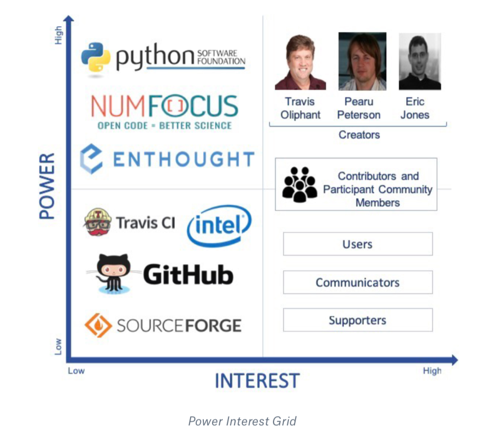
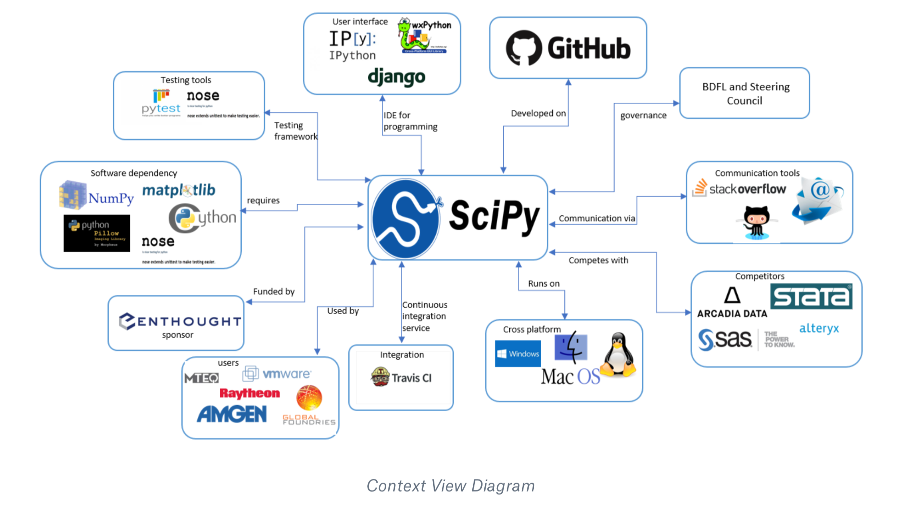

# SciPy

By [Noor ul Sehr Zia](https://gitlab.ewi.tudelft.nl/nzia)**,** [Sharanya Suresha Konandur](https://gitlab.ewi.tudelft.nl/ssharanyasures?nav_source=navbar)**,**  [Shikhar Dev](https://gitlab.ewi.tudelft.nl/sdev) and [Srinath Sudharsan](https://gitlab.ewi.tudelft.nl/ssudharsan)

## Abstract

SciPy is a popular open source software which is widely used for scientific and numerical computing in Python. SciPy is maintained and developed by the core developers on Github as well as external contributors. In this chapter, we study the software architecture of SciPy, precisely its stakeholders, context, deployment, and evolution. Finally, we elaborate upon an analysis of its architecture development and its technical debt. In conclusion, we observe that SciPy is very well engineered project with minor technical holes or debt.

## Table of Content
- [Introduction](https://paper.dropbox.com/doc/SciPy--AbClduGF_aMQSSnQSnonswALAg-CvRFpiALgp8sgDBjaXdO0#:uid=069536392133450179621222&h2=Introduction)
- [Stakeholders View](https://paper.dropbox.com/doc/SciPy--AbClduGF_aMQSSnQSnonswALAg-CvRFpiALgp8sgDBjaXdO0#:uid=540064461358700759659203&h2=Stakeholder%E2%80%99s-Analysis)
- [Context View](https://paper.dropbox.com/doc/SciPy--AbClduGF_aMQSSnQSnonswALAg-CvRFpiALgp8sgDBjaXdO0#:uid=304026020136085541953822&h2=Context-View)
- [Development View](https://paper.dropbox.com/doc/SciPy--AbClduGF_aMQSSnQSnonswALAg-CvRFpiALgp8sgDBjaXdO0#:uid=435544008912413080052480&h2=Development-view)
- [Deployment view](https://paper.dropbox.com/doc/SciPy--AbClduGF_aMQSSnQSnonswALAg-CvRFpiALgp8sgDBjaXdO0#:uid=003579782478521333032110&h2=Deployment-View)
- [Technical debt](https://paper.dropbox.com/doc/SciPy--AbClduGF_aMQSSnQSnonswALAg-CvRFpiALgp8sgDBjaXdO0#:uid=188849135038293725160538&h2=Technical-Debt-Analysis)
- [Evolutionary Perspective](https://paper.dropbox.com/doc/SciPy--AbClduGF_aMQSSnQSnonswALAg-CvRFpiALgp8sgDBjaXdO0#:uid=034554682657308877741914&h2=7.-Evolutionary-Perspective)
- [Conclusion](https://paper.dropbox.com/doc/SciPy--AbClduGF_aMQSSnQSnonswALAg-CvRFpiALgp8sgDBjaXdO0#:uid=294430708999519433278396&h2=Conclusion)
- [References](https://paper.dropbox.com/doc/SciPy--AbClduGF_aMQSSnQSnonswALAg-CvRFpiALgp8sgDBjaXdO0#:uid=105861018644215105445874&h2=References)

## Introduction

SciPy is an open source software library that abstracts and implements key functionalities for scientific computing, mathematics and engineering. It is written in Python and is supported by a large community of developers, researchers and some of the world famous companies including Github, Intel and Travis CI. SciPy has been under active development since 2001 and is now used in a wide range of applications by companies across the world. Some of the prominent modules implemented in SciPy include linear algebra, integration, interpolation, Fast Fourier Transforms, and signal and image processing. 
In this chapter, we derive views and perspectives from Rozanski & Woods book and perform a thorough analysis of the library. Given the global scale of impact, SciPy provides for a very interesting study in many dimensions. The goal of this article is to provide an overview of key architectural elements of SciPy and to possibly attract more contributors for open source development.

## Stakeholder’s Analysis

“A stake holder in a software architecture is a person, group, or an entity with an interest in or concerns about the realization of the architecture.” - [Software Systems Architecture](https://www.viewpoints-and-perspectives.info/home/stakeholders/).
Apart from just the users of a software system, there are many different individuals or groups of no individuals who have a direct impact on the system. From conceptualization, design, documentation, implementation, maintenance, to even developing business cases around the software system, development life-cycle of a software involves many different stake holders working in harmony to make a valuable and sustainable system. This section describes the different types of stake holders we have identified for the project, and attempts to identify their contributions to the project. Most of the information below have been sourced from the SciPy [github](https://github.com/scipy/scipy) page and the main SciPy [website](https://www.scipy.org/). Minor points have been inspired from numerous blogs, [wikipedia](https://en.wikipedia.org/wiki/SciPy) and google search.

| Type | Brief Description | Owner |
|-----------|-------------|-----------------------|
| Acquirers             | Acquirers are stakeholders who oversee the long term and short term strategy of the project. This also includes parties who partly / fully sponsor the project. | A large part of strategic positioning was done by the original creators of SciPy, Travis Oliphant, Pearu Peterson, and Eric Jones. Apart from them, [NumFOCUS](http://www.numfocus.org/)  provides financial support to the project, garnering some influence in  the overall strategy.                                                                                                                                                                                                                                                                                                                                                                                                                                                           |
| Assessors             | Assessors oversee the system’s compliance to standards and legal regulations.                                                                                   | [Python Software Foundation (PSF)](https://www.python.org/psf/)                                                                                                                                                                                                                                                                                                                                                                                                                                                                                                                                                                                                                                                                                   |
| Communicators         | Communicators ensure crisp and unambiguous communication of relevant details of the project to appropriate stakeholders.                                        | The SciPy Code of Conduct committee polices all public spaces managed by the SciPy project, and ensures an abuse free productive communication environment. All of the technical documentation and inquiry response is handled by the active contributors active participants in the project.                                                                                                                                                                                                                                                                                                                                                                                                                                                  |
| Developers            | Developers are responsible for creating and deploying software solutions that comply with all the expectations.                                                 | SciPy originated with code contributions by Travis Oliphant, Pearu Peterson, and Eric Jones in 2001. Since then, significant contributions have been made by over 200 contributors.                                                                                                                                                                                                                                                                                                                                                                                                                                                                                                                                                               |
| Maintainers           | Maintainers manage the evolution of the system once it is deployed and operational.                                                                             | All of the pull requests for SciPy are reviewed and integrated by the community of developers and users of SciPy. All contributors who participate in the PR discussion can be considered Maintainers. In rare cases that agreement cannot be reached, maintainers of the individual module in question decide on the outcome.                                                                                                                                                                                                                                                                                                                                                                                                                    |
| Suppliers             | Suppliers source the hardware, software, or infrastructure on which the system will run.                                                                        | Some of the organisations that have funded parts of Scipy operations are: [Enthought](https://www.enthought.com/): scipy.org and mailing lists hosting, holding the SciPy trademark. Enthoughts also sponsors SciPy conferences in the United states and across the world. (*)  [Github](https://github.com/): code hosting and development workflow platform (*)  [Travis CI](https://travis-ci.org/): continuous integration service; [SourceForge](https://sourceforge.net/): hosting released sources and installers; [Intel](http://www.intel.com/): Intel [MKL](https://software.intel.com/en-us/intel-mkl/) licenses; [NumFOCUS](http://www.numfocus.org/): hosted Mac Mini build machine |
| Support Staff         | Support staff provide support to users for the product or system.                                                                                               | Most open questions and queries are catered to, by the community of users and contributors of SciPy on different channels, including Stackoverflow and Github. Commercial support is offered for SciPy by a number of companies, including [Anaconda](https://www.anaconda.com/), [Enthought](https://www.enthought.com/) and [Quansight](https://www.quansight.com/).                                                                                                                                                                                                                                                                                                                                                                            |
| System Administrators | System administrators ensure smooth operations of the system once it has been deployed.                                                                         | Since SciPy is offered as a library, no system critical assurance is for the operation. Services such as Hosting, Mailing list, etc are fulfilled by companies listed in Suppliers.                                                                                                                                                                                                                                                                                                                                                                                                                                                                                                                                                               |
| Testers               | Testers systematically test the system to ensure that it is suitable for deployment and use.                                                                    | All code contributors are expected to perform unit tests on their code before submitting a Pull Request. There is no separate team of testers who test the system.                                                                                                                                                                                                                                                                                                                                                                                                                                                                                                                                                                                |
| Users                 | Users are individuals and organisations who use Scipy for their projects.                                                                                       | SciPy is primarily designed for Mathematics, Science and Engineering. SciPy caters to a wide range of users, including researchers, students, data scientists, as software engineers. The library is used in academic, as well as business setting.                                                                                                                                                                                                                                                                                                                                                                                                                                                                                               |

In addition to the above discussed categories which were based on [Software Systems Architecture](https://www.viewpoints-and-perspectives.info/home/stakeholders/), following categories stakeholders have also been accounted for.

| Type            | Brief Description                                                  | Owner                                                                                                                                                                                                                                     |
| --------------- | ------------------------------------------------------------------ | ----------------------------------------------------------------------------------------------------------------------------------------------------------------------------------------------------------------------------------------- |
| Event Organiser | Event organisers organise regular outreach and awareness programs. | Conferences are organised by SciPy (in the United States), EuroSciPy (in Europe) and SciPy.in (in India)                                                                                                                                  |
| Competitors     | Competitors include other projects that provide similar offerings. | Some of the most prominent competitors of SciPy are :  Matlab; R; Stata                                                                                                                                                    |
| Dependencies    | These are entities on which Scipy is reliant upon for services.    | Python is the base language SciPy offers its services in; C and Fortran are used for several key components in the SciPy Library; NumPy provides fast and convenient N-dimensional array manipulation capabilities for SciPy. |

## Power - Interest Analysis

*Figure: Power Interest Grid*

The power vs interest grid correlates the influence and the interests of different stakeholders involved in the project. The relation can be studied 4 different categories.

- **Low Power and Low Interest** : While this group of stakeholders are invested in the success of SciPy, they do not hold a strong influence on the project, and neither do they have a strong interest in the development activities of SciPy. As shown in the Stakeholders Analysis, Github, Intel, Travis CI and Sourceforge have all contributed services to ensure smooth operations of SciPy - but they do not have any contribution on development activities.  [[SciPy Donations](https://www.scipy.org/scipylib/donations.html)]
  
- **Low Power and High Interest** : Users, Communicators and Supporters are stakeholders who actively follow developments of SciPy, but do not have any direct influence on the software project itself. These functionalities are also supported by the open community of par [[Contributing to SciPy](https://scipy.github.io/devdocs/hacking.html)]
  
- **High Power and Low Interest** : [NumFocus,](http://www.numfocus.org/) [Enthought](https://www.enthought.com/) and the [Python Software Foundation](https://www.python.org/psf/) (PSF) provide vital contributions to the project, but do not derive value from the contributions. NumFocus is one of the primary sources of funds for SciPy. Eric Jones, the co-founder of Enthought was one of the co-creators of SciPy, and had significant contributions to the project. The Python Software Foundation continually develops and improves Python - which has a direct influence on SciPy.
  
- **High Power and High Interest** : The creators of the library - [Travis Oliphant](https://github.com/teoliphant), [Pearu Peterson](https://github.com/pearu), and [Eric Jones](https://github.com/TheDiemer) hold the largest influence on development activities of SciPy. However, beyond the creators, the library is largely maintained and further developed by a community of contributors and participants of the review process. [[Contributing to SciPy](https://scipy.github.io/devdocs/hacking.html)]

## Integrators

In analyzing pull requests, we have identified [**Ralf Gommers**](https://github.com/rgommers)**,** [**Pauli Virtanen**](https://github.com/pv) and [**Matthew Brett**](https://github.com/matthew-brett) as some of the most active contributors and integrators on the the project. They have individually closed numerous pull requests and are very active in discussions under pull requests. While we have not been identified exact areas where we could contribute to SciPy library, it would be very interesting to reach out to them and to get their take on directions they think are important for SciPy. 

## Context View

In this section we explore the context view which describes the relationship and interactions between SciPy and other related entities. We visualized and categorized the external entities by their involvement in SciPy. The following image shows the interactions of these entities.

### System Scope and Responsibilities

The system scope defines the main responsibilities that SciPy provides, which consists of providing a open and free *Python* library for the development and utilization of scientific and technical computing. 
Scipy has many responsibility that has distinct entities contributing to the SciPy. The main contributions are: 

- Scipy is scientific computing software platform in python which incorporate The SciPy *ecosystem.*
- Scipy also holds exclusive conferences for numerical and scientific  analysis in python such as SciPy, cipy.in, EuroSciPy etc.
- Scipy builds on NumPy array which is a numerical stack which provides many user-friendly tools for numerical data analysis and optimizations.
- Scipy is a cross platform software which works on multiple operating systems such as linux, OSX and windows.
- The SciPy library consists of numerical algorithms and software toolbox for signal processing,   special functions, FFT, etc.

### External entities

In this subsection we will explore an how SciPy handles its dependencies. SciPy has several external entities which are listed below, who work as a single community to make the environment for it.

- Developing language: Python
- Sponsored by: Enthought, Inc
- IDE for programming: [IPython](http://ipython.org/), [wxPython](http://www.wxpython.org/), [Traits](http://code.enthought.com/projects/traits/), [Django](https://www.djangoproject.com/),etc.
- Communication tools: Stack overflow, Mailing-List, GitHub
- Quality assurance: Nose and Pytest provides framework for python testing.
- Continuous integration service: [Travis CI](https://travis-ci.org/)
- License support: BSD license
- SciPy development: Github
- Governance: Pauli Virtanen is the Benevolent Dictator for Life (BDFL) and steering council.
- Competitors: [Stata](https://www.datanyze.com/market-share/advanced-analytics-and-data-science/stata-market-share), [Alteryx](https://www.datanyze.com/market-share/advanced-analytics-and-data-science/alteryx-market-share), [Base SAS](https://www.datanyze.com/market-share/advanced-analytics-and-data-science/base-sas-market-share), [Arcadia Data](https://www.datanyze.com/market-share/advanced-analytics-and-data-science/arcadia-data-market-share).
- Dependency: [Numpy](https://numpy.org/), nose (test suite run), asv (benchmarks run), matplotlib (plotting), Pillow (saving images), mpmath (special tests), LaTeX (pdf docs), [Cython](http://cython.org/)(development versions)
- Users: MTEQ,  Raytheon,  Amgen,  VMware, Jefferson Frank, global foundries, students, researchers, etc.

### Context view diagram

The below diagram summaries SciPy and its entities which devises the environment.  It contains the key  stakeholders as mentioned in the stakeholder section and the external entities.

  
*Figure: Context View Diagram*

### Pull Request Analysis

We analyzed 20 pull requests from SciPy github repository. The criteria used for selecting the pull requests is:

-  Accepted: We sorted the merged and closed pull requests according to their number of comments and took the ones with most comments/discussions.
- Rejected: For rejected, we took pull requests that were closed by the members of SciPy or those that weren’t merged in any child pull request. To add diversity, we chose pull requests that were from different labels, like “won’t fix”, “defect”, “maintenance” and “documentation”.

### Reviewing guidelines

Everyone can review the pull requests, however the members of SciPy are people who perform the final merge process. Moreover, SciPy [HACKING.rst](https://github.com/scipy/scipy/blob/master/HACKING.rst.txt) provides detailed guidelines about the reviewing process. These guidelines include:

- The change should be discussed in detail and all changes that will follow in existing behavior should be reported.
- The change should be logically and scientifically correct.
- The behavior should be clear under all conditions and all unexpected behavior and exceptions should be reported
- The code should meet the quality, test and documentation expectations outlined in [CONTRIBUTING.rst](https://github.com/scipy/scipy/blob/master/CONTRIBUTING.rst).

### Decision making

We noticed that most pull requests that were rejected or closed were due to one of the following reasons:

- The cost of making the change did not exceed the benefits
- There were incorrect assumptions in the logic
- The implemented code did not address all the conditions
- The pull request was not updated in a long time and another fix was already implemented
- The changes proposed were not backward compatible

Through the accepted ones we noticed that some of the reasons a pull request was accepted were:

- It introduced a new method and that method passed all tests
- It optimized an existing routine
- Provided a better alternative to an existing method
- Improved the performance of an algorithm

We have provided a detailed analysis of pull requests in [**Appendix**](https://paper.dropbox.com/doc/SciPy--AbG~zP9G95P60e0XL08_CsbmAg-CvRFpiALgp8sgDBjaXdO0#:uid=450447681037738403139882&h2=Appendix-A:-Pull-Request-Analy) [**A**](https://paper.dropbox.com/doc/SciPy--AbG~zP9G95P60e0XL08_CsbmAg-CvRFpiALgp8sgDBjaXdO0#:uid=450447681037738403139882&h2=Appendix-A:-Pull-Request-Analy) of our report.

As an attempt to codify the pull requests, we analyzed each comment and assigned a tag to it. To stay consistent in our analysis, we used a common tagging terminology in our codification process. The details of the tags we used and their distribution is shown in [**A**](https://paper.dropbox.com/doc/SciPy--AbG~zP9G95P60e0XL08_CsbmAg-CvRFpiALgp8sgDBjaXdO0#:uid=502855545620582028342594&h2=Appendix-B:-Codification-analy)[**ppendix B**](https://paper.dropbox.com/doc/SciPy--AbG~zP9G95P60e0XL08_CsbmAg-CvRFpiALgp8sgDBjaXdO0#:uid=502855545620582028342594&h2=Appendix-B:-Codification-analy)**.** We have attached the csv files with tags per comment in [PR_codified](https://gitlab.ewi.tudelft.nl/in4315/2018-2019/TI3125TU-swa-16-scypy/swa-16-scypy/tree/master/PR-codified) folder in our gitlab repository. 

## Development view

 
In this section, we delve into the code structure and analyse the architecture of SciPy. The primary objective of this section is to describe various technical design aspects of the project including code structure, dependencies, the build and configuration processes and the design patterns, especially from the perspective of developers and testers. 

### Code Organization

In this section we explore the code structure of SciPy. The code of SciPy is organized in folders in github. In the project, there are four main folders: benchmarks, doc, Scipy and tools. There a other files in the main project folder that are concerned with setup, gitignore, gitattributes, init files etc. We will explain the purpose of each main folder below:

- **Benchmarks**
  This folder contains code for bench marking SciPy with [Airspeed Velocity](https://asv.readthedocs.io/en/stable/). This folder contains code for bench marking SciPy over its lifetime. Run time, memory consumption and value changes may be tracked over time. Benchmarks are written for interpolate, optimize, filtering and linear algebra functions.
  
- **Doc**
  This section contains the code used to generate the documentation. It contains documentation of each release. It contains a release folder that contains release notes of each SciPy release and explains the new features and changes, the deprecated features and backward incompatible changes. The source folder contains the code to generate the documentation. It also contains a tutorial folder that consists of example uses of SciPy. SciPy releases new versions as version number x.x.x and the release notes accompany each release and summarize all the files changed and functionality added or removed.
  
- **Scipy**
  This folder contains code for all functionality of SciPy. It contains a library folder that handles all dependencies and version checks. It contains each module of SciPy in a separate folder: integrate, optimize, linalg, signal etc. Each module contains its own test folder and its source code.
  
- **Tools**
  This folder contains code for CI (continuous integration), build scripts for Windows, installer file for MacOS, code to generate C files of python files and other helper files that are used in running tests and installation. It also includes scripts for GitHub like getting author names who contributed to the release.
  
*Figure: Code structure of SciPy. The code is organized on github in folders. The sub directories are shown for only one level.*

 

### Module Structure Models

In this section we focus on the organization of the Scipy source code and group the code modules into layers of abstraction. We noticed that the source code can be organized into four layers based on its usage and functionality.  These layers are: Core, Utility, Platform, Build.
 
 

  
*Figure: Diagram of module structure of SciPy. It can be described by a 4 layer structure based on the functionality of modules*

- **Core Layer:**
   This layer consists of the main functionality of SciPy. It consists of modules that were present in SciPy folder of the repository. They contain implementation of all methods. It consists of optimize, linalg, interpolate, integrate, signal, spatial, special, io, sparse and ndimage. Here we have only shown the main modules of SciPy core. It consists of other modules as well like fftpack, constants, cluster and many more.

 

- **Utility layer:**
  This layer consists of modules that are utilized by the core layer and helper files. It consists of code for generating documentation, examples and tutorials, code for testing and bench marking against previous releases. It depends on the Core module and uses the methods from core module for testing and bench marking.
  
- **Platform layer**
  This layer consists of packages that are required by SciPy to run. SciPy needs Python, [numpy](http://www.numpy.org/), [cython](http://cython.org/) and [sphinx](http://www.sphinx-doc.org/) (for documentation, optional). This module consists of the external libraries and dependencies. Dependencies are the programs or libraries that a user has to install in order to build/test a package. SciPy has minimum dependencies so that the user can easily perform the required tasks without any hassle. 

- **Build layer**
  This layer consists of build modules. It consists of code to check for libraries and dependencies,  get the correct versions according to system. It also contains installers and build scripts for Windows,  [Travis.yml](https://travis-ci.org/) file and [Appveyor](https://ci.appveyor.com) to build and test projects with continuous integration support. It also contains build and install instructions for [BLAS](http://www.netlib.org/blas/)/[LAPACK](http://www.netlib.org/lapack/) which are recommended for SciPy. For CI support, SciPy relies on [Travis](https://travis-ci.org/) and [Appveyor](https://ci.appveyor.com).  
  The support for multiple platforms is a primary reason for using two different CI services. 
  It uses [Travis](https://travis-ci.org/) for its support on OSX and Linux and [Appveyor](https://ci.appveyor.com) for windows.

 

### Internal dependencies in core layer:

The modules in core folder are dependent on each other and every modules uses functionality implemented as part of other module(s) . The module level dependency has been analyzed and shown as a graph. Modules lib and build_tools contain utility and helper functions and are therefore imported by almost all other modules.

 
*Figure: The module level dependencies in SciPy. It can be observed that the modules are heavily dependent on each other. We have only shown the internal dependencies of modules here and ignored the standard python libraries that are imported within the files.*

### Common Design Models

In this section, we describe the common designs used in the development of SciPy.

- **Design standardization**
  SciPy uses uniformity of style in its coding to make sure that the code is understandable. It follows the standard python guidelines for code style [PEP8](https://pypi.org/project/pep8/). It encourages contributors to make sure that their code conforms to [PEP8](https://pypi.org/project/pep8/) standards and to use [PEP8](https://pypi.org/project/pep8/) package style checker.  For new functionalities, SciPy follows a two level structure which means new function should appear as *scipy.submodule.my_new_func**.* Each module has a __init__.py file where public functions are imported and private functions and classes have a leading underscore (_) in their name.

- **Testing standardization**
  Every module in SciPy core is accompanied by its test folder that consists of unit tests that cover all functionality. For new code, testing guidelines are provided in Numpy [testing guidelines](https://github.com/numpy/numpy/blob/master/doc/TESTS.rst.txt) which SciPy follows. For testing, SciPy uses the testing framework from numpy which uses [Pytest](https://docs.pytest.org) framework and [nose](https://nose.readthedocs.io/) test suite. SciPy provides contributor guidelines to write their tests and encourages writing unit tests to exercise all the code they are adding. SciPy uses [Travis](https://travis-ci.org/) and [Appveyor](https://ci.appveyor.com) for continuous integration and integrated with github to run tests on every pull request. This makes sure that the code does not run into any exceptions or errors. 
  
- **Third Party libraries**
  SciPy relies on third party libraries for some of its functionalities. It uses python package Numpy for calculations. It also uses [B](http://www.netlib.org/blas/)[LAS](http://www.netlib.org/blas/) functions in its linalg module.

### Programming Languages

In SciPy there are in total 2229 files. The code is written in multiple programming languages and the distribution is shown below (analysis performed using [CLOC](http://github.com/AlDanial/cloc)). Most code is written in C and Python.

| **Language**                                        | **Files** | **Blank lines** | **Comment** | **Code** |
| --------------------------------------------------- | --------- | --------------- | ----------- | -------- |
| C                                                   | 322       | 38125           | 162361      | 296772   |
| Python                                              | 638       | 59108           | 103970      | 158677   |
| Fortran 77                                          | 459       | 4238            | 74285       | 81899    |
| Cython                                              | 41        | 5954            | 7998        | 32748    |
| C++                                                 | 19        | 2007            | 7493        | 22375    |
| C/C++ header                                        | 117       | 3012            | 6240        | 14011    |
| JSON                                                | 2         | 14              | 0           | 1455     |
| TeX                                                 | 2         | 131             | 161         | 1168     |
| YAML                                                | 5         | 43              | 84          | 564      |
| Others (css, markdown, html, TOML, make, matlab) | 16        | 159             | 109         | 555      |

## Deployment View

 
The development view of SciPy shows how the program is expected to perform at run-time.The SciPy is not a stand-alone of software. The view shows the dependencies and hardware and software requirements of SciPy.
 

### Third-party Software Requirements

Dependencies are the programs or libraries that a user has to install in order to build/test a package. SciPy has minimum dependencies so that the user can easily preform the required tasks without any hassle, such as

|                     | ***run-time dependencies:***                                                                                                                                                                                                                                                                                                                                                                                                                    | ***build-time dependencies:***                                                                                                                                                                                                                                                                                   |
| ------------------- | ----------------------------------------------------------------------------------------------------------------------------------------------------------------------------------------------------------------------------------------------------------------------------------------------------------------------------------------------------------------------------------------------------------------------------------------------- | ---------------------------------------------------------------------------------------------------------------------------------------------------------------------------------------------------------------------------------------------------------------------------------------------------------------- |
| ***Unconditional*** | - [Numpy](https://numpy.org/)                                                                                                                                                                                                                                                                                                                                                                                                                   | [Numpy](https://numpy.org/); [Cython](http://cython.org/)(for development versions)                                                                                                                                                                                                                        |
| ***Conditional***   | [nose](https://nose.readthedocs.io/) (test suite); [asv](https://asv.readthedocs.org/) (benchmarks); [matplotlib](https://matplotlib.org/) (functions that can produce plots); [Pillow](https://pillow.readthedocs.org/) (image loading/saving); [scikits.umfpack](https://pypi.python.org/pypi/scikit-umfpack) (optionally used in `sparse.linalg`); [mpmath](http://mpmath.org/) (used for extended tests in `special`) | - [setuptools](https://bitbucket.org/pypa/setuptools); [wheel](https://wheel.readthedocs.io/) (`python setup.py bdist_wheel`); [Sphinx](http://www.sphinx-doc.org/) (docs); [matplotlib](https://matplotlib.org/) (docs); LaTeX (pdf docs); [Pillow](https://pillow.readthedocs.org/) (docs) |

### Working environments

As SciPy runs entirely within a single system, and on this system it runs inside python. Most of its working environment is either highly simplified or defined by its hosting programs. The following list shows some of these environments. 

| **Environments**                                           | **Description**                                                                                                                                                                                                                                                                                                                                                                                                                                                                                                                                                                                                                                                                                                                                                                                                                                                                                                                                                                                                                                                                                                                                         |
| -------------------------------------------------------------- | ------------------------------------------------------------------------------------------------------------------------------------------------------------------------------------------------------------------------------------------------------------------------------------------------------------------------------------------------------------------------------------------------------------------------------------------------------------------------------------------------------------------------------------------------------------------------------------------------------------------------------------------------------------------------------------------------------------------------------------------------------------------------------------------------------------------------------------------------------------------------------------------------------------------------------------------------------------------------------------------------------------------------------------------------------------------------------------------------------------------------------------------------------- |
| [Python(x,y)](http://python-xy.github.io/)                     | It is a python distribution which is based on **Qt and Spyder.** It is used by free scientits and engineers for develping software for numerical computations, data analysis and data visualization.                                                                                                                                                                                                                                                                                                                                                                                                                                                                                                                                                                                                                                                                                                                                                                                                                                                                                                                                                |
| [WinPython](https://winpython.github.io/)                      | provides compiler for scientific analysis (Mingw64) for Python 3.4 which is fully integrated with **Cython and Numba.**                                                                                                                                                                                                                                                                                                                                                                                                                                                                                                                                                                                                                                                                                                                                                                                                                                                                                                                                                                                                                                 |
| [IPython](http://ipython.org/)                                 | **IPython** (Interactive Python) is build for Python which provides command shell for multiple programming languages, it has features for visualization,use of GUI toolkits,etc.                                                                                                                                                                                                                                                                                                                                                                                                                                                                                                                                                                                                                                                                                                                                                                                                                                                                                                                                                                        |
| [Anaconda](https://www.anaconda.com/download)                  | Anaconda a enterprise-ready, free open source Python distribution which is a cross-platform software. Whose goal is simplification packages for Mac OS X, Windows,and Linux users.                                                                                                                                                                                                                                                                                                                                                                                                                                                                                                                                                                                                                                                                                                                                                                                                                                                                                                                                                                      |
| [Enthought Canopy](https://www.enthought.com/products/canopy)  | The free and commercial versions include the core scientific packages. Supports Linux, Windows and Mac.                                                                                                                                                                                                                                                                                                                                                                                                                                                                                                                                                                                                                                                                                                                                                                                                                                                                                                                                                                                                                                                 |
| [Spyder IDE](https://www.spyder-ide.org/)                      | Provides working environments on Windows and Ubuntu; Py2 only.                                                                                                                                                                                                                                                                                                                                                                                                                                                                                                                                                                                                                                                                                                                                                                                                                                                                                                                                                                                                                                                                                          |
| [Microsoft Visual Studio](https://www.visualstudio.com/)       | A free, rich IDE that supports Anaconda and Python. It also supports CPython, IronPython, the IPython REPL, debugging, profiling, Git and GitHub. Built-in languages include [C](https://en.wikipedia.org/wiki/C_(programming_language)),[[6]](https://en.wikipedia.org/wiki/Microsoft_Visual_Studio#cite_note-6) [C++](https://en.wikipedia.org/wiki/C%2B%2B), [C++/CLI](https://en.wikipedia.org/wiki/C%2B%2B/CLI), [Visual Basic .NET](https://en.wikipedia.org/wiki/Visual_Basic_.NET), [C#](https://en.wikipedia.org/wiki/C_Sharp_(programming_language)), [F#](https://en.wikipedia.org/wiki/F_Sharp_(programming_language)),[[7]](https://en.wikipedia.org/wiki/Microsoft_Visual_Studio#cite_note-7) [JavaScript](https://en.wikipedia.org/wiki/JavaScript), [TypeScript](https://en.wikipedia.org/wiki/TypeScript), [XML](https://en.wikipedia.org/wiki/XML), [XSLT](https://en.wikipedia.org/wiki/XSLT), [HTML](https://en.wikipedia.org/wiki/HTML), and [CSS](https://en.wikipedia.org/wiki/Cascading_Style_Sheets). Visual Studio Code is also available, which is a code editor with debugger. It is supported on Linux, Windows and MacOS. |
| [Enthought Canopy](https://www.enthought.com/products/canopy/) | it is an analysis environment that includes Enthought’s Python distribution which also has a analysis desktop with text-editor, code-checker and an IPython console. [Enthought Canopy](https://www.enthought.com/products/canopy/) also includes TraitsUI, Pyface,Enable,SciMath etc on all platforms.                                                                                                                                                                                                                                                                                                                                                                                                                                                                                                                                                                                                                                                                                                                                                                                                                                             |
| [IEP](http://www.iep-project.org/)                             | IEP is used for interactivity and introspection, which makes it very suitable for scientific computing. It is very simple to use a cross-platform Python IDE. The editor and the shell,are the two main components which also includes plug-in tools for the programmer use. Few examples are structure, project manager, interactive help, workspace,etc.                                                                                                                                                                                                                                                                                                                                                                                                                                                                                                                                                                                                                                                                                                                                                                                              |
| [Pymacs](https://github.com/pinard/Pymacs)                     | A Emacs tool allows users to communicate between Emacs Lisp and Python.                                                                                                                                                                                                                                                                                                                                                                                                                                                                                                                                                                                                                                                                                                                                                                                                                                                                                                                                                                                                                                                                                 |
| [Plotly](https://plot.ly/python/)                              | It is a online tool on Python environment for which is used for data exploration and graphing. Plotly contains a command line which allows users to store and share Python scripts.                                                                                                                                                                                                                                                                                                                                                                                                                                                                                                                                                                                                                                                                                                                                                                                                                                                                                                                                                                     |
| [Pyzo](http://www.pyzo.org/)                                   | Open and free distribution on Anaconda and the IEP interactive development environment. It is supported for Linux, Windows and Mac.                                                                                                                                                                                                                                                                                                                                                                                                                                                                                                                                                                                                                                                                                                                                                                                                                                                                                                                                                                                                                     |
| [Wakari](https://wakari.io/)                                   | A browser based Scientific and Technical Computing tool. users can create and share workflows, IPython notebooks, plots, and applications on cloud  which also features Anaconda- Big-Data Python distribution.                                                                                                                                                                                                                                                                                                                                                                                                                                                                                                                                                                                                                                                                                                                                                                                                                                                                                                                                         |

### Basic Versions required 

During the initial installation the following distributions of packages should be included. The (x.x.x) indicate the required versions for the dependencies to run on SciPy. 

| **Dependencies**                                                                   | **Version required**       |
| ---------------------------------------------------------------------------------- | -------------------------- |
| Python                                                                             | (2.x >= 2.6 or 3.x >= 3.2) |
| NumPy                                                                              | (>= 1.6)                   |
| SciPy library                                                                      | (>= 0.10)                  |
| Matplotlib:  dateutil; pytz; Support for at least one backend | (>= 1.1)                   |
| IPython (>= 0.13):  pyzmq; tornado                                  | (>= 0.13)                  |
| pandas                                                                             | (>= 0.8)                   |
| nose                                                                               | (>= 1.1)                   |
| Sympy (>= 0.7)                                                                     | (>= 0.7)                   |

### Running Code Written In Other Languages

Below is a list of software platforms which helps wrapping code of different languages. 

- [SWIG](http://www.swig.org/): SWIG is a software that primarily connects programs written in C and C++ with a wide range of high-level programming languages. It also supports scripting languages such as Javascript, Perl, PHP, Python, Tcl and Ruby. 
- [Boost.Python](http://www.boost.org/libs/python/doc/index.html): a C++ library which enables seamless ability to transform between C++ and Python. 
- [F2PY](https://sysbio.ioc.ee/projects/f2py2e/): Mainly used to warp Python and Fortran languages. F2PY is a Python extension tool for creating Python C/API modules from signature files (or directly from Fortran sources).
- [matlab](http://www.mathworks.com/help/matlab/matlab_external/get-started-with-matlab-engine-for-python.html): Has interfaces for Python by treating it as a computational tool.  For information about how to interface with Python from MATLAB, visit this link [here](http://www.mathworks.com/help/matlab/getting-started_buik_wp-3.html).
- [pythoncall](http://pav.iki.fi/software/pythoncall/):it connects  MATLAB-to-Python  which runs a Python interpreter inside Matlab and allows transferring data between the Python and Matlab workspaces.
- [ctypes](http://starship.python.net/crew/theller/ctypes): a package which allows users to create and manipulate C data types in Python, and to call functions in dynamic link libraries/shared dlls. It wraps these libraries in pure Python programming language.
- [railgun](http://tkf.bitbucket.org/railgun-doc/): ctypes utilities for faster and easier simulation programming in C and Python.
- [rpy2](http://rpy2.bitbucket.org/): a very simple, yet robust, Python interface to the [R Programming Language](https://www.r-project.org/). It can manage all kinds of R objects and can execute arbitrary R functions (including the graphic functions). All errors from the R language are converted to Python exceptions. Any module installed for the R system can be used from within Python.
- [mirpyidl](https://pypi.python.org/pypi/mirpyidl/): it provides a library to call IDL (Interactive Data Language) from python. Allows transparent wrapping of IDL routines and objects as well as arbitrary execution of IDL code. It utilizes connections to a separately running idlrpc server. 

### Minimum Hardware Requirements

Below listed is the basic hardware requirements for running SciPy successfully.

- Disk space: 1 GB
- Operating systems: Windows* 7 or later, MacOS, and UNIX-based systems
- Processors: Intel Atom® processor/Intel® Core™ i3 processor or higher

### Making a SciPy release

Manger is the main actor in release of a new SciPy release, below are the steps followed:

1. Schedule is proposed and released on the Scipy-dev mailing list.
2.  maintenance branch is created for the release.
3. Tagging 
4. Building is released for artifacts  such as sources, installers, docs.
5. Upload the release artifacts.
6. Announcement is released.
7. Port release notes and scripts are built onto master.

## Technical Debt Analysis

In this section we analyse the technical debt of SciPy. We make use of an automatic tool for code quality analysis.  The subsections respectively describe the debt identified in the system with regard to defects, code-style, testing and documentation. The following metrics were analysed:  
*(Note: In this section, we discuss the relevance of the metrics with SciPy and values noted from our code analysis. Intricate details have been explained in the* [*Appendix C*](https://paper.dropbox.com/doc/SciPy--AbG~zP9G95P60e0XL08_CsbmAg-CvRFpiALgp8sgDBjaXdO0#:uid=825143202751942454825198&h2=Appendix-C:-Technical-Debt-Glo)*)*

### 1. Maintainability

Maintainability is focused on code smells, which is a maintainability-related issue found in the code analysis [[1]](https://paper.dropbox.com/doc/SciPy--AbEU4jG5pjXuP4DIafNH7fgAAg-CvRFpiALgp8sgDBjaXdO0#:uid=825143202751942454825198&h2=Appendix-C:-Technical-Debt-Glo).

  
  1. **Code Smells**
  Code Smells refers to any symptom in the source code of a program that possibly indicates a deeper problem. [[2]](https://paper.dropbox.com/doc/SciPy--AbEU4jG5pjXuP4DIafNH7fgAAg-CvRFpiALgp8sgDBjaXdO0#:uid=825143202751942454825198&h2=Appendix-C:-Technical-Debt-Glo)

  For Scipy, we noted **4,373** Code Smells from the results of static analysis. We used Quality Profile evaluation to be the default Sonar Way evaluator. Additionally, the benchmarks we reported against default Sonar Way benchmarks.  The debt that was reported for the code smells were estimated  56 days.  The maintainability ratio was grade with **A**. The reported technical debt ratio for Scipy was 0.5%

The figure below depicts the results obtained from the test using [SonarQube](https://www.sonarqube.org/). 

  
*Figure: Maintainability Overiew*

### 2. Code Complexity

Code Complexity or Cyclomatic complexity is a quantitative measure of the number of linear independent paths through a program code. For SciPy, the code complexity was performed using [**Pylint**](https://www.pylint.org/)**.**  Pylint analysis the code at a file level and also performs an integrated complexity check with adherence to the standard developed by T.J McCabe in "[A Complexity Measure](https://ieeexplore.ieee.org/document/1702388)." Additionally, Pylint provides a rating based on the analysis performed on a scale of 10. For the SciPy project, we received a rating of 2.67/10. As a remediation measure, we have listed possible ways to obtain better scoring of Pylint's code complexity analysis [[3]](https://paper.dropbox.com/doc/SciPy--AbEU4jG5pjXuP4DIafNH7fgAAg-CvRFpiALgp8sgDBjaXdO0#:uid=825143202751942454825198&h2=Appendix-C:-Technical-Debt-Glo).

### 3. Code Duplication

This section describes the amount of code blocks that were found to be duplicated during the static code analysis. [[4]](https://paper.dropbox.com/doc/SciPy--AbEU4jG5pjXuP4DIafNH7fgAAg-CvRFpiALgp8sgDBjaXdO0#:uid=825143202751942454825198&h2=Appendix-C:-Technical-Debt-Glo)  In Scipy, we observed 280 code blocks that were copied, which amounted to roughly 1.3 % of the total code base. The Code Duplication was performed using [SonarQube.](https://www.sonarqube.org/) The results of code duplication is represented in the figure below where the size of the bubbles represent the duplication blocks of code. 

  
*Figure: Visual representation of Duplication*

### 4. Reliability & Security 

 

  1. **Reliability**
  The source of reliability in code is the ability to produce a predictable outcome given wildly varying inputs. [[5]](https://paper.dropbox.com/doc/SciPy--AbEU4jG5pjXuP4DIafNH7fgAAg-CvRFpiALgp8sgDBjaXdO0#:uid=825143202751942454825198&h2=Appendix-C:-Technical-Debt-Glo) For Scipy, the Reliability Ratings graph is represented with a bubble graph. Additionally, the graph showcase the number of bugs reported while performing the code analysis. We have used [SonarQube](https://www.sonarqube.org/) for reliability reporting

 
*Figure: Visual Representation of Code Reliability*

  b. **Security**
  Static analysis looks for security vulnerabilities in source code by referencing the most common vulnerabilities as defined by [OWASP](https://www.owasp.org/index.php/Main_Page). [[6]](https://paper.dropbox.com/doc/SciPy--AbEU4jG5pjXuP4DIafNH7fgAAg-CvRFpiALgp8sgDBjaXdO0#:uid=825143202751942454825198&h2=Appendix-C:-Technical-Debt-Glo)
  The Figure below depicts the Security related vulnerabilities obtained as part of our analysis. We note that there are no security vulnerabilities for SciPy. We have used [SonarQube](https://www.sonarqube.org/) for security vulnerability reporting
 
*Figure: Visual Representation of Security Analysis*

### 5. Code Coverage Tests

Code coverage describes the degree to which the source code of a program is executed by a particular test suite [[7]](https://paper.dropbox.com/doc/SciPy--AbEU4jG5pjXuP4DIafNH7fgAAg-CvRFpiALgp8sgDBjaXdO0#:uid=825143202751942454825198&h2=Appendix-C:-Technical-Debt-Glo). For Scipy, as part of the code coverage task, missing test coverage's long-term risks are analysed.  We have used native SciPy testing suite for our code coverage tests. 

A visualization has been made from our results below. 

 
*Figure: Results of Coverage Tests* 

The run-time of the test was 543.9 seconds. The important metrics to note here would be the passed legend which represents code pass as part of our testing and xFailed which represents code failure which is reported at approximately 0.5% of our code base. 

### 6. Dependency of Individuals to SciPy

In this section, we analyse the dependencies of individual contributors of Scipy. If there are more sole responsibilities assigned to a select people of the Scipy project, it is implicitly considered to be high risk as the absence of these individuals may lead to failure in the progress of Scipy. 

The figure below reports the overall activities of the contributors from the start of SciPy. 

 
*Dependency graph of all the activities of contributors from inception of Scipy*

The figure below shows the top 10/100 contributors of Scipy. The contributions to master, excluding merge commits are depicted here. With the contributors being: 

  
*Figure: Top 10 contributors to SciPy*

For SciPy, there has been fluctuating yet distributed dependency graph of Contributors. Hence, this does not affect the progress in lack of any significant-individual dependency for SciPy.

### 7. Evolutionary Perspective

In this section we discuss, the evolutionary perspective of SciPy, its past and present transitions and the present version usage. Additionally, we address documentation debt.

  **a.** **Documentation Debt**
  Scipy is a massive project with over 160,000 lines of code. While the code itself had appropriate comments in most of the sections, we were unable to find any documentation that detailed the architectural details and design principles followed in the project. Also, given that Scipy has an extremely active contributor base, the need for strong documentation was very evident in our study.

  **b. Evolutionary Diagram - Code Frequency**
  As part of reporting the Historical Analysis of Technical Debt we have used the Evolution diagram which showcases the code additions and deletions of Scipy over a time stamp as per 1 year. The reporting is done every year in the graph below since the inception of SciPy in 2001.  
  The below figure is the code frequency of Scipy activity. 
  
*Figure: Code Frequency*

The peaks in green legend refer to the additions that were reported and made to commit while the red refers to the deletions that were performed from a code removal standpoint. It was noted that on 2007-2008 saw the highest addition and deletion of code implementations for Scipy. However, asides this, there has been a healthy code addition/deletion report graph for all years. 

**c. Versions**
SciPy has 103 releases in total and the present version release is v1.2.1 (on February 8, 2019).

**d. Testing Debt**
In Summary, we used the following tools for Code Analysis for reporting the metrics: 

1. [SonarQube](https://www.sonarqube.org/) with Travis CI integration - Maintainability, Code Duplication, Reliability & Security
2. [Pylint](https://www.pylint.org/) - Code Complexity
3. [SciPy Native test suite](https://github.com/scipy/scipy/blob/master/runtests.py) - Code Coverage
4. [SciPy Insights](https://github.com/scipy/scipy/pulse) - Evolutionary Perspective, Dependency of Individuals to SciPy.

As part of contributing to reduce the testing debt, we identified critical issues from testing of technical debt and raised PR requests with SciPy team for approval. The possible methods to reduce testing debt and our contributions to SciPy have been discussed in [**Appendix D**](https://paper.dropbox.com/doc/SciPy--AbG~zP9G95P60e0XL08_CsbmAg-CvRFpiALgp8sgDBjaXdO0#:uid=823718998222582291935567&h2=Appendix-D).

## Conclusion

SciPy is currently the most popular and widely used tool for students and data scientists for scientific computing, mathematics and engineering. The course provided an exciting opportunity for us to perform an in depth analysis of one of the most famous python libraries in its domain. Listed below are some key activities we performed as a part of our curriculum.

  - Identified key stakeholders and drafted a contextual view.
  - Performed technical analysis on the SciPy library via deployment and development perspectives.
  - Performed Static Code Analysis on SciPy’s code repository using automated tools
  - Performed Pull Request (PR) analysis and defined an appropriate Codification Standard for merged and unsuccessful PRs.
  - Made a [contribution](https://github.com/scipy/scipy/pull/10053) to the project in form of describing one of the fundamental classes based on an open issue. Based on technical debt analysed, some contribution is still in process and we hope to make more contributions to the library we love using.
  

Based on these activities, we were able to draw the following conclusions.

  - SciPy has a high degree of reliance on the open community of contributors. The participants own significant responsibilities on the library.
  - It caters to wide set of user-group both in scientific as well as commercial communities.
  - It builds on other libraries in the scientific computation suite and offers abstraction of a wide range of scientific functionalities.
  - While we did notice significant technical debt and possible improvements, SciPy is under active development support by its strong community.

## References

1. Nick Rozanski and Eoin Woods. [Software Systems Architecture: Working with Stakeholders Using Viewpoints and Perspectives](http://www.viewpoints-and-perspectives.info/). Addison-Wesley, 2012, 2nd edition.
2. SciPy Issues(https://github.com/scipy/scipy/issues)
3. SciPy documentation ( https://docs.scipy.org/doc/scipy/reference/roadmap.html)
4. Arie van Deursen and Maurício Aniche and Joop Aué (editors). *Delft Students on Software Architecture (DESOSA)*. [https://delftswa.gitbooks.io/desosa2016/content/](https://delftswa.gitbooks.io/desosa2016/content/), TU Delft, 2016.
5. SciPy Donations webpage: https://www.scipy.org/scipylib/donations.html
## Appendix A: Pull Request Analysis

The table below summarizes the context of the pull requests we analyzed.

###  Accepted requests

| **ID** | **Proposed by**     | **Participants** | **Active discussions by**                                                                      | **Started on** | **Merged on** | **Tags**                       |
| ------ | ------------------- | ---------------- | ---------------------------------------------------------------------------------------------- | -------------- | ------------- | ------------------------------ |
| 4374   | @Sturlamolden       | 8                | @ewmoore, @jakevdp @rgommers, @ogrisel                                                         | Jan 7, 2015    | May 10, 2015  | Enhancement, scipy.spatial     |
| 4890   | @Sturlamolden       | 8                | @ewmoore, @jakevdp @rgommers, @pv, @rainwoodman                                                | 19 May, 2015   | 22 Nov, 2015  | Enhancement, scipy.spatial     |
| 8357   | @mikofski           | 16               | @tkelman, @person142 , pvanmulbregt , @rgommers , scopatz, @andyfaff, @jaimefrio               | Feb 2, 2018    | Jun 25, 2018  | maintenance, scipy.optimize    |
| 335    | @js850              | 6                | @josef-pkt, @diax, @rgommers                                                                   | Oct 9, 2012    | Feb 3, 2013   | not defined                    |
| 3174   | @ev-pr              | 9                | @rgommers @pv @mathew-brett                                                                    | Dec 27, 2013   | Oct 21, 2016  | enhancement, scipy.interpolate |
| 7616   | @ghost              | 8                | @ larsoner, @ matthew-brett @pv, @ rgommers,                                                   | Jul 17, 2017   | Aug 12, 2017  | Build issues, enhancement      |
| 6326   | @nmayorov           | 15               | @ [nmayorov](https://github.com/larsoner), @ aarchiba, @pv, @ bmcage, @ev-br                   | Jun 28, 2016   | Apr 21, 2017  | enhancement, scipy.integrate   |
| 3717   | @larsoner           | 8                | @larsoner, @coveralls, @argriffing, @endolith, @rgommers, @pv                                  | Jun 06, 2014   | Jan 21, 2015  | enhancement, scipy.signal      |
| 4021   | @insertinterestingn | 8                | @larsoner, @coveralls, @argriffing, @endolith, @rgommers, @pv                                  | Sep 24, 2014   | Mar 27, 2015  | enhancement, scipy.linalg      |
| 5608   | @stsievert          | 13               | @larsoner, @ stsievert, @ jaimefrio, @ tacaswell, @rgommers, @pv, @ WarrenWeckesser, @endolith | Dec 15, 2015   | Jul 20, 2016  | enhancement, scipy.signal      |

### Rejected requests

| **ID** | **Proposed by**  | **Participants** | **Active discussions by**                                                                                       | **Started on** | **Closed on** | **Tags**                        |
| ------ | ---------------- | ---------------- | --------------------------------------------------------------------------------------------------------------- | -------------- | ------------- | ------------------------------- |
| 6725   | @alvasorg        | 7                | @nmayorov, @josef-pkt, @ev-br                                                                                   | Oct 25, 2016   | Feb 9, 2017   | needs-decision, wontfix         |
| 6895   | @nils-werner     | 6                | @pv, @larsoner                                                                                                  | Dec 28, 2016   |               | scipy.signal,wontfix            |
| 5301   | @giorgiop        | 6                | @jaimefrio, @argrigging, @ev-br, @josef-pkt                                                                     | Oct 1, 2015    | Jab 18, 2016  | defect,scipy.spatial,wontfix    |
| 3044   | @bbudescu        | 3                | @pv, @rgommers                                                                                                  | Nov 7, 2013    | Sep 17, 2017  | Build issues,needs-work         |
| 8454   | @samyak0210      | 7                | @peterjc, @ilayn, @pv, @ev-br, @rgommers                                                                        | Feb 21, 2018   | Jun 11, 2018  | maintenance, scipy.integrate    |
| 7033   | @ashwinpathak20  | 4                | @ashwinpathak20, @person142, @ev-br, @rgommers,                                                                 | Feb 12, 2017   | Feb 16, 2017  | Documentation, scipy.special    |
| 3893   | @WarrenWeckesser | 5                | @ coveralls, josef-pkt, @pv, @ WarrenWeckesser, @rgommers,                                                      | Aug 22, 2014   | Dec 02, 2014  | Documentation, maintenance      |
| 5226   | @WarrenWeckesser | 3                | @ [argriffing](https://github.com/argriffing),, @pv, @WarrenWeckesser.                                          | Sep 04, 2015   |               | defect,needs-work,scipy.special |
| 4379   | @juliantaylor    | 10               | @[larsmans](https://github.com/larsmans), @ [jaimefrio](https://github.com/jaimefrio), @ev-br, @WarrenWeckesser | Jan 08, 2015   | Jan 21, 2015  | enhancement,scipy.spatial       |

The analysis and our theories about each pull request are explained below.

### Accepted requests

| ID   | Contributions                                                                                                                                                                                                                                                                                                                                                                                                                                                                                                                                                                                                                                                                                                                                                                                                                                                                                                                                                                                                                                                                                                                                                                                                                                                                       | Decision                                                                                                                                                                                                                                                                                                                                                                                                                                                                                                                                                                                                                                                                                                                                                                                                                                                                                                                                                                                                                                                                                        |
| ---- | ----------------------------------------------------------------------------------------------------------------------------------------------------------------------------------------------------------------------------------------------------------------------------------------------------------------------------------------------------------------------------------------------------------------------------------------------------------------------------------------------------------------------------------------------------------------------------------------------------------------------------------------------------------------------------------------------------------------------------------------------------------------------------------------------------------------------------------------------------------------------------------------------------------------------------------------------------------------------------------------------------------------------------------------------------------------------------------------------------------------------------------------------------------------------------------------------------------------------------------------------------------------------------------- | ----------------------------------------------------------------------------------------------------------------------------------------------------------------------------------------------------------------------------------------------------------------------------------------------------------------------------------------------------------------------------------------------------------------------------------------------------------------------------------------------------------------------------------------------------------------------------------------------------------------------------------------------------------------------------------------------------------------------------------------------------------------------------------------------------------------------------------------------------------------------------------------------------------------------------------------------------------------------------------------------------------------------------------------------------------------------------------------------- |
| 4374 | This PR was mostly related to code enhancement in the spatial package. The main additions in the initial PR were: Make the kd-tree data structure inspectable and walkable from Python; Add support for pickle; Removed memory leaks in cKDTree.query; Use PyMem_Malloc instead of libc malloc; Add an option for creating balanced trees; Add an option for compacting/shrinking tree nodes; Clean op the coding style; Change language to C++; Reimplement cKDTree.query in C++; Release GIL in cKDTree.query. It started out as work in progress and the tests were added later. One of the most discussed topic in comments was to use the scikit-learn implementation of kd-tree but the author pointed out the differences between both and this implementation was comparatively faster.  The added functionality was tested on Linux, windows and OSX. | This PR was merged. According to our analysis, the performance of the kd-tree method implemented was significantly better than the previous ones available. This was one of the main reasons for merge. The enhancement also passed all of the tests. It only gave an error on MinGW-w64 past gcc 4.x but that was due to another dependency that needed to be fixed separately so the decision to merge was taken.                                                                                                                                                                                                                                                                                                                                                                                                                                                                                                                                                                                                                                                                                                                                                                                                                                                                                                                                                                                                                                                                                                                                                                                                                                                                                                                                                                                                                                                                                                                                             |
| 4890 | This PR was created after debasing #4860 which was related to porting the remaining cKDtree query methods to C++. Moving to C++ allows for significant speed improvement. Moving to C++ resulted in 6x faster performance as mentioned in PR #4860.  Some initial work is also found in #4850.  All the query and build methods and many conditional branches are converted to C++. There was a significant improvement in two query methods. Pickling was added in python 2.                                                                                                                                                                                                                                                                                                                                                                                                                                      | This PR was a follow up to the cKDtree implementation work and work was related to porting the methods to C++ to improve performance. The tasks still pending were testing on Windows, code review, bug fixing and using a different method in one of the functions. Updates for these tasks were given in the comments and discussion. An important point of discussion was to benchmark all releases of cKDtree and this was done in a separate repository. There was some performance regression for few methods compared to an earlier release but those were resolved in later commits. After passing all the builds and tests successfully, it was merged. According to us, the decision to merge was most likely made because of the 6x faster performance that makes this a significant improvement.                                                                                                                                                                                                                                                                                                                                                                                                                                                                                                                                                                                                                                                                                                                                                                                                                                                                                                                                                                                                                                                                                                                                                    |
| 8357 | This PR was created to address the issues in #8354. In #8354 a custom vectorized newton method was proposed. This PR adds tests for newton method with arrays and checks newton step deltas and checks for zero derivatives. This PR also addressed #7242.                                                                                                                                                                                                                                                                                                                                                                                                                                                                                                                                                                                                                                                         | Most of the discussion in this PR was related to coding practices, suggestions on how to improve the code and explanation of the programming decision by @mikofski.  The vectorized implementation was bench-marked against other alternatives. The bugs identified through the discussion were debugged and fixed. Many code fixes were implemented for example, fixing the exceptions, wrong assumptions about function arguments etc. The performance degradation cases were successfully addressed and test cases were added. This PR improves the performance for those cases where a vectorized approach is needed and supports the scalar version too.  In our opinion it was merged because it is a useful change that provides a vectorized implementation of newton’s method which didn’t exist before.                                                                                                                                                                                                                                                                                                                                                                                                                                                                                                                                                                                                                                                                                                                                                                                                                                                                                                                                                                                                                                                                                                                                            |
| 335  | This PR introduces the implementation of basinhopping global optimization algorithm. It used the minimizers already implemented in scipy.optimize. Basin hopping is a random algorithm which attempts to find the global minimum of a smooth scalar function of one or more variables. It is a useful approach for non linear optimization.                                                                                                                                                                                                                                                                                                                                                                                                                                                                                                                                                                        | The initial comments to the PR were about coding style and suggestions to fix it, for example: more descriptive variable naming, spacing etc. Other comments were about understanding the algorithm implementation. It was suggested to add more test cases. This algorithm was also merged. We think it was merged because it was a new feature that was a useful addition to scipy.optimize.                                                                                                                                                                                                                                                                                                                                                                                                                                                                                                                                                                                                                                                                                                                                                                                                                                                                                                                                                                                                                                                                                                                                                                                                                                                                                                                                                                                                                                                                                                                                                                  |
| 3174 | This PR implements a base class for evaluation of b-splines without fitpack. It implemented a base class which could be used through API directly and in the interpolation/fitting algorithms. It also contained tests to verify the implementation.                                                                                                                                                                                                                                                                                                                                                                                                                                                                                                                                                                                                                                                               | In the discussion, updates regarding implementation were given. The behavior of class was updated to be consistent with the definition in literature. The other comments were by reviewers asking about the purpose of some lines in the code and the reasoning behind adding them, suggesting alternatives or suggesting changes to improve the code structure, improve the implementation and make code more readable and conform to the standards used in rest of the code base. There were also considerations about how to replace the existing spline implementations with this implementation. The implementation was initially slower than fitpack so it was investigated how to improve that and updated in later commits.  The implementation was given a needs-work label by @ev-br because the algorithm was for creating periodic splines was naive and needed a fix with linear algebra. And the periodic spline part was removed to be able to merge this. This PR also deprecated splmake/spleval. The final performance was comparable with fitpack. The PR was closed and reopened for testing. The issues of revierwers were addressed in new commits and changes made were approved by @pv and merged into master. It was merged as it was an enhancement in scipy.interpolate and offered an implementation without one dependency (fitpack) with comparable performance as the implementation with fitpack.                                                                                                                                                                                                                                                                                                                                                                                                                                                                                                                               |
| 7616 | This PR is about enabling builds on to Appveyor for effective test integration. Issue was encountered when the fotran code had C code calling usage. As solution, all the DLLs (with OpenBLAS and mingw dlls) were separately stored. Was stored under tool/ directory. Additionally, due to verbosity, numpy.distutils was taken up for cleanup.                                                                                                                                                                                                                                                                                                                                                                                                                                                                                                                                                                  | This PR was merged. According to our analysis, the performance of Appveyor on 32 bit implementation gave lot of errors and they worked on that as the major PR upgrade. Although the initial issue was stderr malfunction which was eventually solved, the PR thread was continued with 32-bit implementations.                                                                                                                                                                                                                                                                                                                                                                                                                                                                                                                                                                                                                                                                                                                                                                                                                                                                                                                                                                                                                                                                                                                                                                                                                                                                                                                                                                                                                                                                                                                                                                                                                                                 |
| 6326 | In this pull request, @nmayorov, has initiated a request and suggestive implementation to the ODE class belonging to “scipy.integrate.ode”. A monolithic implementation with solutions to address the issues of no continuous solution output, (i.e. which can be evaluated at any point with the same accuracy as the values computed at discrete points) and absence of event detection capabilities are proposed eventually.                                                                                                                                                                                                                                                                                                                                                                                                                                                                                    | At the start of the PR discussions, there are conversations from @pr, @aaricha and the author of the PR on the scientific aspects of the ode class and its implications. There are clarifications provided and example cases are presented such as the RK45 method, DOPRI5 etc. Upon discussions, it was found that the ODE solvers in Matlab were also of research prospect. @drhagen proposes an event detection mechanism to the ODE solvers in scipy. A code level change of the return parameter was changed to suite the functionality of the solver. As for the testing and compilation, the team encounters some issues and they are resolved in the same PR as comments.  Upon testing, it is noted that there are issues in the test case failures and the troubleshooting steps are undertaken by doing code-level scans (manually) at each function library and class solvers. Finally, it is concluded that there is an option to include where the solvers switching between stiff and non-stiff solvers can be made. The code is created and tested, and the original design is retained. Additionally, the event callbacks are updated in accordance with the new code changes. A re-test is conducted. 1 out 2 tests only pass. However, they still go ahead with the merge and the contributor is complimented for the suggestion.                                                                                                                                                                                                                                                                                                                                                                                                                                                                                                                                                                                                         |
| 3717 | In this pull request, @larsoner, has initiated a request from a previous PR - #2444 which discusses the addition of support for second order sections in scipy.signal. PR #2444 was re-opened along with PR and closed after successful merge in Jan 21, 2015 of PR #3717. Here, the author proposes the following changes: sosfilt, which performs filtering using second-order sections. zpk2sos / tf2sos to convert to sos format. Wanted to remove tf2sos. users might have filters in tf form and think that going to sos will reduce numerical error. Forcing them to do zp2sos(tf2zpk(b, a)) might make them think twice about why there isn't a tf2sos function. *(seeking opinions)* cplxpair and cplxreal, which are helper functions for dealing with complex conjugate pairings.                                                                                                           | @endolith, starts the conversation with the review of @larsoner’s implementations and encounters minor travis errors which are eventually fixed at once. Additionally, as the review procedure continues, there are several errors that are reported such as functional issues of n_stages and n_sections, etc. Additionally, a critical error at review was reported: *Changes Unknown when pulling e4f4aa0 on Eric89GXL:sosic into * on scipy:master*.* This forms the basis of the discussion as it was attributed to continuous code failures. The author resolves the same. And the discussion on the test results are discussed.   There are code changes being made in terms of logical attributions and not syntaxial or run-time relevance. The code is tried in many second order cases such as analog ordering cases, computational efficiency testing etc. Upon testing the code on possible mathematical test cases, a merge approval is provided by the contributors and the PR is merged. However, in May 24, 2016, it was reported that there was an issue recorded “scipy.signal needs a unified filter API” which is tagged to a PR #6137 which was created at a later stage and followed up to closure.                                                                                                                                                                                                                                                                                                                                                                                                                                                                                                                                                                                                                                                                                                                                      |
| 4021 | In this pull request, the author has requested for support for the implementation of lpack and blas (which are mathematical/scientific libraries) for Cython via API referencing. In the base request comment the following have been identified, codified and implemented (the implementation was identified as work in progress by the author): *Add interface for lapack and blas routines.*; *Add working example in tests*; *Review signatures for correctness*; *Add function to get directory of scipy.linalg (similar to numpy.get_include)*; *Finish wrappers for 'gees' and 'gges' functions.*; *Add interfaces to the functions added in #3984 (wrapping blas routines)*; *Add this api to the documentation*                                                                                                                              | @pv identified an error “f2py._cpointer does not point to the wrapped fortran routines, but directly to the BLAS/LAPACK symbols” which is attributed to incorrect pointer referencing for ABI calls. Furthermore, a formulated list of cases of failure are identified and introduced in the forum. The changes are worked upon. The solutions are identified by changing the entry statements in entry wsdot(n,x,offx,incx,y,offy,incy) and altering call statement declarations. Upon rectification, a code review is performed by @ewmoore and has reported issue in calling at the interface of python scipy.linalg.lapack. The author worked on this assigning arithmetic float pointers in the calling interface thereby making them safe on all platform executions. Minor code beautification procedures are discussed and brought up as issues which are concurrently resolved. Another PR #4105 BUG: Workaround for SGEMV segfault in Accelerate is referenced to this PR. The relevance is explained. A cythonize script is written for adding a submodule named cython to preclude the use of these wrappers in scipy.linalg itself. This is being reviewed by Scipy contributors and the resultant warnings, errors are rectified in  successive conversations. A major build failure with Cython 0.20.2 was reported by @rgommers. Additionally segmentation faults (segfaults) were also reported alongside the build failure. The root cause is performed and found that test_blas_pointers.test_wfunc_pointers that crashes, the other tests pass and also the segfaults belonged to different cynthon version. @rgommers performs a backtrace of the code and rectifies the errors with the help of fellow contributors. Asides, these major issues, there are minor clarifications seeked out with minor test failures eventually rectified in subsequent conversations. A complete rebase is done at the end and merged successfully! |
| 5608 | In this pull request, the author has extended the work of PR #2651 (this PR adds the keyword argument method to scipy.signal.convolve to choose the choose the convolution method. method can take vales 'auto', 'fft' or 'direct') and PR #1792 (faster convolution method, either the direct method or with fftconvolve.). In this PR, the author, has proposed a test failure and further details on impactful documentation for the above-mentioned parent PRs. A build failure was noted while using ffconvolve. The root cause of this issue was traced to passing on TravisCI without any adjustment. Later, the author conducted the test again with gcc and Homebrew and noted the ffconvolve to plot the points correctly.                                                                                                                                                                            | @ jaimefrio begins the discussion with a review of the proposed fix. It was suggested to change the default aspects of ffconvolve to parameterized custom initializations which was agreed by several contributors to the PR. However, there was an observed error log that was reported by @rgommers while executing the same on a 32-bit system (Errors being test_convolve_method (test_signaltools.TestConvolve), test_rank3 (test_signaltools.TestCorrelateComplex192), test_rank3 (test_signaltools.TestCorrelateComplex192) and test_signaltools.test_choose_conv_method). However, the 64 bit systems did not report these error messages. Hence, the task of resolving these four error messages were taken up and discussed in the PR workflow. The author had proposed the re-worked code and was tested by the contributors and approved for appropriate functionalities. The PR was finally merged successfully.                                                                                                                                                                                                                                                                                                                                                                                                                                                                                                                                                                                                                                                                                                                                                                                                                                                                                                                                                                                                                                   |

### Rejected requests

| ID   | Contributions                                                                                                                                                                                                                                                                                                                                                                                                                                                                                                                                                                                                                                                                                                                                                                                                                                                                                                                                                                                                                                                                                                                                                                                                                                                                       | Decision                                                                                                                                                                                                                                                                                                                                                                                                                                                                                                                                                                                                                                                                                                                                                                                                                                                                                                                                                                                                                                                                                        |
| ---- | ----------------------------------------------------------------------------------------------------------------------------------------------------------------------------------------------------------------------------------------------------------------------------------------------------------------------------------------------------------------------------------------------------------------------------------------------------------------------------------------------------------------------------------------------------------------------------------------------------------------------------------------------------------------------------------------------------------------------------------------------------------------------------------------------------------------------------------------------------------------------------------------------------------------------------------------------------------------------------------------------------------------------------------------------------------------------------------------------------------------------------------------------------------------------------------------------------------------------------------------------------------------------------------- | ----------------------------------------------------------------------------------------------------------------------------------------------------------------------------------------------------------------------------------------------------------------------------------------------------------------------------------------------------------------------------------------------------------------------------------------------------------------------------------------------------------------------------------------------------------------------------------------------------------------------------------------------------------------------------------------------------------------------------------------------------------------------------------------------------------------------------------------------------------------------------------------------------------------------------------------------------------------------------------------------------------------------------------------------------------------------------------------------- |
| 6725 | This PR implements a method to calculate the numerical inverse of any invertible continuous function. The method used existing functions in scipy to solve  the problem of finding the inverse of function under continuity and monotonicity conditions. There were certain conditions mentioned under which the algorithm failed to give accurate results. The functions should be continuous and strictly monotonic.                                                                                                                                                                                                                                                                                                                                                                                                                                                                                                                                                                                                                                                                                                                                                                                                                                                              | The discussions about this PR were about the motivation for adding such a function, explaining possible use cases. Suggestions about variable names and pointing out mistakes in the implementation (the intervals were not supported, global root finding was not well defined).  The members of scipy were not in support of the idea of having a library function to numerically invert a given function. The approach was found to be flawed by the reviewers. Main reason was that the method failed to detect if a function wasn’t monotonic and the choice of algorithm to find inverse is  problem dependent and this algorithm isn’t fit for that purpose.                                                                                                                                                                                                                                                                                                                                                                                                                             |
| 6895 | This PR aims to deprecate get_window and instead have people use the window functions directly. The current implementation of get_window() is very messy and consists of many conceptual problems. It adds functionality to pass a callable to get_window(), replaces all occurrences of get_window() and raises deprecationwarning when no callable is passed. It also removed string arguments.                                                                                                                                                                                                                                                                                                                                                                                                                                                                                                                                                                                                                                                                                                                                                                                                                                                                                   | The main reason for rejecting this PR was that the changes were not backward compatible. Most code is not actively developed and the users who obtained code from a source may not have the expertise to fix it. The new method does make things clearer but was ruled out due to backward incompatibility. There are also places where using string arguments is the clearest option so that made the string argument removal not useful. The benefits of the cost were not worth the cost and the PR was closed.                                                                                                                                                                                                                                                                                                                                                                                                                                                                                                                                                                              |
| 5301 | This PR handles corner cases for correlation. Correlation is not defined for constant input vector but it was defined to complete the definition at the limits of vectors with zero variance. This implementation was also justified by the reasoning that if variance is zero, co variance is also zero and correlation distance is 1.                                                                                                                                                                                                                                                                                                                                                                                                                                                                                                                                                                                                                                                                                                                                                                                                                                                                                                                                             | In the discussion, few coding changes were suggested (for example to change the iteration). There were also questions about whether defining corner cases made sense and that using NaN for corner cases made more sense. The reviewers were not convinced that returning 0 or any value instead of NaN for corner cases was correct. It was initially proposed to clarify the documentation by adding the limit behavior changes in doc strings in either this or new PR. The PR was closed because there was no work update and they made the decision to keep the current behavior.                                                                                                                                                                                                                                                                                                                                                                                                                                                                                                          |
| 3044 | This PR provides a hack to build scipy on win64 with msvc9. It was proposed that this code could be used to make a true solution that works across platforms and compilers.                                                                                                                                                                                                                                                                                                                                                                                                                                                                                                                                                                                                                                                                                                                                                                                                                                                                                                                                                                                                                                                                                                         | The functions were added manually in the build and that was considered a wrong solution. There were issues related to fortran that arise when using static libs from fortran code. The PR included match functions of C99 in msvc2013 but it was not clear why they were needed and suggested to look into npy_math to find the issue. During testing, python continued to crash during scipy tests. The PR was not updated for 4 years and in 2017 @rgommers closed the PR as MSVC + gfortan now worked and they continuous integration for it.                                                                                                                                                                                                                                                                                                                                                                                                                                                                                                                                                |
| 8454 | This PR fixes #8389 which was about using single letter variable names that were ambiguous (I, O, l). This was an issue because certain letters look like numbers in a different font.                                                                                                                                                                                                                                                                                                                                                                                                                                                                                                                                                                                                                                                                                                                                                                                                                                                                                                                                                                                                                                                                                              | The problematic letters were replaced by different letters, for instance I was replaced by K. In the discussion it was pointed out that instead of renaming to a different letter, why not replace with longer meaningful variable names. The benefits did not justify the code churn and the PRs that were about fixing variable names and minor style issues were not encouraged by @pv. This PR was rejected.                                                                                                                                                                                                                                                                                                                                                                                                                                                                                                                                                                                                                                                                                |
| 7033 | In this pull request, the author has changed the doc string of hyp2f1 function and included all the necessary details from the PR #6966 (Hypergeometric Functions documentation is lacking).                                                                                                                                                                                                                                                                                                                                                                                                                                                                                                                                                                                                                                                                                                                                                                                                                                                                                                                                                                                                                                                                                        | As a root cause analysis method, @person142 ran generate_ufuncs.py for these changes to actually show up in the published docs. However, it was later indetified that the author’s issue was not with relevance to hyp2f1 and noted that the pattern was like eval_jacobi. It was identified that there was a misunderstanding that the author had in relevance to the conceptualization and later this PR was closed by the author upon seeking inputs from the other contributors in the channel as an ineffective and incorrect approach.                                                                                                                                                                                                                                                                                                                                                                                                                                                                                                                                                    |
| 3893 | In this pull request, the author has presented a special case of warning that was encountered “WARNING: document isn't included in any toctree” at base.rst and has noted that the default was overridden by custom orphan:1. This was also concurrently printed in all output files.                                                                                                                                                                                                                                                                                                                                                                                                                                                                                                                                                                                                                                                                                                                                                                                                                                                                                                                                                                                               | Although there were many questions raised on why the warning was to be removed, the author clearly defines that the warning was inappropriate and could lead to misleading error modifications in future. Hence, as a solution, the orphan settings were tracked down and changes in the ‘doc-sphinx-orphan’ were made by @rgommers. However, it was noted that the warnings generated in the autodoc weren’t included in the fix and they were unable to work on the same. At the end, the author executed the same and figured out that with sphinx 1.2.2, python 2.7.8, and numpy 1.8.1 (but the numpydoc sphinx extension is from numpy's master branch), this change reduces the number of warnings from 406 to 323. Beyond this the author or the contributors could not work to reduce the warnings and hence they decided to close the PR as an unsuccessful attempt as the contribution was not sufficient. Finally, it was noted that the incorrect approach was used for this rectification, and they decided to close the PR as incorrect approach rather than insufficient output. |
| 5226 | In this pull request, the author has presented a special case of rewriting the Fotran code to compute the zeros of Ys in subroutine JYZO of scipy.special. The initial subroutine JYZO in specfun.f computes the zeros of J, J', Y and Y' using Newton's method. This is the function used by jn_zeros, jnp_zeros, yn_zeros and ynp_zeros. The problem was that the code that computed the zeros of Y' did not always provide a good initial guess for Newton's method. When the code saw that Newton's method had converged to a previously found zero of Y', it added pi to the initial guess and tried again. This did not always work, and it didn't prevent the code from converging to a zero that was larger than the expected zero. Neither Newton's method nor the retry loop were protected from iterating indefinitely. In the particular case of jn_zeros(281, 6), eventually it used an initial guess for a zero of Y' that put Newton's method into an infinite loop. As a solution, a fix was made to use the previously computed zeros of J as the initial guesses of the zeros of Y', and then only allow at most 10 Newton iterations. (After that, NAN is returned.) This works very well. I haven't found a case where Newton's method fails to converge. | Upon testing of the code, it was reported by the author that special.jn_zeros(281, 6) hangs and was referenced to PR #4690 for resolution. It was later figured out that for large values, there was an error message and code hangs were reported. However, there were no solutions provided to this problem and hence, the author decided to close the issue without any resolution mechanism. PR was closed due to no improvement and inactivity.                                                                                                                                                                                                                                                                                                                                                                                                                                                                                                                                                                                                                                            |
| 4379 | In this pull request, the author has focussed on reductions that cannot be auto vectorized by gcc without adding unsafe-math optimization flags, so vectorize them manually for SSE2 which is available on all amd64 machines. This changes the numerical result as the summation ordering is different, but the change should be only in the order of a few machine precisions. Also, the author has requested for GIL computations releases. Also, the author has broken the code base for ease of testing. Upon code review, the contributors reported that option (+ -O3/-ftree-vectorize) gcc can vectorize but gcc specific could not be done and also it was not recommended for the semantic flags on a per function basis. Additionally, it was noted that the performance improves by a factor of 1.5x-2x for appropriate inputs. An RCA was conducted, and it was found that unrolling of the loop functions benefitted for GCC. However, the performance was improved only by 10% which was negligible as per the contributors.                                                                                                                                                                                                                                         | When the Scipy team were involved in the conversation, it was noted that as per the policy they cannot speed by 1.5x-2x and hence they were unable to proceed with the request. The reason was the speeding up policy did not aid substantial results in the performance for them to consider it as a major enhancement level change. Hence the PR was closed unsuccessfully. However, the specifics of GCC optimization was carried over to PR #4551 while the auto vectorization was dropped with this PR. It was closed due to insufficient results to substantiate the effort of the auto vectorization – GCC.                                                                                                                                                                                                                                                                                                                                                                                                                                                                              |
| 3417 | In this pull request, the author has referred to an extension work on constrained optimization, based on nonlin leastsq where he states that it would bring extra to scipy as slsqp seems present. To make it more visible what slsqp can do, it was suggested by adding an example also in the reference, and not only in the tutorial. Example taken here was based on the main section in slsqp.py and different from the tutorial which uses minimize directly.                                                                                                                                                                                                                                                                                                                                                                                                                                                                                                                                                                                                                                                                                                                                                                                                                 | Upon acting to the proposal, @coveralls noted that there were no changes when pulling 0f8416b on bmcage:slsqp into 3879d21 on scipy:master. Hence, a review was conducted by @dlax and it was reported that minimize (from the code propsed) did not have a disp keyword argument and _minimize_slsqp was private initialization. Also, it was identified and concluded that minimize to fmin_slsqp do not have any comparisons and hence had to be deprecated for fmin_slsqp. However, at the end, there were no resolutions steps for the request of the author and hence the author closed the PR in an unsuccessful attempt.  It was closed as approach was not required or did not add value to the proposed problem of adding example to slsqp                                                                                                                                                                                                                                                                                                                                            |

## Appendix B: Codification analysis

For codifying the tags we used are:

- Update:  All comments that contain information about new changes to the code by the author of the PR is tagged as update.
  
- Conceptualization: All comments that ask for understanding of the code or the logic behind the approach are tagged as conceptualization. This includes the comments where they give suggestions or offer alternatives to approach and the author of PR explains his rationale.
  
- Testing: This includes all comments related to testing and testing results
  
- Misc: This includes random remarks and issues about github merge/rebase etc.
  
- Code change: This includes all syntax related comments and comments about suggestions to use different function.
  
- Performance: Comments about performance gain or regression are classified under performance tag
  
- Review: All reviews to the PR are tagged under review
  
- build: All comments about build issues or build process 
  
- Dependency: All comments about dependencies and library errors etc are classified under this
  
- Configuration: Comments about setting up accounts and admin related matters come under this tag.

## Appendix C: Technical Debt Glossary
1. **Maintainability** 

In best case scenario, leaving maintainability-related issues means that even the best developers will have a hard time when they try to introduce new code changes. In the worst case scenario, developers may be confused by the state of the code, thereby introducing additional errors in the process of making code changes.  

2. **Code Smells** 

Code smells are usually not bugs—they are not technically incorrect and do not currently prevent the program from functioning. Instead, they indicate weaknesses in design that may be slowing down development or increasing the risk of bugs or failures in the future. Bad code smells can be an indicator of factors that contribute to technical debt.

3. **Maintainability Ratio** 

The maintainability ratio is a metric given to a project related to the value of Technical Debt Ratio.  For all technical debt ration values less than 5%, a rating of A was provided.

4. **Measures of reducing Code complexity thereby improving Pylint rating** 
  - make sure your code writing style is conform to what Pylint is expecting (or tune Pylint to match your style / conventions). This includes function, variables, class, method names, spaces at various places, etc.
  - write Python code in an as static as convenient way, and avoid dynamic tricks.
  - write doc-strings

5. **Reliability** 
  In static analysis, the parser identifies specific methods and isolates them, emulating their behaviour when ported into other software modules. 
  
  Once isolated, the algorithm will generate arguments and read method outputs, expecting the outputs to contain specific information and formatting. It will raise flags for any anomalies in a method.

6. **Security**  
  The primary cause of software vulnerabilities are defects, bugs and logic flaws. Organisations should take proactive actions to decrease vulnerabilities before software deployment. Hence educating the employees on secure coding techniques can help eliminate these vulnerabilities.

7. **Code Coverage (specifications)** 
  In specific, it is a measure of how many lines/blocks/arcs of code are executed while the automated tests are running.

## Appendix D

**D1.  Resolving Testing Debt**

  Testing Debt can occur owing to several kinds of testing methods such as:
  1. integration testing
  2. system testing
  3. security testing
  4. usability testing
  5. performance testing
  6. unit testing
  7. While these tests help in identifying accurate test results for a software in pre-release phase, often the associated debt is ignored.
  
  Here, we have highlighted some important methods which maybe incorporated for SciPy. 
  
  Additionally, these guidelines maybe useful for other large repository project like SciPy too. 
  They are:
  1. Having a clear augmented testing platform for SciPy owing to multiple language dependencies in the project (from codebase reference)
  2. Tesitng the development versions on a regular basis for SciPy and not at the time of pre-release
  3. Since, testing debt cannot completely be erradicated, we need to prioritize the best resolutions and work for SciPy, which is not presently being done.
  With these, we believe that the testing debt maybe reduced for an instance like SciPy.

**D2.  Contributions**

  - **Issue URL:** https://github.com/scipy/scipy/issues/10014
  - **Pull-Request URL:** https://github.com/scipy/scipy/pull/10053
  - **Description**: The existing code base lacked an intuitive description of weibull_max_gen and weibull_min_gen classes in file scipy > stats >_continous_distns.py. We added a description to both of these classes based on the issue and a brief research on wikipedia.

