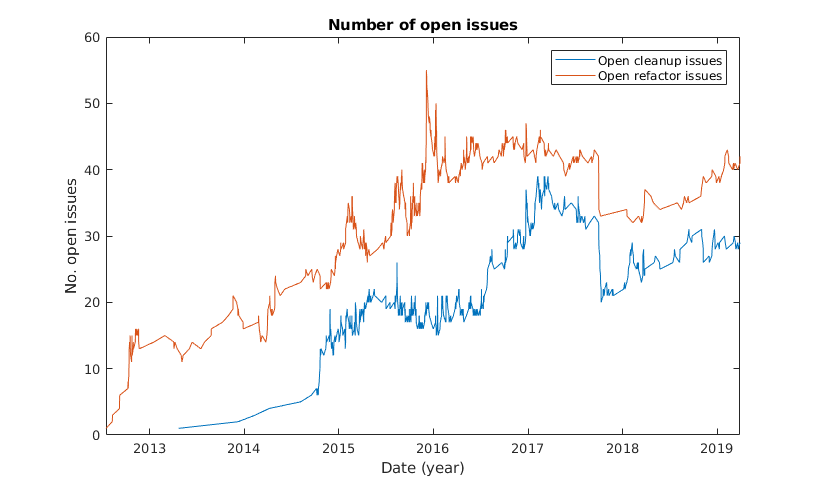

# Servo
## The Parallel Browser Engine Project

**By [Dominique van Cuilenborg](https://github.com/Dominique2509), [Bart van Schaick](https://github.com/BartGitHub), [Fabian Stelmach](https://github.com/Fabianstelmach) and [Aron Zwaan](https://github.com/AZWN)**


[Servo](https://servo.org/) is a modern, high-performance browser engine. It takes advantage of the memory  and concurrency management provided by the [Rust](https://www.rust-lang.org/) language.  The project was started by Mozilla Research and is being built by a community of individual contributors from companies such as Mozilla and Samsung. The long-term goal of Servo is to incrementally replace components in Firefox. Other than that, Servo is also trying to become a stand-alone browser.

In this chapter, we provide a detailed insight into the architecture and development of Servo. We start this chapter by analyzing the development process of Servo, this involves analyzing pull requests, the stakeholders and the context. We then continue with the architecture and conclude with a section on technical debt.

## Table of Contents
- [Pull Requests](#pull-requests)
    - [Commonly Occurring Patterns in Pull
      Requests](#commonly-occurring-patterns-in-pull-requests)
    - [Commonly Occurring Patterns in Unsuccessful Pull
      Requests](#commonly-occurring-patterns-in-unsuccessful-pull-requests)
    - [Decision process](#decision-process)
    - [Integrators](#integrators)
- [Stakeholders](#stakeholders)
    - [Rozanski and Woods
      classification](#rozanski-and-woods-classification)
    - [Other Stakeholders](#other-stakeholders)
- [Context View](#context-view)
- [Development View](#development-view)
    - [Module Structure Model](#module-structure-model)
    - [Common Design Model](#common-design-model)
    - [Codeline Model](#codeline-model)
- [Concurrency View](#concurrency-view)
    - [Process model](#process-model)
    - [Passed messages](#passed-messages)
- [Technical Debt](#technical-debt)
    - [Single Responsibility
      Principle](#single-responsibility-principle)
    - [Open Closed Principle](#open-closed-principle)
    - [Interface Segregation
      Principle](#interface-segregation-principle)
    - [Dependency Inversion
      Principle](#dependency-inversion-principle)
    - [Testing Debt](#testing-debt)
    - [Discussion](#discussion)
    - [Evolution](#evolution)
    - [Debt summary](#debt-summary)
- [Conclusion](#conclusion)
- [Appendices](#appendices)
    - [Appendix 1 - Analyzed Pull Requests](#appendix-1---analyzed-pull-requests)
    - [Appendix 2 - Contributions](#appendix-2---contributions)

### Contact
If you are interested in the Servo project and would like to know more, we would recommend you to contact [\@jdm](https://github.com/jdm). He has left us with very helpful feedback on our Pull Requests and is very active in the Servo community.

## Pull Requests
A total of 20 pull requests have been analyzed in order to identify patterns that differentiate successful pull requests from unsuccessful ones. The pull requests with the highest number of comments have been selected. The list of analyzed pull requests is present in appendix 1. In this section, we aim to provide a summary of the decision-making process for the acceptance of pull requests.

### Commonly Occurring Patterns in Pull Requests
The most commonly occurring discussion point is the automated testing suite. The testing suite can be automatically ran on a pull request after one of the core team members has given permission to do so. Successfully running the test suite on a particular pull request is required in order to successfully merge a pull request. This requirement is often difficult to achieve, since pull requests with new features or bugfixes [are required to add relevant tests](https://github.com/servo/servo/blob/master/CONTRIBUTING.md#pull-request-checklist) and the testing suite currently runs on 25 different targets, including Windows, Linux, MacOS and Android. Quite often, developers have to change their code in order to pass the tests on all the platforms. Most discussions revolve around how the failing tests can be fixed.

The second most occurring discussion point is general code quality. The Servo team welcomes contributions from non-experienced programmers, and therefore, it is often needed for the experienced members to request adjustments to the pull requests. These adjustments can consist of re-structuring of the code as well as re-implementing some functionality in a more efficient way. Noticeably, apart from the [pull request checklist](https://github.com/servo/servo/blob/master/CONTRIBUTING.md#pull-request-checklist), the only other official guideline is the [set of strict rules for styling Rust code](https://doc.rust-lang.org/1.0.0/style/style/README.html) by the Rust language team. No further official guidelines are officially presented by the Servo team.

### Commonly Occurring Patterns in Unsuccessful Pull Requests
Unsuccessful pull requests differ from successful pull requests in that they are not merged into the main branch of Servo. After thorough research, we have found that most of the rejected pull requests were closed simply due to inactivity of the creator of the pull request. Many pull requests are dropped in the stage where the failing tests need to be fixed. This often proves to be more of a challenge than the creator originally expected. As such, these pull requests are simply left untouched and closed after some time of inactivity.

The second most commonly occurring reason for refusal of a pull request is the supersedence by another pull request. This can happen when a developer has written a solution to address some issue, but that solution is only partial, and so it does not fully solve the problem or does not successfully pass the test suite. In this case, another developer may decide to use this partial solution and complete it in another pull request. In the case that the completed solution is merged, the original pull request is automatically rejected.

### Decision process
The decision process of the acceptance of the pull request by the Servo team depends mostly on the quality of the supplied code. If the solution supplied is of acceptable quality and it passes the testing suite, then the pull request is generally accepted.

The pull requests are rarely challenged for the actual functionality they implement. This is possible due to the fact that most of the pull requests are targeted to fix a particular issue that has been identified by the developers beforehand. Issues which do not need fixing, get shut down before a pull request for them is made.

### Integrators
The integrators, those who approve or rejects these PRs, are found in the [Governance](https://github.com/servo/servo/wiki/Governance). This governance states the core group of Servo ([\@larsbergstrom](https://github.com/larsbergstrom), [\@metajack](https://github.com/metajack), [\@jdm](https://github.com/jdm) and [\@pcwalton](https://github.com/pcwalton)). This core group can be seen as the integrators of the Servo project, since they govern the direction of Servo and make all the final decisions.

## Stakeholders
 For a research browser-engine project, it is reasonable that many stakeholders are involved. Be it companies, who of course have an interest in the product itself, or simply the developers working on Servo. We compiled a list of stakeholders using Rozanski and Woods classification. More on this classification can be found in their book [Software Systems Architecture](https://www.viewpoints-and-perspectives.info/).

### Rozanski and Woods classification

#### Acquirers
The primary stakeholder is Mozilla and Servo can be seen as a playground for Mozilla's Firefox browser. As stated on the [roadmap](https://github.com/servo/servo/wiki/Roadmap), if certain functionality gets implemented in Servo, Mozilla may merge this with their main Firefox browser. Most of the roadmap is set out by the Mozilla employee [\@jdm](https://github.com/jdm), this ensures that the project takes the direction Mozilla wants.

#### Assessors
When it comes to conformance to standards, a browser has the comply with various browser standards, such as those stated by W3C. Ensuring this is the responsibility of the core developer team, where various developers have their own specialization. For example, [\@nox](https://github.com/servo/servo/issues/created_by/nox) takes care to make sure that the behavior of the CSS renderer in Servo complies to the browser standards.
Furthermore, regarding legal regulations, the Servo project uses Mozilla Public License 2.0 (MPL). This license clearly states that the contributors are not liable and there are no warranties for using Servo.

#### Communicators
The communicators are the core servo team. They wrote several [wiki pages](https://github.com/servo/servo/wiki/Design) on the design of Servo to ensure that every stakeholder can get up-to-date with the architecture of the program. Other than the design, there are also numerous wiki pages written on the development guidelines of Servo. These pages ensure that new developers know what is expected of them.

#### Developers
The developers are the contributors on [Github](https://github.com/servo/servo/graphs/contributors). Most, but not all, of the main developers work for Mozilla. This once again strengthens Mozilla's stakeholder position in the development of Servo. Other than these main developers there are still lots of Rust enthusiasts committing to the project. The developers are involved to actually implement the ideas of the other stakeholders.

#### Maintainers
Servo is not yet ready for full deployment; however, certain subsystems certainly are. These subsystems are maintained by the group of core developers, which consists mostly of Mozilla employees. They are involved to make sure that the project is well documented and limit technical debt.

#### Suppliers
The main sponsor of Servo is Mozilla, they provided the necessary resources to get the project to where it is today. One of the resources provided by Mozilla are the employees actively working on this project. Furthermore, Mozilla also provides the build server and many other Rust development tools to streamline the development of Servo.

#### Support Staff
Since the product is not meant to be your daily driver when it comes to browsing, there is no real support staff yet. Since this project is targeted at developers, the main support staff can be considered as the developers on GitHub, which you can contact using the issue tracker.

#### Testers
The developers themselves are responsible for testing their own commits. Apart from that fact that they should choose a test approach that matches the altered component, which can be found in [CONTRIBUTING.md](https://github.com/servo/servo/blob/master/CONTRIBUTING.md), no strict rules are enforced.

#### Users
There are no real users for this project. Rather than the final product being the goal, the goal is to function as a test-bench for Mozilla's Firefox browser. Therefore, Mozilla can be seen as the main user. While Servo as a whole is not used by people; certain subsystems, such as [WebRender](https://github.com/servo/webrender), are already used to create applications. An example of such an application is [Azul](https://github.com/maps4print/azul) which allows for web applications to run on your desktop, similarly to Electron.

### Other Stakeholders

Other than the classification of Rozanski and Woods, other stakeholders can be found.

#### Researchers
The browser is a playground for Researchers, since servo is mostly meant as a research project and not yet as a deployable product. Servo has been used to write many papers regarding the [parallelism of browsers](https://github.com/servo/servo/wiki/Browser-Engine-Research#parallelizing-browser-tasks), [improving browser performance](https://github.com/servo/servo/wiki/Browser-Engine-Research#improving-browser-performance) and many other [topics](https://github.com/servo/servo/wiki/Browser-Engine-Research).

#### Competitors
Competitors could also be seen as stakeholders of Servo, since the success (or failure) of the project may result in a change of the competitors their market position. The main competitors of Servo are Chromium and WebKit.

## Context View
The context view shows the relationships, dependencies and interactions between Servo and its environment. This context view allows us to easily see the connections between the various external entities and Servo.


Using this visualization we can analyze the context.
Servo is written in Rust, a programming language developed by Mozilla. Furthermore, Jenkins and Python are used to allow for a streamlined development process. The source code and issue management are performed on GitHub, the source code and all issues are kept here. Other than GitHub, communication is done on the Mozilla's IRC (irc.mozilla.org) and the Servo [mailing list](https://lists.mozilla.org/listinfo/dev-servo).

The main competitors of Servo are all other browser engines. These engines are usually made by very big companies (Microsoft, Apple, Mozilla) with lots of funding. However, it is interesting to note that Gecko (Mozilla) and Servo are not real competitors. Their relationship is mutualistic, since Mozilla supports the development of Servo and Servo functions as a test bench for Mozilla's Gecko engine.

Servo is meant to service all major platforms. It did not support Windows and iOS during the first few years of development, due to technical difficulties that come with having a browser engine work cross-platform. However, as the project got a bigger development team, Windows and iOS support was added.

It is interesting to see that there are not that many people using Servo, especially considering the amount of development that goes into Servo and the competitors it is fighting up against. However, due to the mutualism between Gecko and Servo, there is still a very important reason to continue development.


## Development View
The development view supports the design, build and testing of Servo, by describing the architecture that supports the software development process. Code structure and module organization are important aspects of this architecture, which also involves identifying areas of common processing, codeline organization and standardization of design and testing approaches. This chapter addresses these concerns by depicting a module structure, common design and codeline model for Servo.

### Module Structure Model
Servo's logic is divided into a number of components. At the moment Servo contains 52 components, each with its own internal and external dependencies. Modeling these components into one giant diagram would be cumbersome, time-consuming and above all, not aid developers in getting a better understanding of the system. Instead a high-level overview is given that will explain the relations between the most important components and their interactions with the outside world.

Servo is [advertised](https://servo.org) as the 'Parallel Browser Engine Project'. This leaves very little to the imagination of the intention of the developers. To aid this goal, a task-based architecture is adopted in which major components are loosely coupled and modeled as threads. These components can interact with each other by passing messages over channels or by borrowing (sharing a reference to) a data structure.

In Servo, the thread that owns these channels is called the [**constellation**](https://github.com/servo/servo/blob/master/components/constellation/constellation.rs). The constellation can be thought of as a tab in a browser (Servo currently supports only a single tab). It tracks all of the information related to the current tab and updates its state based on the messages it receives from other components. The constellation also manages all pipeline objects. A pipeline encapsulates a means of communication with the script, layout and render thread. Each pipeline is responsible for correctly displaying a particular document in its assigned window or frame.


Apart from the constellation, some other major components of Servo are identified and explained in greater detail below.

* The **Script** thread creates and stores the DOM representation of the document, by invoking the HTML Parser and executing Javascript code.
* The **Layout** thread takes a snapshot of the DOM provided by the script thread applies styles and calculates the layout of nodes. From this layout, it builds a display list, which is basically a list of concrete rendering instructions.
* The **Render** thread is tasked with translating the display list it got from the layout thread into a set of drawing commands.
* The **Compositor** is charged with two tasks. The first is compositing the views of several render threads and display this on screen. Furthermore, the compositor receives input events from the operating system and should forward these to the constellation.
* The **Net** or network thread handles all network interactions, such as creating HTTP requests and fetching data.
* **Data** is not identifiable in the way it is represented in the diagram, but should be seen as a combination of resource, storage and caching components that aid the data persistence department of the browser.
* The Servo **Media** component is tasked with the playback of numerous multimedia file formats. It is developed as a [standalone project](https://github.com/servo/media).

### Common Design Model
To maximize commonality, reduce risk and duplication of effort on implementation on the component, module and function level, a set of design constraints is used. These design constraints identify standard approaches to be used when solving certain types of problems. Apart from some standard coding rules, Servo does not explicitly mention design approaches in its documentation. However, areas of common processing, standard design approaches and common software used across all components can certainly be identified.

#### Common Processing
In a highly concurrent and parallel system such as Servo, it is of utmost importance to specify a set of clear rules regarding the responsibility for and communication between threads. They specify how threads should act to avoid or recover from failure.

In the case of Servo, most threads can and are allowed to fail when encountering certain errors. The [constellation](https://github.com/servo/servo/blob/master/components/constellation/constellation.rs) is not, as it is unique in its kind and tasked with the crash reporting of other threads. The Concurrency View explains the threads and their relationships in great detail, among measures to prevent them from failure.

#### Standard Design Approach
Servo follows Rust's guidelines on file and directory structure. Servo's so-called components are designed like packages, better known as crates in Rust. A component has the following directory structure:
```
- component-x/
  |- bar/ (optional 0-n)
  |- Cargo.toml
  |- lib.rs
  |- build.rs (optional 1)
  |- foo.rs (optional 0-m)
```
A module always contains a `Cargo.toml` and `lib.rs` file. The `Cargo.toml` file is called the manifest and contains general information such as the name and version of the package, but also lists dependencies on other packages. The `lib.rs` file declares the modules (foo and bar in the example). `build.rs` is used to build third-party non-Rust code before the compilation of anything else in the package.

#### Common Software
Servo uses Rust's standard logging crate [log](https://docs.rs/log/) through its codebase. It contains several logging levels, of which *error*, *warn*, *info* and *debug* are the ones used. A short message is added to describe the event that occurred. The [constellation](https://github.com/servo/servo/blob/master/components/constellation/constellation.rs) tracks any *error* and *warn* messages generated by itself and other components.

### Codeline Model
In a giant open source project like Servo, it is important to have a clear and detailed specification of the organization of the system's code. A good codeline model incorporates a definition on the overall structure of the code and the automated tools used to build, test, release and deploy the software.

#### Code Structure
For developers who just started working on the project, it is important to know where certain source files and tools are located in the project structure, as this will speed up the development process significantly. In the next table, an overview of Servo's directory structure is presented, including a description of what developers can expect to find in these directories.


Directory | Description
--|--
components | Basically the source files, a directory containing all Servo's components
docs       | Documentation useful to new developers, ranging from debugging tips to the style developers should adhere to
etc        | A number of useful tools and scripts for developers
ports      | Code to create a Servo instance
python     | Several Python modules to support Servo development
resources  | Resources needed at runtime
support    | Code needed for Servo to run on different platforms
tests      | Files and tools for testing


#### Build, Integration and Test Approach
Servo is hosted on [Github](https://github.com/servo/servo), which gives developers the option to open pull requests and issues and have discussions on them. The project welcomes contributions from everyone, in the form of a pull request, which is reviewed by at least one of the core contributors. Pull requests must meet a number of requirements. First off, it should fix an issue claimed by the contributor and is expected to add or alter relevant tests. Secondly, commits should be as small as possible and build successfully, independent of other commits. At last, all [coding guidelines](https://github.com/servo/servo/blob/master/docs/HACKING_QUICKSTART.md) should be followed.

Mozilla's [Mach](https://developer.mozilla.org/en-US/docs/Mozilla/Developer_guide/mach) tool is provided to orchestrate the build and other tasks. It provides several self-explanatory options for building and testing of the software, making the developer's life easier.

When new functionality is pushed to Servo's repository the code is built and tested using [Travis CI](https://travis-ci.org), [AppVeyor](https://www.appveyor.com) and [TaskCluster](https://tools.taskcluster.net). Travis CI and AppVeyor run tests on Linux and Windows, respectively, while TaskCluster runs certain commands like a formatter. This is not enough to assure that a pull request will not break things after being merged. Another pull request may be merged in the meantime. Therefore Servo uses [Homu](https://github.com/servo/homu), which runs CI again, and only merges when everything succeeds.

## Concurrency View

[Servo](https://servo.org/) advertises itself explicitly as a _parallel_ browser engine. This implied concurrency drives the design of the project. Therefore, in order to understand the project's architecture, it is very helpful to investigate how concurrency is dealt with in Servo. Therefore we elaborate more on this topic in this section.

First, we will describe what different thread types servo has, and how thread communication works. After that, we will investigate messages passing patterns some deeper.

### Process Model

Servo has a [task-based architecture](https://github.com/servo/servo/wiki/Design), in which every major component executes in its own thread or process. Different threads communicate through channels. The full Process model of Servo can be seen in the diagram below.


The Servo project uses three different message passing channel implementations, represented by the three different arrows in the figure. These implementations are explained in the subsequent section. The process model is clearly centered around the constellation struct, as seen in the figure. The two important roles of this struct are the maintenance of channels to threads and passing messages between those threads. Inter-thread communication can, however, also occur directly between threads, without passing through the constellation. Finally, some channels, such as the debugger and devtools, are optional.

#### Communication

Servo uses three different channel implementations:

- [MPSC](https://doc.rust-lang.org/std/sync/mpsc/): The Multi-Producer, Single-Consumer channel implementation from the Rust standard library. This implementation is only used to communicate with the [webrender](https://github.com/servo/webrender) component.
- [Crossbeam-channel](https://github.com/crossbeam-rs/crossbeam/tree/master/crossbeam-channel): This channel implementation is used throughout the application. It has some benefits over MPSC. For example, it can block on multiple receivers using the ```select!``` macro. This feature is used in the constellation, background hang monitor, layout thread, script thread and service worker manager. Moreover, its receivers can be cloned, effectively making this an MPMC (Multiple Producer, Multiple Consumer) channel. Contrary to MPSC, in this implementation, [sending is blocking the thread](https://docs.rs/crossbeam-channel/*/crossbeam_channel/struct.Sender.html#method.send).
- [IPC-channel](https://github.com/servo/ipc-channel): This is a custom channel implementation specifically for Servo. It supports inter-thread communication as well as inter-process communication. This makes it especially suitable for Servo, since it is optionally multi-process (specified by the ```-M``` switch). Like crossbeam-channel, the [send operation might be blocking](https://github.com/servo/servo/issues/14704).

#### Deadlock Prevention

Probably, the most well-known problem in concurrent applications is deadlock. Deadlock occurs when different threads are mutually waiting for each other to make progress, resulting in a situation where no single thread can make progress, so that the process got stuck. Servo mitigates the risk deadlock by avoiding the circular wait condition. To do so, it defines a hierarchy between threads. This hierarchy is only defined in [documentation](https://github.com/servo/servo/blob/9ab0af01fe2618d81555f0c2bea3585c0f468628/components/constellation/constellation.rs#L64), but not enforced by a compile or runtime error.

The primary source of a thread waiting for another thread are blocking sends. This risk could be avoided by only using MPSC channels, but then Servo could not take advantage of the other channel implementations. Instead, channels are routed into other channels, using the [ROUTER](https://doc.servo.org/ipc_channel/router/struct.ROUTER.html) struct from IPC-channel. This router uses a dedicated thread to forward messages, and therefore sends become non-blocking. We identified three different patterns in which message routing is used:

- Routing IPC receivers to MPSC senders: This enables non-blocking inter-process sends.
- Routing IPC receivers to crossbeam receivers: This enables the receiver thread to try to read from multiple receivers using the ```select!``` macro.
- Routing IPC receivers to listener objects, that process messages. This pattern will be further explained in the next subsection.

#### Data Races

Another commonly occurring problem in concurrent applications is the presence of data races. [Servo does not explicitly deal with data races](https://github.com/larsbergstrom/papers/blob/master/icse16-servo-submitted.pdf), since by design, safe Rust guarantees the absence of data races. This is guaranteed by the strong ownership system of the language, which prevents aliasing of mutable references, thus making data races impossible. Note that this only holds for data races and not general race conditions. The latter is addressed manually by contributors, using synchronization. This solution is viable, but due to its complexity, it often manifests itself in bugs [\[1\]](https://github.com/servo/servo/issues/14154) [\[2\]](https://github.com/servo/servo/issues/11685) [\[3\]](https://github.com/servo/servo/issues/10017).

### Passed Messages

Usually, a concurrency viewpoint contains a state model, which ["describes the set of states that runtime elements can be in and the valid transitions between those states"](https://www.viewpoints-and-perspectives.info/home/viewpoints/concurrency/). However, since all the thread interactions in Servo are relatively independent, and there are several hundreds of different message types, such a model would be cumbersome to make, and not very helpful. Instead of such a model, we describe the general approaches Servo uses to update the state of individual components.

In some situations, the sending thread does not care what the result of a message is. In a state model, this would indicate no state transition on the sending thread. This is implemented by just performing a (non-blocking) send, and resuming execution.

#### Task Queue

In some situations, tasks are queued in the channel, to be processed later. This can be the case when the receiving thread might be busy. In this case, the sending thread adds the message to a queue, so that the receiving thread can process them when it becomes available again.

This pattern can easily be spotted in the [script thread](https://github.com/servo/servo/blob/9ab0af01fe2618d81555f0c2bea3585c0f468628/components/script/script_thread.rs#L1229), where all pending events are stored in a vector, and processed together. A similar pattern is employed in the [worker event loop](https://github.com/servo/servo/blob/9ab0af01fe2618d81555f0c2bea3585c0f468628/components/script/dom/abstractworkerglobalscope.rs#L125).

#### Send Reply Channel

A special type of callbacks occurs when a message passes a sender along, which the receiver can use to reply to that message. This pattern occurs many times, for example when the constellation [requests the current epoch from the layout thread]((https://github.com/servo/servo/blob/9ab0af01fe2618d81555f0c2bea3585c0f468628/components/constellation/constellation.rs#L3784)). An advantage of this pattern is that the sender can block on the passed channel, achieving some sort of synchronous communication.

## Technical Debt

In this section, we will assess the technical debt of the system, using the SOLID principles. We used these principles since they are well-known, well-defined and apply to the Rust language and the target project. However, we skipped the Liskov Substitution Principle, since Rust does not support inheritance. We verified all properties at module-level, since that is the most basic coherent unit in Rust. After analyzing the SOLID principles, we analyze the testing debt, how developers manage their technical debt, and how the technical debt evolved over time. Finally, we give an overall assessment of this project's technical debt.

Analyzing the architecture was quite tedious, since there are no good automated tools available to do so in Rust. The only serious candidate was [clippy](https://github.com/rust-lang/rust-clippy) (an extensive linter), but running this analysis tool failed on the project, since it is not incorporated in the Mach build system. Therefore, the SOLID analysis was done manually. Therefore, the figures we gathered might be somewhat inaccurate, since the name resolution in IntelliJ is not fully implemented, and Rust does not require explicit types everywhere. Therefore, given figures will, in general, be underestimations.

### Single Responsibility Principle

Regarding this principle, we think it is adequately taken care of, although there is still some room for improvement.

We could find several violations of this principle:
<table style="width:100%">
  <thead>
    <tr>
        <th>Module</th>
        <th>Issues</th>
    </tr>
  </thead>
  <tbody>
    <tr>
      <td>```script/dom/window.rs```</td>
      <td>
        <ul>
          <li>Functions ```base64_btoa``` and ```base64_atob``` do not use any of ```Window```s properties, and therefore should be in a separate utility module.</li>
          <li>Functions ```cancel_all_tasks``` and ```cancel_all_tasks_from_source``` should be in ```script/task_manager.rs```, because they only manipulate tasks in the task manager.</li>
        </ul>
       </td>
    </tr>
    <tr>
      <td>```layout/block.rs```</td>
      <td> Function ```assign_block_size_block_base``` is 372 lines long, and local variable usage analysis shows it can be split with some effort. </td>
    </tr>
  </tbody>
</table>

### Open Closed Principle

This pattern is difficult to enforce fully in Rust, since idiomatic Rust uses matching on enums a lot. Therefore changing an enum often requires fixing several match statements (as we did in our [first PR](https://github.com/servo/servo/pull/23007)). The advantage that Rust match statements have compared to switch statements in C-like languages is that the compiler warns if not all possible patterns are matched.

Moreover, throughout the project, struct properties are hidden and accessed using getters and setters consequently.

### Interface Segregation Principle

In Rust, the construct that matches the concept of an interface in OOP languages is a trait. In servo, traits are usually kept small, one to three functions, with some exceptions. For example, the ```LayoutRPC``` trait has 11 functions, which are never used together in a function, although all are used in different functions in ```window.rs```. Therefore, technically, the interface could be split, although that would not improve the understandability of the code. Other occurrences of this problem are ```ThreadSafeLayoutNode``` (31 functions, of which 6 are used together once), ```ThreadSafeLayoutElement``` (15 functions, never referenced directly), ```TNode```(17 functions, 4 used together) and ```TElement``` (71 functions, 4 used together).

### Dependency Inversion Principle

This pattern is implemented really well in Servo. Many components consist of a module defining the traits and data types, and a module containing the implementation. Other modules usually reference the module defining the traits. For example, there exists a module ```bluetooth``` and a module ```bluetooth_traits```, where the first implements the latter. Now there is one module having a dependency on ```bluetooth```, while there are 5 modules referencing ```bluetooth_traits```. The same pattern happens in ```script``` (2 references) and ```script_traits``` (12 references), and several other modules.

### Testing Debt

The testing approach taken is pretty sophisticated for a Rust project. There are three categories of tests, which we discuss in detail in the following subsections. Unfortunately, it is not possible to measure coverage, since the rust coverage tools are not compatible with the mach build system, which servo uses, and the latter 2 test approaches.

#### Unit Tests

Firstly, there are some unit tests, testing important components of the project, like the scripting engine and the styling. However, there are 73 dedicated test files, 6 files containing source code and tests (which is quite usual in Rust), containing a total of 13k lines of code (measured using [tokei](https://github.com/Aaronepower/tokei)). For comparison: the project has almost 1000 source code files (excluding generated code) with almost 250k lines of code. This suggests a very strong lack of unit testing. We think this is serious technical debt, since it makes tracing back issues quite hard, and leaves a lot of uncertainty for components that implement behavior that is not directly related to the following test categories.

#### Web Platform Tests

[Web platform tests](https://github.com/web-platform-tests/wpt)(WPT) is "a W3C-coordinated attempt to build a cross-browser test suite for the Web-platform stack". This is a massive test suite tests, testing a browser against the official W3C and WHATWG specifications. Servo uses a bot to keep the WPT tests updated. However, examining the [configuration file determining what tests are included](https://github.com/servo/servo/blob/master/tests/wpt/include.ini), we see the vast majority of tests is skipped. This is most likely due to the fact Servo is not compatible with the full specification yet. Nevertheless, 25014 tests from the suite are run, which guards for regressions.

#### CSS Tests

Like the web platform tests, the W3C established a set of [CSS tests](https://www.w3.org/Style/CSS/Test/) as well, which are partially included in the Servo test suite. The [testing guide](https://github.com/servo/servo/wiki/Testing) states ```./mach test-css``` would execute those. However, trying this failed. We suspect that the CSS tests are included in the command to run the wpt tests, which would imply that this is outdated information.

#### Continuous Integration

The unit tests, together with the static analysis, are run in CI on any PR for Linux as well as for Windows. Before a PR is merged, the [build bot](https://build.servo.org/) runs the full test suite on 25 different targets, ranging from Windows to different variants of Linux, MacOS, Android, ARM and Magic-leap.

On top of the integration testing, a bot is employed that warns if code is touched, but no tests were changed (see [this PR](https://github.com/servo/servo/pull/21583#issuecomment-417957497) for an example). This could be a very useful means to maintain a good test suite. However, as we saw in the section on Unit Tests, there is a lack of unit tests. Therefore, we think it is not used that well. In our opinion, it would be possible to monitor the testing effort better by employing a CI check that validates if some coverage criterion is not dropped.

### Discussion

The developers do monitor the technical debt of their project. There are approximately 1350 TODO/FIXME comments in the code. The repository has 315 issues labeled ```I-cleanup```, of which 28 are still open, and 322 issues labeled ```I-refactor```, of which 41 are still open. This suggests there is a considerable amount of work that can be done to reduce technical debt. Moreover, there are much more comments tracking technical debt than issues monitoring it, which suggests that some issues are out of sight. This could be solved by introducing a static analysis tool in the CI that checks the diff of the PR for TODO/FIXME comments, and blocks merging until they are gone, or at least suggests to make issues for them.

### Evolution


The level of technical debt is generally increasing slowly, as can be seen in the number of open Issues plot. This is not strange if we consider the growing project size. We could not observe bursts of closed ```I-cleanup``` and ```I-refactor``` issues, except for the first week of October 2017. Analyzing the issues closed in that period learns that many outdated issues were closed back then. Some of these (like issue [#4786](https://github.com/servo/servo/issues/4786)) were more than 2 years old, indicating that they were not monitored closely.

### Debt Summary

We can conclude that the code itself well organized albeit some exceptions. In addition to that, the CI infrastructure is outstanding, with test ran on many different targets before a change can be merged. However, we think the unit test suite is not adequate for the size, maturity and complexity of the project. The end-to-end tests will cover the most important behavior, but are not suitable to verify the internal workings of the browser engine. Finally, the technical debt, of which the developers are aware, is managed adequately.

We think the impact of the technical debt is moderate. Many regressions will be detected by the WPT tests, but the actual cause will be hard to trace down. With a proper set of unit tests, tracing down regressions is a lot easier. Moreover, since this is a playground/research project, no great interests are at stake when the project malfunctions.

## Conclusion
In this chapter, we conclude that there are various stakeholders, the main one being Mozilla, and that the project does not have a lot of users for the scale of the project. This lack of users is mostly caused by the fact that Servo is meant as a research project and not for daily use.

We analyzed the general modularity of the project. We found that the project is heavily modularized, as is the goal of Servo, and that these modules are very loosely coupled. All these modules run on their own thread and communicate by passing messages.
Furthermore, we analyzed the technical debt. We conclude that the project is fairly well organized; however, it should be said there is quite some technical debt regarding tests and open refactoring issues.

The inspection of the message-passing based concurrency model of Servo has revealed that the project has a carefully planned hierarchical architecture to prevent deadlocks. The use of the safe Rust language prevents data races from occurring. Finally, commonly occurring design patterns such as task queue and reply channel sending lower the complexity of the concurrency model, making it fearless to use.

All in all, we conclude that the architecture of servo is well organized. We think that there are still some improvements to be made, especially regarding technical debt, but in general, we think Servo is a great example of a well-engineered software architecture.

## Appendices
### Appendix 1 - Analyzed Pull Requests

A table of pull request used in the analysis in the chapter "Pull Requests".

Pull request ID | Title | Number of comments | Merged
--|--|--|--
[21029](https://github.com/servo/servo/pull/21029) | Upgrade to SM 60 | 433 | Yes
[21325](https://github.com/servo/servo/pull/21325) | Replace mpsc with crossbeam-channel | 249 | Yes
[8641](https://github.com/servo/servo/pull/8641) | No more headless compositor. Just the normal one. | 232 | Yes
[12186](https://github.com/servo/servo/pull/12186) | Implement video-metadata check | 190 | Yes
[5652](https://github.com/servo/servo/pull/5652) | Kicking off a WebGL implementation | 185 | Yes 
[16176](https://github.com/servo/servo/pull/16176) | Halve number of processes for test runs. | 160 | Yes
[20755](https://github.com/servo/servo/pull/20755) | Implement unhandledrejection event | 220 | Yes
[10373](https://github.com/servo/servo/pull/10373) | Enable WebGL tests | 146 | Yes
[16508](https://github.com/servo/servo/pull/16508) | Properly set origin of fetch requests | 173 | Yes
[20678](https://github.com/servo/servo/pull/20678) | Implement Window.open and related infrastructure | 194 | Yes
[12989](https://github.com/servo/servo/pull/12989) | Add headless rendering mode, and run WPT tests with Webrender enabled. | 180 | No
[15852](https://github.com/servo/servo/pull/15852) | Update to cargo-0.18.0-nightly (fa1b12a 2017-02-07) | 97 | No
[20850](https://github.com/servo/servo/pull/20850) | Investigate websocket timeouts | 92 | No
[9410](https://github.com/servo/servo/pull/9410) | Adding sync method to update atrr from inline style updates | 105 | No
[11969](https://github.com/servo/servo/pull/11969) | Use a winres to give servo.exe an icon on Windows | 101 | No
[14764](https://github.com/servo/servo/pull/14764) | [WIP] Make subsequent about:blank loads async | 114 | No
[10604](https://github.com/servo/servo/pull/10604) | Implement XMLHttpRequest.send(Document) | 91 | No
[8374](https://github.com/servo/servo/pull/8374) | CSS test fonts | 71 | No
[11739](https://github.com/servo/servo/pull/11739) | constellation: Don't ignore inconsistent frame-tree states when determining when to take a screenshot. | 66 | No
[12858](https://github.com/servo/servo/pull/12858) | Enable wpt WebGL tests on Linux | 71 | No

### Appendix 2 - Contributions
Other than analyzing Servo, we also got a few of our pull requests merged into Servo. The following issues were picked up and fixed by our team:

- [#22986](https://github.com/servo/servo/issues/22986) - HTMLIframeElement.set_visible is unused - fixed in [#23007](https://github.com/servo/servo/pull/23007)
- [#22982](https://github.com/servo/servo/issues/22982) - Promise::new crashes if no compartment has been entered  - fixed in [#23158](https://github.com/servo/servo/pull/23158)

This last PR has gotten a follow-up issue [#23167](https://github.com/servo/servo/issues/23167), one of our team members is planning to follow up on this issue after this project is finished.
