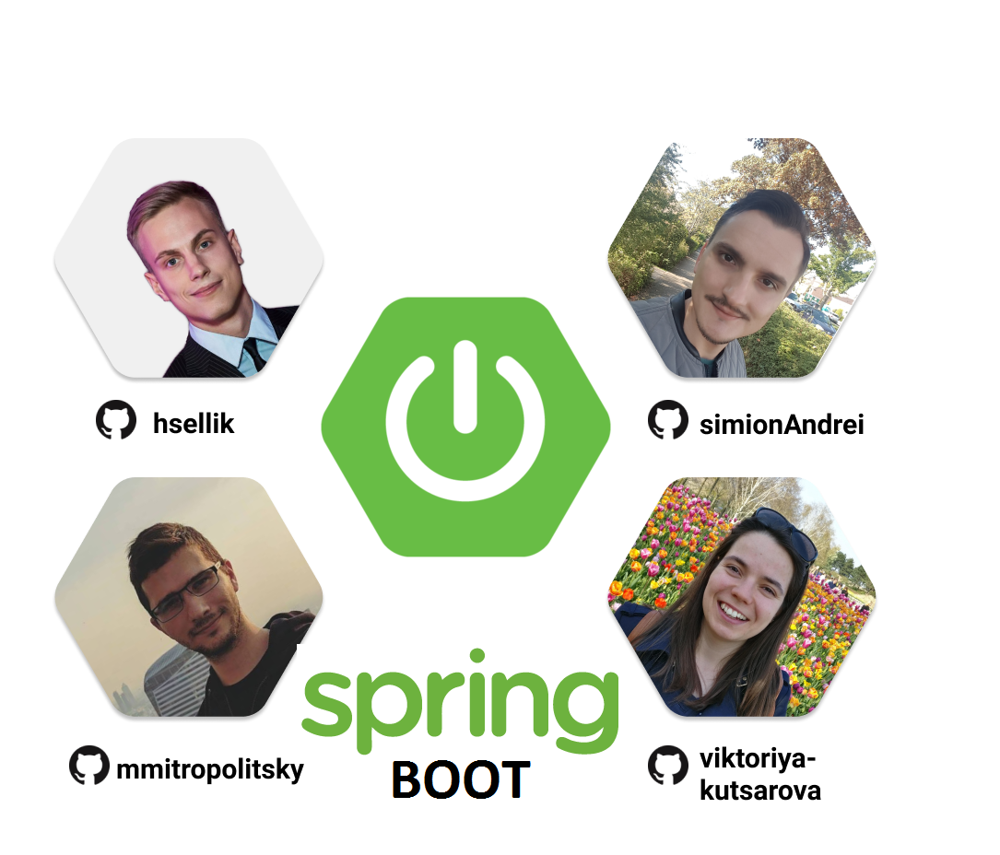
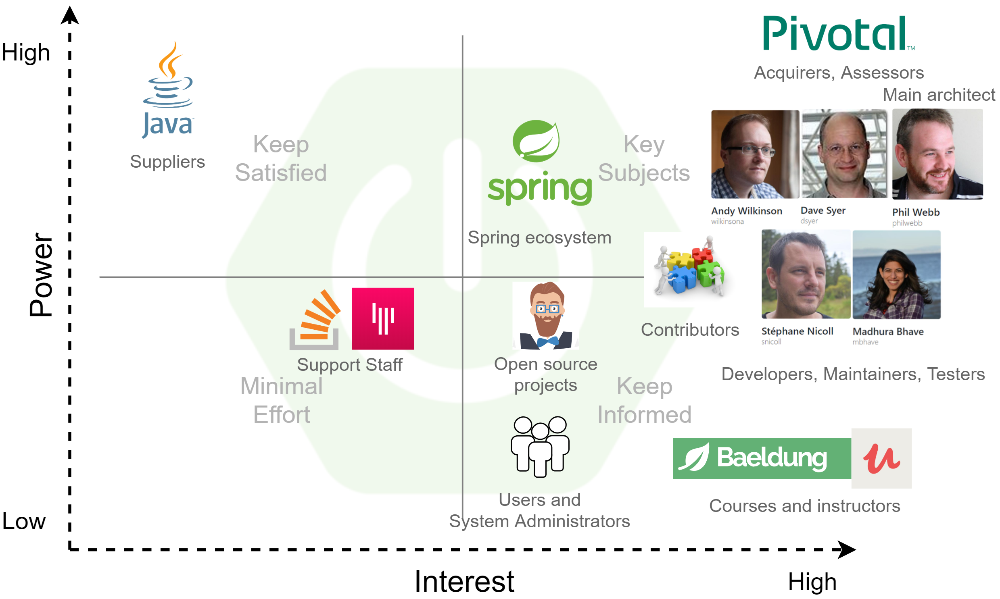
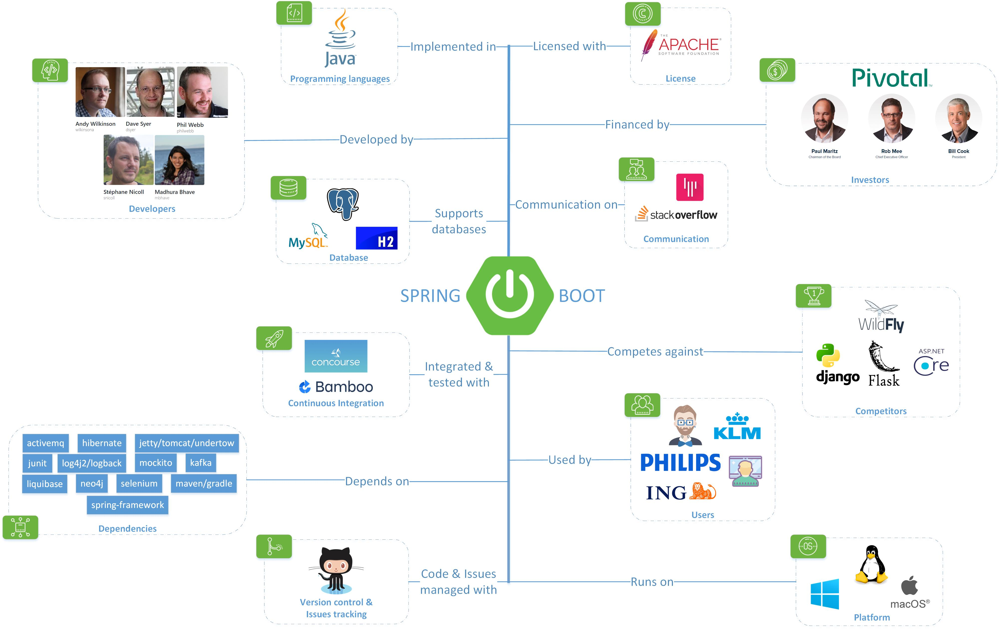
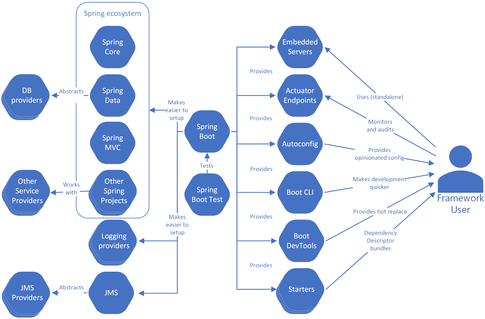
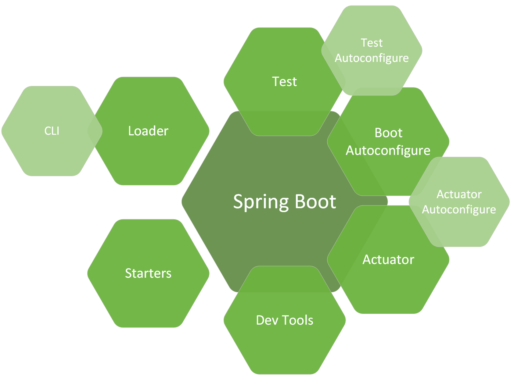
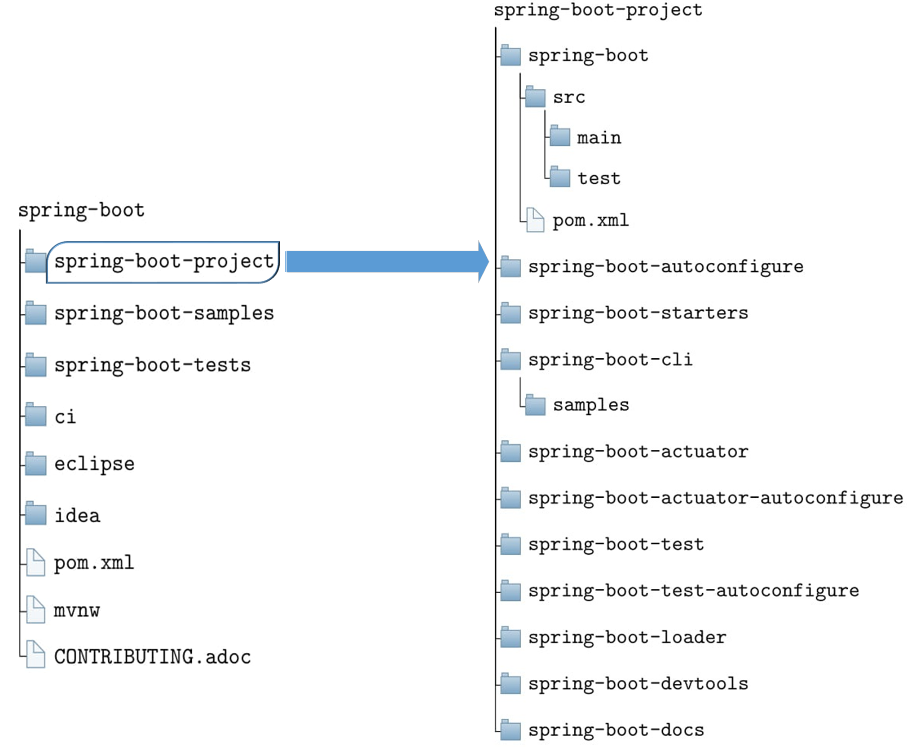
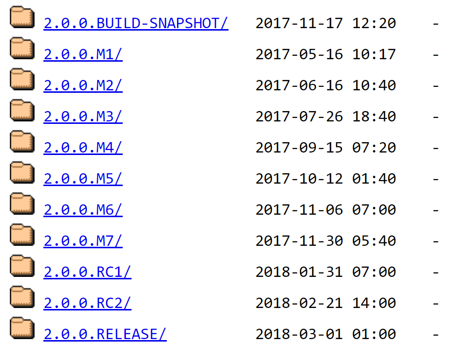
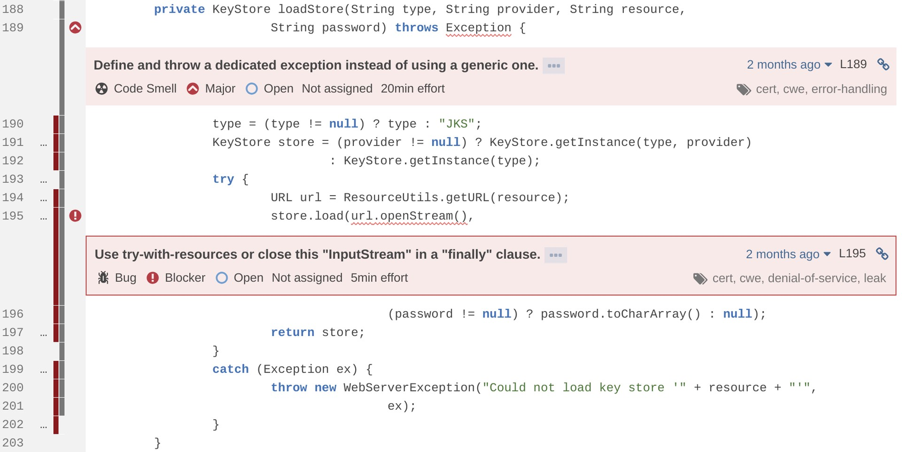
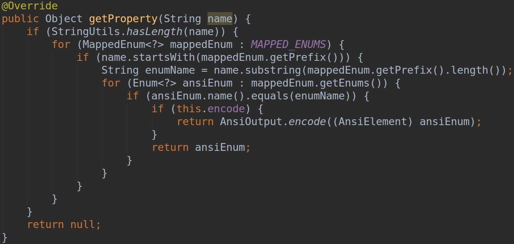
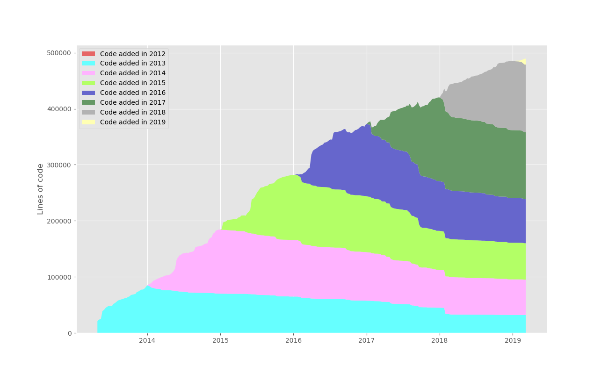

# Spring Boot - production-grade Spring-based Applications that you can "just run"

  
by [Andrei Simion-Constantinescu](https://github.com/simionAndrei) (top right), 
[Hendrig Sellik](https://github.com/hsellik) (top left), [Milko Mitropolitsky](https://github.com/mmitropolitsky) (bottom left),
[Viktoriya Kutsarova](https://github.com/viktoriya-kutsarova) (bottom right)

# Abstract

[Spring Boot](https://spring.io/projects/spring-boot) 
is an open source project part of the Java [Spring Framework](https://spring.io/)
designed to simplify the creation of stand-alone, production-grade Spring-based applications.
Spring Boot has revolutionized the way production-ready applications are developed, allowing
developers to focus more on the application logic rather than spending time on boilerplate
code to handle the necessary configurations and dependencies to run the application. Spring 
Boot is used in many enterprise solutions (e.g [Netflix](https://www.netflix.com))
for the fast building of massive applications, especially web-based ones. This chapter will 
be going from introducing Spring Boot's stakeholders and their roles in the decision making 
process to looking at the project from multiple perspectives like the Context View, 
Development View and Functional View. Finally, a research of the impact of Technical Debt
is provided followed by the final conclusions of this project's complex architectural analysis.

# Table of Contents
1.  [Introduction](#introduction)
2.  [Stakeholders](#stakeholders)
    * [Integrators and Decision-making process](#integrators-and-decision-making-process)  
    * [Power-interest grid](#power-interest-grid)
    * [People to contact](#people-to-contact)
3.  [Context View](#context-view)
    * [System Scope & Responsibilities](#system-scope-responsibilities) 
    * [Context View Diagram](#context-view-diagram)
4.  [Functional View](#functional-view)
    * [Functional Capabilities](#functional-capabilities)
    * [External Interfaces](#external-interfaces)
5.  [Development View](#development-view)
    * [Module Structure](#module-structure)
    * [Codeline Organization Model](#codeline-organization-model)
    * [Common Design Model](#common-design-model)
    * [Testing and Release Models](#testing-and-release-models)
6.  [Technical Debt](#technical-debt)
    * [Identifying Technical Debt](#identifying-technical-debt)
    * [Insights from Stéphane Nicoll](#insights-from-stéphane-nicoll)
    * [Testing Debt](#testing-debt)
    * [Evolution of Technical Debt](#evolution-of-technical-debt)
    * [Discussions about Technical Debt](#discussions-about-technical-debt)
    * [Possible Improvements](#possible-improvements)
7.  [Conclusions](#conclusions)
8.  [Bibliography](#bibliography)
9.  [Appendix A](#appendix-a)
10.  [Appendix B](#appendix-b)  


# Introduction
 
[Spring Framework](https://spring.io/) for Java was born in February 2003 after 
[Rod Johnson](https://twitter.com/springrod)'s 
book Expert One-on-One J2EE Design and Development [1] was published. In his book, the author 
described how a scalable high-quality application can be developed without Enterprise 
JavaBeans (EJB) framework using dependency injection in addition to ordinary java classes. Over 
the years, one of the most criticized aspects of the Spring Framework was the complex dependency 
management handled by massive XML configuration files. 

[Spring Boot](https://spring.io/projects/spring-boot) was launched in April 2014 resolving 
the problem of complex XML configurations by having three notable features that make it both
unique and easy to use:
 
* **intelligent auto-configuration** - setting the application based on the surrounding 
environment and information provided by the developer

*  **stand-alone** - eliminating the need of deploying to a web server or any other special 
environment by embedding Tomcat, Jetty or Undertow servers directly

* **opinionated** - saving developer's time by configuring the most popular libraries 
by default in the most standard way 


Due to the power of creating Spring-based applications that can "just run," 
Spring Boot's popularity grew faster. Spring Boot is being used by many large companies such as 
[Netflix](https://hub.packtpub.com/netflix-adopts-spring-boot-as-its-core-java-framework/),
[American Express](https://www.linkedin.com/jobs/view/engineer-java-web-app-dev-spring-boot-at-american-express-613972702/),
[ESPN](https://www.entertainmentcareers.net/espn/java-software-engineer/job/248744/),
[Mobile.de](http://www.technology-ebay.de/the-teams/mobile-de/blog/moving-from-war-to-jar-with-spring.html),
[Wix.com](https://stackshare.io/wix/scaling-wix-to-60m-users-from-monolith-to-microservices)
etc. To present a complete architectural description of Spring Boot, we follow the approach
defined by Rozanski & Woods (2012) [2], starting with the 
[Stakeholders analysis](#stakeholders), followed by multiple architectural views such as 
the [Context View](#context-view), the [Development View](#development-view),
the [Functional View](#functional-view) and continue with 
the [Technical Debt analysis](#technical-debt) before drawing the final 
[conclusions](#conclusions) of this chapter.


# Stakeholders

The stakeholders of Spring Boot are described in *Table 1*. Categories used correspond to 
the stakeholder types described by Rozanski & Woods (2012) [2]. In the 
[Other stakeholders](#other-stakeholders) section, we have identified additional people and
organizations concerned with the Spring Boot project.

<table>
  <tr>
   <td><strong>Category</strong>
   </td>
   <td><strong>Stakeholders</strong>
   </td>
  </tr>
  <tr>
   <td>Acquirers
   </td>
   <td>Pivotal company, with their <a href="https://investors.pivotal.io/governance/board-of-directors/default.aspx">
   Board of Directors</a> and <a href="https://pivotal.io/team">leadership team</a>. 
   </td>
  </tr>
  <tr>
   <td>Assessors
   </td>
   <td>The Board of Directors of Pivotal have created a <a href="https://investors.pivotal.io/governance/governance-documents/default.aspx">corporate governance framework</a>.
   </td>
  </tr>
  <tr>
   <td>Communicators
   </td>
   <td>Pivotal offers <a href="https://pivotal.io/training/courses/spring-boot-developer-training">
   Spring Boot training courses</a> for developers, architects, system administrators, and 
   technical managers.
<p>
The official Spring Boot <a href="https://docs.spring.io/spring-boot/docs/2.2.0.BUILD-SNAPSHOT/reference/html/">
documentation</a> and <a href="https://docs.spring.io/spring-boot/docs/current/reference/html/">
reference guide</a> are created and maintained mainly by the core engineering team.
<p>
There is also large community support on <a href="https://gitter.im/spring-projects/spring-boot">
Gitter</a>.
   </td>
  </tr>
  <tr>
   <td>Developers
   </td>
   <td>Main developers of the system are part of the Pivotal company. Most active ones are 
    <a href="https://spring.io/team/snicoll">Stéphane Nicoll</a>, 
    <a href="https://spring.io/team/awilkinson">Andy Wilkinson</a>, 
    <a href="https://spring.io/team/mbhave">Madhura Bhave</a>. 
    The founder <a href="https://spring.io/team/dsyer">Dave Syer</a> and co-founder 
    <a href="https://spring.io/team/pwebb">Phil Webb</a> have also contributed a lot in 
    the development process. 
   </td>
  </tr>
  <tr>
   <td>Maintainers
   </td>
   <td>Overlapping with developers. Mostly <a href="https://spring.io/team/snicoll">
   Stéphane Nicoll</a>, <a href="https://spring.io/team/awilkinson">Andy Wilkinson</a>, 
   <a href="https://spring.io/team/mbhave">Madhura Bhave</a>. People from the Spring community 
   are also actively contributing to improving the project.
   </td>
  </tr>
  <tr>
   <td>Suppliers
   </td>
   <td>Spring Boot is built on top of Java SE and Spring Core.
   </td>
  </tr>
  <tr>
   <td>Support staff
   </td>
   <td>Spring Boot team is monitoring <a href="https://stackoverflow.com/">stackoverflow.com</a> 
    for questions tagged with <a href="https://stackoverflow.com/tags/spring-boot">spring-boot</a>. 
    Chat with the community happens on <a href="https://gitter.im/spring-projects/spring-boot">
    Gitter</a>. Reporting bugs happens at their <a href="https://github.com/spring-projects/spring-boot/issues">
    GitHub repository</a>.
   </td>
  </tr>
  <tr>
   <td>System administrators
   </td>
   <td>Administrators of Spring Boot are the software engineers that have incorporated 
    Spring Boot in their projects and products.
   </td>
  </tr>
  <tr>
   <td>Testers
   </td>
   <td>Large overlap with developers and maintainers. <a href="https://spring.io/team/awilkinson">
   Andy Wilkinson</a> and <a href="https://spring.io/team/pwebb">Phil Webb</a> seem to be mostly 
   contributing to the testing parts.
   </td>
  </tr>
  <tr>
   <td>Users
   </td>
   <td>A large user base in the Java world. Both individuals and large companies. Examples of 
    companies: <a href="https://www.klm.com/">KLM Royal Dutch Airlines</a>, 
    <a href="https://www.ing.nl/particulier/index.html">ING</a>, <a href="https://www.philips.nl/">
    Philips</a>.
   </td>
  </tr>
</table>

***Table 1*** - Stakeholders of Spring Boot

## Other stakeholders

* **Spring ecosystem stakeholders** - As Spring Boot is part of the whole ecosystem of Spring, 
other Spring projects ([Spring Core](http://spring.io/projects/spring-framework), 
[Spring Cloud](http://spring.io/projects/spring-cloud), etc.) are important stakeholders
that can affect the decision-making process for the framework.

* **Contributors** - Spring Boot is an Open Source system and various developers are contributing to 
the software.

* **System Architects** - [Phil Webb](https://spring.io/team/pwebb) is the lead architect of the Spring Boot project. Along 
with his colleagues at Pivotal, they are the ones forming the architecture of the framework.

* **Courses and instructors** - there are plenty of tutorials, courses and instructors that 
are helping the Java community integrate the project within their own applications. 
Some examples are 
[Ken Kousen](https://learning.oreilly.com/live-training/courses/reactive-spring-and-spring-boot/0636920233435/),
[Udemy](https://www.udemy.com/topic/spring-boot/), 
[Baeldung](https://courses.baeldung.com/p/rest-with-spring-the-certification-class?affcode=22136_bkwjs9xa)
and [SpringFramework Guru](https://www.baeldung.com/spring-boot-start).

* **Open source projects** - Spring Boot is extremely popular in the Java world. There are 
plenty of open source projects based on the framework. As such, they are interested in and 
dependent on the development of Spring Boot. Some examples are [JHipster](https://www.jhipster.tech/),
[Java Blogs Aggregator](https://github.com/RameshMF/java-blog-aggregator-boot), 
[Project Sagan](https://github.com/RameshMF/sagan). Another example can be found 
[here](https://www.javaguides.net/2018/10/free-open-source-projects-using-spring-boot.html).

## Integrators and Decision-making process
Spring Boot is an avid example of an open-source system. It is backed up by a company 
(Pivotal) and is accepting contributions from anyone who complies with their 
code of conduct and signs a release form. All of the work is done in GitHub, and the 
mergers and maintainers of the code are members of the Pivotal team. The process analysis 
is based on some of the most commented issues and pull requests in the Spring Boot repository, 
described in [Appendix A](#appendix-a).

Most of the time contribution and decision-making follow a similar path. The work pipeline 
first requires an issue or a pull request (PR) creation from a team member or a contributor 
from the community. Contributors are strongly advised to create a small proof-of-concept project 
and create a pull request with the example in the [spring-boot-issues repository](https://github.com/spring-projects/spring-boot-issues). 
After that, the issue is either declined or approved.

The decision of what issues to be included, as well as which issues are relevant and should be 
pursued in a release seem somehow centralized. There is no evidence of a wide discussion for 
the general direction of the framework which seems to be decided internally at Pivotal. Issues 
added by contributors are mainly about bugs and smaller enhancements. The decision is also 
influenced by the number of people requesting a certain feature. 

After approval, the PRs regarding the issue are merged after a discussion between the 
contributor and team members. Team members often lend a hand with polish and code standard 
compliance. Some issues can interfere or intersect with the 
work on other Spring projects (e.g. Spring Data, or Spring Cloud). In that case, representatives 
of those projects voice their concerns or comments. Issues might be declined if they are 
postponed for too long and become irrelevant, or if the Spring Boot team decides it is not in 
the direction they want to bring the product.

Work is done on release branches (e.g. 2.1.3.RC, 2.1.4.M2, etc.) following their release train. 
Those branches are regularly merged into the Master branch of the project. PRs are merged into 
the release branch by members of the team. Most often these members are 
[Andy Wilkinson](https://github.com/wilkinsona) or [Phil Webb](https://github.com/philwebb), 
as well as  [Stéphane Nicoll](https://github.com/snicoll). [Phil Webb](https://github.com/philwebb) 
and [Dave Syer](https://github.com/dsyer) are the project's creators and sometimes 
partake in the discussions. 


## Power-interest grid
After identifying the stakeholders for the Spring Boot project, a power-interest matrix was created. 
The grid classifies the stakeholders according to their power over the project and their 
interest in it.



***Figure 1*** - Spring Boot Power-Interest Diagram

## People to contact
After going through various sources of information regarding Spring Boot, our team came to the 
conclusion that the following three people would be the most interesting to contact:


<table>
  <tr>
   <td><strong>Name</strong>
   </td>
   <td><strong>Reason to contact</strong>
   </td>
  </tr>
  <tr>
   <td>[Andy Wilkinson](https://github.com/wilkinsona)
   </td>
   <td>Big role in the decision-making process
   </td>
  </tr>
  <tr>
   <td>[Phil Webb](https://github.com/philwebb)
   </td>
   <td>Project lead and active on GitHub
   </td>
  </tr>
  <tr>
   <td>[Stéphane Nicoll](https://github.com/snicoll)
   </td>
   <td>One of the most active software engineers in the project
   </td>
  </tr>
</table>

***Table 2*** - People to contact regarding Spring Boot

# Context view
In this section, the context view of Spring Boot will be discussed. 
According to Rozanski and Wood, "Context View describes the relationships, dependencies, 
and interactions between the system and its environment 
(the people, systems, and external entities with which it interacts)". It defines what 
are the system's capabilities and constraints and should be understandable to all 
stakeholders.

## System Scope & Responsibilities
Spring Boot is a framework running on the Java Virtual Machine (JVM) and meant to ease the 
configuration process of Spring-based applications. It also addresses the learning curve 
of using the Spring ecosystem, 
which prohibited new developers from adopting it 
[(Spring Framework #14521)](https://github.com/spring-projects/spring-framework/issues/14521).
This means that Spring Boot has excellent support for a vast range of
Spring ecosystem projects such as
[Spring Data](https://spring.io/projects/spring-data),
[Spring Security](https://spring.io/projects/spring-security),
[Spring Cloud](https://spring.io/projects/spring-cloud) etc.
Spring Boot includes the following capabilities, also described in the 
[documentation](https://docs.spring.io/spring-boot/docs/current/reference/htmlsingle/#getting-started-introducing-spring-boot)
and this [article](https://dzone.com/articles/what-is-spring-boot):

* Provide an opinionated and out-of-the-box Spring application with 
pre-selected configurations, but get out of the way once requirements start to diverge from
the defaults.
* Give a range of non-functional features such as metrics, security,
health checks, embedded servers, and externalized configuration.
* Offer a fast and accessible getting-started experience for Spring applications. This
includes embedded [Tomcat](http://tomcat.apache.org/), [Jetty](https://www.eclipse.org/jetty/)
and [Undertow](http://undertow.io/) servlet containers which remove the need to set them up manually.
* Provide minimal and intuitive annotation-driven configuration. 
One of the main problems with Spring Framework is a lot of boilerplate configuration, 
such as XML descriptors and annotations. While it is true that the Spring Framework 
can be configured without XML as well, it is not 
as convenient as Spring Boot's configuration.
* Provide CLI (Command Line Interface) tool to develop and test Spring Boot 
applications from command prompt very conveniently and quickly.
* Offer lots of plugins to develop and test Spring Boot Applications easily 
 using build tools like [Maven](https://maven.apache.org/) and [Gradle](https://gradle.org/).
* Provide the opportunity to use an embedded in-memory database or effortlessly connect 
to existing SQL database such as [PostgreSQL](https://www.postgresql.org/),
[Oracle DB](https://www.oracle.com/database/), etc.

All this makes Spring Boot a good starting point to develop production-ready 
Spring applications with minimal effort while making it easy to create custom modifications.

## Context View Diagram
Context View Diagram can be seen in *Figure 2* with the entities further detailed below.  



***Figure 2*** - Spring Boot Context Diagram


* **Languages** - Spring Boot is developed almost exclusively in Java (being an extension of 
the Spring Core Framework). According to  the information found on 
[Spring Boot GitHub Repository](https://github.com/spring-projects/spring-boot), the rest 
(HTML, Groovy, Javascript, Shell, Kotlin) make up less than 2% of the codebase.  

* **Contributors** -  Main contributors to this project are employees of [Pivotal](https://pivotal.io/)
(most notably Andy Wilkinson, Stéphane Nicoll, Phil Webb, Dave Syer, and Madhura Bhave). Pull requests 
from third-party developers are accepted and encouraged.

* **Database Support** - Spring Boot supports embedded databases such as [H2](http://www.h2database.com/html/main.html) 
but also accepts connection to a wide variety of databases through easily configurable JDBC drivers. Spring Boot 
also supports Spring Data which offers powerful object-mapping abstractions.

* **Investors** - Spring Boot is financed by [Pivotal](https://pivotal.io/).

* **License** - Spring Boot is an open-source project released under the [Apache 2.0 license](https://www.apache.org/licenses/LICENSE-2.0).

* **Communication** - Open and informal discussion about Spring Boot is on 
[Gitter](https://gitter.im/spring-projects/spring-boot?utm_source=badge&utm_medium=badge&utm_campaign=pr-badge&utm_content=badge). 
Spring Boot used to have a forum managed by Pivotal but they [decided](http://forum.spring.io/forum/spring-projects/boot/751211-forum-deactivated)
to move it over to Stackoverflow. Some of the communication is also happening on the GitHub 
issue tracker.

* **Issue Tracking** - Spring Boot's issues are tracked in 
[GitHub issue tracker](https://github.com/spring-projects/spring-boot/issues). 
People can also submit pull requests on GitHub.

* **Continuous Integration** - For CI, Spring Boot project uses 
[Concourse CI](https://ci.spring.io/teams/spring-boot/pipelines/spring-boot) and 
[Bamboo](https://build.spring.io/browse/BOOT).

* **Dependencies** - Even if the end-user will probably not be using all the dependencies, 
 Boot project has to maintain all the options and therefore is dependent on a number
of third-party software. Key dependencies include 
[Maven/Gradle](https://www.baeldung.com/ant-maven-gradle) for dependency management,
[Tomcat/Jetty/Undertow](https://docs.spring.io/spring-boot/docs/current/reference/html/howto-embedded-web-servers.html) 
for Java servlet containers and the Spring framework itself.


* **Platform** - Spring Boot is usually run on Windows, Ubuntu and other Linux based 
operating systems but it can run everywhere where 
[Java Runtime Environment](https://www.oracle.com/technetwork/java/javase/overview/index.html)
is available.

* **Users** - Spring Boot is used by individual developers to create minimum viable 
products (MVPs) as well as companies for Spring-based Web applications and microservices. 
This means that the users' skill level varies greatly. Spring Boot is also used as a core 
dependency by third-party open source software, such as [JHipster](https://www.jhipster.tech/).

* **Competitors** - For deploying Java microservices, [WildFly](https://wildfly.org/) is a 
competitor to Spring Boot, but it is not as widely used and has a smaller community. 
[Django](https://www.djangoproject.com/) is a popular alternative in Python, which is
more lightweight but may not have all the enterprise solutions Spring Boot offers. 
Other competitors include [Flask](http://flask.pocoo.org/) (Python) and 
[ASP.NET Core](https://docs.microsoft.com/en-us/aspnet/core/?view=aspnetcore-2.2) (C#).

# Functional View

In the [System Scope & Responsibilities](#system-scope-responsibilities) section, we discussed 
what features and capabilities Spring Boot has. In this part, an overview is given of how 
the system interacts with its users and external entities. We try to present the Spring Boot 
in a way that people working with Java and the Spring ecosystem can get a general idea of 
what it is about. 

 
 
 ***Figure 3*** - Functional Structure Model of Spring Boot
 
 Spring Boot is comprised of multiple components. Their internal hierarchical structure and 
 dependencies are discussed in detail in the [Module Structure](#module-structure) 
 section of this chapter. The interactions between the different functional elements 
 are shown in *Figure 3*.
  
 Generally, the features provided by the project are aimed at the software developers 
 who want to use the Spring ecosystem in their projects. It is a Rapid Application Development 
 framework which allows for swift setup of a new project while 
 allowing for customizations.
 
 ## Functional Capabilities
 
A short walk through the initial parts of an application's lifecycle will explain where 
Spring Boot is positioned in the development process and how the project helps it. For the purpose 
of this example we assume that the developers have already chosen Java as their primary language 
and Spring Boot as the tool to kick-off the project. 
 
For the sake of simplicity, the example project consists of a Database connection and a 
REST service.
 
The project is started by choosing one of the provided [starters](https://docs.spring.io/spring-boot/docs/current/reference/htmlsingle/#using-boot-starter). 
They are conveniently bundled dependency descriptors used to simplify the dependency files. 
Developers can now include a single dependency for a certain functionality (e.g. working 
with an ORM) instead of the large number of dependency declarations needed otherwise. 

The Spring Boot CLI can optionally be used to write Groovy scripts for fast 
prototyping and creating the project. It gives an alternative to just picking starters 
and writing boilerplate code in Java.

Developers can then opt-in to the [auto-configuration](https://docs.spring.io/spring-boot/docs/current/reference/html/using-boot-auto-configuration.html) 
functionality with a simple annotation. It is one of the most powerful time-saving tools in the 
Spring Boot toolset. Based on the dependencies on the classpath,
the framework attempts to configure the application. For example, if
`HSQLDB` is on the classpath, an in-memory database will be configured with default settings 
and values which are based on best practices and common usage models. Of course, Spring Boot 
always gives precedence to user-defined configurations over auto-configuration.

As the example project is a web-application which exposes a REST endpoint, a web-server 
is needed. Spring Boot provides [embedded web-servers](https://docs.spring.io/spring-boot/docs/current/reference/html/howto-embedded-web-servers.html) 
out of the box. The server is embedded in the resulting stand-alone `.jar`. As with other 
configurations, it is completely customizable.

In order to speed up the development process even further, quality-of-life improving tools 
module [dev tools](https://docs.spring.io/spring-boot/docs/current/reference/html/using-boot-devtools.html) 
with features such as automatic restarts and resource caching can be used.  

Using the provided tools, the example project can now expose a REST endpoint and 
store information in an in-memory database using only a few annotations and can be contained 
in a single executable `.jar` file. However, a running app needs to be monitored and audited. 
Spring Boot offers a solution to that as well with the
[Actuator](https://docs.spring.io/spring-boot/docs/current/reference/html/production-ready-endpoints.html).
The Actuator provides endpoints such as `healthcheck` and `auditevents` to ease that process.
  
## External Interfaces

Spring Boot makes it easier to start up and run a production-ready software quickly. 
However, most of the features (except the Actuator) it has, are provided by external sources. 
Creating a software application can be complicated but is helped by the various projects 
in the Spring ecosystem - from managing work with a database with the Spring Data projects 
to creating web applications with Spring MVC. All of those can be configured 
separately, but Spring Boot is very good at configuring and orchestrating them. It is created 
to alleviate the difficulties when creating an application and to allow developers to 
focus on the business problem they are facing.

As mentioned in the [System Scope & Responsibilities](#system-scope-responsibilities) 
Spring Boot is the answer to the critique of the Spring ecosystem and its steep learning curve. 
As such, its external interfaces are connected with the various Spring projects and 
indirectly with the service providers that some projects work with (e.g. different databases 
when using Spring Data).

# Development View

## Module Structure

Spring Boot is comprised of several modules, each serving a different purpose. 
A high-level overview of the module hierarchy is shown in *Figure 3*.



***Figure 3*** - Spring Boot high-level module structure. Overlapping indicates a dependency between modules.

- `spring-boot` is the main module, which provides features and methods that are used by the other 
modules of Spring Boot.
For example, the ability to create applications with embedded web servers (e.g. Tomcat or Jetty).
- `spring-boot-autoconfigure` is responsible for the *opinionated* configuration of a 
Spring Boot application based on the contents of the classpath. It is also base for other 
`autoconfigure` endpoints. 
- `spring-boot-actuator` provides the infrastructure and endpoints to monitor and audit 
applications. 
- `spring-boot-actuator-autoconfigure` provides the configuration of different endpoints based 
on classpath content. 
- `spring-boot-test` contains annotations and methods to write tests.
- `spring-boot-test-autoconfigure` automatically configures the tests and their dependencies 
based on what is present on the classpath.
- `spring-boot-devtools` is a toolset for quicker and smoother development with features 
such as automatic restarts.
- `spring-boot-loader` allows a Spring Boot application to be packaged in a single 
stand-alone Java archive (`.jar`) with all dependencies bundled (including web servers).
- `spring-boot-cli` is another developer oriented module providing a simple command line 
tool to quickly script and get an application up and running.
- `spring-boot-starters` are a set of modules providing prepackaged dependency descriptors 
so that developers need to manage only a single dependency.

## Codeline Organization Model

For creating the Codeline Organization Model, we analyzed the project directory 
structure from the 
[Spring Boot GitHub repository](https://github.com/spring-projects/spring-boot). 
The overall code structure of Spring Boot can be seen in *Figure 4*, with the main 
application folder `spring-boot-project` being further expanded.



***Figure 4*** - Spring Boot Code Structure

The **Functionality Part** of Spring Boot contains multiple modules that are grouped
in the `spring-boot-project` folder. These modules were described in detail in the
[Module Structure](#module-structure). Each of the sub-folders (with a few exceptions 
such as `spring-boot-starters` which contains XML dependency 
descriptors) is organized into a `src` folder, which contains `main` and `test` 
folders for module source code and module unit tests (following the 
[standard maven structure](https://maven.apache.org/guides/introduction/introduction-to-the-standard-directory-layout.html)) 
and a separate `pom.xml` file among other properties and configuration files.

The **Development and Deployment Part** of Spring Boot is handled in `spring-boot-tests` 
for deployment (`/spring-boot-deployment-tests`) and integration
(`/spring-boot-integration-tests`) tests. For Continuous Integration the 
[Concourse](https://ci.spring.io/) pipeline scripts are grouped in `ci`.
The folders `eclipse` and `idea`  are used for providing support for 
[Eclipse](https://www.eclipse.org/) and [IntelliJ IDEA](https://www.jetbrains.com/idea/) 
to people that want to contribute.

The **Documentation Part** is contained in `spring-boot-samples` with Java sample 
applications and `spring-boot-cli/samples` with Groovy samples for the command 
line application. [Javadoc](https://docs.oracle.com/javase/8/docs/technotes/tools/windows/javadoc.html) 
and [Asciidoctor](https://asciidoctor.org/) documentation are found in `spring-boot-docs`.
Other Asciidoctor files are placed in the root folder explaining the contribution pipeline, 
how to get support and so on. The repository root also contains the 
[maven wrapper](https://github.com/takari/maven-wrapper) to ensure that the
 build has everything necessary to be run independently. By using the maven wrapper,
`mvnw`, the reference documentation in HTML format can be built. The generated documentation 
can be found at `spring-boot-project/spring-boot-docs/target/generated-docs/reference/html`.

## Common Design Model
In this section, part of the common design model is identified and discussed.

#### Standardization of Codeline
As previously mentioned in [Codeline Organization Model](#codeline-organization-model),
the actual program code and the unit test code are structured as follows:

```
src/main/java/com/foo/Bar.java
src/test/java/com/foo/BarTests.java
```

Apart from the obvious codeline organization advantage, this ensures that unit tests are 
written separately from the mainline code, but still have
access to package protected classes, methods, etc. 

#### Object-Oriented Programming (OOP)
As most big Java projects, Spring Boot project uses the 
[OOP](https://en.wikipedia.org/wiki/Object-oriented_programming)
paradigm. This has well-known
advantages such as encapsulation, inheritance, and polymorphism. While conducting an
interview with Stéphane Nicoll, he explicitly stated that the Spring Boot team tries to 
keep classes and classes contents as private as possible. 

#### Dependency injection
Spring Boot uses the
[dependency injection](https://www.baeldung.com/inversion-control-and-dependency-injection-in-spring)
technique. This allows enforcing the Inversion of Control principle which helps to increase the 
modularity of the project and make it more extensible. The Spring Boot project uses the
[`@Autowired`](https://www.baeldung.com/inversion-control-and-dependency-injection-in-spring) 
annotation in most cases for dependency injection which was introduced by the Spring Framework. 

#### Modularity
When discussing with Stéphane Nicoll from the Spring Boot team, he stated that the Spring Boot 
project aims to have stand-alone modules which are not interdependent. The goal of this is to 
minimize coupling which increases maintainability of the code. While they make the code
modular, they also wish
to avoid making 
[split packages](https://www.logicbig.com/tutorials/core-java-tutorial/modules/split-packages.html). 

#### Message logging
[Spring Boot's logging](https://docs.spring.io/spring-boot/docs/current/reference/htmlsingle/#boot-features-logging) 
relies on 
[Commons Logging](https://commons.apache.org/proper/commons-logging/)
API for all internal logging and provides 
default configurations
for Java Util Logging, Log4J2 and LogBack implementation of the API.

The default format for Spring Boot log messages is the following:
```
2014-03-05 10:57:51.112  INFO 45469 --- [           main] org.apache.catalina.core.StandardEngine  : Starting Servlet Engine: Apache Tomcat/7.0.52
2014-03-05 10:57:51.253  INFO 45469 --- [ost-startStop-1] o.a.c.c.C.[Tomcat].[localhost].[/]       : Initializing Spring embedded WebApplicationContext
```

By default, the logs are only displayed in the console. They can also be stored in a file,
which requires [configuration](https://docs.spring.io/spring-boot/docs/current/reference/htmlsingle/#boot-features-logging-file-output)
(e.g. in `application.properties`).

## Testing and Release Models

### Testing process

Integration tests, located in module `spring-boot-tests` 
(see [Codeline Organization Model](#codeline-organization-model)), are executed with every PR,
as well as on every release. In addition, when a version is ready to be released, deployment 
tests (located in the same module) are also executed.

### Release process

Spring Boot project is using [Concourse](https://ci.spring.io/) for CI. 
The release versions of the project consist of 
[milestones](https://github.com/spring-projects/spring-boot/milestones) (*M#*), 
release candidates (*RC#*) and general availability releases (*RELEASE*) 
(expected to be stable and feature complete). There are also service releases, 
used for maintenance after a major release. Each release is available 
on [repo.spring.io](https://repo.spring.io) and 
[GA](https://spring.io/blog/2018/03/01/spring-boot-2-0-goes-ga)
are also available on Maven Central.

A prime example of the release process is the release of the major version `2.0.0` 
and can be seen in  *Figure 5*.



***Figure 5*** - Spring Boot release process for the major version 2.0.0

Like all the other projects in the Spring ecosystem, there is a strong 
[set of rules](https://github.com/spring-projects/spring-build-gradle/wiki/Spring-project-versioning) 
for versioning the releases of Spring Boot. This is not just following best practices, but the 
[community download page](https://github.com/spring-projects/spring-build-gradle/wiki/Community-download-page) 
depends on the naming and semantic details of the release artifacts.

Scripts for releasing a version can be found in the `ci` module. Each version is accompanied 
by release notes which can be found in the
[Wiki](https://github.com/spring-projects/spring-boot/wiki/Spring-Boot-2.2-Release-Notes) 
section of the GitHub repository. Release notes contain information on how to upgrade 
from a previous version, new noteworthy features, as well as various deprecations.

# Technical debt

[Technical debt](https://www.techopedia.com/definition/27913/technical-debt) is a concept 
in programming that reflects the extra development work that arises when code that is 
easy to implement in the short run is used instead of applying the best overall solution.

## Identifying technical debt

Identifying technical debt in a project is an extremely challenging task. We used
automated code inspection tools, but they can only support the identification process. 
Our team interviewed one of the leading software engineers of Spring Boot - 
[Stéphane Nicoll](https://github.com/snicoll) - who gave us valuable 
[insights](#insights-from-stéphane-nicoll) on how big the technical debt is and what 
does the project's team do to keep it to a minimum.

### Static code analysis

Static code analysis is done using 
[SonarQube](https://sonarcloud.io/dashboard?id=viktoriya-kutsarova_spring-boot), 
to understand the technical debt of Spring Boot.

There are four main elements that the static code analysis tool emphasizes on:
- **Bugs and vulnerabilities** - Most of the bugs identified by SonarQube are minor. Still, 
the tool gives Spring Boot a Reliability Rating `E`, which stands for at least one blocker bug 
in the code, shown in *Figure 6*.



***Figure 6*** - Critical issue - Not closing an input stream can lead to memory leaks.

- **Code smells** - Technical debt ratio of the Spring Boot project is less than `5.0%`, 
according to SonarQube. This result indicates that the Spring Boot team takes quality in 
a serious manner as was confirmed by the conducted interview.

- **Duplications** - According to SonarQube the code duplication is only `0.7%` 
hence it is not a big problem for the framework.

- **Cyclomatic complexity** - Using [SonarLint](https://www.sonarlint.org/) and 
manual code inspection, we have identified several cases of high 
Cyclomatic complexity [3]. An example can be seen in *Figure 7* where the recommended 
value is exceeded. 



***Figure 7*** - High cyclomatic complexity (21) in Spring Boot

Spring Boot overall has a small amount of technical debt. Some of it is known to the 
development team. This [deliberate](https://hackernoon.com/there-are-3-main-types-of-technical-debt-heres-how-to-manage-them-4a3328a4c50c) 
debt is placed in a [separate milestone](https://github.com/spring-projects/spring-boot/milestone/94). 
The issues in this backlog are not yet scheduled for a particular release and are mostly bugs 
or enhancements that Spring Boot team wants to solve in a future version.

### Insights from Stéphane Nicoll

Spring Boot's core team engineer Stéphane Nicoll discussed the technical debt of the project
in details in the interview we did. In this section, we put some of the most exciting 
findings according to our team:

- **Major refactoring** - Spring Boot team had to perform a significant refactoring of the 
`actuator module` once Spring Framework implemented the 
[reactive paradigm](https://spring.io/blog/2016/07/28/reactive-programming-with-spring-5-0-m1). 
The module heavily relied on `Spring MVC` that uses `servlet containers`, which is not 
compatible with the new reactive style. The team decided to rewrite the whole module from 
scratch but kept its public API.

- **For team attention** - we have noticed flagging of issues with a label `for-team-attention`.
Once an issue is created (either from a team
member or from a contributor), a team member can label it. The team holds two 
meetings every week. During those meetings, the person who marked an issue explains 
the reasoning behind it, and then the participants in the meeting collectively decide
how to handle the problem.

Stéphane Nicoll confirmed our finding that the Spring Boot team tries to keep the technical
debt to a minimum and is building its code base with great care for readability and quality.
A remarkable fact is that the Spring Boot team does not use a technical debt identification 
tool, apart from the static code analysis tool provided by IDEs. As Stéphane stated, 
"we don't use any tool, we don't see any benefit from using one". The team works 
"in an organic way", relies mostly on experience, strong sense of belonging to the project 
and is heavily influenced by the Spring community. In his words:

> If we do something wrong, the community will kick our asses anyway.

## Testing Debt
Issue analysis ([#13526](https://github.com/spring-projects/spring-boot/issues/13526) and
[#14684](https://github.com/spring-projects/spring-boot/issues/14689)) prior to interview
with Stéphane Nicoll made us believe that there are no code coverage reports in CI tools. 
This was later confirmed while conducting the interview.

The project has an advanced testing environment with embedded Docker containers 
([#10516](https://github.com/spring-projects/spring-boot/issues/10516)) and Servlets 
which makes test coverage of the project high. The test suite is 
simple to run on the command line with `./mvnw verify`.

IntelliJ IDEA built-in code coverage tool was used to run unit tests on most important 
modules, which were `spring-boot`, `spring-boot-actuator`, 
`spring-boot-actuator-autoconfigure` and `spring-boot-autoconfigure`. 
The results show that those modules are very well tested 
with class and line coverage being mostly over 90% (see *Table 4*). 

<table>
  <tr>
   <td><strong>Module</strong>
   </td>
   <td><strong>Class Coverage</strong>
   </td>
   <td><strong>Line Coverage</strong>
   </td>
  </tr>
  <tr>
   <td>spring-boot
   </td>
   <td>93%
   </td>
   <td>90%
   </td>
  </tr>
  <tr>
   <td>spring-boot-actuator
   </td>
   <td>94%
   </td>
   <td>93%
   </td>
  </tr>
  <tr>
   <td>spring-boot-actuator-autoconfigure
   </td>
   <td>95%
   </td>
   <td>90%
   </td>
  </tr>
  <tr>
   <td>spring-boot-autoconfigure 
   </td>
   <td>89% 
   </td>
   <td>93%
   </td>
  </tr>
</table>

***Table 4*** - Test coverage for Spring Boot's main modules

Therefore it can be said that testing debt of Spring Boot is minimal 
and will not affect the project negatively if kept at this level. 
However, the project could make use of automated tooling to report 
on potential testing debt and make this information available to contributors.


## Evolution of technical debt

In order to “calculate the trends of the technical debt time series” [4] for 
the Spring Boot project, we first need to take a look at the history of the whole 
Spring Framework. The evolution of Spring Framework from 
[interface21](https://spring.io/blog/2006/12/16/why-the-name-interface21)
to [SpringSource](https://www.crunchbase.com/organization/springsource#section-overview) 
and finally [Pivotal](https://pivotal.io/) is displayed in *Figure 8*.


***Figure 8*** - History of Spring Framework (adapted from [here](https://www.quora.com/What-is-the-history-of-The-Spring-Framework))


Spring Boot was launched in April 2014 due to the need for
[support for containerless web application architectures in Spring Framework](https://github.com/spring-projects/spring-framework/issues/14521)
with [Phil Webb as lead architect](https://spring.io/blog/2013/08/06/spring-boot-simplifying-spring-for-everyone/),
after Pivotal was created in 2013. Due to this, Spring Boot was not 
affected by a major change in management that could determine Technical 
Debt arising from
[different performance management styles](https://techdebtpolicy.com/performance-management-systems/).


Another aspect related to the evolution of technical debt from the Spring world is the
[launch of Spring IO](https://spring.io/blog/2014/06/26/introducing-the-spring-io-platform)
in June 2014. Generally, as a release pipeline, a new Spring Framework
version will trigger a new Spring Boot release followed by a Spring IO platform
release which incorporates the new version of Spring Boot. The Technical
Debt arising from here is related to the decreasing difference between
Spring Boot’s and the platform’s dependency management. That is the reason why
[Spring IO Platform end-of-life](https://spring.io/blog/2018/04/09/spring-io-platform-end-of-life-announcement)
was announced with Cairo being the last maintained version.

The fact that “software process evolution has a clear effect on technical debt” [5]
was proved in Spring Boot project by a major switch. When Spring Boot
decided to replace their CI platform from Bamboo
to Concourse, they benefited from having a platform maintained by Pivotal. 
The [migration to Concourse was problematic](https://github.com/spring-projects/spring-boot/issues/10516),
but it was a known fact to the developers and they took the effort to remove the debt later on.

From its conception until today Spring Boot has had steady growth in the code base (as seen in *Figure 9*) but we 
did not manage to find any major technical debt issues.



***Figure 9*** - Evolution of code size (Made using [git-of-theseus](https://github.com/erikbern/git-of-theseus))

## Discussions about technical debt

Spring Boot's team generally uses [Labels](https://github.com/spring-projects/spring-boot/labels) 
to identify and characterize issues. There are currently 29 labels, but none of them is directly 
related to technical debt (e.g. `technical-debt`, or `refactoring`). 

On the other hand, when searching through the issues on GitHub, there are less than 
[90 issues](https://github.com/spring-projects/spring-boot/search?q=refactor&type=Issues) 
out of more than [16000 issues](https://github.com/spring-projects/spring-boot/search?q=&unscoped_q=&type=Issues) 
in total mentioning technical debt or refactoring. Usually, these are proposing some 
behavioral changes (for example [#14680](https://github.com/spring-projects/spring-boot/pull/14680)). 
There are some issues created by the team with known technical debt 
([#14412](https://github.com/spring-projects/spring-boot/issues/14412)). However, the maintainers 
are very cautious to make major changes, as they might be breaking ones to some end-users 
that have already adopted the existing functionality. 


`TODOs` and `FIXMEs` for the whole project are an almost negligible amount. They mostly relate 
to testing scenarios rather than actual functionality. There are only 
[two examples](https://github.com/spring-projects/spring-boot/blob/ca0de4385c01cbbd120e96ec9f83427fb48c9a15/spring-boot-project/spring-boot-tools/spring-boot-test-support/src/main/java/org/springframework/boot/testsupport/rule/OutputCapture.java#L84) 
of `FIXME` that are in the mainline code that are not about changing the name of a method. 

The cleanliness of the code is helped by the reviews of team members before merging. 
Another reason is the [provided](https://github.com/spring-projects/spring-boot/blob/master/CONTRIBUTING.adoc#code-conventions-and-housekeeping) 
code style guidelines and schemes for IntelliJ IDEA and Eclipse, which disallow 
comments in the code, as well as other polluting elements like unused imports.

## Possible Improvements
We chose to propose two improvements to the
[Externalized Configuration](https://docs.spring.io/spring-boot/docs/current/reference/htmlsingle/#boot-features-external-config)
functionality, which now allows expressions instead of a fixed list of profiles defined by the users. 

Stéphane Nicoll pointed out that after introducing expressions for profiles, the changes have caused 
quite a few bugs and they have not decided on how to tackle them. Analyzing the 
[GitHub issues](https://github.com/spring-projects/spring-boot/issues?utf8=%E2%9C%93&q=is%3Aissue+is%3Aopen+profiles) 
confirmed the technical debt.  

The first problem is the wrong order of profile overriding. We suggest deciding on an 
intuitive solution on profile configuration ordering that is based on industry standards.
Specifically, old GitHub issue [#3845](https://github.com/spring-projects/spring-boot/issues/3845)
indicates that instance specific values (outside JAR) should override environment 
(i.e. PROD, TEST, etc.) specific properties embedded in the application (JAR). Hence, in
[current configuration ordering](https://docs.spring.io/spring-boot/docs/current/reference/htmlsingle/#boot-features-external-config),
this:
```
1. Command line arguments.
...
7. Profile-specific application properties packaged inside your jar (application-{profile}.properties and YAML variants)
8. Application properties outside of your packaged jar (application.properties and YAML variants).
9...
```
should become this:
```
1. Command line arguments.
...
7. Application properties outside of your packaged jar (application.properties and YAML variants).
8. Profile-specific application properties packaged inside your jar (application-{profile}.properties and YAML variants)
9...
```
where configuration with a smaller number will override the one with a higher number.

The second problem is related to referencing profiles. In Spring Boot configuration, you
can use `spring.profiles.include` keyword to add different application profiles (other configurations). 
The problem arises when profiles with higher 
[ordering](https://docs.spring.io/spring-boot/docs/current/reference/htmlsingle/#boot-features-external-config)
than the original configuration file, are referenced. In this specific case, the referenced profile has
no effect, and this behavior is unexpected by the users. 

The issue can be solved by giving 
`spring.profiles.include` special privileges which would combine values across all configuration 
files. This solution was also suggested in 
[#16023](https://github.com/spring-projects/spring-boot/issues/16023).

The proposed changes would be breaking ones, but they are eventually unavoidable and deal with the
technical debt to avoid future complications regarding profiles in Spring Boot.

Our team has also actively contributed to the Spring Boot project as shown in [Appendix B](#appendix-b).

## Conclusions
This chapter provides an overview of the Spring Boot project whose purpose 
is to simplify the work with Spring Framework. We analyzed Spring Boot's
[Stakeholders](#stakeholders), [Context View](#context-view),
[Functional View](#functional-view), [Development View](#development-view)
and [Technical Debt](#technical-debt). 

During our work, we found that the Spring Boot team 
is really community oriented which was
confirmed by a video call with Spring Boot core developer, Stéphane Nicoll. 

The project's architecture is divided into independent modules. 
While they do not have a list of requirements to follow
specific coding principles, such as SOLID, they rely on experience and pragmatic thinking
to apply good coding practices along with strict contribution guidelines.

Looking into [Technical Debt](#technical-debt),
we found that Spring Boot has good test coverage. While analyzing issues, 
the SonarQube report and interviewing Stéphane Nicoll, 
we concluded that the project also has
a very small technical debt. To our surprise, they use no tools for code 
coverage other than the ones provided by the IDEs.

Overall, it can be said that Spring Boot is heavily used by the Java community and 
the design decisions are taken with great care. Therefore Spring Boot will 
undoubtedly remain as one of the 
go-to choices for creating web and enterprise applications with Java.

# Bibliography
[1] Johnson, Rod, and Juergen Hoeller. "Expert One-on-one J2EE Development without EJB." (2003).

[2] Rozanski, Nick, and Eóin Woods. Software systems architecture: working with stakeholders 
using viewpoints and perspectives. Addison-Wesley, 2011.

[3] McCabe, Thomas J. "A complexity measure." IEEE Transactions on software Engineering 4 (1976): 308-320.

[4] Digkas, Georgios, et al. "The evolution of technical debt in the apache ecosystem." European Conference on Software Architecture. Springer, Cham, 2017.

[5] Yli-Huumo, Jesse, Andrey Maglyas, and Kari Smolander. "The Effects of Software Process Evolution to Technical Debt—Perceptions from Three Large Software Projects." Managing Software Process Evolution. Springer, Cham, 2016. 305-327.

# Appendix A
A compilation of researched issues and pull requests from the Spring Boot repository is 
presented below.
<table>
  <tr>
   <td><strong>PR</strong>
   </td>
   <td><strong>Context</strong>
   </td>
   <td><strong>Final Decision</strong>
   </td>
  </tr>
  <tr>
   <td>[`ASCII art banner` generated from an image](https://github.com/spring-projects/spring-boot/pull/4647)
   </td>
   <td>Big discussion about adding ASCII image to the loading screen or not, with a rather 
    humorous tone.
<p>
 
<p>
No real discussion of whether or not it should be merged - all opinions are positive. 
<p>
Proposed by a third-party committer.
   </td>
   <td>Unanimously accepted by all parties, i.e. team members, contributors and members of 
    other Spring teams.
<p>
Merged by Phil Webb for release 1.4.0.M2
   </td>
  </tr>
  <tr>
   <td>[Add `Quartz Scheduler` support](https://github.com/spring-projects/spring-boot/pull/4299)
   </td>
   <td>The issue was proposed by an active contributor (vpavic).
<p>
It was met with a big positive response from the community (many +1s) and the team members.
   </td>
   <td>It took more than 1.5 years for it to be approved and merged.
<p>
Merged in version v2.1.3.RELEASE by Andy Wilkinson in 2017.
   </td>
  </tr>
  <tr>
   <td>[Make `run_user` for the launch script configurable](https://github.com/spring-projects/spring-boot/pull/10275)
   </td>
   <td>The creator is a first-timer and he created a PR and an issue. 
<p>
The team marked the issue as a duplicate to the PR with the comment "no need to create 
an issue and a PR. A PR is enough, thanks!". 
<p>
Discussion about the PR is straightforward and only minor comments are made by the team 
and some contributors.
<p>
Note: If someone is too slow to respond, the ticket is passed down to other people
   </td>
   <td>It took exactly 1 year to be merged in release 2.1.0.M3.
<p>
Merger: Andy Wilkinson
   </td>
  </tr>
  <tr>
   <td>[Add auto-configuration for `WebServiceTemplate`](https://github.com/spring-projects/spring-boot/pull/12707)
   </td>
   <td>The issuer (first-timer) created a PR directly without an issue. 
<p>
There was no answer from the team, so he persisted and pushed them for one.
<p>
 After that, a back-and-forth communication between the contributor and the team starts 
 in order to fix code issues. 
<p>
Part of the discussion is whether or not this feature should be part of Spring Boot, 
or another Spring project.
   </td>
   <td>In the end, the PR is merged after only 2 months in v2.1.0.M1
<p>
Merger: Stéphane Nicoll
   </td>
  </tr>
  <tr>
   <td>[Introduce `HealthIndicatorRegistry`](https://github.com/spring-projects/spring-boot/pull/4965) 
   </td>
   <td>[An issue is created](https://github.com/spring-projects/spring-boot/issues/4894). 
<p>
A discussion ensues what might be some use cases for the proposal. 
<p>
After that, this PR is created. There is a discussion about the code. 
   </td>
   <td>The merging is postponed for after the major change to add reactive streams to 
    the code base of the project. After that, the issue is merged.
<p>
Merger: Stéphane Nicoll
<p>
Time needed: 2.5 years
   </td>
  </tr>
  <tr>
   <td>[Provide a `@DataMongoTest` similar to `@DataJpaTest`](https://github.com/spring-projects/spring-boot/pull/7600)
   </td>
   <td>A simple technical discussion. 
<p>
Note: Apparently PR is interchangeably used with an issue in GitHub.
<p>
The interesting thing here is that team members merge suggestions from people, however, 
they might add some polishing to the PR (with consent from the author of the PR, of course).
   </td>
   <td>Merged after only a couple of months in January 2017
<p>
Merger: Andy Wilkinson
<p>
Release: v1.5.0.RELEASE
   </td>
  </tr>
  <tr>
   <td>[Add `Spring Data Neo4j` support](https://github.com/spring-projects/spring-boot/pull/5458)
   </td>
   <td>Technical discussion. 
<p>
The Spring team member was not very familiar with the proposed technology, so there 
was a bit of an explanation phase going on.
<p>
Stakeholders from other projects pitched in (neo4j and Spring Data) with some knowledge.
   </td>
   <td>After discussing with the team members of Spring Data and Neo4J, enough context 
    was gained by the Spring Boot team to accept this change.
<p>
Merged by Stéphane Nicoll
<p>
Release: v1.4.0.M2
   </td>
  </tr>
  <tr>
   <td>[Add `Couchbase` support](https://github.com/spring-projects/spring-boot/pull/3499) 
   </td>
   <td>There is a technical discussion between the Spring boot team and the contributor. 
<p>
Members of other Spring projects (Spring Data) pointed out that the target component is being 
rewritten and this change should wait. 
<p>
"Since the `spring-data-couchbase` module is in the process of being rewritten and ported 
to Couchbase SDK 2.x, I think it'd be better to wait for it before starting integration in 
Spring Boot. See (work in progress)" - Simon Basle
   </td>
   <td>After waiting for the next major release, the PR is updated with the new changes 
    based on changes of adjacent components.
<p>
 All stakeholders are happy and the PR is merged by Stéphane Nicoll
<p>
Release: 1.4.0.M1
   </td>
  </tr>
  <tr>
   <td>[Added `Cassandra` support for Spring Boot](https://github.com/spring-projects/spring-boot/pull/2214)
   </td>
   <td>Just large technical discussion between the team members and the contributor. 
<p>
A lot of comments from the team members about the code. 
<p>
A contributor asks for status.
<p>
Otherwise, nothing particularly interesting.
   </td>
   <td>Merged by Phil Webb
<p>
Release: v1.3.0.RC1
   </td>
  </tr>
  <tr>
     <td>[Add support for configuring 'lobgack' logging via JMX](https://github.com/spring-projects/spring-boot/pull/2214)
     </td>
     <td>A contributor wants to make an enhancement in the logging module. Wants to make it
      in the 1.3.1.RELEASE. PR is opened on Nov 14, 2015.
  <p>
  The PR is closed in favour of more [general logging endpoint](https://github.com/spring-projects/spring-boot/issues/5321). 
  Spring Boot team realizes there is a similar feature in Spring Cloud which they wish 
  to integrate for version 2.0.
  <p>
  PR is reopened because the integration with Spring Cloud would happen in release 2.0. 
  After a long and large technical discussion, the contributor and Spring Boot team realize 
  they need a public API from logback to finish the ticket. Since there is no movement from 
  logback side - the PR is closed.
     </td>
     <td>PR has been opened, then closed and then reopened.
  <p>
  First, Spring Boot team did not want to make the configuration too specific (for logback only) - 
  they wanted a generic endpoint.
  <p>
  After a new PR was opened by the contributor for the generic endpoint, Spring Boot team 
  realizes such a thing exists in Spring Cloud and would be integrated into a later version.
  <p>
  PR was reopened but the team realized they need a public API provided by logback. 
  A [ticket](https://jira.qos.ch/browse/LOGBACK-1371) was opened in logback Jira.
  <p>
  Stéphane Nicoll closed the PR on May 18, 2018, as there was no progress with the logback ticket.
     </td>
    </tr>
    <tr>
     <td>[Fix issue #1668: Added support for `custom system class loader` to enable loading of various classes that are packaged inside nested jars at the system level](https://github.com/spring-projects/spring-boot/pull/1669)
     </td>
     <td>A contributor opens this PR on Oct 7, 2014. Other contributors seem also interested 
      in the progress of the PR.
  <p>
  A large discussion is raised of how to test the enhancement. There seems to be no progress on it.
     </td>
     <td>Closed by Andy Wilkison on Jan 8, 2016, after internal discussion. Spring Boot team 
      has decided this is an edge case and not needed by the vast majority of Spring Boot users.
     </td>
    </tr>
    <tr>
     <td>[Add `Neo4J` auto-configuration](https://github.com/spring-projects/spring-boot/pull/3899)
     </td>
     <td>PR created by a contributor on Sep 4, 2015.
  <p>
  The main topic in the comments - integration test the sample.
  <p>
  Due to other pressing issues, this PR is postponed for the next release.
  <p>
  With the new Spring Boot release, there is an update that needs to be integrated into 
  the current PR. The contributor creates a new PR instead of updating the current one. 
  Current one becomes obsolete.
     </td>
     <td>Stéphane Nicoll closed the PR on Mar 22, 2016. Marked as duplicated in favour of 
      <a href="https://github.com/spring-projects/spring-boot/pull/5458">Spring Data Neo4j support</a>. 
      Reason - it duplicated a newly create PR.
     </td>
    </tr>
    <tr>
     <td>[Delegate `command line` system properties to `spring-boot-gradle-plugin runApp` task](https://github.com/spring-projects/spring-boot/pull/592)
     </td>
     <td>PR opened on Mar 27, 2014, by a contributor. Apparently, the issue was introduced 
      with a specific version of Spring Boot.
  <p>
  Technical discussion about how to do this. A few other contributors jump in to help with code. 
  <p>
  Phil Webb closed the PR after the statement that it should be done the way Grails do it.
  <p>
  After the PR is closed, there is still a discussion on whether the improvement is needed
   or not. Andy Wilkinson clarifies at the end that in the 2.0 snapshot, the configuration 
   is back to being the same as in 1.x.
     </td>
     <td>Closed by Phil Webb on Jan 11, 2017. Reason - Spring Boot team prefers to follow 
      the Grails convention of passing properties, even though the proposed one is easier.
     </td>
    </tr>
    <tr>
     <td>[Make sure that starting a `JMS` connection does not block infinitely](https://github.com/spring-projects/spring-boot/pull/10853)
     </td>
     <td>PR opened by a contributor on Oct 31, 2017. 
  <p>
  The change is too large for entering the current release, also due to the fact that 
  Spring Boot team needs to support Java 6.
  <p>
  Later on, the contributor dives further into the problem. Together with the Spring Boot team,
  they discover that the approach to fixing the issue should be different.
  <p>
  A new [PR](https://github.com/spring-projects/spring-boot/issues/10809) was created and 
  the current one was closed.
     </td>
     <td>Closed by Andy Wilkinson on Nov 15, 2017. Reason - the approach to fixing this issue 
      should be different. A new PR is created for that purpose.
     </td>
    </tr>
    <tr>
     <td>[Add `MessagePack` support](https://github.com/spring-projects/spring-boot/pull/4573)
     </td>
     <td>Created by a contributor on Nov 21, 2015. 
  <p>
  On Jan 6, 2016, the PR was marked with status "waiting-for-votes" to see what is the demand
  for this ticket. 
  <p>
  One of the comments expresses concern that it is weird to wait for votes to merge the issue. 
  Response from Andy Wilkinson is that ongoing cost needs to be considered after it 
  being merged (more code to maintain, another dependency, another feature for users to understand).
  <p>
  In the end, PR is closed because Jackson 2.9 is not supported yet.
     </td>
     <td>Closed by Toshiaki Maki on Oct 13, 2018. Reason - MessagePack hasn't supported Jackson 2.9 yet.
     </td>
    </tr>
    <tr>
     <td>[Customize `compression` only when it is enabled](https://github.com/spring-projects/spring-boot/pull/14801)
     </td>
     <td>Created by a contributor on Oct 12, 2018. 
  <p>
  A discussion arises whether the issue exists in the current version (2.x) or only 
  in an old one (1.5.x).
     </td>
     <td>Phil Webb closed this PR on Oct 15, 2018. It is an issue only in 1.5.x and 
      Spring Boot team is trying to keep changes there to a minimum.
     </td>
    </tr>
    <tr>
     <td>[Add `@DataElasticSearchTest` support](https://github.com/spring-projects/spring-boot/pull/8636)
     </td>
     <td>Introduction of a new annotation by a contributor on Mar 15, 2017.
  <p>
  The changes were initially approved. After technical discussion, the PR was polished.
  <p>
  Andy Wilkinson jumps into the discussion and points out that ElasticSearch have dropped 
  support of a feature needed for this ticket. He also states that due to this, there are 
  severe restrictions regarding integration tests.
     </td>
     <td>Andy Wilkinson closed the issue on Feb 2, 2018. Statement - it seems that the 
      situation with the limitation due to ElasticSearch tests won't change in the foreseeable future.
     </td>
    </tr>
    <tr>
     <td>[Expose `Hibernate` Statistics](https://github.com/spring-projects/spring-boot/pull/3596)
     </td>
     <td>Created on Jul 24, 2015 to fix issue <a href="https://github.com/spring-projects/spring-boot/issues/2157">#2157</a>.
  <p>
  Spring Boot team could not figure out a way how to integrate integration tests for 
  Spring Boot 5, which delayed this issues.
  <p>
  Two year later, the statistics were move to micrometer and this PR was closed.
     </td>
     <td>Stéphane Nicoll closed this PR on Oct 3, 2017. Reason - statistics were moved to 
      micrometer team. The contributor should discuss the changes with that team now.
     </td>
    </tr>
    <tr>
     <td>[Add option to configure `logging filters`](https://github.com/spring-projects/spring-boot/pull/6366)
     </td>
     <td>Enhancement PR, created on Jul 9, 2016.
  <p>
  The ticket was moved back and forward for improvements. Andy had some concerns it was not
  the best approach to tackle the problem. The contributor said he would implement it but 
  could not do it within reasonable time and the PR was closed.
     </td>
     <td>Stéphane Nicoll closed this PR on Feb 20, 2019. Reason - issue was moved back and 
      forward without any progress, it could be reconsidered again in the future. 
     </td>
    </tr>
</table>

# Appendix B
Our team's contribution to the Spring Boot project is presented in the table below.
<table>
  <tr>
   <td><strong>PR</strong>
   </td>
   <td><strong>Status</strong>
   </td>
   <td><strong>Release version</strong>
   </td>
  </tr>
  <tr>
   <td><a href="https://github.com/spring-projects/spring-boot/pull/16327">
   #16327: Add Spring-specific styling to Gradle Plugin's documentation</a>
   </td>
   <td>Merged</td>
   <td><a href="https://github.com/spring-projects/spring-boot/milestone/134">2.2.0.M2</a></td>
  </tr>
  <tr>
   <td><a href="https://github.com/spring-projects/spring-boot/pull/16326">
   #16326: Add Spring-specific styling to Actuator's API documentation
   </a>
   </td>
   <td>Merged
   </td>
   <td><a href="https://github.com/spring-projects/spring-boot/milestone/134">2.2.0.M2</a></td>
  </tr>
  <tr>
   <td><a href="https://github.com/spring-projects/spring-boot/pull/16174">
   #16174: Replace ${sys:PID} with %pid in log4j2 configuration
   </a>
   </td>
   <td>Merged
   </td>
   <td><a href="https://github.com/spring-projects/spring-boot/milestone/134">2.2.0.M2</a></td>
  </tr>
  <tr>
   <td><a href="https://github.com/spring-projects/spring-boot/pull/16166">
   #16166: Update ambiguous documentation about ConfigurationProperties
   </a>
   </td>
   <td>Merged
   </td>
   <td><a href="https://github.com/spring-projects/spring-boot/milestone/138">2.1.4</a></td>
  </tr>
  <tr>
   <td><a href="https://github.com/spring-projects/spring-boot/pull/16182">
   #16182: Determine Spring Boot version on startup correctly when using Jigsaw
   </a>
   </td>
   <td>Waiting for merge
   </td>
   <td>Not yet scheduled</td>
  </tr>
</table>

Our team is represented in the [Spring Boot 2.1.4](https://github.com/spring-projects/spring-boot/releases/tag/v2.1.4.RELEASE)
release with 
[Update ambiguous documentation about ConfigurationProperties #16166](https://github.com/spring-projects/spring-boot/pull/16166).