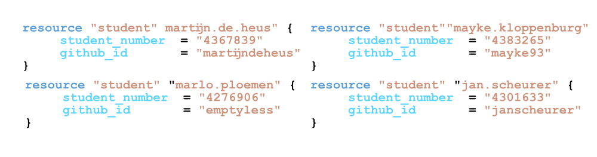
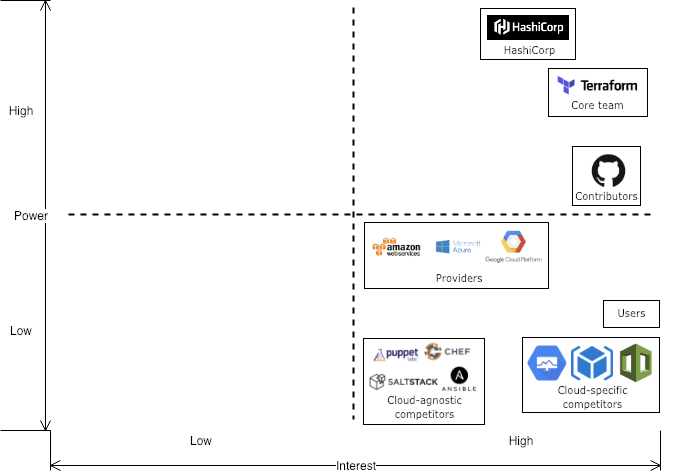
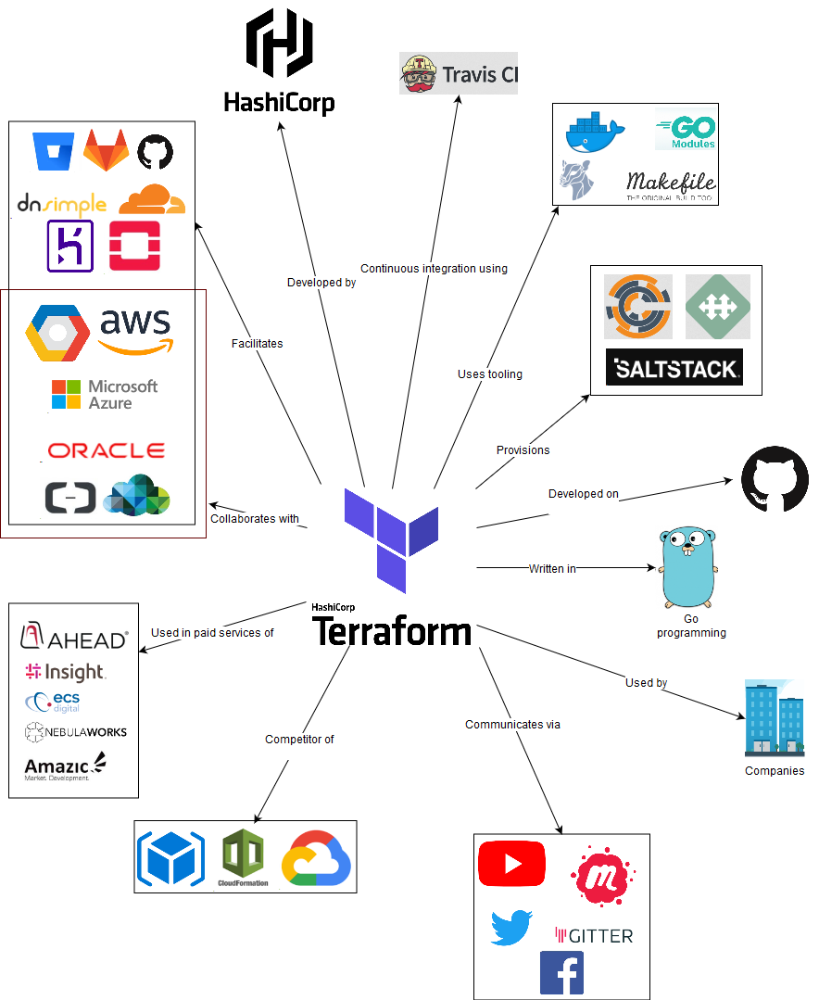
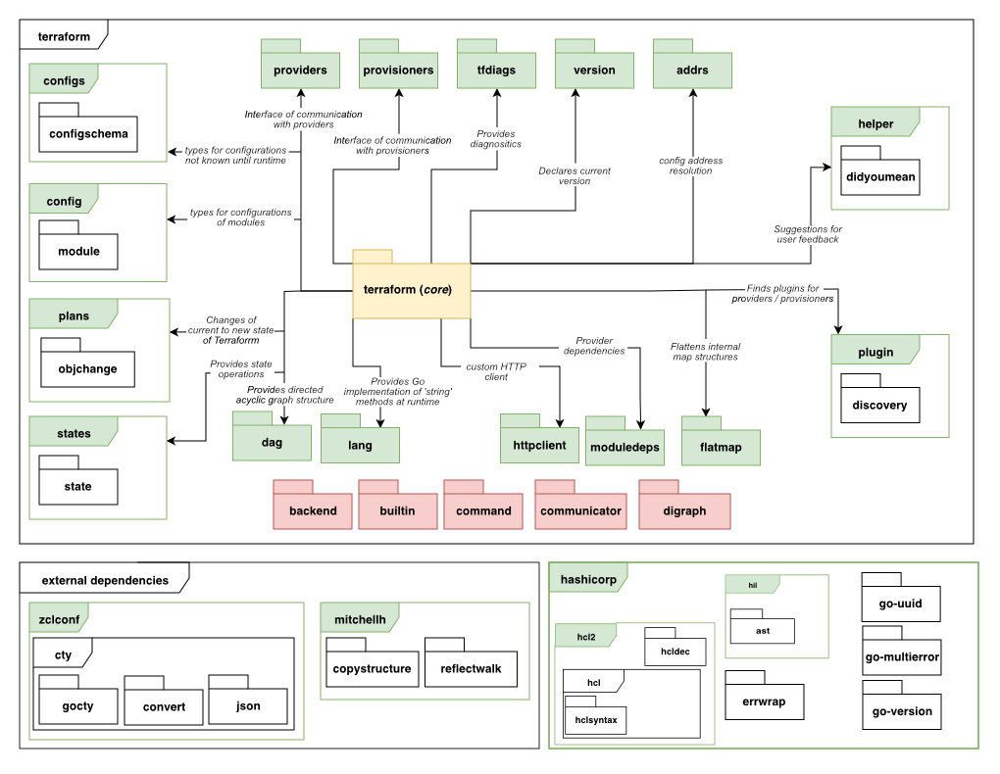
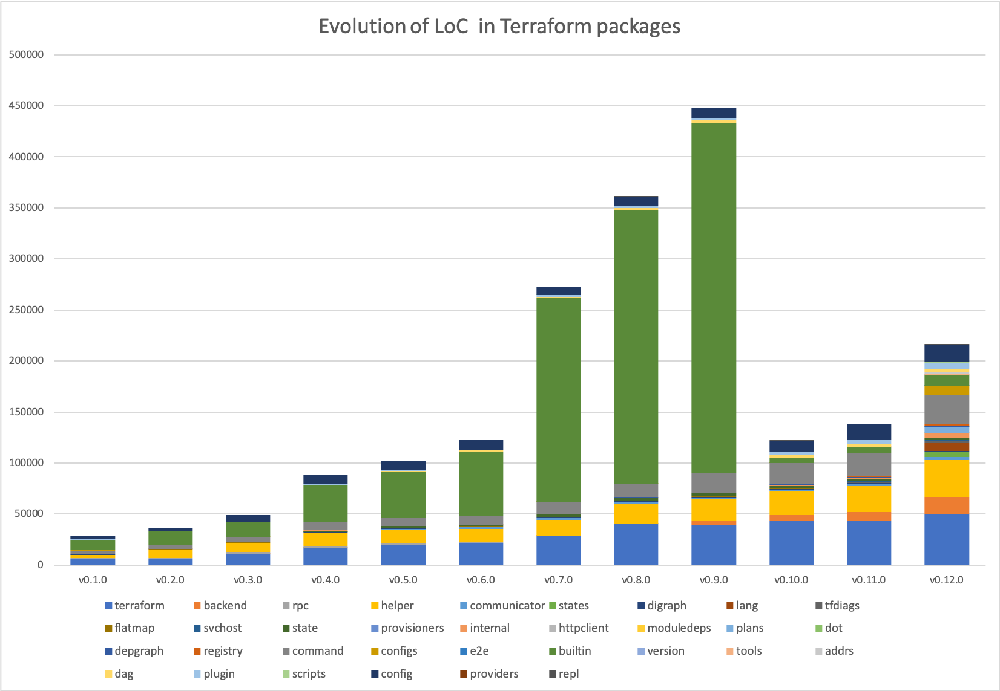
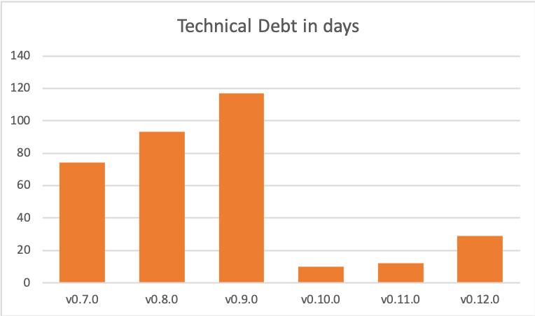

# Terraform

 

*Delft University of Technology*


Terraform is a tool for writing infrastructure as code. It makes it possible to code infrastructure in HCL (Hashicorp Configuration Language) for many different cloud providers. The project itself is open-source and written in Go. The purpose of this report is to provide an overview of the Terraform\'s architecture from different perspectives: stakeholders, context, developers, technical debt and usability.

Terraform was researched by looking for information online, analyzing GitHub pull requests, analyzing code manually, with tools, and doing an interview with a day-to-day user.

The stakeholders and their roles were identified, along with the integrators of Terraform. The context view shows Terraform with all services it facilitates or uses. In the development view the modules of Terraform are outlined and standardized practices are described. Technical debt and its history over different Terraform versions was identified. Lastly, this report looks at the usability of Terraform.

The Terraform project has many strong points and, in our opinion, also some flaws. A strong point is that the project is written with modules providing separation of responsibility. Flaws were mainly found for technical debt department, where good practice is not always adhered to. Another good point of Terraform is that it makes collaborating on infrastructure configurations an easy job.

## Table of Contents

-   [Introduction](#introduction)
-   [Stakeholders](#stakeholders)
-   [Context View](#context-view)
-   [Development view](#development-view)
-   [Technical Debt](#technical-debt)
-   [Usability Perspective](#usability-perspective)
-   [Conclusion](#conclusion)
-   [References](#references)


## Abstract

Back in the days businesses built their IT infrastructure in large air 
conditioned server rooms. Nowadays, there is a much easier option; 
use resources from cloud providers such as Amazon, Microsoft or Google. 
It is no longer necessary to have the hardware in-house and configure 
them manually. We can now even write Infrastructure as 
Code (IaC). Terraform is an open source project that is used for this
purpose. Instead of learning to code one or more cloud specific
languages, Terraform presents the possibility to code infrastructure for
many different cloud providers in HCL. Currently, the stable
version is v0.11.0, but v0.12.0-beta1 is also out.

In this report, the architecture of Terraform will be discussed from
various viewpoints. Firstly, the stakeholders and their interests will
be identified and described. Then, information about Terraform's context
will be given, partly via a model. The development view summarizes interesting
details for developers who want to work with Terraform. Next, 'technical debt' 
will go into several different types of debt and the history of them. Lastly, 
Terraform will be discussed from a usability perspective. Some details will be 
left out of the report to allow the report to focus on the most important 
aspects. These appendices can be found in the appendices folder on GitLab.


Stakeholders
============

Stakeholder identification
--------------------------
Firstly, the stakeholders will be identified. Rozanski and Woods identified 11 classes of stakeholders [^Rozanski]. The table below presents these classes and describes the corresponding stakeholders for the Terraform project. Three classes, which are less interesting, are left out and can be found in appendix A.

|Class    |Stakeholder|Description|
|---------|----------|-----------|
|Acquirers|HashiCorp|HashiCorp is the owner of Terraform. HashiCorp is a company that develops (open-source) software to provision, secure, connect, and run any infrastructure easily [^AboutHashiCorp]. The board of [HashiCorp](https://www.hashicorp.com/about) is responsible for creating their [ToA](https://www.hashicorp.com/tao-of-hashicorp) in which the foundations for their vision, roadmap and product design are presented. HashiCorp also attain ownership of all contributions made to the system through Github by requiring contributors to sign their [CLA](https://cla.hashicorp.com/hashicorp/terraform). |
|Assessors|HashiCorp and core team|Since HashiCorp as a corporation is the publisher of Terraform, the board is likely involved in ensuring legal and regulatory compliance. This has to be done in  collaboration with the core team of Terraform, as they are responsible for day-to-day desicion-making regarding the development.|
|Communicators|Core team and contributors|The core team of Terraform published the [Terraform website](https://github.com/hashicorp/terraform/tree/master/website), including the docs and guides, to their GitHub along with the source code of Terraform. This allows for contributors to help maintain their documentation and even add guides. The core team published [guidelines]( https://github.com/hashicorp/terraform/blob/master/.github/CONTRIBUTING.md#checklists-for-contribution) with the aim to structure the communication on GitHub in order improve efficiency. Companies that offer services which integrate with Terraform also offer communication and training, as an example Microsoft has published a [video series](https://www.hashicorp.com/blog/microsoft-publishes-videos-series-on-hashicorp) on how to use Terraform with Azure.|
|Developers|Core team and contributors|Terraform is developed by [contributors and the core team](https://github.com/hashicorp/terraform/graphs/contributors) in collaboration via their GitHub.|
|Maintainers|Core team|Because HashiCorp offers their products as a service to customers they have a huge stake in maintaining the source code. They will do so independent from open-source contributors, even though they are of course welcome to help.|
|Suppliers|AWS, GCP, Azure, etc.|Terraform is built on suppliers of resources. The main suppliers are the following: Microsoft Azure, Google Cloud Platform and Amazon Web Services. Besides these Terraform can be used with many different [suppliers](https://www.terraform.io/docs/providers/type/community-index.html) ranging from Infrastructure as a Service (e.g. AWS, GCP, Azure) to Platform as a Service (e.g. [Heroku](https://github.com/terraform-providers/terraform-provider-heroku)).|
|Testers|Core team and contributors|HashiCorp requires contributers to write [their own tests](https://github.com/hashicorp/terraform/blob/master/.github/CONTRIBUTING.md#checklists-for-contribution) when they add features with a new pull request, however because many contributions are made by the core team, they can be classified as testers themselves as well.|
|Users|Variety of companies|The system is used by different companies, including: Barclays, ITV and SAP Ariba. Barclays even proudly writes they value acting as customer advisor and contributors to Terraform.|

Additional stakeholder type identification
--------------------------
After looking into the different types of stakeholders identified by Rozanski and Woods, additional stakeholder types which are specific to the Terraform project are identified. These stakeholder types are presented and described in the following table:

|Class|Stakeholder|Description|
|----------------------|------------------------------------|---------------------------------|
|Cloud-specific competitors|AWS Cloud​Formation, Azure Resource Manager, Google Cloud Deployment Manager, etc.|Many suppliers we identified in the previous table offer Infrastructure as Code tooling similar to Terraform specifically for their infrastructure products. This leads to interesting dynamics since these companies now are both suppliers and offer a competing product.|
|Cloud-agnostic competitors|Chef, Puppet, Saltstack, etc.|Even though these products work differently from Terraform (and can even be used together), we still list them since they offer companies different methods to create 'Infrastructure as Code'. The main difference is between Configuration Management (e.g. Terraform and CloudFormation) and Orchestration Management (e.g. Chef, Puppet and Saltstack).|
|Partners|List of [companies](https://www.hashicorp.com/partners)|Different companies partner up with HashiCorp to 'expand their technical skills and go-to-market initiatives around DevOps principles, cloud technologies, and data centre management by leveraging the differentiated offerings of the HashiCorp product suite.' [^AboutHashiCorp]|

Stakeholder identification summary
--------------------------
To sum up the identification of the stakeholders involved in this project we present a table which shows the involved actors and the different roles they fulfil in the project.

|Nr.|Stakeholder|Roles|
|---|---|---|
|1|HashiCorp|Acquires, assessors|
|2|Core team|Communicators, developers, maintainers, support staff, testers|
|3|Contributors|Communicators, developers, testers|
|4|AWS, GCP, Azure, etc.|Suppliers, cloud-specific competitors, partners|
|5|Chef, Puppet, Saltstack, etc.|Cloud-agnostic competitors|
|6|Customers|Users|
|7|HashiCorp customer service|Support staff|
|8|Sysadmin teams (HashiCorp and external)|System administrators|
|9|Production Engineering teams (HashiCorp and external)|Production Engineers|

Stakeholders 1 through 6 will be analysed in the stakeholder analysis. The stakeholders 7 through 9 will be left out since they are not as relevant to the decision-making processes.

Stakeholder interests
--------------------------
In this part the interests of the different stakeholders in Terraform are identified. A table containing the interests per stakeholder can be found in the appendix B.  

The main conclusion is that it is important for HashiCorp and the core team to correctly identify what it is their users want. Different companies (AWS, GCP, Azure, etc. but also Chef, Puppet, etc.) want to work with them and combine their products to create cool solutions. However, HashiCorp needs to focus on what it is their users want and spend their resources on making that happen rather than satisfying these other stakeholders, since that is their own goal. This also aligns with their vision of being cloud agnostic.

Power-interest grid
--------------------------
In the following diagram we show the power and the interest the different stakeholder have in the project.



It can be concluded that HashiCorp and the Terraform team have a lot of power in the project. So even though different stakeholders might put pressure on them to move in their direction, they have enough power to determine their path themselves.

After identifying the interests of the involved organization involved we try to identify people who actually make the day-to-day decisions and look at how they argue their decisions. After this we identify interesting people to contact.

Identifying integrators
--------------------------


Members of the core team of Terraform are also the integrators on the GitHub project. Some of the most active integrators at the moment (March 2019) are the following: [apparentlymart](https://github.com/apparentlymart), [jbardin](https://github.com/jbardin), [radeksimko](https://github.com/radeksimko), [paddycarver](https://github.com/paddycarver), [mitchellh](https://github.com/mitchellh), [catsby](https://github.com/catsby), [stack72](https://github.com/stack72) and [svanharmelen](https://github.com/svanharmelen). Whenever contributors fix an issue or bug they quickly check and confirm that it works and merge the pull request, however when they find a contributor adds a feature that would change workflows or requires decision-making in a different way they add a `thinking` label and comment that this will be discussed in the team. They write a comment mentioning the reasons why this requires further discussion. Reasons often mentioned are the following:

* Usability
* Semantics
* Backward compatibility
* Consistency
* Security
* Proper testing (acceptance tests are mandatory)
* Proper documentation

We can recognize the user-centered approach we identified before in this reasoning.

###### Pull request analysis
To derive a general theory on the way contributions evolve and are discussed, pull request containing important features, long discussion or that were created by Hashicorp themselves were analysed. 

There's notably a strong community, as the bigger part of PRs are finished, tested thoroughly and merged. There are some cases were an author starts working on new features, implements them to the point it is usable for their own use case but neglects to finish it to the point it works in all possible cases, or to adhere to the requested quality standards. Usually however these partial implementations are picked up by someone else in a new branch.

The general flow of a contribution starts with a user already having implemented most of the new functionality. When the architecture is not in line with Terraform, a Hashicorp employee insists on improvements. When cloud provider services do not model nicely to Terraform, authors propose an implementation and the community and Hashicorp discuss the best way to move forward. Acceptance tests and documentation updates are required. The Hashicorp reviewer usually waits before some community members have done their checks, after which they check themselves. There are occasions this takes a really long time, some requests have waited more than 3 months for a review.

Sometimes a small bug is ignored in favour of adding the new functionality, and a new issue is generated for this bug to be solved after merging.


Context View
============

System scope and responsibilities
---------------------------------
Terraform is an open source project by HashiCorp. It is an Infrastructure as Code (IaC) tool; with Terraform it is possible to manage and provision IT infrastructure without having to configure physical hardware. Using IaC, the infrastructure can be managed under version control. This allows comparison of configurations, e.g. for discovering bugs. Aside from version control, it also allows for consistent deployments [^TerraIntro]. 

The responsibilities of Terraform are to describe a certain infrastructure and the desired configurations for it. With Terraform, the user can more easily see which changes were made in the configuration. The program knows what has changed and can create incremental execution plans [^TerraIntro].


Context model
-------------




The figure shows a context model of entities Terraform deals with in some way. A short explanation will be given for the less trivial relations [^HashiPartner] [^TerraGithub]:

* **Development:** Terraform is developed by Hashicorp, an IT-infrastructure company. Collaboration and version control are handled via Github, where the code of the project (95% Golang) is stored.
* **Communication:** Developers of Terraform use Gitter to communicate. Furthermore, there is communication via Facebook, Twitter and YouTube videos. Terraform also uses MeetUp for groups in various countries.
* **Provision:** Terraform helps creating and managing infrastructure, and also in provisioning during creation or deletion of resources.  Provisioners, such as chef, are used to execute scripts (locally or remotely) as a part of resource creation or destruction.
* **Facilitation:** Terraform facilitates many providers such as DNSimple, AWS etc. These are generally Infrastructure, Platform or Software as a Service. The providers in the model a just a few of the many that Terraform facilitates.
* **Collaboration:** HashiCorp closely collaborates with its cloud partners to ensure Terraform works well with these platforms. 
* **Paid services (resellers):** Companies like AHEAD use terraform in services they provide to their customers.
* **Competition:** Interestingly, some of Terraforms partners also have their own Infrastructure as Code services. AWS Cloud Formation, Azure Resource Manager, Google Cloud Deployment Manager offer IaC tooling similar to Terraform. These tools only support their own platform, whereas Terraform is cloud agnostic.


Development view
================
The development view describes the system in such a way that stakeholders who build, test, maintain or enhance the system are supported [^Rozanski]. Below the development view is subdivided into the module composition describing the different modules and their relation to the core, the state of the system, testing methods and the standardized practices of contributing. 

Module composition
------------------

Terraform is written in Go, where package management by convention is done using a directory structure. Hence, for the following paragraph the top level directories will be denoted as 'modules' while their subdirectories will be denoted as 'packages'. This will make it easier to understand the module organisation of Terraform. 

To give a high-level overview of the module organisation, it was oriented around the `terraform/terraform` module, which is often denoted as the core. This provides insight in how the core module links the other modules and packages to provide the Terraform functionality. In the figure below, there are a few modules not directly used by the core package; these modules are coloured red.



Below follows a brief summary of each module, this can be a summary of the `doc.go` that is inside each module or an analysis of the code with respect to the `terraform/terraform` package:

- **terraform (core)**: The core package contains the classes related to the graph traversal (the directed acyclic graph 'roadmap' of Terraform for applying the infrastructure changes to a provider), the different types of nodes that the graph can contain, transforms, user interface logic and evaluations that nodes can perform. These classes combined perform the core logic of Terraform's goal to manage infrastructure. 
- **providers / provisioners**: The providers/provisioners module provides an interface of communication to a provider or provisioner during evaluation of nodes in the graph traversal. 
- **tfdiags**: Diagnostics module of terraform. Packages can use this module to generate lists of diagnostics which can inform the user of warnings and errors that might occur. 
- **version**: Module containing SemVer information
- **addrs**: Module that exposes types that can link to a terraform state or configuration object.
- **helper**: Directory of high-level helper packages for Terraform. Described as the "Terraform standard library" [^TerraformHelper]
- **plugin**: Module that is responsible for downloading, installing and discovering locally installed plugins for providers and provisioners.
- **dag**: Module containing the direct acyclic graphs used in the graph traversal.
- **lang**: Module that contains the Go implementation for functions that can be used in the Terraform configuration syntax (e.g. "tomap").
- **plans**: Module that represents the changes that Terraform 'plans' from the previous state and the configuration files. 
- **httpclient**: Module that provides a http client with additional configuration such as the Terraform user-agent string. 
- **moduledeps**:  Module that exposes types that represent dependencies of a provider or configuration.
- **flatmap**: Module that flattens internal maps.
- **states**: Module that handles state operations and types.
- **config / configs**: Modules responsible for reading the terraform configurations written by the user.

Other modules not directly linked to the terraform core package are: 

- **backend**: Module that handles storing the state of Terraform to either local or remote storage. 
- **builtin**: Built in provisioners and providers.
- **command**: Module that exposes commands that can be executed (e.g. using CLI)
- **communicator**: Module that exports interface of communication for provisioners.
- **digraph**: Module that exports basic structures for creating directed graphs.

Other (external) entities used by Terraform are: 

- **zclconf**: A module that provides a dynamic type system for Go primarily for configuration languages [^GoCty]
- **mitchellh**: Github user that exports two Go modules: copystructure [^Copystructure] and reflectwalk [^Reflectwalk]. Copystructure deep copies values while reflectwalk allows manipulations on unknown structures.
- **hcl2**:  toolkit for writing structured configuration languages [^Hcl2]
- **hil**: Module for configuration interpolation originally written in Terraform but extracted as a general purpose module [^Hil]

Providers / Provisioners
-------------------------

The providers and provisioners mechanism is an interesting component to highlight. During the graph traversal Terraform only sees the interface that all providers / provisioners should conform to. The providers start a gRPC server which is compliant with the protobuf files in `internal/tfplugin5`. This creates an 'airgap' between the actual provider (e.g. AWS, Azure, etc..). 

State
----------------------

Terraform stores it's state in a `.tfstate`. Access to the state file is managed through the `statemgr` (state manager). Schemas of the state are stored in the `terraform/states` package. Writing, reading and migrating the actual state file itself is done using the `terraform/states/statefile` package. 

Testing and Static Analysis
----------------------
Terraform uses (by Go convention) files with `*_test.go` to denote tests. Additional data used in the tests are stored in `fixture/*` directories. There is also one package related to `e2e` testing which is conveniently called `e2e`. 

#### Static Analysis

The terraform repository code formatting is analysed using `gofmt`. This is integrated in the `Makefile` and checked before running any tests.

#### CI/CD

Travis is used for CI/CD. It uses the `Makefile` and checks if the formatting is correct (prerequisite of `make test`), runs the unit tests and runs the e2e tests. After all tests have completed a `go build` job is executed to test if a binary can be created.

Standardized practices
----------------------

There are a few guidelines for contributing to Terraform, described on their GitHub page. First of all, one must sign the CLA. Furthermore the community guidelines must be adhered. These cover being respectful in communication, harassment policy and incident handling. Hashicorp remains the right to perform punitive actions. 

In contributing to Terraform, the community emphasizes that any sort of contribution is appreciated, the worst that can happen is that you'll politely be asked to change something. A description of what is expected in a feature request, new issue or new pull request is provided. Also a checklist has been put together for contributions per type of contribution (Documentation update, enhancement / bug fix to a resource or provider, a new resource or a new provider). Adhering to this list helps in achieving quick merges.
Finally acceptance tests are required for each new or updated feature.
All of this is described in detail, including all descriptions and checklist, in appendix C. 

Technical Debt
==============

To analyse Terraform's technical debt, SonarQube, BetterCodeHub and an analysis tool of the GoLand IDE were used. More information on the results of the tools can be found in appendix D.

Types of Technical Debt
-----------------------

There are several types of technical debt, for example: code debt, testing debt, defect debt and documentation debt. It was decided to discuss code debt and testing debt, since documentation debt and defect debt are scarce in the project.

#### Code Debt

According to SonarQube, Terraform v0.12.0-beta1 has 1.4k code smells and v.0.11.0 has 507. The large amount of code smells is bad; it means maintaining the code will be harder than it should be and additions to de code can lead to new errors in the code. The code debt expressed in number of days to fix it, is 29 days for the beta version and 12 days for v0.11.0. The technical debt for v0.12.0 is a lot and they should reduce this before making an official release.

BetterCodeHub found a fair amount of classes do not have short units of code written in them. The Lines-of-Code (LoC) count for functions of the worst offenders ranges between 111 and 193. The tool also checked how simple units of code were. The results were bad, manual checks in the code revealed extremely long functions filled with many if-statements. The two worst functions have over 130 LoC and over 30 branches.
As was also seen in the SonarQube analysis, the code also has some duplication. Several classes have between 13 and 18 LoC duplicated. 
Lastly, unit interfaces were not kept small, the worst functions had 5 parameters. 

##### SOLID
The code was also checked manually to see if there are violations of the SOLID design principle. Since the project is so large, we focused on the terraform core package. The *single responsibility* principle was met. For example, the package structure is very extensive; this is because all different responsibilities are split over different packages. We also saw various structures that had very specific tasks such as 'destroy edge'. The *open-closed principle* was met in certain instances. A good example is the refactoring of the providers/provisioners in which they removed much duplicate code and replaced it with a plugin system containing an interface. This is open for extension but closed for modification. However, in other structures we saw many complicated switch and if-structures, which can be an indicator of bad design according to this principle. We found that, concerning the *dependency inversion principle*, Terraform does quite well. They have interfaces all subtypes must comply with.


#### Testing Debt
SonarQube gave a test coverage of 59.8% on the current master branch. However, these numbers do not accurately reflect how well the system is tested, because Terraform uses a unique testing system, some packages were left out as the SonarGo could not process these results. When manually looking at the code, it can be estimated the coverage is a lot higher.
Terraform has unit tests for most structures and an end-to-end test structure that takes commands. There has been quite extensive testing and many test fixtures were written. We did find 25 functions with a testing TODO in the core package. These were all in their evaluate modules.

Discussion about Technical Debt
-------------------------------

With GoLand's TODO utility, the code was checked for remarks in comments that indicate code needs to be refactored or iterated upon. The terraform/terraform package had the most markers: 61. As of 17-3-19, the code has 157 open TODOS.
The developers communicate in pull requests on GitHub as well. When examining some pull request, no direct mention to technical debt was found. However, many pull requests do relate to fixing bugs, testing or code improvements. 


Historical Analysis Technical Debt
----------------------------------

The history of the technical debt will be discussed by going into the evolution of Terraform's modules and the evolution of technical debt.

#### Evolution of Modules
Terraform is split into modules according to Go conventions. We looked at both the evolution of the LoC and of the file count. The metrics showed exactly the same trends, so it was decided to include the figure of the evolution of the LoC shown below.



The evolution of software components can be described using astronomical terminology as described in the paper written by [^lanza2002understanding]. The evolution of a few modules will be described in more detail using this methodology:

* **digraph**: this is a typical example of an *idle* module with good design. The module has not been touched since v0.2.0 while still being used in the project.
* **command**: this handles the commands which Terraform can execute. As Terraform grows in functionality this module grows. This module has been growing since v0.1.0. This means it classifies as a *red giant* and might need to be refactored at some point.
* **builtin**: this module could first be seen as a *red giant* until the refactoring in v0.10.0. However, after this big refactoring the class is growing in size. Which means we can classify this module as *pulsar*. 
* **state**: this is another example of a *pulsar* module as its size has been varying since the launch of Terraform. An argument can be made to classify this as a *white dwarf* since it has been slowly shrinking since v0.8.0
* **configs**: this module has remained constant (as an idle, or even sleeper, module) from v0.1.0 to v0.11.0, however due to the refactoring and launching of the plugin system this module suddenly exploded to contain many more configurations. Therefor this can be classified as a *supernova*.

#### Evolution of Technical Debt
We combine this data with the metrics we gathered by using SonarQube for different releases. The diagram below shows the technical debt in days of work over the last few releases. It was not possible to run SonarQube for versions before v0.7.0 as dependencies were no longer available.



In version v0.9.0, 1925 of the 2045 code block duplications are in the terraform/builtin/providers package. This package was moved to github.com/terraform-providers in v0.10.0 and in v0.12.0 moved to the new plugin system. This also accounts for 109d of the debt and therefore greatly decreases the technical debt. They did introduce some technical debt in this migration by postponing the implementation of the plugin system to v0.12.0 instead of directly implementing this. The introduction of many new modules over the last couple of versions is a promising sign that the core team tries to manage technical debt as the system grows larger.


Usability Perspective 
=====================
In this chapter the usability of Terraform will be discussed. In order to gain insights in how users experience working we Terraform the team interviewed an enthusiastic developer who recently introduced his company to Terraform and is working with it in a professional environment.

User Interaction 
----------------
User interaction is an important part of the usability of the software. Great software can have a very non-intuitive user interface and therefore be of no good to anyone. In this section, the interface of terraform is analysed. Terraform uses a command line interface, which will be described below.

#### Command Line Interface
Terraform is used via a CLI. This CLI should be installed and can be executed in any directory containing `*.tf` (Terraform configuration) files. The commands contain a synopsis which can be found by executing `terraform` or `terraform --help`. Every command also contains a larger documentation using `terraform <command> --help`, which will output a larger summary and possible arguments that can be supplied to the command. 

The most common commands to use are `terraform init` (which initializes a new or existing directory), `terraform plan` (which generates an execution plan for later use) and `terraform apply` (which applies the current configuration to a provider).

Learnability
----------------
How easy is it to learn Terraform? That depends on what would be considered 'learning Terraform'. According to the interviewee, learning to write Terraform's configuration language is not that difficult. However, one could also consider learning about infrastructure and cloud services of specific providers as part of learning Terraform. Including this makes the learning curve steeper. Infrastructure can become very complicated, especially as it gets larger. Cloud services of specific providers can be very complex, and working with Terraform to create infrastructure on them does require knowledge of how they work. Also infrastructure coded with Terraform for provider x, is not interchangeable with code for similar infrastructure on provider y.

Effectiveness
-------------
The goal of Terraform is to provide an easy, cloud-agnostic way to write infrastructure as code (IaC). This allows infrastructure to be managed and deployed more consistently and allows for faster provisioning of resources. Also, software development best practice (e.g. use of Git) can be applied to infrastructure and its development can be viewed over time. These benefits will differ between companies, e.g. companies which have to spin up the same infrastructure in different situations (for example to create systems for their clients) will experience way bigger advantages compared to a company which just has to host their relatively simple webserver. 

#### Migration to Terraform
Migrating to Terraform requires at least some employees in an organization to familiarize themselves with the tool as well as with IaC as a concept. In the previous paragraph it was concluded that it is not necessarily very difficult to learn how to use Terraform, however this does take up time which might not be available. Our interviewee estimated this process to take up to a week, however he did have a lot of experience with infrastructure. If having no experience with infrastructure or infrastructure is not an important part of a company, learning Terraform may not be a good investment. After learning the tool existing infrastructure can be imported easily, and the tool is quickly setup.

#### Overhead in using Terraform
Because Terraform allows infrastructure as code, the infrastructure is often managed under version control. A branch structure and pull requests are often used to collaborate. Along with the benefits this has, it also introduces some overhead to create all the documentation around the code and changes to the code. Besides this Terraform does not provide any real overhead.

#### Reliability of Terraform
A major concern in the decision to use Terraform is the reliability of the tool. A created configuration can be applied many times in exactly the same manner, which is a reliable feature. However, a reliability risk of Terraform is a state called drift, which is a term for when the real-world state of the infrastructures differs from the configuration. This cannot be detected automatically, and must be fixed by manually updating the configuration or infrastructure. Being aware of this responsibility is important when working with any IaC tool.

Furthermore, Terraform is still quite young: a v1 has not yet been released, and new features are being added frequently. On the other hand, some big corporations are already using Terraform in large projects so some battle testing has been done.


Collaboration
----------------
One of the biggest selling points of Terraform is being able to work on an infrastructure configuration via version control with a team of people. This can be done rather easily, as long as the state is stored remotely. A local state makes collaborating hard, as it should be checked into and pulled from version control with each change.

The interviewee explained that currently their CI/CD pipeline is in development. At the moment they do code review via PRs on GitHub, and once merged manually apply the configuration. Automatic unit testing could be done using [TerraTest](https://github.com/gruntwork-io/terratest).

#### Contribute to existing projects
Joining in development of an existing Terraform should not be hard, as long as the configuration has been set up modularly. This means certain blocks of responsibility in the infrastructure configuration have been separated. The Terraform files are self-explanatory for the most part, assuming knowledge of the syntax and the way cloud infrastructure is orchestrated.

Terraform supplies a `graph` command, which combined with for example [GraphViz](http://www.graphviz.org/)'s `dot` command can be used to draw a diagram of the Terraform resources according to the configuration files in the current directory. This visualization can help in getting a feeling for the existing configuration.

```bash
$ terraform graph | dot -Tsvg > graph.svg
```

Conclusion
==========

Terraform is an interesting Infrastructure-as-Code project with many benefits, e.g. version control in IT infrastructure management. With the availability of many cloud services, this type of software can become very important in the future. 

We identified the stakeholders and concluded the power lies mainly at HashiCorp and the Terraform core team. Providers, such as Amazon and Azure, can have an interest, and a fair amount of power. For example, if an API for a service is not made public yet, Terraform may not be able to call it. We denoted this as them being on the high side of low power, as this is more of an indirect influence. 

In the second chapter, we looked at Terraform in its context. It is written in Go language and uses Fossa and Travis CI for continuous integration. We saw it is not only used by companies for their infrastructure, but also by resellers who teach Terraform or configure infrastructure for companies. Terraform collaborates with various cloud providers and facilitates a few more. It also competes with a few, like CloudFormation by Amazon. However, it is not real competition as such; these cloud providers will still make money when people use their resources with Terraform.

In the development view, we looked at interesting details for developers wanting to work with Terraform. The module structure of Terraform is mostly oriented around the terraform core package. Among these packages are the provisioners/providers, tfdiags (diagnostics) and plugin. In addition to this, it has packages like the backend (stores Terraform state) that are not directly linked. Lastly, Terraform has a few external dependencies such as Hcl2, a toolkit for writing structured configuration languages. We also looked at guidelines for contributing to Terraform. The developer must sign the CLA and adhere to the community guidelines. Acceptance tests are required for each new or updated feature.

Looking into Terraform's technical debt, we found much duplicate code and many code smells. The technical debt is 29 days for the beta version and 12 for v.0.11.0. It also has very long functions with many if-statements. The testing debt seemed great, but the tools did not accurately reflect all the tests. Looking through them manually, there has been quite extensive testing. An interesting discovery we made in the history of technical debt was that v0.10.0 suddenly had a drastic decrease in technical debt (> 100 days). This was because Terraform moved to a new plugin system, but it is debatable whether this is a true decrease.

Lastly, we introduce a usability perspective. We looked at what Terraform's UI is like; it uses a command line interface. Terraform appears quite easy to learn. However, it does require knowledge about infrastructure and cloud services, which makes it more difficult. Terraform can be effective as it allows for version control and faster provisioning of resources. A reliability risk of terraform is a state called drift; when the real-world infrastructure differs from the configuration. This cannot be detected automatically and must be fixed manually. A benefit of Terraform is cooperating on infrastructure via version control. This is easy when the state is stored remotely, a local state makes this almost impossible.


References
==========


[^Rozanski]: Rozanski, Nick, and Eoin Woods. 2011. Software Systems Architecture: Working with Stakeholders Using Viewpoints and Perspectives. 2nd ed. Addison-Wesley Professional.
[^AboutHashiCorp]: HashiCorp. “About Hashicorp.” 2018. https://www.hashicorp.com/.
[^TerraIntro]: HashiCorp. “Terraform Introduction.” 2018. https://www.terraform.io/i ntro/index.html.
[^HashiPartner]: HashiCorp. “HashiCorp Partners.” 2019. https://www.hashicorp.com/ partners.
[^TerraGithub]: HashiCorp. “Terraform Github.” 2019. https://github.com/hashicorp/t erraform.
[^TerraformHelper]: mitchellh. “README.md - Terraform/Helper.” 2019. https://raw.gith ubusercontent.com/hashicorp/terraform/master/helper/README.md.
[^Hil]: HashiCorp. 2019b. “Hashicorp/Hil.” 2019. https://github.com/hashicorp/hil.
[^GoCty]: Atkins, Martin. 2019. “Zclconf/Go-Cty.” 2019. https://github.com/zclconf/go-cty.
[^Reflectwalk]: mitchellh. “Mitchellh/Reflectwalk.” 2019. https://github.com/mitchellh /ref lectwalk.
[^Hcl2]: HashiCorp. 2019. “Hashicorp/Hcl2.” 2019. https://github.com/hashicorp/hcl2.
[^lanza2002understanding]: Lanza, Michele, and Stéphane Ducasse.  “Understanding Software Evolution Using a Combination of Software Visualization and Software Metrics.” Springer Verlag, 2002.
[^Copystructure]: mitchellh. “Mitchellh/Copystructure.” 2019. https://github.com/mitch ellh/copystructure.

