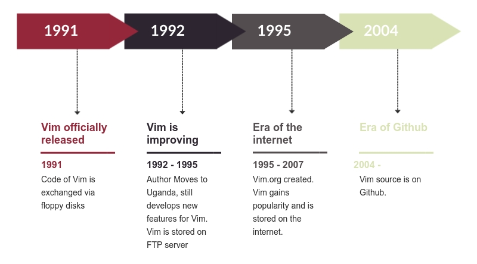

# Vim

Vim is a text editor most commonly used by system administrators who use it as a command line tool to edit scripts, texts and code. Vim is highly customizable with multiple shortcuts and commands available. It is this flexibility that has built its popularity but also the fact that Vim is open source and therefore users have a big say in the development of the product. Vim was originally created by Bram Moolenaar in an attempt to recreate an editor he had  previously used, VI, and hence the name was born, "VI Improved", what became Vim in short. The first release of Vim was in November 1991 making it older than most students in this course. Vim quickly established itself as a stable and reliable editor and became the editor-of-choice for system administrators. Despite the arrival of commercial editors such as Microsoft VS, Notepad++ and many others, Vim still remains popular, especially with the aforementioned system administrators. Bram still remains the main developer of Vim and due to a broad and active community of developers, updates are still common with around 30 commits per week on average and a lively mail list discussing potential changes and improvements.

## Table of content

1. Stakeholder analysis  
1.1 Core developers  
1.2 Other developers  
1.3 Communicators  
1.4 Communities  
1.5 Competitors  
1.6 Managing stakeholders
2. Context view  
2.1 System scope and responsibilities  
2.2 Context model
3. Merge decision strategy  
3.1 Criteria for pull requests to be analyzed   
3.2 Information obtained from pull requests  
3.3 Theory about the merge decision strategy  
4. Development view  
4.1  Module structure model  
4.2 Common design model  
4.3 Codeline model  
5. Technical debt  
5.1 Organisational debt  
5.2  Bus factor  
5.3 Automated analysis  
5.4 Conclusion
6. Evolution perspective  
6.1 History of Vim  
6.2 Evolution of Vim
7. Conclusion  

## 1. Stakeholder analysis

A stakeholder in the architecture of a system is an individual, team, organization, or classes thereof, having an interest in the realization of the system [1]. This paragraph describes the different stakeholders in the Vim project. The types of stakeholders are based on types defined in the book of Rozanski and Woods [1]. Next to those types, three more types of stakeholders have been defined, namely integrator, sponors and eco-system enhancers.

### 1.1 Core developers

#### Bram Moolenaar (@brammool)
Stakeholder type: **Acquirer, Developer, Maintainer, Production engineer, Communicator, Integrator**  
Bram is the author of the open-source project Vim and is actively updating the runtime files for maintenance purposes. The authorship defined him as the acquirer of this project. More importantly, he is in charge of adding bug fixes over OS compatibility, platform compatibility and functional inconsistencies, thus he serve as the maintainer as well. This developer also decides the future roadmap of the development of Vim. Bram is the integrator, meaning he is the one who in the end decides to merge a pull request (PR) with the master branche [2].

#### Henk Elbers, Eric Fischer, Dany St-Amant, Roger Knobbe	& more
Stakeholder type: **Developers, Maintainers, Production engineers**  
This [list of authors](http://vimdoc.sourceforge.net/htmldoc/intro.html) (non-exhaustive) lists authors that are production engineers and developers that help porting Vim from a single platform to Windows, Mac OS and various other operating platforms [3].

### 1.2 Other developers

#### K. Takata & Christian Brabandt (@k-takata, @chrisbra)
Stakeholder type: **Assessors, Testers, Developers, Production Engineers, contact person**  
K. Takata and Christian Brabandt are reviewers for potential merge requests that add functions to Vim or attempt to fix bugs, thus defined as assessors. They are also members of Vim repository and Vim Github base. They are also the contact person for user-oriented and developer-oriented queries.

#### Enno (@konfekt)
Stakeholder type: **Developer, Tester, Contributor**  
Enno developed several plugins for Vim and is actively contributing to the core Vim repository by proposing new features and bug fixes, thus named as testers and contributor.

#### Dominique Pelle (@dpelle)
Stakeholder type: **Developer, Assessor, Contributor**  
Dominique actively contributes to the main Vim codebase by reviewing pull requests, proposing new features and bug fixes and producing [valgrind](http://vimdoc.sourceforge.net/htmldoc/debug.html#valgrind) reports for Vim [4].

### 1.3 Communicators

#### Dan Sharp and Stefan 'Sec' Zehl
Stakeholder type: **Communicators**  
Dan is the active maintainer of the official [Vim documentation](http://vimdoc.sourceforge.net) on Sourceforge. Stefan is the maintainer of the [official website](https://www.vim.org/) of Vim open-source project.

### 1.4 Communities

Vim users, developers and sponsors formed various Vim communities that actively contribute to both the administrative and program development of the Vim project.

#### Vim Github Repository members
Stakeholder type: **Support Staff, Developers, Maintainers**  
The Vim Github Repository is very active with around 30 posts per day. Github Repository members are users that comment on issues, PRs and assist each other with issues and problems that come up. The same persons also propose new features and submit PRs for other members to evaluate.

#### Vim Plugin Developers
Stakeholder type: **Eco-system enhancer**  
Vim Eco-system enhancers are a group of programmers who actively develop and maintain Vim plugins. A plethora of Vim plugins has been created allowing users to customize their own Vim experience. Some of those plugin developers are also involved in the development of Vim itself, but all of them depend on the Vim source code being stable and error free.

#### Sponsors
Stakeholder type: **Sponsor**  
Sponsors ([list of Vim sponsor here](https://www.vim.org/sponsor/hall_of_honour.php)) are a group of donators who financially support Vim's development by donation and they are crucial for the project [5], all the money donated goes to a [charity](http://vimdoc.sourceforge.net/htmldoc/uganda.html) which has been selected by Bram personally and donations increase his and others' motivation to continue their efforts on Vim [6].

#### Vim users
Stakeholder type: **User, Tester (if applicable), System Administrator**  
Vim users use Vim and its components from basic word processing, development operation, software development and administrations. Vim has a [relatively large marketshare](https://insights.stackoverflow.com/survey/2018/#technology-most-loved-dreaded-and-wanted-platforms) in developer communities and integrated development environment market. Vim constitutes diverse user types, ranging from students and code learners with a relatively higher learning curve due to the non-graphical user interface and keyboard shortcuts. Expert users are adjusted and acquainted with the editing and programming style based on their adaptation to the Vim editor.

#### Google help group
Stakeholder type: **Support Staff**  
A google help group is a collection of users and their discussions on Vim-related issues. Users are encouraged to ask for help in a Google group. The Google group consists of several mailing lists, of which one is specifically for discussion on the current development of Vim. Several of the individuals mentioned earlier are present and active in that group, however so are other individuals who have not been mentioned and therefore this is considered its own group of stakeholders.

### 1.5 Competitors
Vim competitors are every text editor or IDE, including Atom, gedit, notepad++ and VS code. However, the main competitors of Vim are the ones in the same niche - command-line text editors including EMACS and Nano:
* MACS is an extensible, customizable text editor. At its core, Emacs is a Lisp interpreter that just so happens to support text editing. However, it includes a bunch of plugins that greatly extend its functionality.
* Nano is a text editor for Unix-like computing systems or operating environments using a command line interface. It is licensed under the GNU General Public License (GPL), thus it is very popular to use in command-line.

### 1.6 Managing stakeholders

In each project stakeholders have to be managed. To get an overview of the power and interest each stakeholder has on the realization of Vim a Power-Interest grid can be found in figure 1.


Figure 1. Power-Interest diagram for Vim project

The integrator, developers, communicators and GitHub repository members all have very high interest in the realization of Vim. However, there is only one integrator and thus he has the highest amount of power. The individual developers also have a very high amount of power, but lower than the integrator. The less active developers, represented by the GitHub repository members, have less power than the active developers. The communicators have almost no power on the realization of Vim, but do have some power since they communicate version release, updates about the development of Vim, etc. The Google help group has a lot of power, because PRs are discussed here before they are made on GitHub and the Google help group consist of highly involved developers and thus it has high interest in the realization of Vim.

The plugin developers do not have direct power on the realization of Vim, but also do have some power as plugins positively influence Vim competitive position. The competitors have more power than the plugin developers, because they can influence the market share of Vim and competitor’s developments can incite Vim’s developers to alter Vim. Competitors need to be monitored and plugin developers need to be kept informed, as they might need to alter the code of their plugins if Vim’s code changes.

Sponsors donate money to Vim, which eventually goes to a charity. They donate money to stimulate the realization of Vim and are thus interested in the system. Since the donations motivate the (core) developers, they have some power as well.

Users have almost no power in the realization of Vim, but users stimulate the developers to work on Vim and thus have a little power. Users do have I high interest though, because they depend on Vim.

## 2. Context view

In this paragraph we are going to describe relationships, dependencies, and interactions between the system (Vim project), its environment and the ecosystem in general. Firstly, the system scope is described, followed by the context model scheme and a detailed explanation of relationships with external entities.

### 2.1 System scope and responsibilities

Vim is known as a stable editor and it is continuously developed as an open-source project. Its prominent features are listed below:
* persistent, multi-level undo tree
* extensive plugin platform
* support for diverse programming languages and file formats
* powerful search and replace features
* integrates with many tools and platforms

### 2.2 Context model

Figure 2 graphically displays the context view. The different components of the context view are explained below.


Figure 2. Context view for Vim project

#### Support platform

As a text editor that has such a long history, Vim contains an extensive support platform. Most of the documentation and learning material can be found in [vimdoc](http://vimdoc.sourceforge.net/) and on the [vim homepage](https://www.vim.org/). However, information can also be found on Sourceforge, StackExchange, Github and even in books.

#### Scripts composition
The Vim project is build with a diverse array of scripting and programming languages. The main coding languages are Vim scripts and the C programming language, and the rest is supported by ROFF, Makefile and C++.

#### Managing platform
Vim is managed on three code repository platforms: Github, Sourceforge and Bitbucket. Github is used as a main platform as it also provides issue tracking and is popular in the developer community [7]. Bitbucket repository is used as a back-up repository and for those who prefer Bitbucket over Github.

#### Build & test platform
Vim uses Travis CI and AppVeyor as continuous integration tools (different ones for different platforms). It also uses different tools that help to ensure code quality such as CodeCov, Synopsis and Lgtm. The testing platforms are integrated into Github workflow and test the code continuously and automatically.

#### Operating platforms
Vim is originally written for text editing purposes in the Amiga operating system. With the increasing adoption and population of the tool, Vim has been ported to Windows, MsDos, Mac OS, OS/2 and Unix platforms. Additionally, Vim is available to use even on mobile operating systems including iOS and Android. Operating system is an external entity since it is the environment for Vim to build, install and run.

#### Software dependencies
Vim is composed mainly in C and Vim script, thus there are basic dependencies that need to be implemented to ensure the operating stability of Vim editor. On the other hand, some advanced features of Vim require other dependencies to be implemented to support their functionality. Dependencies are external entity since it provides support and compatibility service to Vim users. Table 1 provides a list of dependencies required or optional for Vim.

Dependency name | Description | Required or optional
------------ | ------------- | -------------
Glibc | A standard library for the allocation of C-programming language to ensure Vim's compatibility with hardware devices | Required
gpm | A mouse server for the command-line environment | Required
libffi | A portable foreign function interface library to reduce time for calling natively compiled functions | Required
acl | An access control list utilities, libraries and headers | Required
libgcrypt | A general cryptographic library based on GnuPG code | Required
pcre | A library to implement Perl-style regular expressions | Required
zlib | A compression library that implements deflate compression methods found in gzip | Required
gtk3 | A GObject-based cross-platform graphic user interface toolkit | Optional
lua | A powerful light-weight programming and scripting language designed for application extension | Optional
python | A high-level scripting and programming language to support advanced Vim functionalities | Optional
ruby | An object-oriented programming and scripting language for fast and intuitive code development | Optional
tcl | A high-level, general-purpose scripting language | Optional

Table 1. List of dependencies for Vim

#### Plugins and extensions

Vim can be extended by extensions and plugins created externally by people who are not in Vim's development team. These extensions and plugins enhance, add or alter Vim's ability to edit, code, compile and organize files. These extensions include Vim-plug, SpaceVim, NeoBundle and more.

#### Adopters

Vim has been adopted by many companies and organizations due to its popularity in the development circle. Adopters use Vim to edit, compile or organize their coding and ext-based files, and promote the tool to internal employees and managerial staff. The adopters include Lyft, Starbucks, CircleCI and more. Adopters are an external entity since it provides information data and user feedbacks to the developers.

## 3. Merge decision strategy

To get an insight into when pull requests (PRs) are accepted or rejected, multiple PRs have been analyzed. Based on this insight, a theory about the merge decision strategy has been formed.

### 3.1 Criteria for pull requests to be analyzed

The PRs that have been chosen to be analyzed are relatively new, as they are all proposed in the last two months. Vim has been around for a long time and since we are interested in the current merge decision strategy it has been decided to look at relatively new PRs. Other criteria to decide whether a PR would be analyzed and included is the amount of comments on the PR and the amount of new information about the merge decision strategy it would offer. To get a complete picture about the merge decision strategy, approximately the same amount of accepted and rejected pull request have been analyzed.

### 3.2 Information obtained from pull requests

Often a PR gets accepted by Bram, the integrator, without any explanation and sometimes he comments "Thanks, I'll include it". In a second situation multiple people have a discussion about the PR and decide either that it can be merged or that the proposer has to alter the PR or someone else has to offer an alternative PR, and then it can be included. Sometimes Bram is included in those discussions and sometimes he isn't.  In a third situation Bram himself is not certain on whether to merge the PR and asks others to comment on the quality of the PR. The fourth possibility for a PR to be accepted is when a PR is proposed and Bram himself makes an alteration to the PR and includes that.

Of the closed PRs, not a lot are rejected. They might get rejected at first, but if the mentioned alterations are made, it will be merged. If a PR is rejected, often a discussion between multiple people has taken place. In other situations, someone other than Bram comments on a PR and the proposer agrees with the comment and thus closes the PR himself without it being merged. In one situation Bram commented on a PR that he did not see any added value in merging the PR and thus he did not do so.

One of the mailing lists used is specifically for discussion about the current development of Vim, therefore often a lot of discussion takes place before a PR is made. This might be a reason why a lot of PRs get accepted.

### 3.3 Theory about the merge decision strategy

As there is only one integrator, Bram, he has the final say on whether to merge a PR. But as is stated above, he does listen to other contributors and even asks for input on whether to include a PR. If multiple people see the PR as added value for Vim, whether the change is small or of a larger size, the PR will be merged.

In Appendix A a complete overview of the PRs analyzed can be found, including the information obtained from each of them.

## 4. Development view

The development view describes the architecture that supports the software development process [1]. First the module structure will be discussed, second the common design model and third the codeline model.

### 4.1  Module structure model

In this section a module structure model, which shows the organization of the source files into modules that contain related code [1], is discussed. Such a structure provides an overview of the source code which guides developers to understand and navigate the codebase.

Before diving into the module structure diagram several points should be covered:
 - The Vim codebase is old, it contains more than 26 years of code including updates, patches and continuously evolving functionality. However, the code has never been seriously refactored and is considered to be stable by it's author and core developers.
 - Most of Vim is written in C, which is a low level language. Thus, it is quite hard to follow the structure of the code.

In figure 3 the core components of Vim may be observed. Each small rectangle represents a logical part of the software which mostly corresponds to a ```*.c``` file with a corresponding header file ```*.h```. Arrows indicate logical relationships within bigger modules, however, these relations are high level, they help to understand module interactions and are much more complex in the code. Each bigger square represents a logical group of multiple modules. Also, keep in mind that this grouping is arbitrary as files in C are not grouped, packaged or somehow logically separated.

  
**Figure 3. Logical components of Vim project**

In order to explain logical relationship of components, lets start from the main loop, which is being run in `main` module and continue with logical interactions that happen inside of Vim.  The `main` module provides necessary initialization and gives control to commands group.

Vim operates on several modes. The most used are `Normal` mode, which executes user commands and `Insert` mode, which changes the contents of the file (which is called `Buffer` in the context of Vim). The basic idea is that Vim waits for the user to type a character and processes it until another character is needed. This is provided in module `Getchar`.

Commands usually change the contents of the `Buffer` (file, as mentioned above). As Vim is quite an old text editor, it used to have quite sophisticated file loading to memory strategies, when operational memory used to be a limiting factor for machines. The logical group called 'Managing files' is responsible for correct file loading to memory, keeping the swap file (in case of the crash) and many other crucial text editor functionality such as character encoding etc.

Vim is a multiplatform program, and I/O on different platforms are managed differently, thus Buffers use `Platform` logical module in order to correctly handle I/O operations on specific platforms.

The most important part of every software application is the functionality it can provide. Vim features such as `Syntax`, `Spell`, `Term` and others are grouped into `Operations` block. It contains modules that are responsible for certain Vim functionalities. This block usually changes `Buffer` and changes how file is presented in 'UI' level.

The `User interface` group obviously is responsible for correct visualization of Vim on the screen. Vim originally is a terminal application, and modules `UI` and `Screen` are responsible for representation and redrawing the terminal. However, separate Vim GUI application was developed over the years and module `GUI` covers it's functionality. Vim commands and operations usually change the screen and trigger the redraw.

Finally, another important part of Vim is 'Core': modules 'Vim' and 'Global' which are mostly included into other modules and contain state information and core code, that is being used in many different modules.

### 4.2 Common design model

A set of design constraints apply in the Vim project to maximize commonality across element implementations. The common processing and standardization of design is discussed in this paragraph.

- **Common processing:** Common processing standardization of configuration parameter, interfacing and internationalization are applied in each module of the Vim project. The standardization of common processing functions in modular Vim components is accomplished by shared naming scheme, script coding convention and is enforced by strict version control restriction.

  - **Internationalization:** The internationalization of the Vim software command, menu elements and internal help documentation are translated into several languages due to its popularity internationally. Vim's international translation is managed by a collection of [translation communities](https://www.vim.org/translations.php) per language and per translation location. The coding convention of the translation is unified within separate modules - translated items are listed in Vim scripting files, and is called by functions (e.g. [`menutrans`](https://github.com/vim/vim/tree/master/runtime/lang) & [`Langstring`](https://github.com/vim/vim/blob/master/nsis/lang/english.nsi)) depending on the location of the displayed language and its functionality.

  - **Configuration parameters:** Vim's configuration parameters are highly module-dependent and are stored separately. The editor's mark-up parameters that determine the syntax for different language input and the editor's general configurations are either categorized by the type of programming language or user's preferred interface language. For [syntax highlights](https://github.com/vim/vim/tree/master/runtime/syntax), [indentation type](https://github.com/vim/vim/tree/master/runtime/indent) and other programming-related settings, each programming language has a vim script stored as their parameter sets. For message logging, [error & bug reporting](https://github.com/vim/vim/blob/master/runtime/bugreport.vim) and other semantic-related, application level settings, parameters are different per spoken language.

  - **Interfacing convention:** Vim's internal interfacing is realized by [header file](https://github.com/vim/vim/tree/master/src) structure in C scripting language that stores a group of functions and declarations exposed as application interface for other files and programs. Each source-code file in the project's `src` folder include [`vim.h`](https://github.com/vim/vim/blob/master/src/vim.h) and other specific header files to invoke functions internally by header interfacing mechanism.

- **Standardization of design:** Unlike most of the hosted application and project on the distributed version-control system, Vim's core application development took place before Git and Github became the industry standard of code hosting. As a result, the design standardization is divided into a legacy methodology and a modern methodology.

  - **Traditional design standardization:** Vim uses a combination of [mailing lists](https://www.vim.org/maillist.php) (official and third-party) in the community and development process. Developer's mailing list is resort to Vim contributors and potential developers which offers a platform for discussion of bugs, new features and development issues. In addition, Vim's team relies on a [Google group](https://groups.google.com/forum/#!forum/vim_dev) for progress management and issue tracking. Each Google group thread contains a feature / bug description and Github commit summary, where there are links that direct to the relevant pages.

  - **Modern adaptation:** Aside from Google group and mailing list, due to the popularity and level of integration of Github, Vim adapted to the version control platform in 2004 where releasing, issue tracking, [code repository](https://github.com/vim/vim), testing and support can be managed in one site. Vim increasingly started to integrate with Github's issue tracker and repository. By taking advantage of [issue thread](https://github.com/vim/vim/issues), users can disclose bugs and other technical anomalies to a diversity of developers and contributors on Github. Issues are addressed, on average, within 2 days and commits will be enforced with the support in the corresponding thread and its management team.

  - **Coding styles:**
    - **Code composition:** Vim's [source code](https://github.com/vim/vim/tree/master/src) is mainly written in C and its configuration parameters are written in Vim script. Each source code file is dedicated to a task or a feature, concatenated with function stacks defined in the header files.

    - **Debugging convention:** Debugging of Vim can be achieved in the editor itself through the command `:Termdebug`. Additionally, if the error or bug is time critical or too many dependencies are involved, the channel logging `ch_log` can be added in the source code, and be retrieved by `:call ch_logfile` for debug reference.

    - **Documentation:** The documentation of each folder and section of the Github repository is formulated by either Markdown or text format. With [`readme.md`](https://github.com/vim/vim/blob/master/README.md) as the main documentation for that session and possible [`contributing.md`](https://github.com/vim/vim/blob/master/CONTRIBUTING.md) for potential contributions to be submitted by developers.

### 4.3 Codeline model

In this section code folder structure, building, releasing, testing and deploying procedures are discussed. The chapter is structured based on the "Codeline Models" chapter in Rozanski & Woods.

##### Folder structure

Code folder structure of Vim is defined in table 2.

| *Folder*  | *Description*  |
|---|---|
| src  | C source code, containing mainly loose unorganized files, but also some code organized into folders  |
|  runtime | Vim scripts, that are loaded into vim at runtime  |
|  ci | Scripts for TravisCI continuous integration   |
|  pixmaps | Pictures for Vim GUI application  |
|  nsis | Tool that creates one click installation for Windows  |
| READMEdir| It contains readme files for different platforms |
| src/po | Contains internationalization files (translations etc.)|
| src/proto | .pro files for generating makefiles for specific platforms|
| src/testdir | Most tests|

Table 2. List of Vim project's folders and their description

##### Building

For building code, Vim developers use GNU Make. It ensures that the source code is compiled in correct order. In order to achieve that, developers create `Makefile` where the order and dependencies between multiple source code files are described.

##### Testing
In terms of testing, the Vim team is using it's own script called Vimscript. It does not use any standardized testing frameworks. The desired structure for tests is described in a readme file and test creators are responsible for following the structure described therein and correctly adding new tests to the test suite. Some tests use what is called `Old Style Test`, that style is unofficially deprecated but the tests are still present.

##### Deploying
Vim is using TravisCI for continuous integration. It runs tests and builds code for Linux and Mac environments after each commit (Windows is handled separately).
The tool also generates CodeCov report.

## 5. Technical debt

Vim is a very mature project, activity has been mostly steady throughout its 28 years and the core team, lead by  Bram, has also been stable throughout. For the last decade or so Vim has been fairly static, not many new features  have been implemented, there just aren't many new features left to implement, and so the focus has been more on  improving the smaller things. Unfortunately the git history "only" goes back to 2004 but based on comments made by  Bram and our analysis of the git history it is clear that this shift in focus from implementing to improving has  drastically reduced the technical debt within the code. However a mature project such as Vim suffers from a different kind of technical debt; organisational debt. Through the years the team around Vim has developed a certain way of  operating and even though this way of operating may have got Vim to where it is today there are several "organisational smells" that should be considered.

First organisational debt is discussed, second the bus factor, third the automated analysis, fourth the hotspots, fifth the test coverage and as last a conclusion is provided.

### 5.1 Organisational debt

The backlog for Vim is quite large and non-centralised. There is a large (6k lines) `TODO.txt` file with a list of issues, there is also a backlog in Git and finally there are roughly 800 TODO items in the code itself. Some of these
are connected, for example with git issue numbers, but there is no centralized list of issues or overview available. Additionally the organization of communications regarding bugs, feature requests and issues is quite complicated,
consisting of a combination of Google Groups, Mailing Lists and Github's inbuilt features. This system works well  for current members of the community, who are familiar with the system and know it well, however it is unnecessarily
complex. This is typical of many traits in the Vim community, the complexity is well understood by experienced and prominent members but for newer or less experienced members it creates a higher barrier of entry reducing.

### 5.2  Bus factor

The Bus Factor for Vim is 1. If Bram gets hit by a bus the project will suffer greatly. Bram is the sole Git contributor, by far the most active in commenting on issues and Vim is his creation. Several other members of the community are also important and, combined, would probably have the knowledge needed to continue the project but short-term progress would be severely limited

### 5.3 Automated analysis

According to our analysis conducted with SonarQube Vim receives an A for technical debt, with an estimated 224 days of work required to eliminate the debt. 224 days might seem like a lot but considering there are a total of 348.000 LoC in the codebase that is not too bad. But in order to get a more focused look we also analysed the git history using CodeScene. CodeScene is a tool that analyses git commits and indicates which files change most frequently and thus should be prioritized with regards to technical debt.

#### Hotspots

Using CodeScene we identified 7 critical hotspots which account for 17% of the total LoCs but were edited in just under 40% of the commits analysed. Based on this we decided to further analyse the technical debt and code smells
found in those 7 classes. As can be seen in table 3 technical debt for each of these classes seems to be consistent with the size of each class compared to the rest of the project. However we found a total of 174 functions
across these 7 classes whose cognitive complexity was above the 25 recommended by SonarQube, one of which had a cognitive complexity of 1762 (and an estimated technical debt of more than 3 days)! In table 3 you can see that the complexity of these functions accounts for a majority of the technical debt in the hotspot classes and that is not considering other technical debt within these functions. An informal analysis shows that these complex functions are also the ones that are changed most frequently so we highly recommend that these functions be simplified where possible. Interested readers can access the SonarQube analysis [here](https://sonarcloud.io/dashboard?id=jonbriem_vim)

| Class      | Commits      | LoC          | Technical Debt | Reducing Complexity |
|------------|------------: |-------------:|---------------:| -------------------:|
| eval.c     | 421 (8.7%)   | 8348  (2.4%) | 5d 1h (2.3%)   | 3d 5h               |
| terminal.c | 296 (6.1%)   | 4975  (1.4%) | 2d 1h (0.9%)   | 1d 1h               |
| channel.c  | 287 (5.9%)   | 4829  (1.4%) | 2d 2h (0.9%)   | 1d 4h               |
| evalfunc.c | 276 (5.7%)   | 11846 (3.4%) | 5d 2h (2.3%)   | 2d 4h               |
| option.c   | 226 (4.7%)   | 10997 (3.2%) | 7d 1h (3.2%)   | 5d 5h               |
| ex_docmd.c | 214 (4.4%)   | 9701  (2.8%) | 7d 4h (3.2%)   | 4d 7h               |
| screen.c   | 203 (4.2%)   | 8389  (2.4%) | 9d 4h (4.1%)   | 7d 7h               |
|            |__________    |___________   |_____________   |__________________   |
| Total      | 1923 (39.7%) | 59085 (17.0%)| 37d 15h (16.8%)| 24d 9h              |

Table 3. List of results from CodeScene and SonarQube

#### Test Coverage

Vim has been using Coveralls to monitor test coverage since 2015 and during that time coverage has gone up from a steady 58% to just under 80% today. The Vim community is aware of the need for improved coverage and therefore any PR
that reduces test coverage gets flagged, however this does not necessarily mean that the PR will be rejected. Aside from the level of coverage there does not seem to be much of a structure to the test suite. Almost all tests are contained in a directory called `/src/testdir` with only a few tests contained in subdirectories and while newer tests have names indicative of what is being tested older tests are simply identified with a number. All of this combined leads to a fairly disorganized test suite which will continue to grow and become even more disorganized if nothing is done. If the Vim community is sincere in their goal to improve the test suite this problem needs to be addressed.

### 5.4 Conclusion

Ultimately Technical Debt is a measurement of the cost of introducing new features or improving old ones. It is fair to say that in the case of Vim this cost is very low. We estimate that over the last year there have been on average around 20 new releases every week. An informal analysis shows that the time from when a bug is reported in Git until it a fix has been released is usually less than a week. For the long-term future of Vim there are several  organisational issues that need to be fixed, these range from simply inconveniencing new community members to
possibly endangering the future of Vim. Vim has gotten to the point where it will soon be time to consider what happens when core members retire due to old age and new members need to take their place, before that time comes, Vim will have to have made some changes.


## 6. Evolution perspective

The evolution perspective describes all of the possible types of changes that a system may experience during its lifetime. First a brief history of the development of Vim is provided, second the evolution of Vim is discussed in which especially the lack of documentation, the context view, development view, technical debt and competitors are discussed.

### 6.1 History of Vim

Bram Moolenaar released the first version of Vim in 1991 and continued developing Vim during the years. An overview of the history of Vim can be found in figure 4 [8].

 

 Figure 4. History of Vim

### 6.2 Evolution of Vim

Vim is currently in a stable deployed state with a stable core. Vim is highly flexible and many developers personalize Vim by adding add-ons.  
The Developer Survey Results of Stack Overflow of 2018 show that Vim has a market share of around 25% [9]. Since so many developers are used to the way Vim works and think Vim is sufficient for now, they probably will not change to another text editor any time soon. But what will happen to Vim in the coming years when the technical environment changes? We don’t know what technical developments will come or when they will come, but we can assess how Vim will do in future technical environments.

#### Lack of documentation

One of the main issues for the evolution of Vim will be the lack of documentation. This prevents developers who do not know a lot about Vim’s code to alter the code and become invested in the project. This small preservation of knowledge might become difficult when people move to other projects, memories fade and the available technical environment changes.

#### Context view

The context view will change in the way that the core developers and other developers might become different people. Since Bram is currently the only integrator in the project, if he becomes less active it might happen, that developers will make their own versions of Vim and thus multiple branches of Vim will exist. Another possibility is that the developers will continue working on this version of Vim, which may or may not be a copy of the Vim GitHub repository.

#### Development view

The most probable code needing to be altered in new technical environments is the code related to the operating systems Vim runs on. With new technologies new operating systems will be developed and thus Vim will have to adjust.

#### Technical debt

Because of the lack of documentation, new developers have a high probability of increasing technical debt. If Vim remains only the stable core, the technical debt will not change much and will probably continue being reduced. However, this is reliant on the core continuing its effort, if their effort is diminished technical debt might increase or development slow down.

#### Competitors

Because of multiple reasons Vim might lose market share in the future. The first reason is because Vim is mostly written in C and this programming language is becoming less used and learned, because of this less people will be able to understand and alter Vim’s code. The second reason is because of Vim’s interface, the current interface offers a lot of possibilities that a developer might want and need, but it looks more old-fashioned compared to some competitors. The third reason is because of the functions Vim offers, some developers prefer other functions than the ones Vim offers and thus decide to use a competitor instead of Vim.

## 7. Conclusion

After close to 30 years of existence, Vim is a mature project, set in its ways on knowing exactly what it wants to be, its community is as active as ever with a considerable crowd participating in discussions every day. The user group is stable and under the leadership of its creator, Bram Moolenaar, so is the development community. Despite being created in a world where memory was a serious constraint, the internet didn't exist and most of current programming languages and tools such as Github or Java were a distant future, Vim has managed to adapt to the incredible changes in IT over the last three decades and is as relevant as ever. Yet certain core elements have not been adapted to more modern views on software architecture, especially parts of file organization, workflow and communication patterns. Today the main focus of Vim is to continue to make sure that Vim will be available in as many platforms as possible and maintenance of current functionality, the team is semi-actively working towards improving things such as test coverage and documentation. There is no reason to expect anything other than a bright future for Vim.

## References

[1] Rozanski, N., &amp; Woods, E. (2011). _Software systems architecture: working with stakeholders using viewpoints and perspectives_. Addison-Wesley.  
[2] Gousios, G. (2014). How do project owners use pull requests on Github? Retrieved February 15, 2019, from http://www.gousios.gr/blog/How-do-project-owners-use-pull-requests-on-Github.html  
[3] List of prominent contributors of Vim (2019). Vim's documentation. http://vimdoc.sourceforge.net/htmldoc/intro.html  
[4] Specification of Valgrind check on Vim's codebase (2019). Vim's documentation. http://vimdoc.sourceforge.net/htmldoc/debug.html#valgrind  
[5] List of prominent Vim's sponsor (2019). Vim's documentation. https://www.vim.org/sponsor/hall_of_honour.php  
[6] Destination of Vim's support and sponsorships. Vim's documentation. http://vimdoc.sourceforge.net/htmldoc/uganda.html  
[7] Moolenaar, B. (2019). Vim's Github repository. [https://github.com/vim/vim](https://github.com/vim/vim)  
[8] Moolenaar, B. (2016). Vim 25 presentation by Bram Moolenaar on 2016 November 2 [Video]. Retrieved from https://www.youtube.com/watch?v=ayc_qpB-93o&feature=youtu.be  
[9] Stack Overflow (2018). StackOverflow's developer survey results 2018. https://insights.stackoverflow.com/survey/2018/#technology-most-loved-dreaded-and-wanted-platforms  

## Appendix A: Analysis of pull requests

This appendix contains a complete overview of the PRs analyzed for the merge decision strategy, including the information obtained from each of them. The PRs are grouped into accepted or rejected PRs.

#### Accepted pull requests

**Pull request 1:**  
PR number: 4011  
PR name: Large files were needlessly truncated to 2147483647 lines.  
Proposer: dpelle  
Accepted or rejected: accepted  
Problem: A very long file is truncated at 2^31 lines.  
Solution: Use LONG_MAX for MAXLNUM.  
Comment: There has been some discussion on the PR and multiple people agree on the PR.  

**Pull request 2:**    
PR number: 4004  
PR name: Fix incorrect 'mouseshape' documentation about the defaults  
Proposer: ychin  
Accepted or rejected: accepted  
Comment: Documentation update is committed without comments  

**Pull request 3:**   
PR number: 3974  
PR name: Scroll over ten times speed in vim.exe  
Proposer: ntak  
Accepted or rejected: accepted  
Problem: When using VTP scroll region isn't used properly.  
Solution: Make better use of the scroll region.  
Comment: PR was proposed, Bram asked if others wanted to say whether this was a good idea, one person said it was, Bram made the commit.  

**Pull request 4:**  
PR number: 3969  
PR name: Fix a broken verblose messages  
Proposer: mattn  
Accepted or rejected: accepted  
Problem: Message written during startup is truncated.  
Solution: Restore message after truncating.  
Comment: mattn found a problem, later offered a patch, k-takata offered another patch, they discussed both patches and k-takata mentions (@) Bram who then committed one of the patches  

**Pull request 5:**   
PR number: 3968  
PR name: Allow the window to shrink in vim.exe  
Proposer: ntak  
Accepted or rejected: accepted  
Problem:MS-Windows console resizing not handled properly.  
Solution: Handle resizing the console better.  
Comment: itouen made an issue with number 3611 in November 2018, at that time no comments or commits were made. The same problem was stated in this PR. ntak states a problem and k-takata and ntak discuss a possible solution, they agree and the PR is committed by Bram.  

**Pull request 6:**   
PR number: 3967  
PR name: Add error E982 when ConPTY is not available.  
Proposer: h-east  
Accepted or rejected: accepted  
Problem: No error when requesting ConPTY but it's not available.  
Solution: Add an error message.  
Comment: h-east made a PR and this was committed by Bram without any further information  

**Pull request 7:**   
PR number: 3954  
PR name: Re-enable find_module: it was deprecated, not removed  
Proposer: joelfrederico  
Accepted or rejected: accepted  
Problem: With Python 3.7 "find_module" is not made available.  
Solution: Also add "find_module" with Python 3.7.  
Comment: joelfrederico mentioned a problem, Bram made a fix and committed this. joelfrederico was very satisfied.  


**Pull request 8:**   
PR number: 3855  
PR name: Proposal: Add some system names to feature-list of has()  
Proposer: ichizok  
Accepted or rejected: First rejected, later accepted  
Problem: Not easy to recognize the system Vim runs on.  
Solution: Add more items to the features list.  
Comment: ichizok made a PR, multiple people commentented, which lead to ichizok altering the PR, commenting and altering happened multiple times and finally Bram committed the PR.

#### Rejected pull requests:

**Pull request 9:**  
PR number: 3929  
PR name: Fix: can add the new value to "a:" dict      
Proposer: ichizok    
Accepted or rejected: rejected    
Comment: ichizok made a PR, multiple people, including Bram, had a discussion on whether it was a good idea to commit it. They decided it was not a good idea and so it was not committed.  

**PUll request 10:**  
PR number: 3946  
PR name: Change 'termwintype' default to "winpty"      
Proposer: h-east    
Accepted or rejected: rejected  
Comment: h-east made a PR. Someone did not agree with this solution to the problem and proposed another solution. h-east agreed the other solution is better and closed his own PR.

**Pull request 11:**  
PR number: 3919  
PR name: define RESTRICT  
Proposer: mattn  
Accepted or rejected: rejected  
Comment: mattn made a PR, mgedmin commented that the PR was pointless and gave a reason. mattn closed the PR.

**Pull request 12:**  
PR number: 3867  
PR name: Do away with create_cmdidxs.vim and automatically update ex_cmdidxs.h  
Proposer: rbtnn  
Accepted or rejected: rejected  
Comment: rbtnn made a PR, Bram commented that the situation was very rare and the PR would not lead to a lot more convenience. rbtnn agreed and closed the PR.

**Pull request 13:**  
PR number: 3816  
PR name: Add :vsb[uffer]  
Proposer: bobrippling  
Accepted or rejected: rejected  
Comment: bobrippling made a PR, someone commented that the problem he had was solved by a plugin and thus bobrippling closed the PR.
