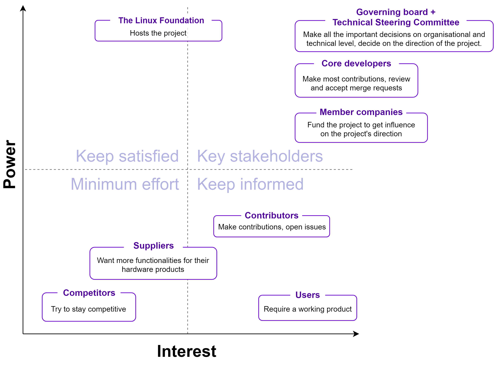
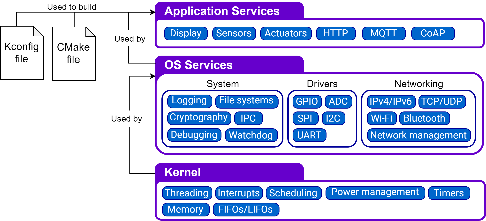

# Zephyr

By Jure Vidmar, Eghonghon Eigbe, Oxana Oosterlee, Suryansh Sharma

*Delft University of Technology, 2019*

## Table of contents

1. [Introduction](#introduction)

2. [Stakeholder Analysis](#stakeholders)

3. [Context View](#context)

4. [Decision Making Process](#DecisionMakingProcess)

5. [Development View](#DevelopmentView)  
    5.1. [Codeline Organization](#CodelineOrganization)  
    5.2. [Module Organization](#ModuleOrganization)  
    5.3. [Build Configuration](#BuildConfig)  
    5.4. [Variability Management](#VarMang)  
    5.5. [Instrumentation](#Instrumentation)  
    5.6. [Standardization of Design](#StandDesign)    
    5.7. [Git Workflow](#Gitworkflow)

6. [Technical Debt](#TechnicalDebt)  
    6.1. [Communication of Technical Debt](#CommTechDebt)  
    6.2. [Automatic Tools for Avoiding Technical Debt](#Autotools)  
    6.3. [Automated Analysis](#AutoAnalysis)  
    6.4. [Evolution Analysis](#EvolutionAnalysis)  
    6.5. [Testing Debt](#TestDebt)  

7. [Security Perspective](#SecurityPerspective)  
    7.1 [Threat Model](#ThreatModel)  
    7.2 [Secure Design](#SecureDesign)  
    7.3 [Security Certification](#SecurityCertification)  
    
8. [Conclusion](#conclusion)

9. [References](#references)  

10. [Appendix](#appendix)  
    10.1 [Pull Request Analysis](#PRAnalysis)    
    10.2 [Key Contact Persons](#contact)    

## 1. Introduction
The Zephyr Project is an open source collaboration project hosted by the Linux Foundation. It is a small, scalable, real-time operating system (RTOS) built for embedded platforms with diverse hardware architectures. It is aimed at Internet of Things (IoT) devices, which often have stringent resource constraints. Therefore, the Zephyr Project’s goal is to design a modular operating system that has a small footprint and low power consumption. Furthermore, it places a high importance on network security to protect devices connected to the internet from potential harm. Because of its modularity, the software can be developed easily for different platforms with different specifications. It contains a lot of tools such as sensor and device drivers and a networking stack to make it easy for developers to fit the software to their specific application. It is an open-source project that has a large network of contributors, including a number of industry partners, and the community can evolve the project to support new hardware, developer tools and drivers.

## 2. Stakeholder Analysis 
Different people have different interests in the Zephyr Project. To identify these different stakeholders, an analysis was done using the stakeholder classes as defined by Rozanski and Woods [[1](#ref1)] as a guideline. 

Type | Description
--|--------------
Acquirers | The Zephyr Project is acquired by the Linux Foundation, which provides a legal and administrative framework for the project. Funding comes from companies that can become a '[member](https://www.zephyrproject.org/#members)' by paying an annual fee.
Assessors | The project's [governing board](https://www.zephyrproject.org/governance/) sets project goals, makes marketing and legal decisions and oversees the budget. 
Developers | There is a large community of regular contributors. The core developers are mainly employees of the member companies. They manage the system and make major contributions to it. Key developers identified are presented in [Table 1](#table1) below.
Communicators | A [community sub-group](https://www.zephyrproject.org/governance/) is responsible for the management and coordination of community activities and communication. There are weekly [group meetings](https://github.com/zephyrproject-rtos/zephyr/wiki/Zephyr-Committee-and-Working-Group-Meetings) for the different working groups and committees that are open to the public, except for the security working group. All user and developer documentation is provided through the [Zephyr Docs](https://docs.zephyrproject.org/) page. 
Maintainers | The [technical steering committee](https://www.zephyrproject.org/governance/) sets the direction for the project, sets up new projects, coordinates releases, enforces development processes and moderates other working groups within the project. It is chaired by Anas Nashif (Intel). A system of codeowners exists, in which the core developers of the project are responsible for their parts of the system and review every code change that affects these parts. One of their main challenges is maintaining code quality, which is necessary in order to provide secure and functionally safe, certifiable RTOS. 
Suppliers | Manufacturers of hardware platforms provide an environment on which the Zephyr RTOS can be deployed. The Zephyr kernel itself has been derived from Wind River’s commercial VxWorks Microkernel Profile made for VxWorks. The Linux Foundation also currently provides some servers and infrastructure to the project. 
Support Staff | An administrative [advocacy sub-group](https://www.zephyrproject.org/governance/) focuses on managing public relations, the website as well as training and materials management and other outreach activities. Technical support comes directly from the project's active contributors, who can be contacted through different communication channels (e.g., Slack).
Testers | A [Testing Working Group]((https://www.zephyrproject.org/governance/)) oversees the testing procedure and tools. These tools include the testing framework available ([Ztest](https://docs.zephyrproject.org/latest/guides/test/ztest.html)) and the Continuous Integration.
Users | Zephyr is built for embedded programmers building real-time and connected (IoT) systems on resource constrained devices. These can be both individual users as well as commercial organizations that can use the software under the Apache v2.0 License. 
Competitors | Direct competition comes from other IoT targeted RTOSes, such as Riot OS and ARM Mbed OS. To a lesser extent it competes with projects as freeRTOS and commercial OSes such as µC/OS and VxWorks, which provide IoT support as part of a larger system.
External Regulators | The Zephyr Project is subject to export compliance set by the US Export Administration Regulations and other U.S. and foreign laws and may not be exported, re-exported or transferred to a list of countries set by the US government. 
Security Evaluators | One of the distinguishing features of Zephyr is the security it promises. Any changes that appear to have an impact to the overall security of the system need to be reviewed by a security expert from the project's security working group. This working group consists of employees of the member companies.

Figure 1 shows the most important stakeholders in a power-interest graph. The project's organisational bodies clearly have the largest power within the project, where the member companies play a big role in providing the manpower. These are mainly internal stakeholders. External stakeholders have less power, and their interest in the project is mainly based on their usage of Zephyr. 

  
Figure 1 - Power-interest graph

Table 1 - Key Contributors to the Zephyr Project

Github ID| Affiliation| Contribution (out of 8025 closed pull requests)| Role
--|--|--|---
@[nashif](https://github.com/nashif) |Intel Employee |599  |Reviewer, Integrator, Developer
@[galak](https://github.com/galak)  |Intel Employee |559  |Reviewer, Integrator, Developer
@[carlescufi](https://github.com/carlescufi) |Nordic Semiconductors Employee|225 |Reviewer, Integrator, Developer
@[mike-scott](https://github.com/mike-scott) |Independent |122 |Reviewer, Developer
@[SebastianBoe](https://github.com/SebastianBoe)|Nordic Semiconductors Employee|285 |Reviewer, Developer

## 3. Context view 
From the stakeholders discussed in the previous section, it is clear that a lot of internal and external entities are involved in the Zephyr Project. To provide context on who/what these entities are and how they are connected, the context view in Figure 2 presents an overview of the most important entities.

The project is [well-organised](https://www.zephyrproject.org/governance/) by its **host** the Linux Foundation. Its **governance** consists of two main bodies: a governing board that makes project management decisions and a technical steering committee (TSC) that manages the development. The TSC chair sits in both boards and provides a link between the two. Specialized committees such as the security working group fall under the responsibility of the governance. Members of the boards are provided by the **project member** companies, who pay a yearly contribution. The [membership](https://www.zephyrproject.org/#members) is awarded in tiers which are based on the contribution amount. A higher tier means more influence in the project’s governance. 

Zephyr is **developed** by a community that consists of 400+ contributors. Most of the main contributors are employed by member companies. For **communication** [Github](https://github.com/zephyrproject-rtos/zephyr) and the [mailing lists](https://lists.zephyrproject.org/g/main) are used, and to a lesser extent the [Slack](https://zephyrproject.slack.com/messages/C18PLHN8H/) and the [IRC chat channel](irc://irc.freenode.net/zephyrproject).

As **development tools**, Zephyr relies mainly on GitHub, using Shippable for [Continuous Integration](https://docs.zephyrproject.org/latest/contribute/index.html?highlight=continuous%20integration#continuous-integration-ci). C is the predominant **language**. **Documentation** can be found on Zephyr’s [docs website](https://docs.zephyrproject.org/), and is generated using both manual written documentation files that are kept in the source directory, as well as using Doxygen for automatic generation. 

Zephyr runs on multiple different **architectures**, and is ported to a continuously increasing list of [150+ boards](https://docs.zephyrproject.org/latest/boards/index.html). **Boards** that are supported are for example from manufactures as STM (Nucleo boards), Arduino, Espressif, NXP and Nordic Semiconductor. **Competitors** that also provide support for (a subset of) these platforms are for example Riot OS and ARM Mbed OS. Users can use any of the supported boards in their project. Commercial users can use Zephyr under the Apache v2.0 **license**. Current examples of users include CommSolis, an ultra-low power solutions company for the Internet of Things (IoT) and the Philae and the accompanying Rosetta Orbiter which landed on Comet Churyumov–Gerasimenko.

  
Figure 2 - Context view

## 4. Decision Making Process 

This section discusses how pull requests are handled within the Zephyr Project. The analysis was done by first clustering issues into different classes, followed by an analysis on a number of pull requests, which are listed in the [Appendix](#appendix).

Figure 3 shows the groups of issues, the concerns they address and the stakeholders who influence these issues the most.

  
Figure 3 - Issue Clusters

### 4.1 Decision Making Process  

When a pull request is made, an automatic tool _Codecov_ analyzes it for code coverage and comments with the percentage of the code the requested pull attempts to change. The Continuous Integration also performs different analysis and sanity checks after which it is reviewed by the designated reviewers. Following their approval or otherwise, a decision is reached by the integrators whether to merge or decline the request. In the process of making this decision there is an option to request changes from the developer which can change the decision of a reviewer. There is also a back and forth that gives the developer a chance to justify or clarify aspects of the request before a decision is made.
To merge a request, all the assigned reviewers must approve the changes made. This process of approval was noted to be influenced by the following factors:
1. The relevance of the pull request to the project. Not every pull request was a direct response to a published issue and in cases where they were due to developer initiative, developers had to justify why this feature or change was required and sometimes how it would affect other components of the project.  

2. The extent to which the change alters the project. This is indicated by the _Codecov_ analysis discussed above but is also sometimes evaluated by developer intuition and experience with the project. A typical instance is a [pull request](https://github.com/zephyrproject-rtos/zephyr/pull/8051) that attempts to change core kernel functionality like the operating system scheduler. Such requests are put under more scrutiny than others.

3. Code quality. Usually in terms of following coding style and common practices within the project.

4. Precedence issues. There are cases in which two pull requests overlap in the issues that they solve. In such cases, a pull request is selected over the other based on the factors discussed above with one being merged and the other declined.

The flow is shown in Figure 4.

  
Figure 4 - Pull request flow

## 5. Development View 
The Development View provides an overview for the developer on how the codebase is organized, what standard design practices are in place, and how the codebase is managed for different build configurations.

### 5.1 Codeline Organization 
The Zephyr Project aims to provide all required building blocks needed to deploy complex IoT applications. It organizes itself across multiple Git repositories, separating the RTOS code from external libraries and development tools. This improves modularity, avoids conflicts in licensing and certification, and enables out-of tree development. Dedicated multi-purpose command line tool called '[west](https://docs.zephyrproject.org/latest/guides/west/index.html#west)' was developed, for easier managment of repositories and development. Figure 5 shows a typical (west) installation directory structure.

  
Figure 5 - Zephyr project tree structure

The layout of the base directory which hosts Zephyr’s own source code, its [kernel configuration (Kconfig) options](https://docs.zephyrproject.org/latest/application/index.html#kconfig-configuration) and its build definitions is shown in Figure 6. 

  
Figure 6 - Zephyr source directory tree structure

A Zephyr application in its simplest form has the following contents:

  
Figure 7 - Zephyr app directory tree structure

### 5.2 Module Organization 

On an architectural level, the source code can be divided into modules - a collection of code serving a specific purpose. The modules can be divided into three layers based on how close a module is to the hardware: 

* **Kernel Layer**: The backbone of the OS. Includes modules for managing low-level processes directly related to the hardware and scheduling of tasks.
* **OS Services Layer**: Provides access to all common OS functionalities. The modules in this layer can be seen as building blocks for designing applications. 
* **Application Services Layer**: Using functionalities provided by the OS services, users can make applications to implement specific functionalities according to their own project requirements. An application can be for example reading a sensor and sending the data over Wi-Fi.

In each layer, a module can use modules from the same and each lower-level layer. Figure 8 shows an overview of the three layers and a subset of the modules in each layer.

  
Figure 8 - Organization of Modules within the Zephyr source code. Kconfig files are used for managing variability of different architectures and boards. - note: for clarity only a subset of the modules is listed.

### 5.3 Build Configuration 

The Zephyr build system is application-centric, as applications configure and initiate the build process. The kernel and application are compiled into a single binary using Zephyr SDK toolchains. Developers can also use their own toolchains for compilation, however. [CMake](https://docs.zephyrproject.org/latest/application/index.html?#id4) build system is used, allowing two different formats: 

* Unix Makefiles
* Ninja

One of the advantages of Zephyr's distributed configuration system is separation of application-specific kernel settings from board-specific settings. At build-time, configuration (Kconfig) files from all layers are combined into a single kernel configuration.

### 5.4 Variability Management 

Variabiity is managed in the project by maintaining board specific code for each platform the operating system supports. Aplication developers make use of configuration files to specify what versions of code is compiled for a project. These files are shown in Figure 7 above under _prj.conf_. 

### 5.5 Instrumentation 

For aiding developers in the process of debugging and testing, the Zephyr Project provides the following standardized tools:

* **Debugging** - Debugging can be done using the GNU Debugger in [QEMU](https://wiki.qemu.org/Main_Page), which is an open-source machine emulator and virtualization software. When building an application, the build system automatically generates an ELF file that can be used for debugging purposes. 

* **Logging** - Logging can be done using the [Logger API](https://docs.zephyrproject.org/latest/reference/logging/index.html#logger-api). It provides logging functions with four different [severity levels](https://github.com/zephyrproject-rtos/zephyr/blob/master/include/logging/log.h) (error, warning, info and debug) that can be used for debugging RTOS modules. It is configurable via Kconfig files.

* **Testing** - The Zephyr Test Framework (Ztest) provides two methods of testing to the developer: [unit testing](https://docs.zephyrproject.org/latest/guides/test/ztest.html#quick-start-unit-testing) for testing specific modules and [sanitycheck](https://docs.zephyrproject.org/latest/contribute/index.html?highlight=shippable#sanitycheck) for testing the full software stack. The latter runs a number of different tests (which can be extended by developers) for different architectures using the QEMU emulator. On a daily basis, tests are automatically built and run on the whole project codebase to verify its operation as part of their CI process (using shippable). 

### 5.6 Standardization of Design 

The success of Zephyr's architecture can be attributed to it's standardization of development. Following the philosophy of "*standing on the shoulders of giants*", the project adopted development patterns and practices that were proven to work well in the industry:

* **Release model** -  The project's [release model] follows the Linux kernel's model with several adaptations. Releases are time-based (rather than feature-based), following roughly three-month cycles. Each release period consists of a *merge window*, where new features and changes can be added, and a *stabilization phase* where only bug fixes and documentation improvements are allowed to be merged into the master branch.

* **Development guidelines** - These are also inspired from industry's senior players. [Coding style] follows the Linux Kernel's style, with minor adaptations. A few examples of code style requirements are: "every `if-else` statement needs braces", "C-99 style of single line comments (`// comment`) is not allowed" and "use spaces instead of tabs for aligning comments after declarations".  

* **Naming conventions** - unlike desktop operating systems, where applications are written in user-space, Zephyr's applications are written in kernel-space. To prevent variable naming conflicts in this shared namespace, kernel developers defined several [naming conventions], for example, kernel-specific functions are prefixed with `k_`,  operations called by Interrupt Service Routines should be prefixed with `isr_` etc. Individual RTOS subsystems can define their own conventions but need to have a subsystem prefix such as `bt_` for Bluetooth stack or `net_` for IP stack, etc.    

[release model]: https://docs.zephyrproject.org/latest/development_process/release_process.html  
[coding style]: https://docs.zephyrproject.org/latest/contribute/index.html#coding-style 
[naming conventions]: https://github.com/zephyrproject-rtos/zephyr/wiki/Naming-Conventions 

### 5.7 Git workflow 

The [Git workflow] is well defined and documented, enabling developers to communicate about the code quality and bugs. This is crucial for resolving and avoiding technical debt, discussed in the next section. The majority of the communication about the source code is done through GitHub issues, which are used for reporting bugs as well as proposing features or enhancements. In the latter case, the proposal is expected to include elaborate description of the problem and the proposed implementation. Before the feature is agreed upon, developers discuss if the proposal fits into the current architecture and give advice on its implementation and maintenance. Large changes are discussed within the Technical Steering Committee meetings.

Commit messages should include relevant information and the developer's signature to DCO (Developer Certification of Origin). Each contribution (pull request) is automatically checked by the Continuous Integration service. Furthermore, each pull request needs to be reviewed by at least two reviewers before being merged into the master branch.

This open review system works very well for the Zephyr Project, ensuring that no big changes are done to the source code without having been properly thought through by multiple (core) developers within the project. Furthermore, having the discussion open to view by anyone adds to the traceability of the code. In case of a large contribution or issue, the discussion can continue on other communication channels such as the mailing list and weekly developer calls.

[Git workflow]: https://docs.zephyrproject.org/latest/contribute/index.html#commit-guidelines

## 6. Technical Debt 

In this section the performance of the Zephyr Project in regards of technical debt is analyzed. First, we take a look at what measures are taken now to avoid technical debt. Then, using tools we analyze what the state of the codebase actually is and how the project evolved over time.

### 6.1 Communication of Technical Debt 
As already mentioned in [Git Workflow](#Gitworkflow), Zephyr requires all issues to be tagged properly. This combined with their extensive communication process is essential to avoid and resolve technical debt.  For technical debt related issues, the following tags are used explicitly:

  
Figure 9 - Tags used for technical debt-related issues

Issues about improving the quality of the code or refactoring do not have a specific tag and can be found under `enhancement`. There exists a tag for this purpose, `area::Code Style`, but this tag is not used often. We find that Zephyr developers fix code issues as part of the tightly controlled development process rather than as an afterthought. 

### 6.2 Automatic Tools for Avoiding Technical Debt 
The Zephyr Project uses some automated tools that are run at every pull request as part of the Continuous Integration. These tools contribute to reducing the risk of (future) technical debt. If a pull request does not pass the tests all automated tools run, the pull request will not be merged. 

Avoiding technical debt related to the source code: 

* *Codecov* - Generates a report on how test coverage of the full project changes with the new pull request added. A high coverage percentage means a lower testing debt. 

* *Sanitycheck* - Checks if all tests still pass on a range of different board builds. 

* *Checkpatch* - Checks the pull request whether the code complies with the [coding style guidelines](https://docs.zephyrproject.org/latest/contribute/#coding-style) and naming conventions. 
   
Avoiding technical debt related to documentation and traceability:

* *Gitlint* - Checks if a commit message is written according to the [commit guidelines](https://docs.zephyrproject.org/latest/contribute/#commit-guidelines). Good commit messages improve traceability.

* *Documentation style check* - Checks if added documentation adheres the [documentation style guidelines](https://docs.zephyrproject.org/latest/documentation/doc-guidelines.html).

They follow some of the best CI practices as can be seen from their gold badge and this process goes a long way in avoiding technical debt. 

### 6.3 Automated Analysis 

This section presents the results of running the Zephyr repository through [Sonarqube](https://www.sonarqube.org/), which is an automated analysis tool for code quality. Results are presented for code reliability, maintainability, duplication, coverage, complexity and size as these are deemed the most relevant to the project. These metrics are specifically relevant because of the hard real time use cases of Zephyr (and other RTOSes) which require predictable and easy to analyze code. 

  
Figure 10 - Sonarqube analysis overview

#### 6.3.1 Duplication
The analysis gave a passing grade but raised 3400 code smells. Upon looking into these, it was clear that they were mostly from duplicated blocks of code. Putting this in context, we are reluctant to brand this a debt because it has a lot to do with how Zephyr manages variability. The largest contributors to the count are files from _ext_, _include_ and _build_ shown in Figure 6. It is an operating system that supports a large variety of boards and build files are maintained for different boards with multiple boards using the same dependencies. Upon building an application based on Zephyr, only board-related code is ported to the hardware.

#### 6.3.2 Complexity and Size

The code base is 6 million lines of code large, 30% of which are comments. It has a cyclomatic complexity of 3,299 of which 80% of the independent paths are in the _scripts_ folder which houses the tests and sanity checks. The cognitive complexity results also bear the same ratio with the bulk of the complexity lying in the tests. Hence, we conclude that the bulk of code complexity is not in executing core functions of the operating system but in testing and building. Therefore, this complexity is not transferred to a user that ports Zephyr to their system and should satisfy hard real time complexity requirements.

### 6.4 Evolution Analysis 

Zephyr was first released in May 2016 and by the time of writing, there are 14 releases. Despite steady and steep growth of the projects (from only supporting 15 boards in the first release, to 150+ boards in the 1.13 release), technical debt is being avoided rather than cured.

  
Figure 11a - Lines of Code evolution Chart

We analyzed the evolution of Zephyr by inspecting the growth of several components across releases. This was achieved using the tool `cloc`, counting the lines of code in selected top-level directories of the project: kernel, boards, arch, misc, tests, drivers, include, lib, subsys, ext. While C is not an object oriented language, we adopt terminology from [[2](#ref2)] in describing its evolution.

Figure 11b - Evolution Matrix

The results, shown in Figure 11b, show _arch_, _boards_, _drivers_ and _tests_ as 'supernova' directories. Test code is seen to grow with core functionality and this is a good counter-measure against technical debt. We also observe the _misc_ folder might be a technical debt indicator, as it contains code that does not fit into the folder organization otherwise. This is however a 'DayFly' directory which spiked once and was reduced in subsequent versions.

Figure 12 - Evolution of external code within the code base

The _ext_ folder, while not a 'Persisitent' directory, has grown disproportionately with the rest of the project as shown in Figure 12. This contains external code integrated into the project and is currently the heaviest folder by the chosen LOC metric. Code contained is not in sync with changes and upgrades made by the original developers of these systems and thus, we identify this as technical debt. In the [documentation](https://docs.zephyrproject.org/latest/guides/west/repo-tool.html), there are plans to move such code to separate repositories to keep externally maintained code away from the core Zephyr code. This will also ensure that such code remains in sync with the original systems.

### 6.5 Testing Debt 

Technical debt in testing was evaluated by providing a measure of how much of the code is exercised in test scenarios. The Zephyr repository is linked to _Codecov_, an automated coverage tool that provides such results whenever continuous integration tests are run. This tool give the statistics as shown in Figure 13.

  
Figure 13 - Testing coverage chart  

As seen in Figure 13, the coverage of tests on the repository has been at 50% over the past 6 months. This implies that no single day every portion of the code is tested. In Figure 14 below, we show a coverage report on a recent sanity check. It can be seen that only one directory under _arch/_ and _boards/_ was covered in the test.

  
Figure 14 - Test Coverage by File

Further investigation into tested aspects of the code show that this deficit exists because in normal use, the tests only runs for boards marked as default. As such, passing the sanity check only implies that the build works for a subset of the boards supported by the operating system. This is acknowledged in the [docs](https://docs.zephyrproject.org/latest/subsystems/test/sanitycheck.html) and an option to run a more extensive test is provided, i.e., running the sanity check with an `--all` tag. To fix the possible loopholes in such a low test coverage, this should be made the default testing scenario.

## 7. Security Perspective 

Security is an essential part of the Zephyr ecosystem. Aimed at IoT developers, the RTOS comes with an assurance of being one of the most secure options for application development. In this section we first analyze the threat model Zephyr faces followed by an outline of the well defined security process that Zephyr has adopted while also addressing security compliance requirements. This is mainly divided into Secure Development, Secure Design and Security Certification.

  
Figure 15 - Security Components

 

### 7.1 Threat Model

It is essential to first discuss an overview of the possible threats in the Zephyr project. Because Zephyr is an RTOS running on many different platforms and environments, it is susceptible to many different attack vectors. These can include malicious code submissions to the RTOS itself, exploiting communication protocol vulnerabilities of the deployed devices, etc. Besides attacks on the networking stack, functional security also needs to be addressed to prevent malicious or destructive behaviour. All the links shown in the [context view](#context) can be a potential source of security risk. The figure below shows a simplified view of Zephyr's threat model, including attack vectors, sensitive assets and intentions.

Figure 16 - Simplified Threat Model

### 7.2 Secure Development and Design 

Zephyr provides a range of guidelines, tests and requirements to ensure functional security as well provide quality assurance. This is achieved by assuring code quality and correctness while additional security features, such as cryptographic libraries, are being developed as well. The [Development process](#Gitworkflow) addresses security concerns by enforcing strict code reviews before any piece of code is merged to the master branch. This, in combination with [static analysis tools](#Instrumentation) ensures bug and backdoor-free software. 

Security bugs, issue tracking and management is performed separately using JIRA where there has been some initial work on the definition of vulnerability categorization and mitigation processes. Security issues have more stringent reviews before they are closed as non issues (at least another person educated in security processes need to agree). They require security reviews to be performed by a security architect before each security-targeted release and each time a security-related module of the Zephyr project is changed. A security subcommittee has also been formed to develop the security process in more detail. 

[Secure coding guidelines](https://docs.zephyrproject.org/latest/security/security-overview.html#secure-coding-guidelines), written by the security subcommittee are based on several design standards (for example “The protection of information in computer systems”, by J. H. Saltzer and M. D. Schroeder) and address essential secure development principles such as: *designed system should be simple and small*, *process should operate with least privilege necessary*, etc.

The security architecture is based on a monolithic design and the Zephyr kernel and all of the applications are compiled into a single static binary which can be tailored during build-time. This static linking eliminates the potential for dynamically loading malicious code. It also provides *Stack protection* mechanisms to protect against stack overruns. In addition, applications can leverage *Thread separation* features which split the system into privileged and unprivileged execution environments. *Memory protection* features enable partitioning of system resources (memory, peripheral address space, etc) again as a provision for secure design.

### 7.3 Security Certification 
For certain stakeholders, certification of the code regarding safety and security is critical. Some users can only use certified software in their products and for developers and acquirers this means that certification can result in more widespread adoption.

The Zephyr project has [announced](https://www.zephyrproject.org/zephyr-project-rtos-first-functional-safety-certification-submission-for-an-open-source-real-time-operating-system/) that they plan to be the first open source RTOS to be (partly) certified. As certification of large projects is complex and costly, they aim for a step-by-step approach wherein first the core functionalities shall be certified. This includes the kernel, and some entities of the OS Services (mostly system services), as indicated in [Module Organization](#ModuleOrganization). Selecting which parts of the code will be certified, and how the code needs to be adjusted for certification is the responsibility of the Security Working Group in collaboration with the Technical Steering Committee.

To make this possible, the release model will be adapted. This process is shown in Figure 17. The certified code-base will be a branch of the bi-annual long-term stable release (LTS). This branch will only contain a subset of the code base. This so-called auditable code base will be reviewed and adjusted to comply to certification standards, and then be submitted for certification. Important fixes for the master branch will be merged with the LTS and auditable code. The master, LTS and auditable code will be kept in sync, meaning that fixes for one branch will also be integrated in the other branches. One exception being new features, which will not be merged into the LTS and auditable code.

  
Figure 17 - Certification process

With this process, the Zephyr Project makes it possible for the OS to be (partly) certified in the future, making it more attractive for different types of users including those from industry. The project aims to acquire the following certifications: MISRA C:2012 (for safety, security, portability and reliability of embedded systems), IEC 61508 SIL 3 (for safety integrity) and ISO 26262 (for automotive certification).

## 8. Conclusion

Zephyr is one of the most promising open-source RTOSes available today. Despite being a relatively young player on the RTOS market, it is succesfull due to its well-defined organisational and development structure while also having a good understanding of what is important for IoT applications. Code quality is maintained by governing bodies overviewing the development process and reviewing the contributions thouroughly, which benefits not only Zephyr but also its community of developers.

First, the stakeholders involved in the Zephyr project were presented, showing its internal structure as well as its relation to the industry. By analyzing Zephyr's GitHub repository, it was observed that decisions for merging pull requests are based on experienced code reviewers, decision making bodies and automated tests. The development process was further analyzed in depth, describing their well-defined and organized git workflow, coding guidelines and the various tools available for developers.
By giving an insight into the project's codeline and module organization, it became clear that code modularity is enforced as much as possible, and variability between different hardware platforms is managed through configuration files. Evaluating the codebase for technical debt resulted in interesting results and trends. These were mostly positive thanks to their adoption of good development practices. Lastly, the project was analayzed from a security perspective, outlining how the project guarantees security despite its open source nature and how they aim to be the first safety-certified RTOS.

In conclusion, Zephyr could serve as a role model not only for Real-time Operating Systems, but also for open-source software projects in general. It is a good example of how successful management of open-source contributions and a well defined and documented architecture can ensure and retain the software's quality.

## 9. References

[1] N. Rozanski and E. Woods, *Software Systems Architecture Working with Stakeholders Using Viewpoints and Perspectives*. Addison-Wesley, 2012.   
[2] Lanza, Michele, *The evolution matrix: Recovering software evolution using software visualization techniques*. Proceedings of the 4th international workshop on principles of software evolution. ACM, 2001.   
[3] Icons used in Figure 16 are made by [Freepik](https://www.freepik.com/) from [Flat Icon](https://www.flaticon.com) 

----

## 10. Appendix

### 10.1 Pull Request Analysis 

Pull Request | Status |Summary of Events
--|--|-----
[Request 1: add support for the Arduino Zero and the SAMD21 series](https://github.com/zephyrproject-rtos/zephyr/pull/4774)  |Merged | The aim of this request was to merge code that provided added support for two boards. These boards were already listed on the operating system but this patch fixed issues with board initialization and a few drivers. The timeline for the merge was 2 months which spoke to the significance of the request. There were 7 commits in total with ten changes requested from the time of request to the time of merge. This request fits into the larger roadmap plan of supporting as many boards as possible and this was the motivation/stakeholder interest. This request generated 147 conversation points and did not produce any code coverage difference.
[Request 2:add Zephyr inline code generation with Python](https://github.com/zephyrproject-rtos/zephyr/pull/6762)   |Closed without merging | This request was closed without merging. Its aim was to add the feature of generating in line code. Such a feature is needed to dynamically configure of board pins from device tree information and automate repetitive coding tasks. The larger goal of this is to enable Zephyr be configured with device tree data. Discussions arising on this request included: -Concerns about some material used in the code that was originally licensed to MIT  -Complications arising from using code generation in line with C code. 211 conversation points were raised in trying to resolve the issues arising and a decision was made that the project was not currently ready for such a change.
[Request 3: uart: Add new asynchronous UART API (Transfer sub-API)](https://github.com/zephyrproject-rtos/zephyr/pull/10820)   |Merged | This pull request lifts the functionality of uart transfer from the programmer building on this operating system. Instead of writing direct interrupt handlers for this functionality, an API call is now used instead. Discussions on handling full duplex transfers and the efficiency of response to external events were raised by different developers. It took 3 months to merge this and this pull request has been referenced in two other pull requests that both aim to improve API functionality. This is directly a feature addition to the operating system and its impact will be most felt by users of the operating system.
[Request 4: net: context: can: Fix typo in Kconfig option name](https://github.com/zephyrproject-rtos/zephyr/pull/13363)  |Merged | This was a high priority bug fix to a typo. The coverage was minimal and the decision to merge was obvious.
[Request 5: Flash: Rework STM32F3 flash driver and configure F3 based boards for tests](https://github.com/zephyrproject-rtos/zephyr/pull/13402)   |Merged | This pull request was to improve board support for a class of boards who drivers had been lacking updates. Such commits fit into the project roadmap and as such there were no discussions into its usefulness. This qualified as an easy merge.
[Request 6: board: stm32_min_dev: Add USB support](https://github.com/zephyrproject-rtos/zephyr/pull/13416)   |Open| This PR added USB support for a class of boards. This is still open as it is pending reviews even though it has passed all tests.
[Request 7: Network logging overhaul](https://github.com/zephyrproject-rtos/zephyr/pull/8816) |Merged | In February 2018, a new logging subsystem was proposed by @nashif, aiming to improve Zephyr logging capabilities with virtually no impact on performance, small memory footprint and user friendly interface. Few months later, @pizi-nordic provided a detailed introduction to the topic, high-level overview of the logger, requirements and some implementation concerns. As this presented a big overhaul of the system, the issue was divided on smaller parts and assigned among several developers. We analyzed the Networking part of the logger, which was assigned to @jukkar (Intel employee and member of the Zephyr project). His pull request re-implements logging parts of the networking subsystem, to conform to the new logging API. For better transitioning, both old and new ways of logging are supported, where the old API will be deprecated and finally removed in the future. Most of the discussion consisted of senior developers reviewing parts of the code. Perhaps the most noticeable critic is given by @pfalcon, where he points out the problem of too many commits in a single pull request, which makes it hard to review. Others commented on various syntactical inconsistencies, code clarity and redundant function calls. After many iterations of commits and reviews and approval of couple of senior developers, the pull request was merged into the master branch by @jukkar himself.
[Request 8: Bluetooth: settings: Always initialize key when storing Client Features](https://github.com/zephyrproject-rtos/zephyr/pull/13620) |Merged |A bug in the Bluetooth stack was noticed by @qbicz, where in certain conditions reading the Bluetooth configuration could crash the system. This issue was already fixed in previous release, but appeared again. Discussion between three developers revealed the possible source of problem -> new PR was created, which fixes the mentioned bug. The developer asked others to review if the changes affect other use cases. Upon several clarifications of coding decisions with @Laczen, and two approvals, the fix was merged into master by @nashif. 
[Request 9: doc: Rework Development Process section](https://github.com/zephyrproject-rtos/zephyr/pull/13530) |Merged | This PR was filled by @nashif to provide updates on documentation about the development process of Zephyr. Despite having a leading role in Zephyr development, he asked more than three developers to review his changes. Upon replying to few questions asking for clarification on certain points, following comments were mostly about minor typos and style changes. Every successful update was reviewed again and only after few iterations of updates-feedback, the pull request was confirmed by all developers and merged to master branch. We observe the politeness and high-level of respect among developers, as most of the critiques where formed in a polite manner and started with gratification for the work that was being done.
[Request 10: NVS: Non Volatile Storage solution for zephyr](https://github.com/zephyrproject-rtos/zephyr/pull/6391)  |Merged | This pull request provided a means to store configuration details of the operating system in non volatile memory of the boards and provide some persistence. The request was merged after changes were requested to its documentation and commit logs.
[Request 11: net: zstream API to abstract socket transport protocols (e.g. TCP vs TLS)](https://github.com/zephyrproject-rtos/zephyr/pull/5985) |Closed without merging | This pull request was targeted at a streaming API for socket based protocols but was closed without merging on the basis of its relevance to the project.
[Request 12: drivers: sensors: Add lsm303dlhc driver](https://github.com/zephyrproject-rtos/zephyr/pull/6420) |Closed without merging |This is a case where a pull request was superseded by [another pull request](https://github.com/zephyrproject-rtos/zephyr/pull/6441). Both requests were to add support for a class of sensors in the operating system and the decision to close without merging was made not based on code quality or the necessity of the feature as we saw in other cases but simply because it was superseded.
[Request 13: Gcov: Enable Code coverage reporting over UART](https://github.com/zephyrproject-rtos/zephyr/pull/9717) |Merged |This pull request added a feature to enable users of the operating system generate code coverage reports over uart. The discussions leading to its successful merge focused on use cases and proper documentation of them for the users.
[Request 14: net: sched: It's ok to preempt coop threads if they're polling ](https://github.com/zephyrproject-rtos/zephyr/pull/8051) |Closed without merging | This pull request proposed changes to the scheduling policy of the operating system. This is  a very key aspect of any real time operating system and as such it raised a lot of discussion points. Such a change could alter the core functionality of the system and could imply deeper scheduling bugs. It was closed without merging for this reason.
[Request 15: Introduce the west repository to the Zephyr Project](https://github.com/zephyrproject-rtos/zephyr/pull/11715) |Merged | The west module(discussed under main isssues) is managed in a separate repository from the RTOS components of the project. This pull request introduced the tool to users and documented its cloning mechanisms. This would classify as  an easy merge because the need for this documentation was clear-it is included in the project roadmap to include such a tool- and as such the only changes requested were document edits.
[Request 16: doc: west: Document build system integration](https://github.com/zephyrproject-rtos/zephyr/pull/12938)|Closed without merging | Similar to Request 15, this was  a pull request for documentation on the west module. This time, not to introduce it to users but proper code documentation of its operation. This was however not merged but closed in favor of [another pull request](https://github.com/zephyrproject-rtos/zephyr/pull/13067) that achieved the same purpose. The combination of these requests paid an important technical debt.
[Request 17: Drop ARP requests based on specific scenarios](https://github.com/zephyrproject-rtos/zephyr/pull/11407)  |Merged | This was an addition to the networking stack for the board to drop broadcast or multicast ARP requests as no single board really replies to such ARPs. This request was accepted because this is standard networking practice and was an oversight in the original implementation. It was however requested to log the reasons for any dropped packets to avoid loopholes in the future.
[Request 18: power: Add device idle power management support](https://github.com/zephyrproject-rtos/zephyr/pull/12172) |Open | This is an open pull request to provide a power management framework to suspend devices based on their idle state. It is still unmerged because of technical issues with its implementation.
[Request 19: cmake: Introduce a user-local configuration file](https://github.com/zephyrproject-rtos/zephyr/pull/9801)|Closed without merging | Closed without merging, this pull request aimed to provide a file for users to configure the operating system without having to run scripts. This was determined to remove the flexibility of switching between different toolchains and tools.
[Request 20: Remove link layer reserve concept from network stack](https://github.com/zephyrproject-rtos/zephyr/pull/11374)  |Merged | This separates levels 2 and 3 of the network stack as implemented by the operating system. This change provided a 68% code coverage difference. Minor issues were noted and a merge was implemented after all the tests were passed.

### 10.2 Key Contact Persons 

Name| Email Address|Role| Contact Made
--|--|--|--
Brett Preston| bpreston @ linuxfoundation.org |Program Manager for IoT Products at Linux. Currently assigned to LF Edge and Zephyr| None yet
Erwan Gouriou| erwan.gouriou @ linaro.org|Zephyr codeowner. Contributor for STM32 boards.| Reached out for guidance with submitting pull requests to the project
