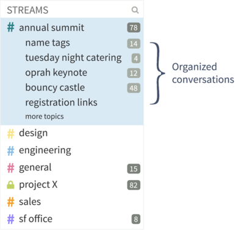
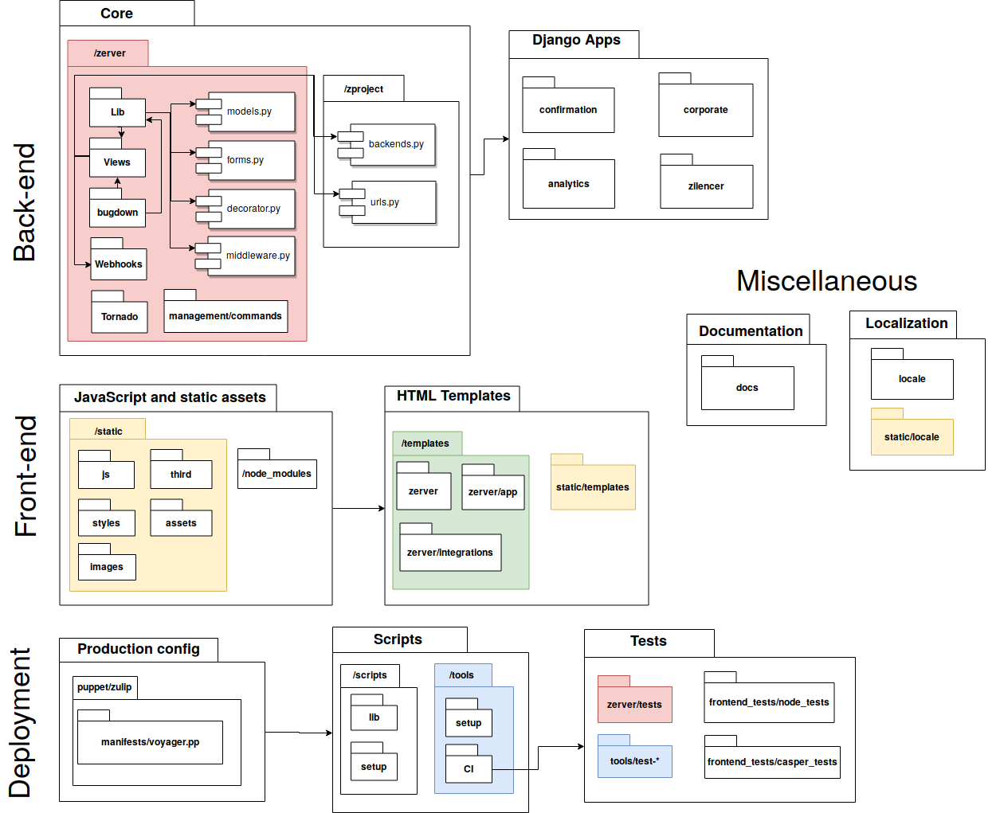

# Zulip

## Abstract

*Zulip is an open-source team chat application that provides all the benefits of real-time chat, distinguishing itself by remedying many shortcomings of common team chat applications through intuitive asynchronous means. The project is one of the larger open-source python projects and has extensive documentation and tools for programmers to start contributing. This report is an analysis of the architecture of the Zulip project. An overview of the project is provided by analyzing the project from both technical perspectives, such as the development process, technical debt and the deployment, as well as more organizational perspectives, such as the context of the project and the stakeholders involved. We find that the codebase of Zulip is of high quality overall and the project has a strong community, but there is a high dependence on one person, which has multiple risks tied to it.*

## Table of contents

- [1. Introduction](#1-introduction)
- [2. Stakeholder View](#2-stakeholder-view)
  * [2.1 Rozanski and Woods stakeholders](#21-rozanski-and-woods-stakeholders)
  * [2.2 Other types of stakeholders](#22-other-types-of-stakeholders)
  * [2.3 Power-interest grid](#23-power-interest-grid)
  * [2.4 Integrators](#24-integrators)
  * [2.5 Relevant people](#25-relevant-people)
  * [2.6 Contact persons](#26-contact-persons)
  * [2.7 Decision-making process](#27-decision-making-process)
- [3. Context View](#3-context-view)
  * [3.1 System Scope and Responsibilities](#31-system-scope-and-responsibilities)
  * [3.2 External Entities and Interfaces](#32-external-entities-and-interfaces)
    + [3.2.1 Users and target audience](#321-users-and-target-audience)
    + [3.2.2 Competition](#322-competition)
  * [3.3 Impact of the System on its Environment](#33-impact-of-the-system-on-its-environment)
- [4. Development View](#4-development-view)
  * [4.1 Module Structure](#41-module-structure)
    + [4.1.1 Back-end](#411-back-end)
    + [4.1.2. Front-end](#412-front-end)
    + [4.1.3. Deployment](#413-deployment)
    + [4.1.4. Integration with external modules and bots](#414-integration-with-external-modules-and-bots)
  * [4.2 Common Design Model](#42-common-design-model)
  * [4.3 Development Process](#43-development-process)
    + [4.3.1 Version Control](#431-version-control)
      - [4.3.1.1 Issues](#4311-issues)
      - [4.3.1.2 Pull Requests](#4312-pull-requests)
      - [4.3.1.3 Releases](#4313-releases)
    + [4.3.2 Testing](#432-testing)
  * [4.4 Documentation and localization](#44-documentation-and-localization)
- [5. Deployment View](#5-deployment-view)
  * [5.1. Concerns](#51-concerns)
    + [5.1.1 Runtime Platform Requirements](#511-runtime-platform-requirements)
    + [5.1.2. Third party dependencies](#512-third-party-dependencies)
    + [5.1.3. Network requirements](#513-network-requirements)
  * [5.2. Runtime platform model](#52-runtime-platform-model)
- [6. Technical Debt](#6-technical-debt)
  * [6.1. Identification of technical debt](#61-identification-of-technical-debt)
  * [6.2. Discussions about technical debt](#62-discussions-about-technical-debt)
  * [6.3. Evolution of technical debt](#63-evolution-of-technical-debt)
    + [6.3.1 Evolution of bugs](#631-evolution-of-bugs)
    + [6.3.2 Evolution of code smells](#632-evolution-of-code-smells)
  * [6.4. Testing debt](#64-testing-debt)
    + [6.4.1. JavaScript code coverage](#641-javascript-code-coverage)
    + [6.4.2. Python code coverage](#642-python-code-coverage)
  * [6.5. Documentation debt](#65-documentation-debt)
  * [6.6. Impact of technical debt](#66-impact-of-technical-debt)
- [7. Conclusion](#7-conclusion)
- [8. References](#8-references)

## 1. Introduction

The concept of using team chats to improve the quality of communication and efficiency of teams within universities or companies has become increasingly popular in the last decade. The team chat application that most people have heard of and probably used is called [Slack](https://slack.com/). According to the creators of Zulip, Slack and other applications following Slack's conversation model, such as [Hipchat](https://www.atlassian.com/partnerships/slack) or [Mattermost](https://mattermost.com/), are unable to provide the means to effectively communicate within organizations [^1]. [Zulip](https://zulipchat.com/), "The worlds most productive team chat", offers an open-source alternative to these applications and attempts to remedy these shortcomings by focusing on asynchronous communication.     

Zulip is an open-source team chat application. The application was originally created by a small team from MIT and was acquired by Dropbox while the project was still in private beta. After 1.5 years of not being in active development, Dropbox decided to release the project as open-source software. Since then, Zulip steadily gained new contributors and eventually grew to be one of the largest and most active open-source projects on Github [^2]. As of march 2019, Zulip has had merged more than 1600 pull requests created by the community of Zulip contributors, of which about 75 pull requests were merged in the past 3 months [^3].

Zulip has a unique structure for their platform, which sets it apart from competitors. They argue that this structure is more efficient, less messy and has better persistence of information.
An organization can create what is called a realm, which is comparable to a channel in Slack. These realms in turn contain streams with a list of topics, where a topic is much like an e-mail thread with a title. These topics are used to host conversations between users, which persist through long time intervals. This allows users to catch up to older conversations by filtering streams for topics,while still being able to converse in real-time. The figure below shows what this structure looks like in practice. 

This chapter of the Delft Students on Software Architecture book 2019 aims to provide a clear overview of the Zulip project as a whole, shown from different perspectives. Not only the technical aspects of the project are highlighted, but also the organizational aspects. First, to understand the role of us as architects in the system, all the relevant stakeholders are identified and analyzed. Then, to gain a better understanding of the relationships and interactions in the system, a context view of the project is created. Once those are clear, we will go into the more technical aspects of the project by analyzing the process of the development of the project, as well as how to deploy the application. Lastly, we take a look at the technical debt of the project and finish with concluding remarks. 

## 2. Stakeholder View

This chapter identifies the different stakeholders of Zulip and the decision-making process of Zulip is analysed to understand how the leaders of the project try to fulfil the needs of the stakeholders at all times.

### 2.1 Rozanski and Woods stakeholders

Type               |Stakeholders               | Description                       
-----------------------   | ----------------------------| ----------------------------
<b>Acquirers</b>                 |Zulip team, Dropbox, Kandra Labs                 | The main acquirer is the [core Zulip team](https://zulip.com/team/), who manages the project. [Dropbox](https://www.dropbox.com/) acquired the project when it was still in private beta and later open-sourced it. [Kandra Labs](https://www.linkedin.com/company/kandra-labs/about/) was founded by the lead developer of Zulip, [Tim Abbott](https://github.com/timabbott), to steward and financially sustain Zulip. 
<b>Assessors</b>                 |Zulip team, Tim Abbott                 | The role of assessors is taken by the Zulip team. They assess project's internal quality through code reviews and discussions. All merge requests are approved by Tim Abbott before merging into master branch. 
<b>Communicators</b>             |Zulip team, Zulip community             | Most communication with stakeholders is done through [Zulip community server](https://zulip.readthedocs.io/en/latest/contributing/chat-zulip-org.html), GitHub issues and documentation. Main participants are the Zulip team and community.
<b>Developers</b>                |Zulip team, Zulip community                | Developers of Zulip come from the community and everyone who wants to contribute. The [Google Summer of Code](https://summerofcode.withgoogle.com) and [Google Code-In](https://codein.withgoogle.com/) also contributed 30+ developers to the project.
<b>Maintainers</b>               |Zulip team, Zulip community               | Most of the maintenance is done through the documentation, managed by the community. The development environments are maintained by the core team.
**Production engineers** |Kandra Labs, Zulip Team | One of Kandra Labs products is a hosted Zulip service. The Zulip team is responsible for maintaining the production on-site.
<b>Suppliers</b>                 |i.e. Oracle, Hashicorp, Kubernetes                 | The project uses a multitude of available software packages and programs, which include (but are not limited to) [Virtualbox](https://www.virtualbox.org/), [Vagrant](https://www.vagrantup.com/) and [Kubernetes](https://kubernetes.io/). This makes the creators of this software supplying stakeholders.
<b>Support staff</b>             |Zulip team, Zulip community             | The community acts as the support team. User support is provided through a help center which includes extensive documentation and contact e-mail address. 
<b>System administrators</b>     |Zulip team     | Zulip has a hosted service for chat, administered by the core team.
<b>Testers</b>                   |Zulip community                   | Testers are the same group as the developers. Testing is done by the community both through software testing and live testing using the community Zulip channel.
<b>Users</b>                     |i.e. Akamai, Wikimedia, LevelUp                     | Zulip is [used](https://zulip.com/hello/#quote-carousel) for communication by other open source projects, Fortune 500 companies and various organizations.

### 2.2 Other types of stakeholders

| **Type**              | Stakeholders                      | Description                                                  |
| --------------------- | --------------------------------- | ------------------------------------------------------------ |
| Competitors           | Slack, Mattermost, others         | Many companies offer similar services as Zulip. These parties hold a lot of interest in Zulip as a direct competitor, but have little to no power over it. |
| Partners              | i.e. Hubot, Bitbucket, MailChimp  | Zulip offers [integrations](https://zulipchat.com/integrations/) for a multitude of existing applications. |
| Non-code contributors | Zulip community                   | Contributing to Zulip is not limited to writing code. Many members of the Zulip community contribute by reporting issues of, giving feedback on or translating the application. |
| Sponsors              | USNSF, unnamed sources of funding | Kandra Labs received a [large grant](https://seedfund.nsf.gov/) from the [US National Science Foundation](https://www.nsf.gov/), along with additional sources of funding. |

### 2.3 Power-interest grid

The acquirers and Tim Abott are the owners of the project and have full control of any alternations that are made to the source code. The community has a lot of interest in the project, which is their reason for contributing. Users, sponsors and competitors also have high interest in the project, as its quality influences people's choice of team chat application. The sponsoring stakeholder is mainly interested in the fact that their money is being put to good use. Suppliers hold both little interest and power over the project, as their products do not depend on Zulip, but rather the other way around. Lastly, partners have little interest in Zulip as their product is standalone and does not depend on Zulip, but hold some power, as one of the main qualities of Zulip is the integration with these tools.

### 2.4 Integrators

Zulip has one integrator, Tim Abbott. He reviews every single pull request and decides if a pull request gets merged. Other members of Zulip also review and provide feedback, but Tim Abbott always makes the final decision.

Pull-based development model is used mainly for resolving issues and code reviews. Based on pull request analysis, features being implemented are often already discussed on a different platform. The pull request is then only used to review code for an already agreed feature.

Main reasons for rejecting/accepting pull requests are code quality/style and test passing. Tim Abbott is consistent in desired quality code, hence pull requests get merged only if quality code passes test cases.

Common issues that Tim Abbott faces are a high workload, difficult issues that nobody claims and developers that take a long time to incorporate feedback. 

### 2.5 Relevant people

The leaders of this project are:

- [@Tim Abbott](https://github.com/timabbott): the absolute lead developer of this project.
- [@Rishi Gupta](https://github.com/rishig): focuses on product development.
- [@Steve Howell](https://github.com/showell): a full stack developer.
- [@Greg Price](https://github.com/gnprice): focuses on Zulip for mobile.
- [@Boris Yankov](https://github.com/borisyankov): focuses on Zulip for mobile.
- [@Akash Nimare](https://github.com/akashnimare): focuses on Zulip for desktop.

### 2.6 Contact persons

People that can be contacted on the [Zulip channel for developers](https://chat.zulip.org/) are: Tim Abbott, Rishi Gupta and Steve Howell. They are actively responding to (new) developers.

### 2.7 Decision-making process

The 10 most discussed accepted pull requests and the 10 most discussed rejected pull requests were analysed to reveal the decision-making process. Pull requests were selected by ordering them by the number of comments. It ensures that analyzed pull requests are relevant and relatively important.

Every accepted pull request, was only merged after extensive code review and after ensuring tested and functional quality code. The reasons for accepting the pull requests that we analysed can then be categorized in one of three ways:
1. It was a necessary bug fix. This was the case for PRs [#7522](https://github.com/zulip/zulip/pull/7522) and [#7472](https://github.com/zulip/zulip/pull/7472).
2. A new feature ([#6012](https://github.com/zulip/zulip/pull/6012), [#2828](https://github.com/zulip/zulip/pull/2828), [#3026](https://github.com/zulip/zulip/pull/3026), [#2688](https://github.com/zulip/zulip/pull/2688), [#2911](https://github.com/zulip/zulip/pull/2911) and [#2738](https://github.com/zulip/zulip/pull/2738)).
3. Updated (or new) docs ([#3056](https://github.com/zulip/zulip/pull/3056) and [#2766](https://github.com/zulip/zulip/pull/2766)).

The reasons for rejecting the pull requests that we analysed can also be categorized in one of three ways:
1. The implementation was never finished ([#2881](https://github.com/zulip/zulip/pull/2881), [#2771](https://github.com/zulip/zulip/pull/2771), [#749](https://github.com/zulip/zulip/pull/749)).
2. The code was merged through other branches/PRs ([#2552](https://github.com/zulip/zulip/pull/2552), [#450](https://github.com/zulip/zulip/pull/450), [#6017](https://github.com/zulip/zulip/pull/6017) and [#769](https://github.com/zulip/zulip/pull/769)).
3. The code was merged and pushed to master locally ([#3923](https://github.com/zulip/zulip/pull/3923), [#756](https://github.com/zulip/zulip/pull/756), [#3082](https://github.com/zulip/zulip/pull/3082)).

Many of the analyzed unmerged pull requests were not actually rejected, rather they were merged through different pull requests/branches or Tim Abbott merged them into master on his local machine and then pushed this to master. When there is much discussion on a pull request, it has to be deemed important by lead developers and effort is dedicated to integrate it.

Most discussions on features happen on the Zulip chat channel and not on Github. The discussions on Github focus mainly on the code quality of a PR. Usually this is a lead developer doing a review of the code and the creator of the PR implementing this feedback.

Finally, Zulip created its own bot for Github. This bot does numerous things, including adding a tag indicating the size of a PR and sending a reminder to the creator of a PR when he has not responded to a review yet. 

## 3. Context View

The context view of the system describes the relationships, dependencies, and interactions between the system and its environment [^4]. This section describes the system's scope, responsibilities and its external entities to provide an overview of Zulip's environment.

### 3.1 System Scope and Responsibilities

Zulip is an open source group chat application, and so its main objective is to support various types of communication between team members [^5].

The responsibilities of Zulip consist of:

- Processing messages
- The creation and maintenance of message streams, topics, user registrations and communities
- Provide native apps for Windows, Mac, Linux, iOS, and Android
- Support integration via APIs, webhooks and third-party extensions
- Support bot scripts
- Documented support on hosting Zulip on your own server

Zulip is a platform for communication between project team members, rather than a simple communication application. Modular design, open source licence and close relation with the community allows Zulip to grow based on needs of its users and clients. Furthermore, Zulip aims to become a hub for information management and development process monitoring, by integration with development tools and platforms.

### 3.2 External Entities and Interfaces

Zulip uses the following tools to manage its project:

- **Git**: version control
- **Github**: code hosting and issue tracking
- **Readthedocs.io**: documentation
- **Zulip**: community communication

In order to work, Zulip depends on Python 3.x and Django framework. These form basic building blocks of back-end services and facilitate communication between interconnected components. Back-end servers utilize Ubuntu and Debian software.

The core of Zulip makes use of widely used web technologies for server hosting, front-end rendering and communication between internal services.

As described in the context diagram, Zulip integrates with multiple third-party services. By providing interfaces and APIs for different platforms and programming languages, Zulip encourages the community to extend the list of available integrations by contributing own implementations. With these integrations being Zulip's major selling point, such dependencies on external and uncontrolled interfaces can cause a drawback. The more services are supported, the more coordination efforts between the integrator maintainer and service provider are needed.

Zulip has a strong community. From release date (Q3 of 2015) to March 2019, more than 350 people contributed to the project. A dedicated chat group is hosted to facilitate direct communications with contributors and users. Zulip also hosts multiple internships to support the community.

#### 3.2.1 Users and target audience

Zulip targets companies and organizations of any size as their primary users. Main focus at this point is on programming community, due to heavy integration with platforms and tooling used in this industry. The audience for Zulip is by no means restricted because of this. With its recent success and growing interest in the community, new features and integration with less development-oriented tooling will broaden the target market for Zulip.

#### 3.2.2 Competition

As messaging and communication form the basis of the Internet's functionality, the market for professional communication platforms is strongly saturated. Slack being the market leader for many years is an obvious competitor to Zulip, however many other organizations joined in an attempt to provide the functionality Slack is missing. Multiple open source initiatives offer similar communication experience, while allowing self-hosting, higher customizability, or providing integration with external tooling. The strongest open-source competitors are [Mattermost](https://mattermost.com/) and [Rocket.Chat](https://rocket.chat/).

### 3.3 Impact of the System on its Environment

Zulip introduces advanced functionality, user-friendliness, open and active community, and levels of communication management which are lacking in competing products. Because of this, the market will see certain degree of new dynamics.

Considering the level of Zulip's integration with many development platforms and tools, these can benefit from exposure to new users, and consolidating their functionality into communication streams of users. The unique selling point of Zulip is its integrations with tools, which other products adopt to if they want to compete.

## 4. Development View

This perspective considers the structural design of the project, the development process and configuration management, as well as various system constraints and standards. The goal is to gain a better understanding of the architecture supporting the development of Zulip. 

### 4.1 Module Structure

The code structure of Zulip is organized into directories, which broadly represent the components. As can be noticed in the diagram below, some of the subdirectories contain various assets for related functionality, without clear separation of asset types. For example, testing code is spread amongst various components, with additional documentation and scripting resources. This was done to cater for the open-source development model, and ensure focus on relevant components by assigned developers.

#### 4.1.1 Back-end

The core of the application consists of classes holding server functionality. These are responsible for user account creation, management and authentication, message processing, notification system and various queues, database content management, and handling of Zulip realms, groups and streams. Most of communication and redirection functionality is also defined here.

Many classes belonging to the core modules are responsible for supplying graphical components with appropriately formatted and parsed data. Zulip team has also created their own implementation of Markdown (called *'Bugdown'*) for custom rendering of messages and ensuring only desired content will reach the end user.

Core library classes are over-saturated with responsibilities and do not provide clear separation of duties. A good example of it is the 'actions.py' module located in the '/lib' directory. The class has over 5500 lines of code responsible for notification events, realm configuration, user updates, and message processing.

Server-side of the application can be customized according to an organization's needs through extendable Django modules. These enable organization-oriented customization of the service, without having to alter the server code-base.

This layer depends heavily on third-party implementation of server-side software. *Django* and *Tornado* software packages serve most of this module's functionality and any major change to their APIs will necessitate a significant amount of migration and maintenance costs.

#### 4.1.2. Front-end

The front-end application and various related assets are contained within the *'/static'* and *'/templates'* directories. Zulip uses [Handlebars](https://handlebarsjs.com/) templates for live-rendering of interface elements. The front-end is also capable of validating correctness of rendered messages and confirming this against the back-end server. Simple user messages are processed locally on the client-side, unless they require advanced validation (e.g., in case of source code boxes, or Markdown scripts in a message). This effectively acts as a load-balancer for rendering tasks.

Due to a lot of custom code in JavaScript and HTML templates, this layer bears many third-party dependencies on *npm* packages for HTML manipulation, graphics handling and input parsing.

#### 4.1.3. Deployment

The Zulip project uses Puppet as their main approach to deployment. Puppet is self-described as "an automatic way to inspect, deliver, operate and future-proof all of your infrastructure and deliver all of your applications faster" [^6]. To run a standard standalone Zulip server, the main Puppet manifest (Puppet programs are called manifests) called *voyager.pp* is used to manage all the modules that are needed for an entire Zulip installation. Lastly, scripts that might need to ran manually, for instance *restart-server*, are contained in the scripts module of the repository.

Third-party dependencies come from this layer's heavy reliance on testing suites for front-end (CasperJS and TravisCI) and back-end (CircleCI). The testing environment also requires an existing Vagrant installation to run.

#### 4.1.4. Integration with external modules and bots

One of the biggest advantages of Zulip over its competition is the ability to integrate the communication application with external services and tools. These event-driven integrators and automated bots are extensions, as they are not part of the main code-base. They react to internal or external triggers by posting messages. They are special user types, and are maintained in separate repositories.

### 4.2 Common Design Model

Strict coding style and code review process is in place, to ensure consistency and ease of code-base understanding, despite multitude of collaborating developers. Event-driven functionality is standardized through use of RabbitMQ software and specified queueing strategies. Creation of graphical components of the application is guided by a set of HTML templates to maintain coherent style among all user interface views. Rendering of messages and many textual elements is done by custom Markdown implementation, further driving consistent design. A variety of linters and automated code quality verification tools are used, to safeguard uniformity of coding style and detect most common programming mistakes.

A dedicated chapter in the documentation is devoted to contributors joining the development cycle, describing style, requirements and constraints on the code quality [^7]. A tutorial on the process of including a new Zulip feature is provided [^8], explaining the dependencies and most important source code which the developer should consider, while extending functionality of the application.

### 4.3 Development Process

While there have been many releases of Zulip, the project is still in active development. With over 40 releases, roughly 500 contributors and more than 500 merged commits in the past month (the month of February 2019), a solid development process is of great importance.

#### 4.3.1 Version Control

Zulip uses Github as the main tool for version control. The conventions that are used on this platform are described below.

##### 4.3.1.1 Issues

Any contribution that is made to Zulip is first introduced as an issue, usually created by one of the members of the core Zulip team. These issues are labelled with descriptions of the project area that the issue relates to (testing-coverage, production etc.), the status of the issue (in progress, inactive etc.) and for which kind of developer the issue is fit (e.g. good-first-issue). Zulip employs a bot to provide possible contributors with information on the issue, such as external references to the issue and tips for first-time contributors.

##### 4.3.1.2 Pull Requests

Pull requests are the main way for a contributor to receive feedback on their work on a specific issue. Zulip encourages submitting work-in-progress pull requests as early and often as possible. This way, they aim to manage expectations of contributors correctly and prevent unfinished work from being merged.

##### 4.3.1.3 Releases

So far there have been many releases of Zulip. The project adheres to a checklist that distinguishes between a week before the release, right before the release, during the release and post-release. Summarizing, these include upgrading dependencies, generating and extensively testing a release tarball, publishing the new version on external platforms and making announcements and pushing the release commit to the master branch respectively.

#### 4.3.2 Testing

Development package contains a dedicated 'Vagrant' environment for easy test deployment. This facilitates quality of testing results and reduces the configuration time needed by developers for setup.

Additionally, Zulip makes use of continuous integration tools. Two pipelines have been created:

- *CircleCI*, for running front-end and back-end tests on a variety of Linux distributions,
- *TravisCI*, for exclusively running end-to-end production installer tests.

### 4.4 Documentation and localization

Main documentation files are stored in the *'/docs'* folder, however many text files are scattered around the project in locations corresponding to what they relate to. This goes in line with the main idea of compartmentalization by relevance.

Localization assets and main documentation are residing in dedicated directories, together with necessary scripts and assets for compiling complete documentation.

## 5. Deployment View

The deployment view highlights aspects of the system which come to light after it has been built, when it transitions to live operation [^4]. According to Rozanski and Woods (2012) this "is useful for any information system with a required deployment environment that is not immediately obvious to all of the interested stakeholders." In Zulip's case this view is important for clients that want to host their own Zulip servers, since they need to know how to do this. This section identifies the key aspects of the deployment of Zulip.

### 5.1. Concerns

This section discusses the requirements of the runtime platform, third parties that Zulip depends on, and network requirements. The information in this section is retrieved from the documentation of Zulip [^9]. 

#### 5.1.1 Runtime Platform Requirements

Zulip's server software is designed to run on Linux, supporting versions 16.04 and 18.04 of Ubuntu strain, and Debian 9. These particular operating systems have no hardware constraints, and this allows Zulip to be deployed on general purpose computing nodes. Use of a dedicated machine is advised, to avoid version incompatibility for libraries on which multiple software applications depend. It is possible to install Zulip on a system with 2GB of RAM, but 4GB of RAM is recommended for an organization with more than 100 users, and for more than 1000 users the server should have 8GB of RAM. The server should have at least 10GB of free disk space.

Zulip uses Postgres as a database engine. It can run on the same machine as the primary server or on a remote one. A remote database is recommended for isolation. For the database server SSD disks are highly recommended for faster reading and writing. With 30GB of RAM and 8 cores the database should be able to scale to 10,000s of active users. File storage can be handled locally, however for scaling purposes and use of multiple Zulip servers, it is recommended to use Amazon S3 as file storage solution.

Zulip is designed to run behind a reverse proxy server (e.g. Nginx). This can be useful to re-route traffic and/or can act as an additional security layer. The reverse proxy server can be setup on the same machine as the primary server. The Zulip server will then never have to be exposed to the public internet.

#### 5.1.2. Third party dependencies

The Zulip server software depends on numerous third party dependencies. They include:

- **Postgres**: required as a database engine.
- **Redis**: an in-memory data structure store, used for caching.
- **Memcached**: another caching system.
- **RabbitMQ**: message-queueing software.
- **Django**: the actual application server.
- **Tornado**: a real-time push server, used for events.

#### 5.1.3. Network requirements

The server needs to handle incoming HTTPS access (usually over port 443) from the network where the users reside. Communication over unencrypted channel (HTTP) will be redirected automatically to HTTPS. To facilitate secure communication the server needs an SSL certificate for the domain name it uses. Furthermore, outgoing HTTP(S) access to the public internet is also required. Finally, outgoing SMTP access to a SMTP server is necessary for Zulip to send and receive email.

### 5.2. Runtime platform model

The runtime platform model shows an overview of all systems and nodes that are involved when Zulip is running. It is a schematic overview of the aforementioned runtime platform requirements, third party dependencies and network requirements. Parts of the diagram are based on an architectural overview in the Zulip documentation [[10]](#8-references). 

## 6. Technical Debt

Technical debt reflects the implied cost of additional work that needs to be done in the future caused by choosing an easy solution now instead of using a better approach that would take longer [[11]](#8-references). This implies that technical debt is incurred by choice. This section discusses the technical debt of Zulip.

### 6.1. Identification of technical debt

We used [SonarQube](https://www.sonarqube.org) to inspect the quality of the code. Bugs, vulnerabilities and code smells can be detected by automated analysis. Therefore we assume that a developer that wrote such faulty code knew about it but decided not to fix it. This makes it technical debt. Code duplication is also technical debt, as updating this code requires changes in multiple places. The following table shows the results of the analysis by SonarQube.

Programming language   | Lines of Code               | Bugs                         | Vulnerabilities             | Code smells                  | Duplicated code     
-----------------------| ----------------------------| ---------------------------- | ----------------------------| ---------------------------- | ----------------------------
JavaScript             | 36,000                      | 18                           | 0                           | 18                           | 0.7%
Python                 | 92,000                      | 3                            | 0                           | 400                          | 1.4%

<i>Overview of the metrics found by SonarQube</i>

Most of the code smells found by SonarQube in the JavaScript code are expressions that always evaluate to `true`. These issues are simple to resolve. Manual analysis of the other code smells show that these are also easily solvable. SonarQube categorizes 6 bugs as "Critical". All 6 are a function call where the caller provides one argument too many. This can be solved by removing the redundant argument. SonarQube estimates that it takes around 5 hours to fix all code smells and bugs related to JavaScript.

For the Python code there are only 3 bugs which does not impose a lot of technical debt. However, there are many code smells. A lot of the code smells are related to the cognitive complexity of functions and the number of parameters that functions take. These are issues that require some thought about the architecture of the code to be resolved, and thus impose a higher technical debt. SonarQube estimates it takes 9 days to resolve all code smells and bugs. An important note is that the code smells only cover 0.2% of Python code, so the majority of Python code is 'clean'. 

### 6.2. Discussions about technical debt

We searched for keywords in the code that represent technical debt, namely `todo`, `fixme` and `hack`. These keywords imply technical debt since it indicates that the author knew the code is not optimal but decided not to resolve it immediately. The table below shows the amount of these instances.

Language               | TODO                  | FIXME                  | HACK
-----------------------|-----------------------|----------------------- | -----------------------
JavaScript             | 135                   | 8                      | 22
Python                 | 262                   | 2                      | 59

<i>The count of different keywords in the codebase</i>

Technical debt in Zulip can also be discussed through issues on Github and/or Zulip's own chat realm for developers. However, Zulip does not record technical debt explicitly outside the code. This could be improved by adding issues with a dedicated label for every piece of code that incurs technical debt.

### 6.3. Evolution of technical debt

To assess the evolution of technical debt in Zulip we ran SonarQube on multiple previous releases of Zulip. We picked the following releases: 
- [1.1.5](https://github.com/zulip/zulip/releases/tag/enterprise-1.1.5): the first release on Github, November 2013. 
- [1.2.0](https://github.com/zulip/zulip/releases/tag/enterprise-1.2.0): February 2014, shortly after this there was no development on the project for a long time. 
- [1.3.0](https://github.com/zulip/zulip/releases/tag/1.3.0): February 2017. The first release again after Tim Abbott picked up the project. 
- [1.4.0](https://github.com/zulip/zulip/releases/tag/1.4.0): February 2017. 
- [1.5.0](https://github.com/zulip/zulip/releases/tag/1.5.0): February 2017.
- [1.6.0](https://github.com/zulip/zulip/releases/tag/1.6.0): June 2017.
- [1.7.0](https://github.com/zulip/zulip/releases/tag/1.7.0): October 2017.
- [1.8.0](https://github.com/zulip/zulip/releases/tag/1.8.0): April 2018.
- [1.9.0](https://github.com/zulip/zulip/releases/tag/1.9.0): November 2018.
- [2.0.0](https://github.com/zulip/zulip/releases/tag/2.0.0): the release discussed above, which is the current release. 

#### 6.3.1 Evolution of bugs

Over time the JavaScript codebase grew from 12,000 to 36,000 lines of code (LOC). Despite this growth, the number of bugs in JavaScript only increased slightly over time. This indicates that the linters and code reviews are working well to keep the bugs out of the JavaScript code. 

The Python codebase grew from 32,000 to 92,000 LOC and also has few bugs currently. There is a big increase followed by a big decrease in bugs. It is not clear what caused the increase, but the decrease is most likely caused by the migration to Python 3 in release 1.7.0. A lot of the bugs in the 2 releases before that were most likely not bugs in older versions of Python, but SonarQube just scans the project assuming it uses Python 3. Zulip has very little bugs, so it seems that here the linters and code reviews are also working well. 

#### 6.3.2 Evolution of code smells

<!-- The graph shows that the code smells in the JavaScript code actually decreased over time. In release 1.4.0 there were 57 code smells and in release 1.5.0 7 were left, indicating a big cleeanup was done in between. As with the bugs, the number of code smells was never very high, indicating the linters and code reviewers positively impact code quality. -->
In release 1.4.0 there were 57 code smells and in release 1.5.0 7 were left, indicating a big cleanup was done in between. 

As for the Python code the code smells steadily increased over time. It seems that with the addition of so much code, it is inevitable to get some code smells. 

### 6.4. Testing debt

Zulip uses [Codecov](https://codecov.io/) to measure code coverage of their Python testing suite. The maintainers have set certain rules regarding the required test coverage for pull requests to be submitted, to keep testing debt small. The initial line coverage requirement to run a successful build is low (50%), to allow for quick addition of features. However when a PR changes a pre-existing source code file, that file must not decrease in test coverage. This holds for both Python and JavaScript source code. 

#### 6.4.1. JavaScript code coverage

The coverage output of the JavaScript code is shown below. This was the output after running `./tools/run-js-with-node --coverage`.

|Directory||Statements||Branches||Functions||Lines||
|--- |--- |--- |--- |--- |--- |--- |--- |--- |--- |
|static/js||67.17%||59.57%||66.64%||67.15%||

<i>Coverage output of JavaScript code</i>

The majority of the JavaScript source files have 100% statement coverage. However some files have very low coverage, such as `subs.js`. Most coverage issues are related to user interface interaction, which are tested using the tool [CasperJS](http://casperjs.org/). CasperJS performs automated browser testing [[12]](#8-references). It is hard to tell what the actual code covered by CasperJS is, as only contains assumptions of the structure of the DOM output, and does not test the intermediate calls in the JavaScript code. Overall the testing debt for JavaScript code is low as it has high coverage, but it is difficult to measure the debt for the uncovered code.

#### 6.4.2. Python code coverage

The overall Python line coverage is 22%, which is a lot lower than the required 50%. The tool `test-backend` declares a list of files that do not have proper coverage yet, with an explanation per file, and are not taken into consideration when calculating the overall coverage. Remarkable is the fact that some major lib files are included here, while a comment says `Major lib files should have 100% coverage` as these are components with many dependants. This results in high testing debt. 

### 6.5. Documentation debt

Another form of technical debt is documentation debt. The code of Zulip is poorly commented which makes it difficult for new developers to get started on the project. Updating the codebase to have sufficient comments would be an immense task and therefore imposes a big technical debt on the project.  

### 6.6. Impact of technical debt

The metrics found by SonarQube and the keywords described in section 6.2 show that there is relatively little technical debt in the codebase of Zulip. The biggest issue is the lack of documentation of the code. There are few comments in the code which makes it difficult for new developers to start developing. Because adding comments to the project is such a big task, it will likely never be done. 

## 7. Conclusion

Zulip is a very active open source project on Github. Every day multiple issues and pull requests are submitted and features are being added weekly. However, this is a double edged sword, as such activity poses large challenges in regard to maintenance. Currently Tim Abott, the main developer of the project, decides for every pull request whether it gets merged or not. Such dependence on one person creates high risk for a project.

The community of Zulip is very welcoming to new contributors. They provide a Zulip chat channel for new contributors and a specific label to mark issues to be solveable for new contributors. They set rules on a CI for code coverage, git usage, static analysis, cross-platform testing and more to keep code quality high. 

Overall the codebase of Zulip is of high quality. There is a low amount of code smells and bugs, however it should contain more comments. The project is under very active development, and has a strong community, but there is high dependence on one person (Tim Abott) to keep it up-to-date.  

## References

[^1]:	Why Zulip? *Retrieved on 30-3-2019.* <https://zulipchat.com/why-zulip/>
[^2]:	Zulip History. *Retrieved on 23-03-2019*. <https://zulipchat.com/history/>
[^3]:	Query on the Zulip Github pull requests page. *Retrieved on 29-3-2019.* <https://github.com/zulip/zulip/pulls?page=3&q=is%3Apr+is%3Aclosed+is%3Amerged&utf8=%E2%9C%93>
[^4]:	E. Woods, N. Rozanski (2012). Software Systems Architecture: Working with Stakeholders using Viewpoints and Perspectives. Addison-Wesley.
[^5]:	Zulip documentation: Zulip overview. Retrieved on 20-02-2019. <https://zulip.readthedocs.io/en/latest/overview/readme.html>
[^6]:	How Puppet Works. *Retrieved on 20-3-2019*. <https://puppet.com/products/how-puppet-works>
[^7]:	Zulip documentation: Code contribution guide. *Retrieved on 04-04-2019*. <https://zulip.readthedocs.io/en/latest/contributing/index.html>
[^8]:	Zulip documentation: Writing a new application feature. *Retrieved on 04-04-2019*. <https://zulip.readthedocs.io/en/latest/tutorials/new-feature-tutorial.html>
[^9]:	Zulip documentation: Development environment. *Retrieved on 01-04-2019*. <https://zulip.readthedocs.io/en/latest/development/index.html>
[^10]:	Zulip documentation: architectural overview. *Retrieved on 20-03-2019*. <https://zulip.readthedocs.io/en/latest/overview/architecture-overview.html>
[^11]:	Kruchten, P., Nord, R. L., & Ozkaya, I. (2012). Technical debt: From metaphor to theory and practice. Ieee software, 29(6), 18-21
[^12]:	Mesbah, A., & Prasad, M. R. (2011, May). Automated cross-browser compatibility testing. In Proceedings of the 33rd International Conference on Software Engineering (pp. 561-570). ACM.